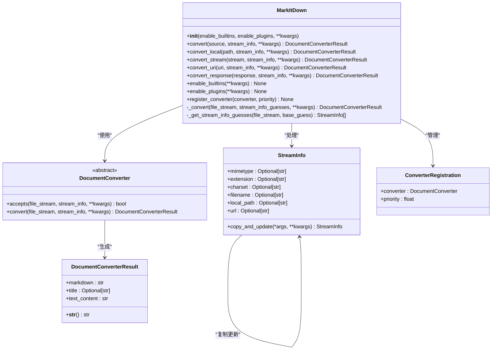
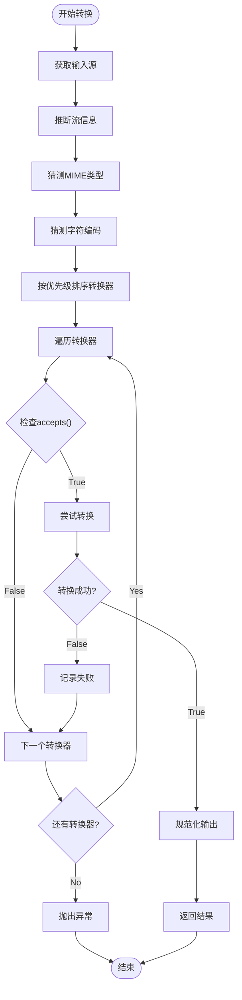

# MarkItDown API参考文档

<cite>
**本文档中引用的文件**
- [_markitdown.py](file://packages/markitdown/src/markitdown/_markitdown.py)
- [_base_converter.py](file://packages/markitdown/src/markitdown/_base_converter.py)
- [_stream_info.py](file://packages/markitdown/src/markitdown/_stream_info.py)
- [__init__.py](file://packages/markitdown/src/markitdown/__init__.py)
- [_exceptions.py](file://packages/markitdown/src/markitdown/_exceptions.py)
- [_plain_text_converter.py](file://packages/markitdown/src/markitdown/converters/_plain_text_converter.py)
- [_html_converter.py](file://packages/markitdown/src/markitdown/converters/_html_converter.py)
</cite>

## 目录
1. [简介](#简介)
2. [核心类架构](#核心类架构)
3. [MarkItDown主类](#markitdown主类)
4. [DocumentConverter基类](#documentconverter基类)
5. [DocumentConverterResult结果类](#documentconverterresult结果类)
6. [StreamInfo流信息类](#streaminfo流信息类)
7. [异常类型](#异常类型)
8. [转换器注册机制](#转换器注册机制)
9. [使用示例](#使用示例)

## 简介

MarkItDown是一个Python包，用于将各种文件格式转换为Markdown文本。它提供了统一的API接口，支持本地文件、网络资源和二进制流的转换，并内置了多种转换器来处理不同类型的文档。

## 核心类架构



**图表来源**
- [_markitdown.py](file://packages/markitdown/src/markitdown/_markitdown.py#L60-L777)
- [_base_converter.py](file://packages/markitdown/src/markitdown/_base_converter.py#L44-L105)
- [_stream_info.py](file://packages/markitdown/src/markitdown/_stream_info.py#L6-L32)

## MarkItDown主类

### 构造函数

```python
def __init__(
    self,
    *,
    enable_builtins: Union[None, bool] = None,
    enable_plugins: Union[None, bool] = None,
    **kwargs,
)
```

**参数说明：**

| 参数名 | 类型 | 默认值 | 描述 |
|--------|------|--------|------|
| `enable_builtins` | `Optional[bool]` | `None` | 是否启用内置转换器。默认为`None`时启用内置转换器 |
| `enable_plugins` | `Optional[bool]` | `None` | 是否启用插件转换器。默认为`None`时禁用插件 |
| `**kwargs` | `Any` | - | 传递给转换器的额外参数 |

**关键属性：**

| 属性名 | 类型 | 描述 |
|--------|------|------|
| `_builtins_enabled` | `bool` | 内置转换器是否已启用 |
| `_plugins_enabled` | `bool` | 插件转换器是否已启用 |
| `_requests_session` | `requests.Session` | HTTP请求会话对象 |
| `_converters` | `List[ConverterRegistration]` | 注册的转换器列表 |
| `_magika` | `magika.Magika` | 文件类型识别器 |

**节来源**
- [_markitdown.py](file://packages/markitdown/src/markitdown/_markitdown.py#L60-L100)

### 核心转换方法

#### convert方法

```python
def convert(
    self,
    source: Union[str, requests.Response, Path, BinaryIO],
    *,
    stream_info: Optional[StreamInfo] = None,
    **kwargs: Any,
) -> DocumentConverterResult
```

**功能描述：**
统一的转换入口方法，根据输入源的类型自动选择合适的转换策略。

**参数说明：**

| 参数名 | 类型 | 描述 |
|--------|------|------|
| `source` | `Union[str, requests.Response, Path, BinaryIO]` | 输入源，可以是字符串路径、URL、Path对象或二进制流 |
| `stream_info` | `Optional[StreamInfo]` | 可选的流信息对象，包含文件元数据 |
| `**kwargs` | `Any` | 传递给转换器的额外参数 |

**支持的输入类型：**
- 字符串路径或URL
- `requests.Response`对象
- `Path`对象
- 二进制IO对象

**返回值：** `DocumentConverterResult` - 转换结果对象

**异常：**
- `TypeError` - 不支持的输入类型

#### convert_local方法

```python
def convert_local(
    self,
    path: Union[str, Path],
    *,
    stream_info: Optional[StreamInfo] = None,
    file_extension: Optional[str] = None,
    url: Optional[str] = None,
    **kwargs: Any,
) -> DocumentConverterResult
```

**功能描述：**
专门处理本地文件的转换方法。

**参数说明：**

| 参数名 | 类型 | 描述 |
|--------|------|------|
| `path` | `Union[str, Path]` | 本地文件路径 |
| `stream_info` | `Optional[StreamInfo]` | 流信息对象 |
| `file_extension` | `Optional[str]` | 已废弃，请使用`stream_info` |
| `url` | `Optional[str]` | 已废弃，请使用`stream_info` |
| `**kwargs` | `Any` | 额外参数 |

**返回值：** `DocumentConverterResult` - 转换结果

#### convert_stream方法

```python
def convert_stream(
    self,
    stream: BinaryIO,
    *,
    stream_info: Optional[StreamInfo] = None,
    file_extension: Optional[str] = None,
    url: Optional[str] = None,
    **kwargs: Any,
) -> DocumentConverterResult
```

**功能描述：**
处理二进制流的转换方法，支持非可寻址流的内存缓冲。

**参数说明：**

| 参数名 | 类型 | 描述 |
|--------|------|------|
| `stream` | `BinaryIO` | 二进制输入流 |
| `stream_info` | `Optional[StreamInfo]` | 流信息对象 |
| `file_extension` | `Optional[str]` | 已废弃，请使用`stream_info` |
| `url` | `Optional[str]` | 已废弃，请使用`stream_info` |
| `**kwargs` | `Any` | 额外参数 |

**返回值：** `DocumentConverterResult` - 转换结果

#### convert_uri方法

```python
def convert_uri(
    self,
    uri: str,
    *,
    stream_info: Optional[StreamInfo] = None,
    file_extension: Optional[str] = None,
    mock_url: Optional[str] = None,
    **kwargs: Any,
) -> DocumentConverterResult
```

**功能描述：**
处理URI资源的转换方法，支持多种URI方案。

**支持的URI方案：**
- `file:` - 本地文件URI
- `data:` - 数据URI
- `http:` 和 `https:` - 网络资源

**参数说明：**

| 参数名 | 类型 | 描述 |
|--------|------|------|
| `uri` | `str` | URI字符串 |
| `stream_info` | `Optional[StreamInfo]` | 流信息对象 |
| `file_extension` | `Optional[str]` | 已废弃，请使用`stream_info` |
| `mock_url` | `Optional[str]` | 模拟的URL地址 |
| `**kwargs` | `Any` | 额外参数 |

**返回值：** `DocumentConverterResult` - 转换结果

**异常：**
- `ValueError` - 不支持的URI方案
- `ValueError` - 无效的文件URI（netloc不为空）

#### convert_response方法

```python
def convert_response(
    self,
    response: requests.Response,
    *,
    stream_info: Optional[StreamInfo] = None,
    file_extension: Optional[str] = None,
    url: Optional[str] = None,
    **kwargs: Any,
) -> DocumentConverterResult
```

**功能描述：**
处理HTTP响应的转换方法，从响应头提取文件信息。

**参数说明：**

| 参数名 | 类型 | 描述 |
|--------|------|------|
| `response` | `requests.Response` | HTTP响应对象 |
| `stream_info` | `Optional[StreamInfo]` | 流信息对象 |
| `file_extension` | `Optional[str]` | 已废弃，请使用`stream_info` |
| `url` | `Optional[str]` | 已废弃，请使用`stream_info` |
| `**kwargs` | `Any` | 额外参数 |

**返回值：** `DocumentConverterResult` - 转换结果

**节来源**
- [_markitdown.py](file://packages/markitdown/src/markitdown/_markitdown.py#L180-L777)

### 插件和转换器管理

#### enable_builtins方法

```python
def enable_builtins(self, **kwargs) -> None
```

**功能描述：**
启用并注册内置转换器，这些转换器处理常见的文件格式。

**支持的转换器：**
- 文本文件（`.txt`, `.md`, `.json`等）
- HTML文档
- PDF文件
- Word文档（`.docx`）
- Excel表格（`.xlsx`, `.xls`）
- PowerPoint演示文稿（`.pptx`）
- 图像文件
- 音频文件
- Outlook消息（`.msg`）
- 压缩文件（`.zip`）
- EPUB电子书
- CSV文件
- RSS订阅源
- 维基百科页面
- YouTube视频
- Bing搜索结果

**配置参数：**

| 参数名 | 类型 | 描述 |
|--------|------|------|
| `llm_client` | `Any` | LLM客户端实例 |
| `llm_model` | `str` | LLM模型名称 |
| `llm_prompt` | `str` | LLM提示模板 |
| `exiftool_path` | `str` | ExifTool工具路径 |
| `style_map` | `str` | 样式映射配置 |
| `docintel_endpoint` | `str` | Azure文档智能端点 |
| `docintel_credential` | `Any` | 文档智能凭据 |
| `docintel_file_types` | `List` | 支持的文件类型 |
| `docintel_api_version` | `str` | API版本 |

#### enable_plugins方法

```python
def enable_plugins(self, **kwargs) -> None
```

**功能描述：**
启用并注册插件提供的转换器。

**加载机制：**
- 通过`entry_points`发现插件
- 自动加载`markitdown.plugin`组中的插件
- 处理插件加载失败的情况

#### register_converter方法

```python
def register_converter(
    self,
    converter: DocumentConverter,
    *,
    priority: float = PRIORITY_SPECIFIC_FILE_FORMAT,
) -> None
```

**功能描述：**
注册自定义转换器到转换器列表中。

**优先级规则：**
- 默认优先级：`PRIORITY_SPECIFIC_FILE_FORMAT`（0.0）
- 通用转换器优先级：`PRIORITY_GENERIC_FILE_FORMAT`（10.0）
- 较低数值具有更高优先级
- 同优先级的转换器按注册顺序处理

**节来源**
- [_markitdown.py](file://packages/markitdown/src/markitdown/_markitdown.py#L102-L180)

## DocumentConverter基类

### accepts方法

```python
def accepts(
    self,
    file_stream: BinaryIO,
    stream_info: StreamInfo,
    **kwargs: Any,
) -> bool
```

**功能描述：**
快速判断转换器是否能够处理指定的文档。

**契约要求：**
- 方法签名与`convert()`方法匹配
- 在确定性操作中完成判断
- 不改变文件流位置
- 对于需要更多数据才能确定的转换器，必须重置流位置

**参数说明：**

| 参数名 | 类型 | 描述 |
|--------|------|------|
| `file_stream` | `BinaryIO` | 文件流对象，必须支持`seek()`, `tell()`, `read()`方法 |
| `stream_info` | `StreamInfo` | 包含文件元数据的对象 |
| `**kwargs` | `Any` | 传递给转换器的额外参数 |

**返回值：** `bool` - 如果转换器能处理文档则返回`True`

**异常：**
- `NotImplementedError` - 子类必须实现此方法

### convert方法

```python
def convert(
    self,
    file_stream: BinaryIO,
    stream_info: StreamInfo,
    **kwargs: Any,
) -> DocumentConverterResult
```

**功能描述：**
将文档转换为Markdown格式。

**参数说明：**

| 参数名 | 类型 | 描述 |
|--------|------|------|
| `file_stream` | `BinaryIO` | 文件流对象 |
| `stream_info` | `StreamInfo` | 流信息对象 |
| `**kwargs` | `Any` | 额外参数 |

**返回值：** `DocumentConverterResult` - 转换结果

**异常：**
- `FileConversionException` - 格式被识别但转换失败
- `MissingDependencyException` - 缺少必需的依赖项

**节来源**
- [_base_converter.py](file://packages/markitdown/src/markitdown/_base_converter.py#L44-L105)

## DocumentConverterResult结果类

### 构造函数

```python
def __init__(
    self,
    markdown: str,
    *,
    title: Optional[str] = None,
)
```

**参数说明：**

| 参数名 | 类型 | 必需 | 描述 |
|--------|------|------|------|
| `markdown` | `str` | 是 | 转换后的Markdown文本 |
| `title` | `Optional[str]` | 否 | 文档标题 |

### 属性

| 属性名 | 类型 | 描述 |
|--------|------|------|
| `markdown` | `str` | 转换后的Markdown内容 |
| `title` | `Optional[str]` | 文档标题 |
| `text_content` | `str` | 软弃用的别名，等同于`markdown` |

### 方法

#### __str__方法

```python
def __str__(self) -> str
```

**功能描述：**
返回转换后的Markdown文本。

**返回值：** `str` - Markdown内容

**节来源**
- [_base_converter.py](file://packages/markitdown/src/markitdown/_base_converter.py#L6-L42)

## StreamInfo流信息类

### 构造函数

```python
@dataclass(kw_only=True, frozen=True)
class StreamInfo:
    mimetype: Optional[str] = None
    extension: Optional[str] = None
    charset: Optional[str] = None
    filename: Optional[str] = None
    local_path: Optional[str] = None
    url: Optional[str] = None
```

### 字段说明

| 字段名 | 类型 | 描述 |
|--------|------|------|
| `mimetype` | `Optional[str]` | MIME类型（如`text/html`, `application/pdf`） |
| `extension` | `Optional[str]` | 文件扩展名（如`.pdf`, `.docx`） |
| `charset` | `Optional[str]` | 字符编码（如`utf-8`, `iso-8859-1`） |
| `filename` | `Optional[str]` | 文件名（来自本地路径、URL或Content-Disposition头） |
| `local_path` | `Optional[str]` | 本地文件路径 |
| `url` | `Optional[str]` | 来自网络的URL |

### copy_and_update方法

```python
def copy_and_update(self, *args, **kwargs):
```

**功能描述：**
创建一个新的`StreamInfo`对象并更新其字段。

**参数说明：**

| 参数名 | 类型 | 描述 |
|--------|------|------|
| `*args` | `StreamInfo` | 其他`StreamInfo`对象，其非空字段将被合并 |
| `**kwargs` | `Any` | 键值对形式的字段更新 |

**返回值：** `StreamInfo` - 更新后的新对象

**使用示例：**
```python
# 基于现有对象创建新对象
base_info = StreamInfo(mimetype="text/html", charset="utf-8")
updated_info = base_info.copy_and_update(extension=".html", filename="index.html")

# 合并多个StreamInfo对象
other_info = StreamInfo(filename="document.pdf", mimetype="application/pdf")
merged_info = base_info.copy_and_update(other_info)
```

**节来源**
- [_stream_info.py](file://packages/markitdown/src/markitdown/_stream_info.py#L6-L32)

## 异常类型

### MarkItDownException

```python
class MarkItDownException(Exception):
    """MarkItDown的基础异常类"""
```

所有MarkItDown相关异常的基类。

### MissingDependencyException

```python
class MissingDependencyException(MarkItDownException):
    """当转换器所需的依赖项未安装时抛出"""
```

**用途：**
- 转换器无法正常工作时的错误处理
- 提供清晰的依赖项缺失信息
- 允许系统跳过有问题的转换器

### UnsupportedFormatException

```python
class UnsupportedFormatException(MarkItDownException):
    """当没有合适的转换器可用于给定文件时抛出"""
```

**触发条件：**
- 找不到支持的转换器
- 文件格式完全不受支持

### FileConversionException

```python
class FileConversionException(MarkItDownException):
    def __init__(
        self,
        message: Optional[str] = None,
        attempts: Optional[List[FailedConversionAttempt]] = None,
    )
```

**功能描述：**
当找到合适的转换器但转换过程失败时抛出。

**属性：**
- `attempts` - 失败的转换尝试列表

**异常信息格式：**
```
File conversion failed after N attempts:
- ConverterName threw ExceptionType with message: error_message
```

### FailedConversionAttempt

```python
class FailedConversionAttempt(object):
    def __init__(self, converter: Any, exc_info: Optional[tuple] = None):
        self.converter = converter
        self.exc_info = exc_info
```

**功能描述：**
表示单次文件转换尝试的结果。

**属性：**
- `converter` - 尝试转换的转换器对象
- `exc_info` - 异常信息（类型、值、回溯）

**节来源**
- [_exceptions.py](file://packages/markitdown/src/markitdown/_exceptions.py#L1-L76)

## 转换器注册机制

### ConverterRegistration类

```python
@dataclass(kw_only=True, frozen=True)
class ConverterRegistration:
    converter: DocumentConverter
    priority: float
```

**功能描述：**
封装转换器及其优先级信息。

**优先级规则：**
- 数值越小优先级越高
- 默认优先级：
  - 特定文件格式：`PRIORITY_SPECIFIC_FILE_FORMAT`（0.0）
  - 通用文件格式：`PRIORITY_GENERIC_FILE_FORMAT`（10.0）
- 排序时使用稳定排序算法

### 转换流程



**图表来源**
- [_markitdown.py](file://packages/markitdown/src/markitdown/_markitdown.py#L540-L620)

**节来源**
- [_markitdown.py](file://packages/markitdown/src/markitdown/_markitdown.py#L540-L777)

## 使用示例

### 基础使用

```python
from markitdown import MarkItDown

# 创建MarkItDown实例
md = MarkItDown()

# 转换本地文件
result = md.convert("document.pdf")
print(result.text_content)  # 获取Markdown内容
print(result.title)         # 获取文档标题

# 转换网络资源
result = md.convert("https://example.com/document.docx")
```

### 高级配置

```python
from markitdown import MarkItDown, StreamInfo

# 启用插件
md = MarkItDown(enable_plugins=True)

# 自定义转换器
class CustomConverter(DocumentConverter):
    def accepts(self, file_stream, stream_info, **kwargs):
        return stream_info.mimetype == "custom/format"
    
    def convert(self, file_stream, stream_info, **kwargs):
        # 实现自定义转换逻辑
        content = file_stream.read().decode('utf-8')
        return DocumentConverterResult(
            markdown=f"# Custom Format\n{content}",
            title="Custom Document"
        )

# 注册自定义转换器
md.register_converter(CustomConverter(), priority=5.0)

# 使用流信息进行精确控制
stream_info = StreamInfo(
    mimetype="application/pdf",
    extension=".pdf",
    charset="utf-8"
)
result = md.convert("document.pdf", stream_info=stream_info)
```

### 错误处理

```python
from markitdown import MarkItDown, FileConversionException, UnsupportedFormatException

md = MarkItDown()

try:
    result = md.convert("unsupported_format.xyz")
except UnsupportedFormatException as e:
    print(f"不支持的文件格式: {e}")
except FileConversionException as e:
    print(f"转换失败: {e}")
    for attempt in e.attempts:
        print(f"转换器 {type(attempt.converter).__name__} 失败: {attempt.exc_info}")
```

### 流式处理

```python
from markitdown import MarkItDown, StreamInfo
import requests

md = MarkItDown()

# 处理HTTP响应
response = requests.get("https://example.com/large-document.pdf")
stream_info = StreamInfo(
    mimetype=response.headers.get("content-type"),
    filename="large-document.pdf"
)
result = md.convert_response(response, stream_info=stream_info)

# 处理二进制流
with open("document.pdf", "rb") as f:
    result = md.convert_stream(f, stream_info=stream_info)
```

**节来源**
- [README.md](file://packages/markitdown/README.md#L20-L52)