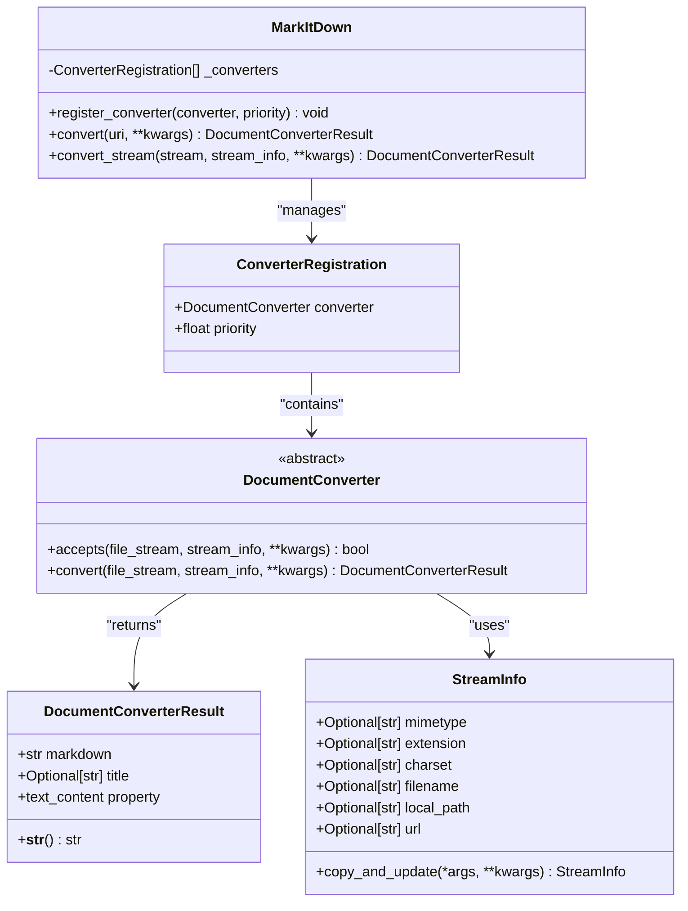
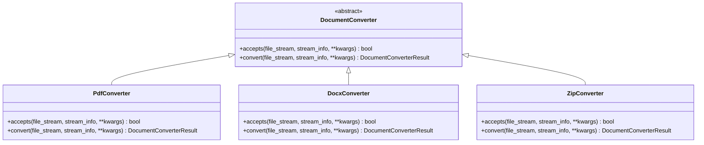
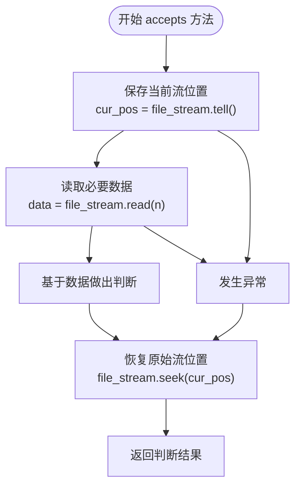
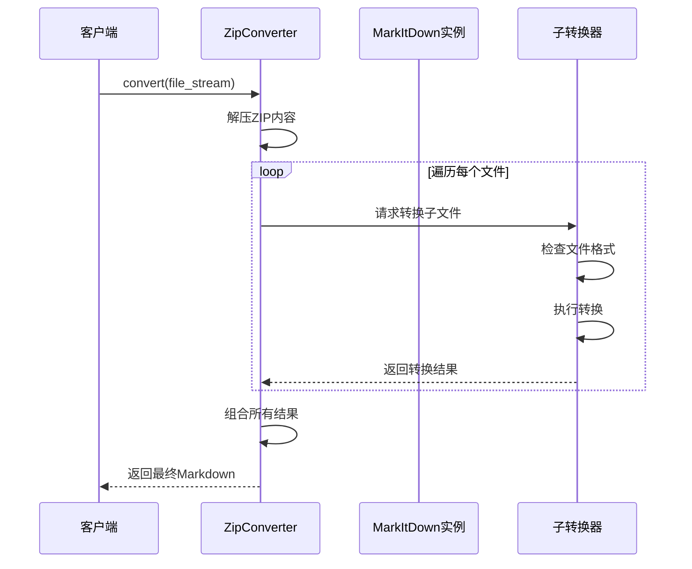
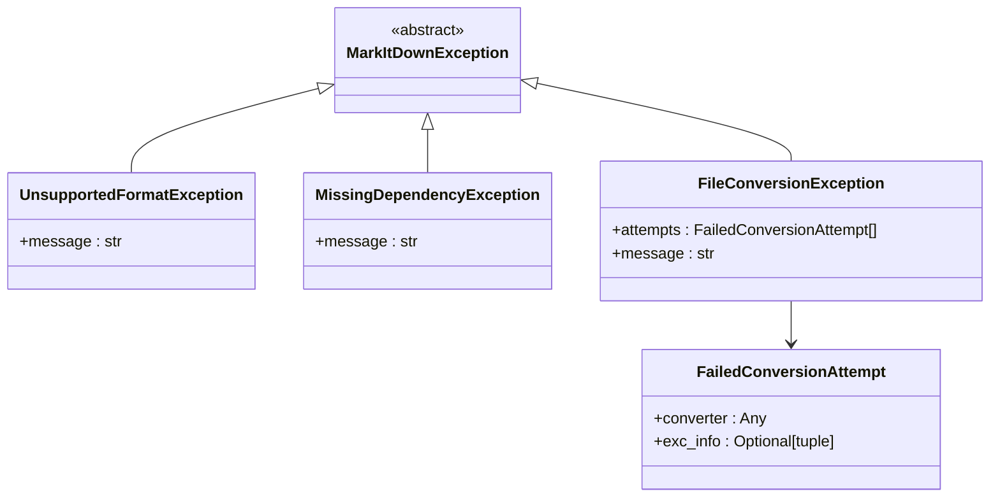

# DocumentConverter 基类 API 文档

<cite>
**本文档中引用的文件**
- [_base_converter.py](file://packages/markitdown/src/markitdown/_base_converter.py)
- [_exceptions.py](file://packages/markitdown/src/markitdown/_exceptions.py)
- [_stream_info.py](file://packages/markitdown/src/markitdown/_stream_info.py)
- [_markitdown.py](file://packages/markitdown/src/markitdown/_markitdown.py)
- [_pdf_converter.py](file://packages/markitdown/src/markitdown/converters/_pdf_converter.py)
- [_docx_converter.py](file://packages/markitdown/src/markitdown/converters/_docx_converter.py)
- [_zip_converter.py](file://packages/markitdown/src/markitdown/converters/_zip_converter.py)
- [_outlook_msg_converter.py](file://packages/markitdown/src/markitdown/converters/_outlook_msg_converter.py)
- [_plugin.py](file://packages/markitdown-sample-plugin/src/markitdown_sample_plugin/_plugin.py)
</cite>

## 目录
1. [简介](#简介)
2. [核心架构](#核心架构)
3. [DocumentConverter 基类详解](#documentconverter-基类详解)
4. [DocumentConverterResult 结果类](#documentconverterresult-结果类)
5. [accepts 方法契约](#accepts-方法契约)
6. [convert 抽象方法](#convert-抽象方法)
7. [_parent_converters 机制](#_parent_converters-机制)
8. [异常处理规范](#异常处理规范)
9. [自定义转换器实现指南](#自定义转换器实现指南)
10. [最佳实践示例](#最佳实践示例)
11. [总结](#总结)

## 简介

DocumentConverter 是 MarkItDown 项目中的核心抽象基类，为所有文档转换器提供了统一的接口规范。该基类定义了两个关键方法：`accepts()` 用于快速判断是否支持特定文件类型，`convert()` 用于执行实际的文档转换操作。

该设计模式确保了转换器的一致性和可扩展性，同时支持复杂的嵌套格式处理和灵活的异常处理机制。

## 核心架构



**图表来源**
- [_base_converter.py](file://packages/markitdown/src/markitdown/_base_converter.py#L41-L106)
- [_stream_info.py](file://packages/markitdown/src/markitdown/_stream_info.py#L6-L32)
- [_markitdown.py](file://packages/markitdown/src/markitdown/_markitdown.py#L620-L651)

## DocumentConverter 基类详解

DocumentConverter 是所有文档转换器的抽象基类，定义了转换器的标准接口。该类采用模板方法模式，要求子类实现两个核心方法。

### 类结构概览



**图表来源**
- [_base_converter.py](file://packages/markitdown/src/markitdown/_base_converter.py#L41-L106)
- [_pdf_converter.py](file://packages/markitdown/src/markitdown/converters/_pdf_converter.py#L25-L77)
- [_docx_converter.py](file://packages/markitdown/src/markitdown/converters/_docx_converter.py#L25-L90)
- [_zip_converter.py](file://packages/markitdown/src/markitdown/converters/_zip_converter.py#L25-L116)

**章节来源**
- [_base_converter.py](file://packages/markitdown/src/markitdown/_base_converter.py#L41-L106)

## DocumentConverterResult 结果类

DocumentConverterResult 是转换操作的标准化输出结果，封装了转换后的 Markdown 内容和相关元数据。

### 核心属性

| 属性名 | 类型 | 描述 | 必需性 |
|--------|------|------|--------|
| markdown | str | 转换后的 Markdown 文本内容 | 必需 |
| title | Optional[str] | 文档标题（可选） | 可选 |

### 关键特性

- **向后兼容性**：提供 `text_content` 属性作为 `markdown` 的软弃用别名
- **字符串化支持**：实现了 `__str__()` 方法直接返回 Markdown 内容
- **元数据管理**：支持文档标题等额外元数据

**章节来源**
- [_base_converter.py](file://packages/markitdown/src/markitdown/_base_converter.py#L5-L39)

## accepts 方法契约

`accepts()` 方法是转换器的第一道筛选器，负责基于输入流和元数据快速判断是否能够处理特定文件类型。

### 方法签名

```python
def accepts(
    self,
    file_stream: BinaryIO,
    stream_info: StreamInfo,
    **kwargs: Any,
) -> bool
```

### 判断依据

accepts 方法主要基于以下信息进行判断：

1. **MIME 类型检查**：优先使用 `stream_info.mimetype`
2. **文件扩展名验证**：检查 `stream_info.extension`
3. **特殊 URL 处理**：对于 HTTP 获取的数据，参考 `stream_info.url`
4. **文件名识别**：对已知文件名（如 Dockerfile、Makefile）进行特殊处理

### 重要约束

#### 流位置保持原则

**核心要求**：`accepts()` 方法不得改变文件流的位置，即使需要读取数据也必须在读取后重置位置。



**图表来源**
- [_base_converter.py](file://packages/markitdown/src/markitdown/_base_converter.py#L66-L68)
- [_outlook_msg_converter.py](file://packages/markitdown/src/markitdown/converters/_outlook_msg_converter.py#L44-L70)

#### kwargs 兼容性设计

accepts 方法的签名与 convert 方法完全一致，确保了方法签名的一致性。这种设计保证了：

- **一致性保障**：如果 `accepts()` 返回 True，则 `convert()` 应该能够成功处理
- **参数传递**：允许转换器访问相同的配置选项
- **扩展性**：支持未来可能的参数扩展

**章节来源**
- [_base_converter.py](file://packages/markitdown/src/markitdown/_base_converter.py#L41-L85)
- [_outlook_msg_converter.py](file://packages/markitdown/src/markitdown/converters/_outlook_msg_converter.py#L44-L70)

## convert 抽象方法

`convert()` 方法是转换器的核心实现，负责执行实际的文档转换操作并返回标准化的结果。

### 方法签名

```python
def convert(
    self,
    file_stream: BinaryIO,
    stream_info: StreamInfo,
    **kwargs: Any,
) -> DocumentConverterResult
```

### 实现职责

1. **依赖检查**：验证必需的外部依赖是否可用
2. **格式验证**：确认文件格式的有效性
3. **转换执行**：调用适当的转换算法
4. **结果封装**：创建 DocumentConverterResult 对象

### 异常处理规范

convert 方法应抛出以下异常：

- **FileConversionException**：当文件格式被识别但转换失败时
- **MissingDependencyException**：当缺少必要的依赖包时

**章节来源**
- [_base_converter.py](file://packages/markitdown/src/markitdown/_base_converter.py#L87-L106)

## _parent_converters 机制

_markitdown 属性支持嵌套格式处理，特别是处理包含其他文件的复杂格式（如 ZIP 文件）。

### 工作原理



**图表来源**
- [_zip_converter.py](file://packages/markitdown/src/markitdown/converters/_zip_converter.py#L95-L115)

### 应用场景

1. **ZIP 文件处理**：递归解压并转换压缩包内的所有文件
2. **EPUB 文档**：提取书籍内容并转换为 Markdown
3. **复合格式**：处理包含多种子格式的复杂文档

**章节来源**
- [_zip_converter.py](file://packages/markitdown/src/markitdown/converters/_zip_converter.py#L52-L93)

## 异常处理规范

### 异常层次结构



**图表来源**
- [_exceptions.py](file://packages/markitdown/src/markitdown/_exceptions.py#L10-L76)

### 异常使用场景

| 异常类型 | 触发条件 | 处理策略 |
|----------|----------|----------|
| UnsupportedFormatException | 没有找到合适的转换器 | 抛出异常，终止转换过程 |
| MissingDependencyException | 转换器依赖未安装 | 提供详细的安装指导信息 |
| FileConversionException | 转换器找到但转换失败 | 记录失败尝试，提供错误详情 |

### 错误消息格式

FileConversionException 使用结构化的错误消息格式，包含：
- 总体错误描述
- 失败尝试列表
- 每个尝试的转换器名称和异常信息

**章节来源**
- [_exceptions.py](file://packages/markitdown/src/markitdown/_exceptions.py#L10-L76)

## 自定义转换器实现指南

### 基础实现模板

以下是实现自定义转换器的标准模板：

```python
# 参考实现路径：packages/markitdown-sample-plugin/src/markitdown_sample_plugin/_plugin.py
```

### 实现步骤

1. **继承 DocumentConverter 基类**
2. **实现 accepts 方法**
   - 检查 MIME 类型
   - 验证文件扩展名
   - 必要时读取文件头进行魔数检测
3. **实现 convert 方法**
   - 检查依赖
   - 执行转换逻辑
   - 返回 DocumentConverterResult
4. **注册转换器**

### 魔数检测示例

对于需要魔数检测的文件格式，实现模式如下：

```python
# 参考实现路径：packages/markitdown/src/markitdown/converters/_outlook_msg_converter.py
```

### 依赖检查模式

```python
# 参考实现路径：packages/markitdown/src/markitdown/converters/_pdf_converter.py
```

**章节来源**
- [_plugin.py](file://packages/markitdown-sample-plugin/src/markitdown_sample_plugin/_plugin.py#L25-L54)
- [_outlook_msg_converter.py](file://packages/markitdown/src/markitdown/converters/_outlook_msg_converter.py#L44-L70)
- [_pdf_converter.py](file://packages/markitdown/src/markitdown/converters/_pdf_converter.py#L25-L77)

## 最佳实践示例

### PDF 转换器实现

PDF 转换器展示了标准的 accepts 和 convert 实现模式：

```python
# 参考实现路径：packages/markitdown/src/markitdown/converters/_pdf_converter.py
```

特点：
- 基于 MIME 类型和扩展名的双重检查
- 依赖项的延迟加载和错误处理
- 使用 pdfminer 进行文本提取

### DOCX 转换器实现

DOCX 转换器展示了继承和组合的设计模式：

```python
# 参考实现路径：packages/markitdown/src/markitdown/converters/_docx_converter.py
```

特点：
- 继承 HtmlConverter 以复用 HTML 转换逻辑
- 使用 mammoth 进行 DOCX 到 HTML 转换
- 支持样式映射配置

### ZIP 转换器实现

ZIP 转换器展示了 _parent_converters 机制的使用：

```python
# 参考实现路径：packages/markitdown/src/markitdown/converters/_zip_converter.py
```

特点：
- 递归处理压缩包内的所有文件
- 使用 MarkItDown 实例处理子文件
- 提供清晰的文件结构层次

**章节来源**
- [_pdf_converter.py](file://packages/markitdown/src/markitdown/converters/_pdf_converter.py#L25-L77)
- [_docx_converter.py](file://packages/markitdown/src/markitdown/converters/_docx_converter.py#L25-L90)
- [_zip_converter.py](file://packages/markitdown/src/markitdown/converters/_zip_converter.py#L25-L116)

## 总结

DocumentConverter 基类为 MarkItDown 项目提供了强大而灵活的文档转换框架。其核心优势包括：

### 设计优势

1. **统一接口**：通过抽象基类确保所有转换器的一致性
2. **快速筛选**：accepts 方法提供高效的格式预检查
3. **流安全**：严格的流位置保持原则避免状态污染
4. **异常友好**：完善的异常处理机制便于调试和维护
5. **扩展性强**：支持嵌套格式处理和插件系统

### 开发建议

1. **遵循契约**：严格遵守 accepts 方法的流位置保持原则
2. **优雅降级**：在 convert 方法中妥善处理各种异常情况
3. **性能优化**：在 accepts 方法中尽可能早地做出判断
4. **文档完善**：为自定义转换器提供清晰的使用文档

### 架构价值

DocumentConverter 基类不仅是一个技术实现，更是 MarkItDown 项目架构设计理念的体现——通过抽象和标准化构建可扩展、可维护的文档处理生态系统。