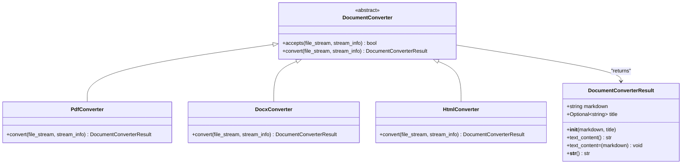
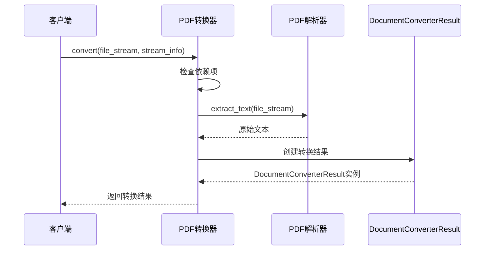
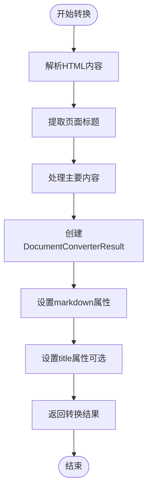
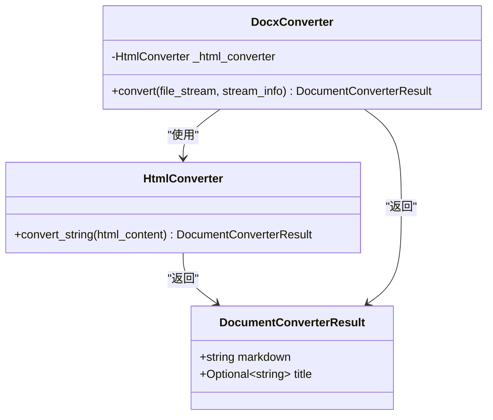
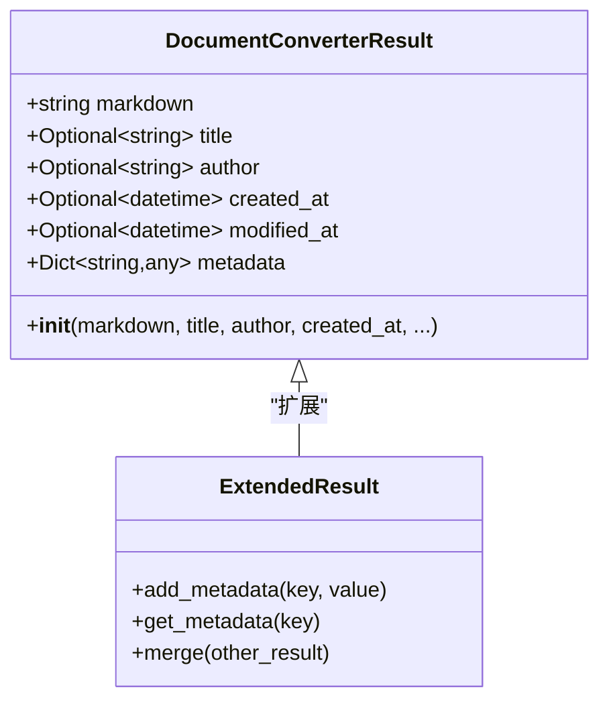

# DocumentConverterResult类技术文档

<cite>
**本文档引用的文件**
- [_base_converter.py](file://packages/markitdown/src/markitdown/_base_converter.py)
- [_pdf_converter.py](file://packages/markitdown/src/markitdown/converters/_pdf_converter.py)
- [_docx_converter.py](file://packages/markitdown/src/markitdown/converters/_docx_converter.py)
- [_html_converter.py](file://packages/markitdown/src/markitdown/converters/_html_converter.py)
- [_markitdown.py](file://packages/markitdown/src/markitdown/_markitdown.py)
- [test_module_vectors.py](file://packages/markitdown/tests/test_module_vectors.py)
</cite>

## 目录
1. [简介](#简介)
2. [类定义与核心结构](#类定义与核心结构)
3. [核心属性详解](#核心属性详解)
4. [兼容性设计：text_content属性](#兼容性设计text_content属性)
5. [字符串转换机制](#字符串转换机制)
6. [不可变性设计原则](#不可变性设计原则)
7. [实际使用示例](#实际使用示例)
8. [扩展性设计](#扩展性设计)
9. [最佳实践指南](#最佳实践指南)
10. [总结](#总结)

## 简介

DocumentConverterResult是MarkItDown项目中所有文档转换器的统一返回类型，作为转换流程的核心数据容器。该类的设计体现了单一职责原则，专门负责封装转换后的Markdown内容和相关元数据，为上层应用提供一致的数据接口。

该类采用简洁而强大的设计理念，通过最少的属性组合实现了灵活的文档转换结果表示，同时预留了扩展空间以适应未来可能增加的元数据需求。

## 类定义与核心结构

DocumentConverterResult类位于基础转换器模块中，是一个轻量级的数据容器类：



**图表来源**
- [_base_converter.py](file://packages/markitdown/src/markitdown/_base_converter.py#L4-L38)
- [_pdf_converter.py](file://packages/markitdown/src/markitdown/converters/_pdf_converter.py#L25-L77)
- [_docx_converter.py](file://packages/markitdown/src/markitdown/converters/_docx_converter.py#L35-L90)
- [_html_converter.py](file://packages/markitdown/src/markitdown/converters/_html_converter.py#L35-L90)

**章节来源**
- [_base_converter.py](file://packages/markitdown/src/markitdown/_base_converter.py#L4-L38)

## 核心属性详解

### markdown属性

`markdown`属性是DocumentConverterResult的核心组成部分，存储转换后的Markdown格式文本内容。该属性具有以下特征：

- **必需性**：作为构造函数的唯一必填参数，确保每个转换结果都包含有效的Markdown内容
- **不可变性**：通过直接赋值的方式设置，不提供setter方法，保证数据完整性
- **语义明确**：属性名称清晰表达其存储的内容类型，避免歧义

### title属性

`title`属性提供可选的文档标题信息，用于标识转换后的内容主题：

- **可选性**：允许为None，适用于无法提取标题或不需要标题的场景
- **灵活性**：支持各种标题格式，包括纯文本、HTML标记等
- **实用性**：为上层应用提供内容导航和分类的基础信息

**章节来源**
- [_base_converter.py](file://packages/markitdown/src/markitdown/_base_converter.py#L10-L25)

## 兼容性设计：text_content属性

为了维护向后兼容性和提供更灵活的访问方式，DocumentConverterResult提供了`text_content`属性作为`markdown`属性的软弃用别名：

### 设计意图

`text_content`属性的设计体现了渐进式迁移策略：
- **兼容性保障**：现有代码可以继续使用旧属性名，避免破坏性变更
- **迁移引导**：通过文档注释鼓励开发者迁移到新的`markdown`属性
- **双重访问**：同时提供getter和setter方法，确保功能一致性

### 使用建议

```python
# 推荐方式 - 使用新属性
result = DocumentConverterResult(markdown="内容", title="标题")
print(result.markdown)  # 明确表达语义

# 兼容方式 - 继续使用旧属性
result = DocumentConverterResult(markdown="内容", title="标题")
print(result.text_content)  # 保持向后兼容
```

### 迁移策略

开发团队应遵循以下迁移原则：
1. **新代码优先使用markdown属性**
2. **逐步替换现有text_content引用**
3. **最终版本中考虑完全移除text_content属性**

**章节来源**
- [_base_converter.py](file://packages/markitdown/src/markitdown/_base_converter.py#L27-L35)

## 字符串转换机制

DocumentConverterResult实现了`__str__`魔术方法，提供便捷的字符串隐式转换功能：

### 实现原理

`__str__`方法直接返回`markdown`属性的值，实现以下特性：
- **透明转换**：当对象被转换为字符串时，自动返回Markdown内容
- **简化操作**：减少显式的属性访问调用
- **兼容性好**：与Python标准库和其他框架的字符串处理兼容

### 使用场景

```python
# 场景1：直接打印结果
result = DocumentConverterResult("这是Markdown内容")
print(result)  # 自动调用__str__，输出Markdown内容

# 场景2：字符串拼接
result = DocumentConverterResult("# 标题\n内容")
formatted = f"文档内容：\n{result}\n结束"

# 场景3：序列化到JSON
import json
result = DocumentConverterResult("内容")
json_str = json.dumps({"content": str(result)})
```

### 性能考虑

`__str__`方法的实现简单高效，避免了不必要的计算开销，适合频繁的字符串转换操作。

**章节来源**
- [_base_converter.py](file://packages/markitdown/src/markitdown/_base_converter.py#L37-L40)

## 不可变性设计原则

DocumentConverterResult严格遵循不可变性设计原则，这一设计选择带来了多重优势：

### 设计原则

1. **构造时初始化**：所有属性必须在构造函数中一次性初始化
2. **禁止后续修改**：不提供setter方法，防止意外修改
3. **线程安全**：不可变对象天然支持多线程环境下的安全访问

### 实现方式

```python
# 正确的使用方式
result = DocumentConverterResult(
    markdown="转换后的Markdown内容",
    title="文档标题"
)

# 错误的使用方式 - 尝试修改属性
# result.markdown = "新内容"  # 这将引发AttributeError
```

### 优势分析

- **数据完整性**：确保转换结果在整个生命周期内保持一致
- **调试友好**：便于追踪数据流和问题定位
- **性能优化**：减少不必要的状态检查和同步开销
- **设计清晰**：明确表达数据容器的职责边界

**章节来源**
- [_base_converter.py](file://packages/markitdown/src/markitdown/_base_converter.py#L10-L25)

## 实际使用示例

DocumentConverterResult在各种转换器中都有广泛应用，以下是典型使用场景：

### PDF转换器示例

PDF转换器展示了最简单的使用模式：



**图表来源**
- [_pdf_converter.py](file://packages/markitdown/src/markitdown/converters/_pdf_converter.py#L50-L77)

### HTML转换器示例

HTML转换器展示了更复杂的使用模式，包含标题提取：



**图表来源**
- [_html_converter.py](file://packages/markitdown/src/markitdown/converters/_html_converter.py#L45-L75)

### DOCX转换器示例

DOCX转换器展示了基于其他转换器的复合使用模式：



**图表来源**
- [_docx_converter.py](file://packages/markitdown/src/markitdown/converters/_docx_converter.py#L55-L85)

**章节来源**
- [_pdf_converter.py](file://packages/markitdown/src/markitdown/converters/_pdf_converter.py#L50-L77)
- [_html_converter.py](file://packages/markitdown/src/markitdown/converters/_html_converter.py#L45-L75)
- [_docx_converter.py](file://packages/markitdown/src/markitdown/converters/_docx_converter.py#L55-L85)

## 扩展性设计

DocumentConverterResult采用了开放封闭原则（Open/Closed Principle），为未来的功能扩展预留了空间：

### 当前扩展点

1. **元数据字段**：title属性已经证明了扩展的可能性
2. **内容类型**：支持多种内容格式的存储需求
3. **关联信息**：可以添加作者、创建时间、修改时间等元数据

### 未来扩展方向



### 设计原则

- **向后兼容**：新属性默认为None，不影响现有代码
- **渐进增强**：新功能可以通过条件判断优雅集成
- **接口稳定**：核心接口保持不变，仅扩展非关键功能

**章节来源**
- [_base_converter.py](file://packages/markitdown/src/markitdown/_base_converter.py#L15-L20)

## 最佳实践指南

基于对实际使用场景的分析，以下是推荐的最佳实践：

### 构造函数使用

```python
# 推荐：明确指定参数
result = DocumentConverterResult(
    markdown="# 文档标题\n这是正文内容",
    title="文档标题"
)

# 避免：使用位置参数
# result = DocumentConverterResult("内容", "标题")  # 可读性差
```

### 属性访问模式

```python
# 推荐：明确的属性访问
result = DocumentConverterResult("内容", "标题")
content = result.markdown
title = result.title

# 避免：过度使用text_content
# content = result.text_content  # 应优先使用markdown
```

### 字符串处理

```python
# 推荐：利用__str__方法
result = DocumentConverterResult("内容")
processed = f"文档：\n{result}\n"

# 避免：重复访问markdown属性
# processed = f"文档：\n{result.markdown}\n{result.markdown}"  # 冗余
```

### 错误处理

```python
# 推荐：检查结果有效性
result = converter.convert(file_stream, stream_info)
if result.markdown:  # 检查内容是否为空
    process_markdown(result.markdown)
else:
    log_warning("转换结果为空")
```

### 性能优化

```python
# 推荐：避免不必要的字符串转换
result = DocumentConverterResult("内容")
# 直接使用result而不是str(result)

# 避免：频繁的字符串转换
# for item in items:
#     print(str(item))  # 多次调用__str__
```

## 总结

DocumentConverterResult类作为MarkItDown项目的核心数据容器，展现了优秀的软件设计原则：

### 关键设计亮点

1. **简洁性**：最小化的属性设计，专注于核心功能
2. **一致性**：统一的返回类型，简化上层应用逻辑
3. **扩展性**：预留的扩展点，支持未来功能增强
4. **兼容性**：软弃用机制，平滑的迁移路径
5. **不可变性**：数据完整性和线程安全的保障

### 技术价值

该类不仅解决了文档转换结果的标准化问题，更为整个转换器生态系统提供了可靠的数据交换基础。通过合理的抽象和设计，它成功地平衡了功能性、可维护性和扩展性的需求。

### 发展前景

随着MarkItDown项目的持续发展，DocumentConverterResult有望成为文档处理领域的一个参考实现，其设计理念和实践经验可以为类似项目提供有价值的借鉴。