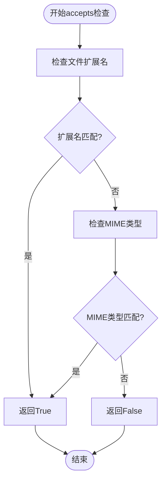
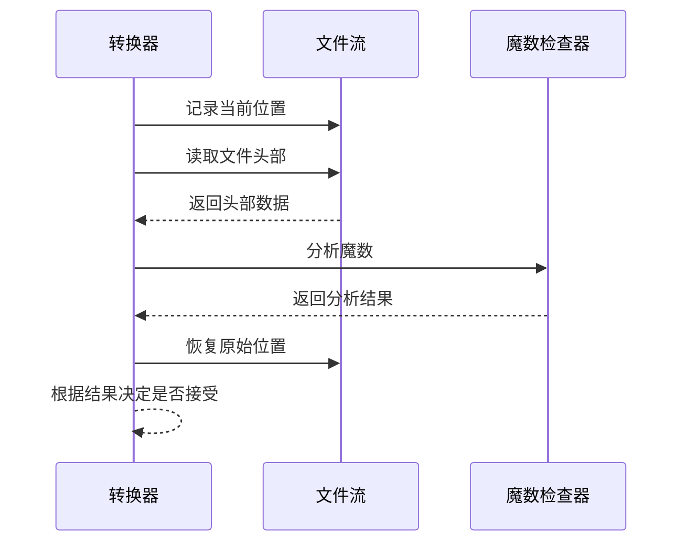
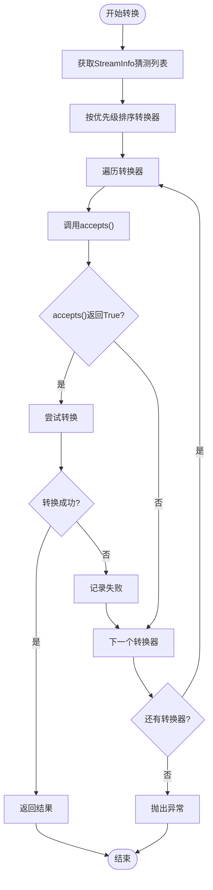

# accepts方法详解

<cite>
**本文档中引用的文件**
- [_base_converter.py](file://packages/markitdown/src/markitdown/_base_converter.py)
- [_stream_info.py](file://packages/markitdown/src/markitdown/_stream_info.py)
- [_outlook_msg_converter.py](file://packages/markitdown/src/markitdown/converters/_outlook_msg_converter.py)
- [_pdf_converter.py](file://packages/markitdown/src/markitdown/converters/_pdf_converter.py)
- [_docx_converter.py](file://packages/markitdown/src/markitdown/converters/_docx_converter.py)
- [_html_converter.py](file://packages/markitdown/src/markitdown/converters/_html_converter.py)
- [_markitdown.py](file://packages/markitdown/src/markitdown/_markitdown.py)
</cite>

## 目录
1. [简介](#简介)
2. [方法签名与设计契约](#方法签名与设计契约)
3. [核心参数详解](#核心参数详解)
4. [StreamInfo字段的应用](#streaminfo字段的应用)
5. [实现模式分析](#实现模式分析)
6. [特殊处理场景](#特殊处理场景)
7. [转换器选择机制](#转换器选择机制)
8. [最佳实践指南](#最佳实践指南)
9. [常见问题与解决方案](#常见问题与解决方案)
10. [总结](#总结)

## 简介

`accepts()`方法是DocumentConverter基类的核心抽象方法，负责快速判断当前转换器是否能够处理指定的文件类型。该方法在MarkItDown转换流程中扮演着关键的前置筛选角色，确保只有合适的转换器才会尝试进行实际的转换操作。

该方法的设计遵循严格的契约要求：
- **快速判断**：基于metadata信息进行初步筛选
- **流位置保护**：读取流后必须重置位置，确保convert()方法能正确执行
- **签名一致性**：与convert()方法保持相同的参数签名

## 方法签名与设计契约

### 基本签名结构

```python
def accepts(
    self,
    file_stream: BinaryIO,
    stream_info: StreamInfo,
    **kwargs: Any,
) -> bool:
```

### 设计契约要点

1. **快速响应**：方法应该在最短时间内返回结果，避免复杂的计算
2. **幂等性**：多次调用should_accept()不应产生副作用
3. **完整性检查**：确保所有必要的依赖都已满足
4. **流位置一致性**：无论成功与否，都必须保证file_stream的位置不变

**节来源**
- [_base_converter.py](file://packages/markitdown/src/markitdown/_base_converter.py#L41-L64)

## 核心参数详解

### file_stream参数

`file_stream`是一个二进制文件流对象，必须支持以下方法：
- `tell()`：获取当前读取位置
- `seek(position)`：移动到指定位置
- `read(size)`：读取指定字节数

该流对象代表待转换的原始文件数据，转换器可以安全地读取少量数据进行头部分析。

### stream_info参数

`StreamInfo`是一个包含文件元数据的数据类，主要字段包括：

| 字段名 | 类型 | 描述 | 在accepts中的用途 |
|--------|------|------|-------------------|
| mimetype | Optional[str] | MIME类型标识符 | 主要用于类型匹配和格式识别 |
| extension | Optional[str] | 文件扩展名 | 直接的文件类型标识 |
| charset | Optional[str] | 字符编码 | 文本文件的编码信息 |
| filename | Optional[str] | 文件名 | 特殊文件的名称识别 |
| local_path | Optional[str] | 本地路径 | 本地文件的完整路径信息 |
| url | Optional[str] | 来源URL | 网络资源的来源地址 |

**节来源**
- [_stream_info.py](file://packages/markitdown/src/markitdown/_stream_info.py#L6-L18)

## StreamInfo字段的应用

### mimetype字段的使用

MIME类型是最常用的判断依据，支持前缀匹配：

```python
# 基本匹配
if mimetype.startswith("application/vnd.openxmlformats-officedocument.wordprocessingml.document"):
    return True

# 批量前缀匹配
for prefix in ACCEPTED_MIME_TYPE_PREFIXES:
    if mimetype.startswith(prefix):
        return True
```

### extension字段的使用

文件扩展名是最直接的判断方式：

```python
# 直接匹配
if extension in ACCEPTED_FILE_EXTENSIONS:
    return True
```

### filename字段的特殊用途

对于某些特殊文件类型，文件名可能包含重要的识别信息：

```python
# 特殊文件名识别
if filename.lower() in ["dockerfile", "makefile"]:
    return True
```

### url字段的网络资源判断

对于从网络获取的内容，URL信息可用于特殊资源的识别：

```python
# Wikipedia页面识别
if url and "wikipedia.org" in url:
    return True

# YouTube视频识别  
if url and ("youtube.com" in url or "youtu.be" in url):
    return True
```

**节来源**
- [_base_converter.py](file://packages/markitdown/src/markitdown/_base_converter.py#L47-L52)

## 实现模式分析

### 基础匹配模式

大多数转换器采用简单而高效的匹配模式：



**图表来源**
- [_pdf_converter.py](file://packages/markitdown/src/markitdown/converters/_pdf_converter.py#L32-L42)
- [_docx_converter.py](file://packages/markitdown/src/markitdown/converters/_docx_converter.py#L38-L48)

### 高级检测模式

对于复杂文件格式，需要更深入的分析：



**图表来源**
- [_outlook_msg_converter.py](file://packages/markitdown/src/markitdown/converters/_outlook_msg_converter.py#L32-L56)

**节来源**
- [_pdf_converter.py](file://packages/markitdown/src/markitdown/converters/_pdf_converter.py#L32-L42)
- [_docx_converter.py](file://packages/markitdown/src/markitdown/converters/_docx_converter.py#L38-L48)
- [_html_converter.py](file://packages/markitdown/src/markitdown/converters/_html_converter.py#L24-L34)

## 特殊处理场景

### OutlookMsgConverter的复杂检测

OutlookMsgConverter展示了最复杂的accepts实现模式：

#### 第一阶段：基础属性检查
- 检查文件扩展名
- 检查MIME类型前缀
- 这些检查可以在不读取文件内容的情况下完成

#### 第二阶段：OLE文件验证
```python
cur_pos = file_stream.tell()
try:
    if olefile and not olefile.isOleFile(file_stream):
        return False
finally:
    file_stream.seek(cur_pos)
```

#### 第三阶段：MSG文件结构验证
```python
try:
    if olefile is not None:
        msg = olefile.OleFileIO(file_stream)
        toc = "\n".join([str(stream) for stream in msg.listdir()])
        return "__properties_version1.0" in toc and "__recip_version1.0_#00000000" in toc
except Exception as e:
    pass
finally:
    file_stream.seek(cur_pos)
```

这种分阶段的检测策略确保了：
1. 快速排除明显不匹配的文件
2. 只有在必要时才进行深度分析
3. 严格维护文件流的位置一致性

**节来源**
- [_outlook_msg_converter.py](file://packages/markitdown/src/markitdown/converters/_outlook_msg_converter.py#L32-L56)

### 流位置重置的重要原则

在任何需要读取文件内容的accepts实现中，都必须严格遵守位置重置原则：

```python
# 正确的模式
cur_pos = file_stream.tell()
try:
    # 读取并分析文件内容
    data = file_stream.read(100)
    # 进行复杂的分析...
finally:
    file_stream.seek(cur_pos)  # 必须恢复位置
```

这是因为在MarkItDown的转换流程中，accepts方法通常会在调用convert方法之前被多次调用，如果位置不重置会导致后续的转换失败。

**节来源**
- [_base_converter.py](file://packages/markitdown/src/markitdown/_base_converter.py#L58-L64)

## 转换器选择机制

### MarkItDown的转换器选择流程



**图表来源**
- [_markitdown.py](file://packages/markitdown/src/markitdown/_markitdown.py#L589-L620)

### _parent_converters嵌套处理机制

在MarkItDown的转换流程中，`accepts()`方法还参与了嵌套处理机制：

```python
# 添加父转换器列表用于嵌套处理
_kwargs["_parent_converters"] = self._converters
```

这个机制允许转换器在处理过程中动态注册新的转换器，或者在特定条件下启用特殊的处理流程。

**节来源**
- [_markitdown.py](file://packages/markitdown/src/markitdown/_markitdown.py#L575-L580)

## 最佳实践指南

### 1. 优先使用metadata信息

```python
def accepts(self, file_stream, stream_info, **kwargs):
    # 优先使用扩展名和MIME类型
    mimetype = (stream_info.mimetype or "").lower()
    extension = (stream_info.extension or "").lower()
    
    if extension in ACCEPTED_FILE_EXTENSIONS:
        return True
        
    for prefix in ACCEPTED_MIME_TYPE_PREFIXES:
        if mimetype.startswith(prefix):
            return True
            
    return False
```

### 2. 复杂检测的分阶段处理

```python
def accepts(self, file_stream, stream_info, **kwargs):
    # 第一阶段：快速排除
    if not self._quick_checks(file_stream, stream_info):
        return False
        
    # 第二阶段：深度分析（可选）
    if self._needs_deep_analysis(file_stream, stream_info):
        return self._deep_analysis(file_stream)
        
    return True
```

### 3. 严格的位置管理

```python
def accepts(self, file_stream, stream_info, **kwargs):
    cur_pos = file_stream.tell()
    try:
        # 执行必要的读取操作
        header = file_stream.read(16)
        # 进行分析...
        return self._analyze_header(header)
    finally:
        file_stream.seek(cur_pos)  # 必须恢复位置
```

### 4. 错误处理的最佳实践

```python
def accepts(self, file_stream, stream_info, **kwargs):
    try:
        # 尝试执行accepts逻辑
        return self._perform_accepts_check(file_stream, stream_info)
    except Exception:
        # 发生异常时默认拒绝
        return False
```

## 常见问题与解决方案

### 问题1：流位置不一致导致的转换失败

**症状**：accepts()返回True但convert()抛出异常，提示文件位置错误

**原因**：在accepts()中读取了文件流但没有重置位置

**解决方案**：
```python
def accepts(self, file_stream, stream_info, **kwargs):
    cur_pos = file_stream.tell()
    try:
        # 读取文件头部进行分析
        header = file_stream.read(16)
        # 分析逻辑...
        return self._analyze_header(header)
    finally:
        file_stream.seek(cur_pos)  # 必须恢复位置
```

### 问题2：性能问题 - 过度分析

**症状**：accepts()方法执行时间过长，影响整体转换性能

**解决方案**：
```python
def accepts(self, file_stream, stream_info, **kwargs):
    # 1. 快速检查 - 优先使用metadata
    if self._fast_metadata_check(stream_info):
        return True
        
    # 2. 有限的头部读取 - 不超过1KB
    cur_pos = file_stream.tell()
    try:
        header = file_stream.read(1024)
        return self._analyze_limited_header(header)
    finally:
        file_stream.seek(cur_pos)
```

### 问题3：依赖缺失导致的异常

**症状**：缺少必要的依赖库时accepts()抛出异常

**解决方案**：
```python
def accepts(self, file_stream, stream_info, **kwargs):
    # 检查依赖是否可用
    if not self._dependencies_available():
        return False
        
    # 继续正常的accepts逻辑
    return self._perform_accepts_check(file_stream, stream_info)
```

### 问题4：多线程环境下的竞争条件

**症状**：在并发环境中出现意外的行为

**解决方案**：
```python
def accepts(self, file_stream, stream_info, **kwargs):
    # 确保accepts()是线程安全的
    with self._lock:
        cur_pos = file_stream.tell()
        try:
            # 安全的读取和分析
            return self._thread_safe_analysis(file_stream)
        finally:
            file_stream.seek(cur_pos)
```

## 总结

`accepts()`方法是MarkItDown框架中至关重要的组件，它不仅决定了转换器的选择，还直接影响了整个转换流程的效率和可靠性。通过遵循本文档中的设计原则和最佳实践，开发者可以创建高效、可靠且易于维护的转换器实现。

### 关键要点回顾

1. **设计契约**：快速判断、幂等性、完整性检查、流位置一致性
2. **参数使用**：充分利用StreamInfo提供的metadata信息
3. **实现模式**：从简单匹配到复杂分析的渐进式策略
4. **特殊处理**：对于复杂格式，采用分阶段的检测机制
5. **最佳实践**：优先使用metadata、严格的位置管理、健壮的错误处理
6. **性能考虑**：避免过度分析，实现快速排除机制

通过深入理解和正确实现`accepts()`方法，开发者可以构建出既高效又可靠的文档转换系统，为用户提供优质的Markdown转换体验。