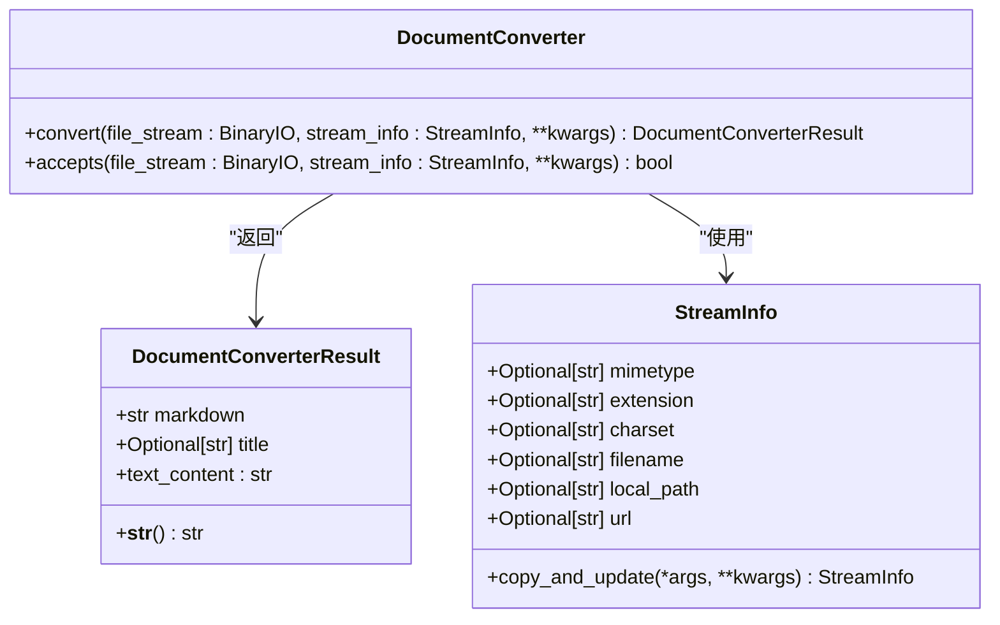
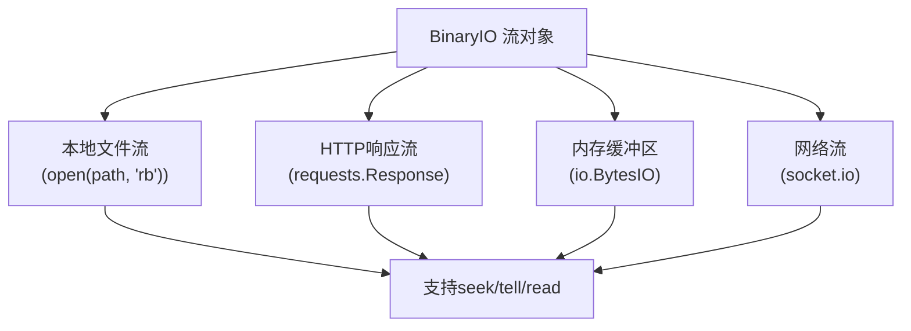
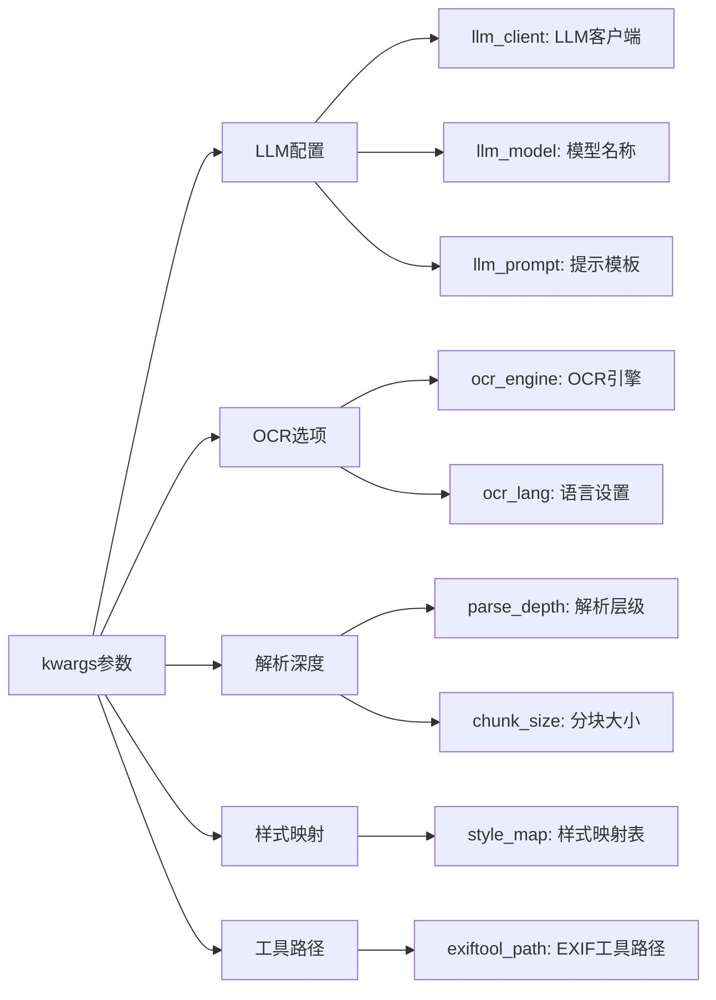
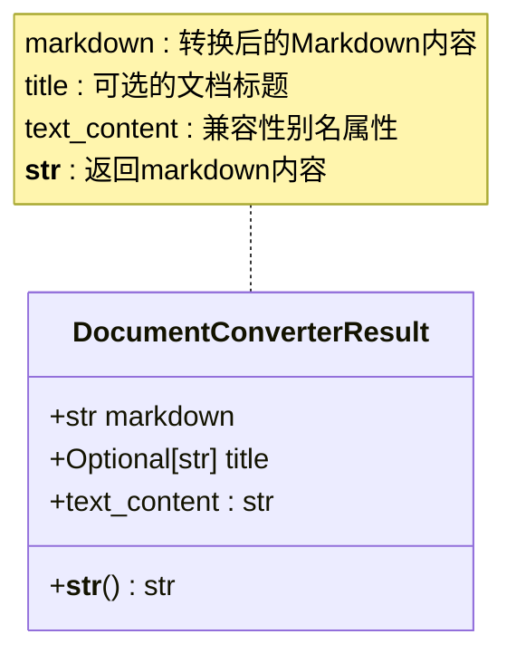
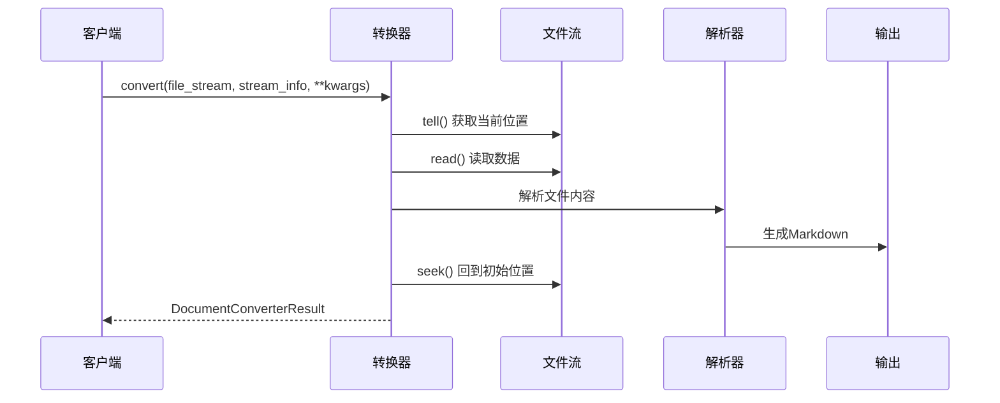
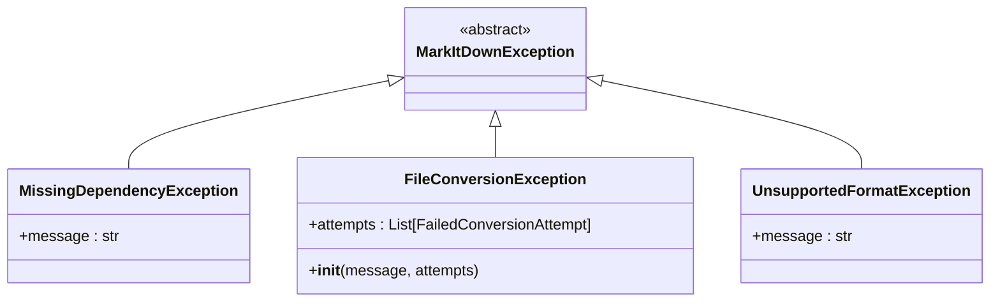
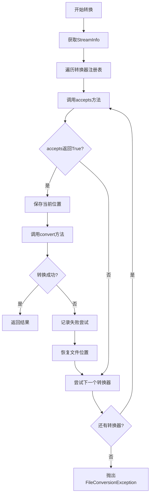

# convert方法详解

<cite>
**本文档中引用的文件**
- [_base_converter.py](file://packages/markitdown/src/markitdown/_base_converter.py)
- [_exceptions.py](file://packages/markitdown/src/markitdown/_exceptions.py)
- [_stream_info.py](file://packages/markitdown/src/markitdown/_stream_info.py)
- [_markitdown.py](file://packages/markitdown/src/markitdown/_markitdown.py)
- [_plain_text_converter.py](file://packages/markitdown/src/markitdown/converters/_plain_text_converter.py)
- [_image_converter.py](file://packages/markitdown/src/markitdown/converters/_image_converter.py)
- [_csv_converter.py](file://packages/markitdown/src/markitdown/converters/_csv_converter.py)
- [_pdf_converter.py](file://packages/markitdown/src/markitdown/converters/_pdf_converter.py)
- [_docx_converter.py](file://packages/markitdown/src/markitdown/converters/_docx_converter.py)
- [_html_converter.py](file://packages/markitdown/src/markitdown/converters/_html_converter.py)
</cite>

## 目录
1. [简介](#简介)
2. [方法签名与核心职责](#方法签名与核心职责)
3. [参数详解](#参数详解)
4. [返回值结构](#返回值结构)
5. [底层设计原理](#底层设计原理)
6. [异常处理机制](#异常处理机制)
7. [与accepts方法的协同关系](#与accepts方法的协同关系)
8. [实现示例](#实现示例)
9. [最佳实践](#最佳实践)
10. [总结](#总结)

## 简介

`convert()`方法是DocumentConverter基类的核心抽象方法，负责执行实际的文件到Markdown转换过程。作为转换器架构中的关键组件，它定义了所有具体转换器必须实现的标准接口，确保了系统的可扩展性和一致性。

该方法的设计体现了MarkItDown项目对灵活性和可靠性的追求，通过严格的参数要求和完善的异常处理机制，为各种文档格式的转换提供了统一而强大的解决方案。

## 方法签名与核心职责



**图表来源**
- [_base_converter.py](file://packages/markitdown/src/markitdown/_base_converter.py#L83-L104)
- [_stream_info.py](file://packages/markitdown/src/markitdown/_stream_info.py#L6-L32)

**节来源**
- [_base_converter.py](file://packages/markitdown/src/markitdown/_base_converter.py#L83-L104)

### 核心职责

`convert()`方法的核心职责可以概括为以下三个方面：

1. **文档解析与转换**：将输入的二进制文件流解析为目标格式的内容，并将其转换为Markdown格式
2. **元数据提取**：从文档中提取标题、作者、日期等元数据信息
3. **结果封装**：将转换后的Markdown内容和相关元数据封装到DocumentConverterResult对象中

## 参数详解

### file_stream参数

`file_stream`参数是转换过程的核心输入，必须是一个支持`seek()`、`tell()`和`read()`方法的二进制文件对象。

#### 底层设计原理

这种严格的要求源于转换过程中的特殊需求：

- **seek()方法**：允许转换器在文件中前后移动，这对于需要多次扫描文件内容的转换器（如PDF解析器）至关重要
- **tell()方法**：跟踪当前读取位置，确保转换过程中的状态一致性
- **read()方法**：提供基础的数据读取能力，支持各种文件格式的解析

#### 支持的流类型



**图表来源**
- [_markitdown.py](file://packages/markitdown/src/markitdown/_markitdown.py#L361-L365)

### stream_info参数

`stream_info`参数包含了关于输入文件的元数据信息，这些信息对于选择合适的转换器和优化转换过程至关重要。

#### StreamInfo字段说明

| 字段名 | 类型 | 描述 | 使用场景 |
|--------|------|------|----------|
| mimetype | Optional[str] | 文件的MIME类型 | 根据内容类型选择转换器 |
| extension | Optional[str] | 文件扩展名 | 基于文件后缀名匹配转换器 |
| charset | Optional[str] | 字符编码 | 处理文本文件的字符解码 |
| filename | Optional[str] | 文件名 | 提取文档标题或识别特殊文件 |
| local_path | Optional[str] | 本地路径 | 处理本地文件特有的逻辑 |
| url | Optional[str] | 来源URL | 处理网络资源的特殊转换 |

**节来源**
- [_stream_info.py](file://packages/markitdown/src/markitdown/_stream_info.py#L6-L32)

### kwargs参数

`kwargs`参数提供了转换过程中的扩展配置选项，支持各种转换器特定的功能需求。

#### 常见配置选项



**图表来源**
- [_markitdown.py](file://packages/markitdown/src/markitdown/_markitdown.py#L510-L530)

## 返回值结构

`convert()`方法返回一个`DocumentConverterResult`对象，该对象封装了转换后的Markdown内容和相关元数据。

### DocumentConverterResult属性



**图表来源**
- [_base_converter.py](file://packages/markitdown/src/markitdown/_base_converter.py#L8-L32)

#### 属性详解

| 属性名 | 类型 | 描述 | 默认值 |
|--------|------|------|--------|
| markdown | str | 转换后的Markdown文本内容 | 必需 |
| title | Optional[str] | 文档的标题信息 | None |
| text_content | str | markdown属性的兼容性别名 | markdown |

**节来源**
- [_base_converter.py](file://packages/markitdown/src/markitdown/_base_converter.py#L8-L32)

## 底层设计原理

### 流处理机制

`convert()`方法的设计充分考虑了不同文件格式的处理需求，特别是对于大型文件和网络流的处理策略。



**图表来源**
- [_base_converter.py](file://packages/markitdown/src/markitdown/_base_converter.py#L83-L104)
- [_markitdown.py](file://packages/markitdown/src/markitdown/_markitdown.py#L510-L530)

### 位置管理策略

为了确保转换过程的一致性，系统实现了严格的位置管理机制：

1. **初始位置保存**：在开始转换前保存文件流的当前位置
2. **转换过程隔离**：每个转换器在独立的上下文中运行
3. **位置恢复保证**：无论转换成功与否，都恢复到初始位置

**节来源**
- [_markitdown.py](file://packages/markitdown/src/markitdown/_markitdown.py#L510-L530)

## 异常处理机制

`convert()`方法定义了两种主要的异常类型，用于处理不同的错误场景。

### 异常类型层次



**图表来源**
- [_exceptions.py](file://packages/markitdown/src/markitdown/_exceptions.py#L10-L76)

### 异常处理策略

#### MissingDependencyException

当转换器所需的外部依赖未安装时抛出此异常：

- **触发条件**：缺少必要的Python包或系统工具
- **错误信息**：包含详细的安装指导
- **处理方式**：转换器会被跳过，系统尝试其他转换器

#### FileConversionException

当转换器能够识别文件格式但转换过程失败时抛出：

- **触发条件**：文件格式正确但转换过程中出现错误
- **错误信息**：包含失败的转换器列表和具体错误信息
- **处理方式**：记录失败尝试，继续尝试其他转换器

**节来源**
- [_exceptions.py](file://packages/markitdown/src/markitdown/_exceptions.py#L10-L76)

## 与accepts方法的协同关系

`convert()`方法与`accepts()`方法形成了紧密的协作关系，确保只有合适的转换器才会被调用。

### 协作流程



**图表来源**
- [_markitdown.py](file://packages/markitdown/src/markitdown/_markitdown.py#L510-L580)

### 位置一致性保证

系统通过严格的断言检查确保两个方法不会改变文件流的位置：

1. **accepts方法**：必须在调用前后保持文件位置不变
2. **convert方法**：必须在转换完成后恢复到初始位置

**节来源**
- [_markitdown.py](file://packages/markitdown/src/markitdown/_markitdown.py#L510-L530)

## 实现示例

以下是几个典型转换器中`convert()`方法的实现示例，展示了不同场景下的最佳实践。

### 简单文本转换器示例

基于PlainTextConverter的实现模式：

```python
def convert(self, file_stream: BinaryIO, stream_info: StreamInfo, **kwargs) -> DocumentConverterResult:
    # 检查字符编码
    if stream_info.charset:
        text_content = file_stream.read().decode(stream_info.charset)
    else:
        # 使用字符检测库自动识别编码
        text_content = str(from_bytes(file_stream.read()).best())
    
    # 返回转换结果
    return DocumentConverterResult(markdown=text_content)
```

**节来源**
- [_plain_text_converter.py](file://packages/markitdown/src/markitdown/converters/_plain_text_converter.py#L50-L71)

### 图像转换器示例

基于ImageConverter的实现模式：

```python
def convert(self, file_stream: BinaryIO, stream_info: StreamInfo, **kwargs) -> DocumentConverterResult:
    md_content = ""
    
    # 提取EXIF元数据
    metadata = exiftool_metadata(file_stream, exiftool_path=kwargs.get("exiftool_path"))
    if metadata:
        # 添加元数据信息
        for field in ["ImageSize", "Title", "Caption", "Description"]:
            if field in metadata:
                md_content += f"{field}: {metadata[field]}\n"
    
    # 使用LLM生成图像描述
    llm_client = kwargs.get("llm_client")
    if llm_client is not None:
        llm_description = self._get_llm_description(file_stream, stream_info, client=llm_client, model=kwargs.get("llm_model"))
        if llm_description:
            md_content += "\n# Description:\n" + llm_description.strip() + "\n"
    
    return DocumentConverterResult(markdown=md_content)
```

**节来源**
- [_image_converter.py](file://packages/markitdown/src/markitdown/converters/_image_converter.py#L40-L70)

### 表格转换器示例

基于CSV转换器的实现模式：

```python
def convert(self, file_stream: BinaryIO, stream_info: StreamInfo, **kwargs) -> DocumentConverterResult:
    # 读取文件内容
    if stream_info.charset:
        content = file_stream.read().decode(stream_info.charset)
    else:
        content = str(from_bytes(file_stream.read()).best())
    
    # 解析CSV内容
    reader = csv.reader(io.StringIO(content))
    rows = list(reader)
    
    if not rows:
        return DocumentConverterResult(markdown="")
    
    # 创建Markdown表格
    markdown_table = []
    markdown_table.append("| " + " | ".join(rows[0]) + " |")
    markdown_table.append("| " + " | ".join(["---"] * len(rows[0])) + " |")
    
    for row in rows[1:]:
        # 确保行数与列数一致
        while len(row) < len(rows[0]):
            row.append("")
        row = row[: len(rows[0])]
        markdown_table.append("| " + " | ".join(row) + " |")
    
    result = "\n".join(markdown_table)
    return DocumentConverterResult(markdown=result)
```

**节来源**
- [_csv_converter.py](file://packages/markitdown/src/markitdown/converters/_csv_converter.py#L37-L76)

### PDF转换器示例

基于PDF转换器的实现模式：

```python
def convert(self, file_stream: BinaryIO, stream_info: StreamInfo, **kwargs) -> DocumentConverterResult:
    # 检查依赖项
    if _dependency_exc_info is not None:
        raise MissingDependencyException(
            MISSING_DEPENDENCY_MESSAGE.format(
                converter=type(self).__name__,
                extension=".pdf",
                feature="pdf",
            )
        ) from _dependency_exc_info[1].with_traceback(_dependency_exc_info[2])
    
    # 使用pdfminer提取文本
    assert isinstance(file_stream, io.IOBase)  # 类型检查
    return DocumentConverterResult(
        markdown=pdfminer.high_level.extract_text(file_stream),
    )
```

**节来源**
- [_pdf_converter.py](file://packages/markitdown/src/markitdown/converters/_pdf_converter.py#L53-L76)

## 最佳实践

### 错误处理最佳实践

1. **依赖检查**：在转换前验证所有必需的依赖项
2. **异常捕获**：使用适当的异常类型处理不同类型的错误
3. **资源清理**：确保在异常情况下正确释放资源

### 性能优化最佳实践

1. **流式处理**：对于大文件，采用流式处理避免内存溢出
2. **位置管理**：严格遵守位置管理规则，避免竞态条件
3. **缓存利用**：合理利用转换结果缓存机制

### 兼容性最佳实践

1. **编码处理**：正确处理各种字符编码
2. **格式验证**：验证输入格式的完整性
3. **向后兼容**：保持与旧版本的兼容性

## 总结

`convert()`方法作为DocumentConverter基类的核心抽象方法，体现了MarkItDown项目在文档转换领域的深度思考和精心设计。通过严格的参数要求、完善的异常处理机制和清晰的协作关系，它为各种文档格式的转换提供了强大而可靠的基础设施。

### 关键特性总结

1. **统一接口**：为所有转换器提供标准的调用接口
2. **灵活配置**：通过kwargs参数支持丰富的配置选项
3. **异常安全**：完善的异常处理确保系统稳定性
4. **位置管理**：严格的流位置管理保证转换过程的一致性
5. **协作机制**：与accepts方法形成完整的转换流程

### 设计优势

- **可扩展性**：易于添加新的转换器类型
- **可靠性**：完善的错误处理和恢复机制
- **性能**：针对不同文件类型的优化处理
- **兼容性**：支持多种输入格式和配置选项

通过深入理解和正确实现`convert()`方法，开发者可以构建出高质量、高性能的文档转换功能，为用户提供优秀的文档处理体验。