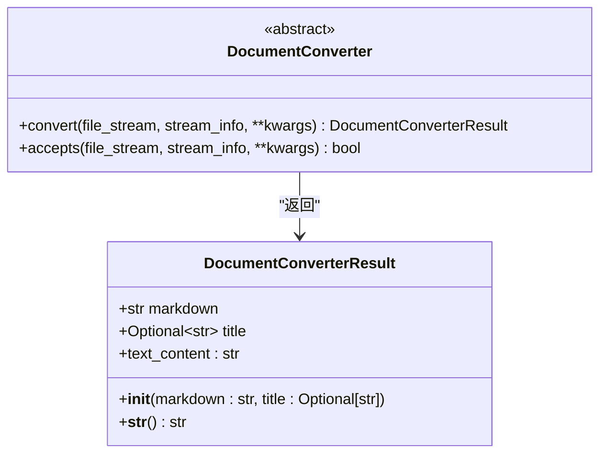
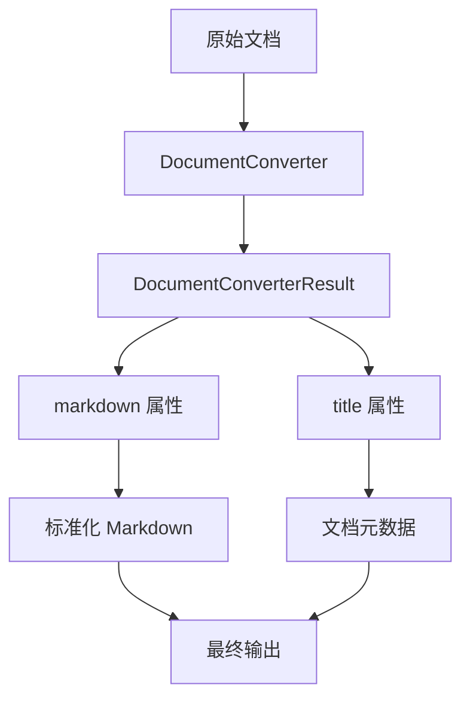
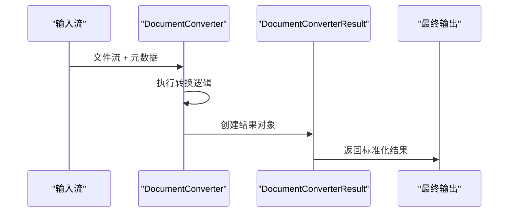
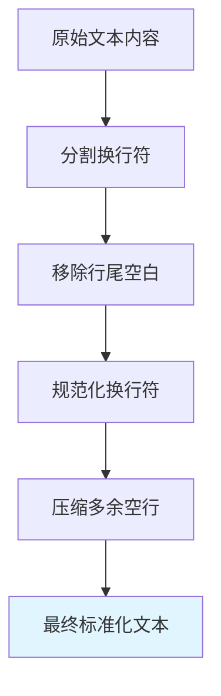

# DocumentConverterResult 类

<cite>
**本文档中引用的文件**
- [_base_converter.py](file://packages/markitdown/src/markitdown/_base_converter.py)
- [_plain_text_converter.py](file://packages/markitdown/src/markitdown/converters/_plain_text_converter.py)
- [_html_converter.py](file://packages/markitdown/src/markitdown/converters/_html_converter.py)
- [_pdf_converter.py](file://packages/markitdown/src/markitdown/converters/_pdf_converter.py)
- [_epub_converter.py](file://packages/markitdown/src/markitdown/converters/_epub_converter.py)
- [_markitdown.py](file://packages/markitdown/src/markitdown/_markitdown.py)
- [__init__.py](file://packages/markitdown/src/markitdown/converters/__init__.py)
</cite>

## 目录
1. [简介](#简介)
2. [类定义与结构](#类定义与结构)
3. [核心属性详解](#核心属性详解)
4. [标准化输出角色](#标准化输出角色)
5. [实例化与使用示例](#实例化与使用示例)
6. [转换链中的传递方式](#转换链中的传递方式)
7. [后处理规则](#后处理规则)
8. [API一致性保证](#api一致性保证)
9. [实际应用案例](#实际应用案例)
10. [最佳实践建议](#最佳实践建议)

## 简介

`DocumentConverterResult` 是 markitdown 库中用于表示文档转换结果的核心数据类。它作为所有文档转换器的标准化输出容器，为从各种格式的文档到 Markdown 的转换过程提供统一的结果格式。该类的设计确保了不同转换器之间的兼容性和API的一致性。

## 类定义与结构



**图表来源**
- [_base_converter.py](file://packages/markitdown/src/markitdown/_base_converter.py#L4-L38)

**章节来源**
- [_base_converter.py](file://packages/markitdown/src/markitdown/_base_converter.py#L4-L38)

## 核心属性详解

### markdown 属性

**类型**: `str`  
**描述**: 转换后的 Markdown 文本内容，这是 `DocumentConverterResult` 类的必需属性。

**特点**:
- 唯一必需的参数
- 包含完整的转换后 Markdown 内容
- 支持所有标准 Markdown 语法

### title 属性

**类型**: `Optional[str]`  
**默认值**: `None`  
**描述**: 可选的文档标题，通常从源文档中提取或推断。

**特点**:
- 提供文档的标题信息
- 在某些转换器中自动提取
- 用于增强 Markdown 输出的结构化信息

### text_content 属性（软弃用别名）

**类型**: `str`  
**描述**: `markdown` 属性的软弃用别名，新代码应迁移到使用 `markdown` 或 `__str__()` 方法。

**重要提示**: 新代码应该使用 `markdown` 属性而不是 `text_content`，后者将在未来版本中完全弃用。

**章节来源**
- [_base_converter.py](file://packages/markitdown/src/markitdown/_base_converter.py#L4-L38)

## 标准化输出角色

`DocumentConverterResult` 在整个转换器生态系统中扮演着标准化输出容器的关键角色：

### 统一接口设计

所有 `DocumentConverter` 子类的 `convert` 方法都必须返回 `DocumentConverterResult` 实例，确保了：

- **API一致性**: 所有转换器提供相同的返回类型
- **可预测性**: 调用者知道如何处理转换结果
- **互操作性**: 不同转换器之间可以无缝集成

### 结构化数据输出



**图表来源**
- [_base_converter.py](file://packages/markitdown/src/markitdown/_base_converter.py#L97-L104)

**章节来源**
- [_base_converter.py](file://packages/markitdown/src/markitdown/_base_converter.py#L97-L104)

## 实例化与使用示例

### 基本实例化

最简单的实例化方式是提供必需的 `markdown` 参数：

```python
# 基本用法
result = DocumentConverterResult(markdown="# Hello World\nThis is a test document.")
```

### 完整实例化

包含可选的 `title` 参数：

```python
# 包含标题的实例化
result = DocumentConverterResult(
    markdown="# My Document\nContent goes here...",
    title="My Document"
)
```

### 从字符串获取内容

通过 `__str__()` 方法获取 Markdown 内容：

```python
# 获取转换后的Markdown文本
markdown_content = str(result)
```

**章节来源**
- [_base_converter.py](file://packages/markitdown/src/markitdown/_base_converter.py#L4-L38)

## 转换链中的传递方式

在 markitdown 的转换流程中，`DocumentConverterResult` 在多个层级间传递：

### 转换器内部传递



**图表来源**
- [_base_converter.py](file://packages/markitdown/src/markitdown/_base_converter.py#L97-L104)

### MarkItDown 主流程中的使用

在主转换流程中，`DocumentConverterResult` 经历以下处理步骤：

1. **转换执行**: 调用各个转换器的 `convert` 方法
2. **结果收集**: 将转换结果存储在 `res` 变量中
3. **后处理**: 对 `text_content` 进行标准化处理
4. **返回**: 返回最终的标准化结果

**章节来源**
- [_markitdown.py](file://packages/markitdown/src/markitdown/_markitdown.py#L590-L618)

## 后处理规则

markitdown 对 `DocumentConverterResult` 的 `text_content` 字段实施严格的后处理规则以确保输出质量：

### 换行符规范化

```python
# 规范化换行符并移除多余空白
res.text_content = "\n".join(
    [line.rstrip() for line in re.split(r"\r?\n", res.text_content)]
)
```

**处理规则**:
- 统一使用 `\n` 作为换行符
- 移除每行末尾的空白字符
- 处理跨平台换行符差异

### 多余空白行压缩

```python
# 压缩连续空行，最多保留两个空行
res.text_content = re.sub(r"\n{3,}", "\n\n", res.text_content)
```

**处理规则**:
- 将三个或更多连续空行压缩为两个空行
- 保持合理的段落间距
- 避免过度空白影响可读性

### 后处理流程图



**图表来源**
- [_markitdown.py](file://packages/markitdown/src/markitdown/_markitdown.py#L590-L618)

**章节来源**
- [_markitdown.py](file://packages/markitdown/src/markitdown/_markitdown.py#L590-L618)

## API一致性保证

`DocumentConverterResult` 确保了 markitdown 生态系统中所有转换器的API一致性：

### 统一的返回类型

所有转换器的 `convert` 方法都遵循相同的签名：

```python
def convert(
    self,
    file_stream: BinaryIO,
    stream_info: StreamInfo,
    **kwargs: Any,
) -> DocumentConverterResult:
```

### 异常处理一致性

转换器在遇到错误时的行为保持一致：
- `FileConversionException`: 当 MIME 类型被识别但转换失败
- `MissingDependencyException`: 当转换器需要依赖项但未安装

### 插件兼容性

由于使用统一的返回类型，第三方插件可以轻松集成到 markitdown 生态系统中，无需担心不同的返回格式。

**章节来源**
- [_base_converter.py](file://packages/markitdown/src/markitdown/_base_converter.py#L97-L104)

## 实际应用案例

### 文本转换器示例

```python
# PlainTextConverter 的实现示例
def convert(self, file_stream, stream_info, **kwargs):
    if stream_info.charset:
        text_content = file_stream.read().decode(stream_info.charset)
    else:
        text_content = str(from_bytes(file_stream.read()).best())
    
    return DocumentConverterResult(markdown=text_content)
```

### HTML转换器示例

```python
# HtmlConverter 的实现示例
def convert(self, file_stream, stream_info, **kwargs):
    # 解析HTML内容
    encoding = "utf-8" if stream_info.charset is None else stream_info.charset
    soup = BeautifulSoup(file_stream, "html.parser", from_encoding=encoding)
    
    # 提取主要内容
    webpage_text = _CustomMarkdownify(**kwargs).convert_soup(soup)
    
    return DocumentConverterResult(
        markdown=webpage_text.strip(),
        title=soup.title.string if soup.title else None
    )
```

### PDF转换器示例

```python
# PdfConverter 的实现示例
def convert(self, file_stream, stream_info, **kwargs):
    # 使用pdfminer提取文本
    pdf_text = pdfminer.high_level.extract_text(file_stream)
    
    return DocumentConverterResult(markdown=pdf_text)
```

**章节来源**
- [_plain_text_converter.py](file://packages/markitdown/src/markitdown/converters/_plain_text_converter.py#L58-L71)
- [_html_converter.py](file://packages/markitdown/src/markitdown/converters/_html_converter.py#L48-L70)
- [_pdf_converter.py](file://packages/markitdown/src/markitdown/converters/_pdf_converter.py#L54-L77)

## 最佳实践建议

### 1. 正确使用构造函数

```python
# ✅ 推荐：正确使用构造函数
result = DocumentConverterResult(
    markdown="# Document Title\nContent here...",
    title="Document Title"
)

# ❌ 避免：使用已弃用的 text_content 属性
result = DocumentConverterResult(
    markdown="# Document Title\nContent here..."
)
result.text_content = "Alternative content"  # 已弃用
```

### 2. 处理空内容

```python
# ✅ 推荐：检查空内容
if result.markdown.strip():  # 检查是否有实际内容
    # 处理结果
    pass
```

### 3. 元数据处理

```python
# ✅ 推荐：安全地访问可选属性
title = result.title if result.title else "Untitled Document"
```

### 4. 后处理注意事项

```python
# ✅ 推荐：理解后处理效果
result = DocumentConverterResult(markdown="Line 1\n\n\n\nLine 2")
# 后处理后："Line 1\n\nLine 2"（压缩了多余的空行）
```

### 5. 错误处理

```python
# ✅ 推荐：处理可能的异常
try:
    result = converter.convert(file_stream, stream_info)
    markdown_content = str(result)  # 使用 __str__ 方法
except FileConversionException as e:
    # 处理转换失败
    pass
```

`DocumentConverterResult` 作为 markitdown 库的核心组件，不仅提供了标准化的转换结果格式，还确保了整个生态系统的一致性和可扩展性。通过遵循这些最佳实践，开发者可以充分利用该类的功能，同时保持代码的清晰性和维护性。