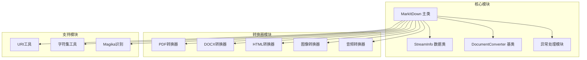
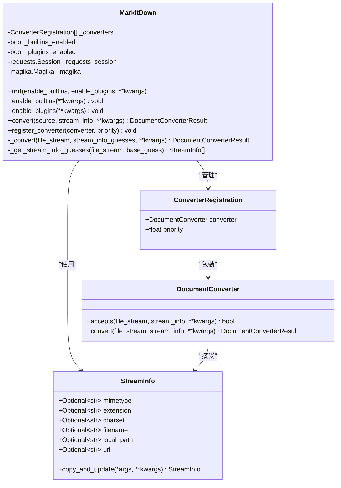
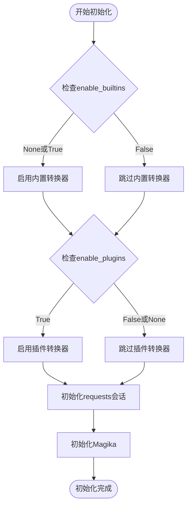
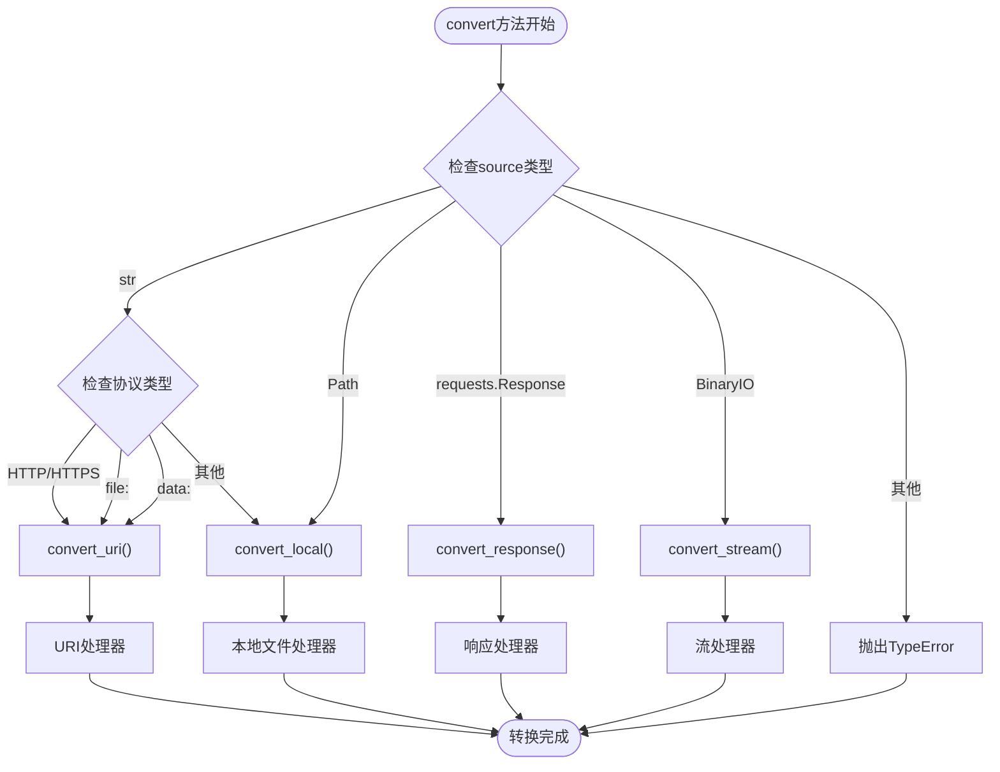
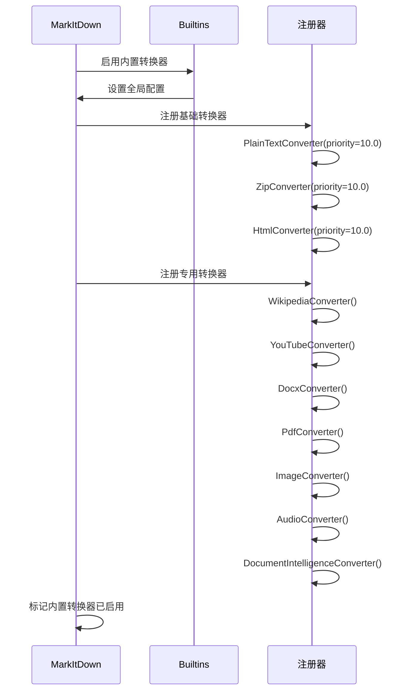
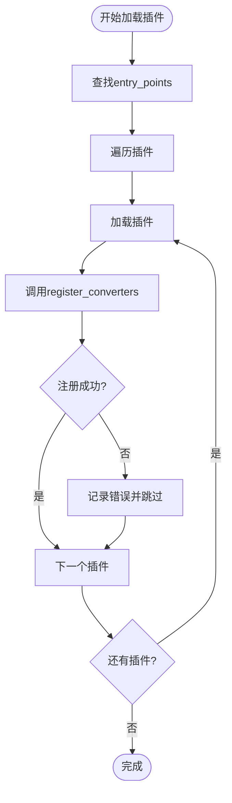
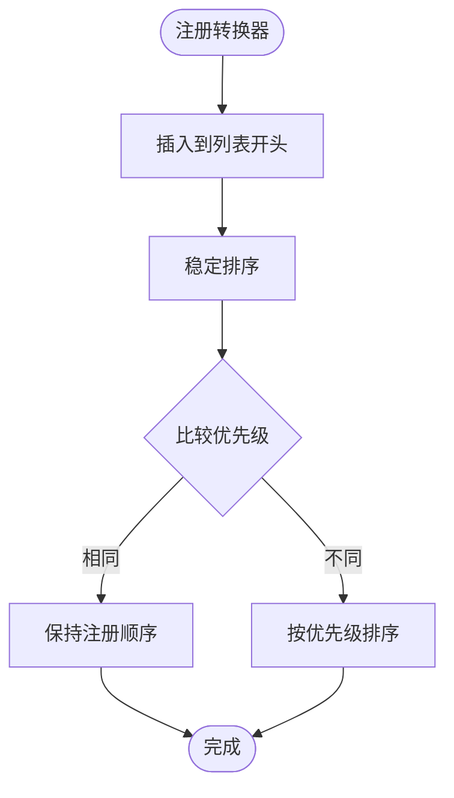
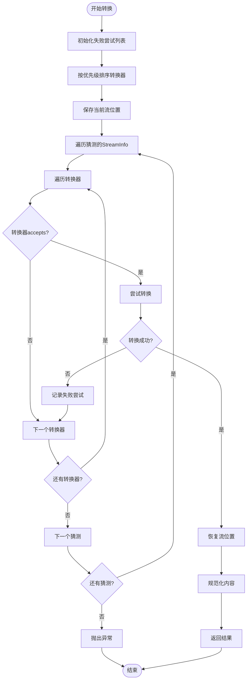
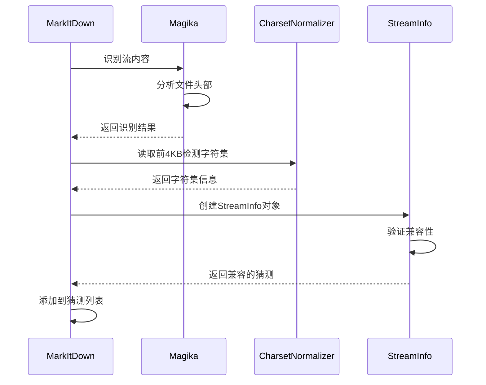
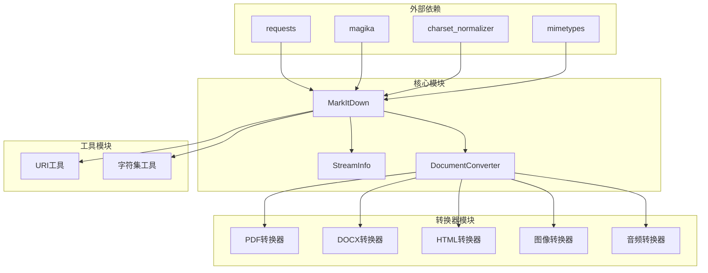

# MarkItDown 类详细API文档

<cite>
**本文档中引用的文件**
- [_markitdown.py](file://packages/markitdown/src/markitdown/_markitdown.py)
- [_stream_info.py](file://packages/markitdown/src/markitdown/_stream_info.py)
- [_base_converter.py](file://packages/markitdown/src/markitdown/_base_converter.py)
- [_exceptions.py](file://packages/markitdown/src/markitdown/_exceptions.py)
- [_pdf_converter.py](file://packages/markitdown/src/markitdown/converters/_pdf_converter.py)
- [_docx_converter.py](file://packages/markitdown/src/markitdown/converters/_docx_converter.py)
- [__init__.py](file://packages/markitdown/src/markitdown/converters/__init__.py)
</cite>

## 目录
1. [简介](#简介)
2. [项目结构概览](#项目结构概览)
3. [核心组件](#核心组件)
4. [架构概览](#架构概览)
5. [详细组件分析](#详细组件分析)
6. [依赖关系分析](#依赖关系分析)
7. [性能考虑](#性能考虑)
8. [故障排除指南](#故障排除指南)
9. [结论](#结论)

## 简介

MarkItDown是一个轻量级的Python工具，专门用于将各种文件格式转换为Markdown格式，特别适用于LLM（大语言模型）和相关文本分析管道。该类作为核心协调器，负责管理多种转换器，实现智能的多态分发机制，并提供统一的转换接口。

## 项目结构概览

MarkItDown项目采用模块化架构设计，主要包含以下核心模块：

**图表来源**
- [_markitdown.py](file://packages/markitdown/src/markitdown/_markitdown.py#L1-L50)
- [_stream_info.py](file://packages/markitdown/src/markitdown/_stream_info.py#L1-L33)

**章节来源**
- [_markitdown.py](file://packages/markitdown/src/markitdown/_markitdown.py#L1-L100)
- [README.md](file://README.md#L1-L50)

## 核心组件

### MarkItDown主类

MarkItDown类是整个系统的核心协调器，负责：
- 管理转换器注册表
- 处理多态分发机制
- 协调文件类型识别
- 管理转换失败重试机制

### StreamInfo数据类

StreamInfo类封装了文件流的所有元数据信息：
- MIME类型识别
- 文件扩展名
- 字符编码
- 文件名和本地路径
- URL信息

### DocumentConverter基类

所有转换器都继承自DocumentConverter基类，提供统一的接口：
- `accepts()`方法：判断是否能处理特定文件
- `convert()`方法：执行实际的转换操作

**章节来源**
- [_markitdown.py](file://packages/markitdown/src/markitdown/_markitdown.py#L50-L150)
- [_stream_info.py](file://packages/markitdown/src/markitdown/_stream_info.py#L5-L33)
- [_base_converter.py](file://packages/markitdown/src/markitdown/_base_converter.py#L40-L106)

## 架构概览

MarkItDown采用插件化架构，通过优先级排序的转换器注册机制实现智能分发：

**图表来源**
- [_markitdown.py](file://packages/markitdown/src/markitdown/_markitdown.py#L50-L150)
- [_base_converter.py](file://packages/markitdown/src/markitdown/_base_converter.py#L40-L106)
- [_stream_info.py](file://packages/markitdown/src/markitdown/_stream_info.py#L5-L33)

## 详细组件分析

### __init__构造函数详解

MarkItDown构造函数提供了灵活的初始化选项：

#### 参数说明

| 参数 | 类型 | 默认值 | 描述 |
|------|------|--------|------|
| `enable_builtins` | `Union[None, bool]` | `None` | 是否启用内置转换器。为None时默认启用 |
| `enable_plugins` | `Union[None, bool]` | `None` | 是否启用插件转换器。默认禁用 |
| `requests_session` | `Optional[requests.Session]` | `None` | 自定义requests会话对象 |
| `llm_client` | `Any` | `None` | LLM客户端，用于图像描述 |
| `llm_model` | `Union[str, None]` | `None` | LLM模型名称 |
| `llm_prompt` | `Union[str, None]` | `None` | 自定义LLM提示 |
| `exiftool_path` | `Union[str, None]` | `None` | ExifTool可执行文件路径 |
| `style_map` | `Union[str, None]` | `None` | 样式映射配置 |
| `docintel_endpoint` | `Any` | `None` | Azure Document Intelligence端点 |
| `docintel_credential` | `Any` | `None` | 文档智能凭证 |
| `docintel_file_types` | `Any` | `None` | 支持的文件类型 |
| `docintel_api_version` | `Any` | `None` | API版本 |

#### 初始化流程

**图表来源**
- [_markitdown.py](file://packages/markitdown/src/markitdown/_markitdown.py#L50-L150)

**章节来源**
- [_markitdown.py](file://packages/markitdown/src/markitdown/_markitdown.py#L50-L150)

### convert方法的多态分发机制

convert方法实现了智能的多态分发，根据输入类型自动选择合适的转换路径：

#### 输入类型处理逻辑

**图表来源**
- [_markitdown.py](file://packages/markitdown/src/markitdown/_markitdown.py#L250-L300)

#### 具体转换方法详解

##### convert_local方法

处理本地文件路径的转换：

| 参数 | 类型 | 描述 |
|------|------|------|
| `path` | `Union[str, Path]` | 本地文件路径 |
| `stream_info` | `Optional[StreamInfo]` | 可选的流信息 |
| `file_extension` | `Optional[str]` | 已废弃，请使用stream_info |
| `url` | `Optional[str]` | 已废弃，请使用stream_info |

##### convert_stream方法

处理二进制流的转换：

| 特性 | 描述 |
|------|------|
| 流检测 | 检测流是否可寻址，不可寻址则加载到内存 |
| 内存优化 | 对大型流进行分块读取 |
| 位置恢复 | 转换完成后恢复原始流位置 |

##### convert_uri方法

处理URI资源的转换：

| 支持的URI方案 | 处理方式 |
|---------------|----------|
| `file:` | 本地文件处理 |
| `data:` | 数据URI解析 |
| `http:`/`https:` | 网络请求处理 |

##### convert_response方法

处理HTTP响应的转换：

| 元数据提取 | 来源 |
|------------|------|
| MIME类型 | Content-Type头 |
| 字符编码 | Content-Type头的charset参数 |
| 文件名 | Content-Disposition头或URL路径 |
| URL信息 | 响应URL |

**章节来源**
- [_markitdown.py](file://packages/markitdown/src/markitdown/_markitdown.py#L300-L500)

### enable_builtins和enable_plugins方法

这两个方法负责动态注册转换器，实现插件化架构：

#### enable_builtins方法

启用内置转换器，按优先级顺序注册：

**图表来源**
- [_markitdown.py](file://packages/markitdown/src/markitdown/_markitdown.py#L148-L220)

#### enable_plugins方法

动态加载和注册插件转换器：

**图表来源**
- [_markitdown.py](file://packages/markitdown/src/markitdown/_markitdown.py#L222-L240)

**章节来源**
- [_markitdown.py](file://packages/markitdown/src/markitdown/_markitdown.py#L148-L240)

### register_converter方法的优先级排序机制

MarkItDown使用稳定的排序算法管理转换器优先级：

#### 优先级常量

| 常量 | 值 | 用途 |
|------|----|----- |
| `PRIORITY_SPECIFIC_FILE_FORMAT` | `0.0` | 特定文件格式转换器 |
| `PRIORITY_GENERIC_FILE_FORMAT` | `10.0` | 通用文件格式转换器 |

#### 排序机制

**图表来源**
- [_markitdown.py](file://packages/markitdown/src/markitdown/_markitdown.py#L640-L682)

**章节来源**
- [_markitdown.py](file://packages/markitdown/src/markitdown/_markitdown.py#L640-L682)

### _convert方法的转换流程

这是MarkItDown的核心转换引擎，实现了智能的转换尝试机制：

#### 转换流程图

**图表来源**
- [_markitdown.py](file://packages/markitdown/src/markitdown/_markitdown.py#L500-L620)

#### 异常处理机制

MarkItDown实现了完善的异常收集和传播机制：

| 异常类型 | 触发条件 | 处理方式 |
|----------|----------|----------|
| `FileConversionException` | 转换过程中发生错误 | 收集所有失败尝试并抛出 |
| `UnsupportedFormatException` | 没有转换器能处理 | 抛出不支持的格式异常 |
| `MissingDependencyException` | 缺少转换器依赖 | 提供安装建议 |

**章节来源**
- [_markitdown.py](file://packages/markitdown/src/markitdown/_markitdown.py#L500-L620)
- [_exceptions.py](file://packages/markitdown/src/markitdown/_exceptions.py#L1-L77)

### _mget_stream_info_guesses方法与Magika集成

该方法实现了Magika文件类型识别与StreamInfo的协同工作：

#### Magika集成流程

**图表来源**
- [_markitdown.py](file://packages/markitdown/src/markitdown/_markitdown.py#L684-L776)

#### 文件类型识别特性

| 功能 | 描述 |
|------|------|
| MIME类型推断 | 基于文件头部信息识别MIME类型 |
| 扩展名匹配 | 将MIME类型映射到常见扩展名 |
| 字符集检测 | 使用charset_normalizer检测文本编码 |
| 兼容性验证 | 确保识别结果与现有信息兼容 |

**章节来源**
- [_markitdown.py](file://packages/markitdown/src/markitdown/_markitdown.py#L684-L776)

## 依赖关系分析

MarkItDown的依赖关系体现了清晰的分层架构：

**图表来源**
- [_markitdown.py](file://packages/markitdown/src/markitdown/_markitdown.py#L1-L20)

**章节来源**
- [_markitdown.py](file://packages/markitdown/src/markitdown/_markitdown.py#L1-L20)

## 性能考虑

### 内存管理

- **流处理优化**：对于不可寻址的流，自动加载到内存中
- **分块读取**：网络响应和大型文件采用分块处理
- **位置恢复**：确保转换过程不会改变文件流位置

### 并发处理

- **懒加载**：插件和转换器采用延迟加载策略
- **优先级排序**：通过优先级减少不必要的转换尝试
- **早期退出**：找到第一个成功的转换器后立即返回

### 缓存策略

- **Magika缓存**：利用Magika的内部缓存机制
- **会话复用**：可复用requests会话对象

## 故障排除指南

### 常见问题及解决方案

#### 依赖缺失问题

**症状**：`MissingDependencyException`异常
**原因**：缺少特定格式的转换器依赖
**解决方案**：根据错误消息安装相应的可选依赖

#### 转换失败问题

**症状**：`FileConversionException`异常
**原因**：转换器找到但转换过程失败
**解决方案**：检查文件完整性，确认转换器配置

#### 格式不支持问题

**症状**：`UnsupportedFormatException`异常
**原因**：没有适合的转换器处理该格式
**解决方案**：确认文件格式是否受支持，或添加自定义转换器

**章节来源**
- [_exceptions.py](file://packages/markitdown/src/markitdown/_exceptions.py#L1-L77)

## 结论

MarkItDown类作为一个精心设计的文档转换协调器，展现了优秀的软件架构设计原则：

### 设计优势

1. **模块化架构**：清晰的职责分离和可扩展的插件系统
2. **智能分发**：基于优先级和文件特征的智能转换选择
3. **健壮性**：完善的异常处理和错误恢复机制
4. **性能优化**：内存管理和并发处理的平衡

### 扩展性

- 支持第三方插件开发
- 可配置的转换器优先级
- 灵活的初始化参数
- 渐进式功能启用

### 应用场景

MarkItDown特别适用于：
- LLM文档预处理
- 文档分析管道
- 内容管理系统
- 自动化文档转换

通过其优雅的设计和强大的功能，MarkItDown为文档转换领域提供了一个可靠、高效且易于扩展的解决方案。