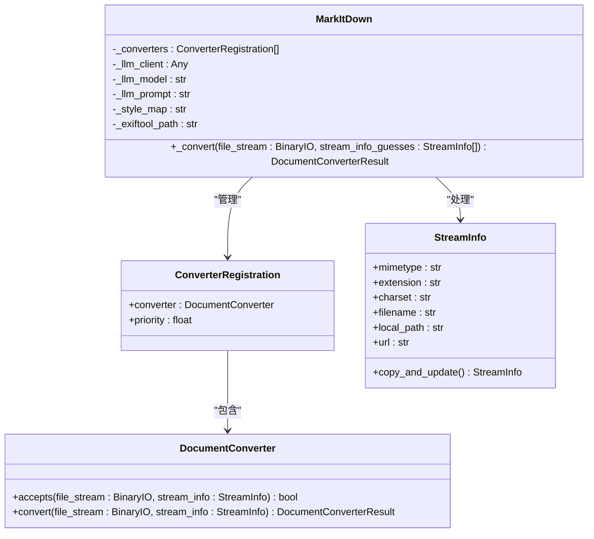
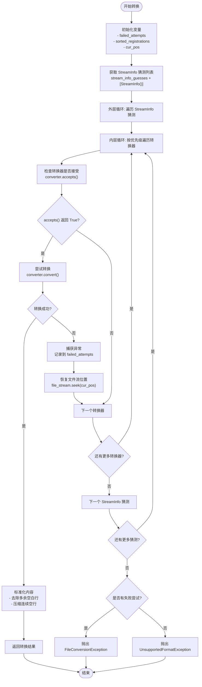
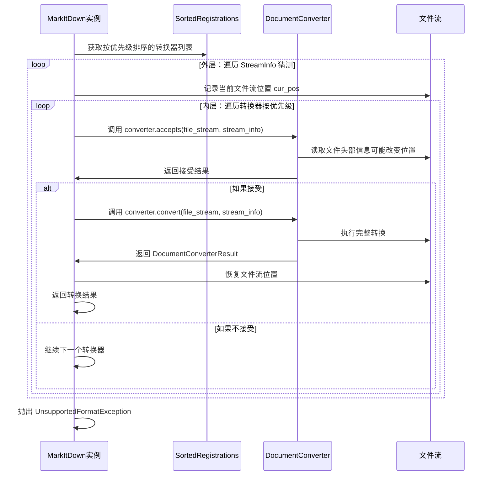
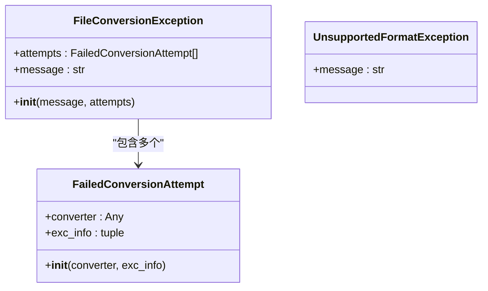
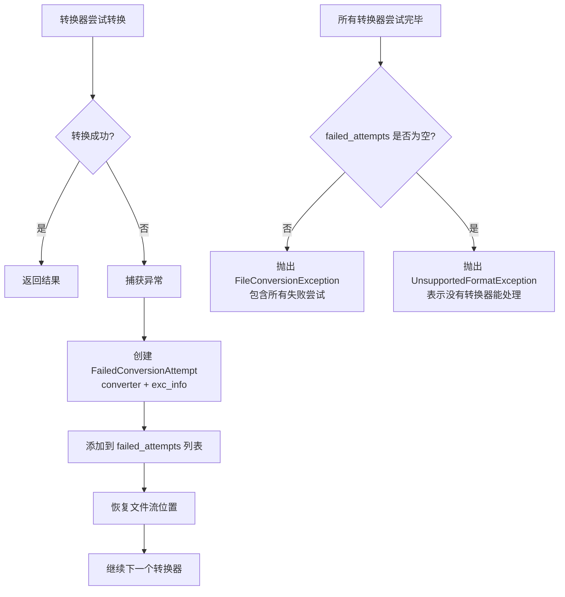
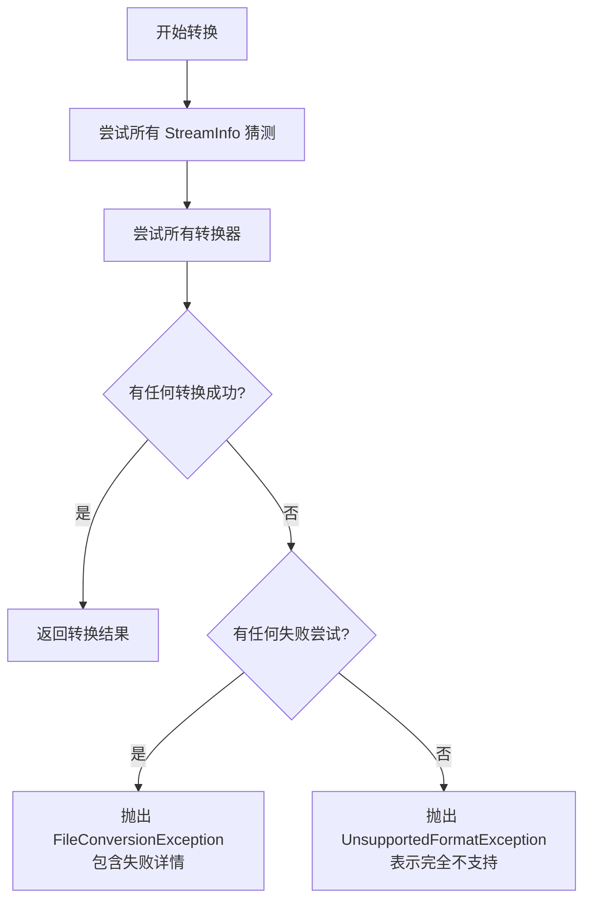
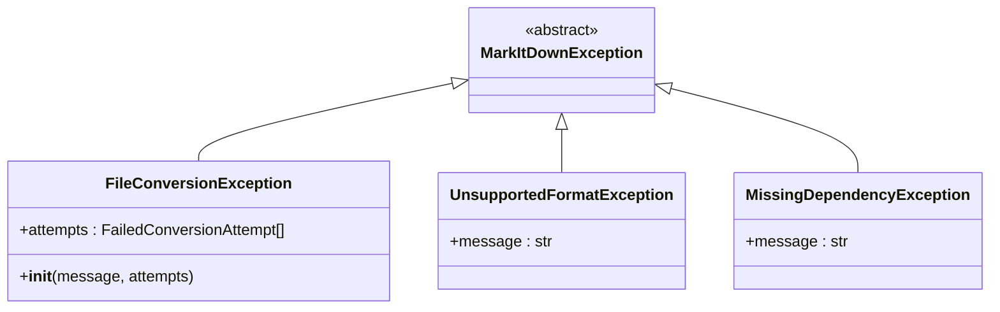
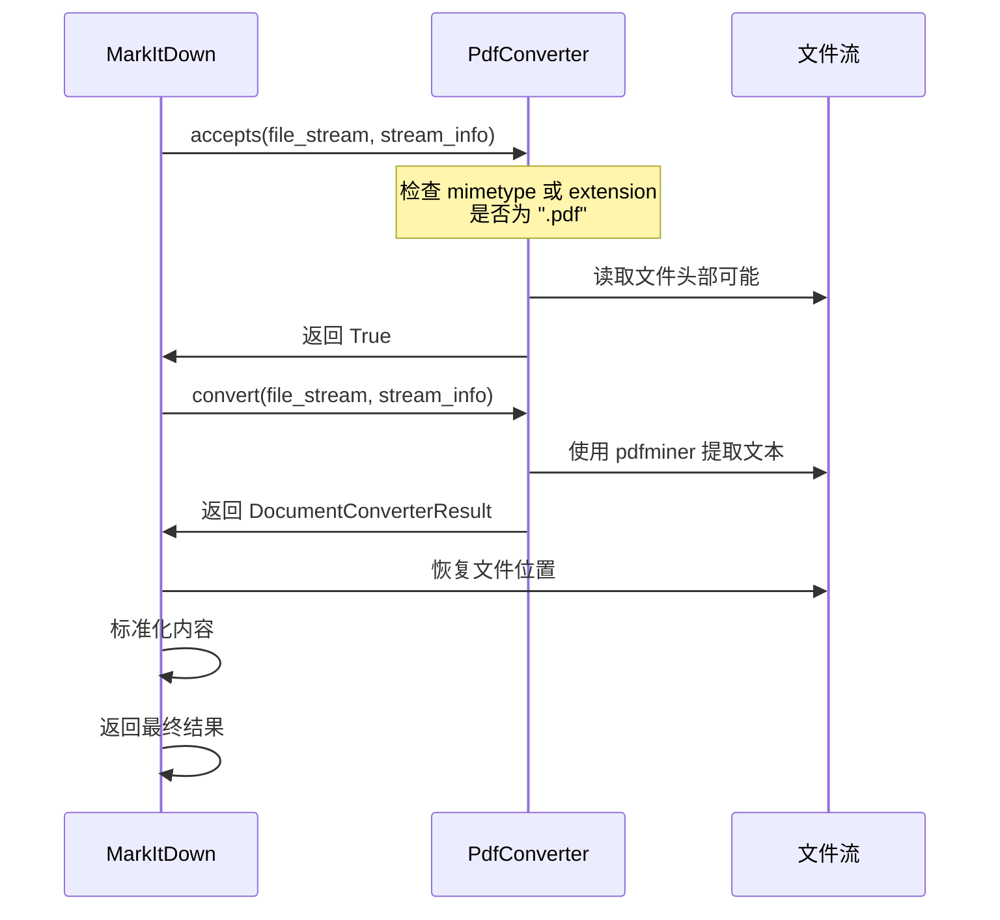

# _convert 方法详解

<cite>
**本文档中引用的文件**
- [_markitdown.py](file://packages/markitdown/src/markitdown/_markitdown.py)
- [_stream_info.py](file://packages/markitdown/src/markitdown/_stream_info.py)
- [_exceptions.py](file://packages/markitdown/src/markitdown/_exceptions.py)
- [_base_converter.py](file://packages/markitdown/src/markitdown/_base_converter.py)
- [_pdf_converter.py](file://packages/markitdown/src/markitdown/converters/_pdf_converter.py)
- [_docx_converter.py](file://packages/markitdown/src/markitdown/converters/_docx_converter.py)
</cite>

## 目录
1. [简介](#简介)
2. [方法签名与参数](#方法签名与参数)
3. [核心架构概览](#核心架构概览)
4. [双重循环机制详解](#双重循环机制详解)
5. [文件流位置管理](#文件流位置管理)
6. [异常处理与诊断](#异常处理与诊断)
7. [内容标准化处理](#内容标准化处理)
8. [错误处理机制](#错误处理机制)
9. [实际应用示例](#实际应用示例)
10. [性能优化考虑](#性能优化考虑)

## 简介

`_convert` 方法是 MarkItDown 类的核心转换引擎，负责协调整个文档转换流程。该方法接收二进制流和 StreamInfo 猜测列表，通过注册的转换器优先级进行排序处理，实现了智能的文档格式识别和转换机制。

该方法采用了双重循环的设计模式：外层迭代不同的 StreamInfo 猜测，内层按优先级尝试每个转换器的 `accepts` 和 `convert` 调用。这种设计确保了系统能够从多个角度验证文件格式，并在遇到兼容性问题时提供备用方案。

## 方法签名与参数



**图表来源**
- [_markitdown.py](file://packages/markitdown/src/markitdown/_markitdown.py#L530-L623)
- [_base_converter.py](file://packages/markitdown/src/markitdown/_base_converter.py#L41-L105)
- [_stream_info.py](file://packages/markitdown/src/markitdown/_stream_info.py#L6-L32)

**章节来源**
- [_markitdown.py](file://packages/markitdown/src/markitdown/_markitdown.py#L530-L623)

## 核心架构概览

`_convert` 方法的整体架构体现了 MarkItDown 的设计哲学：通过多层验证和优先级排序来确保最佳的转换效果。



**图表来源**
- [_markitdown.py](file://packages/markitdown/src/markitdown/_markitdown.py#L530-L623)

## 双重循环机制详解

### 外层循环：StreamInfo 猜测迭代

外层循环遍历 `stream_info_guesses + [StreamInfo()]` 列表，这个设计包含了两个关键策略：

1. **主猜测列表处理**：首先尝试用户提供的或自动推断的 StreamInfo 猜测
2. **默认猜测兜底**：最后尝试一个空的 StreamInfo 对象作为最后的保障

这种设计允许系统从多个角度验证文件格式，即使主要猜测失败，也能通过默认猜测找到合适的转换器。

### 内层循环：转换器优先级排序

内层循环按照转换器的优先级进行处理，优先级越低（数值越小）的转换器越先被尝试：



**图表来源**
- [_markitdown.py](file://packages/markitdown/src/markitdown/_markitdown.py#L540-L623)

**章节来源**
- [_markitdown.py](file://packages/markitdown/src/markitdown/_markitdown.py#L530-L623)

## 文件流位置管理

文件流位置管理是 `_convert` 方法的关键特性之一，确保了转换过程中的状态一致性。

### 位置保存与恢复机制

```mermaid
flowchart LR
A[开始转换] --> B[保存初始位置<br/>cur_pos = file_stream.tell()]
B --> C[外层循环开始]
C --> D[内层循环开始]
D --> E[调用 converter.accepts]
E --> F[转换器读取文件]
F --> G[检查位置一致性<br/>assert cur_pos == file_stream.tell()]
G --> H[调用 converter.convert]
H --> I[转换器执行完整转换]
I --> J[恢复文件位置<br/>file_stream.seek(cur_pos)]
J --> K[继续下一个转换器]
K --> L{还有更多转换器?}
L --> |是| D
L --> |否| M{还有更多猜测?}
M --> |是| C
M --> |否| N[转换完成]
```

**图表来源**
- [_markitdown.py](file://packages/markitdown/src/markitdown/_markitdown.py#L545-L550)
- [_markitdown.py](file://packages/markitdown/src/markitdown/_markitdown.py#L580-L585)

### 位置一致性保证

系统通过严格的断言来确保文件流位置的一致性：

1. **accepts() 位置检查**：确保转换器不会改变文件流位置
2. **convert() 后位置恢复**：无论转换成功与否都恢复原始位置
3. **外层循环位置验证**：确保不同猜测间的文件流位置一致

这种设计避免了因转换器操作导致的文件流状态混乱，为后续的转换提供了可靠的基础。

**章节来源**
- [_markitdown.py](file://packages/markitdown/src/markitdown/_markitdown.py#L545-L550)
- [_markitdown.py](file://packages/markitdown/src/markitdown/_markitdown.py#L580-L585)

## 异常处理与诊断

### _failed_attempts 异常收集机制

`_convert` 方法维护了一个 `failed_attempts` 列表，用于收集所有转换器的异常信息，为诊断转换失败提供详细线索。



**图表来源**
- [_exceptions.py](file://packages/markitdown/src/markitdown/_exceptions.py#L35-L76)

### 异常处理流程



**图表来源**
- [_markitdown.py](file://packages/markitdown/src/markitdown/_markitdown.py#L580-L590)
- [_exceptions.py](file://packages/markitdown/src/markitdown/_exceptions.py#L55-L76)

### 诊断信息的丰富性

`FailedConversionAttempt` 包含以下关键信息：
- **转换器类型**：明确哪个转换器失败
- **异常信息**：完整的异常堆栈跟踪
- **上下文数据**：为故障排除提供详细线索

**章节来源**
- [_markitdown.py](file://packages/markitdown/src/markitdown/_markitdown.py#L535-L540)
- [_exceptions.py](file://packages/markitdown/src/markitdown/_exceptions.py#L35-L76)

## 内容标准化处理

转换成功后的 Markdown 内容会经过标准化处理，确保输出质量的一致性。

### 空白行压缩机制

```mermaid
flowchart LR
A[原始 Markdown 内容] --> B[按行分割<br/>re.split(r"\r?\n", text_content)]
B --> C[去除每行末尾空白<br/>line.rstrip() for line in lines]
C --> D[重新连接成字符串<br/>"\n".join(processed_lines)]
D --> E[压缩连续空行<br/>re.sub(r"\n{3,}", "\n\n", text_content)]
E --> F[标准化后的 Markdown]
```

**图表来源**
- [_markitdown.py](file://packages/markitdown/src/markitdown/_markitdown.py#L610-L615)

### 标准化处理步骤

1. **行末空白清理**：移除每行末尾的多余空白字符
2. **连续空行压缩**：将三个或更多连续空行压缩为两个
3. **统一换行符**：处理不同平台的换行符差异

这种处理确保了输出的 Markdown 内容具有良好的可读性和一致性，避免了因源文件格式差异导致的输出质量问题。

**章节来源**
- [_markitdown.py](file://packages/markitdown/src/markitdown/_markitdown.py#L610-L615)

## 错误处理机制

### UnsupportedFormatException 抛出条件

当所有转换器都无法处理输入文件时，系统会抛出 `UnsupportedFormatException`。这个异常表明文件格式完全不受支持，而不是转换过程中的临时失败。



**图表来源**
- [_markitdown.py](file://packages/markitdown/src/markitdown/_markitdown.py#L617-L623)

### 异常层次结构



**图表来源**
- [_exceptions.py](file://packages/markitdown/src/markitdown/_exceptions.py#L10-L76)

**章节来源**
- [_markitdown.py](file://packages/markitdown/src/markitdown/_markitdown.py#L617-L623)
- [_exceptions.py](file://packages/markitdown/src/markitdown/_exceptions.py#L25-L35)

## 实际应用示例

### PDF 文件转换示例

以 PDF 文件为例，展示 `_convert` 方法的工作流程：



**图表来源**
- [_pdf_converter.py](file://packages/markitdown/src/markitdown/converters/_pdf_converter.py#L25-L45)
- [_markitdown.py](file://packages/markitdown/src/markitdown/_markitdown.py#L580-L590)

### DOCX 文件转换示例

DOCX 文件的转换展示了继承和组合模式的应用：

```mermaid
sequenceDiagram
participant MD as MarkItDown
participant DC as DocxConverter
participant HC as HtmlConverter
participant FS as 文件流
MD->>DC : accepts(file_stream, stream_info)
Note over DC : 检查 mimetype 或 extension<br/>是否为 ".docx"
DC->>FS : 读取文件头部可能
DC->>MD : 返回 True
MD->>DC : convert(file_stream, stream_info)
DC->>FS : 预处理 DOCX 文件
DC->>HC : 调用 HtmlConverter.convert_string()
HC->>MD : 返回 DocumentConverterResult
MD->>FS : 恢复文件位置
MD->>MD : 标准化内容
MD->>MD : 返回最终结果
```



**图表来源**
- [_docx_converter.py](file://packages/markitdown/src/markitdown/converters/_docx_converter.py#L40-L60)
- [_base_converter.py](file://packages/markitdown/src/markitdown/_base_converter.py#L75-L105)

**章节来源**
- [_pdf_converter.py](file://packages/markitdown/src/markitdown/converters/_pdf_converter.py#L25-L77)
- [_docx_converter.py](file://packages/markitdown/src/markitdown/converters/_docx_converter.py#L40-L90)

## 性能优化考虑

### 优先级排序优化

`_convert` 方法在每次调用时都会重新排序转换器，这确保了优先级设置的动态性。虽然增加了计算开销，但提供了最大的灵活性。

### 流位置管理优化

通过精确的位置管理和恢复机制，避免了不必要的文件重读，提高了整体性能。特别是对于大型文件，这种设计显著减少了 I/O 操作。

### 转换器选择优化

双重循环设计允许早期退出：一旦某个转换器成功，立即返回结果，避免了不必要的后续尝试。

### 内存使用优化

方法只在必要时才加载整个文件到内存（仅当流不可寻址时），保持了良好的内存使用效率。

**章节来源**
- [_markitdown.py](file://packages/markitdown/src/markitdown/_markitdown.py#L540-L545)

## 结论

`_convert` 方法代表了 MarkItDown 设计理念的完美体现：通过智能的双重循环机制、严格的状态管理、完善的异常处理和内容标准化，构建了一个强大而可靠的文档转换引擎。

该方法不仅解决了复杂的文件格式识别和转换问题，还为系统的扩展性和维护性奠定了坚实基础。其设计原则——优先级排序、位置一致性、异常诊断和内容标准化——为现代文档处理系统提供了宝贵的参考价值。