# _get_stream_info_guesses 方法详解

<cite>
**本文档中引用的文件**
- [_markitdown.py](file://packages/markitdown/src/markitdown/_markitdown.py)
- [_stream_info.py](file://packages/markitdown/src/markitdown/_stream_info.py)
- [test_module_misc.py](file://packages/markitdown/tests/test_module_misc.py)
</cite>

## 目录
1. [简介](#简介)
2. [方法概述](#方法概述)
3. [核心架构](#核心架构)
4. [详细组件分析](#详细组件分析)
5. [兼容性判断逻辑](#兼容性判断逻辑)
6. [字符集检测流程](#字符集检测流程)
7. [文件流保护机制](#文件流保护机制)
8. [性能考虑](#性能考虑)
9. [故障排除指南](#故障排除指南)
10. [结论](#结论)

## 简介

`_get_stream_info_guesses` 方法是 markitdown 库中的核心功能之一，负责生成多个 StreamInfo 候选对象以提高文件转换的成功率。该方法巧妙地结合了基础猜测（base_guess）与 Magika 文件识别引擎的深度内容分析，同时利用 Python 的 mimetypes 模块根据文件扩展名推测 MIME 类型或反之补全信息。

该方法的设计理念是在保持文件流原始位置不变的前提下，通过多层验证和智能合并策略，为后续的文件转换提供最准确的元数据信息。这种方法特别适用于处理格式多样、命名不规范的文件，能够显著提高转换器的选择准确性和最终输出的质量。

## 方法概述

`_get_stream_info_guesses` 方法接收两个主要参数：一个二进制文件流和一个基础猜测对象（StreamInfo），返回一个包含多个 StreamInfo 对象的列表。该方法的核心价值在于：

- **增强基础猜测**：基于文件扩展名或 MIME 类型进行智能推测
- **Magika深度分析**：利用 Google Magika 引擎进行内容识别
- **兼容性验证**：严格检查不同来源信息的一致性
- **智能合并策略**：根据兼容性决定保留单个或多个候选对象

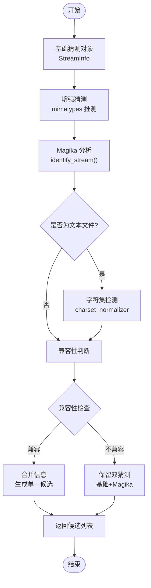

**图表来源**
- [_markitdown.py](file://packages/markitdown/src/markitdown/_markitdown.py#L665-L764)

## 核心架构

该方法采用分层处理架构，每一层都有明确的职责分工：

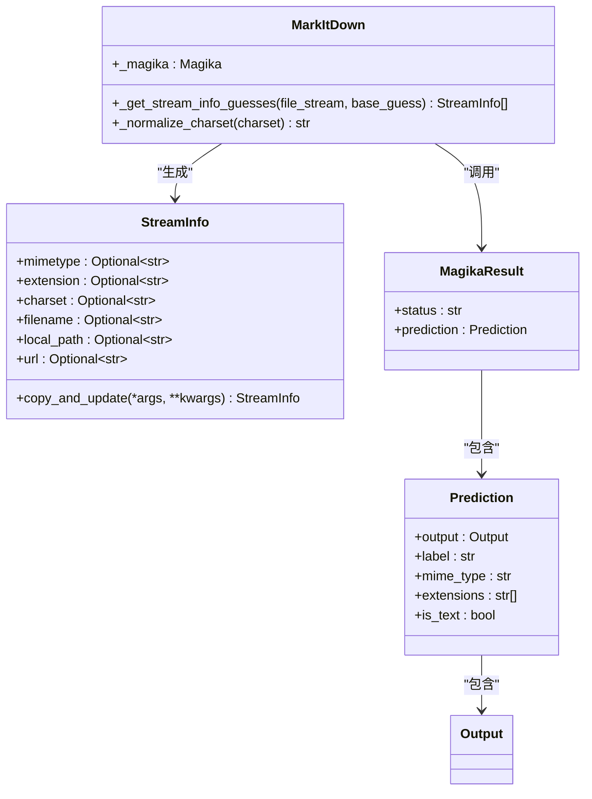

**图表来源**
- [_markitdown.py](file://packages/markitdown/src/markitdown/_markitdown.py#L665-L764)
- [_stream_info.py](file://packages/markitdown/src/markitdown/_stream_info.py#L5-L32)

**节来源**
- [_markitdown.py](file://packages/markitdown/src/markitdown/_markitdown.py#L665-L764)
- [_stream_info.py](file://packages/markitdown/src/markitdown/_stream_info.py#L5-L32)

## 详细组件分析

### 基础猜测增强

方法的第一步是对基础猜测进行增强处理。这一过程涉及两个关键操作：

#### MIME 类型到扩展名的推测
当基础猜测只包含 MIME 类型而没有文件扩展名时，系统会使用 Python 的 mimetypes 模块进行推测：

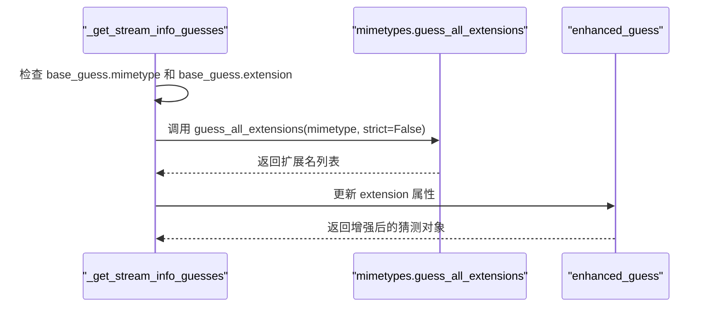

**图表来源**
- [_markitdown.py](file://packages/markitdown/src/markitdown/_markitdown.py#L684-L688)

#### 扩展名到 MIME 类型的推测
相反地，当基础猜测只包含文件扩展名而没有 MIME 类型时，系统同样使用 mimetypes 模块进行反向推测：

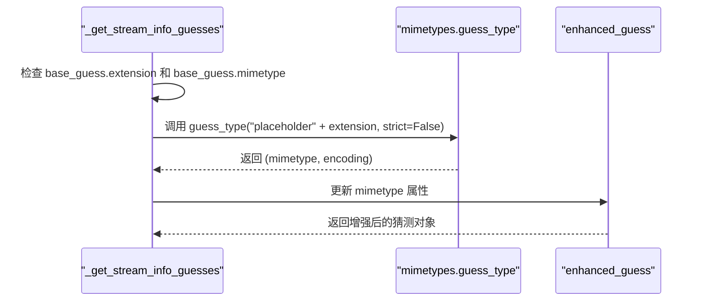

**图表来源**
- [_markitdown.py](file://packages/markitdown/src/markitdown/_markitdown.py#L675-L682)

### Magika 深度内容分析

Magika 是 Google 开发的文件识别引擎，能够基于文件内容而非仅依赖文件扩展名进行精确识别。该方法调用 Magika 进行深度分析：

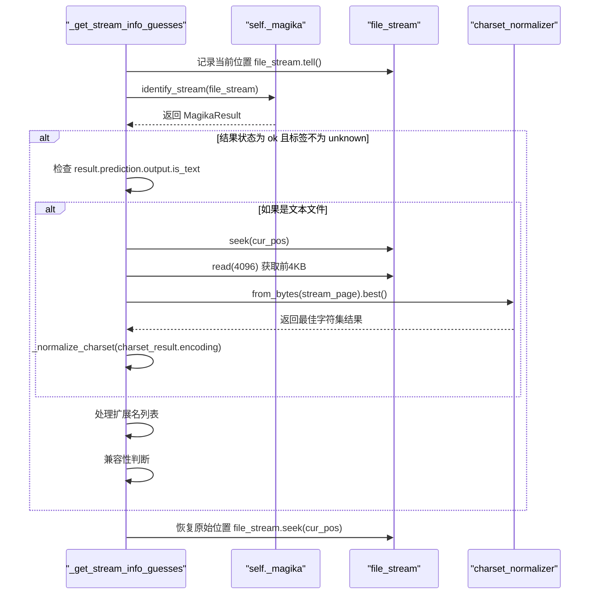

**图表来源**
- [_markitdown.py](file://packages/markitdown/src/markitdown/_markitdown.py#L690-L728)

**节来源**
- [_markitdown.py](file://packages/markitdown/src/markitdown/_markitdown.py#L690-L728)

## 兼容性判断逻辑

兼容性判断是该方法的核心决策点，它决定了如何处理 Magika 的分析结果与基础猜测之间的差异。兼容性检查涉及三个关键维度：

### MIME 类型一致性检查

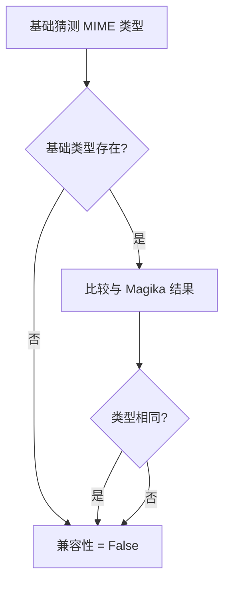

**图表来源**
- [_markitdown.py](file://packages/markitdown/src/markitdown/_markitdown.py#L713-L718)

### 文件扩展名一致性检查

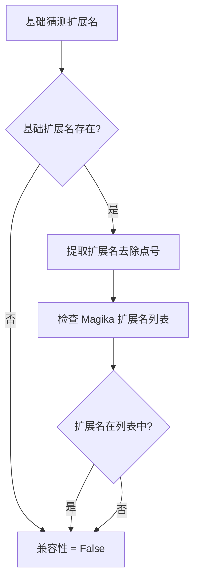

**图表来源**
- [_markitdown.py](file://packages/markitdown/src/markitdown/_markitdown.py#L720-L726)

### 字符集一致性检查

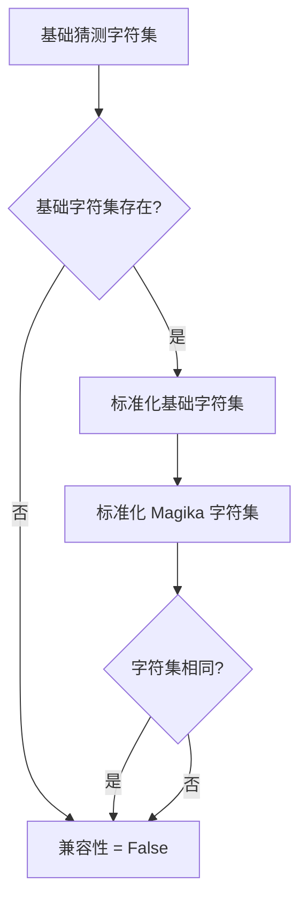

**图表来源**
- [_markitdown.py](file://packages/markitdown/src/markitdown/_markitdown.py#L728-L731)

### 合并策略

根据兼容性判断的结果，系统采用不同的处理策略：

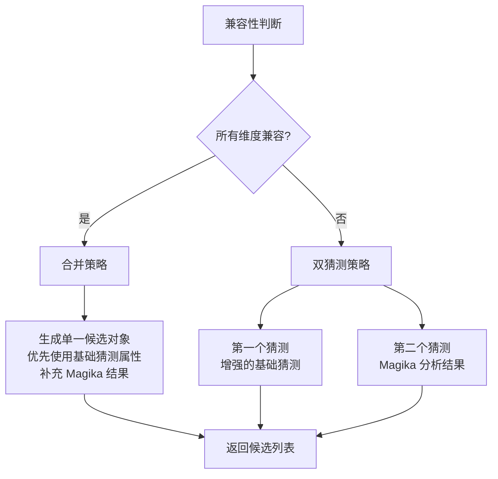

**图表来源**
- [_markitdown.py](file://packages/markitdown/src/markitdown/_markitdown.py#L732-L752)

**节来源**
- [_markitdown.py](file://packages/markitdown/src/markitdown/_markitdown.py#L711-L752)

## 字符集检测流程

对于文本文件，该方法实现了专门的字符集检测流程。这一流程的关键特点包括：

### 数据读取策略

字符集检测从文件流中读取前 4KB 数据，这是经过优化的数据量：
- **足够代表性**：4KB 大小足以包含足够的字符样本
- **性能平衡**：避免读取整个文件带来的性能开销
- **准确性保证**：大多数文本文件的编码信息在前 4KB 内即可确定

### 编码推断过程

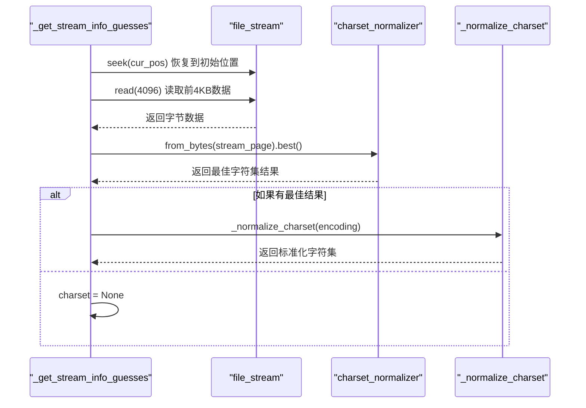

**图表来源**
- [_markitdown.py](file://packages/markitdown/src/markitdown/_markitdown.py#L698-L705)

### 字符集标准化

标准化过程确保字符集名称的一致性：

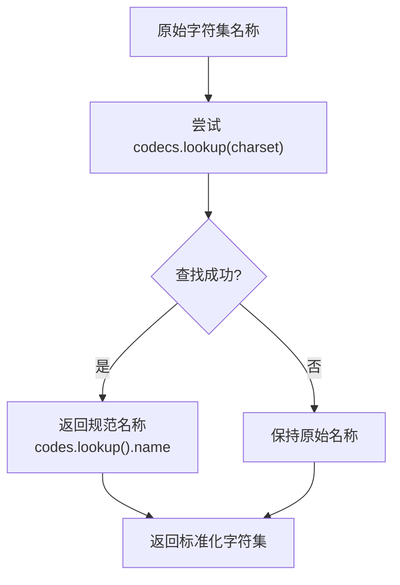

**图表来源**
- [_markitdown.py](file://packages/markitdown/src/markitdown/_markitdown.py#L766-L775)

**节来源**
- [_markitdown.py](file://packages/markitdown/src/markitdown/_markitdown.py#L698-L705)
- [_markitdown.py](file://packages/markitdown/src/markitdown/_markitdown.py#L766-L775)

## 文件流保护机制

为了确保文件流的完整性，该方法实现了严格的保护机制：

### 位置保存与恢复

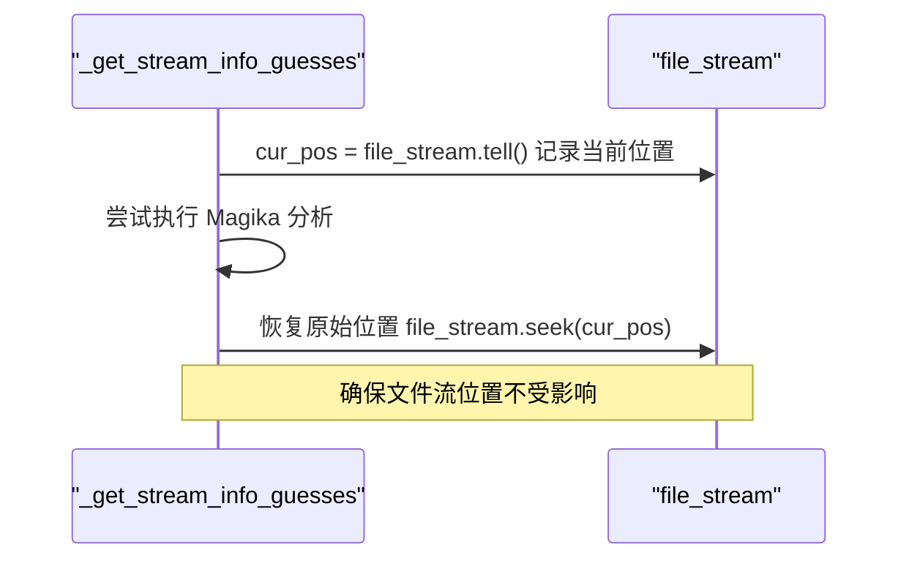

**图表来源**
- [_markitdown.py](file://packages/markitdown/src/markitdown/_markitdown.py#L690-L764)

### 异常安全处理

方法使用 try-finally 结构确保即使在发生异常的情况下也能正确恢复文件流位置：

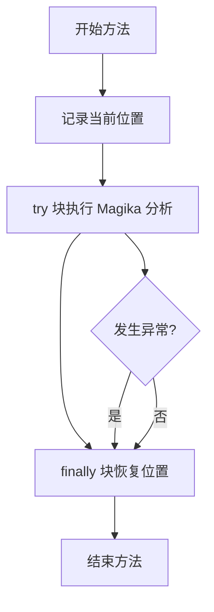

**图表来源**
- [_markitdown.py](file://packages/markitdown/src/markitdown/_markitdown.py#L690-L764)

这种设计确保了：
- **数据完整性**：文件流不会因异常而损坏
- **可预测性**：调用者可以确信文件流位置保持不变
- **资源管理**：即使在错误情况下也能正确释放资源

**节来源**
- [_markitdown.py](file://packages/markitdown/src/markitdown/_markitdown.py#L690-L764)

## 性能考虑

该方法在设计时充分考虑了性能优化：

### 延迟加载与按需分析

- **Magika 分析延迟**：只有在需要时才调用 Magika 引擎
- **字符集检测条件**：仅对文本文件进行字符集检测
- **扩展名处理优化**：只处理非空的扩展名列表

### 内存使用优化

- **流式处理**：使用文件流而非完整文件加载
- **最小数据读取**：字符集检测只读取 4KB 数据
- **对象复用**：通过 copy_and_update 方法高效创建新对象

### 并发安全性

虽然该方法本身不是线程安全的，但它设计为无状态操作，可以在并发环境中安全使用，只要每个调用都使用独立的文件流实例。

## 故障排除指南

### 常见问题及解决方案

#### Magika 分析失败

**症状**：Magika 返回非 "ok" 状态或标签为 "unknown"
**原因**：文件格式过于特殊或损坏
**解决方案**：回退到基础猜测，使用增强的猜测对象

#### 字符集检测失败

**症状**：charset_normalizer 无法确定字符集
**原因**：文件编码不标准或数据损坏
**解决方案**：保持基础猜测的字符集或设置为 None

#### 兼容性冲突

**症状**：Magika 结果与基础猜测不兼容
**原因**：文件扩展名与实际内容不符
**解决方案**：保留双猜测策略，让后续转换器选择合适的猜测

### 调试技巧

1. **启用详细日志**：监控 Magika 的分析结果
2. **检查文件流状态**：确保文件流位置正确
3. **验证基础猜测质量**：确认输入的 StreamInfo 对象包含足够的信息

**节来源**
- [_markitdown.py](file://packages/markitdown/src/markitdown/_markitdown.py#L690-L764)

## 结论

`_get_stream_info_guesses` 方法代表了现代文档处理系统中智能元数据推断的最佳实践。通过巧妙结合传统文件扩展名推测、现代内容分析技术和严格的兼容性验证，该方法实现了以下关键优势：

### 技术创新点

1. **多源信息融合**：有效整合多种信息源，提高猜测准确性
2. **智能兼容性判断**：基于语义理解的兼容性验证机制
3. **优雅的降级策略**：在冲突情况下保持信息完整性
4. **性能优化设计**：在准确性和效率之间取得良好平衡

### 实际应用价值

- **提高转换成功率**：通过多候选策略显著提升文件转换成功率
- **增强系统鲁棒性**：能够处理各种边缘情况和异常文件
- **简化用户接口**：为上层转换器提供高质量的元数据输入
- **支持复杂场景**：适用于各种文件格式和命名约定

该方法的设计哲学体现了现代软件工程中的几个重要原则：关注点分离、防御性编程、性能优化和用户体验优先。它不仅是一个技术实现，更是对复杂现实世界问题的优雅解决方案。