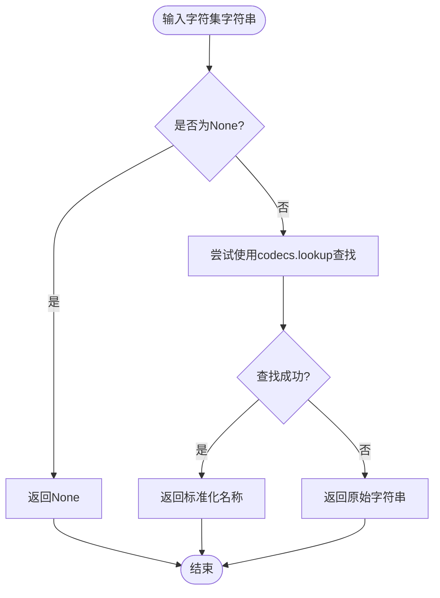
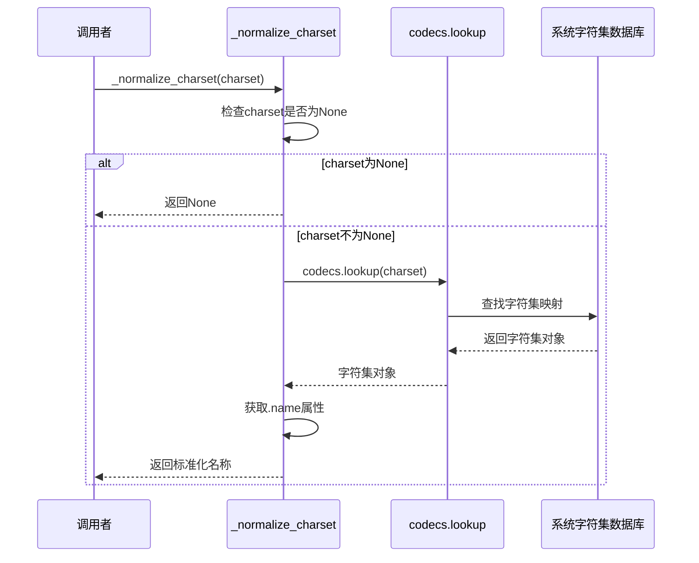
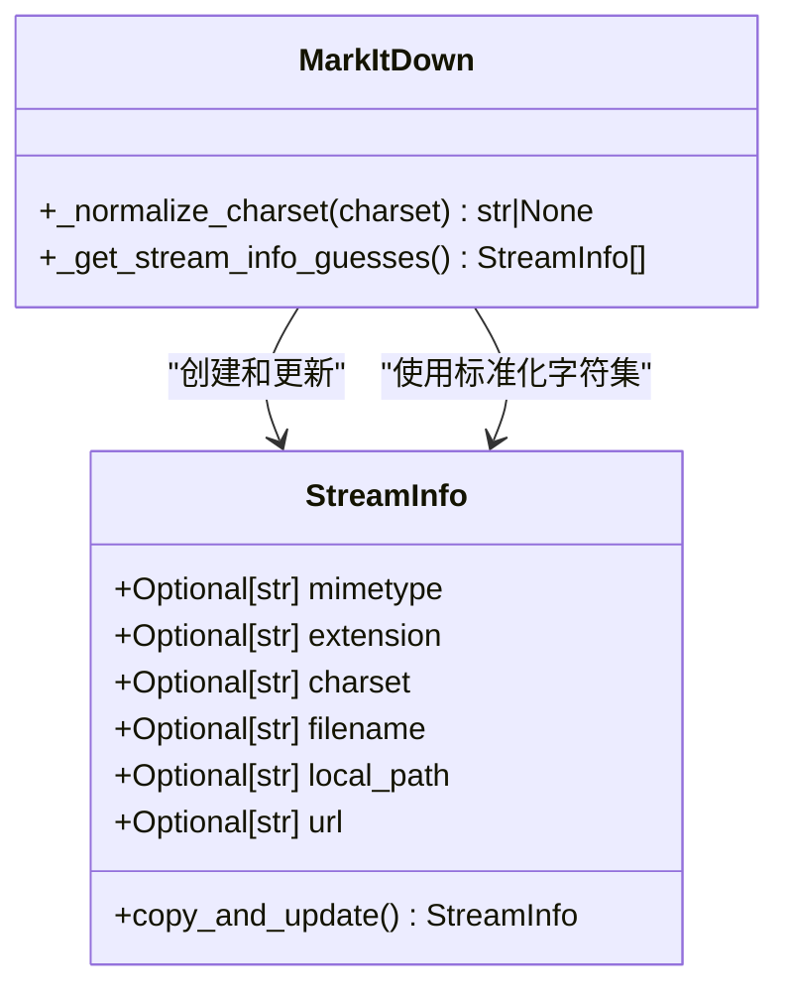

# _normalize_charset 方法详解

<cite>
**本文档中引用的文件**
- [_markitdown.py](file://packages/markitdown/src/markitdown/_markitdown.py)
- [_stream_info.py](file://packages/markitdown/src/markitdown/_stream_info.py)
- [_plain_text_converter.py](file://packages/markitdown/src/markitdown/converters/_plain_text_converter.py)
- [_html_converter.py](file://packages/markitdown/src/markitdown/converters/_html_converter.py)
</cite>

## 目录
1. [简介](#简介)
2. [方法功能概述](#方法功能概述)
3. [核心实现分析](#核心实现分析)
4. [字符集标准化过程](#字符集标准化过程)
5. [容错机制](#容错机制)
6. [应用场景](#应用场景)
7. [与其他组件的交互](#与其他组件的交互)
8. [性能考虑](#性能考虑)
9. [最佳实践建议](#最佳实践建议)
10. [总结](#总结)

## 简介

`_normalize_charset` 方法是 MarkItDown 文档转换系统中的一个关键工具函数，专门负责将不一致的字符集名称标准化为规范形式。该方法在处理来自不同来源的编码声明时发挥着重要作用，确保整个系统内部的一致性和可靠性。

## 方法功能概述

`_normalize_charset` 方法的主要职责是：
- 接收原始字符集字符串作为输入
- 使用 Python 的 `codecs.lookup` 函数查找并获取标准字符集名称
- 将非标准格式的字符集名称统一转换为规范形式
- 在遇到无效或无法识别的字符集名称时提供容错保护



**图表来源**
- [_markitdown.py](file://packages/markitdown/src/markitdown/_markitdown.py#L766-L775)

## 核心实现分析

### 方法签名与参数

该方法采用简洁的设计模式，接受单一参数并返回标准化结果：

```python
def _normalize_charset(self, charset: str | None) -> str | None:
```

**节来源**
- [_markitdown.py](file://packages/markitdown/src/markitdown/_markitdown.py#L766-L775)

### 实现逻辑结构

方法实现了三层逻辑结构：

1. **空值检查**：首先验证输入是否为 `None`，如果是则直接返回
2. **标准化尝试**：使用 `codecs.lookup()` 尝试获取标准名称
3. **异常处理**：捕获 `LookupError` 异常并返回原始字符串

### 字符集标准化过程

该方法的核心工作原理基于 Python 的 `codecs` 模块：



**图表来源**
- [_markitdown.py](file://packages/markitdown/src/markitdown/_markitdown.py#L766-L775)

## 容错机制

### 异常处理策略

该方法采用了优雅的容错设计：

```python
try:
    return codecs.lookup(charset).name
except LookupError:
    return charset
```

这种设计确保了即使遇到无法识别的字符集名称，系统也不会崩溃，而是保持原始状态继续运行。

### 容错行为分析

| 输入情况 | 处理方式 | 输出结果 |
|---------|---------|---------|
| 有效字符集名称 | 标准化并返回 | 规范化的字符集名称 |
| 无效字符集名称 | 捕获异常并返回 | 原始输入字符串 |
| None值 | 直接返回None | None |
| 空字符串 | 抛出LookupError | 原始空字符串 |

## 应用场景

### HTTP头部处理

在处理HTTP响应时，`_normalize_charset` 方法被用于标准化从 `Content-Type` 头部提取的字符集信息：

```python
# 从HTTP响应中提取字符集
if "content-type" in response.headers:
    parts = response.headers["content-type"].split(";")
    mimetype = parts.pop(0).strip()
    for part in parts:
        if part.strip().startswith("charset="):
            _charset = part.split("=")[1].strip()
            if len(_charset) > 0:
                charset = _charset
```

**节来源**
- [_markitdown.py](file://packages/markitdown/src/markitdown/_markitdown.py#L480-L495)

### Magika识别集成

当使用 Magika 进行文件类型识别时，该方法用于标准化检测到的字符集：

```python
if charset_result is not None:
    charset = self._normalize_charset(charset_result.encoding)
```

**节来源**
- [_markitdown.py](file://packages/markitdown/src/markitdown/_markitdown.py#L704)

### 字符集兼容性检查

在流信息猜测过程中，该方法用于比较不同来源的字符集信息：

```python
if (
    base_guess.charset is not None
    and self._normalize_charset(base_guess.charset) != charset
):
    compatible = False
```

**节来源**
- [_markitdown.py](file://packages/markitdown/src/markitdown/_markitdown.py#L728)

## 与其他组件的交互

### 与 StreamInfo 类的协作

`StreamInfo` 类存储了文件流的各种信息，包括字符集：



**图表来源**
- [_stream_info.py](file://packages/markitdown/src/markitdown/_stream_info.py#L5-L31)
- [_markitdown.py](file://packages/markitdown/src/markitdown/_markitdown.py#L766-L775)

### 与转换器的集成

不同的转换器依赖标准化后的字符集信息：

#### 纯文本转换器示例
```python
def convert(self, file_stream: BinaryIO, stream_info: StreamInfo, **kwargs):
    if stream_info.charset:
        text_content = file_stream.read().decode(stream_info.charset)
    else:
        text_content = str(from_bytes(file_stream.read()).best())
```

#### HTML转换器示例
```python
def convert(self, file_stream: BinaryIO, stream_info: StreamInfo, **kwargs):
    encoding = "utf-8" if stream_info.charset is None else stream_info.charset
    soup = BeautifulSoup(file_stream, "html.parser", from_encoding=encoding)
```

**节来源**
- [_plain_text_converter.py](file://packages/markitdown/src/markitdown/converters/_plain_text_converter.py#L58-L60)
- [_html_converter.py](file://packages/markitdown/src/markitdown/converters/_html_converter.py#L42-L44)

## 性能考虑

### 时间复杂度分析

该方法的时间复杂度主要取决于 `codecs.lookup()` 的实现：

- **最好情况**：O(1)，当字符集名称可以直接映射时
- **最坏情况**：O(n)，其中 n 是字符集别名的数量
- **平均情况**：通常接近 O(1)，因为 Python 的字符集查找优化良好

### 内存使用

方法的内存使用相对简单：
- 输入字符串的复制开销
- 异常处理的最小内存占用
- 返回值的存储需求

### 优化建议

1. **缓存机制**：对于频繁使用的字符集名称，可以考虑添加缓存
2. **批量处理**：在处理多个字符集时，可以批量进行标准化
3. **预验证**：在调用前对常见字符集进行预验证

## 最佳实践建议

### 输入验证

虽然方法本身具有容错能力，但在调用前进行适当的输入验证仍然是良好的实践：

```python
# 推荐的做法
if charset and isinstance(charset, str):
    normalized_charset = self._normalize_charset(charset)
else:
    normalized_charset = None
```

### 错误处理

在使用标准化字符集时，应该考虑以下错误处理策略：

```python
normalized_charset = self._normalize_charset(raw_charset)
if normalized_charset is None:
    # 使用默认字符集或抛出更具体的异常
    normalized_charset = "utf-8"
```

### 日志记录

在生产环境中，建议添加日志记录以跟踪字符集标准化过程：

```python
import logging

logger = logging.getLogger(__name__)

normalized_charset = self._normalize_charset(raw_charset)
if raw_charset != normalized_charset:
    logger.debug(f"字符集标准化: {raw_charset} -> {normalized_charset}")
```

## 总结

`_normalize_charset` 方法是 MarkItDown 系统中一个精心设计的工具函数，它解决了字符集名称不一致这一关键问题。通过以下特性确保了系统的可靠性和一致性：

1. **标准化功能**：将各种格式的字符集名称统一为规范形式
2. **容错设计**：优雅地处理无效或未知的字符集名称
3. **性能优化**：高效的查找算法和异常处理机制
4. **广泛适用**：在多个关键场景中发挥作用

该方法的成功实现体现了软件工程中的几个重要原则：
- **单一职责原则**：专注于字符集标准化
- **开闭原则**：对扩展开放，对修改封闭
- **防御性编程**：通过异常处理确保系统稳定性
- **用户友好**：提供有意义的错误恢复机制

在实际应用中，`_normalize_charset` 方法为 MarkItDown 系统提供了坚实的字符集处理基础，确保了从各种来源获取的文档能够被正确、一致地转换为 Markdown 格式。