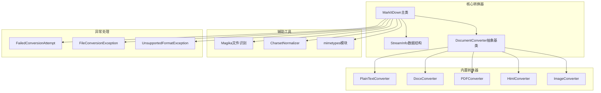
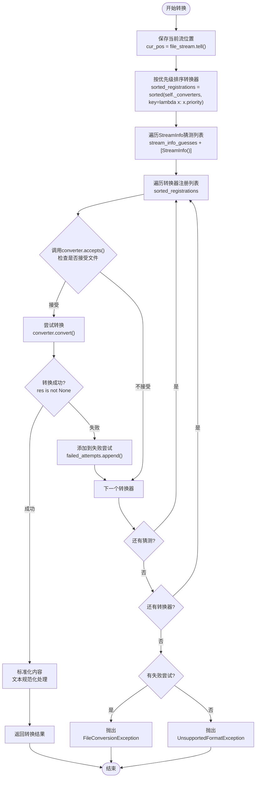
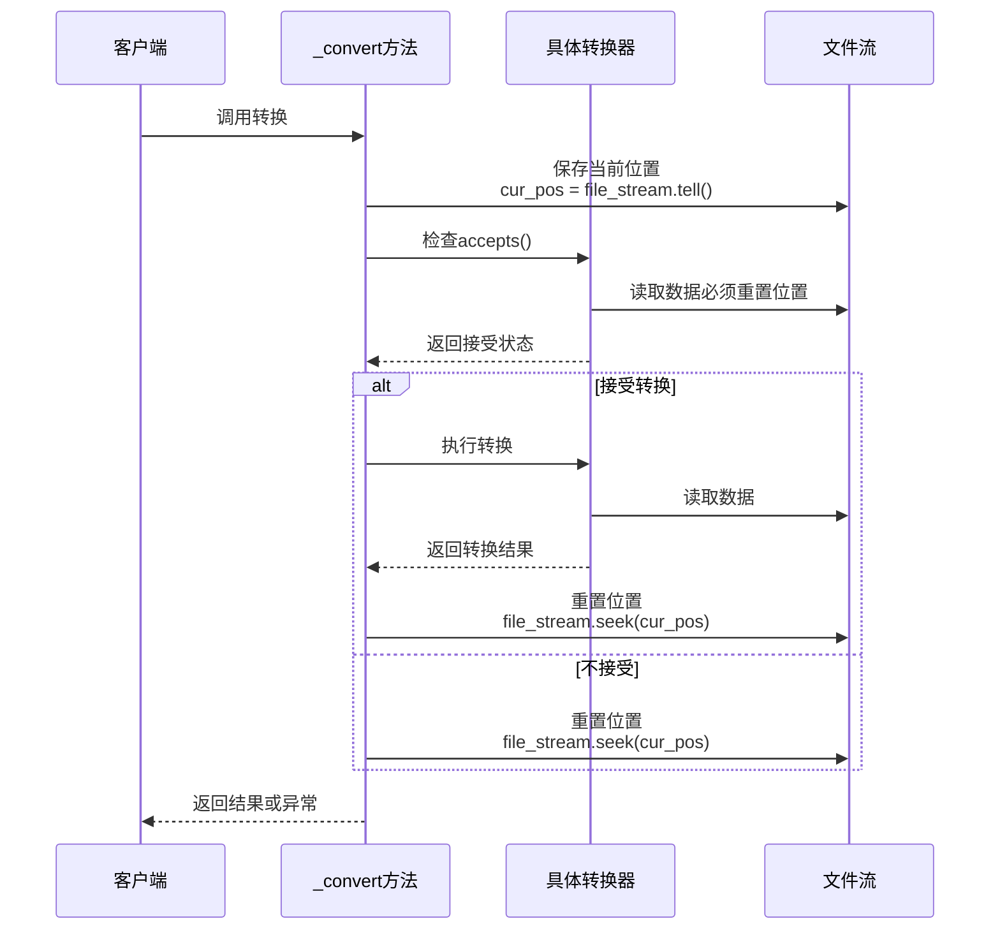
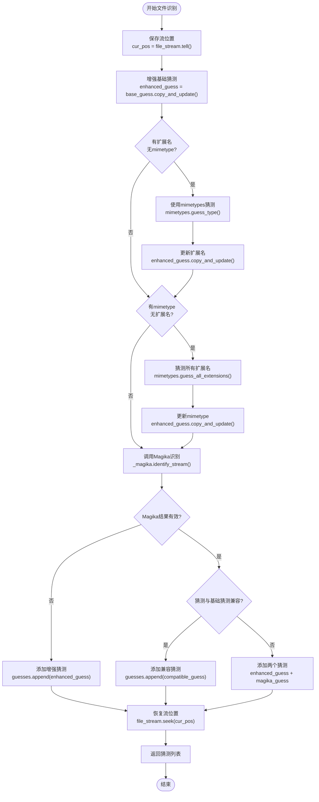
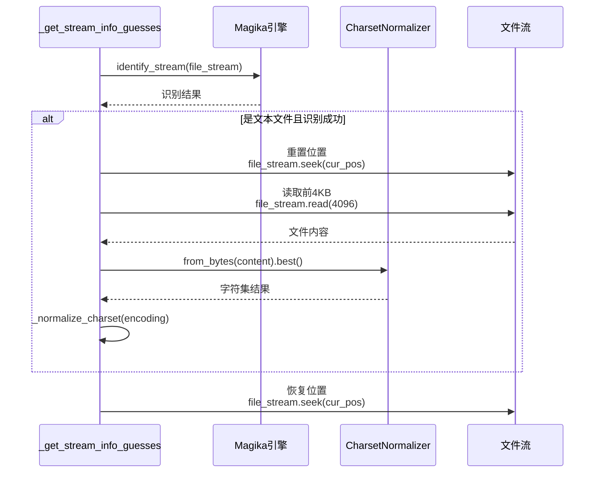
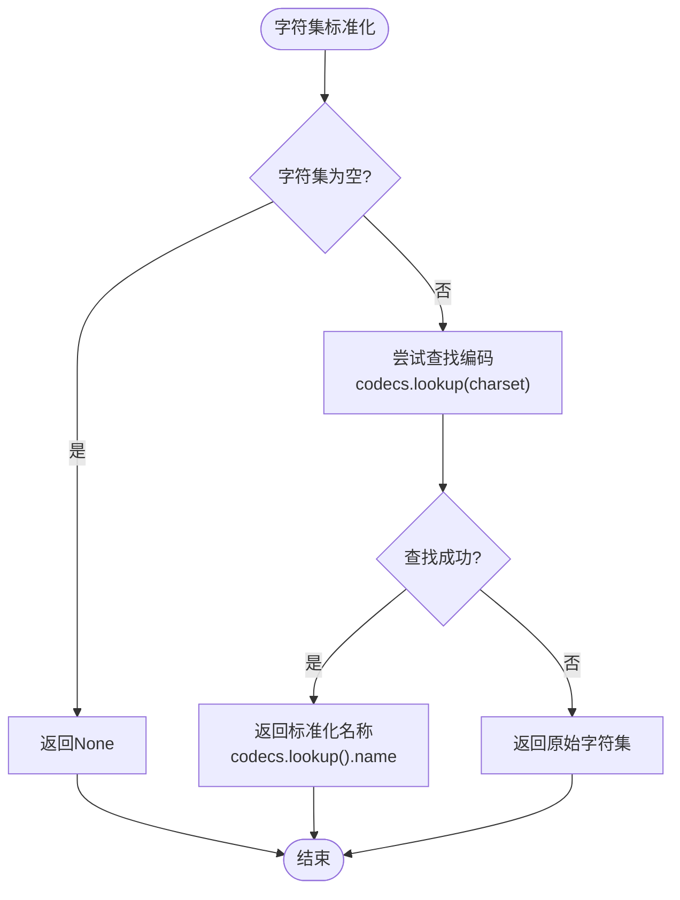
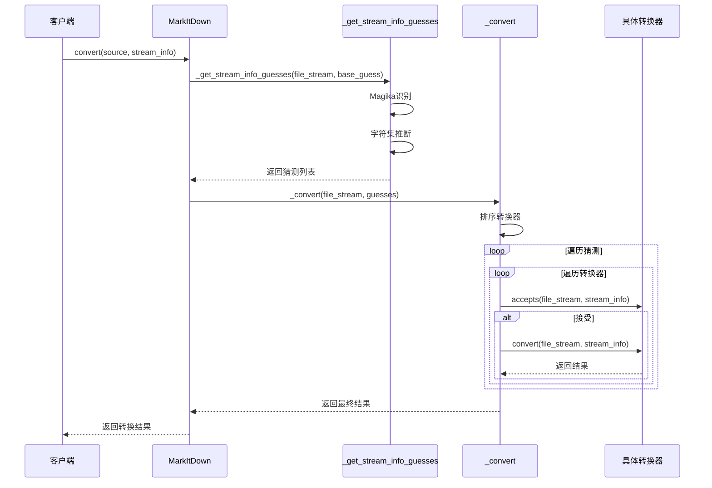
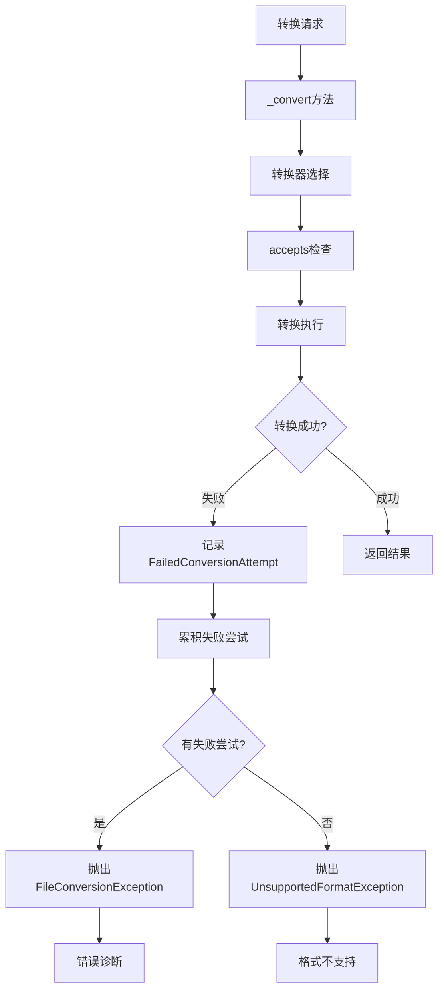
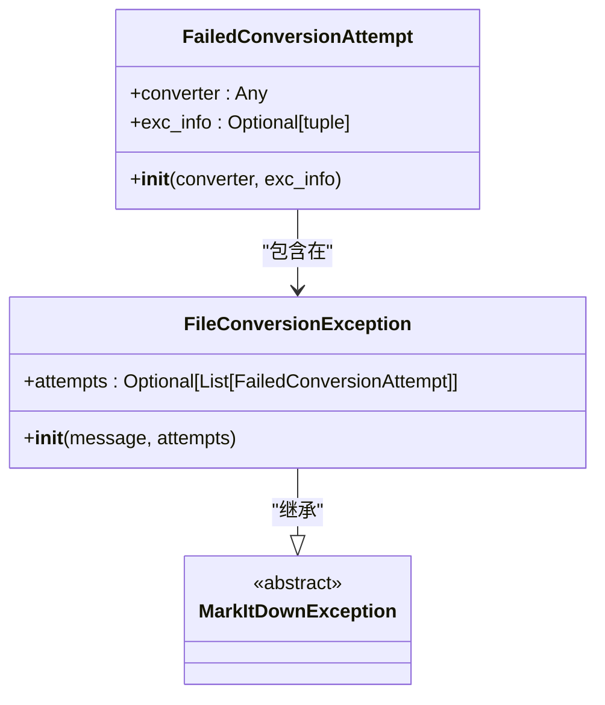
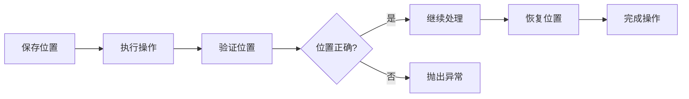

# MarkItDown类内部处理方法详细文档

<cite>
**本文档中引用的文件**
- [_markitdown.py](file://packages/markitdown/src/markitdown/_markitdown.py)
- [_stream_info.py](file://packages/markitdown/src/markitdown/_stream_info.py)
- [_base_converter.py](file://packages/markitdown/src/markitdown/_base_converter.py)
- [_exceptions.py](file://packages/markitdown/src/markitdown/_exceptions.py)
- [_pdf_converter.py](file://packages/markitdown/src/markitdown/converters/_pdf_converter.py)
- [_docx_converter.py](file://packages/markitdown/src/markitdown/converters/_docx_converter.py)
</cite>

## 目录
1. [简介](#简介)
2. [项目架构概览](#项目架构概览)
3. [_convert方法转换引擎](#_convert方法转换引擎)
4. [_get_stream_info_guesses文件识别机制](#_get_stream_info_guesses文件识别机制)
5. [_normalize_charset字符集标准化](#_normalize_charset字符集标准化)
6. [内部方法协作机制](#内部方法协作机制)
7. [错误处理与诊断](#错误处理与诊断)
8. [性能优化考虑](#性能优化考虑)
9. [总结](#总结)

## 简介

MarkItDown是一个强大的文档转换库，其核心功能通过三个关键的内部私有方法实现：`_convert`、`_get_stream_info_guesses`和`_normalize_charset`。这些方法构成了一个智能的文件识别和转换系统，能够处理多种格式的文档并将其转换为Markdown格式。

本文档将深入分析这些内部方法的工作原理，揭示它们如何协同工作以实现鲁棒的文件转换流程。

## 项目架构概览

MarkItDown采用模块化的架构设计，主要组件包括：



**图表来源**
- [_markitdown.py](file://packages/markitdown/src/markitdown/_markitdown.py#L1-L50)
- [_base_converter.py](file://packages/markitdown/src/markitdown/_base_converter.py#L1-L30)

**章节来源**
- [_markitdown.py](file://packages/markitdown/src/markitdown/_markitdown.py#L1-L100)

## _convert方法转换引擎

`_convert`方法是MarkItDown的核心转换引擎，负责协调整个转换过程。该方法实现了复杂的优先级排序、猜测迭代和异常处理机制。

### 转换流程架构



**图表来源**
- [_markitdown.py](file://packages/markitdown/src/markitdown/_markitdown.py#L530-L620)

### 优先级排序机制

转换器按照预定义的优先级进行排序，确保最特定的转换器优先被尝试：

| 优先级值 | 转换器类型 | 描述 |
|---------|-----------|------|
| 0.0 | 特定文件格式 | 如.docx、.pdf、.xlsx等具体格式 |
| 10.0 | 通用文件格式 | 如text/*、application/*等通配符格式 |

### 流位置管理

转换过程中严格维护文件流的位置一致性：



**图表来源**
- [_markitdown.py](file://packages/markitdown/src/markitdown/_markitdown.py#L580-L600)

### 异常处理生命周期

转换过程中的异常处理遵循严格的生命周期管理：

1. **接受阶段异常**：转换器在accepts()方法中抛出的异常会被捕获但不会记录
2. **转换阶段异常**：转换器在convert()方法中抛出的异常会被记录为FailedConversionAttempt
3. **位置验证**：每次调用后都验证文件流位置保持不变

**章节来源**
- [_markitdown.py](file://packages/markitdown/src/markitdown/_markitdown.py#L530-L620)

## _get_stream_info_guesses文件识别机制

`_get_stream_info_guesses`方法实现了智能的文件识别系统，结合Magika文件识别引擎和mimetypes模块，生成多个StreamInfo候选对象。

### 文件识别流程



**图表来源**
- [_markitdown.py](file://packages/markitdown/src/markitdown/_markitdown.py#L710-L765)

### Magika集成机制

Magika提供了强大的文件内容识别能力：

1. **内容检测**：读取文件头部内容进行智能识别
2. **字符集推断**：对于文本文件，推断字符编码
3. **扩展名预测**：提供可能的文件扩展名列表
4. **兼容性验证**：确保识别结果与用户提供的信息兼容

### 字符集推断流程



**图表来源**
- [_markitdown.py](file://packages/markitdown/src/markitdown/_markitdown.py#L730-L750)

### 兼容性判断逻辑

文件识别系统实现了严格的兼容性检查：

| 检查项 | 规则 | 处理方式 |
|-------|------|----------|
| MIME类型兼容性 | 基础mimetype与Magika结果一致 | 如果不一致，添加两个猜测 |
| 扩展名兼容性 | 基础扩展名在Magika扩展名列表中 | 如果不兼容，添加两个猜测 |
| 字符集兼容性 | 基础字符集与推断字符集匹配 | 使用标准化后的字符集 |

**章节来源**
- [_markitdown.py](file://packages/markitdown/src/markitdown/_markitdown.py#L710-L765)

## _normalize_charset字符集标准化

`_normalize_charset`方法负责标准化字符集名称，确保在整个系统中的一致性。

### 标准化流程



**图表来源**
- [_markitdown.py](file://packages/markitdown/src/markitdown/_markitdown.py#L764-L775)

### 编码查找机制

该方法利用Python的codecs模块进行编码查找：

1. **标准化查找**：将非标准字符集名称转换为标准名称
2. **错误处理**：查找失败时保留原始字符集名称
3. **一致性保证**：确保相同字符集的不同表示形式得到统一处理

### 实际应用示例

| 输入字符集 | 标准化后 | 说明 |
|-----------|----------|------|
| utf-8 | utf_8 | 将连字符替换为下划线 |
| UTF-8 | utf_8 | 大小写标准化 |
| latin1 | latin_1 | 别名标准化 |
| unknown | unknown | 无法识别的字符集保持原样 |

**章节来源**
- [_markitdown.py](file://packages/markitdown/src/markitdown/_markitdown.py#L764-L775)

## 内部方法协作机制

三个内部方法通过精心设计的协作机制实现高效的文件转换流程。

### 方法调用序列



**图表来源**
- [_markitdown.py](file://packages/markitdown/src/markitdown/_markitdown.py#L200-L250)
- [_markitdown.py](file://packages/markitdown/src/markitdown/_markitdown.py#L530-L550)

### 数据流转机制

各方法间的数据流转遵循严格的模式：

1. **输入验证**：每个方法都验证输入参数的有效性
2. **中间状态**：StreamInfo对象作为主要数据载体
3. **输出标准化**：所有方法都返回标准化的结果格式

### 错误传播路径



**图表来源**
- [_markitdown.py](file://packages/markitdown/src/markitdown/_markitdown.py#L600-L620)
- [_exceptions.py](file://packages/markitdown/src/markitdown/_exceptions.py#L38-L75)

**章节来源**
- [_markitdown.py](file://packages/markitdown/src/markitdown/_markitdown.py#L530-L775)

## 错误处理与诊断

MarkItDown实现了完善的错误处理和诊断机制，特别是通过FailedConversionAttempt类收集详细的转换失败信息。

### FailedConversionAttempt异常收集机制

FailedConversionAttempt类的设计体现了深度的错误诊断理念：



**图表来源**
- [_exceptions.py](file://packages/markitdown/src/markitdown/_exceptions.py#L38-L75)

### 错误诊断价值

FailedConversionAttempt提供了丰富的诊断信息：

| 属性 | 类型 | 描述 | 诊断价值 |
|------|------|------|----------|
| converter | Any | 抛出异常的转换器实例 | 确定失败的具体转换器 |
| exc_info | Optional[tuple] | Python异常信息元组 | 获取异常类型和详细消息 |

### 错误报告格式

FileConversionException提供了结构化的错误报告：

```
文件转换失败，经过 {尝试次数} 次尝试：
- {转换器名称} 抛出 {异常类型}，消息：{异常消息}
- {转换器名称} 提供了无执行信息
```

### 转换器级别错误隔离

每个转换器的失败都被独立记录，这种设计的优势：

1. **故障定位**：快速确定问题出现在哪个转换器
2. **调试支持**：提供详细的上下文信息
3. **性能分析**：统计不同转换器的成功率
4. **改进指导**：识别需要优化的转换器

**章节来源**
- [_exceptions.py](file://packages/markitdown/src/markitdown/_exceptions.py#L38-L75)
- [_markitdown.py](file://packages/markitdown/src/markitdown/_markitdown.py#L590-L620)

## 性能优化考虑

MarkItDown的内部方法在设计时充分考虑了性能优化，特别是在文件识别和转换过程中。

### 流位置优化

严格的位置管理避免了不必要的文件读取操作：



### 内存使用优化

1. **流式处理**：大部分操作都是流式处理，避免大文件的完全加载
2. **延迟加载**：插件和依赖项采用延迟加载策略
3. **资源清理**：及时释放不需要的资源

### 并发安全考虑

虽然当前实现不是完全并发安全的，但在设计上考虑了以下因素：

1. **不可变数据结构**：StreamInfo使用frozen dataclass
2. **状态隔离**：每个转换调用都有独立的状态
3. **资源管理**：明确的资源获取和释放模式

### 缓存策略

虽然没有显式的缓存机制，但以下设计有利于缓存友好：

1. **确定性行为**：相同的输入总是产生相同的结果
2. **幂等操作**：多次调用不会产生副作用
3. **局部性原则**：相关操作在时间上紧密相邻

## 总结

MarkItDown的三个内部私有方法构成了一个精密的文件转换生态系统：

1. **_convert方法**：作为转换引擎，实现了智能的优先级排序、猜测迭代和异常处理
2. **_get_stream_info_guesses方法**：作为文件识别引擎，结合Magika和mimetypes模块提供多维度的文件分析
3. **_normalize_charset方法**：作为字符集标准化器，确保编码处理的一致性

这三个方法通过精心设计的协作机制，实现了以下核心价值：

- **智能识别**：基于内容和元数据的双重验证
- **鲁棒转换**：多层次的错误处理和恢复机制  
- **高效性能**：流式处理和资源优化
- **深度诊断**：详细的错误信息和调试支持

这种设计使得MarkItDown能够在面对各种复杂文件格式时，都能提供可靠、高效的转换服务，同时为开发者提供了良好的调试和扩展能力。