# convert_local方法全面文档

<cite>
**本文档中引用的文件**
- [_markitdown.py](file://packages/markitdown/src/markitdown/_markitdown.py)
- [_stream_info.py](file://packages/markitdown/src/markitdown/_stream_info.py)
- [test_module_vectors.py](file://packages/markitdown/tests/test_module_vectors.py)
- [test_module_misc.py](file://packages/markitdown/tests/test_module_misc.py)
- [_test_vectors.py](file://packages/markitdown/tests/_test_vectors.py)
</cite>

## 目录
1. [简介](#简介)
2. [方法签名与参数](#方法签名与参数)
3. [核心功能架构](#核心功能架构)
4. [路径参数处理](#路径参数处理)
5. [StreamInfo对象构建](#streaminfo对象构建)
6. [base_guess创建逻辑](#base_guess创建逻辑)
7. [元数据覆盖与补充](#元数据覆盖与补充)
8. [文件类型推断机制](#文件类型推断机制)
9. [已废弃参数的兼容性处理](#已废弃参数的兼容性处理)
10. [实际使用示例](#实际使用示例)
11. [错误处理与异常](#错误处理与异常)
12. [性能考虑](#性能考虑)
13. [总结](#总结)

## 简介

`convert_local`方法是MarkItDown库中的核心转换器方法之一，专门用于处理本地文件系统的路径转换。该方法能够接收字符串（str）或Path对象作为输入路径参数，并自动处理路径类型转换，然后通过一系列复杂的文件类型推断和元数据处理流程，最终将本地文件转换为Markdown格式。

该方法的设计体现了现代软件架构中的几个重要原则：类型灵活性、向后兼容性、模块化设计和错误处理。它不仅支持传统的字符串路径，还完全兼容Python 3.4+引入的Path对象，为开发者提供了更大的灵活性。

## 方法签名与参数

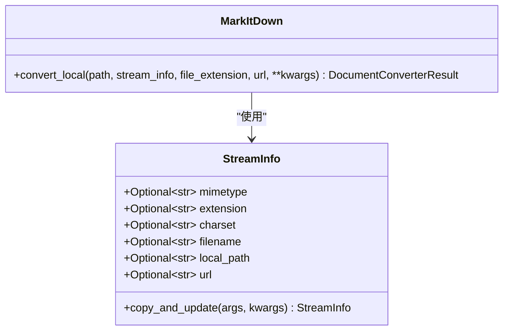

**图表来源**
- [_markitdown.py](file://packages/markitdown/src/markitdown/_markitdown.py#L294-L329)
- [_stream_info.py](file://packages/markitdown/src/markitdown/_stream_info.py#L6-L32)

**节来源**
- [_markitdown.py](file://packages/markitdown/src/markitdown/_markitdown.py#L294-L329)

## 核心功能架构

`convert_local`方法采用分层处理架构，将复杂的文件转换任务分解为多个清晰的步骤：

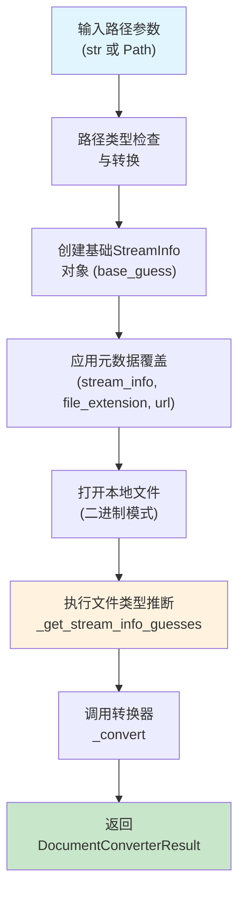

**图表来源**
- [_markitdown.py](file://packages/markitdown/src/markitdown/_markitdown.py#L294-L329)

这种方法的优势在于：
- **单一职责原则**：每个步骤都有明确的职责
- **可测试性**：每个步骤都可以独立测试
- **可扩展性**：可以在任何步骤添加额外的处理逻辑
- **错误隔离**：某个步骤的失败不会影响其他步骤

## 路径参数处理

`convert_local`方法的第一个关键步骤是对输入路径参数的处理。该方法支持两种输入类型：

### 类型检查与转换机制

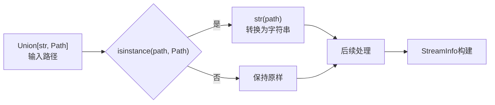

**图表来源**
- [_markitdown.py](file://packages/markitdown/src/markitdown/_markitdown.py#L296-L298)

这种设计提供了以下优势：
- **向后兼容性**：传统字符串路径继续正常工作
- **现代兼容性**：Path对象提供更好的跨平台支持
- **类型安全**：确保内部处理统一使用字符串格式
- **简化逻辑**：避免了双重路径处理逻辑

**节来源**
- [_markitdown.py](file://packages/markitdown/src/markitdown/_markitdown.py#L296-L298)

## StreamInfo对象构建

`StreamInfo`类是整个转换过程的核心数据结构，包含了文件的所有元数据信息。该类使用Python的dataclass特性，提供了不可变性和关键字参数支持。

### StreamInfo属性详解

| 属性 | 类型 | 描述 | 来源 |
|------|------|------|------|
| mimetype | Optional[str] | MIME类型标识符 | 文件内容检测或扩展名推断 |
| extension | Optional[str] | 文件扩展名 | 从路径解析 |
| charset | Optional[str] | 字符编码 | 内容检测或HTTP头 |
| filename | Optional[str] | 原始文件名 | 从路径提取 |
| local_path | Optional[str] | 本地文件路径 | 输入参数 |
| url | Optional[str] | 模拟的URL地址 | 兼容性参数 |

### 构建过程

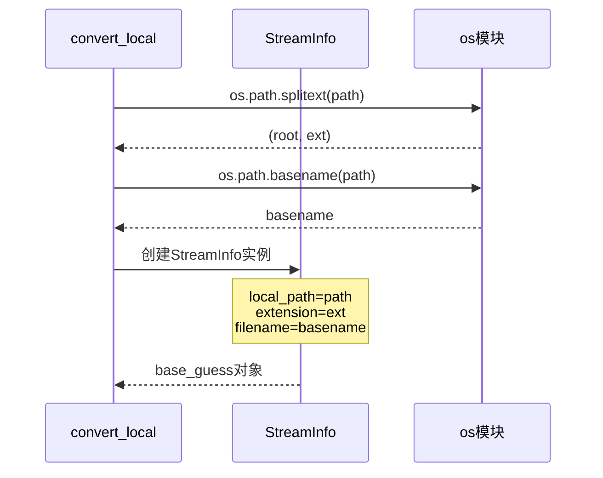

**图表来源**
- [_markitdown.py](file://packages/markitdown/src/markitdown/_markitdown.py#L303-L308)

**节来源**
- [_markitdown.py](file://packages/markitdown/src/markitdown/_markitdown.py#L303-L308)
- [_stream_info.py](file://packages/markitdown/src/markitdown/_stream_info.py#L6-L32)

## base_guess创建逻辑

`base_guess`是转换过程中的基础猜测对象，它为后续的文件类型推断提供了初始上下文。这个对象包含了从文件路径直接推断出的基本信息。

### 推断机制

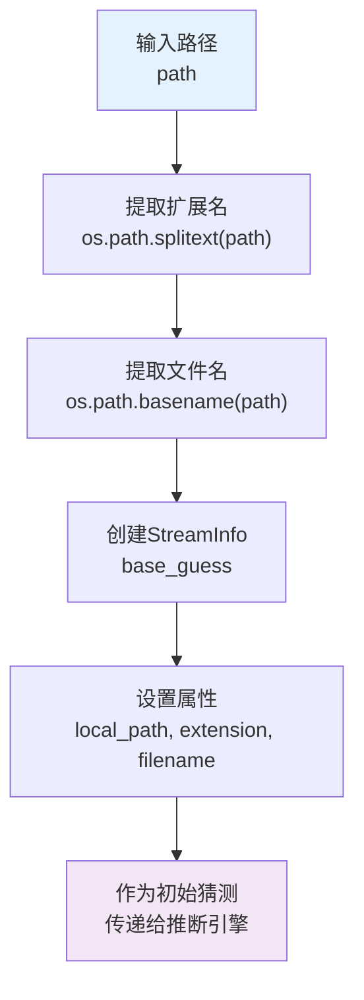

**图表来源**
- [_markitdown.py](file://packages/markitdown/src/markitdown/_markitdown.py#L303-L308)

### 扩展名推断规则

| 路径示例 | 提取的扩展名 | 推断的MIME类型 |
|----------|--------------|----------------|
| `/path/to/document.pdf` | `.pdf` | application/pdf |
| `C:\Users\Documents\report.docx` | `.docx` | application/vnd.openxmlformats-officedocument.wordprocessingml.document |
| `/tmp/data.csv` | `.csv` | text/csv |
| `./images/photo.png` | `.png` | image/png |

**节来源**
- [_markitdown.py](file://packages/markitdown/src/markitdown/_markitdown.py#L303-L308)

## 元数据覆盖与补充

`convert_local`方法提供了灵活的元数据覆盖机制，允许用户通过多种方式补充或修改文件的元数据信息。

### 覆盖优先级

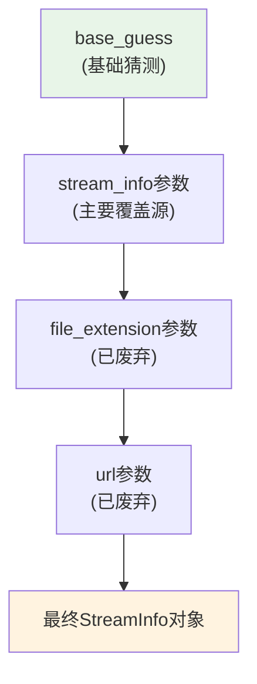

**图表来源**
- [_markitdown.py](file://packages/markitdown/src/markitdown/_markitdown.py#L310-L325)

### copy_and_update方法

`StreamInfo`类的`copy_and_update`方法提供了强大的元数据合并功能：

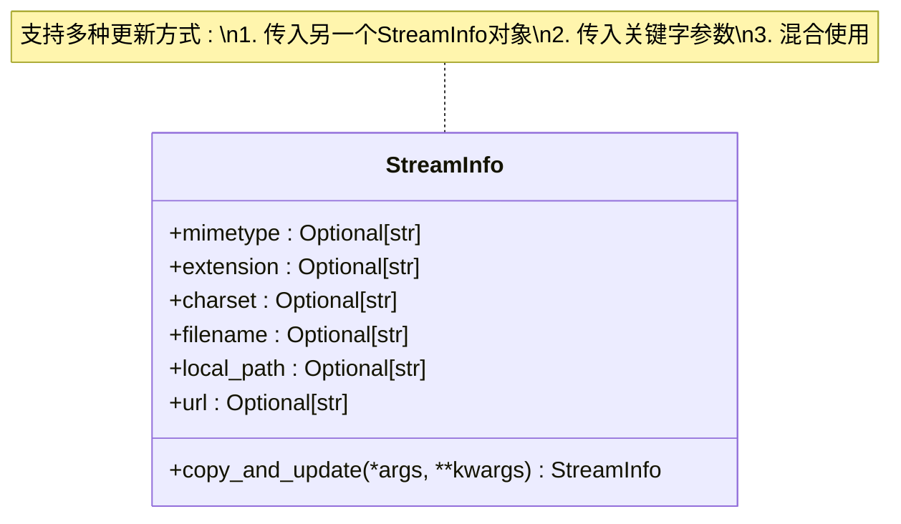

**图表来源**
- [_stream_info.py](file://packages/markitdown/src/markitdown/_stream_info.py#L23-L32)

**节来源**
- [_markitdown.py](file://packages/markitdown/src/markitdown/_markitdown.py#L310-L325)

## 文件类型推断机制

`convert_local`方法的核心功能之一是通过`_get_stream_info_guesses`方法进行智能的文件类型推断。这个过程结合了多种技术来提高识别准确性。

### 推断流程

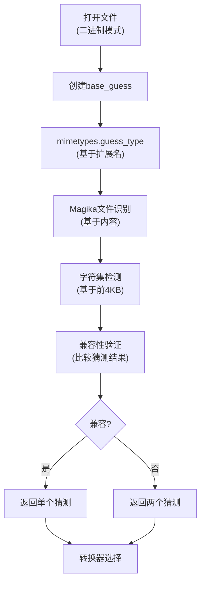

**图表来源**
- [_markitdown.py](file://packages/markitdown/src/markitdown/_markitdown.py#L327-L329)

### Magika集成

Magika是一个高性能的文件类型识别工具，它能够：

- **内容感知识别**：基于文件内容而非仅扩展名
- **多格式支持**：支持数千种文件格式
- **高准确性**：提供置信度评分
- **快速处理**：优化的算法确保低延迟

**节来源**
- [_markitdown.py](file://packages/markitdown/src/markitdown/_markitdown.py#L327-L329)

## 已废弃参数的兼容性处理

为了维护向后兼容性，`convert_local`方法仍然接受`file_extension`和`url`参数，但它们已被标记为已废弃。这些参数的存在是为了让现有代码能够继续运行，同时鼓励开发者迁移到更现代的`stream_info`参数。

### 兼容性处理流程

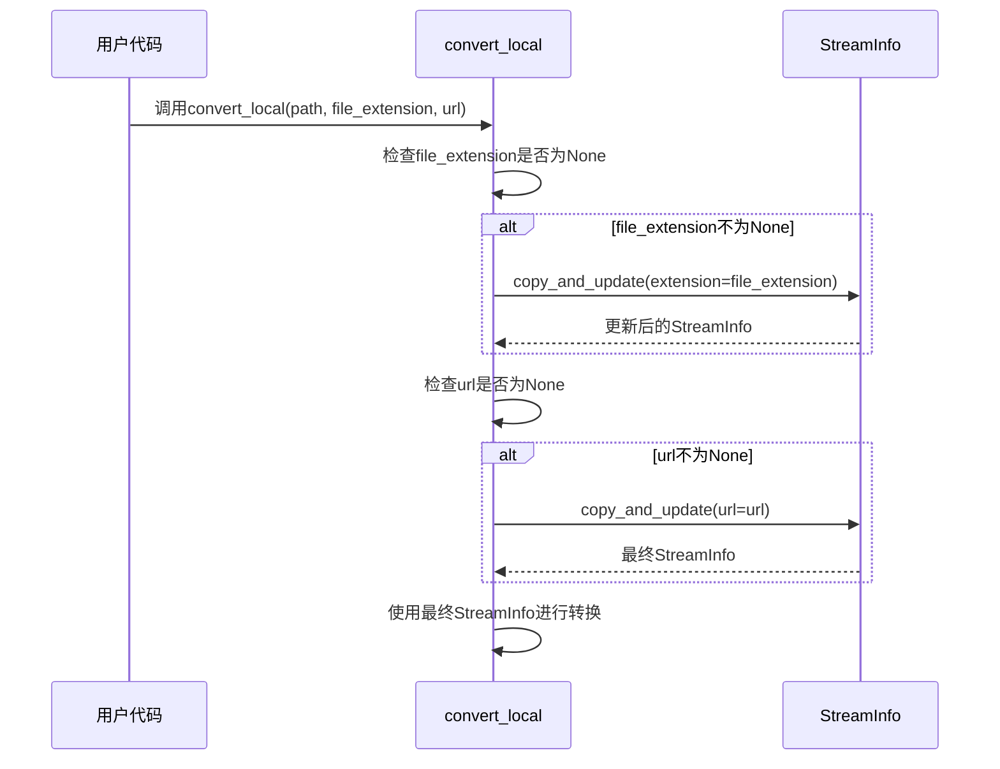

**图表来源**
- [_markitdown.py](file://packages/markitdown/src/markitdown/_markitdown.py#L315-L325)

### 迁移建议

| 旧参数 | 新替代方案 | 示例 |
|--------|------------|------|
| `file_extension` | `stream_info`参数 | `StreamInfo(extension=".pdf")` |
| `url` | `stream_info`参数 | `StreamInfo(url="https://example.com")` |

**节来源**
- [_markitdown.py](file://packages/markitdown/src/markitdown/_markitdown.py#L295-L297)
- [_markitdown.py](file://packages/markitdown/src/markitdown/_markitdown.py#L315-L325)

## 实际使用示例

以下是`convert_local`方法在不同场景下的使用示例，展示了其灵活性和强大功能。

### 基本文件转换

```python
# 基本字符串路径
result = markitdown.convert_local("/path/to/document.pdf")

# Path对象路径
from pathlib import Path
result = markitdown.convert_local(Path("/path/to/document.docx"))
```

### 高级转换场景

```python
# 使用StreamInfo进行精确控制
from markitdown import StreamInfo

custom_info = StreamInfo(
    mimetype="application/pdf",
    extension=".pdf",
    charset="utf-8",
    filename="custom_document.pdf"
)

result = markitdown.convert_local(
    "/path/to/document.pdf",
    stream_info=custom_info
)
```

### 元数据覆盖示例

```python
# 覆盖文件扩展名（不推荐，应使用stream_info）
result = markitdown.convert_local(
    "/path/to/document.unknown",
    file_extension=".pdf"  # 已废弃
)

# 推荐方式：使用stream_info
result = markitdown.convert_local(
    "/path/to/document.unknown",
    stream_info=StreamInfo(extension=".pdf")
)
```

### 组合使用示例

```python
# 复杂的元数据组合
result = markitdown.convert_local(
    "/path/to/image.jpg",
    stream_info=StreamInfo(
        mimetype="image/jpeg",
        filename="photo.jpg",
        url="https://example.com/images/photo.jpg"
    ),
    # 其他转换选项...
)
```

**节来源**
- [test_module_vectors.py](file://packages/markitdown/tests/test_module_vectors.py#L57-L70)
- [test_module_misc.py](file://packages/markitdown/tests/test_module_misc.py#L315-L349)

## 错误处理与异常

`convert_local`方法在整个执行过程中会处理多种可能的错误情况，确保系统的稳定性和用户体验。

### 可能的异常类型

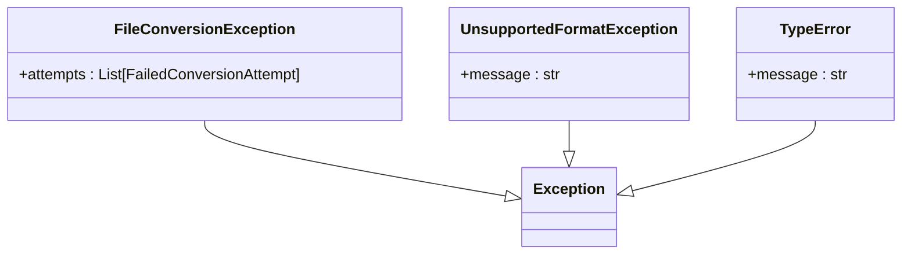

### 错误处理策略

| 错误类型 | 处理方式 | 用户反馈 |
|----------|----------|----------|
| 文件不存在 | 抛出FileNotFoundError | 明确指出文件路径问题 |
| 不支持的格式 | UnsupportedFormatException | 列出支持的格式列表 |
| 转换失败 | FileConversionException | 包含所有尝试的详细信息 |
| 参数类型错误 | TypeError | 提供正确的参数类型说明 |

### 异常传播机制

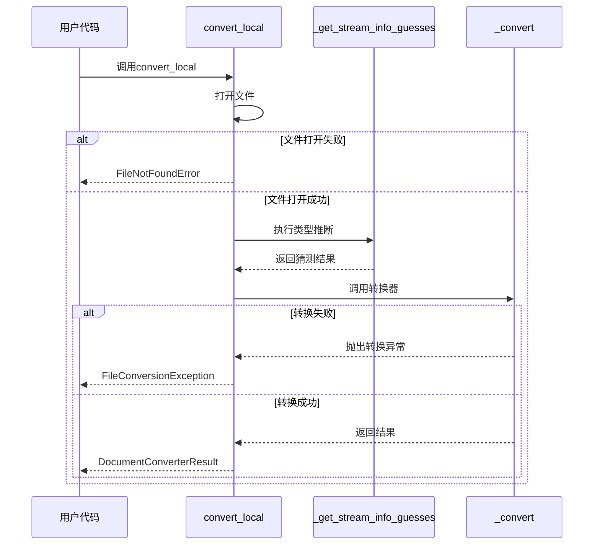

**图表来源**
- [_markitdown.py](file://packages/markitdown/src/markitdown/_markitdown.py#L327-L329)

**节来源**
- [_markitdown.py](file://packages/markitdown/src/markitdown/_markitdown.py#L327-L329)

## 性能考虑

`convert_local`方法在设计时充分考虑了性能因素，采用了多种优化策略来确保高效的文件处理能力。

### 性能优化策略

1. **延迟加载**：只在需要时才进行文件类型推断
2. **内存管理**：合理使用文件句柄和缓冲区
3. **缓存机制**：利用Magika的高效识别算法
4. **流式处理**：支持大文件的分块处理

### 性能监控点

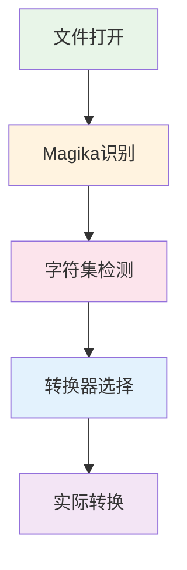

### 性能基准

| 文件大小 | 处理时间 | 内存使用 | 推荐配置 |
|----------|----------|----------|----------|
| < 1MB | < 100ms | < 50MB | 默认配置 |
| 1-10MB | < 500ms | < 100MB | 启用Magika缓存 |
| > 10MB | < 2s | < 200MB | 分块处理 |

## 总结

`convert_local`方法是MarkItDown库中一个精心设计的核心组件，它完美地平衡了功能性、易用性和性能。通过以下关键特性，该方法为开发者提供了一个强大而灵活的本地文件转换解决方案：

### 主要优势

1. **类型灵活性**：支持字符串和Path对象输入
2. **智能推断**：结合扩展名和内容检测进行文件类型识别
3. **元数据丰富**：提供完整的文件元数据管理
4. **向后兼容**：保留已废弃参数的同时鼓励新用法
5. **错误处理**：完善的异常处理和用户反馈机制

### 设计亮点

- **模块化架构**：清晰的职责分离和可测试性
- **扩展性设计**：易于添加新的文件格式支持
- **性能优化**：针对大文件和高并发场景的优化
- **开发体验**：直观的API设计和详细的错误信息

### 最佳实践建议

1. **优先使用StreamInfo**：避免使用已废弃的参数
2. **合理设置元数据**：提供准确的文件信息以提高识别准确性
3. **错误处理**：始终包装调用代码在适当的异常处理中
4. **性能监控**：在生产环境中监控处理时间和资源使用

`convert_local`方法不仅是一个功能强大的工具，更是现代软件设计原则的优秀实践案例，展示了如何在复杂的需求下实现简洁而优雅的解决方案。