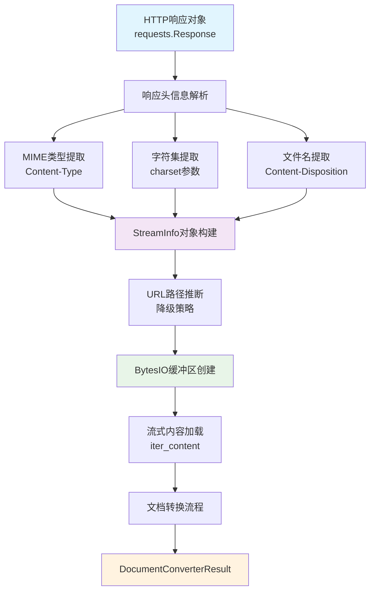
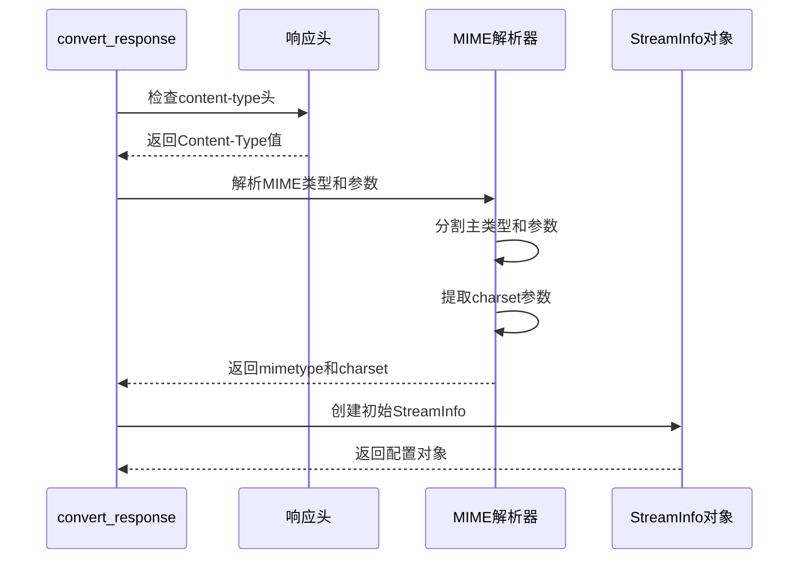
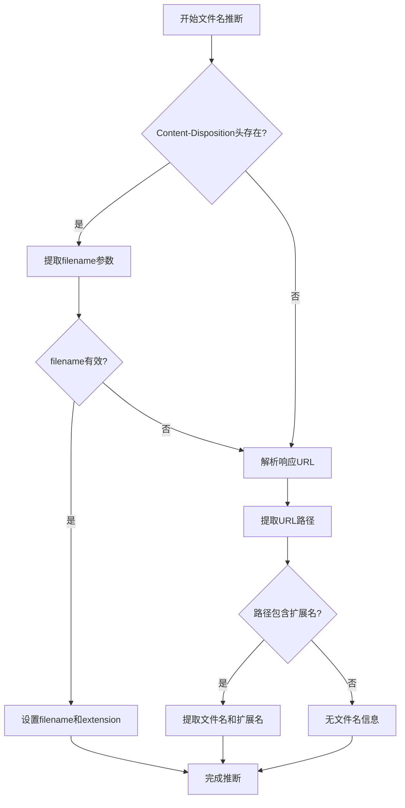
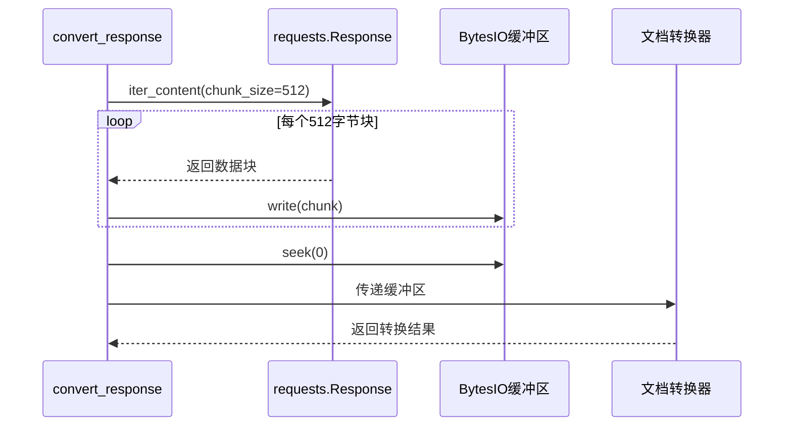
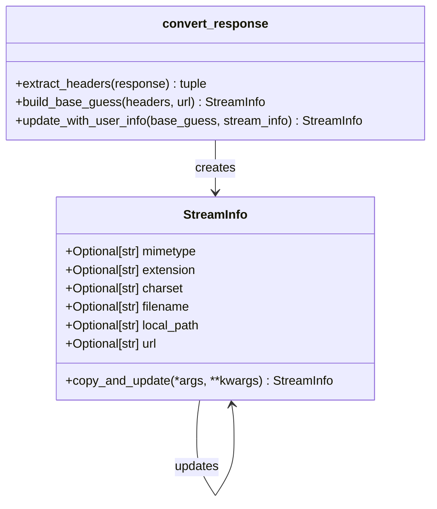

# convert_response方法详细文档

<cite>
**本文档中引用的文件**
- [_markitdown.py](file://packages/markitdown/src/markitdown/_markitdown.py)
- [_stream_info.py](file://packages/markitdown/src/markitdown/_stream_info.py)
</cite>

## 目录
1. [简介](#简介)
2. [方法概述](#方法概述)
3. [核心功能架构](#核心功能架构)
4. [HTTP响应头信息提取](#http响应头信息提取)
5. [降级策略与URL路径推断](#降级策略与url路径推断)
6. [响应体流缓冲机制](#响应体流缓冲机制)
7. [StreamInfo对象构建](#streaminfo对象构建)
8. [应用场景与最佳实践](#应用场景与最佳实践)
9. [实际示例](#实际示例)
10. [性能考虑](#性能考虑)
11. [故障排除指南](#故障排除指南)
12. [总结](#总结)

## 简介

`convert_response`方法是markitdown库中的核心组件，专门负责处理来自requests.Response对象的HTTP响应转换。该方法实现了智能的元数据提取、流式内容缓冲和格式转换，为Web抓取和API集成功景提供了强大的文档转换能力。

## 方法概述

`convert_response`方法接收一个requests.Response对象作为输入，通过解析HTTP响应头信息提取关键元数据，包括MIME类型、字符集、文件名和扩展名等。然后，它将响应体内容完整加载到内存中的BytesIO缓冲区，并构建StreamInfo对象用于后续的文档转换流程。

### 方法签名

```python
def convert_response(
    self,
    response: requests.Response,
    *,
    stream_info: Optional[StreamInfo] = None,
    file_extension: Optional[str] = None,  # 已弃用 -- 使用stream_info
    url: Optional[str] = None,  # 已弃用 -- 使用stream_info
    **kwargs: Any,
) -> DocumentConverterResult
```

## 核心功能架构



**图表来源**
- [_markitdown.py](file://packages/markitdown/src/markitdown/_markitdown.py#L458-L528)

## HTTP响应头信息提取

### MIME类型解析

方法首先检查响应头中的`Content-Type`字段，这是一个包含MIME类型和可选参数的字符串。解析过程包括：

1. **基本MIME类型提取**：从分号前的部分获取主要的MIME类型
2. **参数解析**：遍历分号后的参数部分，提取字符集信息
3. **字符集标准化**：确保字符集名称的有效性和一致性



**图表来源**
- [_markitdown.py](file://packages/markitdown/src/markitdown/_markitdown.py#L471-L478)

### 文件名提取机制

对于`Content-Disposition`头，方法使用正则表达式提取文件名：

1. **正则匹配**：搜索`filename=`后跟随的值
2. **引号处理**：移除可能存在的双引号或单引号
3. **扩展名提取**：使用os.path.splitext分离文件扩展名

**节来源**
- [_markitdown.py](file://packages/markitdown/src/markitdown/_markitdown.py#L480-L488)

## 降级策略与URL路径推断

当响应头信息不完整或缺失时，方法实现了多层降级策略：

### 第一层：Content-Disposition头优先

如果存在`Content-Disposition`头且包含文件名，则直接使用该信息。

### 第二层：URL路径推断

当没有文件名信息时，方法会从响应URL中推断文件信息：

1. **URL解析**：使用urllib.parse.urlparse解析响应URL
2. **路径提取**：从路径部分提取文件名
3. **扩展名检测**：检查路径是否包含有效的文件扩展名



**图表来源**
- [_markitdown.py](file://packages/markitdown/src/markitdown/_markitdown.py#L490-L497)

**节来源**
- [_markitdown.py](file://packages/markitdown/src/markitdown/_markitdown.py#L490-L497)

## 响应体流缓冲机制

### 流式内容加载策略

为了确保完整的响应内容被正确处理，方法采用以下缓冲策略：

1. **分块读取**：使用`iter_content(chunk_size=512)`以512字节块读取响应内容
2. **内存缓冲**：将所有数据写入BytesIO对象
3. **位置重置**：调用`seek(0)`将缓冲区指针重置到开头

### 缓冲机制的优势

- **完整性保证**：确保所有响应内容都被加载到内存
- **流定位**：为后续的文档转换提供正确的起始位置
- **兼容性**：支持各种大小的响应内容



**图表来源**
- [_markitdown.py](file://packages/markitdown/src/markitdown/_markitdown.py#L510-L515)

**节来源**
- [_markitdown.py](file://packages/markitdown/src/markitdown/_markitdown.py#L510-L515)

## StreamInfo对象构建

### 构建过程详解

StreamInfo对象是整个转换流程的核心数据结构，包含了文件的所有元信息：



**图表来源**
- [_stream_info.py](file://packages/markitdown/src/markitdown/_stream_info.py#L6-L32)
- [_markitdown.py](file://packages/markitdown/src/markitdown/_markitdown.py#L499-L507)

### 属性填充顺序

1. **基础属性**：mimetype、charset、filename、extension、url
2. **用户覆盖**：stream_info参数提供的额外信息
3. **废弃参数处理**：file_extension和url参数（已弃用）

### copy_and_update方法

StreamInfo类提供了灵活的对象更新机制：

- 支持传入多个StreamInfo对象进行合并
- 支持关键字参数直接更新属性
- 自动过滤None值，保持原有值不变

**节来源**
- [_markitdown.py](file://packages/markitdown/src/markitdown/_markitdown.py#L499-L507)
- [_stream_info.py](file://packages/markitdown/src/markitdown/_stream_info.py#L24-L32)

## 应用场景与最佳实践

### Web抓取场景

在Web抓取应用中，`convert_response`方法特别适用于：

1. **动态内容抓取**：处理由JavaScript渲染的页面
2. **API响应处理**：转换REST API返回的各种格式数据
3. **文件下载管理**：自动识别和处理不同类型的文件

### API集成场景

对于API集成，该方法提供了：

1. **格式透明性**：自动识别响应格式并进行转换
2. **元数据保留**：完整保留原始文件信息
3. **错误处理**：优雅处理格式不匹配的情况

### 最佳实践建议

1. **会话管理**：使用自定义的requests.Session对象进行连接复用
2. **超时控制**：合理设置请求超时时间
3. **错误处理**：实现适当的异常处理机制
4. **资源清理**：确保及时释放网络连接和内存资源

## 实际示例

### 基本HTTP响应处理

```python
# 创建MarkItDown实例
markitdown = MarkItDown()

# 发送HTTP请求
response = requests.get('https://example.com/document.pdf', stream=True)
response.raise_for_status()

# 转换响应
result = markitdown.convert_response(response)
```

### 自定义请求会话集成

```python
# 创建自定义会话
session = requests.Session()
session.headers.update({
    'User-Agent': 'MyApp/1.0',
    'Accept': 'application/pdf,application/json,*/*'
})

# 设置认证
session.auth = ('username', 'password')

# 执行请求
response = session.get('https://api.example.com/data')
response.raise_for_status()

# 转换响应
result = markitdown.convert_response(response)
```

### 复杂头部信息处理

```python
# 处理带有特殊头部的响应
response = requests.get('https://example.com/complex-doc')
response.headers['content-type'] = 'application/vnd.openxmlformats-officedocument.wordprocessingml.document; charset=UTF-8'
response.headers['content-disposition'] = 'attachment; filename="report.docx"'

# 转换响应
result = markitdown.convert_response(response)
```

### 结合StreamInfo参数

```python
# 提供额外的元数据信息
custom_stream_info = StreamInfo(
    mimetype='application/pdf',
    filename='custom_report.pdf',
    charset='utf-8'
)

# 转换时合并用户提供的信息
result = markitdown.convert_response(
    response,
    stream_info=custom_stream_info
)
```

## 性能考虑

### 内存使用优化

1. **分块读取**：512字节的块大小平衡了内存使用和I/O效率
2. **流式处理**：避免一次性加载大文件到内存
3. **及时释放**：转换完成后自动释放缓冲区资源

### 网络性能优化

1. **连接复用**：使用requests.Session保持连接
2. **压缩支持**：自动处理gzip、deflate等压缩格式
3. **并发处理**：支持异步请求和转换

### 缓存策略

虽然当前实现没有内置缓存，但可以通过外部机制实现：

```python
# 简单的缓存示例
cache = {}

def cached_convert_response(url):
    if url in cache:
        return cache[url]
    
    response = requests.get(url, stream=True)
    result = markitdown.convert_response(response)
    cache[url] = result
    return result
```

## 故障排除指南

### 常见问题及解决方案

#### 1. 响应头信息缺失

**问题**：Content-Type或Content-Disposition头不存在
**解决方案**：方法会自动尝试从URL路径推断文件信息

#### 2. 字符编码识别失败

**问题**：字符集信息不明确或无法识别
**解决方案**：方法会尝试使用charset_normalizer库进行自动检测

#### 3. 大文件处理性能问题

**问题**：大型文件导致内存占用过高
**解决方案**：考虑实现流式处理或分块转换

#### 4. 网络连接超时

**问题**：长时间的网络请求导致超时
**解决方案**：设置合理的timeout参数和重试机制

### 调试技巧

1. **启用详细日志**：监控响应头解析过程
2. **检查StreamInfo状态**：验证元数据提取结果
3. **监控内存使用**：观察BytesIO缓冲区大小
4. **验证转换结果**：检查最终的DocumentConverterResult

**节来源**
- [_markitdown.py](file://packages/markitdown/src/markitdown/_markitdown.py#L520-L528)

## 总结

`convert_response`方法是markitdown库中处理HTTP响应的核心组件，它通过智能的元数据提取、可靠的流式缓冲和灵活的对象构建，为各种文档转换场景提供了强大而稳定的解决方案。该方法不仅处理了常见的HTTP响应格式，还通过完善的降级策略确保了在各种复杂情况下的可靠性。

其设计体现了以下核心原则：
- **鲁棒性**：通过多层降级策略确保处理成功率
- **灵活性**：支持多种输入格式和用户自定义参数
- **性能**：采用流式处理和分块读取优化资源使用
- **可扩展性**：清晰的接口设计便于功能扩展

在实际应用中，开发者应该根据具体需求选择合适的请求会话配置、合理设置超时参数，并实现适当的错误处理和资源管理机制，以充分发挥该方法的潜力。