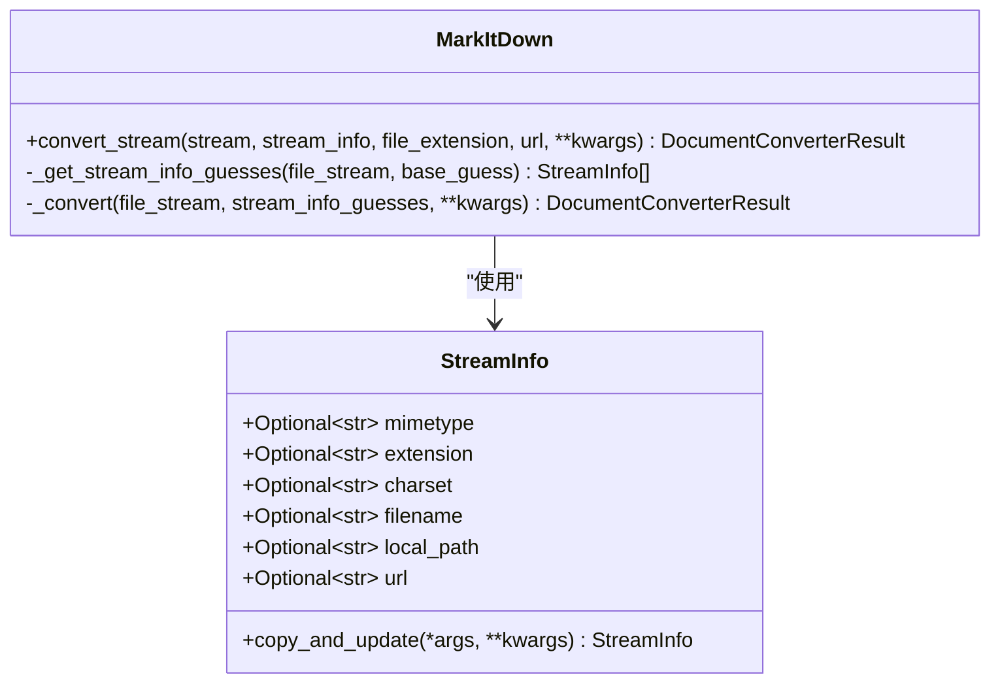
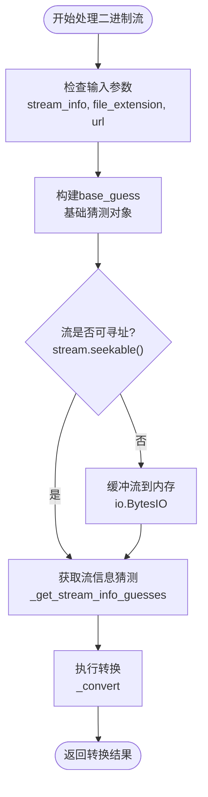
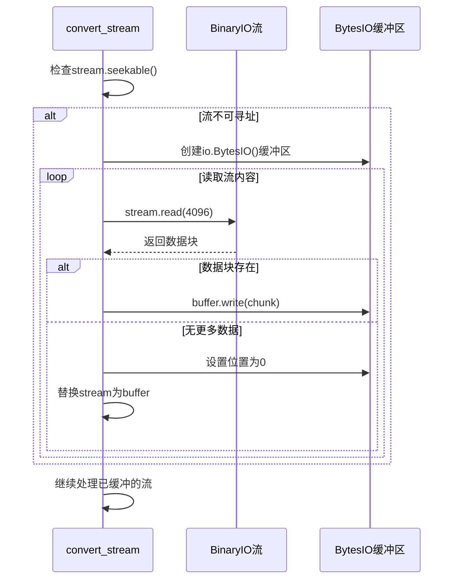
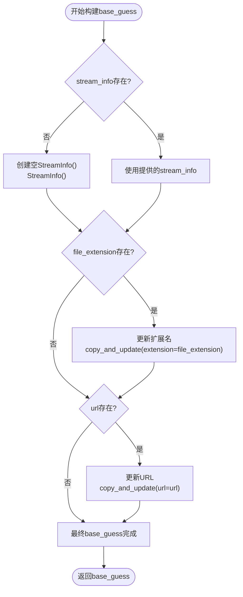
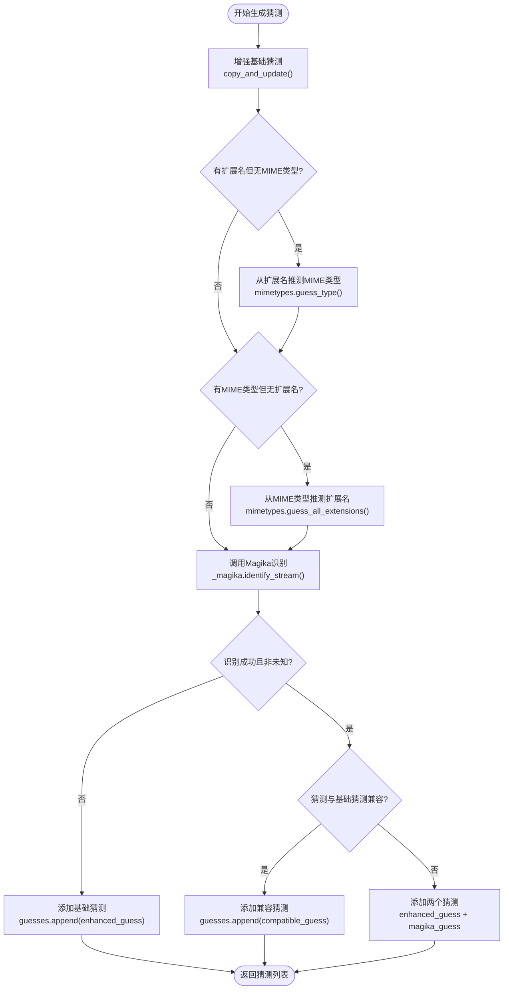
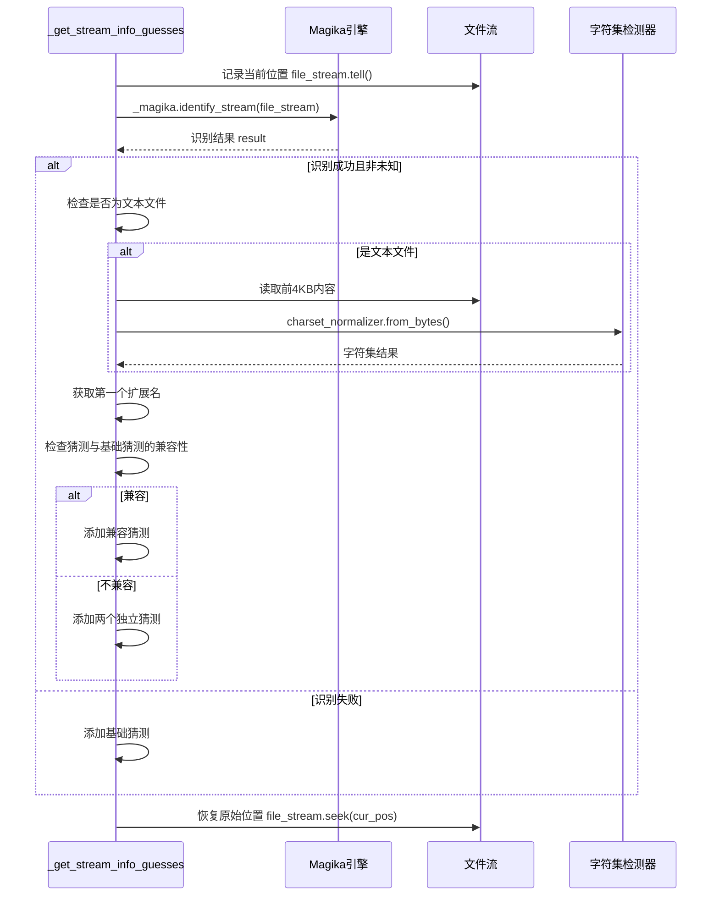
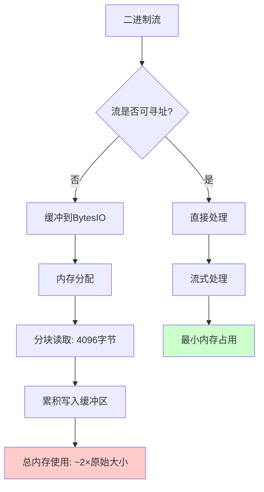

# convert_stream方法深度文档

<cite>
**本文档中引用的文件**
- [_markitdown.py](file://packages/markitdown/src/markitdown/_markitdown.py)
- [_stream_info.py](file://packages/markitdown/src/markitdown/_stream_info.py)
- [_base_converter.py](file://packages/markitdown/src/markitdown/_base_converter.py)
- [_pdf_converter.py](file://packages/markitdown/src/markitdown/converters/_pdf_converter.py)
- [_docx_converter.py](file://packages/markitdown/src/markitdown/converters/_docx_converter.py)
- [_html_converter.py](file://packages/markitdown/src/markitdown/converters/_html_converter.py)
- [test_module_vectors.py](file://packages/markitdown/tests/test_module_vectors.py)
</cite>

## 目录
1. [简介](#简介)
2. [方法签名与参数](#方法签名与参数)
3. [核心处理流程](#核心处理流程)
4. [不可寻址流的特殊处理](#不可寻址流的特殊处理)
5. [base_guess构建逻辑](#base_guess构建逻辑)
6. [_get_stream_info_guesses方法详解](#_get_stream_info_guesses方法详解)
7. [Magika文件识别引擎集成](#magika文件识别引擎集成)
8. [内存使用特性与性能权衡](#内存使用特性与性能权衡)
9. [使用示例](#使用示例)
10. [最佳实践与注意事项](#最佳实践与注意事项)
11. [总结](#总结)

## 简介

`convert_stream`方法是MarkItDown项目中的核心功能之一，专门用于处理任意二进制流的转换。该方法能够智能地处理各种类型的二进制数据源，包括本地文件、网络响应、压缩文件解压流等，并通过先进的文件类型识别技术确保转换的准确性。

该方法的设计哲学是"智能猜测+精确匹配"：首先基于提供的元数据信息构建初始猜测，然后通过Magika文件识别引擎深入分析流内容，最终选择最适合的转换器进行处理。

## 方法签名与参数



**图表来源**
- [_markitdown.py](file://packages/markitdown/src/markitdown/_markitdown.py#L331-L376)
- [_stream_info.py](file://packages/markitdown/src/markitdown/_stream_info.py#L5-L32)

**节来源**
- [_markitdown.py](file://packages/markitdown/src/markitdown/_markitdown.py#L331-L376)

## 核心处理流程

`convert_stream`方法的核心处理流程可以分为以下几个关键步骤：



**图表来源**
- [_markitdown.py](file://packages/markitdown/src/markitdown/_markitdown.py#L331-L376)

### 参数处理与验证

方法接受以下参数：
- `stream`: 必需的二进制流对象，必须支持`read()`、`seek()`和`tell()`方法
- `stream_info`: 可选的StreamInfo对象，包含流的元数据信息
- `file_extension`: 已废弃的参数，建议使用stream_info替代
- `url`: 已废弃的参数，建议使用stream_info替代
- `**kwargs`: 传递给转换器的额外参数

### 基础猜测构建

方法首先检查是否有任何可用的元数据信息来构建基础猜测。如果有，会根据提供的信息创建一个初始的`StreamInfo`对象，作为后续猜测的基础。

**节来源**
- [_markitdown.py](file://packages/markitdown/src/markitdown/_markitdown.py#L331-L359)

## 不可寻址流的特殊处理

对于不可寻址的流（non-seekable streams），`convert_stream`方法采用了一种特殊的缓冲策略：



**图表来源**
- [_markitdown.py](file://packages/markitdown/src/markitdown/_markitdown.py#L350-L360)

### 缓冲策略详解

当检测到流不可寻址时，方法会：
1. 创建一个新的`io.BytesIO`对象作为缓冲区
2. 以4096字节的块大小循环读取原始流
3. 将每个数据块写入缓冲区
4. 当读取完成时，将缓冲区的位置重置为0
5. 使用缓冲区替换原始流对象

这种策略确保了后续的转换过程可以正常进行，因为所有转换器都需要能够定位到流的开头。

### 内存考虑

虽然这种方法确保了功能的完整性，但它也意味着整个流内容都会被加载到内存中。对于大型文件，这可能会导致显著的内存消耗。

**节来源**
- [_markitdown.py](file://packages/markitdown/src/markitdown/_markitdown.py#L350-L360)

## base_guess构建逻辑

`base_guess`是转换过程中的关键概念，它代表了对流内容的初始猜测和预期。构建逻辑遵循以下优先级规则：



**图表来源**
- [_markitdown.py](file://packages/markitdown/src/markitdown/_markitdown.py#L338-L359)

### 向后兼容性考虑

方法同时支持新的`stream_info`参数和已废弃的`file_extension`及`url`参数。这种设计确保了现有代码的兼容性，同时鼓励用户迁移到更现代的API。

### 优先级处理

- 如果提供了`stream_info`，则完全使用它作为基础
- 如果没有提供`stream_info`但有`file_extension`，则创建新的`StreamInfo`并更新扩展名
- 如果只有`url`参数，同样创建新对象并更新URL

**节来源**
- [_markitdown.py](file://packages/markitdown/src/markitdown/_markitdown.py#L338-L359)

## _get_stream_info_guesses方法详解

`_get_stream_info_guesses`方法是转换过程中的核心推理引擎，负责基于流内容生成多个可能的文件类型猜测：



**图表来源**
- [_markitdown.py](file://packages/markitdown/src/markitdown/_markitdown.py#L653-L764)

### MIME类型与扩展名互推

方法实现了MIME类型和文件扩展名之间的双向推测：

1. **扩展名→MIME类型**: 使用Python标准库的`mimetypes.guess_type()`函数
2. **MIME类型→扩展名**: 使用`mimetypes.guess_all_extensions()`获取所有可能的扩展名

### Magika集成点

Magika是一个强大的文件类型识别引擎，它能够：
- 分析流的前4KB内容
- 提供准确的文件类型预测
- 支持文本文件的字符集检测
- 处理复杂的文件格式

**节来源**
- [_markitdown.py](file://packages/markitdown/src/markitdown/_markitdown.py#L653-L764)

## Magika文件识别引擎集成

Magika的集成是`convert_stream`方法的核心优势之一，它提供了超越传统文件扩展名检测的能力：



**图表来源**
- [_markitdown.py](file://packages/markitdown/src/markitdown/_markitdown.py#L684-L764)

### 字符集检测

对于文本文件，Magika识别后还会触发字符集检测：
1. 读取流的前4KB内容
2. 使用`charset_normalizer`库分析字符编码
3. 正规化字符集名称
4. 将结果合并到猜测对象中

### 兼容性检查

Magika的猜测只有在与基础猜测兼容时才会被添加到候选列表中。兼容性检查包括：
- MIME类型匹配
- 扩展名匹配
- 字符集匹配

**节来源**
- [_markitdown.py](file://packages/markitdown/src/markitdown/_markitdown.py#L684-L764)

## 内存使用特性与性能权衡

`convert_stream`方法在内存使用和性能方面做出了重要的设计决策：

### 内存使用模式



### 性能权衡分析

| 场景 | 内存使用 | 处理速度 | 准确性 | 推荐使用 |
|------|----------|----------|--------|----------|
| 可寻址流 | 最小 | 最快 | 高 | 完全推荐 |
| 不可寻址流 | 中等 | 中等 | 最高 | 必要时使用 |
| 大型文件 | 显著增加 | 变慢 | 最高 | 谨慎使用 |

### 优化建议

1. **优先使用可寻址流**: 对于本地文件或网络响应，尽量保持流的可寻址性
2. **控制流大小**: 对于大型文件，考虑先进行预处理或分块处理
3. **及时释放资源**: 确保流对象在使用后正确关闭
4. **监控内存使用**: 在生产环境中监控内存消耗情况

**节来源**
- [_markitdown.py](file://packages/markitdown/src/markitdown/_markitdown.py#L350-L360)

## 使用示例

以下是`convert_stream`方法的各种使用场景和最佳实践：

### 基本使用示例

```python
# 从本地文件创建流
with open('document.pdf', 'rb') as file_stream:
    result = markitdown.convert_stream(file_stream)
    print(result.markdown)

# 从网络响应创建流
response = requests.get('https://example.com/document.docx')
result = markitdown.convert_stream(response.raw)
```

### 使用StreamInfo提供提示

```python
# 提供完整的元数据信息
stream_info = StreamInfo(
    mimetype='application/vnd.openxmlformats-officedocument.wordprocessingml.document',
    extension='.docx',
    charset='utf-8'
)

with open('document.docx', 'rb') as file_stream:
    result = markitdown.convert_stream(file_stream, stream_info=stream_info)
```

### 处理压缩文件解压流

```python
import zipfile
import io

# 从ZIP文件中提取流
with zipfile.ZipFile('archive.zip') as zf:
    with zf.open('inner_file.txt') as zipped_stream:
        # 这个流通常是不可寻址的
        result = markitdown.convert_stream(zipped_stream)
```

### 处理网络响应流

```python
# 处理大文件下载
response = requests.get('https://example.com/large-file.pdf', stream=True)
result = markitdown.convert_stream(response.raw)
```

### 使用URL参数提供上下文

```python
# 提供URL上下文信息
result = markitdown.convert_stream(
    file_stream,
    url='https://github.com/example/repo/blob/main/document.md'
)
```

**节来源**
- [test_module_vectors.py](file://packages/markitdown/tests/test_module_vectors.py#L71-L92)
- [test_module_vectors.py](file://packages/markitdown/tests/test_module_vectors.py#L92-L108)

## 最佳实践与注意事项

### 性能优化建议

1. **优先使用可寻址流**: 避免不必要的内存缓冲
2. **合理设置chunk_size**: 对于大文件，考虑调整读取块大小
3. **及时清理资源**: 使用上下文管理器确保流正确关闭
4. **监控内存使用**: 在生产环境中跟踪内存消耗

### 错误处理策略

```python
try:
    result = markitdown.convert_stream(file_stream)
except UnsupportedFormatException as e:
    # 处理不支持的文件格式
    logger.warning(f"Unsupported format: {e}")
except FileConversionException as e:
    # 处理转换过程中的错误
    logger.error(f"Conversion failed: {e}")
```

### 兼容性注意事项

1. **向后兼容**: 虽然`file_extension`和`url`参数已废弃，但仍支持
2. **字符集处理**: 确保正确处理非UTF-8编码的文本文件
3. **MIME类型映射**: 依赖系统的MIME类型数据库
4. **Magika依赖**: 确保Magika引擎正确安装和配置

### 调试技巧

1. **启用详细日志**: 查看转换过程中的猜测信息
2. **检查StreamInfo**: 验证提供的元数据是否准确
3. **测试多种格式**: 确保对各种文件格式都有良好的支持
4. **监控性能指标**: 关注内存使用和处理时间

## 总结

`convert_stream`方法是MarkItDown项目中处理二进制流转换的核心组件，它通过智能的猜测机制和先进的文件识别技术，为用户提供了一个强大而灵活的文档转换解决方案。

### 主要优势

1. **智能猜测**: 结合元数据和内容分析，提供准确的文件类型识别
2. **容错性强**: 能够优雅地处理各种类型的二进制流
3. **扩展性好**: 支持插件系统和自定义转换器
4. **性能优化**: 通过多层猜测减少不必要的转换尝试

### 技术亮点

1. **Magika集成**: 利用先进的文件识别引擎提高准确性
2. **不可寻址流处理**: 通过内存缓冲确保功能完整性
3. **向后兼容**: 平滑迁移路径，保护现有代码
4. **流式处理**: 支持大文件和网络流的高效处理

### 应用价值

该方法不仅解决了二进制流转换的技术挑战，还为AI应用提供了高质量的文档内容提取能力，是构建智能文档处理系统的重要基础设施。