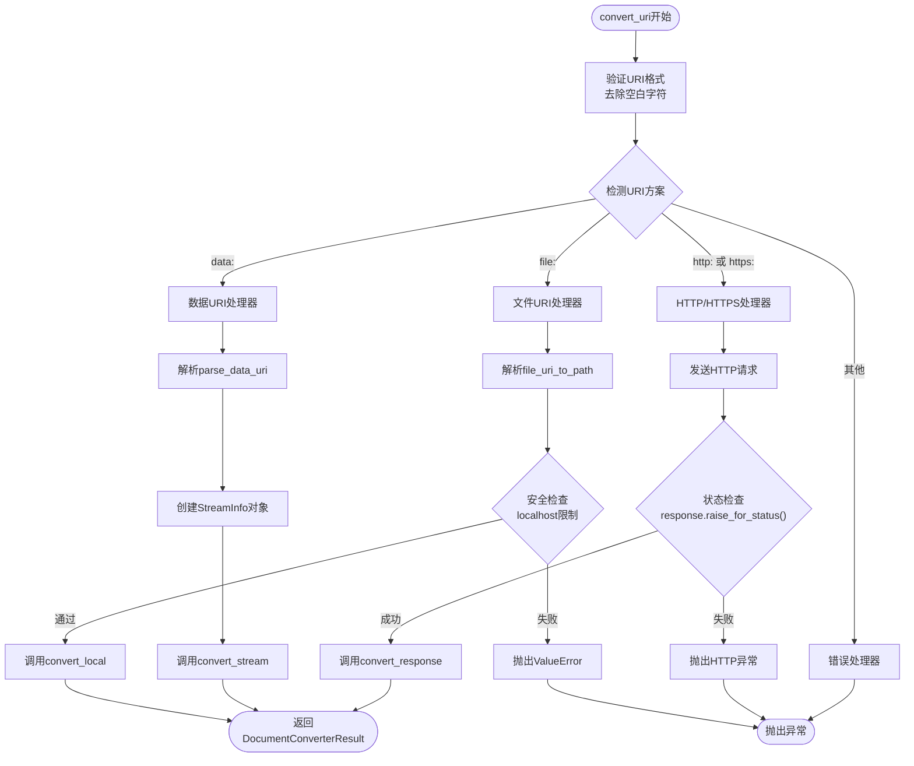
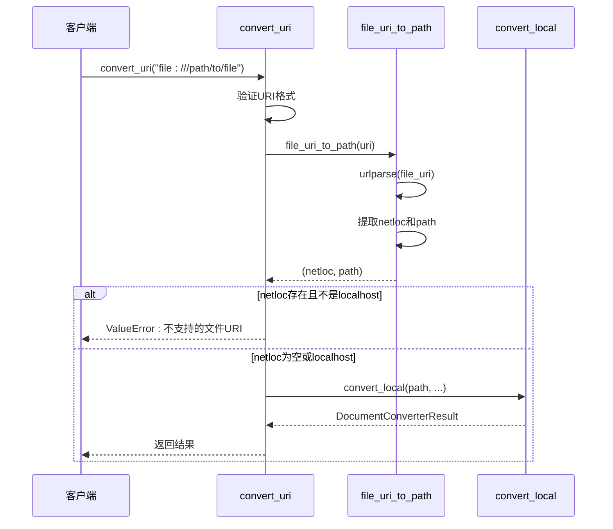
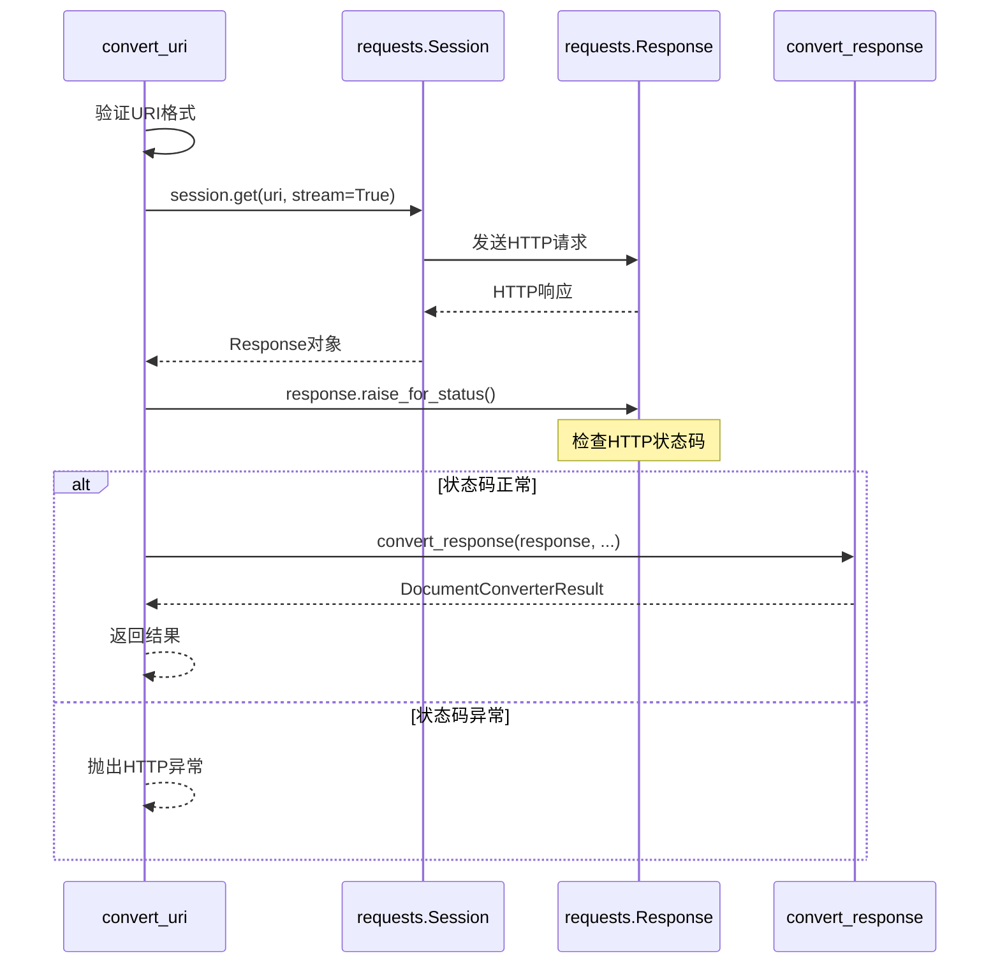
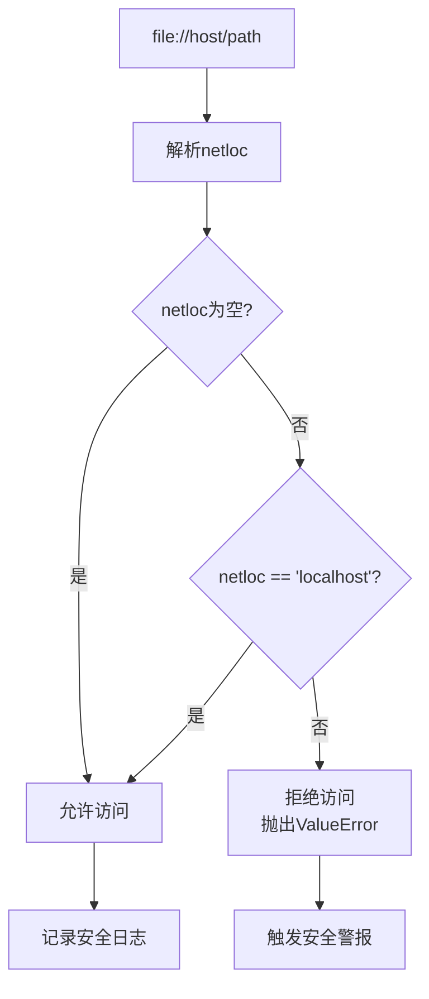
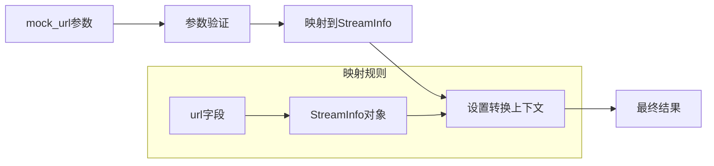

# convert_uri方法系统文档

<cite>
**本文档中引用的文件**
- [_markitdown.py](file://packages/markitdown/src/markitdown/_markitdown.py)
- [_uri_utils.py](file://packages/markitdown/src/markitdown/_uri_utils.py)
- [_stream_info.py](file://packages/markitdown/src/markitdown/_stream_info.py)
- [test_module_misc.py](file://packages/markitdown/tests/test_module_misc.py)
- [test_module_vectors.py](file://packages/markitdown/tests/test_module_vectors.py)
</cite>

## 目录
1. [简介](#简介)
2. [方法概述](#方法概述)
3. [核心架构](#核心架构)
4. [URI方案处理详解](#uri方案处理详解)
5. [安全机制](#安全机制)
6. [mock_url参数详解](#mock_url参数详解)
7. [实用示例](#实用示例)
8. [最佳实践](#最佳实践)
9. [故障排除](#故障排除)
10. [总结](#总结)

## 简介

`convert_uri`方法是MarkItDown文档转换器的核心统一接口，专门设计用于处理多种URI方案（file:、data:、http:、https:）的文档转换任务。该方法通过智能路由机制，将不同类型的URI请求分发到相应的处理器，确保安全性和效率的同时提供灵活的转换能力。

## 方法概述

`convert_uri`方法位于`MarkItDown`类中，是一个关键的统一入口点，负责：
- 检测URI方案类型
- 执行方案特定的解析逻辑
- 调用相应的转换器
- 处理错误和异常
- 支持测试和代理场景的特殊参数

### 方法签名

```python
def convert_uri(
    self,
    uri: str,
    *,
    stream_info: Optional[StreamInfo] = None,
    file_extension: Optional[str] = None,  # 已弃用 -- 使用stream_info
    mock_url: Optional[str] = None,  # 模拟请求来源URL
    **kwargs: Any,
) -> DocumentConverterResult
```

**节源码**
- [_markitdown.py](file://packages/markitdown/src/markitdown/_markitdown.py#L397-L456)

## 核心架构



**图表源码**
- [_markitdown.py](file://packages/markitdown/src/markitdown/_markitdown.py#L397-L456)

## URI方案处理详解

### file: 方案处理

file:方案专门处理本地文件访问，具有严格的安全限制。

#### 解析流程



**图表源码**
- [_markitdown.py](file://packages/markitdown/src/markitdown/_markitdown.py#L405-L415)
- [_uri_utils.py](file://packages/markitdown/src/markitdown/_uri_utils.py#L8-L16)

#### 安全考虑

file:方案实现了严格的本地主机限制，防止跨网络文件访问：

- **空netloc**: 允许访问本地文件系统
- **localhost netloc**: 允许访问本地文件系统
- **其他netloc**: 抛出`ValueError`异常

这种设计确保了安全性，防止恶意URI访问远程文件系统。

**节源码**
- [_markitdown.py](file://packages/markitdown/src/markitdown/_markitdown.py#L408-L412)

### data: 方案处理

data:方案处理内联数据URI，支持MIME类型、字符集和Base64编码。

#### 解析算法

```mermaid
flowchart TD
Start([data URI输入]) --> ValidateFormat{"验证格式<br/>以'data:'开头?"}
ValidateFormat --> |否| ThrowError1["抛出ValueError"]
ValidateFormat --> |是| SplitHeader["分割头部和数据<br/>header,data = uri.partition(',')"]
SplitHeader --> CheckSeparator{"检查分隔符<br/>是否存在','?"}
CheckSeparator --> |否| ThrowError2["抛出ValueError"]
CheckSeparator --> |是| ParseMeta["解析元数据<br/>meta = header[5:]"]
ParseMeta --> SplitParts["分割部分<br/>parts = meta.split(';')"]
SplitParts --> CheckBase64{"最后部分是否为<br/>'base64'?"}
CheckBase64 --> |是| RemoveBase64["移除base64标记<br/>is_base64 = True"]
CheckBase64 --> |否| SetBase64False["is_base64 = False"]
RemoveBase64 --> ExtractMimeType["提取MIME类型<br/>mime_type = parts.pop(0)"]
SetBase64False --> ExtractMimeType
ExtractMimeType --> ParseAttributes["解析属性<br/>key=value对"]
ParseAttributes --> DecodeContent["解码内容<br/>Base64或URL解码"]
DecodeContent --> Return([返回: (mime_type, attributes, data)])
```

**图表源码**
- [_uri_utils.py](file://packages/markitdown/src/markitdown/_uri_utils.py#L18-L51)

#### 数据转换过程

data:方案的解析过程包括以下步骤：

1. **格式验证**: 确保URI以"data:"开头
2. **头部解析**: 分离MIME类型和属性
3. **Base64检测**: 检查是否包含base64标记
4. **属性提取**: 解析键值对属性
5. **内容解码**: 根据编码方式解码数据

**节源码**
- [_uri_utils.py](file://packages/markitdown/src/markitdown/_uri_utils.py#L18-L51)

### http: 和 https: 方案处理

HTTP/HTTPS方案利用`requests.Session`进行流式下载和处理。

#### 流式下载机制



**图表源码**
- [_markitdown.py](file://packages/markitdown/src/markitdown/_markitdown.py#L440-L446)

#### 响应处理特性

HTTP/HTTPS处理器具备以下特性：

- **流式处理**: 使用`stream=True`避免内存溢出
- **自动重试**: 基于`requests.Session`的重试机制
- **状态验证**: 自动调用`raise_for_status()`检查HTTP状态
- **头部解析**: 自动提取MIME类型、字符集和文件名

**节源码**
- [_markitdown.py](file://packages/markitdown/src/markitdown/_markitdown.py#L440-L446)

## 安全机制

### 本地主机限制

file:方案的安全机制是整个系统的重要组成部分：



**图表源码**
- [_markitdown.py](file://packages/markitdown/src/markitdown/_markitdown.py#L408-L412)

### 错误处理策略

系统采用多层次的错误处理策略：

1. **格式验证**: 在每个阶段验证输入格式
2. **权限检查**: file:方案的本地主机限制
3. **状态验证**: HTTP响应的状态码检查
4. **异常传播**: 将底层异常适当地包装和传播

**节源码**
- [_markitdown.py](file://packages/markitdown/src/markitdown/_markitdown.py#L450-L456)

## mock_url参数详解

`mock_url`参数是系统的一个重要特性，主要用于测试和代理场景。

### 设计目的

mock_url参数的设计目的是模拟请求来源，实现以下功能：

1. **测试隔离**: 在测试环境中模拟不同的URL来源
2. **代理支持**: 在代理服务器中模拟原始请求URL
3. **调试便利**: 在开发过程中提供更准确的上下文信息
4. **兼容性**: 保持向后兼容性，同时提供新的功能

### 使用场景

#### 测试场景

```python
# 在测试中模拟不同的URL来源
result = markitdown.convert(
    "file:///path/to/document.pdf",
    mock_url="https://example.com/documents/report.pdf"
)
```

#### 代理场景

```python
# 在代理服务器中模拟原始请求
def proxy_handler(original_url):
    return markitdown.convert(
        original_url,
        mock_url=request.headers.get('Referer')
    )
```

### 参数映射机制

系统会自动处理`mock_url`参数的映射：



**图表源码**
- [_markitdown.py](file://packages/markitdown/src/markitdown/_markitdown.py#L415-L416)

**节源码**
- [_markitdown.py](file://packages/markitdown/src/markitdown/_markitdown.py#L400-L402)

## 实用示例

### file: 方案示例

#### 基本本地文件访问

```python
# 访问本地PDF文件
result = markitdown.convert("file:///path/to/document.pdf")

# 使用绝对路径
result = markitdown.convert("/home/user/docs/report.pdf")
```

#### 安全的文件URI使用

```python
# 正确的localhost访问
result = markitdown.convert("file://localhost/home/user/document.docx")

# 错误的跨主机访问（会抛出异常）
try:
    result = markitdown.convert("file://remote-host/home/user/document.docx")
except ValueError as e:
    print(f"安全限制: {e}")
```

### data: 方案示例

#### 内联文本数据

```python
# 纯文本数据
text_data = "data:text/plain,Hello%20World!"
result = markitdown.convert(text_data)

# 带MIME类型的数据
text_data = "data:text/html,<h1>Title</h1>"
result = markitdown.convert(text_data)
```

#### Base64编码数据

```python
# 图像数据（Base64编码）
image_data = "data:image/png;base64,iVBORw0KGgoAAAANSU..."
result = markitdown.convert(image_data)

# 文档数据（Base64编码）
doc_data = "data:application/pdf;base64,JVBERi0xLjQKJcOkw7zDtsO..."
result = markitdown.convert(doc_data)
```

#### 字符集指定

```python
# UTF-8编码的文本
utf8_data = "data:text/plain;charset=utf-8,%E4%B8%AD%E6%96%87%E6%96%87%E6%A1%A3"
result = markitdown.convert(utf8_data)

# GBK编码的文本
gbk_data = "data:text/plain;charset=gbk,%B2%E2%CA%D4%CD%F8%B3%C9"
result = markitdown.convert(gbk_data)
```

### http: 和 https: 方案示例

#### 远程文档抓取

```python
# 公开的PDF文档
result = markitdown.convert("https://example.com/reports/annual-report.pdf")

# GitHub文档
result = markitdown.convert("https://raw.githubusercontent.com/user/repo/main/README.md")

# 百度文库文档
result = markitdown.convert("https://wenku.baidu.com/view/document-id")
```

#### 带认证的资源访问

```python
# 设置自定义会话
session = requests.Session()
session.headers.update({'Authorization': 'Bearer token'})
markitdown = MarkItDown(requests_session=session)

# 访问受保护的资源
result = markitdown.convert("https://api.example.com/documents/secret.pdf")
```

### mock_url参数示例

#### 测试环境模拟

```python
# 模拟从特定URL加载的文档
result = markitdown.convert(
    "file:///tmp/document.pdf",
    mock_url="https://company.com/documents/financial-report.pdf"
)

# 在单元测试中使用
def test_document_conversion():
    result = markitdown.convert(
        "data:text/plain,Test content",
        mock_url="https://test.example.com/documents/sample.txt"
    )
    assert "Test content" in result.text_content
```

#### 代理服务器场景

```python
def document_proxy(request_url, referer_url):
    """代理服务器文档转换"""
    markitdown = MarkItDown()
    
    # 使用mock_url保留原始请求信息
    result = markitdown.convert(
        request_url,
        mock_url=referer_url
    )
    
    return result
```

## 最佳实践

### 安全最佳实践

1. **file:方案安全**
   - 始终使用绝对路径
   - 避免使用相对路径
   - 在生产环境中限制文件访问范围
   - 定期审计文件访问权限

2. **data:方案使用**
   - 验证数据来源的可信度
   - 对大型数据进行大小限制
   - 使用适当的MIME类型声明
   - 注意字符集编码问题

3. **HTTP/HTTPS方案**
   - 实施适当的超时设置
   - 处理网络连接异常
   - 使用合理的重试策略
   - 监控外部资源可用性

### 性能优化建议

1. **流式处理**
   - 利用系统的流式下载机制
   - 避免一次性加载大文件到内存
   - 合理设置缓冲区大小

2. **缓存策略**
   - 缓存频繁访问的远程资源
   - 实现本地文件的快速访问
   - 使用适当的缓存过期策略

3. **并发处理**
   - 在多线程环境中正确使用MarkItDown实例
   - 避免共享可变状态
   - 使用连接池优化HTTP请求

### 错误处理指南

1. **异常分类**
   ```python
   try:
       result = markitdown.convert(uri)
   except ValueError as e:
       # URI格式错误或不支持的方案
       logger.error(f"URI错误: {e}")
   except requests.RequestException as e:
       # HTTP请求错误
       logger.error(f"网络错误: {e}")
   except FileConversionException as e:
       # 文件转换失败
       logger.error(f"转换失败: {e}")
   ```

2. **降级策略**
   ```python
   def robust_conversion(uri):
       try:
           return markitdown.convert(uri)
       except Exception as primary_error:
           try:
               # 尝试使用备用方案
               return fallback_conversion(uri)
           except Exception as secondary_error:
               raise primary_error
   ```

## 故障排除

### 常见问题及解决方案

#### file:方案问题

**问题**: `ValueError: Unsupported file URI: file://remote-host/path`

**原因**: 尝试访问非localhost的网络路径

**解决方案**: 
- 使用localhost或空netloc
- 或者使用HTTP/HTTPS方案访问远程资源

**问题**: 文件不存在或权限不足

**解决方案**:
```python
import os
if os.path.exists(filepath):
    result = markitdown.convert(filepath)
else:
    raise FileNotFoundError(f"文件不存在: {filepath}")
```

#### data:方案问题

**问题**: Base64解码失败

**原因**: 数据格式不正确或损坏

**解决方案**:
```python
import base64
try:
    decoded_data = base64.b64decode(data_uri.split(',')[1])
except base64.binascii.Error:
    raise ValueError("无效的Base64数据")
```

#### HTTP/HTTPS方案问题

**问题**: 网络连接超时

**解决方案**:
```python
import requests
session = requests.Session()
session.timeout = 30  # 设置超时时间
markitdown = MarkItDown(requests_session=session)
```

**问题**: SSL证书验证失败

**解决方案**:
```python
import requests
session = requests.Session()
session.verify = False  # 仅在测试环境中使用
markitdown = MarkItDown(requests_session=session)
```

#### mock_url参数问题

**问题**: mock_url未生效

**原因**: 参数传递错误或被覆盖

**解决方案**:
```python
# 确保正确传递mock_url参数
result = markitdown.convert(
    uri,
    mock_url="https://example.com/document.pdf"
)
```

### 调试技巧

1. **启用详细日志**
   ```python
   import logging
   logging.basicConfig(level=logging.DEBUG)
   ```

2. **检查StreamInfo**
   ```python
   result = markitdown.convert(
       uri,
       stream_info=StreamInfo(filename="debug.pdf")
   )
   ```

3. **验证URI格式**
   ```python
   from urllib.parse import urlparse
   parsed = urlparse(uri)
   print(f"Scheme: {parsed.scheme}, Netloc: {parsed.netloc}")
   ```

## 总结

`convert_uri`方法是MarkItDown系统的核心组件，提供了统一而强大的URI处理能力。通过智能的方案检测和分发机制，它能够安全、高效地处理各种类型的文档URI。

### 主要优势

1. **统一接口**: 为不同URI方案提供一致的API
2. **安全可靠**: 实施严格的安全检查和错误处理
3. **灵活扩展**: 支持测试和代理场景的特殊需求
4. **性能优化**: 利用流式处理和智能缓存

### 技术特点

- **多方案支持**: file:、data:、http:、https:
- **安全机制**: 本地主机限制、格式验证
- **智能处理**: MIME类型推断、字符集检测
- **错误恢复**: 完善的异常处理和降级策略

### 应用价值

`convert_uri`方法不仅简化了文档转换的复杂性，还确保了系统的安全性和可靠性。无论是本地文件处理、内联数据转换还是远程资源抓取，都能得到优雅而高效的处理。

通过合理使用mock_url参数和遵循最佳实践，开发者可以构建出既安全又高效的文档处理应用，满足各种复杂的业务需求。