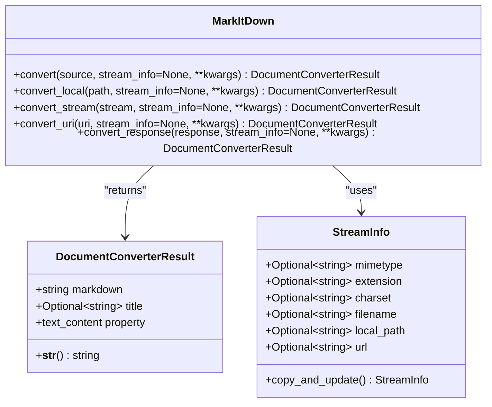
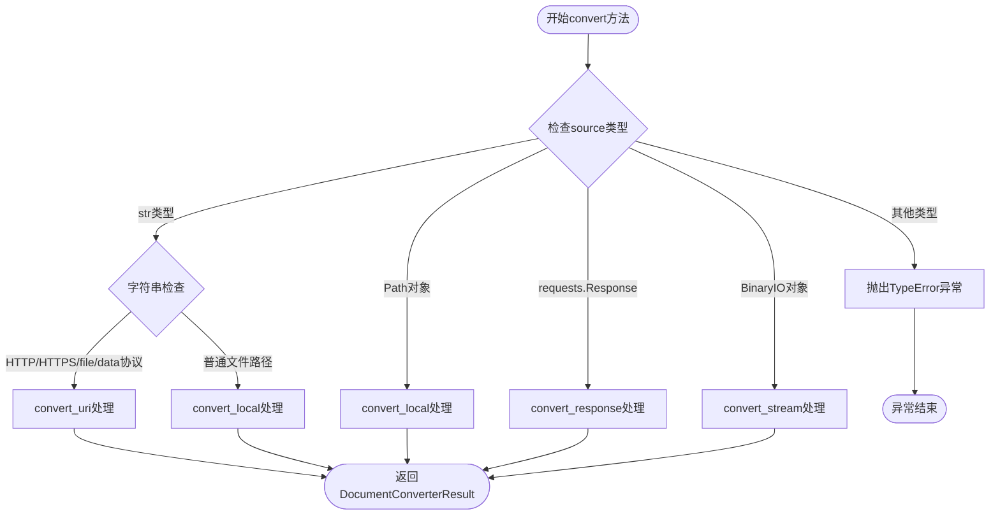
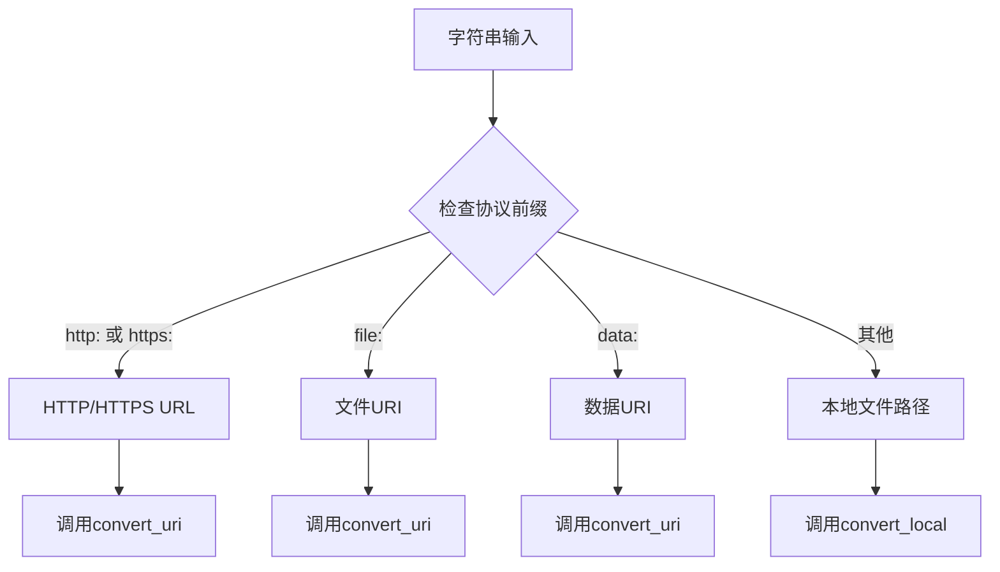
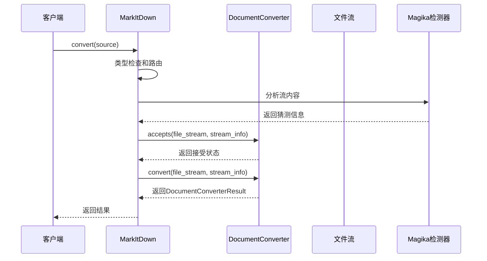

# convert方法详细文档

<cite>
**本文档中引用的文件**
- [_markitdown.py](file://packages/markitdown/src/markitdown/_markitdown.py)
- [_base_converter.py](file://packages/markitdown/src/markitdown/_base_converter.py)
- [_stream_info.py](file://packages/markitdown/src/markitdown/_stream_info.py)
- [_html_converter.py](file://packages/markitdown/src/markitdown/converters/_html_converter.py)
- [_pdf_converter.py](file://packages/markitdown/src/markitdown/converters/_pdf_converter.py)
</cite>

## 目录
1. [简介](#简介)
2. [方法签名与参数规范](#方法签名与参数规范)
3. [多态分发机制设计](#多态分发机制设计)
4. [类型检查与路由逻辑](#类型检查与路由逻辑)
5. [具体处理方法详解](#具体处理方法详解)
6. [使用示例](#使用示例)
7. [异常处理](#异常处理)
8. [与其他组件的交互](#与其他组件的交互)
9. [性能考虑](#性能考虑)
10. [总结](#总结)

## 简介

MarkItDown类的`convert`方法是整个文档转换系统的核心统一入口点，负责处理多种不同类型的输入源，并将其路由到相应的具体转换方法。该方法采用了精心设计的多态分发机制，能够智能识别输入类型并调用最适合的转换器。

该方法的主要职责包括：
- 接收多种类型的输入源（字符串路径、URL、Path对象、requests.Response、二进制流）
- 根据输入类型进行智能路由
- 提供统一的接口给用户
- 协调底层转换器的工作

## 方法签名与参数规范



**图表来源**
- [_markitdown.py](file://packages/markitdown/src/markitdown/_markitdown.py#L244-L292)
- [_base_converter.py](file://packages/markitdown/src/markitdown/_base_converter.py#L4-L38)
- [_stream_info.py](file://packages/markitdown/src/markitdown/_stream_info.py#L5-L32)

### 参数规范

| 参数名 | 类型 | 必需 | 描述 |
|--------|------|------|------|
| `source` | `Union[str, requests.Response, Path, BinaryIO]` | 是 | 输入源，可以是字符串路径、URL、Path对象或二进制流 |
| `stream_info` | `Optional[StreamInfo]` | 否 | 可选的流信息对象，包含MIME类型、扩展名、字符集等元数据 |
| `**kwargs` | `Any` | 否 | 传递给转换器的额外参数 |

### 返回值

- **类型**: `DocumentConverterResult`
- **描述**: 包含转换后的Markdown文本和可选标题的结果对象

**章节来源**
- [_markitdown.py](file://packages/markitdown/src/markitdown/_markitdown.py#L244-L292)

## 多态分发机制设计

MarkItDown的`convert`方法采用了基于类型检查的多态分发机制，这种设计模式允许单一接口处理多种不同的输入类型。该机制的核心思想是：

1. **类型识别**: 通过`isinstance()`检查确定输入类型
2. **智能路由**: 根据类型选择最合适的处理方法
3. **解耦设计**: 将不同类型处理逻辑分离到独立的方法中



**图表来源**
- [_markitdown.py](file://packages/markitdown/src/markitdown/_markitdown.py#L244-L292)

### 设计原理

1. **单一职责原则**: 每个分支处理特定类型的输入
2. **开闭原则**: 易于添加新的输入类型支持
3. **依赖倒置**: 高层模块不依赖低层模块的具体实现
4. **接口隔离**: 使用统一的DocumentConverter接口

**章节来源**
- [_markitdown.py](file://packages/markitdown/src/markitdown/_markitdown.py#L244-L292)

## 类型检查与路由逻辑

### 字符串类型处理

当输入为字符串时，方法会进一步检查字符串内容以确定具体处理方式：



**图表来源**
- [_markitdown.py](file://packages/markitdown/src/markitdown/_markitdown.py#L250-L260)

### Path对象处理

对于`pathlib.Path`对象，直接委托给`convert_local`方法处理，无需额外检查。

### requests.Response对象处理

HTTP响应对象的处理涉及从响应头提取元数据，然后将响应内容读取到内存缓冲区中。

### 二进制流处理

对于实现了`read`方法的二进制流对象，方法会检查流是否可寻址（seekable）。如果不可寻址，则会将整个流内容加载到内存中。

**章节来源**
- [_markitdown.py](file://packages/markitdown/src/markitdown/_markitdown.py#L261-L285)

## 具体处理方法详解

### convert_local方法

`convert_local`方法专门处理本地文件路径，其工作流程包括：

1. **路径标准化**: 将Path对象转换为字符串
2. **基础信息构建**: 创建初始的StreamInfo对象
3. **信息增强**: 基于文件扩展名和用户提供的信息更新StreamInfo
4. **文件打开**: 以二进制模式打开文件
5. **流信息猜测**: 使用Magika和MIME类型猜测算法
6. **转换执行**: 调用内部转换方法

### convert_stream方法

`convert_stream`方法处理二进制流，其特点包括：

1. **流类型检查**: 验证流对象的可读性
2. **可寻址性检查**: 判断流是否支持seek操作
3. **内存优化**: 对不可寻址流进行内存缓存
4. **流信息构建**: 基于用户提供的StreamInfo和猜测结果
5. **转换执行**: 调用统一的转换流程

### convert_uri方法

URI处理是最复杂的部分，支持多种URI方案：

- **HTTP/HTTPS**: 发起网络请求并处理响应
- **file:**: 处理本地文件URI
- **data:**: 解析数据URI并提取内容

### convert_response方法

HTTP响应处理包括：

1. **响应头解析**: 提取MIME类型、字符集、文件名
2. **URL解析**: 从响应URL推断文件信息
3. **内容下载**: 将响应内容加载到内存
4. **流信息构建**: 综合所有可用信息创建StreamInfo

**章节来源**
- [_markitdown.py](file://packages/markitdown/src/markitdown/_markitdown.py#L294-L400)

## 使用示例

### 本地文件路径转换

```python
# 基本用法
md = MarkItDown()
result = md.convert("document.pdf")
print(result.markdown)

# 指定流信息
from markitdown import StreamInfo
stream_info = StreamInfo(extension=".pdf", mimetype="application/pdf")
result = md.convert("document.pdf", stream_info=stream_info)
```

### 网页URL抓取转换

```python
# 抓取网页内容
result = md.convert("https://example.com/article")
print(result.markdown)

# 模拟不同URL
result = md.convert("https://example.com", mock_url="https://different-site.com")
```

### HTTP响应对象处理

```python
import requests
response = requests.get("https://example.com/document.pdf")
result = md.convert(response)
```

### 内存流转换

```python
import io
with open("document.pdf", "rb") as f:
    content = f.read()
    stream = io.BytesIO(content)
    result = md.convert(stream)
```

### 数据URI处理

```python
# Base64编码的数据URI
data_uri = "data:text/plain;base64,SGVsbG8sIFdvcmxkIQ=="
result = md.convert(data_uri)
```

**章节来源**
- [_markitdown.py](file://packages/markitdown/src/markitdown/_markitdown.py#L244-L292)

## 异常处理

### TypeError异常

当输入类型不在预期范围内时，方法会抛出`TypeError`异常：

```python
# 可能抛出TypeError的情况
try:
    md.convert(123)  # 数字类型不是有效输入
except TypeError as e:
    print(f"错误: {e}")
```

### 异常触发条件

1. **无效类型**: 输入既不是字符串也不是指定的其他类型
2. **协议不支持**: URI协议不在支持列表中
3. **文件访问失败**: 本地文件无法访问
4. **网络请求失败**: HTTP请求失败

### 错误处理最佳实践

```python
from markitdown import MarkItDown
from markitdown._exceptions import FileConversionException, UnsupportedFormatException

md = MarkItDown()

try:
    result = md.convert("document.unknown_format")
    print(result.markdown)
except UnsupportedFormatException as e:
    print(f"格式不受支持: {e}")
except FileConversionException as e:
    print(f"转换失败: {e}")
except TypeError as e:
    print(f"输入类型错误: {e}")
```

**章节来源**
- [_markitdown.py](file://packages/markitdown/src/markitdown/_markitdown.py#L285-L292)

## 与其他组件的交互

### 与转换器的交互



**图表来源**
- [_markitdown.py](file://packages/markitdown/src/markitdown/_markitdown.py#L402-L500)
- [_base_converter.py](file://packages/markitdown/src/markitdown/_base_converter.py#L40-L105)

### 与StreamInfo的协作

StreamInfo对象在整个转换过程中起到关键作用：

1. **元数据传递**: 在各个处理阶段之间传递文件信息
2. **类型猜测**: 协助确定文件的MIME类型和扩展名
3. **优先级控制**: 影响转换器的选择顺序

### 与Magika的集成

Magika用于智能识别文件类型，提供额外的类型猜测能力：

1. **内容分析**: 读取文件头部内容进行类型识别
2. **字符集检测**: 自动检测文本文件的字符编码
3. **扩展名建议**: 提供可能的文件扩展名

**章节来源**
- [_markitdown.py](file://packages/markitdown/src/markitdown/_markitdown.py#L600-L700)

## 性能考虑

### 流处理优化

1. **内存管理**: 对大型文件使用流式处理而非一次性加载
2. **缓存策略**: 合理使用内存缓存避免重复读取
3. **资源释放**: 确保文件句柄和网络连接正确关闭

### 类型检查优化

1. **顺序优化**: 将最常见的情况放在前面检查
2. **快速路径**: 对简单情况提供快速处理路径
3. **避免重复计算**: 缓存类型检查结果

### 并发处理

虽然当前实现是同步的，但设计上支持未来的并发扩展：

1. **无状态设计**: 各个处理方法都是纯函数式的
2. **独立单元**: 不同类型的处理逻辑相互独立
3. **可插拔架构**: 新的转换器可以轻松集成

## 总结

MarkItDown的`convert`方法是一个精心设计的多态分发系统，它成功地将复杂性隐藏在简洁的接口背后。该方法的主要优势包括：

1. **统一接口**: 为用户提供一致的使用体验
2. **智能路由**: 自动识别并处理不同类型的输入
3. **可扩展性**: 易于添加新的输入类型和转换器
4. **健壮性**: 完善的错误处理和类型检查
5. **性能优化**: 针对不同场景的优化策略

通过这种设计，MarkItDown能够在保持易用性的同时，处理各种复杂的文档转换需求，为LLM应用提供了强大而灵活的文档处理能力。