# MarkItDown核心转换方法族全面文档

<cite>
**本文档中引用的文件**
- [_markitdown.py](file://packages/markitdown/src/markitdown/_markitdown.py)
- [_stream_info.py](file://packages/markitdown/src/markitdown/_stream_info.py)
- [_uri_utils.py](file://packages/markitdown/src/markitdown/_uri_utils.py)
- [_base_converter.py](file://packages/markitdown/src/markitdown/_base_converter.py)
- [_docx_converter.py](file://packages/markitdown/src/markitdown/converters/_docx_converter.py)
- [_pdf_converter.py](file://packages/markitdown/src/markitdown/converters/_pdf_converter.py)
- [test_module_vectors.py](file://packages/markitdown/tests/test_module_vectors.py)
</cite>

## 目录
1. [简介](#简介)
2. [核心架构概览](#核心架构概览)
3. [convert方法：统一入口的多态分发机制](#convert方法统一入口的多态分发机制)
4. [convert_local方法：本地文件路径处理](#convert_local方法本地文件路径处理)
5. [convert_stream方法：二进制流处理](#convert_stream方法二进制流处理)
6. [convert_uri方法：URI方案解析与分发](#convert_uri方法uri方案解析与分发)
7. [convert_response方法：HTTP响应处理](#convert_response方法http响应处理)
8. [StreamInfo元数据推断机制](#streaminfo元数据推断机制)
9. [转换器注册与优先级系统](#转换器注册与优先级系统)
10. [异常处理与错误恢复](#异常处理与错误恢复)
11. [实际使用示例](#实际使用示例)
12. [性能优化策略](#性能优化策略)

## 简介

MarkItDown是一个功能强大的文档转换库，专门设计用于将各种格式的文档转换为Markdown格式。其核心转换方法族提供了统一而灵活的接口，支持多种输入源和转换场景。本文档深入分析了五个核心转换方法：`convert`、`convert_local`、`convert_stream`、`convert_uri`和`convert_response`，以及它们之间的协作关系。

## 核心架构概览

MarkItDown采用模块化的架构设计，通过多态分发机制实现统一的转换接口。核心组件包括：

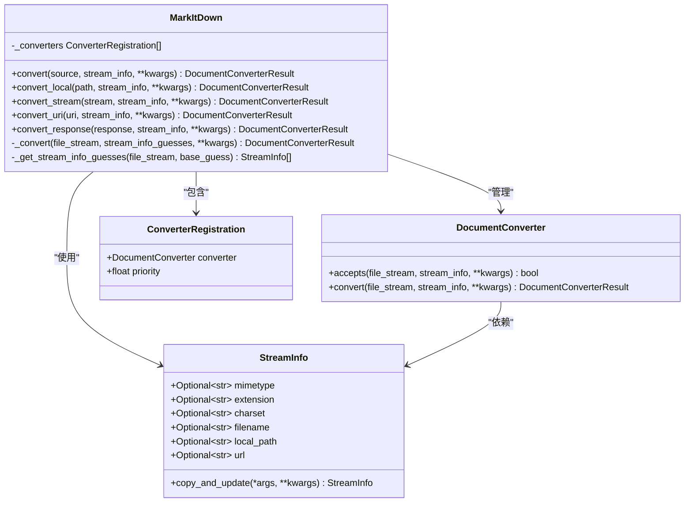

**图表来源**
- [_markitdown.py](file://packages/markitdown/src/markitdown/_markitdown.py#L70-L777)
- [_stream_info.py](file://packages/markitdown/src/markitdown/_stream_info.py#L5-L33)
- [_base_converter.py](file://packages/markitdown/src/markitdown/_base_converter.py#L41-L105)

**章节来源**
- [_markitdown.py](file://packages/markitdown/src/markitdown/_markitdown.py#L70-L120)
- [_stream_info.py](file://packages/markitdown/src/markitdown/_stream_info.py#L5-L33)

## convert方法：统一入口的多态分发机制

`convert`方法是MarkItDown的核心统一入口，采用智能多态分发机制，能够根据输入类型自动选择合适的转换方法。

### 方法签名与参数说明

```python
def convert(
    self,
    source: Union[str, requests.Response, Path, BinaryIO],
    *,
    stream_info: Optional[StreamInfo] = None,
    **kwargs: Any,
) -> DocumentConverterResult
```

**参数详解：**
- `source`: 输入源，支持四种类型：
  - 字符串（路径或URL）
  - requests.Response对象
  - Path对象
  - 二进制流对象
- `stream_info`: 可选的流信息对象，提供元数据提示
- `**kwargs`: 传递给转换器的额外参数

### 多态分发逻辑

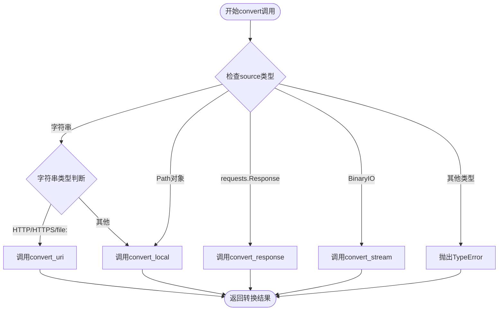

**图表来源**
- [_markitdown.py](file://packages/markitdown/src/markitdown/_markitdown.py#L265-L295)

### 分发机制实现细节

转换方法的选择基于以下规则：

1. **字符串类型检测**：
   - 检查是否以"http:"、"https:"、"file:"或"data:"开头
   - 根据前缀决定调用`convert_uri`或`convert_local`

2. **Path对象处理**：
   - 直接调用`convert_local`方法

3. **Response对象处理**：
   - 调用`convert_response`方法处理HTTP响应

4. **二进制流处理**：
   - 调用`convert_stream`方法处理任意二进制流

**章节来源**
- [_markitdown.py](file://packages/markitdown/src/markitdown/_markitdown.py#L265-L295)

## convert_local方法：本地文件路径处理

`convert_local`方法专门处理本地文件路径，结合StreamInfo进行智能元数据推断和转换。

### 方法签名与参数说明

```python
def convert_local(
    self,
    path: Union[str, Path],
    *,
    stream_info: Optional[StreamInfo] = None,
    file_extension: Optional[str] = None,
    url: Optional[str] = None,
    **kwargs: Any,
) -> DocumentConverterResult
```

**参数详解：**
- `path`: 本地文件路径，支持字符串或Path对象
- `stream_info`: 可选的流信息对象
- `file_extension`: 已废弃的扩展名参数，建议使用stream_info
- `url`: 已废弃的URL参数，建议使用stream_info

### 流程分析

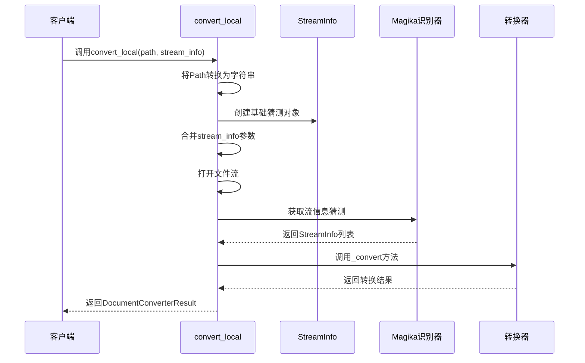

**图表来源**
- [_markitdown.py](file://packages/markitdown/src/markitdown/_markitdown.py#L297-L335)

### 元数据推断流程

1. **基础猜测构建**：
   ```python
   base_guess = StreamInfo(
       local_path=path,
       extension=os.path.splitext(path)[1],
       filename=os.path.basename(path),
   )
   ```

2. **参数合并**：
   - 合并stream_info提供的信息
   - 处理已废弃的file_extension和url参数

3. **文件打开与转换**：
   - 使用二进制模式打开文件
   - 调用内部转换方法处理文件内容

**章节来源**
- [_markitdown.py](file://packages/markitdown/src/markitdown/_markitdown.py#L297-L335)

## convert_stream方法：二进制流处理

`convert_stream`方法处理任意二进制流，特别针对不可寻址流实现了智能内存缓冲策略。

### 方法签名与参数说明

```python
def convert_stream(
    self,
    stream: BinaryIO,
    *,
    stream_info: Optional[StreamInfo] = None,
    file_extension: Optional[str] = None,
    url: Optional[str] = None,
    **kwargs: Any,
) -> DocumentConverterResult
```

### 不可寻址流处理策略

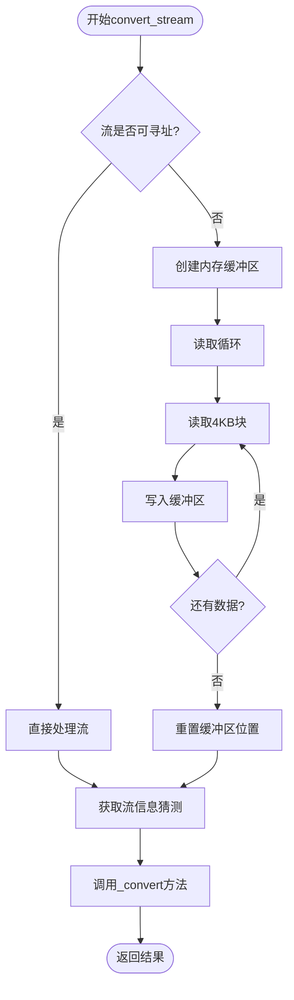

**图表来源**
- [_markitdown.py](file://packages/markitdown/src/markitdown/_markitdown.py#L337-L385)

### 处理逻辑详解

1. **流类型检测**：
   - 检查流是否具有`seekable()`方法
   - 对于不可寻址流，自动创建内存缓冲区

2. **内存缓冲策略**：
   - 使用`io.BytesIO`创建内存缓冲区
   - 分块读取（4096字节）避免内存溢出
   - 自动重置缓冲区位置

3. **元数据推断**：
   - 基于stream_info、file_extension和url参数构建基础猜测
   - 调用`_get_stream_info_guesses`获取精确的流信息

**章节来源**
- [_markitdown.py](file://packages/markitdown/src/markitdown/_markitdown.py#L337-L385)

## convert_uri方法：URI方案解析与分发

`convert_uri`方法实现了对不同URI方案的智能解析和分发，支持file:、data:、http:、https:等协议。

### 方法签名与参数说明

```python
def convert_uri(
    self,
    uri: str,
    *,
    stream_info: Optional[StreamInfo] = None,
    file_extension: Optional[str] = None,
    mock_url: Optional[str] = None,
    **kwargs: Any,
) -> DocumentConverterResult
```

### URI方案处理流程

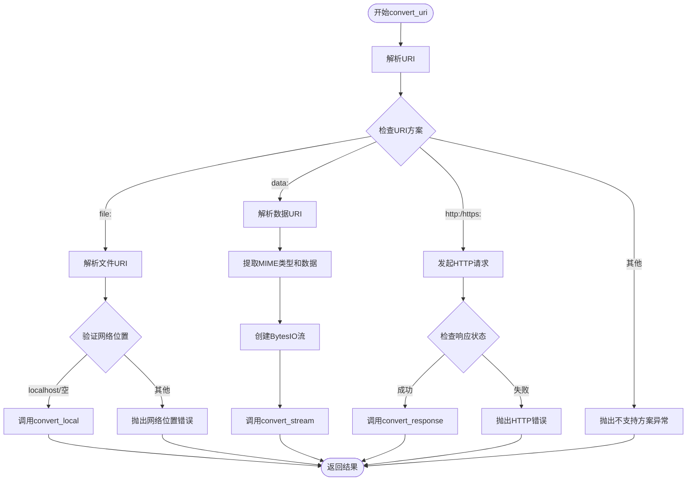

**图表来源**
- [_markitdown.py](file://packages/markitdown/src/markitdown/_markitdown.py#L391-L457)
- [_uri_utils.py](file://packages/markitdown/src/markitdown/_uri_utils.py#L8-L52)

### 各方案处理详解

1. **file: URI处理**：
   - 解析文件路径和网络位置
   - 验证网络位置必须为空或localhost
   - 调用`convert_local`处理本地文件

2. **data: URI处理**：
   - 解析MIME类型、字符集属性和编码数据
   - 支持base64和URL编码
   - 创建BytesIO流并调用`convert_stream`

3. **http:/https: URI处理**：
   - 发起HTTP请求（支持流式传输）
   - 检查响应状态码
   - 调用`convert_response`处理响应

**章节来源**
- [_markitdown.py](file://packages/markitdown/src/markitdown/_markitdown.py#L391-L457)
- [_uri_utils.py](file://packages/markitdown/src/markitdown/_uri_utils.py#L8-L52)

## convert_response方法：HTTP响应处理

`convert_response`方法专门处理HTTP响应对象，从响应头提取元数据并进行转换。

### 方法签名与参数说明

```python
def convert_response(
    self,
    response: requests.Response,
    *,
    stream_info: Optional[StreamInfo] = None,
    file_extension: Optional[str] = None,
    url: Optional[str] = None,
    **kwargs: Any,
) -> DocumentConverterResult
```

### HTTP响应元数据提取流程

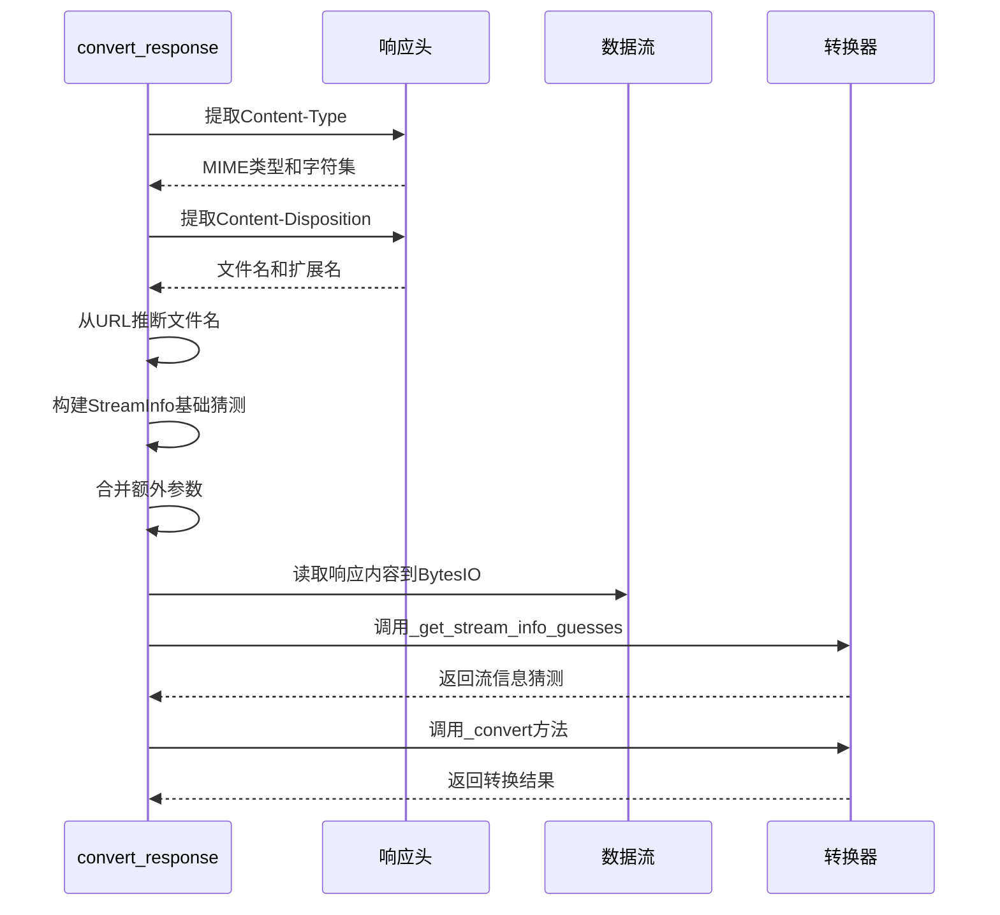

**图表来源**
- [_markitdown.py](file://packages/markitdown/src/markitdown/_markitdown.py#L459-L530)

### 元数据提取详细步骤

1. **Content-Type头部解析**：
   ```python
   if "content-type" in response.headers:
       parts = response.headers["content-type"].split(";")
       mimetype = parts.pop(0).strip()
       for part in parts:
           if part.strip().startswith("charset="):
               charset = part.split("=")[1].strip()
   ```

2. **Content-Disposition头部解析**：
   ```python
   if "content-disposition" in response.headers:
       m = re.search(r"filename=([^;]+)", response.headers["content-disposition"])
       if m:
           filename = m.group(1).strip("\"'")
           _, extension = os.path.splitext(filename)
   ```

3. **URL文件名推断**：
   - 从响应URL路径提取文件名
   - 推断文件扩展名

4. **流内容读取**：
   - 使用512字节块大小迭代读取
   - 存储到BytesIO缓冲区

**章节来源**
- [_markitdown.py](file://packages/markitdown/src/markitdown/_markitdown.py#L459-L530)

## StreamInfo元数据推断机制

StreamInfo类是MarkItDown的核心元数据容器，支持智能推断和动态更新。

### StreamInfo类结构

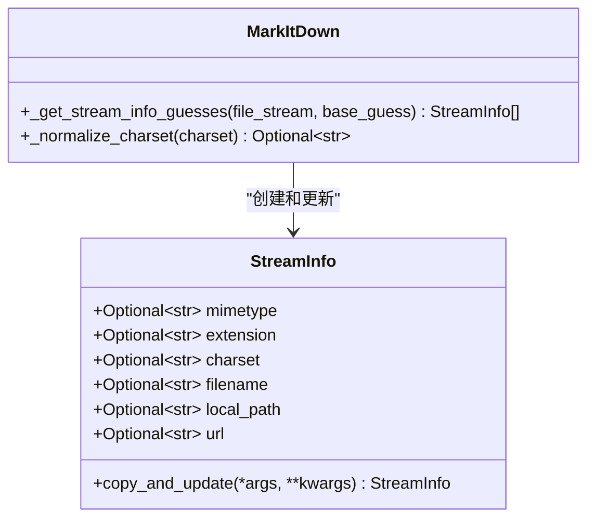

**图表来源**
- [_stream_info.py](file://packages/markitdown/src/markitdown/_stream_info.py#L5-L33)

### 元数据推断算法

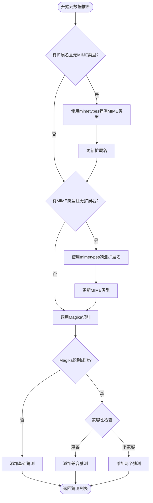

**图表来源**
- [_markitdown.py](file://packages/markitdown/src/markitdown/_markitdown.py#L640-L720)

### 推断策略详解

1. **扩展名到MIME类型映射**：
   - 使用Python标准库`mimetypes.guess_type`
   - 支持严格模式和宽松模式

2. **MIME类型到扩展名映射**：
   - 使用`mimetypes.guess_all_extensions`
   - 选择第一个匹配的扩展名

3. **Magika智能识别**：
   - 基于文件内容进行深度识别
   - 支持文本文件的字符集检测
   - 提供多个可能的扩展名

4. **兼容性验证**：
   - 检查MIME类型一致性
   - 验证扩展名匹配
   - 确保字符集兼容性

**章节来源**
- [_markitdown.py](file://packages/markitdown/src/markitdown/_markitdown.py#L640-L720)

## 转换器注册与优先级系统

MarkItDown采用优先级驱动的转换器选择机制，确保最合适的转换器优先被尝试。

### 转换器注册流程

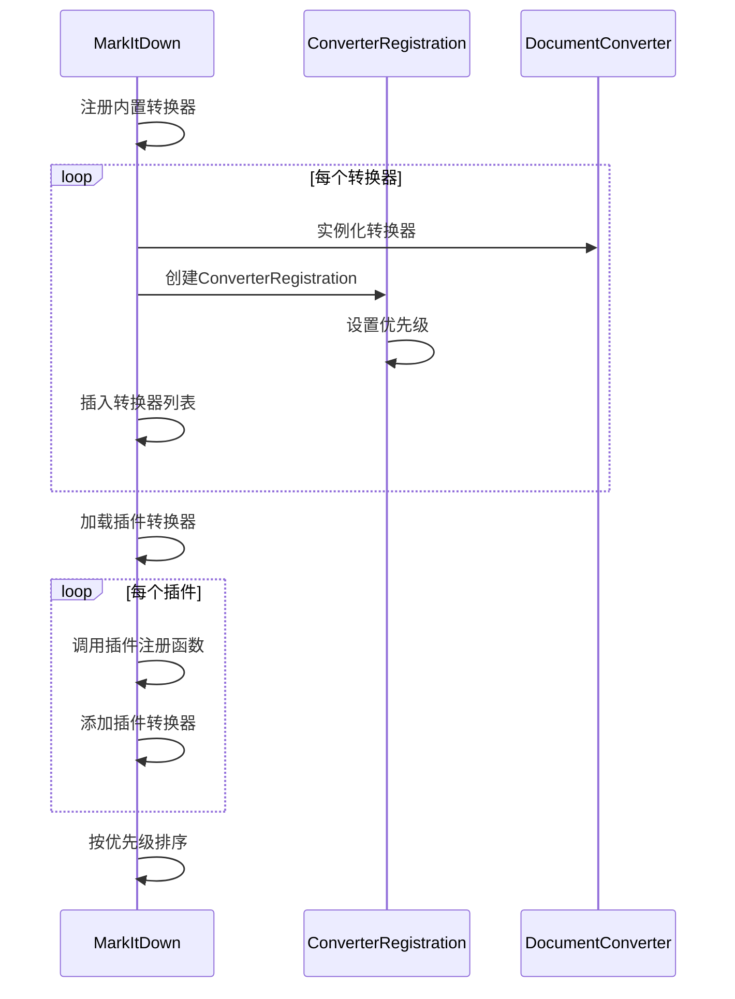

**图表来源**
- [_markitdown.py](file://packages/markitdown/src/markitdown/_markitdown.py#L122-L220)

### 优先级系统设计

| 优先级范围 | 转换器类型 | 示例 |
|------------|------------|------|
| 0.0 | 特定文件格式 | DOCX, PDF, XLSX |
| 10.0 | 通用文件格式 | 文本文件, HTML, ZIP |

### 转换器选择算法

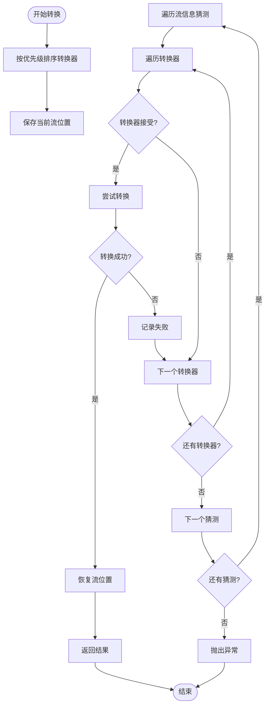

**图表来源**
- [_markitdown.py](file://packages/markitdown/src/markitdown/_markitdown.py#L532-L630)

**章节来源**
- [_markitdown.py](file://packages/markitdown/src/markitdown/_markitdown.py#L122-L220)
- [_markitdown.py](file://packages/markitdown/src/markitdown/_markitdown.py#L532-L630)

## 异常处理与错误恢复

MarkItDown实现了完善的异常处理机制，确保转换过程的健壮性和可恢复性。

### 异常层次结构

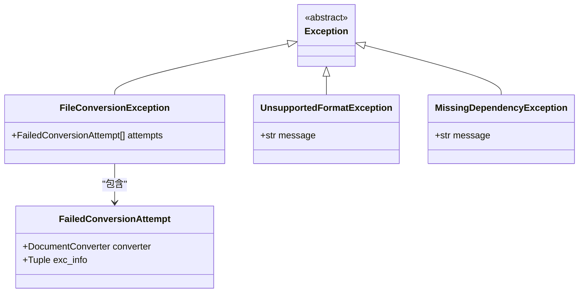

**图表来源**
- [_markitdown.py](file://packages/markitdown/src/markitdown/_markitdown.py#L50-L60)

### 错误处理策略

1. **转换器失败处理**：
   - 记录所有转换器的失败尝试
   - 提供详细的异常信息
   - 继续尝试其他转换器

2. **依赖缺失处理**：
   - 检测必需依赖是否安装
   - 提供清晰的错误消息
   - 指导用户安装所需包

3. **流位置保护**：
   - 在每次转换前后保存流位置
   - 确保流位置的一致性
   - 自动恢复流位置

**章节来源**
- [_markitdown.py](file://packages/markitdown/src/markitdown/_markitdown.py#L50-L60)
- [_markitdown.py](file://packages/markitdown/src/markitdown/_markitdown.py#L532-L630)

## 实际使用示例

以下是各种转换场景的实际使用示例：

### 本地文件转换

```python
# 基本本地文件转换
result = markitdown.convert("document.pdf")

# 带有元数据提示的转换
stream_info = StreamInfo(mimetype="application/pdf", extension=".pdf")
result = markitdown.convert("document.pdf", stream_info=stream_info)

# 使用Path对象
result = markitdown.convert(Path("document.docx"))
```

### HTTP资源转换

```python
# 远程PDF文件
result = markitdown.convert("https://example.com/document.pdf")

# 带有URL模拟的转换
result = markitdown.convert("https://example.com/document.pdf", url="https://cached.example.com/document.pdf")

# HTTP响应处理
response = requests.get("https://example.com/document.pdf")
result = markitdown.convert(response)
```

### 二进制流转换

```python
# 从字节流转换
with open("document.pdf", "rb") as f:
    result = markitdown.convert(f)

# 从内存数据转换
data = b"%PDF-1.4..."
result = markitdown.convert(io.BytesIO(data))

# 带有流信息的转换
stream_info = StreamInfo(mimetype="application/pdf")
result = markitdown.convert(io.BytesIO(data), stream_info=stream_info)
```

### URI方案转换

```python
# 文件URI
result = markitdown.convert("file:///path/to/document.pdf")

# 数据URI
data_uri = "data:application/pdf;base64,JVBERi0xLjQKJcOkw7zDtsO..."
result = markitdown.convert(data_uri)

# 数据URI（文本）
text_uri = "data:text/plain;charset=utf-8,Hello%20World"
result = markitdown.convert(text_uri)
```

**章节来源**
- [test_module_vectors.py](file://packages/markitdown/tests/test_module_vectors.py#L40-L100)

## 性能优化策略

MarkItDown在设计时充分考虑了性能优化，采用了多种策略提升转换效率。

### 内存管理优化

1. **流式处理**：
   - HTTP响应使用流式读取
   - 避免大文件完全加载到内存
   - 支持分块处理

2. **智能缓冲**：
   - 不可寻址流自动创建内存缓冲
   - 4KB块大小平衡内存使用和性能
   - 缓冲区复用机制

### 转换器选择优化

1. **优先级排序**：
   - 按照转换器优先级预排序
   - 特定格式转换器优先尝试
   - 减少不必要的accept()调用

2. **早期短路**：
   - accept()方法快速过滤不兼容的转换器
   - 成功转换后立即返回结果
   - 避免尝试不适用的转换器

### 元数据推断优化

1. **缓存机制**：
   - Magika识别结果缓存
   - MIME类型猜测缓存
   - 字符集检测优化

2. **智能猜测**：
   - 基于文件扩展名的快速猜测
   - 兼容性检查减少无效尝试
   - 多种猜测策略并行

**章节来源**
- [_markitdown.py](file://packages/markitdown/src/markitdown/_markitdown.py#L337-L385)
- [_markitdown.py](file://packages/markitdown/src/markitdown/_markitdown.py#L532-L630)
- [_markitdown.py](file://packages/markitdown/src/markitdown/_markitdown.py#L640-L720)