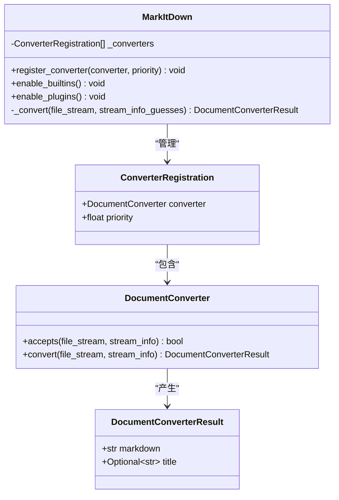
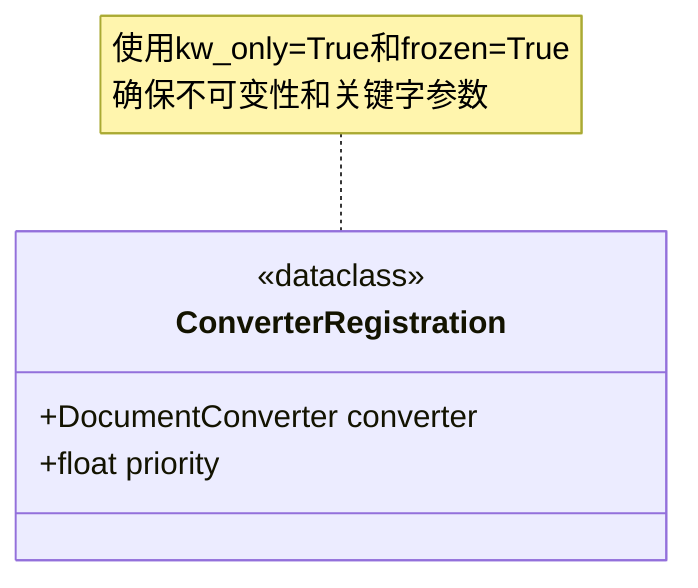
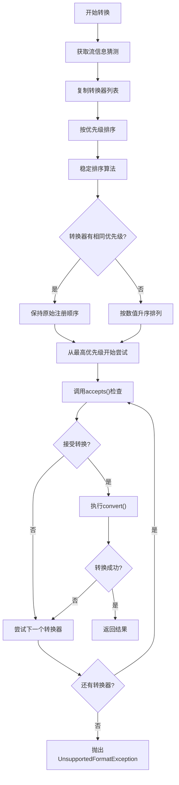
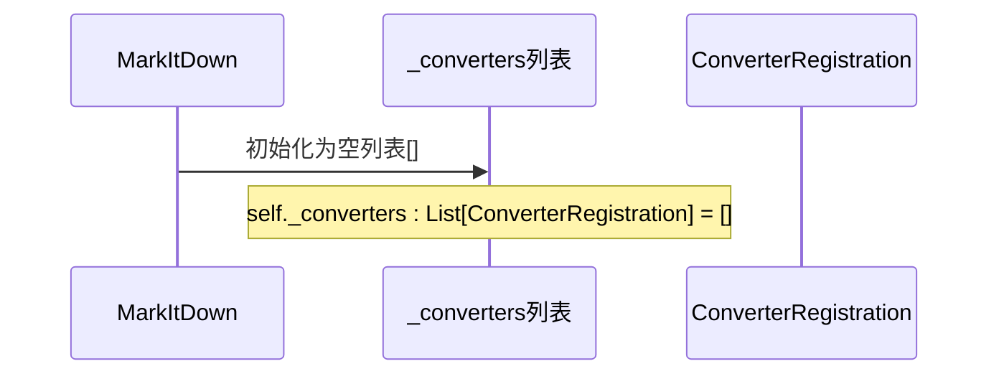
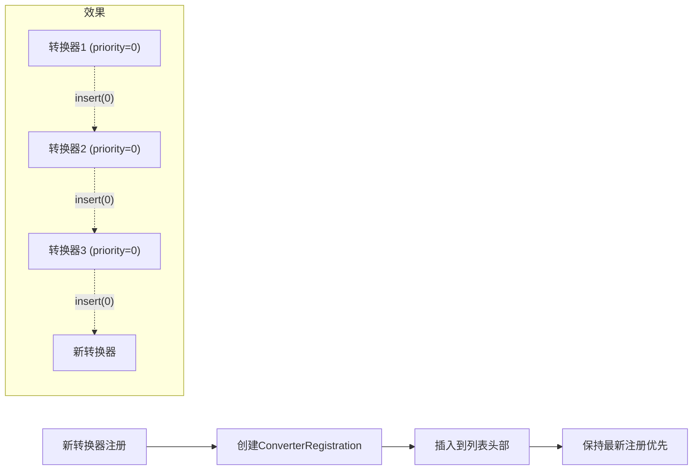
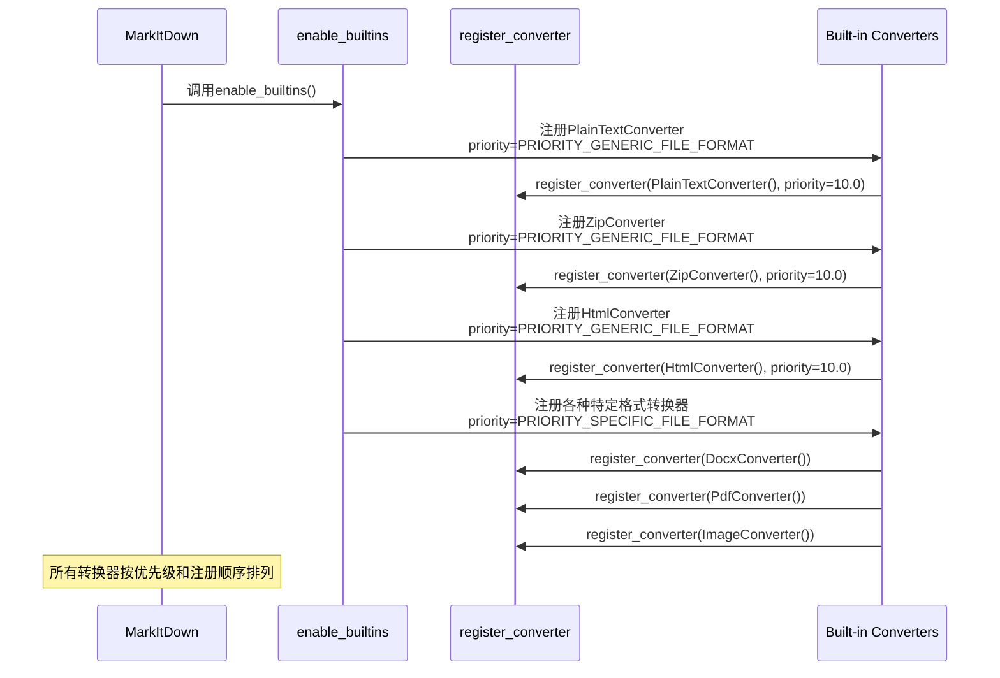
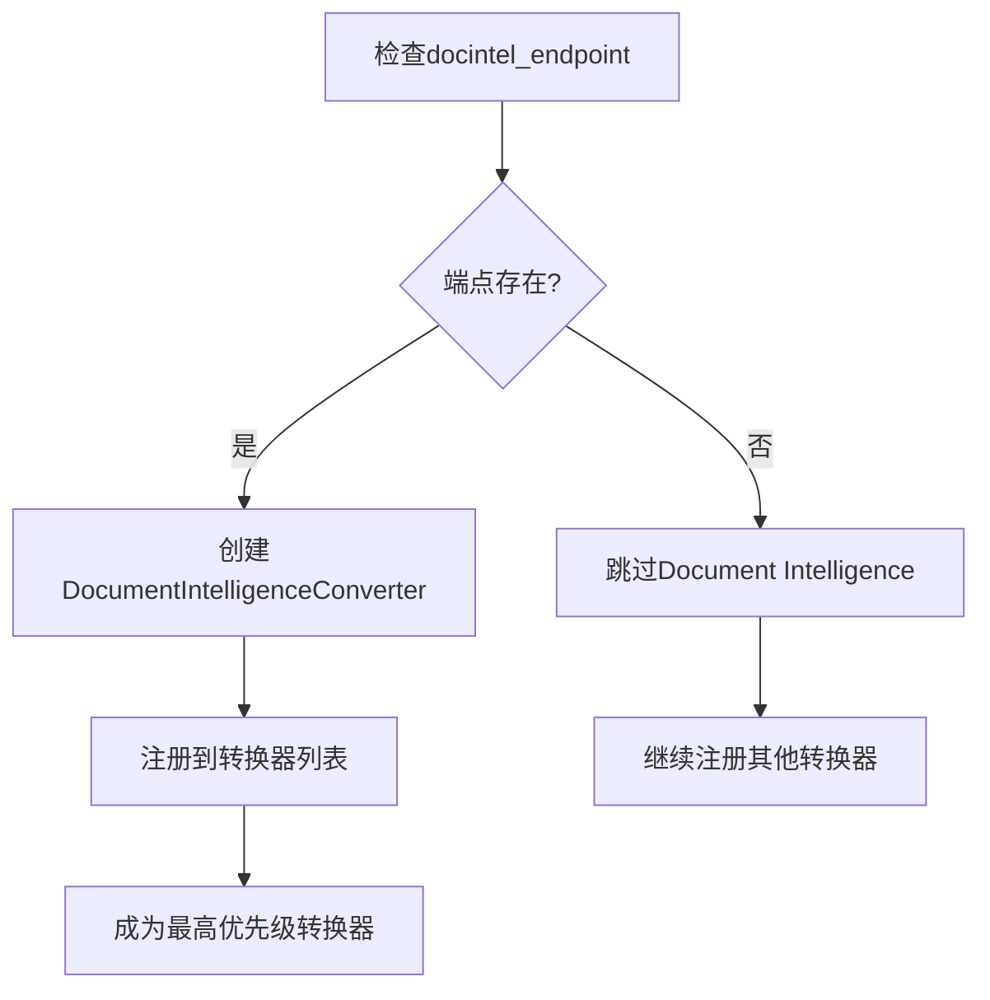
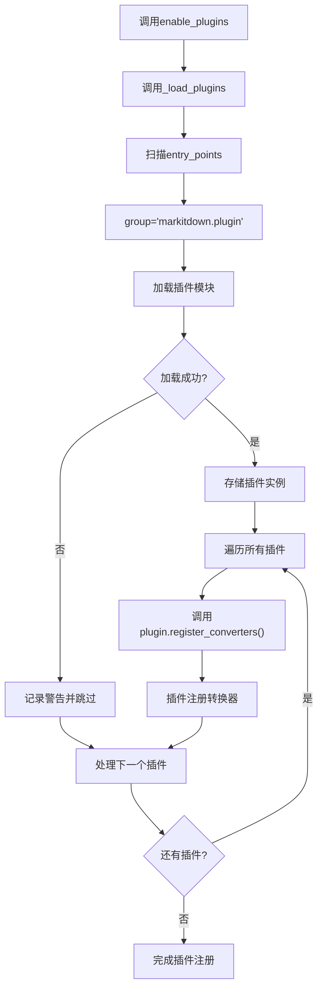
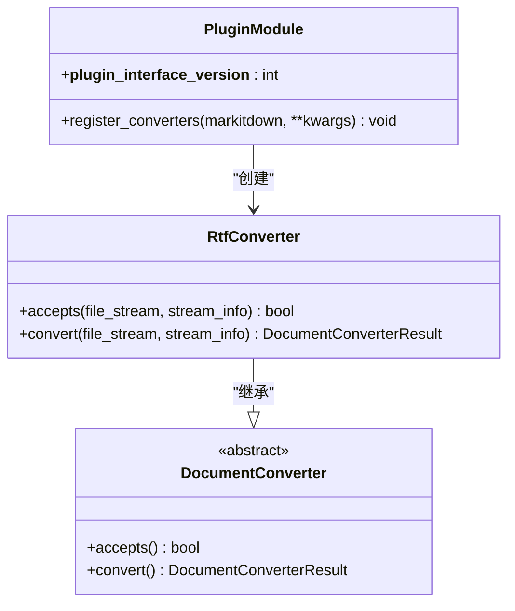
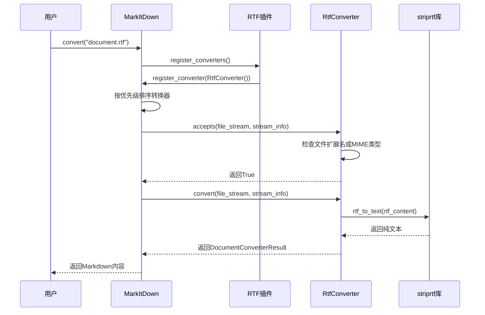

# 转换器注册机制

<cite>
**本文档中引用的文件**
- [_markitdown.py](file://packages/markitdown/src/markitdown/_markitdown.py)
- [_base_converter.py](file://packages/markitdown/src/markitdown/_base_converter.py)
- [_plain_text_converter.py](file://packages/markitdown/src/markitdown/converters/_plain_text_converter.py)
- [_html_converter.py](file://packages/markitdown/src/markitdown/converters/_html_converter.py)
- [_zip_converter.py](file://packages/markitdown/src/markitdown/converters/_zip_converter.py)
- [_plugin.py](file://packages/markitdown-sample-plugin/src/markitdown_sample_plugin/_plugin.py)
- [__init__.py](file://packages/markitdown/src/markitdown/__init__.py)
</cite>

## 目录
1. [简介](#简介)
2. [核心组件概述](#核心组件概述)
3. [ConverterRegistration数据类](#converterregistration数据类)
4. [优先级系统详解](#优先级系统详解)
5. [转换器注册表结构](#转换器注册表结构)
6. [内置转换器注册机制](#内置转换器注册机制)
7. [插件转换器注册机制](#插件转换器注册机制)
8. [插件开发指南](#插件开发指南)
9. [实际应用示例](#实际应用示例)
10. [最佳实践建议](#最佳实践建议)

## 简介

MarkItDown的转换器注册机制是一个精心设计的插件架构系统，它允许用户通过`register_converter`方法注册自定义转换器，并通过优先级系统精确控制转换器的执行顺序。该机制的核心在于`ConverterRegistration`数据类、优先级排序算法以及转换器注册表的管理策略。

## 核心组件概述

转换器注册机制由以下核心组件构成：



**图表来源**
- [_markitdown.py](file://packages/markitdown/src/markitdown/_markitdown.py#L85-L89)
- [_base_converter.py](file://packages/markitdown/src/markitdown/_base_converter.py#L6-L30)

**章节来源**
- [_markitdown.py](file://packages/markitdown/src/markitdown/_markitdown.py#L122-L122)
- [_base_converter.py](file://packages/markitdown/src/markitdown/_base_converter.py#L1-L106)

## ConverterRegistration数据类

`ConverterRegistration`是转换器注册机制的核心数据结构，它将转换器实例与优先级信息封装在一起。

### 数据结构定义



**图表来源**
- [_markitdown.py](file://packages/markitdown/src/markitdown/_markitdown.py#L85-L89)

### 关键特性

1. **不可变性**：使用`@dataclass(kw_only=True, frozen=True)`装饰器确保对象不可修改
2. **类型安全**：明确的类型注解保证类型正确性
3. **元数据封装**：同时保存转换器实例和优先级信息

**章节来源**
- [_markitdown.py](file://packages/markitdown/src/markitdown/_markitdown.py#L85-L89)

## 优先级系统详解

优先级系统是转换器注册机制的关键组成部分，它决定了转换器的执行顺序。

### 优先级常量定义

系统定义了两个主要的优先级常量：

| 常量名称 | 数值 | 用途 | 执行顺序 |
|---------|------|------|----------|
| `PRIORITY_SPECIFIC_FILE_FORMAT` | 0.0 | 特定文件格式转换器 | 最高优先级 |
| `PRIORITY_GENERIC_FILE_FORMAT` | 10.0 | 通用文件格式转换器 | 较低优先级 |

### 优先级工作原理



**图表来源**
- [_markitdown.py](file://packages/markitdown/src/markitdown/_markitdown.py#L637-L663)

### 数值越低优先级越高

优先级系统遵循"数值越低优先级越高"的原则：

- **0.0**：最高优先级，用于特定文件格式转换器
- **10.0**：较低优先级，用于通用文件格式转换器
- **任意浮点数**：支持细粒度的优先级控制

### 稳定排序机制

系统使用稳定的排序算法确保：
1. **相同优先级的转换器保持注册顺序**
2. **新注册的转换器出现在同优先级列表的前面**
3. **避免因顺序变化导致的行为差异**

**章节来源**
- [_markitdown.py](file://packages/markitdown/src/markitdown/_markitdown.py#L53-L58)
- [_markitdown.py](file://packages/markitdown/src/markitdown/_markitdown.py#L637-L663)

## 转换器注册表结构

转换器注册表采用列表结构，通过特殊的插入逻辑维护转换器的执行顺序。

### 注册表初始化



**图表来源**
- [_markitdown.py](file://packages/markitdown/src/markitdown/_markitdown.py#L122-L122)

### 插入逻辑分析

`register_converter`方法实现了独特的插入逻辑：



**图表来源**
- [_markitdown.py](file://packages/markitdown/src/markitdown/_markitdown.py#L660-L663)

### 对转换顺序的影响

这种插入策略产生以下影响：

1. **后注册的转换器优先执行**：即使具有相同的优先级
2. **保持同优先级的相对顺序**
3. **支持动态注册新的转换器**

**章节来源**
- [_markitdown.py](file://packages/markitdown/src/markitdown/_markitdown.py#L660-L663)

## 内置转换器注册机制

`enable_builtins`方法负责批量注册所有内置转换器，展示了优先级系统在实际应用中的使用。

### 注册流程



**图表来源**
- [_markitdown.py](file://packages/markitdown/src/markitdown/_markitdown.py#L160-L200)

### 优先级分配策略

内置转换器按照以下策略分配优先级：

| 转换器类别 | 优先级 | 示例转换器 | 原因 |
|-----------|--------|-----------|------|
| 通用格式转换器 | 10.0 | PlainTextConverter, HtmlConverter, ZipConverter | 处理通用MIME类型 |
| 特定格式转换器 | 0.0 | DocxConverter, PdfConverter, ImageConverter | 处理特定文件格式 |

### Document Intelligence集成

系统还支持可选的Document Intelligence转换器，它被注册为最高优先级：



**图表来源**
- [_markitdown.py](file://packages/markitdown/src/markitdown/_markitdown.py#L201-L220)

**章节来源**
- [_markitdown.py](file://packages/markitdown/src/markitdown/_markitdown.py#L160-L220)

## 插件转换器注册机制

`enable_plugins`方法实现了插件转换器的动态加载和注册，展示了插件架构的强大功能。

### 插件发现机制



**图表来源**
- [_markitdown.py](file://packages/markitdown/src/markitdown/_markitdown.py#L48-L60)
- [_markitdown.py](file://packages/markitdown/src/markitdown/_markitdown.py#L222-L235)

### 插件接口规范

每个插件必须实现以下接口：

```python
def register_converters(markitdown: MarkItDown, **kwargs) -> None:
    """
    插件注册转换器的标准接口
    
    参数:
        markitdown: MarkItDown实例，用于注册转换器
        kwargs: 传递给转换器的额外参数
    """
```

### 错误处理机制

系统实现了健壮的错误处理：

1. **插件加载失败**：记录警告但不中断主流程
2. **转换器注册失败**：记录异常但继续处理其他插件
3. **状态保护**：防止重复启用插件

**章节来源**
- [_markitdown.py](file://packages/markitdown/src/markitdown/_markitdown.py#L222-L235)

## 插件开发指南

本节提供了插件开发者使用转换器注册机制的详细指南。

### 基础插件结构

一个标准的插件应包含以下组件：



**图表来源**
- [_plugin.py](file://packages/markitdown-sample-plugin/src/markitdown_sample_plugin/_plugin.py#L20-L71)

### 实现步骤

1. **定义转换器类**：继承`DocumentConverter`基类
2. **实现accepts方法**：检查文件是否可处理
3. **实现convert方法**：执行实际的转换逻辑
4. **注册转换器**：在`register_converters`函数中调用`markitdown.register_converter()`

### 优先级控制示例

插件开发者可以通过指定优先级来控制转换器的执行顺序：

```python
# 高优先级：在内置转换器之前执行
markitdown.register_converter(RtfConverter(), priority=5.0)

# 中等优先级：在某些内置转换器之后执行
markitdown.register_converter(CustomConverter(), priority=8.0)

# 低优先级：在通用转换器之后执行
markitdown.register_converter(FallbackConverter(), priority=15.0)
```

**章节来源**
- [_plugin.py](file://packages/markitdown-sample-plugin/src/markitdown_sample_plugin/_plugin.py#L25-L30)

## 实际应用示例

本节展示转换器注册机制在实际场景中的应用。

### 自定义RTF转换器示例

基于样本插件的实现：



**图表来源**
- [_plugin.py](file://packages/markitdown-sample-plugin/src/markitdown_sample_plugin/_plugin.py#L40-L71)

### 优先级控制的实际效果

假设我们有以下转换器注册序列：

```python
# 注册顺序：1, 2, 3, 4, 5
markitdown.register_converter(converter1, priority=0)
markitdown.register_converter(converter2, priority=0)
markitdown.register_converter(converter3, priority=10)
markitdown.register_converter(converter4, priority=0)
markitdown.register_converter(converter5, priority=10)
```

转换器的执行顺序将是：
1. `converter4` (最新注册的高优先级)
2. `converter2` (最新注册的高优先级)
3. `converter1` (最新注册的高优先级)
4. `converter5` (最新注册的低优先级)
5. `converter3` (最新注册的低优先级)

### 动态优先级调整

插件可以在运行时调整转换器的优先级：

```python
# 在转换过程中动态调整
def dynamic_priority_adjustment(markitdown):
    # 查找现有转换器
    for registration in markitdown._converters:
        if isinstance(registration.converter, SpecificConverter):
            # 创建新的注册项，具有不同优先级
            new_registration = ConverterRegistration(
                converter=registration.converter,
                priority=5.0  # 新的优先级
            )
            # 替换原有注册项
            index = markitdown._converters.index(registration)
            markitdown._converters[index] = new_registration
            break
```

**章节来源**
- [_plugin.py](file://packages/markitdown-sample-plugin/src/markitdown_sample_plugin/_plugin.py#L25-L30)

## 最佳实践建议

基于对转换器注册机制的深入分析，以下是推荐的最佳实践：

### 优先级设置指南

1. **特定格式转换器**：使用`PRIORITY_SPECIFIC_FILE_FORMAT` (0.0)
2. **通用格式转换器**：使用`PRIORITY_GENERIC_FILE_FORMAT` (10.0)
3. **特殊用途转换器**：根据需求选择合适的中间值
4. **插件转换器**：通常使用1-9之间的值，避免与内置转换器冲突

### 性能优化建议

1. **快速accepts检查**：在`accepts`方法中实现高效的文件类型检测
2. **流位置保护**：确保`accepts`方法不会改变文件流位置
3. **资源管理**：及时释放转换过程中使用的临时资源

### 错误处理策略

1. **优雅降级**：当转换失败时，应该捕获异常而不是让程序崩溃
2. **详细日志**：记录转换过程中的关键信息和错误详情
3. **状态验证**：定期验证转换器的状态和依赖关系

### 插件开发注意事项

1. **接口版本兼容**：始终检查`__plugin_interface_version__`
2. **依赖管理**：明确声明插件所需的依赖项
3. **向后兼容**：确保插件与旧版本的MarkItDown兼容
4. **测试覆盖**：为插件编写全面的单元测试和集成测试

### 架构设计原则

1. **单一职责**：每个转换器只处理一种特定的文件格式
2. **开闭原则**：对扩展开放，对修改关闭
3. **依赖倒置**：依赖抽象而非具体实现
4. **接口隔离**：提供简洁明了的转换器接口

通过遵循这些最佳实践，开发者可以构建高效、可靠且易于维护的转换器插件，充分利用MarkItDown转换器注册机制的强大功能。