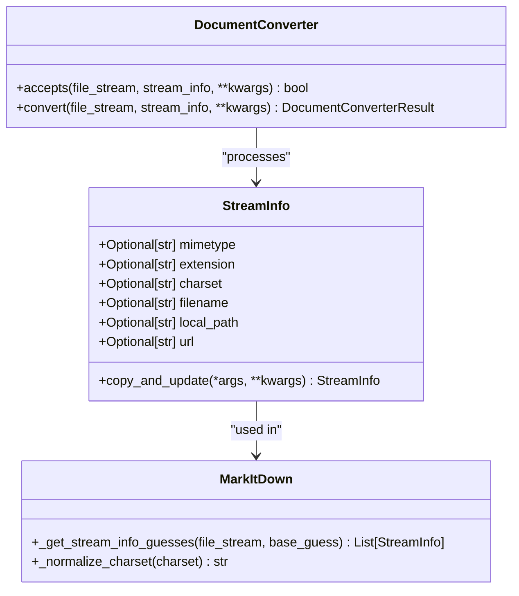
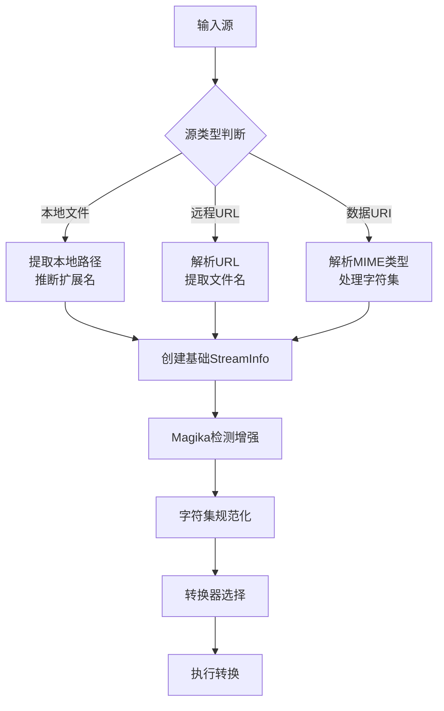
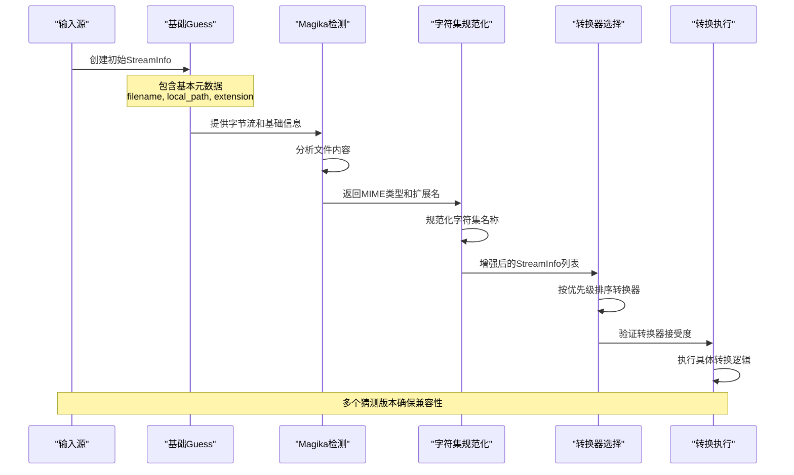
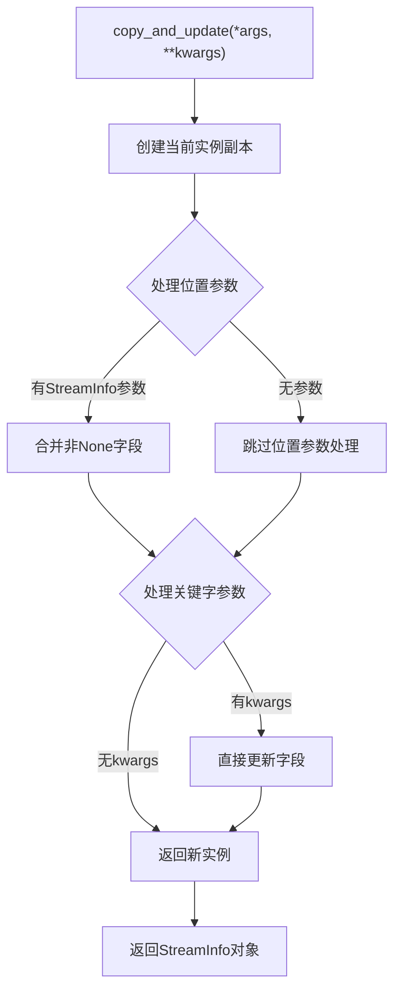
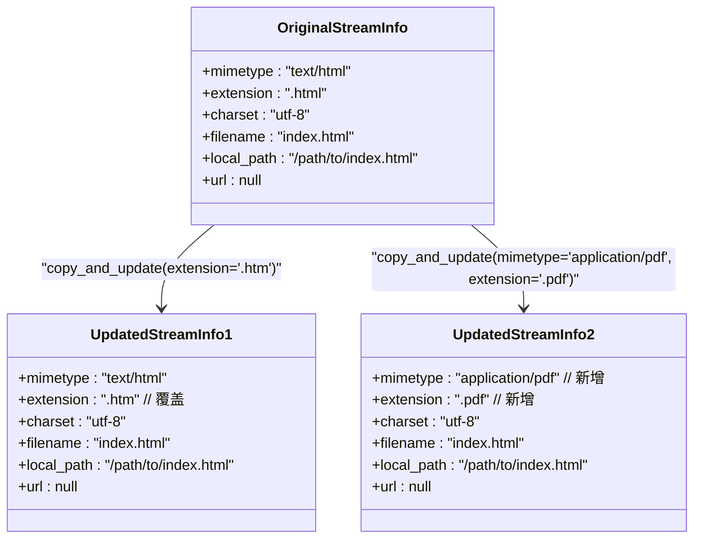
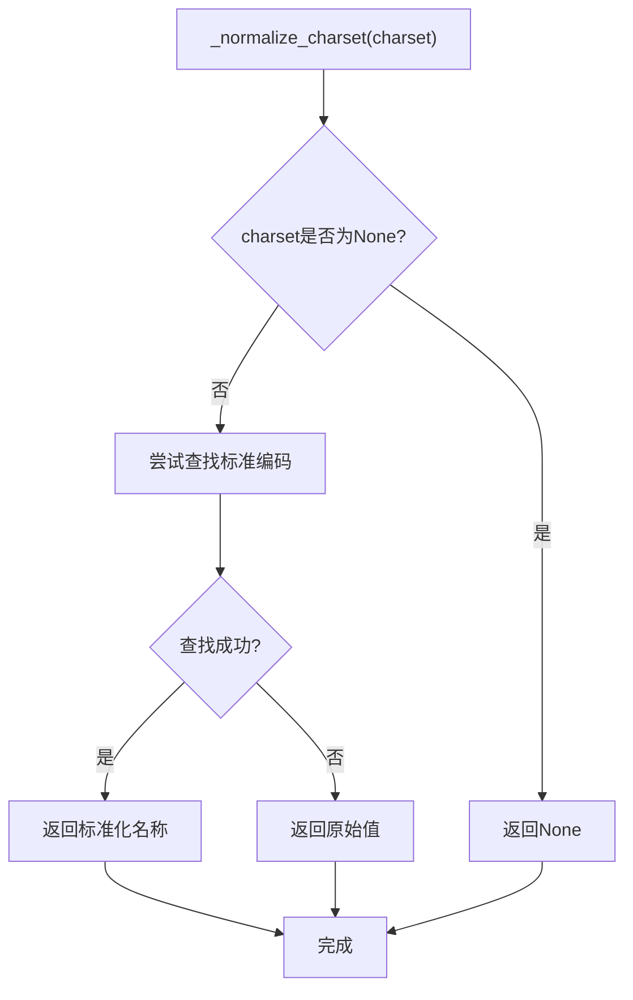
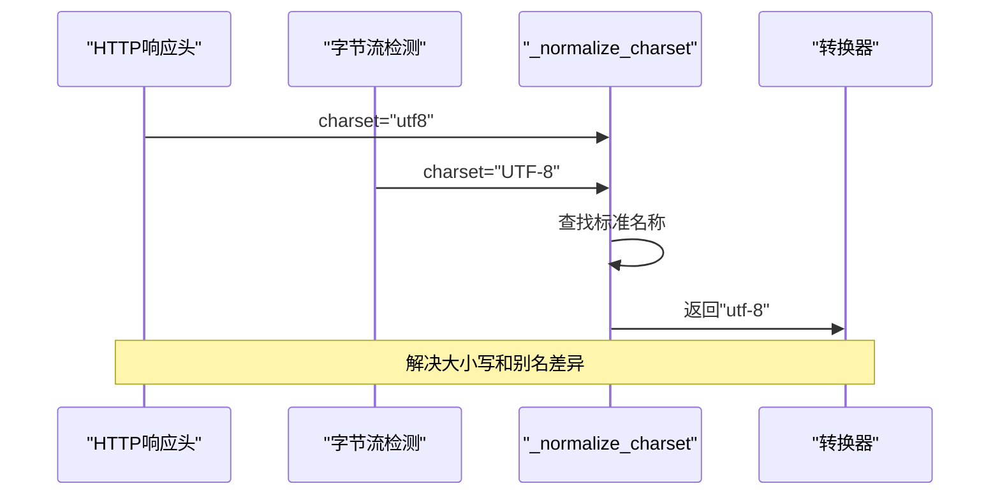

# StreamInfo 数据类详尽文档

<cite>
**本文档中引用的文件**
- [_stream_info.py](file://packages/markitdown/src/markitdown/_stream_info.py)
- [_markitdown.py](file://packages/markitdown/src/markitdown/_markitdown.py)
- [_html_converter.py](file://packages/markitdown/src/markitdown/converters/_html_converter.py)
- [_pdf_converter.py](file://packages/markitdown/src/markitdown/converters/_pdf_converter.py)
- [_docx_converter.py](file://packages/markitdown/src/markitdown/converters/_docx_converter.py)
- [_audio_converter.py](file://packages/markitdown/src/markitdown/converters/_audio_converter.py)
- [test_module_misc.py](file://packages/markitdown/tests/test_module_misc.py)
- [test_module_vectors.py](file://packages/markitdown/tests/test_module_vectors.py)
</cite>

## 目录
1. [简介](#简介)
2. [类结构概述](#类结构概述)
3. [核心字段详解](#核心字段详解)
4. [生命周期与转换流程](#生命周期与转换流程)
5. [copy_and_update 方法详解](#copy_and_update-方法详解)
6. [_mnormalize_charset 方法详解](#_mnormalize_charset-方法详解)
7. [实际使用示例](#实际使用示例)
8. [最佳实践指南](#最佳实践指南)
9. [总结](#总结)

## 简介

StreamInfo 是 markitdown 库中的核心数据类，专门设计用于存储和管理文件流的各种元数据信息。作为一个不可变的数据容器，它在整个文件转换流程中扮演着关键角色，从初始的输入源信息推断到最终的转换器选择决策。

该类采用 Python 的 dataclass 装饰器实现，具有冻结(frozen)特性，确保数据的不可变性，同时提供了强大的 copy_and_update 方法来支持基于现有实例的增量更新。

## 类结构概述

StreamInfo 类是一个简洁而功能完整的数据容器，定义了文件流转换过程中所需的所有关键元数据字段。



**图表来源**
- [_stream_info.py](file://packages/markitdown/src/markitdown/_stream_info.py#L5-L32)
- [_markitdown.py](file://packages/markitdown/src/markitdown/_markitdown.py#L653-L775)

**章节来源**
- [_stream_info.py](file://packages/markitdown/src/markitdown/_stream_info.py#L1-L33)

## 核心字段详解

StreamInfo 类包含六个核心字段，每个字段都承载着特定的元数据信息，在文件转换的不同阶段发挥重要作用。

### 字段定义表

| 字段名 | 类型 | 描述 | 使用场景 |
|--------|------|------|----------|
| mimetype | Optional[str] | MIME 类型标识符，如 "text/html"、"application/pdf" | 文件类型识别和转换器选择 |
| extension | Optional[str] | 文件扩展名，如 ".html"、".pdf" | 基于扩展名的快速匹配和默认值推断 |
| charset | Optional[str] | 字符编码格式，如 "utf-8"、"iso-8859-1" | 文本内容解码和字符集规范化 |
| filename | Optional[str] | 完整文件名，可能包含路径信息 | 文件名解析和内容分发 |
| local_path | Optional[str] | 本地文件系统路径 | 本地文件访问和相对路径处理 |
| url | Optional[str] | 源文件的网络地址 | 远程文件处理和资源定位 |

### 字段使用模式



**图表来源**
- [_markitdown.py](file://packages/markitdown/src/markitdown/_markitdown.py#L307-L374)
- [_markitdown.py](file://packages/markitdown/src/markitdown/_markitdown.py#L653-L775)

**章节来源**
- [_stream_info.py](file://packages/markitdown/src/markitdown/_stream_info.py#L8-L16)

## 生命周期与转换流程

StreamInfo 在 markitdown 的文件转换流程中经历完整的生命周期，从最初的输入源信息推断开始，经过 Magika 的深度分析增强，最终指导转换器的选择和执行。

### 转换流程架构



**图表来源**
- [_markitdown.py](file://packages/markitdown/src/markitdown/_markitdown.py#L653-L775)
- [_markitdown.py](file://packages/markitdown/src/markitdown/_markitdown.py#L764-L775)

### 流程阶段详解

#### 1. 初始信息推断阶段
系统根据不同的输入源类型（本地文件、远程URL、数据URI）推断初始的 StreamInfo 信息：

- **本地文件**：从文件路径提取扩展名和文件名
- **远程URL**：解析URL结构，提取主机信息和路径
- **数据URI**：解析MIME类型和字符集参数

#### 2. Magika 深度检测阶段
通过 Magika 文件识别库对文件内容进行深度分析，获得更准确的 MIME 类型和扩展名信息。

#### 3. 字符集规范化阶段
使用 `_normalize_charset` 方法标准化字符编码名称，解决不同来源字符集信息的不一致性问题。

#### 4. 转换器选择阶段
基于增强后的 StreamInfo 信息，按优先级顺序尝试各种转换器，直到找到合适的转换器或遍历所有选项。

**章节来源**
- [_markitdown.py](file://packages/markitdown/src/markitdown/_markitdown.py#L653-L775)

## copy_and_update 方法详解

`copy_and_update` 方法是 StreamInfo 类的核心功能之一，它实现了不可变更新模式，允许基于现有实例创建新的 StreamInfo 实例，同时覆盖指定的字段值。

### 方法签名与行为



**图表来源**
- [_stream_info.py](file://packages/markitdown/src/markitdown/_stream_info.py#L20-L32)

### 更新策略详解

#### 1. 参数处理机制
方法支持两种类型的参数：
- **位置参数**：可以传入一个或多个 StreamInfo 实例
- **关键字参数**：直接指定要更新的字段和值

#### 2. 字段覆盖规则
- 只有当新值不为 None 时才会覆盖原有值
- 支持混合更新：同时使用位置参数和关键字参数
- 保持原始实例不变，返回全新的 StreamInfo 实例

#### 3. 更新优先级
当多个参数提供相同字段时，遵循以下优先级：
1. 关键字参数（最高优先级）
2. 后提供的 StreamInfo 实例
3. 先提供的 StreamInfo 实例（最低优先级）

### 使用模式示例



**图表来源**
- [test_module_misc.py](file://packages/markitdown/tests/test_module_misc.py#L110-L180)

**章节来源**
- [_stream_info.py](file://packages/markitdown/src/markitdown/_stream_info.py#L20-L32)
- [test_module_misc.py](file://packages/markitdown/tests/test_module_misc.py#L110-L180)

## _mnormalize_charset 方法详解

`_normalize_charset` 方法负责标准化字符编码名称，这是处理不同来源字符集信息不一致性的关键组件。

### 方法实现原理



**图表来源**
- [_markitdown.py](file://packages/markitdown/src/markitdown/_markitdown.py#L764-L775)

### 字符集标准化过程

#### 1. 输入验证
- 接受 None 值，直接返回
- 对于有效字符串，尝试标准化处理

#### 2. 编码查找机制
使用 `codecs.lookup()` 函数尝试查找标准的编码名称：
- 将非标准的字符集名称映射到标准名称
- 处理常见的别名和变体
- 保持向后兼容性

#### 3. 错误处理策略
如果查找失败（LookupError），返回原始值而不抛出异常，确保系统的健壮性。

### 字符集不一致场景



**图表来源**
- [_markitdown.py](file://packages/markitdown/src/markitdown/_markitdown.py#L709-L732)

### 重要性分析

#### 1. 数据一致性保证
确保同一文件的字符集信息在不同来源之间保持一致，避免重复处理或错误解码。

#### 2. 兼容性提升
处理来自不同工具和库的字符集信息，提供统一的标准表示。

#### 3. 错误恢复能力
当遇到未知或无效的字符集名称时，能够优雅地回退到原始值，而不是导致转换失败。

**章节来源**
- [_markitdown.py](file://packages/markitdown/src/markitdown/_markitdown.py#L764-L775)

## 实际使用示例

以下是 StreamInfo 类在 markitdown 库中的典型使用场景和代码示例。

### 基础实例创建

```python
# 从本地文件创建
stream_info = StreamInfo(
    local_path="/path/to/document.pdf",
    extension=".pdf",
    filename="document.pdf"
)

# 从HTTP响应创建
response = requests.get("https://example.com/document.html")
stream_info = StreamInfo(
    mimetype="text/html",
    charset="utf-8",
    filename="document.html",
    url="https://example.com/document.html"
)
```

### 转换器接受性检查

```python
# HTML转换器示例
class HtmlConverter(DocumentConverter):
    def accepts(self, file_stream, stream_info, **kwargs):
        mimetype = (stream_info.mimetype or "").lower()
        extension = (stream_info.extension or "").lower()
        
        # 基于MIME类型和扩展名进行判断
        if extension in ACCEPTED_FILE_EXTENSIONS:
            return True
            
        for prefix in ACCEPTED_MIME_TYPE_PREFIXES:
            if mimetype.startswith(prefix):
                return True
                
        return False
```

### Magika检测增强流程

```python
# 在MarkItDown类中的使用
def _get_stream_info_guesses(self, file_stream, base_guess):
    # 基于基础猜测创建增强版本
    enhanced_guess = base_guess.copy_and_update()
    
    # 如果有扩展名但没有MIME类型，尝试猜测
    if base_guess.mimetype is None and base_guess.extension is not None:
        mimetype, _ = mimetypes.guess_type("placeholder" + base_guess.extension)
        if mimetype:
            enhanced_guess = enhanced_guess.copy_and_update(mimetype=mimetype)
    
    # 使用Magika进行深度检测
    result = self._magika.identify_stream(file_stream)
    if result.status == "ok":
        # 规范化字符集
        charset = self._normalize_charset(charset_result.encoding)
        
        # 创建最终的猜测版本
        final_guess = StreamInfo(
            mimetype=result.prediction.output.mime_type,
            extension=guessed_extension,
            charset=charset,
            filename=base_guess.filename,
            local_path=base_guess.local_path,
            url=base_guess.url
        )
```

### 字符串转换便捷方法

```python
# HTML转换器的字符串转换方法
def convert_string(self, html_content, *, url=None, **kwargs):
    return self.convert(
        file_stream=io.BytesIO(html_content.encode("utf-8")),
        stream_info=StreamInfo(
            mimetype="text/html",
            extension=".html",
            charset="utf-8",
            url=url,
        ),
        **kwargs
    )
```

**章节来源**
- [_html_converter.py](file://packages/markitdown/src/markitdown/converters/_html_converter.py#L70-L91)
- [_markitdown.py](file://packages/markitdown/src/markitdown/_markitdown.py#L653-L775)
- [test_module_vectors.py](file://packages/markitdown/tests/test_module_vectors.py#L37-L50)

## 最佳实践指南

### 1. 不可变性原则
- 始终使用 `copy_and_update` 方法创建新实例
- 避免直接修改 StreamInfo 实例的属性
- 利用不可变性确保数据的一致性和线程安全

### 2. 字段完整性考虑
- 根据可用信息尽可能完整地填充字段
- 使用 None 表示缺失信息，而不是空字符串
- 在转换器中始终检查字段的存在性

### 3. 字符集处理策略
- 优先使用 HTTP 响应头中的字符集信息
- 结合 Magika 检测结果进行字符集验证
- 使用 `_normalize_charset` 方法确保字符集名称标准化

### 4. 性能优化建议
- 在批量处理时重用基础 StreamInfo 实例
- 避免不必要的 copy_and_update 调用
- 利用 StreamInfo 的不可变特性进行缓存

### 5. 错误处理模式
- 在转换器中优雅处理缺失的字段信息
- 提供合理的默认值和回退机制
- 记录详细的日志以便调试和问题排查

## 总结

StreamInfo 类作为 markitdown 库的核心数据结构，完美体现了现代软件设计中的几个重要原则：

### 设计优势
1. **不可变性**：确保数据的安全性和可预测性
2. **灵活性**：通过 copy_and_update 方法提供强大的更新能力
3. **完整性**：涵盖文件转换所需的全部关键元数据
4. **标准化**：通过字符集规范化处理不一致信息

### 架构价值
在 markitdown 的整体架构中，StreamInfo 不仅是一个简单的数据容器，更是连接各个组件的桥梁：
- 为转换器提供统一的输入接口
- 支持多阶段的信息增强和验证
- 确保转换流程的可靠性和一致性

### 技术特色
- 基于 Python dataclass 的简洁实现
- 冻结特性保证数据完整性
- 强大的更新机制支持复杂的工作流程
- 与外部工具（Magika、charset_normalizer）的良好集成

StreamInfo 类的设计充分展示了如何通过精心设计的数据结构来简化复杂的业务逻辑，同时保持代码的可读性和可维护性。它不仅是 markitdown 库的技术基石，也为类似项目的文件处理系统设计提供了优秀的参考范例。