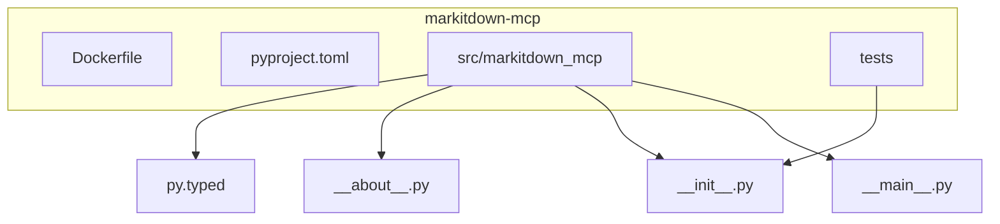
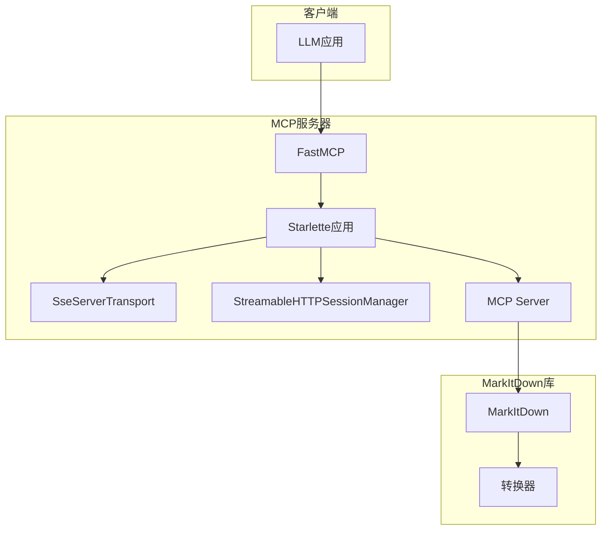
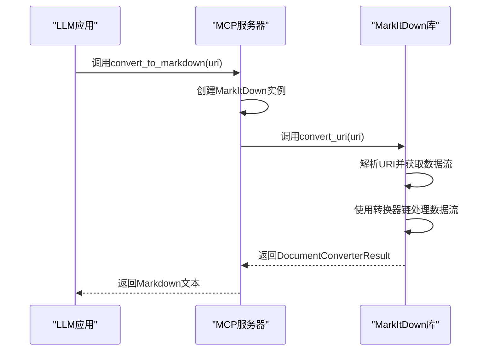
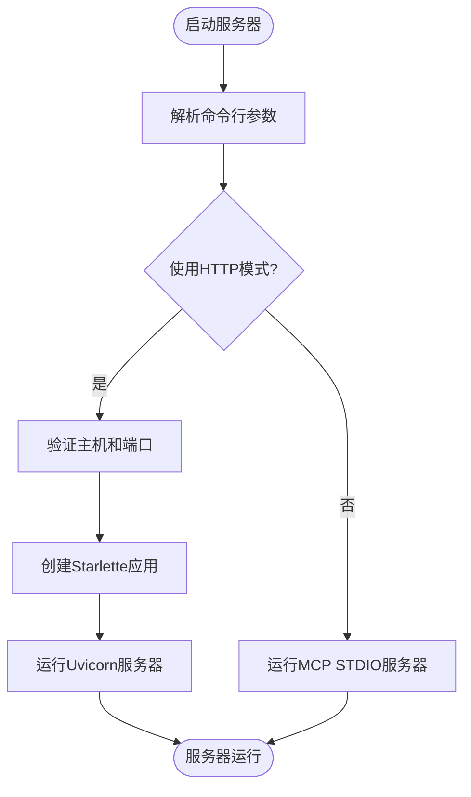

# MCP服务器

<cite>
**本文档中引用的文件**
- [__main__.py](file://packages/markitdown-mcp/src/markitdown_mcp/__main__.py)
- [Dockerfile](file://packages/markitdown-mcp/Dockerfile)
- [__init__.py](file://packages/markitdown-mcp/src/markitdown_mcp/__init__.py)
- [pyproject.toml](file://packages/markitdown-mcp/pyproject.toml)
- [_markitdown.py](file://packages/markitdown/src/markitdown/_markitdown.py)
- [README.md](file://packages/markitdown-mcp/README.md)
</cite>

## 目录
1. [引言](#引言)
2. [项目结构](#项目结构)
3. [核心组件](#核心组件)
4. [架构概述](#架构概述)
5. [详细组件分析](#详细组件分析)
6. [依赖分析](#依赖分析)
7. [性能考虑](#性能考虑)
8. [故障排除指南](#故障排除指南)
9. [结论](#结论)

## 引言
MCP（Model Context Protocol）服务器是MarkItDown库的一个轻量级扩展，旨在为大型语言模型（LLM）应用提供文档转换服务。`markitdown-mcp`包实现了MCP协议，允许LLM应用（如Claude Desktop）通过标准接口调用MarkItDown的核心功能，将各种格式的文档（如PDF、DOCX、HTML等）转换为Markdown格式。该服务器支持多种传输方式，包括STDIO、可流式HTTP和SSE，使其能够灵活地集成到不同的应用环境中。

## 项目结构
`markitdown-mcp`项目的结构简洁明了，主要包含源代码、测试和配置文件。源代码位于`src/markitdown_mcp`目录下，其中`__main__.py`是服务器的主入口点。`Dockerfile`提供了容器化部署的支持，而`pyproject.toml`则定义了项目的元数据和依赖关系。



**Diagram sources**
- [Dockerfile](file://packages/markitdown-mcp/Dockerfile)
- [pyproject.toml](file://packages/markitdown-mcp/pyproject.toml)

**Section sources**
- [Dockerfile](file://packages/markitdown-mcp/Dockerfile)
- [pyproject.toml](file://packages/markitdown-mcp/pyproject.toml)

## 核心组件
MCP服务器的核心功能由`__main__.py`文件中的代码实现。它利用`mcp`库创建一个FastMCP服务器实例，并注册一个名为`convert_to_markdown`的工具。该工具接收一个URI作为输入，调用MarkItDown库的`convert_uri`方法执行转换，并返回生成的Markdown文本。服务器的启动逻辑由`main()`函数处理，该函数解析命令行参数以决定使用STDIO还是HTTP/SSE模式。

**Section sources**
- [__main__.py](file://packages/markitdown-mcp/src/markitdown_mcp/__main__.py#L1-L127)

## 架构概述
MCP服务器的架构基于FastMCP和Starlette框架。当以HTTP模式启动时，它创建一个Starlette应用，该应用通过`SseServerTransport`处理SSE连接，并通过`StreamableHTTPSessionManager`处理可流式HTTP请求。服务器的核心是一个`Server`实例，它管理与客户端的通信。`convert_to_markdown`工具是唯一的MCP工具，它作为桥梁连接MCP协议和MarkItDown库的转换功能。



**Diagram sources**
- [__main__.py](file://packages/markitdown-mcp/src/markitdown_mcp/__main__.py#L1-L127)

## 详细组件分析

### MCP服务器主程序分析
`__main__.py`文件是MCP服务器的控制中心。它首先初始化一个`FastMCP`实例，然后使用`@mcp.tool()`装饰器注册`convert_to_markdown`工具。该工具的实现非常直接：它创建一个`MarkItDown`实例（根据环境变量决定是否启用插件），然后调用其`convert_uri`方法。服务器的启动模式由命令行参数控制，`--http`标志用于启用HTTP/SSE模式。

#### 对于API/服务组件：


**Diagram sources**
- [__main__.py](file://packages/markitdown-mcp/src/markitdown_mcp/__main__.py#L19-L23)
- [_markitdown.py](file://packages/markitdown/src/markitdown/_markitdown.py#L300-L350)

### 配置和部署分析
MCP服务器的配置主要通过命令行参数和环境变量完成。`--http`、`--host`和`--port`参数用于配置HTTP服务器。`MARKITDOWN_ENABLE_PLUGINS`环境变量用于控制是否加载插件。部署方面，项目提供了`Dockerfile`，使得服务器可以轻松地容器化。Docker镜像预装了`ffmpeg`和`exiftool`等运行时依赖，并将工作目录设置为`/workdir`，方便通过卷挂载访问本地文件。

#### 对于复杂逻辑组件：


**Diagram sources**
- [__main__.py](file://packages/markitdown-mcp/src/markitdown_mcp/__main__.py#L80-L127)

**Section sources**
- [__main__.py](file://packages/markitdown-mcp/src/markitdown_mcp/__main__.py#L80-L127)
- [Dockerfile](file://packages/markitdown-mcp/Dockerfile)

## 依赖分析
MCP服务器的主要依赖在`pyproject.toml`文件中定义。它依赖于`mcp~=1.8.0`库来实现MCP协议，并依赖于`markitdown[all]>=0.1.1,<0.2.0`来提供核心的文档转换功能。`Dockerfile`进一步定义了系统级依赖，如`ffmpeg`用于处理音视频文件，`exiftool`用于提取图像元数据。这种分层依赖管理确保了服务器功能的完整性和可移植性。

```mermaid
graph TD
A[markitdown-mcp] --> B[mcp~=1.8.0]
A --> C[markitdown[all]>=0.1.1,<0.2.0]
C --> D[Python库]
D --> E[requests]
D --> F[magika]
D --> G[charset_normalizer]
A --> FFMPEG[ffmpeg]
A --> EXIFTOOL[exiftool]
```

**Diagram sources**
- [pyproject.toml](file://packages/markitdown-mcp/pyproject.toml#L20-L25)
- [Dockerfile](file://packages/markitdown-mcp/Dockerfile#L9-L15)

**Section sources**
- [pyproject.toml](file://packages/markitdown-mcp/pyproject.toml#L20-L25)
- [Dockerfile](file://packages/markitdown-mcp/Dockerfile#L9-L15)

## 性能考虑
为了优化性能，MCP服务器的设计考虑了几个方面。首先，它支持可流式传输，允许客户端在服务器处理数据的同时接收部分结果，这对于处理大文件非常有利。其次，服务器利用`magika`库进行快速的文件类型识别，避免了对整个文件的读取。此外，通过将`markitdown`库的转换器链缓存和复用，减少了重复初始化的开销。在容器化部署时，通过将频繁访问的文件目录挂载为卷，可以显著提高文件I/O性能。

## 故障排除指南
如果MCP服务器无法正常工作，可以使用`mcpinspector`工具进行调试。该工具提供了一个Web界面，可以连接到服务器并列出可用的工具。对于STDIO模式，选择`STDIO`传输类型并输入`markitdown-mcp`作为命令。对于HTTP模式，选择相应的`Streamable HTTP`或`SSE`类型并输入正确的URL。此外，检查`Dockerfile`中的环境变量设置，确保`MARKITDOWN_ENABLE_PLUGINS`正确配置，并确认所需的系统依赖（如`ffmpeg`）已正确安装。

**Section sources**
- [README.md](file://packages/markitdown-mcp/README.md#L110-L138)

## 结论
`markitdown-mcp`服务器成功地将MarkItDown库的强大文档转换功能通过MCP协议暴露给LLM应用。其简洁的架构、灵活的部署选项（STDIO、HTTP、Docker）以及对插件系统的支持，使其成为一个强大且易于集成的工具。通过遵循本文档中的配置和集成指南，开发者可以轻松地将文档转换能力添加到他们的LLM应用中，从而扩展应用的功能和实用性。