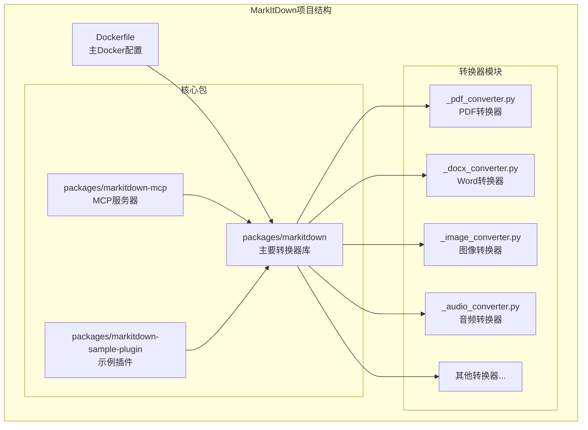
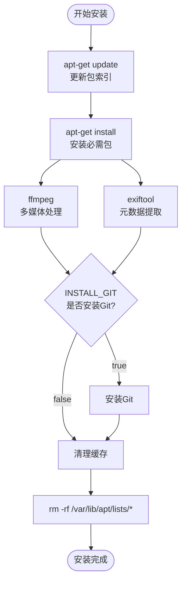
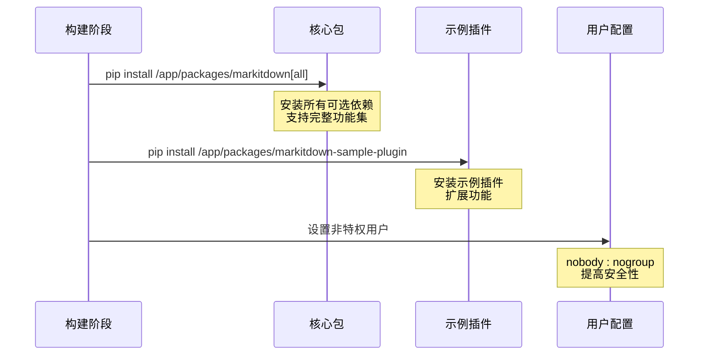
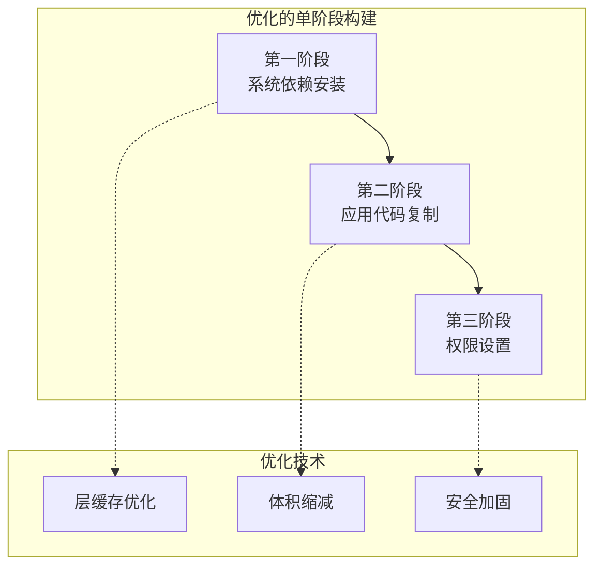
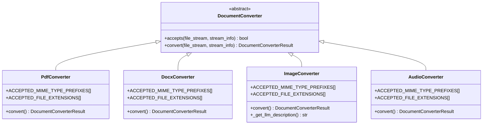
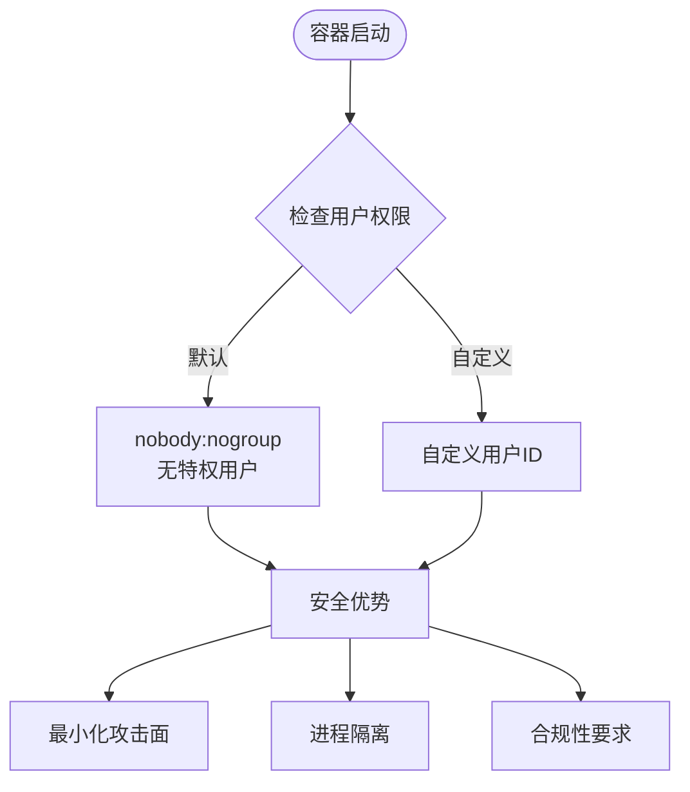

# MarkItDown Docker部署指南

<cite>
**本文档引用的文件**
- [Dockerfile](file://Dockerfile)
- [packages/markitdown-mcp/Dockerfile](file://packages/markitdown-mcp/Dockerfile)
- [packages/markitdown/pyproject.toml](file://packages/markitdown/pyproject.toml)
- [packages/markitdown-mcp/pyproject.toml](file://packages/markitdown-mcp/pyproject.toml)
- [packages/markitdown/src/markitdown/_markitdown.py](file://packages/markitdown/src/markitdown/src/markitdown/_markitdown.py)
- [packages/markitdown/src/markitdown/converters/_pdf_converter.py](file://packages/markitdown/src/markitdown/src/markitdown/converters/_pdf_converter.py)
- [packages/markitdown/src/markitdown/converters/_docx_converter.py](file://packages/markitdown/src/markitdown/src/markitdown/converters/_docx_converter.py)
- [packages/markitdown/src/markitdown/converters/_image_converter.py](file://packages/markitdown/src/markitdown/src/markitdown/converters/_image_converter.py)
- [packages/markitdown/src/markitdown/converters/_audio_converter.py](file://packages/markitdown/src/markitdown/src/markitdown/converters/_audio_converter.py)
- [README.md](file://README.md)
</cite>

## 目录
1. [简介](#简介)
2. [项目结构概览](#项目结构概览)
3. [Docker镜像架构](#docker镜像架构)
4. [基础镜像构建](#基础镜像构建)
5. [运行时依赖管理](#运行时依赖管理)
6. [Python环境配置](#python环境配置)
7. [多阶段构建策略](#多阶段构建策略)
8. [容器运行指南](#容器运行指南)
9. [文件格式支持](#文件格式支持)
10. [性能优化建议](#性能优化建议)
11. [安全最佳实践](#安全最佳实践)
12. [故障排除指南](#故障排除指南)
13. [总结](#总结)

## 简介

MarkItDown是一个轻量级的Python工具，专门用于将各种文件格式转换为Markdown，特别适用于LLM（大语言模型）和文本分析管道。本指南详细介绍了如何基于项目根目录的Dockerfile构建和运行MarkItDown Docker镜像，以及相关的部署最佳实践。

MarkItDown支持广泛的文件格式转换，包括PDF、Word文档、PowerPoint、Excel、图像、音频、HTML、文本格式等，是处理文档内容提取和转换的理想解决方案。

## 项目结构概览

MarkItDown项目采用多包架构设计，包含以下核心组件：



**图表来源**
- [Dockerfile](file://Dockerfile#L1-L34)
- [packages/markitdown/pyproject.toml](file://packages/markitdown/pyproject.toml#L1-L113)

**章节来源**
- [README.md](file://README.md#L1-L50)

## Docker镜像架构

MarkItDown提供了两个主要的Docker镜像变体，每个都有特定的用途和配置：

### 主要镜像（markitdown）

主镜像基于Python 3.13 Slim Bullseye，专为直接文件转换而设计：

```mermaid
graph LR
subgraph "markitdown镜像架构"
Base[python:3.13-slim-bullseye<br/>基础镜像]
subgraph "系统依赖层"
FFmpeg[FFmpeg<br/>视频/音频处理]
Exiftool[ExifTool<br/>元数据提取]
Git[Git<br/>可选安装]
end
subgraph "应用层"
WorkDir[/app<br/>工作目录]
PipInstall[pip install<br/>依赖安装]
UserID[nobody:nogroup<br/>非特权用户]
end
Base --> FFmpeg
FFmpeg --> Exiftool
Exiftool --> Git
Git --> WorkDir
WorkDir --> PipInstall
PipInstall --> UserID
end
```

**图表来源**
- [Dockerfile](file://Dockerfile#L1-L34)

### MCP服务器镜像（markitdown-mcp）

MCP（Model Context Protocol）服务器镜像专门为与Claude Desktop等LLM应用集成而设计：

```mermaid
graph LR
subgraph "markitdown-mcp镜像架构"
Base[python:3.13-slim-bullseye<br/>基础镜像]
subgraph "系统依赖层"
FFmpeg[FFmpeg<br/>多媒体处理]
Exiftool[ExifTool<br/>元数据处理]
end
subgraph "MCP服务层"
WorkDir2[/workdir<br/>工作目录]
PipInstall2[pip install<br/>MCP依赖]
UserID2[nobody:nogroup<br/>安全用户]
end
Base --> FFmpeg
FFmpeg --> Exiftool
Exiftool --> WorkDir2
WorkDir2 --> PipInstall2
PipInstall2 --> UserID2
end
```

**图表来源**
- [packages/markitdown-mcp/Dockerfile](file://packages/markitdown-mcp/Dockerfile#L1-L29)

**章节来源**
- [Dockerfile](file://Dockerfile#L1-L34)
- [packages/markitdown-mcp/Dockerfile](file://packages/markitdown-mcp/Dockerfile#L1-L29)

## 基础镜像构建

### Python版本选择

MarkItDown选择了Python 3.13作为基础运行时，具有以下优势：

- **稳定性**：Python 3.13提供了最新的语言特性和性能优化
- **兼容性**：支持Python 3.10及以上版本的所有特性
- **安全性**：使用Debian Bullseye Slim，提供最小化的攻击面

### 操作系统层

基础镜像采用了Debian Bullseye Slim，这是经过精心选择的：

- **安全性**：最小化安装减少了潜在的安全漏洞
- **体积**：Slim版本显著减小了镜像大小
- **稳定性**：Debian Bullseye提供了长期稳定的支持

### 环境变量配置

Dockerfile中设置了关键的环境变量：

| 变量名 | 默认值 | 用途 |
|--------|--------|------|
| `DEBIAN_FRONTEND` | `noninteractive` | 避免交互式提示 |
| `EXIFTOOL_PATH` | `/usr/bin/exiftool` | ExifTool可执行文件路径 |
| `FFMPEG_PATH` | `/usr/bin/ffmpeg` | FFmpeg可执行文件路径 |

**章节来源**
- [Dockerfile](file://Dockerfile#L1-L10)

## 运行时依赖管理

### 系统包安装

MarkItDown需要几个关键的系统级依赖：



**图表来源**
- [Dockerfile](file://Dockerfile#L11-L22)

### 可选依赖安装

系统包安装过程包含了条件检查机制：

- **FFmpeg**：用于视频和音频文件的处理
- **ExifTool**：用于提取图像和媒体文件的元数据
- **Git**：通过构建参数控制是否安装，用于开发场景

### 清理策略

为了优化镜像大小，执行了彻底的缓存清理：

```bash
# 清理APT缓存以减少镜像大小
RUN rm -rf /var/lib/apt/lists/*
```

**章节来源**
- [Dockerfile](file://Dockerfile#L11-L22)

## Python环境配置

### 依赖安装策略

MarkItDown采用了分层次的依赖安装策略：



**图表来源**
- [Dockerfile](file://Dockerfile#L24-L28)

### 可选依赖组

MarkItDown提供了灵活的依赖管理，支持按需安装：

| 依赖组 | 包含的转换器 | 用途 |
|--------|-------------|------|
| `[all]` | 所有转换器 | 完整功能支持 |
| `[pdf]` | PDF转换器 | 处理PDF文件 |
| `[docx]` | Word转换器 | 处理Word文档 |
| `[pptx]` | PowerPoint转换器 | 处理演示文稿 |
| `[xlsx]` | Excel转换器 | 处理电子表格 |
| `[audio-transcription]` | 音频转换器 | 语音转文字 |
| `[youtube-transcription]` | YouTube转换器 | 视频字幕提取 |
| `[az-doc-intel]` | 文档智能转换器 | Azure文档处理 |

### 版本控制

项目使用了严格的版本控制策略：

- **pip选项**：`--no-cache-dir`避免缓存污染
- **相对路径**：使用相对路径确保构建一致性
- **权限设置**：明确指定非特权用户运行

**章节来源**
- [packages/markitdown/pyproject.toml](file://packages/markitdown/pyproject.toml#L30-L45)
- [Dockerfile](file://Dockerfile#L24-L28)

## 多阶段构建策略

虽然当前的Dockerfile没有采用传统的多阶段构建，但它实现了类似的优化策略：

### 单阶段优化



### 层缓存优化

Dockerfile采用了最佳实践来优化层缓存：

1. **依赖安装后立即清理**：防止缓存累积
2. **工作目录设置**：在复制代码前设置
3. **权限提升**：仅在必要时临时提升权限

### 体积优化技术

- **Slim基础镜像**：最小化操作系统组件
- **APT缓存清理**：移除不必要的包管理缓存
- **单次RUN指令**：合并多个操作减少层数

**章节来源**
- [Dockerfile](file://Dockerfile#L11-L28)

## 容器运行指南

### 基础运行命令

MarkItDown提供了两种主要的运行模式：

#### 1. 文件转换模式

```bash
# 基本转换命令
docker run --rm -i markitdown:latest < ~/your-file.pdf > output.md

# 使用-o参数指定输出文件
docker run --rm -i markitdown:latest -o output.md < ~/your-file.pdf

# 从管道读取
cat ~/your-file.docx | docker run --rm -i markitdown:latest > output.md
```

#### 2. MCP服务器模式

```bash
# 启动MCP服务器
docker run -it --rm markitdown-mcp:latest

# 访问本地文件
docker run -it --rm -v /path/to/files:/workdir markitdown-mcp:latest
```

### 环境变量配置

可以通过环境变量自定义运行时行为：

```bash
# 设置ExifTool路径
docker run -e EXIFTOOL_PATH=/custom/path/to/exiftool \
           -e FFMPEG_PATH=/custom/path/to/ffmpeg \
           markitdown:latest < input.pdf > output.md
```

### 数据卷挂载

对于文件访问需求，推荐使用数据卷挂载：

```bash
# 挂载输入目录
docker run --rm -v $(pwd)/input:/app/input \
           -v $(pwd)/output:/app/output \
           markitdown:latest /app/input/input.pdf /app/output/output.md

# 交互式文件访问
docker run -it --rm -v $(pwd):/workdir markitdown-mcp:latest
```

### 构建参数

可以使用构建参数自定义镜像：

```bash
# 包含Git工具
docker build -t markitdown:latest --build-arg INSTALL_GIT=true .

# 自定义用户ID
docker build -t markitdown:latest --build-arg USERID=1000 --build-arg GROUPID=1000 .
```

**章节来源**
- [README.md](file://README.md#L180-L190)
- [packages/markitdown-mcp/README.md](file://packages/markitdown-mcp/README.md#L40-L109)

## 文件格式支持

### 支持的文件类型

MarkItDown通过其丰富的转换器生态系统支持多种文件格式：

```mermaid
mindmap
root((MarkItDown支持的文件格式))
文档类
PDF文件
Word文档(.docx)
PowerPoint(.pptx)
Excel电子表格(.xlsx/.xls)
Outlook消息(.msg)
多媒体类
图像文件(.jpg/.png)
音频文件(.wav/.mp3/.m4a)
视频文件(.mp4)
YouTube链接
Web类
HTML页面
RSS订阅
Wikipedia文章
Bing搜索结果
压缩类
ZIP文件
EPUB电子书
编程类
Jupyter笔记本(.ipynb)
CSV文件
JSON文件
XML文件
```

### 转换器架构

每个转换器都遵循统一的接口模式：



**图表来源**
- [packages/markitdown/src/markitdown/converters/_pdf_converter.py](file://packages/markitdown/src/markitdown/src/markitdown/converters/_pdf_converter.py#L1-L78)
- [packages/markitdown/src/markitdown/converters/_docx_converter.py](file://packages/markitdown/src/markitdown/src/markitdown/converters/_docx_converter.py#L1-L91)
- [packages/markitdown/src/markitdown/converters/_image_converter.py](file://packages/markitdown/src/markitdown/src/markitdown/converters/_image_converter.py#L1-L139)
- [packages/markitdown/src/markitdown/converters/_audio_converter.py](file://packages/markitdown/src/markitdown/src/markitdown/converters/_audio_converter.py#L1-L102)

### 功能特性

#### PDF转换
- 提取纯文本内容
- 忽略样式信息（保持Markdown简洁）
- 支持多种PDF格式

#### Word文档转换
- 保留标题和列表结构
- 处理表格和图片
- 支持样式映射

#### 图像处理
- EXIF元数据提取
- LLM图像描述（可选）
- 支持JPEG和PNG格式

#### 音频处理
- 元数据提取
- 语音转文字（需要额外依赖）
- 支持多种音频格式

**章节来源**
- [packages/markitdown/src/markitdown/_markitdown.py](file://packages/markitdown/src/markitdown/src/markitdown/_markitdown.py#L40-L60)
- [packages/markitdown/src/markitdown/converters/_pdf_converter.py](file://packages/markitdown/src/markitdown/src/markitdown/converters/_pdf_converter.py#L15-L30)
- [packages/markitdown/src/markitdown/converters/_docx_converter.py](file://packages/markitdown/src/markitdown/src/markitdown/converters/_docx_converter.py#L25-L40)

## 性能优化建议

### 镜像优化

#### 1. 层缓存利用
- 将变化频率低的指令放在前面
- 利用Docker的层缓存机制
- 最小化重建时的重新计算

#### 2. 镜像大小控制
- 使用Slim基础镜像
- 及时清理临时文件和缓存
- 移除不必要的系统工具

#### 3. 构建时间优化
```bash
# 使用构建缓存
docker build --cache-from markitdown:latest -t markitdown:new .

# 多阶段构建（如果需要）
docker build --target production -t markitdown:optimized .
```

### 运行时性能

#### 1. 内存管理
- 为大型文件转换预留足够内存
- 监控容器内存使用情况
- 考虑使用swap空间

#### 2. CPU优化
- 对于CPU密集型转换（如音频转录），考虑资源限制
- 使用适当的并发设置
- 考虑使用GPU加速（如果可用）

#### 3. I/O性能
```bash
# 使用SSD存储提高I/O性能
docker run --storage-opt size=10G markitdown:latest < input.pdf > output.md

# 使用tmpfs进行临时文件处理
docker run --tmpfs /tmp:rw,noexec,nosuid,size=1g markitdown:latest < input.pdf > output.md
```

### 批处理优化

```bash
# 批量处理脚本示例
#!/bin/bash
for file in *.pdf; do
    echo "Processing $file..."
    docker run --rm -i markitdown:latest < "$file" > "${file%.pdf}.md"
done
```

## 安全最佳实践

### 用户权限管理

MarkItDown采用了严格的安全策略：



**图表来源**
- [Dockerfile](file://Dockerfile#L29-L34)

### 安全配置

#### 1. 非特权用户运行
```bash
# 默认配置
ARG USERID=nobody
ARG GROUPID=nogroup

# 自定义安全用户
docker run --user 1000:1000 markitdown:latest < input.pdf > output.md
```

#### 2. 资源限制
```bash
# 限制内存使用
docker run --memory=512m markitdown:latest < large-file.pdf > output.md

# 限制CPU使用
docker run --cpus="1.0" markitdown:latest < input.pdf > output.md

# 限制磁盘空间
docker run --storage-opt size=10G markitdown:latest < input.pdf > output.md
```

#### 3. 网络安全
```bash
# 禁用网络连接（如果不需要）
docker run --network none markitdown:latest < input.pdf > output.md

# 使用私有网络
docker network create secure-net
docker run --network secure-net markitdown:latest < input.pdf > output.md
```

### 数据保护

#### 1. 敏感数据处理
- 避免在容器中存储敏感信息
- 使用环境变量传递配置
- 实施数据加密传输

#### 2. 日志安全
```bash
# 限制日志输出
docker run --log-driver=none markitdown:latest < input.pdf > output.md

# 使用安全的日志驱动
docker run --log-driver=syslog --log-opt syslog-address=tcp://localhost:514 markitdown:latest < input.pdf > output.md
```

### 容器编排安全

#### Kubernetes部署
```yaml
apiVersion: apps/v1
kind: Deployment
metadata:
  name: markitdown-converter
spec:
  replicas: 3
  selector:
    matchLabels:
      app: markitdown
  template:
    metadata:
      labels:
        app: markitdown
    spec:
      securityContext:
        runAsNonRoot: true
        runAsUser: 1000
        runAsGroup: 1000
        fsGroup: 1000
      containers:
      - name: markitdown
        image: markitdown:latest
        securityContext:
          allowPrivilegeEscalation: false
          readOnlyRootFilesystem: true
          capabilities:
            drop:
            - ALL
        resources:
          limits:
            memory: "512Mi"
            cpu: "500m"
```

**章节来源**
- [Dockerfile](file://Dockerfile#L29-L34)

## 故障排除指南

### 常见问题及解决方案

#### 1. 依赖缺失错误

**问题**：转换器报告缺少依赖
```bash
MissingDependencyException: Missing required dependency for PDF conversion
```

**解决方案**：
```bash
# 重新构建包含所有依赖的镜像
docker build -t markitdown:latest --build-arg INSTALL_GIT=true .

# 或者手动安装缺失的Python包
docker run --rm -it markitdown:latest bash
pip install pdfminer.six mammoth lxml
```

#### 2. 权限问题

**问题**：无法读取输入文件
```bash
Permission denied: /input/file.pdf
```

**解决方案**：
```bash
# 检查文件权限
ls -la /path/to/input/

# 使用正确的用户ID运行
docker run --user $(id -u):$(id -g) -v /path/to/input:/input markitdown:latest /input/file.pdf /output/file.md
```

#### 3. 内存不足

**问题**：处理大型文件时内存溢出
```bash
MemoryError: Unable to allocate array
```

**解决方案**：
```bash
# 增加可用内存
docker run --memory=2g markitdown:latest < large-file.pdf > output.md

# 使用流式处理（如果支持）
echo "Processing large file..." | docker run --rm -i markitdown:latest
```

#### 4. 网络连接问题

**问题**：在线转换器（如YouTube）无法工作
```bash
ConnectionError: Failed to connect to YouTube
```

**解决方案**：
```bash
# 检查网络连接
docker run --rm --network host markitdown:latest --help

# 使用代理（如果需要）
docker run --env http_proxy=http://proxy:8080 markitdown:latest < input.pdf > output.md
```

### 调试技巧

#### 1. 详细日志
```bash
# 启用调试模式
docker run --env DEBUG=true markitdown:latest < input.pdf > output.md

# 查看容器日志
docker logs <container-id>
```

#### 2. 交互式调试
```bash
# 进入容器内部
docker run --rm -it --entrypoint bash markitdown:latest

# 检查安装的包
pip list

# 测试转换器
python -c "from markitdown import MarkItDown; md = MarkItDown(); print(md.convert('test.pdf'))"
```

#### 3. 性能监控
```bash
# 监控资源使用
docker stats <container-id>

# 分析构建过程
docker build --progress=plain -t markitdown:latest .
```

### 错误代码参考

| 错误类型 | 可能原因 | 解决方案 |
|----------|----------|----------|
| `MissingDependencyException` | 缺少必要的Python包 | 重新构建镜像或手动安装依赖 |
| `FileConversionException` | 文件格式不支持或损坏 | 检查文件格式和完整性 |
| `PermissionError` | 文件权限问题 | 调整文件权限或容器用户 |
| `MemoryError` | 内存不足 | 增加内存限制或优化处理流程 |
| `ConnectionError` | 网络连接失败 | 检查网络配置或使用代理 |

**章节来源**
- [packages/markitdown/src/markitdown/_exceptions.py](file://packages/markitdown/src/markitdown/src/markitdown/_exceptions.py)

## 总结

MarkItDown的Docker部署方案提供了强大而灵活的文档转换能力，通过精心设计的容器化架构确保了安全性、性能和易用性。以下是关键要点：

### 技术优势

1. **全面的文件格式支持**：涵盖文档、多媒体、Web内容等多种格式
2. **模块化架构**：清晰的转换器分离和可扩展插件系统
3. **安全的运行环境**：非特权用户运行和最小化攻击面
4. **优化的镜像大小**：Slim基础镜像和高效的构建策略

### 部署建议

1. **生产环境**：使用预构建的官方镜像，配合适当的资源限制
2. **开发环境**：启用Git工具和调试功能，便于开发和测试
3. **集成部署**：考虑使用MCP服务器模式与LLM应用集成
4. **批量处理**：设计合理的批处理脚本和工作流程

### 未来发展方向

- **多架构支持**：扩展对ARM64等其他架构的支持
- **GPU加速**：为大规模转换任务提供硬件加速
- **云原生优化**：更好的Kubernetes和容器编排支持
- **性能监控**：内置的性能指标和监控功能

通过遵循本指南的最佳实践，您可以充分利用MarkItDown的强大功能，构建高效、安全的文档转换解决方案。