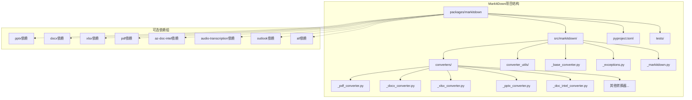
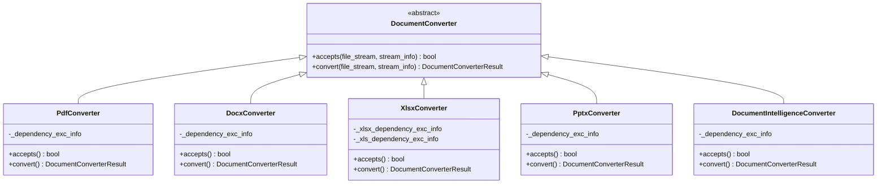
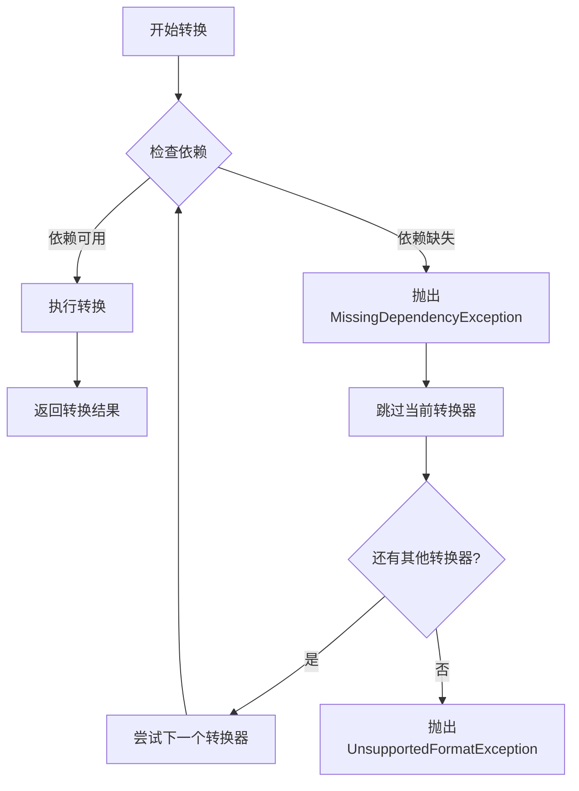
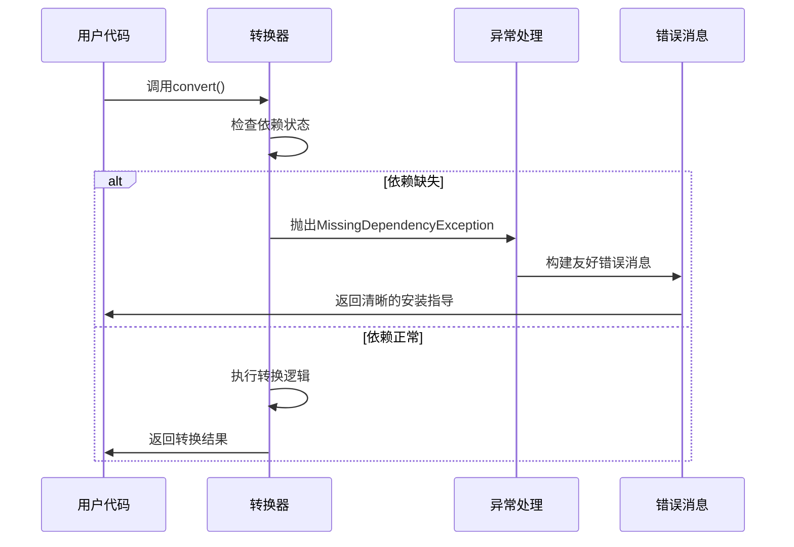
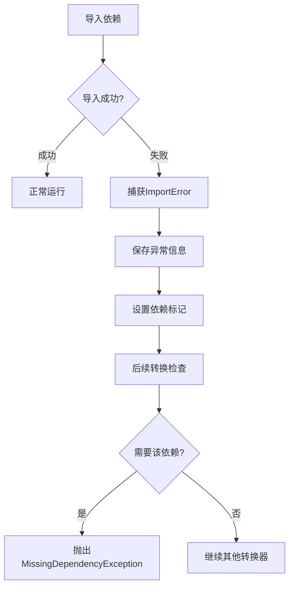

# 可选依赖管理

<cite>
**本文档中引用的文件**
- [pyproject.toml](file://packages/markitdown/pyproject.toml)
- [__init__.py](file://packages/markitdown/src/markitdown/__init__.py)
- [_markitdown.py](file://packages/markitdown/src/markitdown/_markitdown.py)
- [_exceptions.py](file://packages/markitdown/src/markitdown/_exceptions.py)
- [_pdf_converter.py](file://packages/markitdown/src/markitdown/converters/_pdf_converter.py)
- [_docx_converter.py](file://packages/markitdown/src/markitdown/converters/_docx_converter.py)
- [_xlsx_converter.py](file://packages/markitdown/src/markitdown/converters/_xlsx_converter.py)
- [_pptx_converter.py](file://packages/markitdown/src/markitdown/converters/_pptx_converter.py)
- [_audio_converter.py](file://packages/markitdown/src/markitdown/converters/_audio_converter.py)
- [_outlook_msg_converter.py](file://packages/markitdown/src/markitdown/converters/_outlook_msg_converter.py)
- [_doc_intel_converter.py](file://packages/markitdown/src/markitdown/converters/_doc_intel_converter.py)
- [README.md](file://README.md)
</cite>

## 目录
1. [简介](#简介)
2. [项目结构概览](#项目结构概览)
3. [可选依赖组详解](#可选依赖组详解)
4. [核心转换器与依赖关系](#核心转换器与依赖关系)
5. [依赖检测机制](#依赖检测机制)
6. [使用场景与安装策略](#使用场景与安装策略)
7. [常见错误与解决方案](#常见错误与解决方案)
8. [最佳实践建议](#最佳实践建议)
9. [总结](#总结)

## 简介

MarkItDown是一个轻量级的Python工具，专门用于将各种文件格式转换为Markdown格式，特别适用于LLM（大语言模型）和相关文本分析管道。该项目采用了模块化的可选依赖架构，允许用户根据实际需求灵活安装所需的依赖包，避免不必要的资源浪费。

这种设计使得MarkItDown能够支持广泛的文件格式转换，同时保持核心功能的轻量化。通过将不同功能的依赖分组管理，用户可以根据具体的使用场景选择最合适的安装组合。

## 项目结构概览

MarkItDown项目采用多包架构，主要包含以下组件：



**图表来源**
- [pyproject.toml](file://packages/markitdown/pyproject.toml#L1-L113)
- [_markitdown.py](file://packages/markitdown/src/markitdown/_markitdown.py#L1-L50)

**章节来源**
- [pyproject.toml](file://packages/markitdown/pyproject.toml#L1-L113)
- [_markitdown.py](file://packages/markitdown/src/markitdown/_markitdown.py#L1-L777)

## 可选依赖组详解

### 核心依赖配置

MarkItDown在`pyproject.toml`中定义了完整的可选依赖组，每个组对应特定的功能需求：

| 依赖组 | 包含的包 | 支持的文件格式 | 技术实现 |
|--------|----------|----------------|----------|
| `[all]` | 所有可选依赖 | 全部支持 | 完整功能覆盖 |
| `[pptx]` | `python-pptx` | `.pptx` | PowerPoint幻灯片处理 |
| `[docx]` | `mammoth`, `lxml` | `.docx` | Word文档HTML转换 |
| `[xlsx]` | `pandas`, `openpyxl` | `.xlsx` | Excel工作表表格化 |
| `[xls]` | `pandas`, `xlrd` | `.xls` | 旧版Excel兼容 |
| `[pdf]` | `pdfminer.six` | `.pdf` | PDF文本提取 |
| `[outlook]` | `olefile` | `.msg` | Outlook邮件解析 |
| `[audio-transcription]` | `pydub`, `SpeechRecognition` | `.wav`, `.mp3`, `.m4a`, `.mp4` | 音频转录 |
| `[youtube-transcription]` | `youtube-transcript-api` | YouTube视频 | 视频字幕获取 |
| `[az-doc-intel]` | `azure-ai-documentintelligence`, `azure-identity` | 多种格式 | Azure文档智能 |

### 依赖组详细说明

#### [pptx] - PowerPoint转换
- **核心包**: `python-pptx`
- **技术实现**: 使用python-pptx库解析PowerPoint文件结构
- **支持内容**: 幻灯片标题、正文、表格、图片、图表、备注
- **特殊功能**: 支持大型语言模型(LLM)图片描述生成

#### [docx] - Word文档转换  
- **核心包**: `mammoth`, `lxml`
- **技术实现**: Mammoth库将DOCX转换为HTML，再由HTML转换器处理
- **支持内容**: 文本样式、段落格式、表格、图片
- **特殊功能**: 支持自定义样式映射(style_map)

#### [xlsx] - Excel表格转换
- **核心包**: `pandas`, `openpyxl`
- **技术实现**: Pandas读取Excel数据，转换为HTML表格
- **支持内容**: 多个工作表、单元格格式、公式结果
- **特殊功能**: 每个工作表独立转换为Markdown表格

#### [pdf] - PDF文档转换
- **核心包**: `pdfminer.six`
- **技术实现**: PDFMiner提取PDF中的文本内容
- **支持内容**: 基础文本、简单布局信息
- **限制**: 不保留复杂排版格式，输出接近纯文本

#### [az-doc-intel] - Azure文档智能
- **核心包**: `azure-ai-documentintelligence`, `azure-identity`
- **技术实现**: Azure Document Intelligence服务
- **支持内容**: DOCX、PPTX、XLSX、PDF、图像文件
- **优势**: 高质量OCR和文档分析能力

**章节来源**
- [pyproject.toml](file://packages/markitdown/pyproject.toml#L40-L60)
- [_pdf_converter.py](file://packages/markitdown/src/markitdown/converters/_pdf_converter.py#L1-L78)
- [_docx_converter.py](file://packages/markitdown/src/markitdown/converters/_docx_converter.py#L1-L91)
- [_xlsx_converter.py](file://packages/markitdown/src/markitdown/converters/_xlsx_converter.py#L1-L158)

## 核心转换器与依赖关系

### 转换器架构设计

MarkItDown采用插件化的转换器架构，每个转换器负责特定的文件格式处理：



**图表来源**
- [_pdf_converter.py](file://packages/markitdown/src/markitdown/converters/_pdf_converter.py#L20-L78)
- [_docx_converter.py](file://packages/markitdown/src/markitdown/converters/_docx_converter.py#L25-L91)
- [_xlsx_converter.py](file://packages/markitdown/src/markitdown/converters/_xlsx_converter.py#L40-L158)
- [_pptx_converter.py](file://packages/markitdown/src/markitdown/converters/_pptx_converter.py#L30-L265)
- [_doc_intel_converter.py](file://packages/markitdown/src/markitdown/converters/_doc_intel_converter.py#L130-L195)

### 依赖检测模式

所有转换器都采用统一的依赖检测模式：



**图表来源**
- [_pdf_converter.py](file://packages/markitdown/src/markitdown/converters/_pdf_converter.py#L40-L70)
- [_docx_converter.py](file://packages/markitdown/src/markitdown/converters/_docx_converter.py#L60-L90)
- [_xlsx_converter.py](file://packages/markitdown/src/markitdown/converters/_xlsx_converter.py#L70-L150)

**章节来源**
- [_pdf_converter.py](file://packages/markitdown/src/markitdown/converters/_pdf_converter.py#L1-L78)
- [_docx_converter.py](file://packages/markitdown/src/markitdown/converters/_docx_converter.py#L1-L91)
- [_xlsx_converter.py](file://packages/markitdown/src/markitdown/converters/_xlsx_converter.py#L1-L158)
- [_pptx_converter.py](file://packages/markitdown/src/markitdown/converters/_pptx_converter.py#L1-L265)

## 依赖检测机制

### 异常处理架构

MarkItDown实现了完善的异常处理机制来管理缺失的依赖：



**图表来源**
- [_exceptions.py](file://packages/markitdown/src/markitdown/_exceptions.py#L1-L77)
- [_pdf_converter.py](file://packages/markitdown/src/markitdown/converters/_pdf_converter.py#L40-L70)

### 错误消息模板

系统使用统一的错误消息模板，提供明确的安装指导：

```
{converter}识别输入为潜在的{extension}文件，但需要的依赖包未安装。要解决此问题，请在安装MarkItDown时包含可选依赖[{feature}]或[all]。例如：

* pip install markitdown[{feature}]
* pip install markitdown[all]
* pip install markitdown[{feature}, ...]
* 等等。
```

**章节来源**
- [_exceptions.py](file://packages/markitdown/src/markitdown/_exceptions.py#L1-L77)
- [_pdf_converter.py](file://packages/markitdown/src/markitdown/converters/_pdf_converter.py#L40-L70)

## 使用场景与安装策略

### 场景分析与推荐组合

根据不同使用场景，推荐以下安装策略：

#### 通用办公文档处理
```bash
pip install 'markitdown[docx, pptx, xlsx, xls]'
```
**适用场景**: 日常办公文档转换，处理Word、PowerPoint、Excel文件

#### 科研与学术文档
```bash
pip install 'markitdown[docx, pdf, pptx]'
```
**适用场景**: 学术论文、研究报告的多格式转换

#### 数据分析与报表
```bash
pip install 'markitdown[xlsx, xls, pdf]'
```
**适用场景**: 数据分析、财务报表、统计报告处理

#### 高质量文档转换
```bash
pip install 'markitdown[az-doc-intel]'
```
**适用场景**: 对转换质量要求较高的专业文档处理

#### 多媒体内容处理
```bash
pip install 'markitdown[audio-transcription, youtube-transcription, outlook]'
```
**适用场景**: 音频转录、YouTube视频内容、邮件归档处理

#### 完整功能覆盖
```bash
pip install 'markitdown[all]'
```
**适用场景**: 需要支持所有文件格式的完整环境

### 性能考虑

不同依赖组合对系统性能的影响：

| 组合类型 | 安装大小 | 内存占用 | 启动时间 | 功能覆盖 |
|----------|----------|----------|----------|----------|
| 最小组合 | ~50MB | 低 | 快 | 基础格式 |
| 中等组合 | ~200MB | 中等 | 中等 | 办公文档 |
| 完整组合 | ~1GB | 高 | 慢 | 全功能 |

**章节来源**
- [README.md](file://README.md#L80-L120)
- [pyproject.toml](file://packages/markitdown/pyproject.toml#L40-L60)

## 常见错误与解决方案

### 缺失依赖错误

#### 错误示例：PDF转换失败
```
MissingDependencyException: PdfConverter识别输入为潜在的.pdf文件，但需要的依赖包未安装。要解决此问题，请在安装MarkItDown时包含可选依赖[pdf]或[all]。
```

#### 解决方案
```bash
pip install markitdown[pdf]
# 或
pip install markitdown[all]
```

#### 错误示例：Word文档转换失败
```
MissingDependencyException: DocxConverter识别输入为潜在的.docx文件，但需要的依赖包未安装。
```

#### 解决方案
```bash
pip install markitdown[docx]
# 或
pip install markitdown[all]
```

### 运行时错误处理

#### 依赖加载失败
当依赖包存在但无法加载时，系统会捕获导入异常并提供详细的错误信息：



**图表来源**
- [_pdf_converter.py](file://packages/markitdown/src/markitdown/converters/_pdf_converter.py#L10-L20)
- [_docx_converter.py](file://packages/markitdown/src/markitdown/converters/_docx_converter.py#L15-L25)

### 环境配置问题

#### Python版本兼容性
- **最低要求**: Python 3.10
- **推荐版本**: Python 3.12
- **注意事项**: 某些依赖可能不支持较旧的Python版本

#### 依赖冲突处理
- 使用虚拟环境隔离依赖
- 优先使用`pip install`而非系统包管理器
- 定期更新依赖包以获得最新修复

**章节来源**
- [_exceptions.py](file://packages/markitdown/src/markitdown/_exceptions.py#L1-L44)
- [_pdf_converter.py](file://packages/markitdown/src/markitdown/converters/_pdf_converter.py#L40-L70)

## 最佳实践建议

### 开发环境配置

#### 推荐的开发环境设置
```bash
# 创建虚拟环境
python -m venv markitdown-dev
source markitdown-dev/bin/activate  # Linux/MacOS
# 或
markitdown-dev\Scripts\activate.bat  # Windows

# 安装开发依赖
pip install 'markitdown[all]'
pip install hatch  # 用于构建和测试
```

#### 测试环境验证
```python
from markitdown import MarkItDown

# 创建实例并测试
md = MarkItDown()
try:
    result = md.convert("test.pdf")
    print("PDF转换成功")
except Exception as e:
    print(f"PDF转换失败: {e}")
```

### 生产环境部署

#### Docker容器化部署
```dockerfile
FROM python:3.12-slim

WORKDIR /app
COPY requirements.txt .
RUN pip install -r requirements.txt

COPY . .
CMD ["python", "-m", "markitdown"]
```

#### 云平台部署建议
- 使用容器编排服务（Kubernetes）
- 实施监控和日志记录
- 设置适当的资源限制
- 配置健康检查端点

### 性能优化策略

#### 依赖预加载
```python
# 在应用启动时预加载常用转换器
from markitdown import MarkItDown

# 预先初始化常用的转换器
md = MarkItDown(
    enable_builtins=True,
    enable_plugins=False
)
```

#### 内存管理
- 处理大型文件时注意内存使用
- 使用流式处理减少内存占用
- 及时释放不再使用的转换器实例

#### 并发处理
```python
import asyncio
from markitdown import MarkItDown

async def process_files(file_paths):
    md = MarkItDown()
    tasks = [process_single_file(md, path) for path in file_paths]
    results = await asyncio.gather(*tasks)
    return results
```

### 故障排除指南

#### 常见问题诊断流程
1. **确认Python版本**: `python --version`
2. **检查依赖安装**: `pip list | grep markitdown`
3. **验证文件格式**: 确认文件扩展名正确
4. **查看详细错误**: 启用调试模式获取更多信息

#### 日志记录最佳实践
```python
import logging
from markitdown import MarkItDown

logging.basicConfig(level=logging.INFO)
logger = logging.getLogger(__name__)

md = MarkItDown()
try:
    result = md.convert("document.pdf")
    logger.info(f"转换成功: {len(result.text_content)}字符")
except Exception as e:
    logger.error(f"转换失败: {e}")
```

## 总结

MarkItDown的可选依赖系统体现了现代软件设计的最佳实践，通过模块化架构实现了功能与性能的平衡。该系统的主要优势包括：

### 设计优势
1. **灵活性**: 用户可根据需求选择最小化安装
2. **可维护性**: 清晰的依赖分离便于维护和升级
3. **用户体验**: 友好的错误提示引导用户正确安装
4. **扩展性**: 易于添加新的转换器和依赖组

### 技术特点
1. **惰性加载**: 仅在需要时检查和加载依赖
2. **优雅降级**: 缺少依赖时自动跳过相应功能
3. **统一异常处理**: 标准化的错误消息和解决方案
4. **类型安全**: 完整的类型注解支持

### 应用价值
- **降低部署成本**: 避免安装不必要的依赖包
- **提高安全性**: 减少攻击面和潜在的安全风险
- **优化资源使用**: 更高效的内存和存储利用
- **简化维护**: 更容易进行版本管理和故障排除

通过合理选择和配置可选依赖，用户可以在满足业务需求的同时，保持系统的轻量化和高性能。这种设计理念不仅适用于MarkItDown项目，也为其他类似的工具开发提供了有价值的参考。