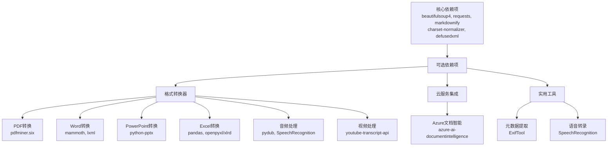
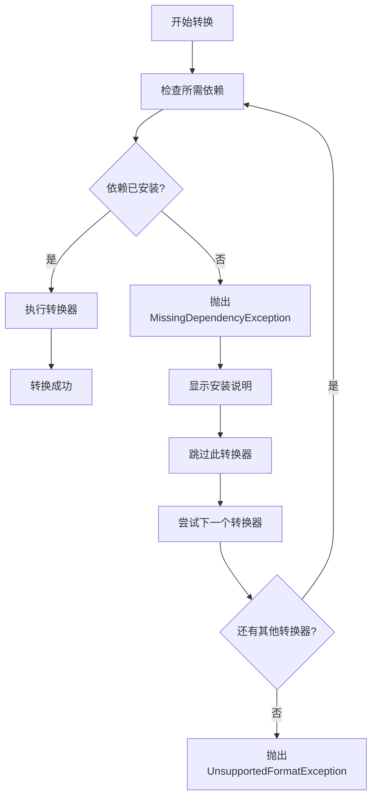
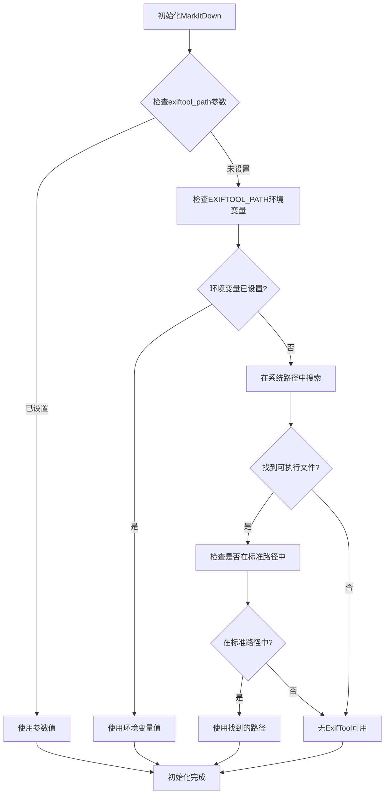
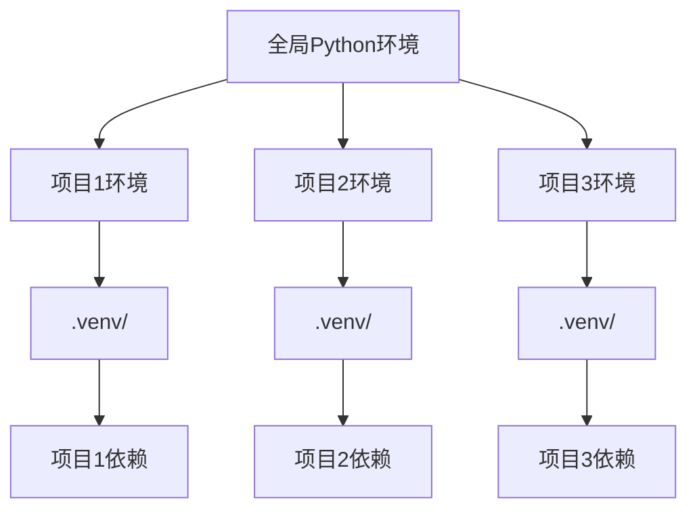
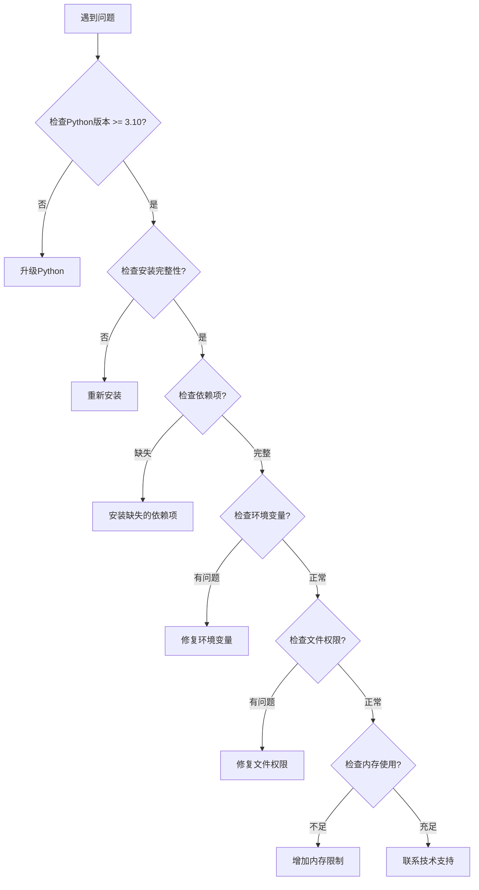

# 安装与配置

<cite>
**本文档中引用的文件**
- [README.md](file://README.md)
- [packages/markitdown/pyproject.toml](file://packages/markitdown/pyproject.toml)
- [packages/markitdown-mcp/pyproject.toml](file://packages/markitdown-mcp/pyproject.toml)
- [packages/markitdown-mcp/Dockerfile](file://packages/markitdown-mcp/Dockerfile)
- [Dockerfile](file://Dockerfile)
- [packages/markitdown/src/markitdown/_markitdown.py](file://packages/markitdown/src/markitdown/_markitdown.py)
- [packages/markitdown/src/markitdown/_exceptions.py](file://packages/markitdown/src/markitdown/_exceptions.py)
- [packages/markitdown/src/markitdown/converters/_exiftool.py](file://packages/markitdown/src/markitdown/converters/_exiftool.py)
</cite>

## 目录
1. [简介](#简介)
2. [系统要求](#系统要求)
3. [通过pip安装](#通过pip安装)
4. [从源码安装](#从源码安装)
5. [可选依赖项配置](#可选依赖项配置)
6. [环境变量配置](#环境变量配置)
7. [Docker环境配置](#docker环境配置)
8. [Python虚拟环境管理](#python虚拟环境管理)
9. [故障排除指南](#故障排除指南)
10. [最佳实践建议](#最佳实践建议)

## 简介

MarkItDown是一个轻量级的Python工具，用于将各种文件转换为Markdown格式，特别适用于大型语言模型(LLM)和相关文本分析管道。该项目采用模块化设计，支持多种文件格式的转换，并提供了灵活的可选依赖项系统。

## 系统要求

### 基础要求
- **Python版本**: 3.10或更高版本
- **操作系统**: 支持Windows、macOS和Linux
- **内存**: 至少512MB可用内存
- **磁盘空间**: 至少100MB可用空间

### 运行时依赖
MarkItDown需要以下系统级依赖：
- **ExifTool**: 用于处理图像元数据和音频文件
- **FFmpeg**: 用于音频和视频文件处理

**节来源**
- [README.md](file://README.md#L41-L45)
- [packages/markitdown/pyproject.toml](file://packages/markitdown/pyproject.toml#L25-L35)

## 通过pip安装

### 标准安装

最简单的安装方式是使用pip安装所有可选依赖项：

```bash
pip install 'markitdown[all]'
```

这将安装核心功能和所有支持的文件格式转换器。

### 按需安装

对于更精细的控制，可以只安装特定功能组的依赖项：

```bash
# 安装PDF转换功能
pip install 'markitdown[pdf]'

# 安装Word文档转换功能
pip install 'markitdown[docx]'

# 安装PowerPoint转换功能
pip install 'markitdown[pptx]'

# 安装Excel转换功能
pip install 'markitdown[xlsx]'

# 安装音频转录功能
pip install 'markitdown[audio-transcription]'

# 安装Azure Document Intelligence功能
pip install 'markitdown[az-doc-intel]'

# 组合多个功能
pip install 'markitdown[pdf, docx, pptx, audio-transcription]'
```

### 特定功能组说明

| 功能组 | 描述 | 包含的依赖项 |
|--------|------|-------------|
| `[all]` | 安装所有可选依赖项 | 所有列出的功能 |
| `[pptx]` | PowerPoint文件转换 | python-pptx |
| `[docx]` | Word文档转换 | mammoth, lxml |
| `[xlsx]` | Excel工作簿转换 | pandas, openpyxl |
| `[xls]` | 旧版Excel文件转换 | pandas, xlrd |
| `[pdf]` | PDF文件转换 | pdfminer.six |
| `[outlook]` | Outlook消息处理 | olefile |
| `[az-doc-intel]` | Azure文档智能 | azure-ai-documentintelligence, azure-identity |
| `[audio-transcription]` | 音频转录 | pydub, SpeechRecognition |
| `[youtube-transcription]` | YouTube字幕获取 | youtube-transcript-api |

**节来源**
- [README.md](file://README.md#L90-L125)
- [packages/markitdown/pyproject.toml](file://packages/markitdown/pyproject.toml#L36-L50)

## 从源码安装

### 克隆仓库

```bash
git clone git@github.com:microsoft/markitdown.git
cd markitdown
```

### 开发模式安装

使用开发模式安装以获得最新的更改：

```bash
pip install -e 'packages/markitdown[all]'
```

### 构建和安装

```bash
# 进入包目录
cd packages/markitdown

# 使用Hatch构建
hatch build

# 安装构建的包
pip install dist/*.whl
```

### 开发环境设置

```bash
# 创建虚拟环境
python -m venv .venv
source .venv/bin/activate  # Linux/macOS
# 或
.\.venv\Scripts\activate  # Windows

# 安装开发依赖
pip install -e '.[all]'
pip install hatch  # 如果尚未安装
```

**节来源**
- [README.md](file://README.md#L58-L62)
- [packages/markitdown/pyproject.toml](file://packages/markitdown/pyproject.toml#L60-L70)

## 可选依赖项配置

### 依赖项组织架构

MarkItDown采用分层的依赖项组织方式，基于功能组进行分类：



**图表来源**
- [packages/markitdown/pyproject.toml](file://packages/markitdown/pyproject.toml#L36-L50)

### 依赖项检测机制

MarkItDown实现了智能的依赖项检测机制，当尝试使用未安装的转换器时会抛出明确的异常：



**图表来源**
- [packages/markitdown/src/markitdown/_exceptions.py](file://packages/markitdown/src/markitdown/_exceptions.py#L10-L35)

**节来源**
- [packages/markitdown/src/markitdown/_exceptions.py](file://packages/markitdown/src/markitdown/_exceptions.py#L1-L44)

## 环境变量配置

### EXIFTOOL_PATH设置

MarkItDown使用EXIFTOOL_PATH环境变量来定位ExifTool可执行文件。该变量具有以下优先级：

1. **显式参数**: 通过`MarkItDown(exiftool_path=...)`参数指定
2. **环境变量**: 读取`EXIFTOOL_PATH`环境变量
3. **系统路径**: 在常见位置搜索ExifTool

### 自动路径检测逻辑



**图表来源**
- [packages/markitdown/src/markitdown/_markitdown.py](file://packages/markitdown/src/markitdown/_markitdown.py#L146-L168)

### 支持的EXIFTOOL_PATH位置

MarkItDown会在以下位置自动查找ExifTool：

**Unix/Linux/macOS系统**:
- `/usr/bin/exiftool`
- `/usr/local/bin/exiftool`
- `/opt/bin/exiftool`
- `/opt/local/bin/exiftool`
- `/opt/homebrew/bin/exiftool`

**Windows系统**:
- `C:\Windows\System32\exiftool.exe`
- `C:\Program Files\exiftool.exe`
- `C:\Program Files (x86)\exiftool.exe`

### 设置环境变量

#### 临时设置（当前终端会话）
```bash
# Linux/macOS
export EXIFTOOL_PATH=/usr/local/bin/exiftool

# Windows PowerShell
$env:EXIFTOOL_PATH="C:\Program Files\exiftool\exiftool.exe"
```

#### 永久设置
```bash
# 添加到 ~/.bashrc 或 ~/.zshrc
echo 'export EXIFTOOL_PATH="/usr/local/bin/exiftool"' >> ~/.bashrc
source ~/.bashrc
```

#### 在Python代码中设置
```python
import os
os.environ['EXIFTOOL_PATH'] = '/usr/local/bin/exiftool'

from markitdown import MarkItDown
md = MarkItDown()
```

**节来源**
- [packages/markitdown/src/markitdown/_markitdown.py](file://packages/markitdown/src/markitdown/_markitdown.py#L140-L170)
- [packages/markitdown/src/markitdown/converters/_exiftool.py](file://packages/markitdown/src/markitdown/converters/_exiftool.py#L15-L50)

## Docker环境配置

### 基础Docker镜像

MarkItDown提供了两个主要的Docker配置：

#### 主应用Dockerfile
```dockerfile
FROM python:3.13-slim-bullseye

ENV DEBIAN_FRONTEND=noninteractive
ENV EXIFTOOL_PATH=/usr/bin/exiftool
ENV FFMPEG_PATH=/usr/bin/ffmpeg

# 安装运行时依赖
RUN apt-get update && apt-get install -y --no-install-recommends \
    ffmpeg \
    exiftool

# 清理包管理器缓存
RUN rm -rf /var/lib/apt/lists/*

WORKDIR /app
COPY . /app
RUN pip --no-cache-dir install \
    /app/packages/markitdown[all] \
    /app/packages/markitdown-sample-plugin

# 设置非特权用户
ARG USERID=nobody
ARG GROUPID=nogroup
USER $USERID:$GROUPID

ENTRYPOINT [ "markitdown" ]
```

#### MCP服务器Dockerfile
```dockerfile
FROM python:3.13-slim-bullseye

ENV DEBIAN_FRONTEND=noninteractive
ENV EXIFTOOL_PATH=/usr/bin/exiftool
ENV FFMPEG_PATH=/usr/bin/ffmpeg
ENV MARKITDOWN_ENABLE_PLUGINS=True

# 安装运行时依赖
RUN apt-get update && apt-get install -y --no-install-recommends \
    ffmpeg \
    exiftool

# 清理包管理器缓存
RUN rm -rf /var/lib/apt/lists/*

COPY . /app
RUN pip --no-cache-dir install /app

WORKDIR /workdir
USER nobody:nogroup

ENTRYPOINT [ "markitdown-mcp" ]
```

### Docker构建和运行

#### 构建主应用容器
```bash
# 构建镜像
docker build -t markitdown:latest .

# 运行容器（基本用法）
docker run --rm -i markitdown:latest < ~/your-file.pdf > output.md

# 运行容器（挂载文件）
docker run --rm -v $(pwd):/workdir -i markitdown:latest < /workdir/input.pdf > /workdir/output.md
```

#### 构建MCP服务器容器
```bash
# 进入MCP包目录
cd packages/markitdown-mcp

# 构建MCP服务器镜像
docker build -t markitdown-mcp:latest .

# 运行MCP服务器
docker run --rm -p 1337:1337 markitdown-mcp:latest
```

#### 使用自定义配置
```bash
# 启用插件
docker run --rm -e MARKITDOWN_ENABLE_PLUGINS=true \
           -v $(pwd)/input:/input \
           -v $(pwd)/output:/output \
           markitdown:latest < /input/document.pdf > /output/result.md

# 自定义用户ID
docker run --rm -u $(id -u):$(id -g) \
           -v $(pwd):/workdir \
           markitdown:latest < /workdir/input.docx > /workdir/output.md
```

### Docker最佳实践

#### 多阶段构建优化
```dockerfile
# 生产阶段
FROM python:3.13-slim-bullseye AS production

# ... 生产环境配置

# 开发阶段
FROM python:3.13-slim-bullseye AS development

# 安装开发工具
RUN pip install hatch pre-commit
```

#### 资源限制
```bash
# 限制内存使用
docker run --rm --memory=512m --memory-swap=512m \
           markitdown:latest < input.pdf > output.md

# 限制CPU使用
docker run --rm --cpus=1.0 \
           markitdown:latest < input.pdf > output.md
```

**节来源**
- [Dockerfile](file://Dockerfile#L1-L33)
- [packages/markitdown-mcp/Dockerfile](file://packages/markitdown-mcp/Dockerfile#L1-L28)

## Python虚拟环境管理

### 推荐的虚拟环境工具

#### 1. 标准venv
```bash
# 创建虚拟环境
python -m venv .venv

# 激活虚拟环境
source .venv/bin/activate  # Linux/macOS
.\.venv\Scripts\activate  # Windows

# 安装MarkItDown
pip install 'markitdown[all]'

# 退出虚拟环境
deactivate
```

#### 2. uv（推荐的快速包管理器）
```bash
# 安装uv（如果尚未安装）
pip install uv

# 创建虚拟环境（指定Python版本）
uv venv --python=3.12 .venv

# 激活虚拟环境
source .venv/bin/activate

# 使用uv安装包
uv pip install 'markitdown[all]'

# 查看已安装包
uv pip list
```

#### 3. Conda（数据科学环境）
```bash
# 创建Conda环境
conda create -n markitdown python=3.12

# 激活环境
conda activate markitdown

# 安装MarkItDown
pip install 'markitdown[all]'

# 导出环境配置
conda env export > environment.yml

# 从配置重建环境
conda env create -f environment.yml
```

### 虚拟环境管理最佳实践

#### 环境隔离策略


#### 环境配置模板
```bash
#!/bin/bash
# setup_env.sh - 虚拟环境设置脚本

PYTHON_VERSION=${PYTHON_VERSION:-3.12}
ENV_NAME=${ENV_NAME:-markitdown}

# 检查Python版本
if ! command -v python3.$PYTHON_VERSION &> /dev/null; then
    echo "Python $PYTHON_VERSION.x not found"
    exit 1
fi

# 创建虚拟环境
echo "Creating virtual environment..."
python3.$PYTHON_VERSION -m venv .venv

# 激活环境
source .venv/bin/activate

# 更新pip
pip install --upgrade pip

# 安装MarkItDown
echo "Installing MarkItDown..."
pip install 'markitdown[all]'

# 验证安装
python -c "import markitdown; print(f'MarkItDown version: {markitdown.__version__}')"

echo "Setup complete!"
```

#### 环境备份和恢复
```bash
# 导出依赖项
pip freeze > requirements.txt

# 从requirements安装
pip install -r requirements.txt

# 导出完整环境
pip freeze > environment-full.txt

# 从环境文件重建
pip install -r environment-full.txt
```

**节来源**
- [README.md](file://README.md#L41-L57)

## 故障排除指南

### 常见安装问题

#### 1. 依赖项缺失错误

**症状**: `MissingDependencyException` 异常
```
MissingDependencyException: PdfConverter recognized the input as a potential .pdf file, but the dependencies needed to read .pdf files have not been installed.
```

**解决方案**:
```bash
# 安装PDF相关的依赖项
pip install 'markitdown[pdf]'

# 或安装所有依赖项
pip install 'markitdown[all]'
```

#### 2. EXIFTOOL_PATH未找到

**症状**: ExifTool相关功能无法使用

**解决方案**:
```bash
# 安装ExifTool（Ubuntu/Debian）
sudo apt-get install exiftool

# 安装ExifTool（macOS）
brew install exiftool

# 设置环境变量
export EXIFTOOL_PATH=$(which exiftool)
```

#### 3. 权限问题

**症状**: 文件访问被拒绝

**解决方案**:
```bash
# 检查文件权限
ls -la input.pdf

# 修复权限
chmod 644 input.pdf

# 使用正确的用户运行
docker run --user $(id -u):$(id -g) ...
```

#### 4. 内存不足

**症状**: 大文件转换失败

**解决方案**:
```bash
# 增加可用内存
ulimit -m 2048  # 限制最大内存使用2GB

# 使用流式处理
python -c "
from markitdown import MarkItDown
md = MarkItDown()
with open('large_file.pdf', 'rb') as f:
    result = md.convert(f)
    print(result.text_content[:1000])
"
```

### 错误诊断流程



### 性能优化建议

#### 1. 选择合适的依赖项组合
```bash
# 仅需要PDF转换
pip install 'markitdown[pdf]'

# 需要Word和PDF转换
pip install 'markitdown[docx,pdf]'

# 需要音频转录
pip install 'markitdown[audio-transcription]'
```

#### 2. 使用流式处理大文件
```python
from markitdown import MarkItDown

# 流式处理避免内存溢出
md = MarkItDown()
with open('large_document.pdf', 'rb') as f:
    result = md.convert(f)
    # 处理结果...
```

#### 3. 并行处理多个文件
```python
import concurrent.futures
from markitdown import MarkItDown

def convert_file(filename):
    md = MarkItDown()
    with open(filename, 'rb') as f:
        return md.convert(f).text_content

files = ['doc1.pdf', 'doc2.docx', 'doc3.pptx']
with concurrent.futures.ThreadPoolExecutor(max_workers=4) as executor:
    results = list(executor.map(convert_file, files))
```

**节来源**
- [packages/markitdown/src/markitdown/_exceptions.py](file://packages/markitdown/src/markitdown/_exceptions.py#L1-L76)

## 最佳实践建议

### 1. 依赖项管理策略

#### 分层安装策略
```bash
# 开发环境：安装所有依赖项
pip install 'markitdown[all]'

# 生产环境：按需安装
pip install 'markitdown[pdf,docx,audio-transcription]'

# CI/CD环境：最小化安装
pip install 'markitdown[pdf]'
```

#### 依赖项锁定
```bash
# 创建requirements.txt
pip freeze > requirements.txt

# 使用pip-tools确保一致性
pip install pip-tools
pip-compile requirements.in
pip-sync requirements.txt
```

### 2. 环境配置最佳实践

#### 环境变量管理
```bash
# 创建环境配置文件
cat > .env << EOF
EXIFTOOL_PATH=/usr/local/bin/exiftool
FFMPEG_PATH=/usr/local/bin/ffmpeg
MARKITDOWN_ENABLE_PLUGINS=true
EOF

# 使用dotenv加载
pip install python-dotenv
```

#### Docker配置优化
```dockerfile
# 使用多阶段构建
FROM python:3.13-slim as builder
WORKDIR /app
COPY requirements.txt .
RUN pip install --no-cache-dir -r requirements.txt

FROM python:3.13-slim as runtime
COPY --from=builder /usr/local/lib/python3.13/site-packages /usr/local/lib/python3.13/site-packages
COPY --from=builder /usr/local/bin /usr/local/bin
```

### 3. 安全考虑

#### 权限最小化原则
```bash
# 使用非特权用户
USER nobody:nogroup

# 限制文件系统访问
VOLUME /tmp
WORKDIR /app
```

#### 输入验证
```python
from markitdown import MarkItDown
from pathlib import Path

def safe_convert(input_path: str) -> str:
    path = Path(input_path)
    if not path.exists() or not path.is_file():
        raise ValueError(f"Invalid input file: {input_path}")
    
    if path.stat().st_size > 100 * 1024 * 1024:  # 100MB限制
        raise ValueError("File too large")
    
    md = MarkItDown()
    with open(path, 'rb') as f:
        return md.convert(f).text_content
```

### 4. 监控和日志

#### 日志配置
```python
import logging
from markitdown import MarkItDown

logging.basicConfig(level=logging.INFO)
logger = logging.getLogger('markitdown')

md = MarkItDown()
# 启用详细日志记录
```

#### 性能监控
```python
import time
from markitdown import MarkItDown

def timed_conversion(input_file):
    start_time = time.time()
    md = MarkItDown()
    
    with open(input_file, 'rb') as f:
        result = md.convert(f)
    
    end_time = time.time()
    logger.info(f"Conversion took {end_time - start_time:.2f} seconds")
    return result
```

### 5. 升级和维护

#### 版本兼容性检查
```python
import markitdown

# 检查版本兼容性
current_version = markitdown.__version__
print(f"Current MarkItDown version: {current_version}")

# 检查依赖项版本
import pkg_resources
dependencies = ['pdfminer.six', 'mammoth', 'pandas']
for dep in dependencies:
    version = pkg_resources.get_distribution(dep).version
    print(f"{dep}: {version}")
```

#### 自动更新策略
```bash
#!/bin/bash
# auto_update.sh

# 检查更新
pip list --outdated | grep markitdown

# 更新到最新版本
pip install --upgrade 'markitdown[all]'

# 验证更新
python -c "import markitdown; print(f'Updated to: {markitdown.__version__}')"
```

通过遵循这些最佳实践，您可以确保MarkItDown的稳定、安全和高效运行，同时保持良好的维护性和可扩展性。