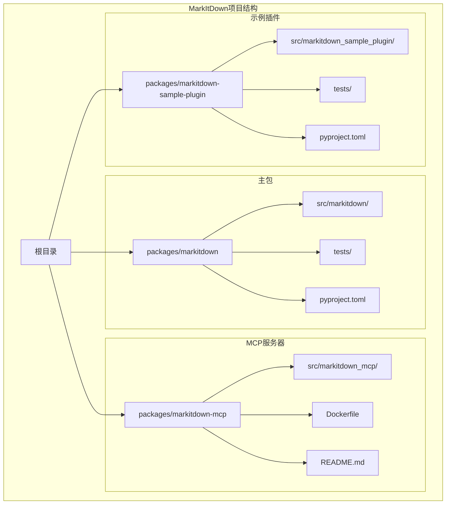
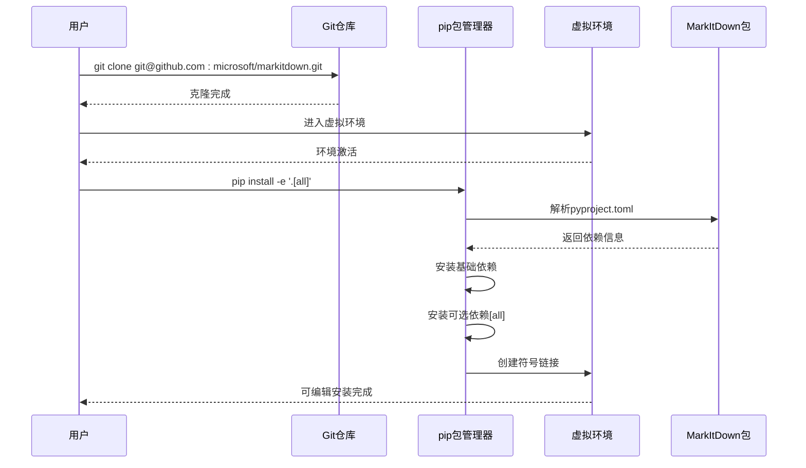
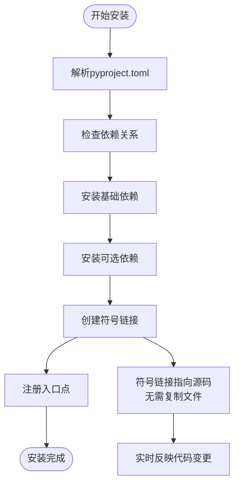
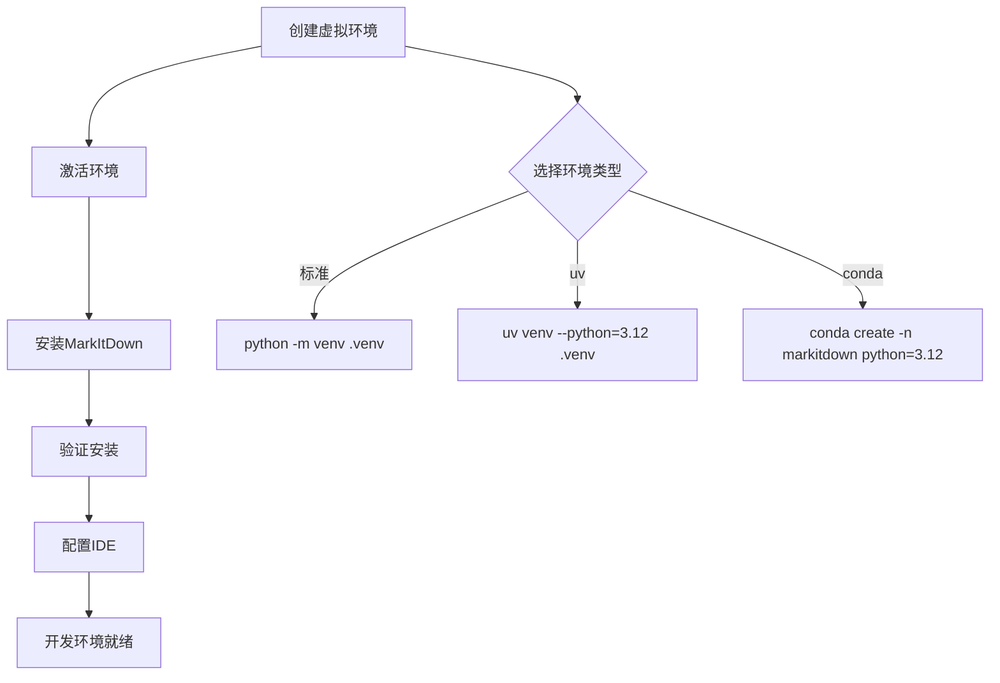
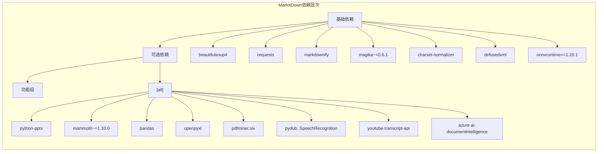
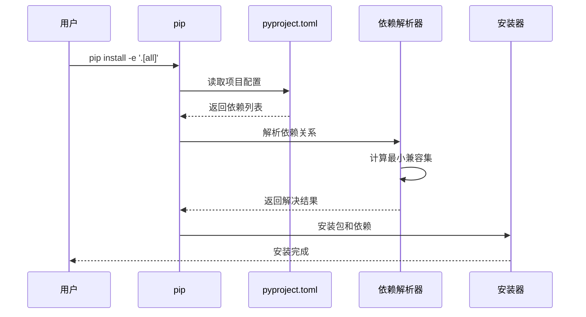
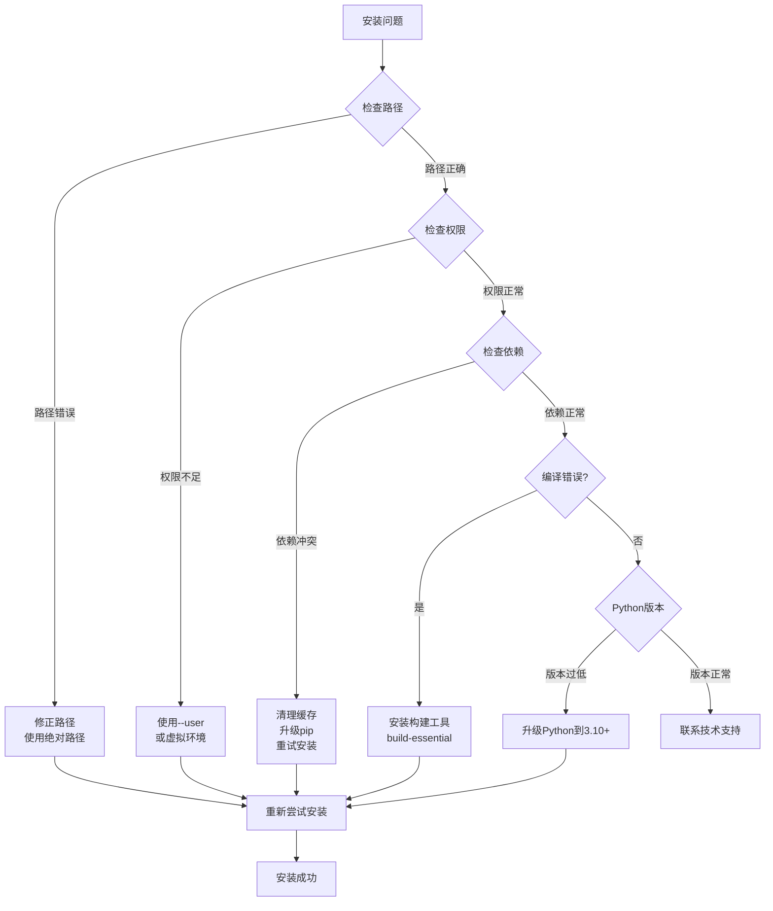
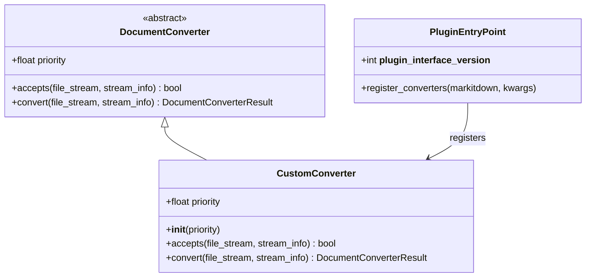

# 源码安装

<cite>
**本文档中引用的文件**
- [README.md](file://README.md)
- [packages/markitdown/pyproject.toml](file://packages/markitdown/pyproject.toml)
- [packages/markitdown/src/markitdown/__init__.py](file://packages/markitdown/src/markitdown/src/markitdown/__init__.py)
- [packages/markitdown/src/markitdown/__about__.py](file://packages/markitdown/src/markitdown/src/markitdown/__about__.py)
- [packages/markitdown-mcp/pyproject.toml](file://packages/markitdown-mcp/pyproject.toml)
- [packages/markitdown-sample-plugin/pyproject.toml](file://packages/markitdown-sample-plugin/pyproject.toml)
- [packages/markitdown-sample-plugin/README.md](file://packages/markitdown-sample-plugin/README.md)
- [Dockerfile](file://Dockerfile)
</cite>

## 目录
1. [简介](#简介)
2. [前置条件](#前置条件)
3. [项目结构概览](#项目结构概览)
4. [源码安装步骤](#源码安装步骤)
5. [可编辑安装详解](#可编辑安装详解)
6. [开发环境设置](#开发环境设置)
7. [依赖解析机制](#依赖解析机制)
8. [常见问题排查](#常见问题排查)
9. [最佳实践](#最佳实践)
10. [总结](#总结)

## 简介

MarkItDown是一个功能强大的Python工具，用于将各种文件格式转换为Markdown格式。本指南将详细介绍如何从源码安装MarkItDown，包括可编辑安装、开发环境配置以及常见问题的解决方案。

MarkItDown支持多种文件格式的转换，包括PDF、Word文档、PowerPoint、Excel、图像、音频、HTML等，是LLM和文本分析管道的理想选择。

## 前置条件

在开始源码安装之前，请确保您的系统满足以下要求：

### 系统要求
- **Python版本**: 3.10或更高版本
- **操作系统**: Windows、macOS或Linux
- **Git**: 用于克隆项目仓库
- **pip**: Python包管理器

### 推荐的开发工具
- **虚拟环境管理工具**: venv、uv或Anaconda
- **代码编辑器**: VS Code、PyCharm或其他Python IDE

## 项目结构概览

MarkItDown采用多包架构设计，主要包含以下核心组件：



**图表来源**
- [packages/markitdown/pyproject.toml](file://packages/markitdown/pyproject.toml#L1-L113)
- [packages/markitdown-mcp/pyproject.toml](file://packages/markitdown-mcp/pyproject.toml#L1-L70)
- [packages/markitdown-sample-plugin/pyproject.toml](file://packages/markitdown-sample-plugin/pyproject.toml#L1-L71)

**章节来源**
- [README.md](file://README.md#L1-L50)

## 源码安装步骤

### 第一步：克隆项目仓库

使用Git克隆MarkItDown项目到本地：

```bash
git clone git@github.com:microsoft/markitdown.git
cd markitdown
```

### 第二步：进入markitdown包目录

导航到主包目录：

```bash
cd packages/markitdown
```

### 第三步：执行可编辑安装

运行以下命令进行可编辑安装：

```bash
pip install -e '.[all]'
```

或者使用简化的形式：

```bash
pip install -e 'packages/markitdown[all]'
```

**重要提示**: 使用单引号包裹参数以避免shell转义问题。

### 安装过程详解



**图表来源**
- [packages/markitdown/pyproject.toml](file://packages/markitdown/pyproject.toml#L35-L50)
- [README.md](file://README.md#L70-L75)

**章节来源**
- [README.md](file://README.md#L70-L75)

## 可编辑安装详解

### 什么是可编辑安装？

可编辑安装（Editable Installation）是一种特殊的安装方式，它不会将包复制到Python的site-packages目录，而是创建一个指向源代码目录的符号链接。

### 可编辑安装的优势

1. **实时更新**: 修改源代码后无需重新安装即可生效
2. **调试便利**: 开发者可以直接在源代码中设置断点进行调试
3. **贡献友好**: 便于开发者对项目进行修改和贡献代码
4. **资源节省**: 不需要重复复制文件，节省磁盘空间

### 可编辑安装的工作原理



**图表来源**
- [packages/markitdown/pyproject.toml](file://packages/markitdown/pyproject.toml#L35-L50)

### 验证安装成功

安装完成后，可以通过以下方式验证：

```bash
# 检查MarkItDown版本
python -c "import markitdown; print(markitdown.__version__)"

# 检查命令行工具是否可用
markitdown --version

# 检查包是否为可编辑模式
python -c "import markitdown; print('Editable:', hasattr(markitdown, '__file__'))"
```

**章节来源**
- [packages/markitdown/src/markitdown/__about__.py](file://packages/markitdown/src/markitdown/src/markitdown/__about__.py#L4-L5)
- [packages/markitdown/src/markitdown/__init__.py](file://packages/markitdown/src/markitdown/src/markitdown/__init__.py#L1-L35)

## 开发环境设置

### 方法一：使用标准Python虚拟环境

```bash
# 创建虚拟环境
python -m venv .venv

# 激活虚拟环境
source .venv/bin/activate  # Linux/macOS
# 或
.venv\Scripts\activate     # Windows

# 安装MarkItDown（可编辑模式）
pip install -e 'packages/markitdown[all]'
```

### 方法二：使用uv虚拟环境

```bash
# 创建uv虚拟环境
uv venv --python=3.12 .venv

# 激活虚拟环境
source .venv/bin/activate

# 使用uv安装包
uv pip install -e 'packages/markitdown[all]'
```

### 方法三：使用Anaconda虚拟环境

```bash
# 创建Conda环境
conda create -n markitdown python=3.12

# 激活环境
conda activate markitdown

# 安装MarkItDown
pip install -e 'packages/markitdown[all]'
```

### 开发环境配置流程



**图表来源**
- [README.md](file://README.md#L41-L65)

**章节来源**
- [README.md](file://README.md#L41-L65)

## 依赖解析机制

### pyproject.toml配置详解

MarkItDown使用现代Python打包标准，通过`pyproject.toml`文件定义项目配置和依赖关系。

### 核心依赖配置



**图表来源**
- [packages/markitdown/pyproject.toml](file://packages/markitdown/pyproject.toml#L25-L50)

### 功能组依赖

MarkItDown将可选依赖组织为功能组，允许用户按需安装：

| 功能组 | 描述 | 包含的依赖 |
|--------|------|------------|
| `[all]` | 安装所有可选依赖 | 所有功能组的组合 |
| `[pptx]` | PowerPoint文件支持 | python-pptx |
| `[docx]` | Word文档支持 | mammoth, lxml |
| `[xlsx]` | Excel文件支持 | pandas, openpyxl |
| `[xls]` | 旧版Excel支持 | pandas, xlrd |
| `[pdf]` | PDF文件支持 | pdfminer.six |
| `[outlook]` | Outlook消息支持 | olefile |
| `[audio-transcription]` | 音频转录支持 | pydub, SpeechRecognition |
| `[youtube-transcription]` | YouTube字幕支持 | youtube-transcript-api |
| `[az-doc-intel]` | Azure文档智能支持 | azure-ai-documentintelligence, azure-identity |

### 依赖解析流程



**图表来源**
- [packages/markitdown/pyproject.toml](file://packages/markitdown/pyproject.toml#L35-L50)

**章节来源**
- [packages/markitdown/pyproject.toml](file://packages/markitdown/pyproject.toml#L25-L50)

## 常见问题排查

### 路径错误问题

**问题描述**: 安装时出现路径相关的错误

**常见原因和解决方案**:

1. **相对路径问题**
   ```bash
   # 错误做法
   pip install -e packages/markitdown[all]
   
   # 正确做法
   cd packages/markitdown
   pip install -e '.[all]'
   ```

2. **特殊字符路径**
   ```bash
   # 避免包含空格或特殊字符的路径
   # 错误: /Users/My Documents/markitdown
   # 正确: /Users/MyDocuments/markitdown
   ```

### 依赖冲突问题

**问题描述**: 安装过程中出现依赖版本冲突

**排查步骤**:

```bash
# 检查当前Python版本
python --version

# 检查pip版本
pip --version

# 清理pip缓存
pip cache purge

# 升级pip
pip install --upgrade pip
```

### 权限问题

**问题描述**: 安装时出现权限错误

**解决方案**:

```bash
# 使用用户安装模式
pip install --user -e '.[all]'

# 或者在虚拟环境中安装
python -m venv myenv
source myenv/bin/activate
pip install -e '.[all]'
```

### 编译错误问题

**问题描述**: 某些依赖需要编译C扩展

**常见解决方案**:

```bash
# 安装必要的构建工具
# Ubuntu/Debian
sudo apt-get install build-essential python3-dev

# CentOS/RHEL
sudo yum install gcc python3-devel

# macOS
xcode-select --install
```

### 故障排除流程图



**章节来源**
- [packages/markitdown/src/markitdown/_exceptions.py](file://packages/markitdown/src/markitdown/src/markitdown/_exceptions.py#L1-L44)

## 最佳实践

### 开发工作流建议

1. **分支管理**
   ```bash
   # 创建功能分支
   git checkout -b feature/new-converter
   
   # 安装开发版本
   pip install -e '.[all]'
   
   # 进行开发和测试
   # ...
   
   # 提交更改
   git add .
   git commit -m "Add new converter support"
   ```

2. **测试策略**
   ```bash
   # 运行单元测试
   hatch test
   
   # 运行类型检查
   hatch env create types
   hatch env run types check
   
   # 运行覆盖率测试
   coverage run -m pytest
   coverage report
   ```

3. **代码质量**
   ```bash
   # 运行预提交检查
   pre-commit run --all-files
   
   # 格式化代码
   black .
   isort .
   ```

### 插件开发最佳实践

根据示例插件的结构，以下是开发自定义插件的最佳实践：



**图表来源**
- [packages/markitdown-sample-plugin/README.md](file://packages/markitdown-sample-plugin/README.md#L15-L45)

### 性能优化建议

1. **按需安装依赖**
   ```bash
   # 只安装需要的功能
   pip install 'markitdown[pdf,docx]'
   ```

2. **使用虚拟环境隔离**
   ```bash
   # 为不同项目创建独立环境
   python -m venv markitdown-dev
   source markitdown-dev/bin/activate
   pip install -e '.[all]'
   ```

3. **缓存和性能监控**
   ```python
   from markitdown import MarkItDown
   
   # 启用插件提高性能
   md = MarkItDown(enable_plugins=True)
   
   # 性能监控
   import time
   start_time = time.time()
   result = md.convert("large_file.pdf")
   print(f"Conversion took {time.time() - start_time:.2f} seconds")
   ```

**章节来源**
- [packages/markitdown-sample-plugin/README.md](file://packages/markitdown-sample-plugin/README.md#L60-L85)

## 总结

通过本指南，您已经掌握了MarkItDown的源码安装方法，包括：

1. **完整的安装流程**: 从克隆仓库到可编辑安装的每一步
2. **开发环境配置**: 多种虚拟环境管理工具的选择和配置
3. **依赖解析机制**: 理解pyproject.toml的配置和功能组依赖
4. **问题排查技巧**: 常见问题的诊断和解决方案
5. **最佳实践**: 开发工作流和性能优化建议

### 关键要点回顾

- 使用`pip install -e '.[all]'`进行可编辑安装
- 推荐使用虚拟环境避免依赖冲突
- 理解功能组依赖，按需安装所需功能
- 遵循最佳实践提高开发效率
- 掌握故障排除技能应对常见问题

### 下一步行动

1. 尝试使用MarkItDown进行文件转换
2. 探索插件开发可能性
3. 贡献代码或报告问题
4. 深入学习项目架构和设计模式

通过掌握这些技能，您将能够有效地使用、开发和贡献MarkItDown项目，为文档转换和文本分析领域做出贡献。