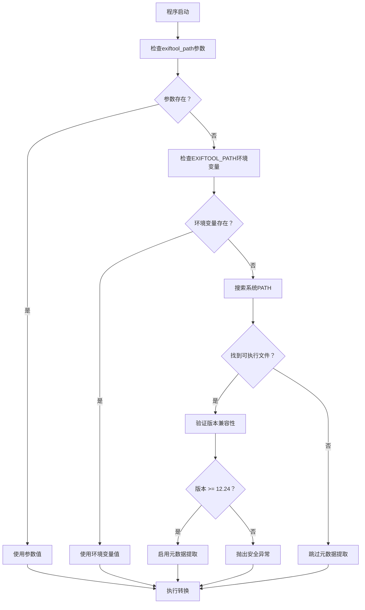
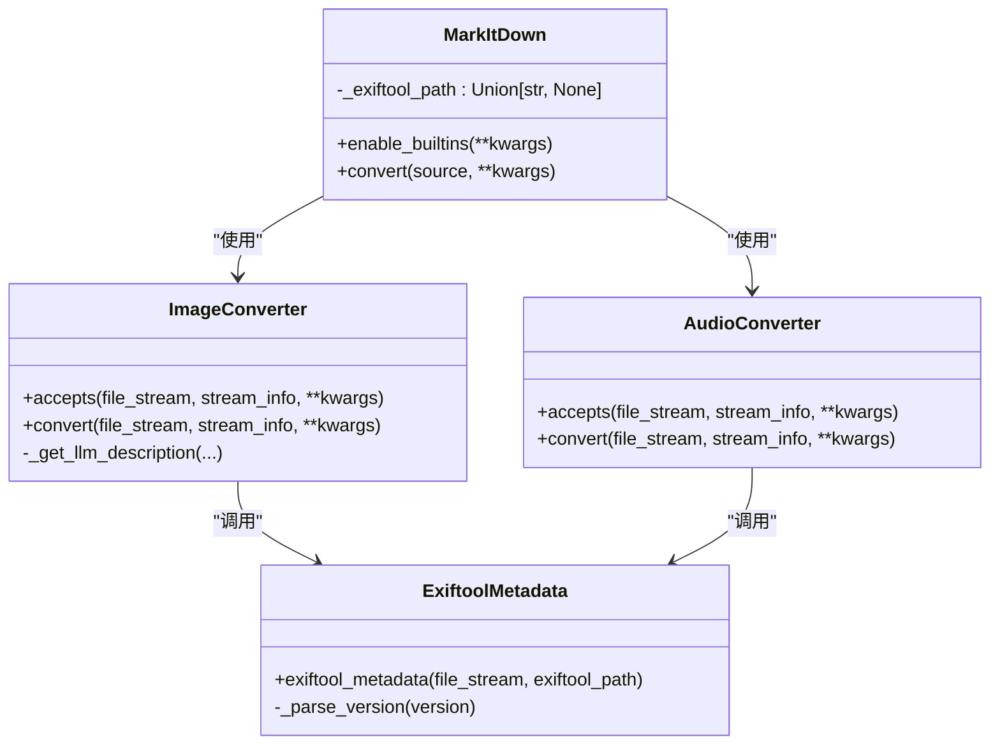
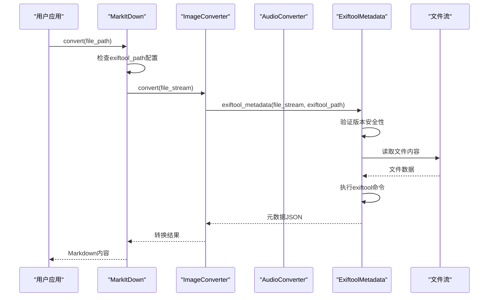
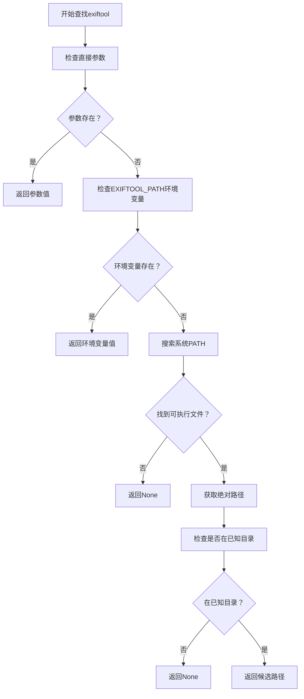
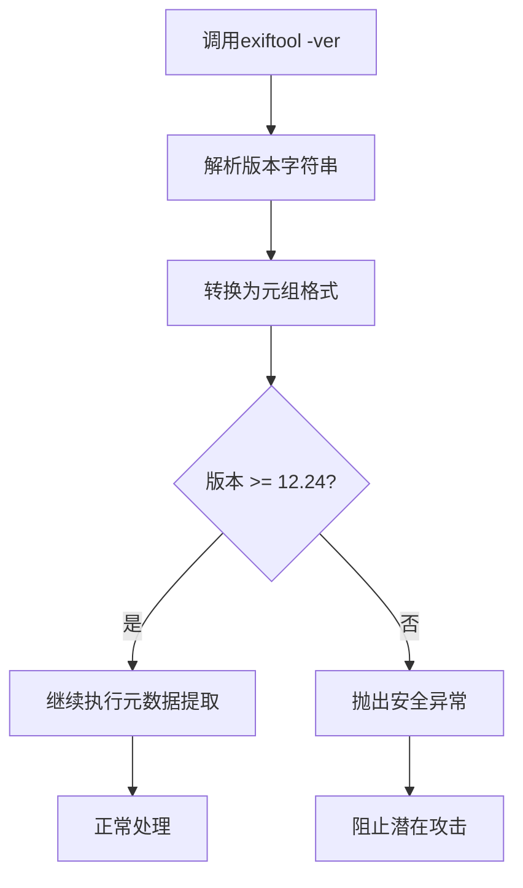
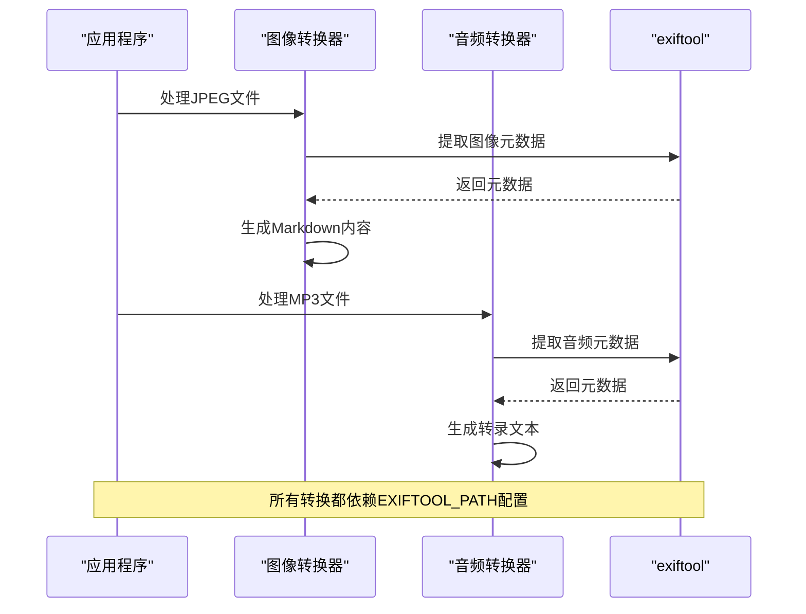

# 环境变量配置

<cite>
**本文档中引用的文件**
- [_markitdown.py](file://packages/markitdown/src/markitdown/_markitdown.py)
- [_exiftool.py](file://packages/markitdown/src/markitdown/converters/_exiftool.py)
- [_image_converter.py](file://packages/markitdown/src/markitdown/converters/_image_converter.py)
- [_audio_converter.py](file://packages/markitdown/src/markitdown/converters/_audio_converter.py)
- [test_module_misc.py](file://packages/markitdown/tests/test_module_misc.py)
</cite>

## 目录
1. [简介](#简介)
2. [EXIFTOOL_PATH环境变量概述](#exiftool_path环境变量概述)
3. [系统架构分析](#系统架构分析)
4. [环境变量读取机制](#环境变量读取机制)
5. [跨平台配置指南](#跨平台配置指南)
6. [版本安全检查](#版本安全检查)
7. [使用场景分析](#使用场景分析)
8. [故障排除](#故障排除)
9. [最佳实践](#最佳实践)

## 简介

markitdown是一个强大的Python包，能够将各种文件格式转换为Markdown。为了支持图像和音频文件的元数据提取功能，系统依赖于第三方工具exiftool。EXIFTOOL_PATH环境变量是配置exiftool可执行文件位置的关键机制，确保程序能够在不同操作系统和部署环境中正确运行。

## EXIFTOOL_PATH环境变量概述

### 核心作用

EXIFTOOL_PATH环境变量的主要作用是指定exiftool可执行文件的完整路径，用于：
- 图像文件的元数据提取（如尺寸、标题、描述等）
- 音频文件的元数据提取（如艺术家、专辑、采样率等）
- 安全的版本验证检查
- 跨平台兼容性支持

### 技术实现原理



**图表来源**
- [_markitdown.py](file://packages/markitdown/src/markitdown/_markitdown.py#L146-L168)

## 系统架构分析

### 核心组件关系



**图表来源**
- [_markitdown.py](file://packages/markitdown/src/markitdown/_markitdown.py#L106-L147)
- [_image_converter.py](file://packages/markitdown/src/markitdown/converters/_image_converter.py#L15-L40)
- [_audio_converter.py](file://packages/markitdown/src/markitdown/converters/_audio_converter.py#L20-L45)

### 数据流处理



**图表来源**
- [_markitdown.py](file://packages/markitdown/src/markitdown/_markitdown.py#L560-L588)
- [_exiftool.py](file://packages/markitdown/src/markitdown/converters/_exiftool.py#L10-L51)

**章节来源**
- [_markitdown.py](file://packages/markitdown/src/markitdown/_markitdown.py#L106-L168)
- [_exiftool.py](file://packages/markitdown/src/markitdown/converters/_exiftool.py#L10-L51)

## 环境变量读取机制

### 配置优先级

markitdown采用多层配置策略，按以下优先级顺序查找exiftool：

1. **直接参数传递**：通过`MarkItDown(exiftool_path="/path/to/exiftool")`
2. **环境变量**：通过`os.getenv("EXIFTOOL_PATH")`
3. **系统PATH**：通过`shutil.which("exiftool")`
4. **默认行为**：不执行元数据提取

### 自动发现机制



**图表来源**
- [_markitdown.py](file://packages/markitdown/src/markitdown/_markitdown.py#L146-L168)

### 已知安装路径检测

系统会自动检测以下常见安装位置：

| 平台 | 常见路径 |
|------|----------|
| **Unix/Linux** | `/usr/bin`, `/usr/local/bin`, `/opt`, `/opt/bin`, `/opt/local/bin`, `/opt/homebrew/bin` |
| **macOS** | `/opt/homebrew/bin` (Homebrew), `/usr/bin`, `/usr/local/bin` |
| **Windows** | `C:\Windows\System32`, `C:\Program Files`, `C:\Program Files (x86)` |

**章节来源**
- [_markitdown.py](file://packages/markitdown/src/markitdown/_markitdown.py#L146-L168)

## 跨平台配置指南

### Windows系统配置

#### 方法一：PowerShell（当前会话）
```powershell
# 设置临时环境变量
$env:EXIFTOOL_PATH = "C:\Program Files\ExifTool\exiftool.exe"

# 验证设置
echo $env:EXIFTOOL_PATH
```

#### 方法二：PowerShell（永久）
```powershell
# 永久设置到用户环境变量
[Environment]::SetEnvironmentVariable("EXIFTOOL_PATH", "C:\Program Files\ExifTool\exiftool.exe", "User")

# 永久设置到系统环境变量
[Environment]::SetEnvironmentVariable("EXIFTOOL_PATH", "C:\Program Files\ExifTool\exiftool.exe", "Machine")
```

#### 方法三：系统设置界面
1. 右键"此电脑" → 属性 → 高级系统设置
2. 点击"环境变量"
3. 在"系统变量"或"用户变量"中添加：
   - 变量名：`EXIFTOOL_PATH`
   - 变量值：`C:\Program Files\ExifTool\exiftool.exe`

### macOS系统配置

#### 方法一：终端（当前会话）
```bash
# 设置临时环境变量
export EXIFTOOL_PATH=/opt/homebrew/bin/exiftool

# 验证设置
echo $EXIFTOOL_PATH
```

#### 方法二：配置文件（永久）

**Bash Shell** (`~/.bash_profile` 或 `~/.bashrc`)：
```bash
export EXIFTOOL_PATH=/opt/homebrew/bin/exiftool
```

**Zsh Shell** (`~/.zshrc`)：
```bash
export EXIFTOOL_PATH=/opt/homebrew/bin/exiftool
```

#### 方法三：系统偏好设置
1. 打开"系统设置" → "用户与群组"
2. 选择用户 → "登录选项"
3. 添加脚本到"登录项"

### Linux系统配置

#### 方法一：终端（当前会话）
```bash
# 设置临时环境变量
export EXIFTOOL_PATH=/usr/bin/exiftool

# 验证设置
echo $EXIFTOOL_PATH
```

#### 方法二：配置文件（永久）

**全局配置** (`/etc/environment`)：
```bash
EXIFTOOL_PATH=/usr/bin/exiftool
```

**用户配置** (`~/.profile`, `~/.bash_profile`)：
```bash
export EXIFTOOL_PATH=/usr/bin/exiftool
```

#### 方法三：systemd服务配置
```bash
# 创建服务文件
sudo tee /etc/systemd/system/markitdown.service << EOF
[Unit]
Description=MarkItDown Service
After=network.target

[Service]
Type=simple
User=youruser
Environment=EXIFTOOL_PATH=/usr/bin/exiftool
ExecStart=/usr/bin/python3 /path/to/your/script.py
Restart=on-failure

[Install]
WantedBy=multi-user.target
EOF

# 启用服务
sudo systemctl daemon-reload
sudo systemctl enable markitdown.service
```

**章节来源**
- [_markitdown.py](file://packages/markitdown/src/markitdown/_markitdown.py#L146-L168)

## 版本安全检查

### CVE-2021-22204漏洞背景

exiftool版本低于12.24存在严重的安全漏洞（CVE-2021-22204），可能导致远程代码执行。markitdown实现了严格的版本验证机制。

### 版本检查流程



**图表来源**
- [_exiftool.py](file://packages/markitdown/src/markitdown/converters/_exiftool.py#L18-L35)

### 版本验证实现

系统使用以下逻辑进行版本检查：
- 将版本字符串分割为数字部分
- 转换为整数元组进行比较
- 最小要求版本：12.24
- 支持的版本格式：12.24, 12.25, 13.0等

### 错误处理机制

当遇到版本问题时，系统会：
1. 显示清晰的安全警告信息
2. 阻止危险操作
3. 提供升级建议
4. 继续执行其他转换功能

**章节来源**
- [_exiftool.py](file://packages/markitdown/src/markitdown/converters/_exiftool.py#L18-L35)

## 使用场景分析

### 图像文件元数据提取

图像转换器利用exiftool提取以下信息：

| 元数据字段 | 描述 | 示例值 |
|------------|------|--------|
| `ImageSize` | 图像尺寸 | `1920x1080` |
| `Title` | 标题 | `"风景照片"` |
| `Caption` | 描述 | `"日落时分的海滩"` |
| `Keywords` | 关键词标签 | `"海滩, 日落, 风景"` |
| `Artist` | 艺术家 | `"张三"` |
| `DateTimeOriginal` | 创建时间 | `"2024:01:15 14:30:25"` |
| `GPSPosition` | 地理位置 | `"39.9042° N, 116.4074° E"` |

### 音频文件元数据提取

音频转换器提取以下信息：

| 元数据字段 | 描述 | 示例值 |
|------------|------|--------|
| `Title` | 音乐标题 | `"夜曲 Op.9 No.2"` |
| `Artist` | 艺术家 | `"贝多芬"` |
| `Album` | 专辑名称 | `"钢琴奏鸣曲集"` |
| `Genre` | 音乐类型 | `"古典音乐"` |
| `Track` | 曲目编号 | `"2"` |
| `NumChannels` | 声道数 | `"2"` |
| `SampleRate` | 采样率 | `"44100 Hz"` |
| `BitsPerSample` | 位深度 | `"16"` |

### 多媒体文件处理流程



**图表来源**
- [_image_converter.py](file://packages/markitdown/src/markitdown/converters/_image_converter.py#L35-L45)
- [_audio_converter.py](file://packages/markitdown/src/markitdown/converters/_audio_converter.py#L53-L75)

**章节来源**
- [_image_converter.py](file://packages/markitdown/src/markitdown/converters/_image_converter.py#L35-L45)
- [_audio_converter.py](file://packages/markitdown/src/markitdown/converters/_audio_converter.py#L53-L75)

## 故障排除

### 常见问题及解决方案

#### 1. exiftool未找到错误

**症状**：程序无法定位exiftool可执行文件

**诊断步骤**：
```python
import shutil
import os

# 检查系统PATH中是否存在
print("在PATH中找到:", shutil.which("exiftool"))

# 检查环境变量
print("EXIFTOOL_PATH:", os.getenv("EXIFTOOL_PATH"))

# 检查已知路径
known_paths = [
    "/usr/bin", "/usr/local/bin", "/opt", "/opt/bin", 
    "/opt/local/bin", "/opt/homebrew/bin",
    "C:\\Windows\\System32", "C:\\Program Files", 
    "C:\\Program Files (x86)"
]
for path in known_paths:
    print(f"检查路径 {path}: {'存在' if os.path.exists(path) else '不存在'}")
```

**解决方案**：
- 安装exiftool到系统PATH
- 设置正确的EXIFTOOL_PATH环境变量
- 使用相对路径或绝对路径直接指定

#### 2. 版本安全警告

**症状**：收到"版本过于老旧"的安全警告

**解决方案**：
```bash
# 检查当前版本
exiftool -ver

# 升级到最新版本
# Ubuntu/Debian
sudo apt update && sudo apt install libimage-exiftool-perl

# macOS (Homebrew)
brew install exiftool

# Windows
# 下载最新版本：https://exiftool.org/
```

#### 3. 权限问题

**症状**：无法执行exiftool可执行文件

**解决方案**：
```bash
# 检查文件权限
ls -la /path/to/exiftool

# 添加执行权限（Linux/macOS）
chmod +x /path/to/exiftool

# Windows无需特殊权限设置
```

#### 4. 编码问题

**症状**：元数据包含非ASCII字符时出现编码错误

**解决方案**：
系统自动使用`locale.getpreferredencoding()`处理编码问题，通常无需额外配置。

### 调试技巧

#### 启用详细日志
```python
import logging
logging.basicConfig(level=logging.DEBUG)

# 测试exiftool配置
from markitdown import MarkItDown
import os

# 设置调试环境变量
os.environ["EXIFTOOL_PATH"] = "/path/to/exiftool"

# 创建实例并测试
md = MarkItDown()
print("exiftool_path:", md._exiftool_path)

# 测试转换
try:
    result = md.convert("test.jpg")
    print("转换成功")
except Exception as e:
    print(f"转换失败: {e}")
```

#### 验证环境配置
```python
import subprocess
import os

def test_exiftool_config():
    exiftool_path = os.getenv("EXIFTOOL_PATH")
    if not exiftool_path:
        print("EXIFTOOL_PATH未设置")
        return False
    
    try:
        # 测试可执行性
        result = subprocess.run([exiftool_path, "-ver"], 
                             capture_output=True, text=True, timeout=5)
        if result.returncode != 0:
            print(f"exiftool执行失败: {result.stderr}")
            return False
        
        version = result.stdout.strip()
        print(f"exiftool版本: {version}")
        
        # 版本检查
        major, minor = map(int, version.split('.')[:2])
        if (major, minor) < (12, 24):
            print(f"警告: 版本{version}可能不安全")
            return False
            
        return True
        
    except Exception as e:
        print(f"测试失败: {e}")
        return False

test_exiftool_config()
```

**章节来源**
- [_exiftool.py](file://packages/markitdown/src/markitdown/converters/_exiftool.py#L18-L35)
- [test_module_misc.py](file://packages/markitdown/tests/test_module_misc.py#L351-L384)

## 最佳实践

### 部署环境配置

#### 开发环境
```python
# 推荐的开发配置
from markitdown import MarkItDown

# 1. 使用环境变量（推荐）
import os
md = MarkItDown()

# 2. 显式指定路径（适用于特定项目）
md = MarkItDown(exiftool_path="/usr/local/bin/exiftool")

# 3. 运行时动态设置
import os
os.environ["EXIFTOOL_PATH"] = "/path/to/exiftool"
```

#### 生产环境
```python
# Docker容器配置
ENV EXIFTOOL_PATH=/usr/bin/exiftool

# Kubernetes配置
apiVersion: v1
kind: ConfigMap
metadata:
  name: markitdown-config
data:
  EXIFTOOL_PATH: /usr/bin/exiftool

# 应用程序配置
import os
exiftool_path = os.getenv("EXIFTOOL_PATH", "/usr/bin/exiftool")
md = MarkItDown(exiftool_path=exiftool_path)
```

### 性能优化建议

#### 1. 路径缓存
```python
# 避免重复查找
import shutil
import os

# 缓存exiftool路径
cached_exiftool_path = None

def get_exiftool_path():
    global cached_exiftool_path
    if cached_exiftool_path is None:
        path = os.getenv("EXIFTOOL_PATH")
        if not path:
            path = shutil.which("exiftool")
        cached_exiftool_path = path
    return cached_exiftool_path

# 使用缓存的路径
md = MarkItDown(exiftool_path=get_exiftool_path())
```

#### 2. 异常处理
```python
from markitdown import MarkItDown
from markitdown._exceptions import MarkItDownException

def safe_convert(file_path):
    try:
        md = MarkItDown()
        result = md.convert(file_path)
        return result.text_content
    except MarkItDownException as e:
        print(f"转换失败: {e}")
        # 回退到基本转换
        return f"[文件: {file_path}]"
```

### 安全考虑

#### 1. 版本验证
始终确保使用安全版本的exiftool（≥12.24）

#### 2. 路径验证
避免使用用户输入直接构造路径，防止路径遍历攻击

#### 3. 权限控制
在生产环境中限制exiftool的访问权限

#### 4. 资源限制
对文件大小和处理时间设置合理的限制

### 监控和维护

#### 1. 版本监控
```python
def monitor_exiftool_version():
    import subprocess
    try:
        result = subprocess.run(["exiftool", "-ver"], 
                             capture_output=True, text=True, timeout=10)
        version = result.stdout.strip()
        return {
            "version": version,
            "is_secure": tuple(map(int, version.split('.'))) >= (12, 24)
        }
    except Exception:
        return {"error": "无法检测版本"}
```

#### 2. 性能指标
```python
import time
from functools import wraps

def measure_performance(func):
    @wraps(func)
    def wrapper(*args, **kwargs):
        start_time = time.time()
        result = func(*args, **kwargs)
        end_time = time.time()
        print(f"{func.__name__} 耗时: {end_time - start_time:.2f}秒")
        return result
    return wrapper

@measure_performance
def convert_with_monitoring(file_path):
    md = MarkItDown()
    return md.convert(file_path)
```

通过遵循这些最佳实践，可以确保markitdown环境变量配置的安全性、可靠性和性能优化。