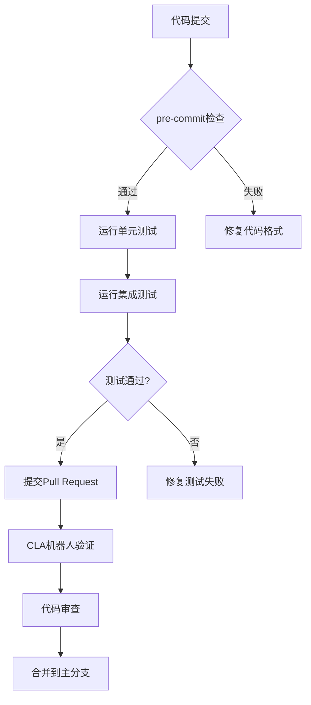
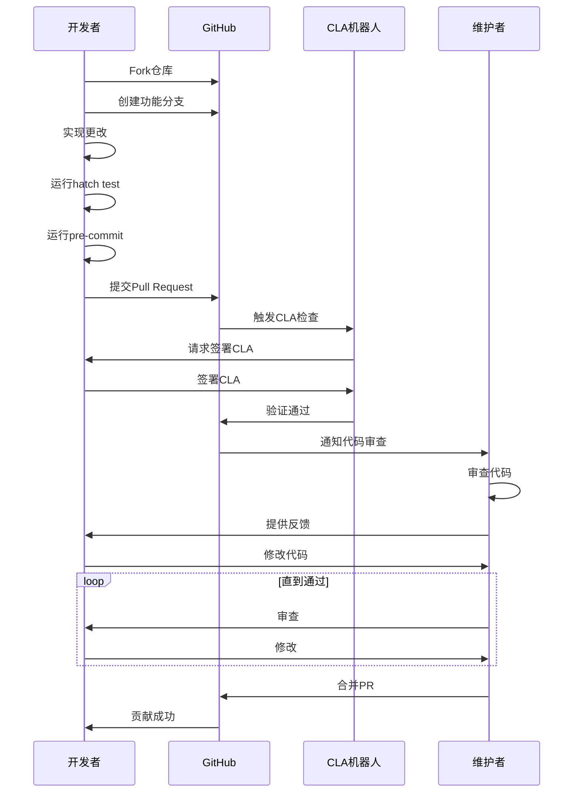
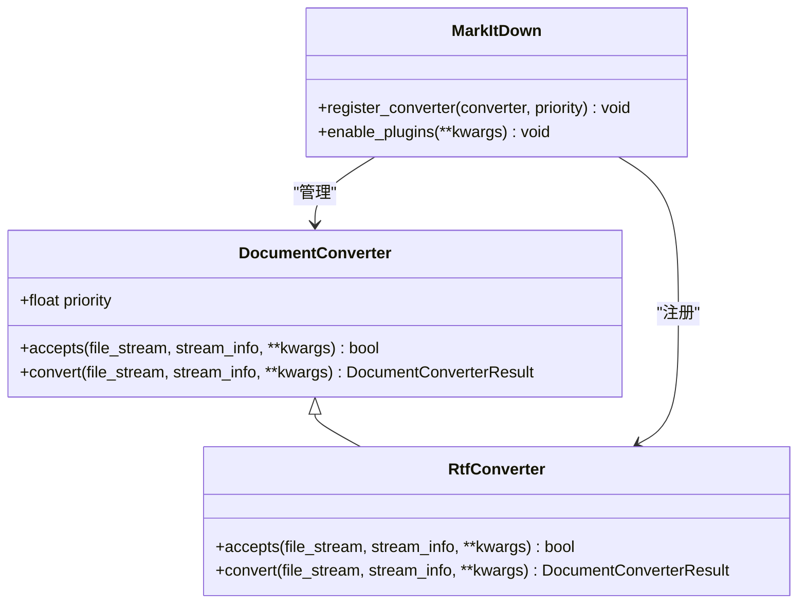

# 开发者指南

<cite>
**本文档中引用的文件**  
- [README.md](file://README.md)
- [SECURITY.md](file://SECURITY.md)
- [SUPPORT.md](file://SUPPORT.md)
- [CODE_OF_CONDUCT.md](file://CODE_OF_CONDUCT.md)
- [pyproject.toml](file://packages/markitdown/pyproject.toml)
- [__init__.py](file://packages/markitdown/src/markitdown/__init__.py)
- [_markitdown.py](file://packages/markitdown/src/markitdown/_markitdown.py)
- [test_module_vectors.py](file://packages/markitdown/tests/test_module_vectors.py)
- [test_cli_vectors.py](file://packages/markitdown/tests/test_cli_vectors.py)
- [_test_vectors.py](file://packages/markitdown/tests/_test_vectors.py)
- [markitdown-sample-plugin/README.md](file://packages/markitdown-sample-plugin/README.md)
- [markitdown-sample-plugin/_plugin.py](file://packages/markitdown-sample-plugin/src/markitdown_sample_plugin/_plugin.py)
- [LICENSE](file://LICENSE)
</cite>

## 目录
1. [简介](#简介)
2. [开发环境设置](#开发环境设置)
3. [运行测试和预提交检查](#运行测试和预提交检查)
4. [代码规范和测试策略](#代码规范和测试策略)
5. [安全政策](#安全政策)
6. [支持信息](#支持信息)
7. [版本发布流程和版本控制策略](#版本发布流程和版本控制策略)
8. [行为准则](#行为准则)
9. [贡献流程](#贡献流程)
10. [插件开发指南](#插件开发指南)

## 简介

MarkItDown 是一个轻量级的 Python 工具，用于将各种文件转换为 Markdown 格式，适用于 LLM（大型语言模型）和相关文本分析管道。该项目旨在为开发者提供一个清晰的贡献路线图，包括如何设置开发环境、运行测试、执行预提交检查、遵循代码规范、报告安全漏洞以及如何为社区做出贡献。

本指南将详细介绍开发者如何参与 MarkItDown 项目的开发，从环境配置到代码贡献的完整流程。项目支持多种文件格式的转换，包括 PDF、PowerPoint、Word、Excel、图像、音频、HTML 等，并提供了插件系统以扩展功能。

**Section sources**
- [README.md](file://README.md#L1-L248)

## 开发环境设置

要开始为 MarkItDown 贡献代码，首先需要设置开发环境。项目要求 Python 3.10 或更高版本。建议使用虚拟环境以避免依赖冲突。

### 创建虚拟环境

您可以使用标准 Python 安装创建和激活虚拟环境：

```bash
python -m venv .venv
source .venv/bin/activate
```

如果您使用 `uv`，可以使用以下命令创建虚拟环境：

```bash
uv venv --python=3.12 .venv
source .venv/bin/activate
# 注意：在此虚拟环境中使用 'uv pip install' 而不是 'pip install' 来安装包
```

如果您使用 Anaconda，可以使用以下命令：

```bash
conda create -n markitdown python=3.12
conda activate markitdown
```

### 安装 Hatch

MarkItDown 使用 Hatch 作为其构建和测试工具。在设置好虚拟环境后，安装 Hatch：

```bash
pip install hatch
```

您也可以通过其他方式安装 Hatch，详情请参阅 [Hatch 官方文档](https://hatch.pypa.io/dev/install/)。

### 进入 Hatch Shell

安装 Hatch 后，进入 Hatch shell 环境：

```bash
cd packages/markitdown
hatch shell
```

这将激活一个包含所有必要依赖项的开发环境。

**Section sources**
- [README.md](file://README.md#L205-L239)
- [pyproject.toml](file://packages/markitdown/pyproject.toml#L1-L112)

## 运行测试和预提交检查

MarkItDown 项目使用 Hatch 和 pre-commit 来管理测试和代码质量检查。

### 运行测试

在进入 Hatch shell 后，可以使用以下命令运行测试：

```bash
hatch test
```

测试包括单元测试和集成测试，覆盖了各种文件格式的转换功能。测试文件位于 `packages/markitdown/tests` 目录下，包括测试向量和测试用例。

您也可以使用 Devcontainer，其中已安装所有依赖项：

```bash
# 在 Devcontainer 中重新打开项目并运行：
hatch test
```

### 执行预提交检查

在提交 Pull Request 之前，运行 pre-commit 检查以确保代码质量：

```bash
pre-commit run --all-files
```

这将运行一系列代码格式化和静态分析工具，确保代码符合项目规范。

**Section sources**
- [README.md](file://README.md#L205-L239)
- [test_module_vectors.py](file://packages/markitdown/tests/test_module_vectors.py#L0-L199)
- [test_cli_vectors.py](file://packages/markitdown/tests/test_cli_vectors.py#L0-L44)

## 代码规范和测试策略

MarkItDown 项目遵循严格的代码规范和测试策略，以确保代码质量和稳定性。

### 代码规范

项目使用 pre-commit 钩子来强制执行代码格式化和静态分析。主要工具包括：

- **Black**: 用于代码格式化
- **isort**: 用于导入排序
- **flake8**: 用于代码风格检查
- **mypy**: 用于类型检查

这些工具在 `pre-commit run --all-files` 命令中自动运行，确保所有提交的代码都符合规范。

### 测试策略

MarkItDown 采用全面的测试策略，包括：

- **单元测试**: 测试各个转换器的独立功能
- **集成测试**: 测试整个转换流程
- **测试向量**: 使用预定义的测试文件验证转换结果

测试向量定义在 `_test_vectors.py` 文件中，包含各种文件格式的测试用例，确保转换结果包含预期内容且不包含不应有的内容。



**Diagram sources**
- [pyproject.toml](file://packages/markitdown/pyproject.toml#L91-L111)
- [_test_vectors.py](file://packages/markitdown/tests/_test_vectors.py#L0-L54)

**Section sources**
- [pyproject.toml](file://packages/markitdown/pyproject.toml#L91-L111)
- [_test_vectors.py](file://packages/markitdown/tests/_test_vectors.py#L0-L54)

## 安全政策

MarkItDown 项目高度重视安全性。如果您发现任何安全漏洞，请按照以下流程报告。

### 报告安全问题

**请勿通过公共 GitHub issues 报告安全漏洞。**

请通过以下方式报告安全问题：

- **Microsoft Security Response Center (MSRC)**: [https://msrc.microsoft.com/create-report](https://aka.ms/security.md/msrc/create-report)
- **电子邮件**: [secure@microsoft.com](mailto:secure@microsoft.com)

如果可能，请使用我们的 PGP 密钥加密您的消息。PGP 密钥可从 [Microsoft Security Response Center PGP Key page](https://aka.ms/security.md/msrc/pgp) 下载。

您应在 24 小时内收到回复。如果未收到回复，请通过邮件跟进以确保我们收到了您的原始消息。

报告时请包含以下信息（尽可能提供）：
- 问题类型（如缓冲区溢出、SQL 注入、跨站脚本等）
- 相关源代码文件的完整路径
- 受影响源代码的位置（标签/分支/提交或直接 URL）
- 重现问题所需的特殊配置
- 逐步重现问题的说明
- 概念验证或利用代码（如果可能）
- 问题的影响，包括攻击者可能如何利用该问题

**Section sources**
- [SECURITY.md](file://SECURITY.md#L0-L41)

## 支持信息

如果您在使用 MarkItDown 时遇到问题或需要帮助，请通过以下方式寻求支持。

### 提交问题和获取帮助

本项目使用 GitHub Issues 来跟踪错误和功能请求。在提交新问题之前，请先搜索现有问题以避免重复。对于新问题，请将您的错误或功能请求作为新 Issue 提交。

对于使用本项目的问题和疑问，请通过 GitHub Issues 与项目所有者或社区互动以获得帮助。

### Microsoft 支持政策

对本项目的支持仅限于上述列出的资源。

**Section sources**
- [SUPPORT.md](file://SUPPORT.md#L0-L25)

## 版本发布流程和版本控制策略

MarkItDown 项目遵循语义化版本控制（Semantic Versioning）策略，确保版本号清晰地传达变更的性质。

### 版本号格式

版本号采用 `MAJOR.MINOR.PATCH` 格式：
- **MAJOR**: 当进行不兼容的 API 更改时递增
- **MINOR**: 当以向后兼容的方式添加功能时递增
- **PATCH**: 当进行向后兼容的错误修复时递增

### 发布流程

1. 确认所有测试通过
2. 更新版本号（在 `src/markitdown/__about__.py` 中）
3. 创建发布分支
4. 提交版本变更
5. 创建 Pull Request 并进行代码审查
6. 合并到主分支
7. 创建 GitHub Release
8. 发布到 PyPI

### 版本控制

项目使用 Git 进行版本控制，主分支为 `main`。所有功能开发应在功能分支上进行，然后通过 Pull Request 合并到主分支。

**Section sources**
- [pyproject.toml](file://packages/markitdown/pyproject.toml#L1-L112)
- [__init__.py](file://packages/markitdown/src/markitdown/__init__.py#L0-L34)

## 行为准则

本项目已采用 [Microsoft Open Source Code of Conduct](https://opensource.microsoft.com/codeofconduct/)。我们致力于为所有贡献者创造一个开放和包容的环境。

### 我们的承诺

作为贡献者和维护者，我们承诺营造一个没有骚扰现象的无偏见的社区。骚扰包括但不限于：
- 与性别、性别认同和表达、性取向、残疾、外貌、体型、种族、年龄、宗教等相关的攻击性口头评论
- 公共场合的性形象
- 挑衅或不受欢迎的性关注
- 跟踪或摄影
- 持续的私人消息
- 扰乱会议或其他在线活动

### 报告违反行为准则

如果您遇到或目睹违反行为准则的行为，请联系 [opencode@microsoft.com](mailto:opencode@microsoft.com)。我们认真对待所有报告，并将保密处理。

**Section sources**
- [CODE_OF_CONDUCT.md](file://CODE_OF_CONDUCT.md#L0-L9)

## 贡献流程

我们欢迎所有贡献和建议。大多数贡献需要您同意贡献者许可协议（CLA），声明您有权并确实授予我们使用您贡献的权利。

### 如何贡献

您可以通过以下方式帮助我们：
- 查看问题
- 帮助审查 PR
- 修复 bug
- 添加新功能
- 改进文档

我们标记了一些 "open for contribution" 和 "open for reviewing" 的问题和 PR，以帮助促进社区贡献。

<div align="center">

|            | 所有                                                          | 社区特别需要帮助                                                                                                      |
| ---------- | ------------------------------------------------------------ | ----------------------------------------------------------------------------------------------------------------------------------------- |
| **问题** | [所有问题](https://github.com/microsoft/markitdown/issues) | [开放贡献的问题](https://github.com/microsoft/markitdown/issues?q=is%3Aissue+is%3Aopen+label%3A%22open+for+contribution%22) |
| **PR**    | [所有PR](https://github.com/microsoft/markitdown/pulls)     | [开放审查的PR](https://github.com/microsoft/markitdown/pulls?q=is%3Apr+is%3Aopen+label%3A%22open+for+reviewing%22)              |

</div>

### 贡献步骤

1. Fork 仓库
2. 创建功能分支
3. 实现您的更改
4. 运行测试和预提交检查
5. 提交 Pull Request
6. 等待 CLA 机器人验证
7. 参与代码审查
8. 合并到主分支



**Diagram sources**
- [README.md](file://README.md#L150-L239)

**Section sources**
- [README.md](file://README.md#L150-L239)

## 插件开发指南

MarkItDown 支持第三方插件，允许开发者扩展其功能。

### 创建插件

要创建插件，请参考 `packages/markitdown-sample-plugin` 中的示例。主要步骤包括：

1. 实现自定义 `DocumentConverter`
2. 实现 `register_converters` 函数
3. 在 `pyproject.toml` 中创建入口点

### 插件接口

插件必须实现以下接口：

```python
__plugin_interface_version__ = 1  # 当前支持的唯一版本

def register_converters(markitdown: MarkItDown, **kwargs):
    """
    在 MarkItDown 实例创建期间调用，用于注册插件提供的转换器。
    """
    # 创建并注册转换器实例
    markitdown.register_converter(MyCustomConverter())
```

### 安装和使用插件

要使用插件，必须先安装它：

```bash
pip install -e .
```

然后通过以下方式验证插件是否可用：

```bash
markitdown --list-plugins
```

使用插件进行转换：

```bash
markitdown --use-plugins path-to-file.rtf
```

在 Python 中启用插件：

```python
from markitdown import MarkItDown

md = MarkItDown(enable_plugins=True) 
result = md.convert("path-to-file.rtf")
print(result.text_content)
```



**Diagram sources**
- [markitdown-sample-plugin/README.md](file://packages/markitdown-sample-plugin/README.md#L0-L111)
- [markitdown-sample-plugin/_plugin.py](file://packages/markitdown-sample-plugin/src/markitdown_sample_plugin/_plugin.py#L0-L71)

**Section sources**
- [markitdown-sample-plugin/README.md](file://packages/markitdown-sample-plugin/README.md#L0-L111)
- [markitdown-sample-plugin/_plugin.py](file://packages/markitdown-sample-plugin/src/markitdown_sample_plugin/_plugin.py#L0-L71)