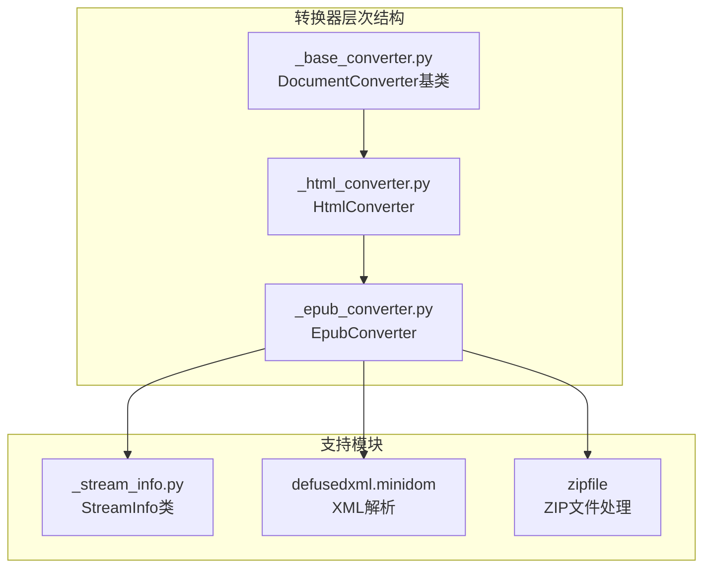
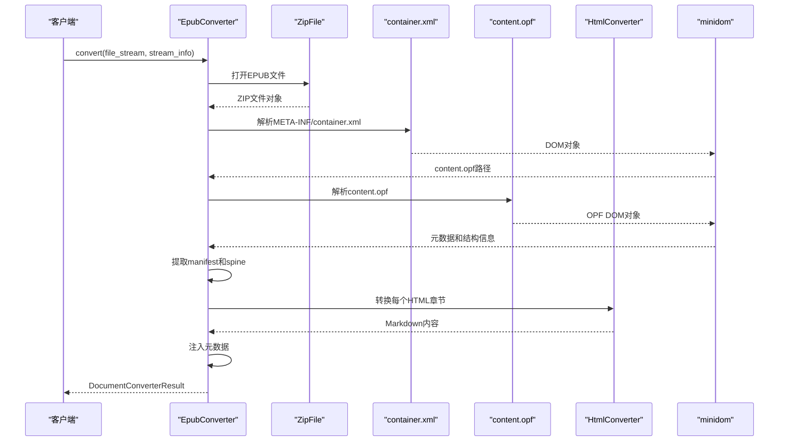
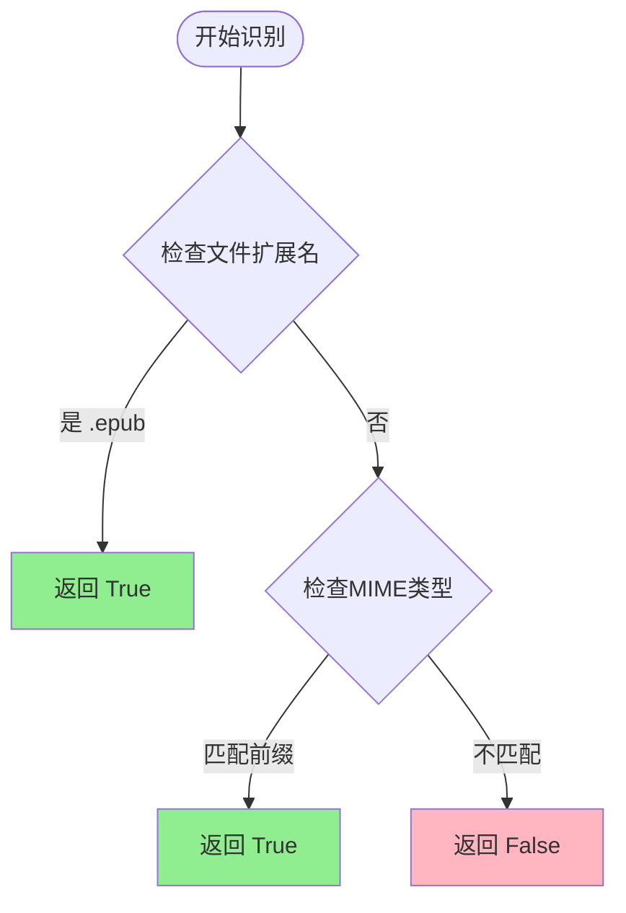
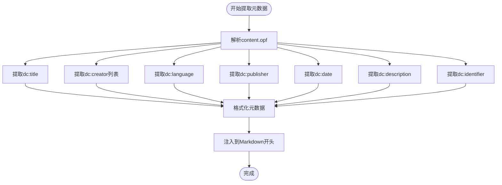
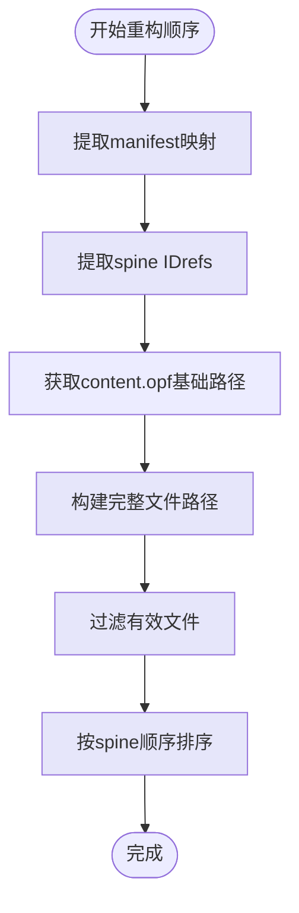
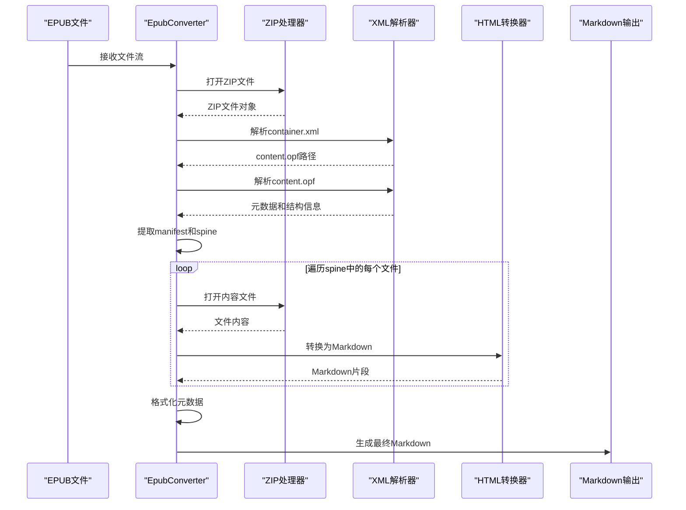
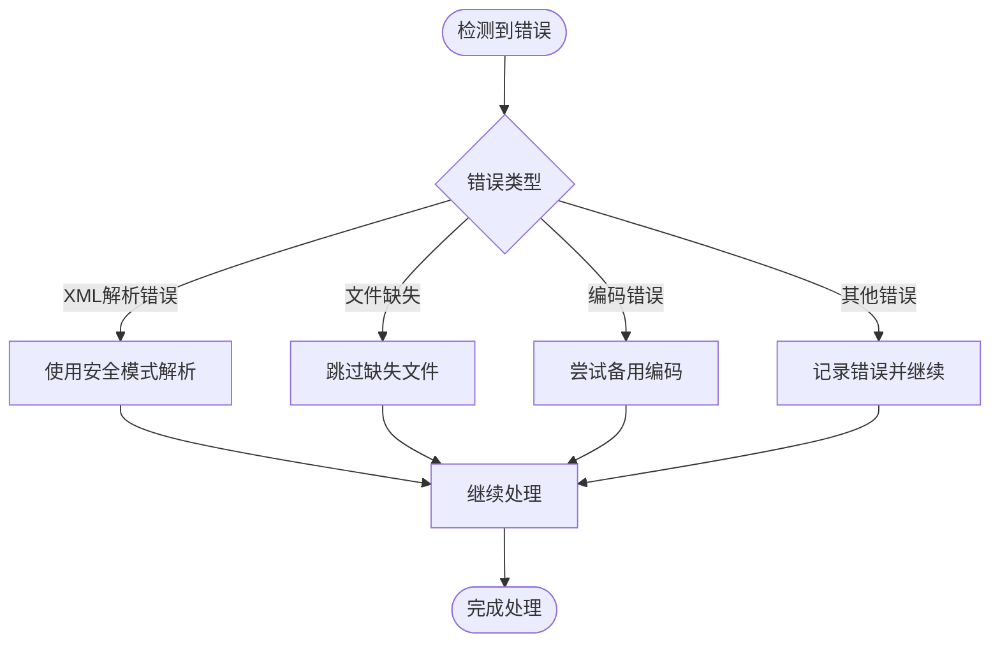

# EPUB电子书转换技术文档

<cite>
**本文档中引用的文件**
- [_epub_converter.py](file://packages/markitdown/src/markitdown/converters/_epub_converter.py)
- [_html_converter.py](file://packages/markitdown/src/markitdown/converters/_html_converter.py)
- [_base_converter.py](file://packages/markitdown/src/markitdown/_base_converter.py)
- [_stream_info.py](file://packages/markitdown/src/markitdown/_stream_info.py)
</cite>

## 目录
1. [简介](#简介)
2. [项目结构概述](#项目结构概述)
3. [核心组件分析](#核心组件分析)
4. [架构概览](#架构概览)
5. [详细组件分析](#详细组件分析)
6. [EPUB文件结构处理](#epub文件结构处理)
7. [转换流程详解](#转换流程详解)
8. [容错策略与错误处理](#容错策略与错误处理)
9. [性能考虑](#性能考虑)
10. [故障排除指南](#故障排除指南)
11. [结论](#结论)

## 简介

EPUB电子书转换器是MarkItDown项目中的一个专门组件，负责将EPUB格式的电子书文件转换为Markdown格式。该转换器继承自HtmlConverter类，利用minidom模块解析EPUB的OPF元数据文件，并通过zipfile模块遍历EPUB容器，实现从复杂的EPUB结构到简洁Markdown格式的转换。

EPUB转换器的核心优势在于其能够：
- 准确解析EPUB容器结构，定位content.opf文件
- 基于manifest和spine结构重构内容顺序
- 将HTML/XHTML章节递归转换为Markdown
- 在文档开头注入完整的元数据信息
- 处理多种MIME类型和文件扩展名识别

## 项目结构概述

EPUB转换功能位于MarkItDown项目的转换器模块中，采用分层架构设计：

**图表来源**
- [_base_converter.py](file://packages/markitdown/src/markitdown/_base_converter.py#L35-L106)
- [_html_converter.py](file://packages/markitdown/src/markitdown/converters/_html_converter.py#L18-L91)
- [_epub_converter.py](file://packages/markitdown/src/markitdown/converters/_epub_converter.py#L23-L147)

**节来源**
- [_epub_converter.py](file://packages/markitdown/src/markitdown/converters/_epub_converter.py#L1-L147)
- [_html_converter.py](file://packages/markitdown/src/markitdown/converters/_html_converter.py#L1-L91)

## 核心组件分析

### EpubConverter类

EpubConverter类是EPUB转换的核心实现，继承自HtmlConverter类，具有以下关键特性：

#### 配置常量
- **ACCEPTED_MIME_TYPE_PREFIXES**: 支持的EPUB MIME类型前缀列表
- **ACCEPTED_FILE_EXTENSIONS**: 支持的文件扩展名列表（.epub）
- **MIME_TYPE_MAPPING**: 文件扩展名到MIME类型的映射关系

#### 继承关系
EpubConverter通过继承HtmlConverter获得了：
- HTML内容解析能力
- Markdown转换基础功能
- 流信息处理机制

**节来源**
- [_epub_converter.py](file://packages/markitdown/src/markitdown/converters/_epub_converter.py#L15-L22)

## 架构概览

EPUB转换器采用模块化架构，各组件职责明确：

**图表来源**
- [_epub_converter.py](file://packages/markitdown/src/markitdown/converters/_epub_converter.py#L54-L147)

## 详细组件分析

### accepts方法 - 文件识别机制

EpubConverter的accepts方法实现了智能的文件识别机制：

**图表来源**
- [_epub_converter.py](file://packages/markitdown/src/markitdown/converters/_epub_converter.py#L32-L48)

该方法优先检查文件扩展名，如果扩展名为.epub则直接返回True。否则，它会检查MIME类型是否以预定义的EPUB前缀开头（application/epub、application/epub+zip、application/x-epub+zip）。

**节来源**
- [_epub_converter.py](file://packages/markitdown/src/markitdown/converters/_epub_converter.py#L32-L48)

### convert方法 - 主要转换逻辑

convert方法是EPUB转换的核心，执行以下主要步骤：

#### 1. ZIP文件处理
使用zipfile模块打开EPUB文件，EPUB本质上是一个压缩包，包含多个XML和HTML文件。

#### 2. 容器文件解析
通过解析META-INF/container.xml文件定位content.opf文件的位置。这个文件包含了EPUB的主要配置信息。

#### 3. OPF文件解析
解析content.opf文件提取元数据和文档结构信息：
- **元数据提取**: 标题、作者、语言、出版商、日期、描述、标识符
- **manifest解析**: 建立ID到文件路径的映射关系
- **spine解析**: 获取内容的阅读顺序

#### 4. 内容转换
按照spine顺序遍历所有内容文件，使用内部的HtmlConverter进行递归转换。

**节来源**
- [_epub_converter.py](file://packages/markitdown/src/markitdown/converters/_epub_converter.py#L54-L147)

### 元数据提取算法

元数据提取过程展示了EPUB结构解析的精确性：

**图表来源**
- [_epub_converter.py](file://packages/markitdown/src/markitdown/converters/_epub_converter.py#L64-L72)

**节来源**
- [_epub_converter.py](file://packages/markitdown/src/markitdown/converters/_epub_converter.py#L64-L72)

### 内容顺序重构算法

EPUB的spine结构决定了内容的阅读顺序，转换器通过以下算法重构内容顺序：

**图表来源**
- [_epub_converter.py](file://packages/markitdown/src/markitdown/converters/_epub_converter.py#L79-L97)

该算法的关键步骤包括：
1. **manifest映射建立**: 创建ID到文件路径的字典映射
2. **spine ID提取**: 获取spine中itemref元素的idref属性
3. **路径构建**: 将相对路径转换为绝对路径
4. **有效性验证**: 确保文件存在于ZIP容器中

**节来源**
- [_epub_converter.py](file://packages/markitdown/src/markitdown/converters/_epub_converter.py#L79-L97)

## EPUB文件结构处理

### EPUB容器结构

EPUB文件遵循ZIP容器格式，包含以下关键目录和文件：

| 目录/文件 | 功能描述 | 处理方式 |
|-----------|----------|----------|
| META-INF/container.xml | 容器配置文件，定位content.opf | 使用minidom解析 |
| content.opf | 主要OPF文件，包含元数据和结构信息 | 使用minidom解析 |
| OEBPS/ | 内容目录，包含HTML/XHTML文件 | 按spine顺序处理 |
| OEBPS/Styles/ | 样式文件目录 | 通常被忽略 |
| OEBPS/Images/ | 图像文件目录 | 通常被忽略 |

### OPF文件结构解析

content.opf文件包含三个主要部分：

#### 1. metadata节点
存储文档的元数据信息，如标题、作者、语言等。

#### 2. manifest节点
定义所有可用资源的清单，每个item元素包含：
- id: 资源唯一标识符
- href: 相对路径
- media-type: MIME类型

#### 3. spine节点
定义阅读顺序，每个itemref元素包含：
- idref: 对应manifest中item的id
- linear: 是否为线性内容（可选）

**节来源**
- [_epub_converter.py](file://packages/markitdown/src/markitdown/converters/_epub_converter.py#L64-L97)

## 转换流程详解

### 完整转换流程

**图表来源**
- [_epub_converter.py](file://packages/markitdown/src/markitdown/converters/_epub_converter.py#L54-L147)

### HTML到Markdown转换

转换器使用内部的HtmlConverter实例来处理每个HTML/XHTML章节：

1. **HTML解析**: 使用BeautifulSoup解析HTML内容
2. **内容清理**: 移除JavaScript和CSS样式块
3. **结构保留**: 保留标题、表格等重要结构元素
4. **文本提取**: 提取纯文本内容并转换为Markdown格式

**节来源**
- [_epub_converter.py](file://packages/markitdown/src/markitdown/converters/_epub_converter.py#L103-L129)

## 容错策略与错误处理

### XML解析容错

转换器使用defusedxml.minidom模块进行XML解析，该模块提供了安全的XML处理能力：

- **防止XXE攻击**: 防止外部实体注入攻击
- **内存保护**: 限制XML文档大小
- **解析错误处理**: 自动处理格式错误的XML

### 文件完整性检查

转换器实施多层完整性检查：

1. **ZIP文件验证**: 确保EPUB文件是有效的ZIP格式
2. **必需文件检查**: 验证container.xml和content.opf的存在
3. **路径有效性**: 确保spine中引用的文件存在于ZIP中
4. **编码检测**: 自动检测文件编码

### 错误恢复机制

当遇到异常情况时，转换器采用以下策略：

**节来源**
- [_epub_converter.py](file://packages/markitdown/src/markitdown/converters/_epub_converter.py#L54-L147)

## 性能考虑

### 内存管理

EPUB转换器采用流式处理策略来优化内存使用：

- **延迟加载**: 只在需要时读取文件内容
- **及时释放**: 处理完成后立即释放文件句柄
- **批量处理**: 合并多个小文件的处理结果

### 并发处理

虽然当前实现是单线程的，但架构设计支持并发处理：

- **独立文件处理**: 每个HTML文件可以独立转换
- **异步I/O**: 支持异步文件读取操作
- **缓存机制**: 缓存已解析的XML结构

### 优化建议

1. **预编译正则表达式**: 对频繁使用的模式进行预编译
2. **对象池**: 复用HtmlConverter实例
3. **增量处理**: 支持大文件的增量转换

## 故障排除指南

### 常见问题及解决方案

#### 1. EPUB文件无法识别
**症状**: accepts方法返回False
**原因**: MIME类型或文件扩展名不匹配
**解决方案**: 检查文件头信息和扩展名设置

#### 2. XML解析失败
**症状**: minidom.parse抛出异常
**原因**: XML格式损坏或编码问题
**解决方案**: 使用defusedxml的安全解析选项

#### 3. 内容文件缺失
**症状**: spine引用的文件不存在
**原因**: EPUB文件不完整或损坏
**解决方案**: 跳过缺失文件并记录警告

#### 4. 编码问题
**症状**: 中文字符显示为乱码
**原因**: 文件编码与预期不符
**解决方案**: 自动检测编码或指定默认编码

### 调试技巧

1. **启用详细日志**: 记录每一步的处理状态
2. **中间文件保存**: 保存解析后的XML结构用于调试
3. **分步测试**: 单独测试每个处理阶段的功能

**节来源**
- [_epub_converter.py](file://packages/markitdown/src/markitdown/converters/_epub_converter.py#L32-L48)

## 结论

EPUB电子书转换器是一个功能完善、设计精良的转换组件，成功地解决了EPUB格式到Markdown格式的转换挑战。其主要优势包括：

### 技术优势
- **架构清晰**: 采用继承和组合的设计模式
- **安全性高**: 使用defusedxml防止XML注入攻击
- **容错性强**: 实施多层次的错误处理机制
- **扩展性好**: 支持新的MIME类型和文件格式

### 功能特点
- **结构化处理**: 准确解析EPUB的复杂结构
- **元数据完整**: 保留所有重要的文档信息
- **内容质量**: 保持原文档的语义结构
- **性能优化**: 采用流式处理减少内存占用

### 应用价值
该转换器为电子书数字化、内容迁移和格式转换提供了可靠的技术解决方案，特别适用于需要将EPUB格式内容转换为Markdown格式的应用场景。

通过深入理解其实现原理和设计思想，开发者可以更好地维护和扩展这一重要组件，为更广泛的文档转换需求提供支持。