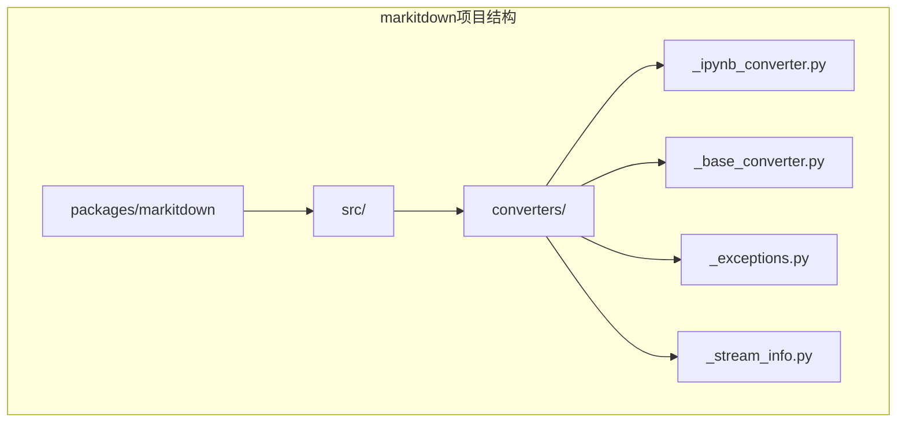
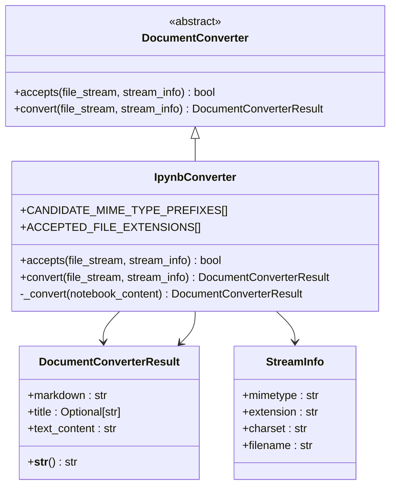
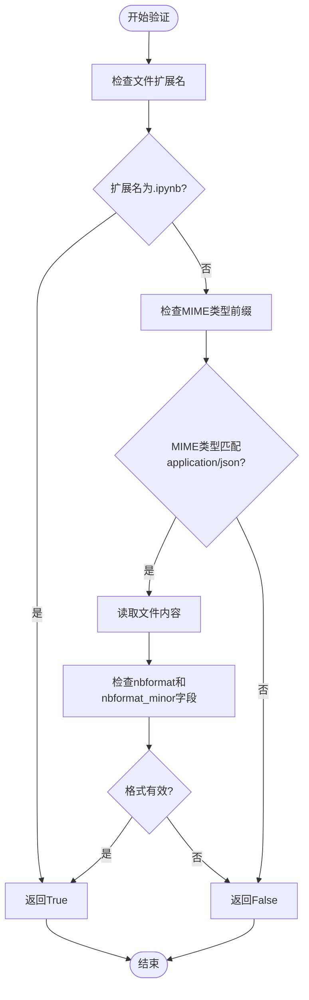
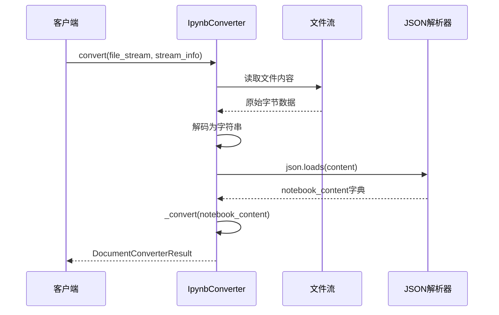
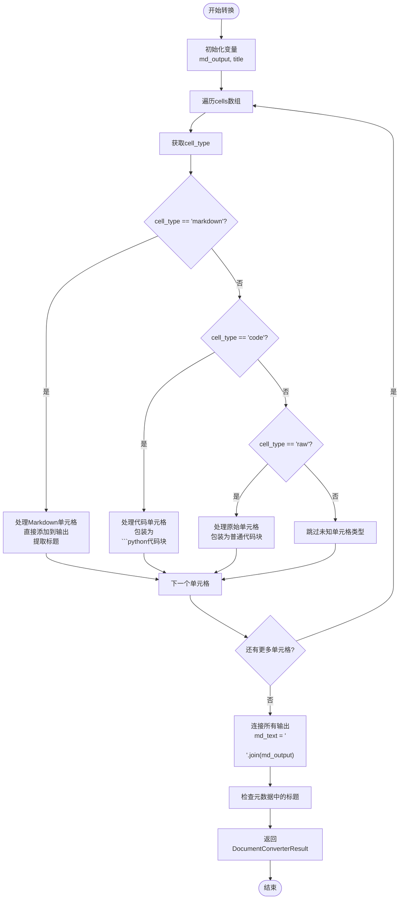
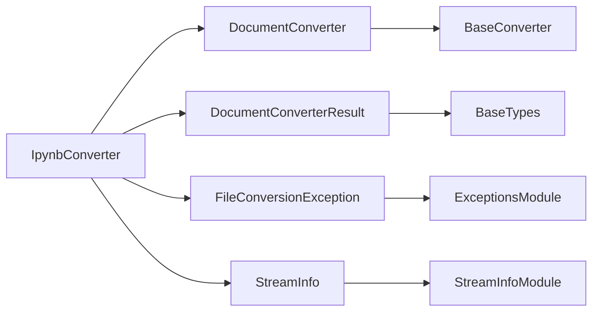

# Jupyter Notebook(IPYNB)转换

<cite>
**本文档中引用的文件**
- [_ipynb_converter.py](file://packages/markitdown/src/markitdown/converters/_ipynb_converter.py)
- [test_notebook.ipynb](file://packages/markitdown/tests/test_files/test_notebook.ipynb)
- [_base_converter.py](file://packages/markitdown/src/markitdown/_base_converter.py)
- [_llm_caption.py](file://packages/markitdown/src/markitdown/converters/_llm_caption.py)
</cite>

## 目录
1. [简介](#简介)
2. [项目结构](#项目结构)
3. [核心组件](#核心组件)
4. [架构概览](#架构概览)
5. [详细组件分析](#详细组件分析)
6. [依赖关系分析](#依赖关系分析)
7. [性能考虑](#性能考虑)
8. [故障排除指南](#故障排除指南)
9. [结论](#结论)

## 简介

Jupyter Notebook转换器（IpynbConverter）是markitdown项目中的一个专门组件，负责将Jupyter Notebook格式（.ipynb）的JSON文件转换为线性Markdown文档。该转换器实现了严格的文件验证机制，能够智能地处理不同类型的Notebook单元格，包括Markdown、代码和原始文本单元格，并提供了灵活的标题提取策略。

## 项目结构

IpynbConverter位于markitdown项目的转换器模块中，采用标准的Python包结构组织：



**图表来源**
- [_ipynb_converter.py](file://packages/markitdown/src/markitdown/converters/_ipynb_converter.py#L1-L10)
- [_base_converter.py](file://packages/markitdown/src/markitdown/_base_converter.py#L1-L10)

**章节来源**
- [_ipynb_converter.py](file://packages/markitdown/src/markitdown/converters/_ipynb_converter.py#L1-L97)

## 核心组件

IpynbConverter类是整个转换系统的核心，继承自DocumentConverter抽象基类，提供了专门针对Jupyter Notebook格式的转换能力。

### 主要特性

1. **多层文件验证机制**：支持基于扩展名和MIME类型的双重验证
2. **智能单元格处理**：区分Markdown、代码和原始文本单元格
3. **灵活的标题提取**：优先使用元数据中的标题，回退到文档内的第一个标题
4. **错误处理机制**：提供详细的转换错误信息

**章节来源**
- [_ipynb_converter.py](file://packages/markitdown/src/markitdown/converters/_ipynb_converter.py#L15-L97)

## 架构概览

IpynbConverter采用分层架构设计，确保了良好的可维护性和扩展性：



**图表来源**
- [_base_converter.py](file://packages/markitdown/src/markitdown/_base_converter.py#L44-L106)
- [_ipynb_converter.py](file://packages/markitdown/src/markitdown/converters/_ipynb_converter.py#L15-L97)

## 详细组件分析

### accepts方法 - 文件验证机制

accepts方法实现了双重验证策略，确保只有有效的Jupyter Notebook文件才能被处理：



**图表来源**
- [_ipynb_converter.py](file://packages/markitdown/src/markitdown/converters/_ipynb_converter.py#L17-L50)

#### 验证策略详解

1. **扩展名验证**：首先检查文件扩展名是否为`.ipynb`
2. **MIME类型验证**：如果扩展名不匹配，检查MIME类型是否以`application/json`开头
3. **内容验证**：读取文件内容，检查是否存在必需的`nbformat`和`nbformat_minor`字段

**章节来源**
- [_ipynb_converter.py](file://packages/markitdown/src/markitdown/converters/_ipynb_converter.py#L17-L50)

### convert方法 - 转换流程

convert方法负责将二进制流转换为Markdown文档：



**图表来源**
- [_ipynb_converter.py](file://packages/markitdown/src/markitdown/converters/_ipynb_converter.py#L52-L60)

**章节来源**
- [_ipynb_converter.py](file://packages/markitdown/src/markitdown/converters/_ipynb_converter.py#L52-L60)

### _convert方法 - 单元格处理逻辑

_convert方法实现了复杂的单元格处理逻辑，根据不同的单元格类型采用相应的转换策略：



**图表来源**
- [_ipynb_converter.py](file://packages/markitdown/src/markitdown/converters/_ipynb_converter.py#L62-L95)

#### 单元格处理策略

1. **Markdown单元格**：
   - 直接保留源内容
   - 优先从首个`# `标题行提取标题
   - 支持完整的Markdown语法

2. **代码单元格**：
   - 包装在` ```python `代码块中
   - 保持原始代码格式
   - 添加Python语言标识符

3. **原始单元格**：
   - 包装在普通` ``` `代码块中
   - 不指定语言标识符
   - 适用于非Python代码

**章节来源**
- [_ipynb_converter.py](file://packages/markitdown/src/markitdown/converters/_ipynb_converter.py#L62-L95)

### 标题提取策略

IpynbConverter实现了智能的标题提取机制：

| 提取优先级 | 方法 | 描述 |
|------------|------|------|
| 1 | 元数据标题 | 从`notebook_content.metadata.title`获取 |
| 2 | 文档内标题 | 从首个`# `开头的行提取 |
| 3 | 默认值 | 使用None作为后备 |

**章节来源**
- [_ipynb_converter.py](file://packages/markitdown/src/markitdown/converters/_ipynb_converter.py#L90-L95)

## 依赖关系分析

IpynbConverter的依赖关系相对简单，主要依赖于基础转换器框架：



**图表来源**
- [_ipynb_converter.py](file://packages/markitdown/src/markitdown/converters/_ipynb_converter.py#L1-L10)
- [_base_converter.py](file://packages/markitdown/src/markitdown/_base_converter.py#L1-L10)

**章节来源**
- [_ipynb_converter.py](file://packages/markitdown/src/markitdown/converters/_ipynb_converter.py#L1-L10)

## 性能考虑

### 内存使用优化

1. **流式处理**：使用二进制流而非一次性加载整个文件
2. **位置重置**：在accepts方法中正确重置文件指针
3. **增量构建**：使用列表累积结果，避免频繁字符串拼接

### 错误处理策略

1. **编码检测**：自动检测UTF-8编码，支持其他字符集
2. **异常包装**：将底层异常包装为FileConversionException
3. **优雅降级**：在部分失败时仍返回可用的Markdown内容

## 故障排除指南

### 常见问题及解决方案

| 问题类型 | 症状 | 可能原因 | 解决方案 |
|----------|------|----------|----------|
| 文件识别失败 | accept()返回False | MIME类型不匹配或格式无效 | 检查文件扩展名和内容格式 |
| 转换错误 | FileConversionException | JSON解析失败或编码问题 | 验证文件完整性，检查编码设置 |
| 标题丢失 | 返回的title为None | 缺少元数据标题且无文档内标题 | 在Notebook中添加标题行或设置元数据 |

### 调试技巧

1. **启用详细日志**：监控文件流的位置变化
2. **验证JSON格式**：确保.ipynb文件具有有效的JSON结构
3. **检查编码**：确认文件使用UTF-8或其他支持的编码

**章节来源**
- [_ipynb_converter.py](file://packages/markitdown/src/markitdown/converters/_ipynb_converter.py#L85-L95)

## 结论

IpynbConverter是一个设计精良的Jupyter Notebook转换器，具备以下优势：

1. **可靠性**：实现了双重验证机制，确保文件有效性
2. **灵活性**：支持多种单元格类型和标题提取策略
3. **可扩展性**：基于抽象基类设计，便于功能扩展
4. **健壮性**：完善的错误处理和异常管理

### 当前限制

1. **输出处理**：不保留代码执行输出和图表
2. **格式保持**：仅转换基本的Markdown和代码格式
3. **交互元素**：不支持Notebook的交互特性

### 增强建议

建议结合_llm_caption插件进行增强处理，特别是对于包含图表和图像的Notebook，可以实现：
- 自动图像描述生成
- 图表内容的文字化
- 复杂可视化的内容摘要

通过这些增强，IpynbConverter可以更好地服务于需要完整内容转换的场景。