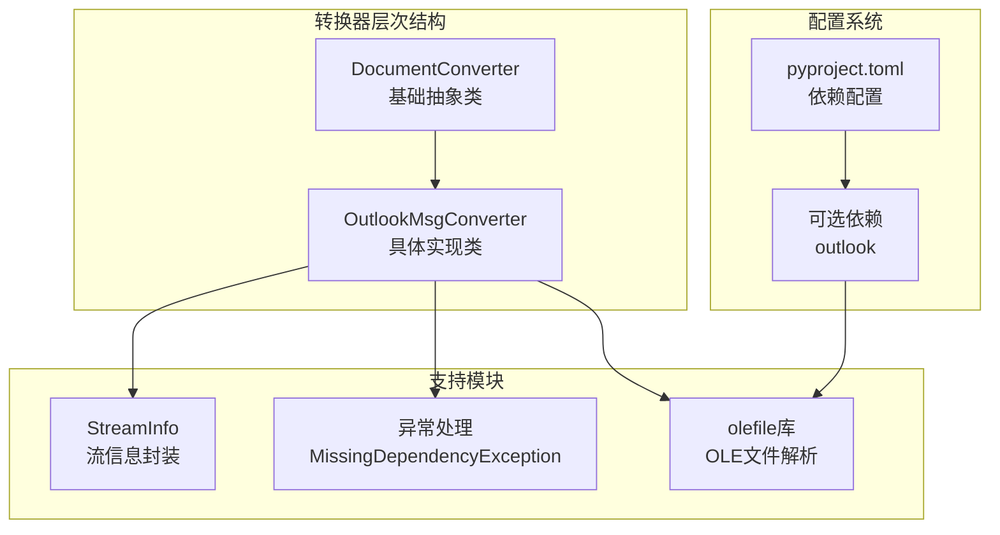
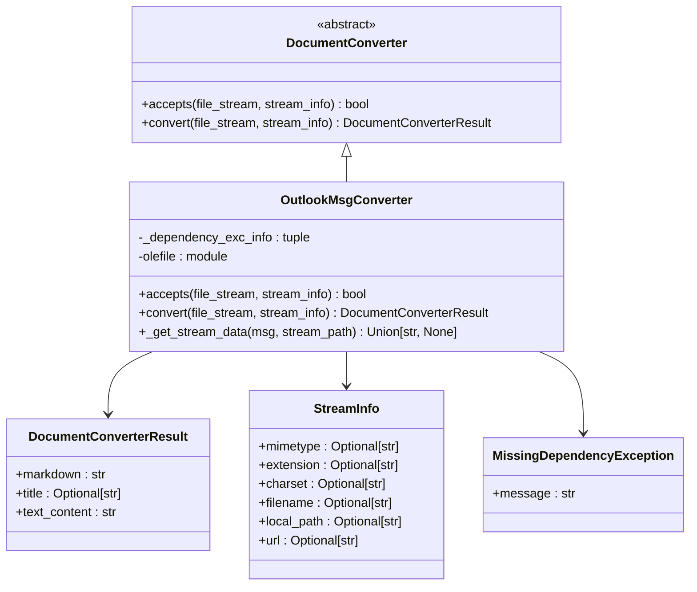
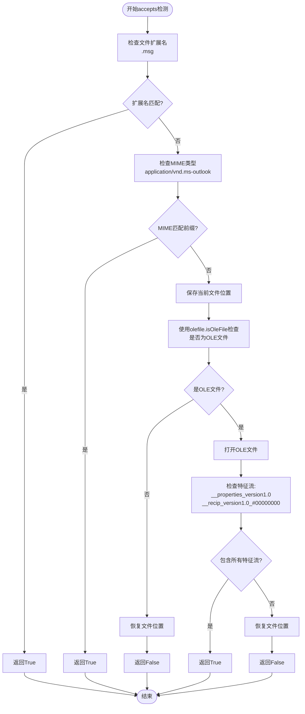
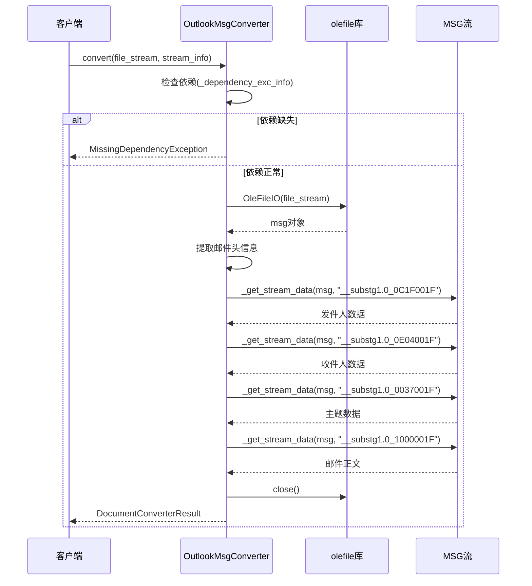
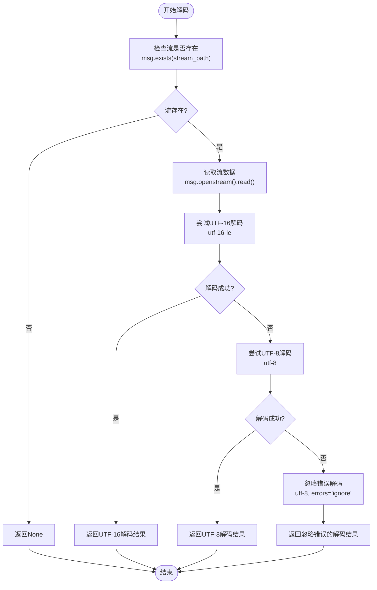
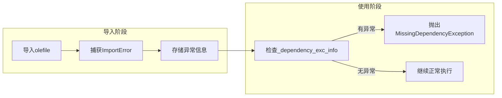
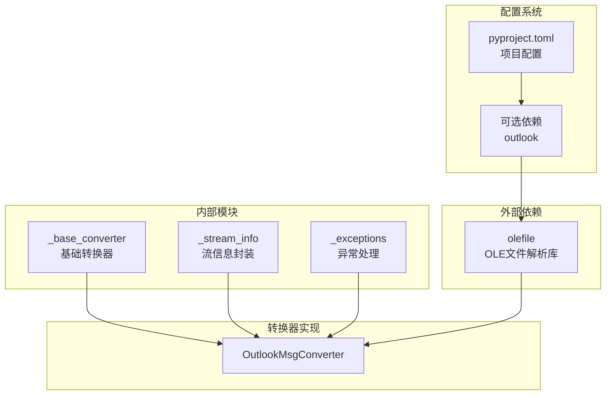

# Outlook邮件(MSG)转换

<cite>
**本文档中引用的文件**
- [_outlook_msg_converter.py](file://packages/markitdown/src/markitdown/converters/_outlook_msg_converter.py)
- [_base_converter.py](file://packages/markitdown/src/markitdown/_base_converter.py)
- [_exceptions.py](file://packages/markitdown/src/markitdown/_exceptions.py)
- [_stream_info.py](file://packages/markitdown/src/markitdown/_stream_info.py)
- [pyproject.toml](file://packages/markitdown/pyproject.toml)
</cite>

## 目录
1. [简介](#简介)
2. [项目结构](#项目结构)
3. [核心组件](#核心组件)
4. [架构概览](#架构概览)
5. [详细组件分析](#详细组件分析)
6. [依赖关系分析](#依赖关系分析)
7. [性能考虑](#性能考虑)
8. [故障排除指南](#故障排除指南)
9. [结论](#结论)

## 简介

Outlook MSG文件转换器是MarkItDown项目中的一个专门组件，负责将Microsoft Outlook电子邮件消息文件（.msg）转换为Markdown格式。该转换器使用olefile库来解析复合文档格式（Compound File Binary Format），这是一种由Microsoft开发的二进制文件格式，广泛用于存储复杂的文档结构。

该转换器实现了多层次的文件类型检测机制，包括MIME类型识别、文件扩展名验证以及OLE结构特征的深度分析。它能够从MSG文件中提取关键的邮件元数据（发件人、收件人、主题）和邮件内容，并采用智能的编码解码策略来处理不同格式的文本数据。

## 项目结构

Outlook MSG转换器位于MarkItDown项目的转换器模块中，遵循清晰的分层架构设计：



**图表来源**
- [_base_converter.py](file://packages/markitdown/src/markitdown/_base_converter.py#L40-L106)
- [_outlook_msg_converter.py](file://packages/markitdown/src/markitdown/converters/_outlook_msg_converter.py#L20-L30)

**章节来源**
- [_outlook_msg_converter.py](file://packages/markitdown/src/markitdown/converters/_outlook_msg_converter.py#L1-L150)
- [pyproject.toml](file://packages/markitdown/pyproject.toml#L40-L50)

## 核心组件

Outlook MSG转换器的核心功能围绕两个主要方法构建：`accepts`方法用于文件类型检测，`convert`方法执行实际的转换过程。

### 接受性检测机制

`accepts`方法实现了三层检测机制：

1. **基础检测**：检查文件扩展名和MIME类型
2. **OLE结构验证**：使用olefile库验证OLE文件结构
3. **特征流检测**：查找特定的MSG文件特征流

### 转换流程

`convert`方法按照以下步骤执行转换：
1. 依赖检查和异常处理
2. OLE文件初始化
3. 邮件元数据提取
4. 邮件内容处理
5. 结果封装返回

**章节来源**
- [_outlook_msg_converter.py](file://packages/markitdown/src/markitdown/converters/_outlook_msg_converter.py#L32-L70)
- [_outlook_msg_converter.py](file://packages/markitdown/src/markitdown/converters/_outlook_msg_converter.py#L72-L112)

## 架构概览

Outlook MSG转换器采用插件化架构，继承自DocumentConverter基类，确保与MarkItDown生态系统的无缝集成：



**图表来源**
- [_base_converter.py](file://packages/markitdown/src/markitdown/_base_converter.py#L40-L106)
- [_outlook_msg_converter.py](file://packages/markitdown/src/markitdown/converters/_outlook_msg_converter.py#L20-L30)
- [_stream_info.py](file://packages/markitdown/src/markitdown/_stream_info.py#L6-L32)

## 详细组件分析

### accepts方法的多重检测机制

`accepts`方法实现了精密的文件类型检测算法，确保只有真正的MSG文件才会被处理：



**图表来源**
- [_outlook_msg_converter.py](file://packages/markitdown/src/markitdown/converters/_outlook_msg_converter.py#L32-L70)

这种多层检测机制的优势在于：
- **快速失败**：优先检查简单的扩展名和MIME类型
- **精确验证**：通过OLE结构特征确保文件真实性
- **资源保护**：及时恢复文件位置，避免影响后续操作

### convert方法的数据提取流程

`convert`方法展示了如何从MSG文件中提取关键信息：



**图表来源**
- [_outlook_msg_converter.py](file://packages/markitdown/src/markitdown/converters/_outlook_msg_converter.py#L72-L112)

### _get_stream_data方法的编码解码策略

该方法实现了智能的双层编码解码机制，确保能够处理不同格式的文本数据：



**图表来源**
- [_outlook_msg_converter.py](file://packages/markitdown/src/markitdown/converters/_outlook_msg_converter.py#L114-L148)

这种编码策略的优势：
- **优先UTF-16**：MSG文件通常使用UTF-16编码
- **优雅降级**：UTF-8作为备选方案
- **容错处理**：最后使用忽略错误模式确保不中断转换

**章节来源**
- [_outlook_msg_converter.py](file://packages/markitdown/src/markitdown/converters/_outlook_msg_converter.py#L32-L70)
- [_outlook_msg_converter.py](file://packages/markitdown/src/markitdown/converters/_outlook_msg_converter.py#L72-L112)
- [_outlook_msg_converter.py](file://packages/markitdown/src/markitdown/converters/_outlook_msg_converter.py#L114-L148)

### 依赖管理与异常处理

Outlook MSG转换器采用了精心设计的依赖管理机制：

#### 延迟加载策略



**图表来源**
- [_outlook_msg_converter.py](file://packages/markitdown/src/markitdown/converters/_outlook_msg_converter.py#L8-L18)

#### 异常处理机制

转换器实现了多层次的异常处理：

1. **导入时捕获**：在模块导入时捕获olefile导入异常
2. **运行时检查**：在convert方法中验证依赖可用性
3. **友好错误消息**：提供清晰的安装指导

**章节来源**
- [_outlook_msg_converter.py](file://packages/markitdown/src/markitdown/converters/_outlook_msg_converter.py#L8-L18)
- [_outlook_msg_converter.py](file://packages/markitdown/src/markitdown/converters/_outlook_msg_converter.py#L72-L85)
- [_exceptions.py](file://packages/markitdown/src/markitdown/_exceptions.py#L3-L15)

## 依赖关系分析

Outlook MSG转换器的依赖关系体现了MarkItDown项目的模块化设计理念：



**图表来源**
- [_outlook_msg_converter.py](file://packages/markitdown/src/markitdown/converters/_outlook_msg_converter.py#L1-L10)
- [pyproject.toml](file://packages/markitdown/pyproject.toml#L40-L50)

### 可选依赖配置

项目通过pyproject.toml定义了专门的outlook可选依赖：

| 依赖项 | 版本要求 | 用途 |
|--------|----------|------|
| olefile | 无明确版本要求 | MSG文件OLE结构解析 |

### 安装配置指导

当用户需要使用Outlook MSG转换功能时，可以通过以下方式安装相关依赖：

```bash
# 安装单独的outlook依赖
pip install markitdown[outlook]

# 或安装所有可选依赖
pip install markitdown[all]

# 或指定多个可选功能
pip install markitdown[outlook,pdf,audio-transcription]
```

**章节来源**
- [pyproject.toml](file://packages/markitdown/pyproject.toml#L40-L50)
- [_exceptions.py](file://packages/markitdown/src/markitdown/_exceptions.py#L3-L15)

## 性能考虑

Outlook MSG转换器在设计时充分考虑了性能优化：

### 文件流处理优化

- **位置保存恢复**：在accepts方法中使用tell()和seek()确保文件位置正确
- **资源管理**：convert方法中显式调用msg.close()释放资源
- **流式处理**：只读取必要的流数据，避免全文件加载

### 内存使用优化

- **按需解码**：_get_stream_data方法采用逐步解码策略
- **异常隔离**：每个解码尝试都在独立的try块中进行
- **数据最小化**：只提取和转换必需的邮件元数据

### 错误处理策略

- **优雅降级**：编码失败时自动尝试备选方案
- **容错设计**：即使部分数据提取失败，仍能返回可用结果
- **资源清理**：确保异常情况下也能正确释放资源

## 故障排除指南

### 常见问题及解决方案

#### 1. 缺少olefile依赖

**症状**：运行时抛出MissingDependencyException异常

**原因**：未安装olefile库

**解决方案**：
```bash
pip install markitdown[outlook]
# 或
pip install olefile
```

#### 2. MSG文件格式不兼容

**症状**：accepts方法返回False但文件确实是MSG格式

**原因**：MSG文件可能使用了非标准的OLE结构

**解决方案**：
- 检查文件是否损坏或被修改
- 确认文件确实是由Outlook生成
- 考虑文件版本兼容性问题

#### 3. 编码问题导致数据丢失

**症状**：提取的邮件内容出现乱码或部分缺失

**原因**：MSG文件使用了特殊编码格式

**解决方案**：
- 检查邮件内容的实际编码格式
- 考虑扩展_get_stream_data方法支持更多编码
- 使用ignore错误模式确保数据完整性

### 调试建议

1. **启用详细日志**：监控accepts和convert方法的执行流程
2. **检查文件结构**：使用olefile工具手动检查MSG文件结构
3. **验证流路径**：确认所需的流路径在目标MSG文件中存在

**章节来源**
- [_exceptions.py](file://packages/markitdown/src/markitdown/_exceptions.py#L3-L15)
- [_outlook_msg_converter.py](file://packages/markitdown/src/markitdown/converters/_outlook_msg_converter.py#L72-L85)

## 结论

Outlook MSG转换器展现了MarkItDown项目在处理复杂文件格式方面的技术实力。通过巧妙的设计，它成功地解决了MSG文件解析的挑战：

### 技术亮点

1. **多层检测机制**：确保文件类型识别的准确性
2. **智能编码处理**：优雅应对不同编码格式
3. **健壮的异常处理**：提供良好的用户体验
4. **模块化架构**：与整体系统无缝集成

### 功能特性

- **元数据提取**：准确提取发件人、收件人、主题等关键信息
- **内容处理**：有效提取邮件正文内容
- **编码兼容**：支持多种文本编码格式
- **错误容错**：在异常情况下仍能提供部分功能

### 扩展建议

虽然当前实现专注于基本的邮件信息提取，但可以考虑以下扩展方向：
- **附件处理**：添加对邮件附件的提取和处理能力
- **嵌入图像**：支持提取和处理邮件中的嵌入图片
- **富文本格式**：保留邮件的格式化信息
- **联系人信息**：提取邮件中的联系人卡片信息

这个转换器为MarkItDown项目提供了处理Microsoft Outlook邮件的强大能力，是其文档转换生态系统的重要组成部分。