# 其他格式转换器综合文档

<cite>
**本文档引用的文件**
- [_epub_converter.py](file://packages/markitdown/src/markitdown/converters/_epub_converter.py)
- [_outlook_msg_converter.py](file://packages/markitdown/src/markitdown/converters/_outlook_msg_converter.py)
- [_ipynb_converter.py](file://packages/markitdown/src/markitdown/converters/_ipynb_converter.py)
- [_html_converter.py](file://packages/markitdown/src/markitdown/converters/_html_converter.py)
- [_base_converter.py](file://packages/markitdown/src/markitdown/_base_converter.py)
- [_stream_info.py](file://packages/markitdown/src/markitdown/_stream_info.py)
- [_markdownify.py](file://packages/markitdown/src/markitdown/converters/_markdownify.py)
- [test_notebook.ipynb](file://packages/markitdown/tests/test_files/test_notebook.ipynb)
</cite>

## 目录
1. [简介](#简介)
2. [项目架构概览](#项目架构概览)
3. [EPUB电子书转换器](#epub电子书转换器)
4. [Outlook邮件转换器](#outlook邮件转换器)
5. [Jupyter Notebook转换器](#jupyter-notebook转换器)
6. [转换器通用架构](#转换器通用架构)
7. [格式特性与约束](#格式特性与约束)
8. [性能考虑](#性能考虑)
9. [故障排除指南](#故障排除指南)
10. [总结](#总结)

## 简介

markitdown项目提供了三个专门的格式转换器，用于处理专业文档格式：EPUB电子书、Outlook邮件（MSG）和Jupyter Notebook（IPYNB）。这些转换器扩展了markitdown在专业场景下的适用性，能够将复杂的文档格式转换为统一的Markdown格式，便于后续处理和分析。

每个转换器都遵循统一的接口设计，通过`DocumentConverter`抽象基类实现，确保了系统的一致性和可扩展性。转换器采用模块化设计，支持流式处理和增量转换，能够高效处理大型文档文件。

## 项目架构概览

markitdown的转换器架构基于面向对象的设计模式，所有转换器都继承自`DocumentConverter`基类，并通过`StreamInfo`对象传递文件元数据信息。

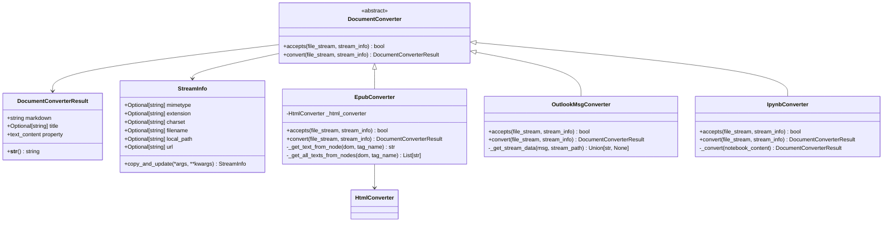

**图表来源**
- [_base_converter.py](file://packages/markitdown/src/markitdown/_base_converter.py#L35-L105)
- [_epub_converter.py](file://packages/markitdown/src/markitdown/converters/_epub_converter.py#L20-L147)
- [_outlook_msg_converter.py](file://packages/markitdown/src/markitdown/converters/_outlook_msg_converter.py#L20-L150)
- [_ipynb_converter.py](file://packages/markitdown/src/markitdown/converters/_ipynb_converter.py#L15-L97)

**节来源**
- [_base_converter.py](file://packages/markitdown/src/markitdown/_base_converter.py#L1-L106)
- [_stream_info.py](file://packages/markitdown/src/markitdown/_stream_info.py#L1-L31)

## EPUB电子书转换器

### 架构设计

EPUB转换器专门处理EPUB格式的电子书文件，该格式基于ZIP容器包含多个XML和HTML文件。转换器通过解析EPUB的内部结构，提取元数据和内容，最终生成连贯的Markdown文档。

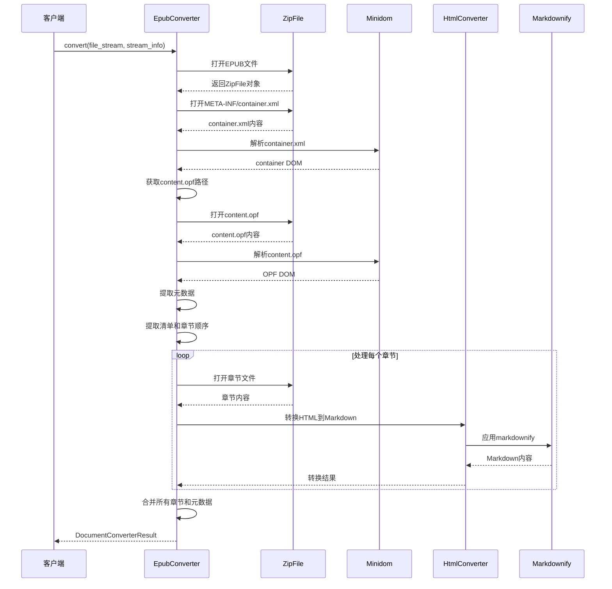

**图表来源**
- [_epub_converter.py](file://packages/markitdown/src/markitdown/converters/_epub_converter.py#L54-L110)

### 核心功能实现

#### EPUB文件结构解析

EPUB转换器首先解析ZIP容器内的`META-INF/container.xml`文件，确定主内容文件（content.opf）的位置。content.opf文件包含了电子书的元数据和内容组织结构。

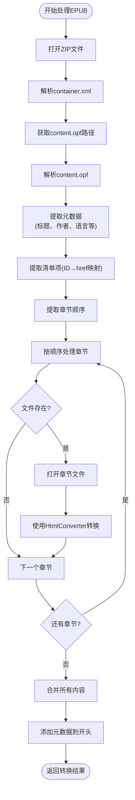

**图表来源**
- [_epub_converter.py](file://packages/markitdown/src/markitdown/converters/_epub_converter.py#L54-L110)

#### 元数据提取机制

EPUB转换器从content.opf文件中提取丰富的元数据信息，包括：
- **标题**：`dc:title`元素的内容
- **作者**：`dc:creator`元素的多个实例
- **语言**：`dc:language`指定的语言代码
- **出版商**：`dc:publisher`信息
- **日期**：`dc:date`发布日期
- **描述**：`dc:description`书籍描述
- **标识符**：`dc:identifier`唯一标识符

#### 内容转换策略

对于每个章节文件，转换器使用继承自`HtmlConverter`的组件进行处理。转换过程包括：
1. **HTML解析**：使用BeautifulSoup解析章节内容
2. **样式移除**：移除JavaScript和CSS块
3. **内容提取**：提取主体内容部分
4. **Markdown转换**：应用自定义的markdownify转换器

**节来源**
- [_epub_converter.py](file://packages/markitdown/src/markitdown/converters/_epub_converter.py#L1-L147)

## Outlook邮件转换器

### 架构设计

Outlook MSG转换器专门处理Microsoft Outlook的MSG文件格式，该格式基于OLE Compound Document结构。转换器使用olefile库解析二进制结构，提取邮件元数据和内容。

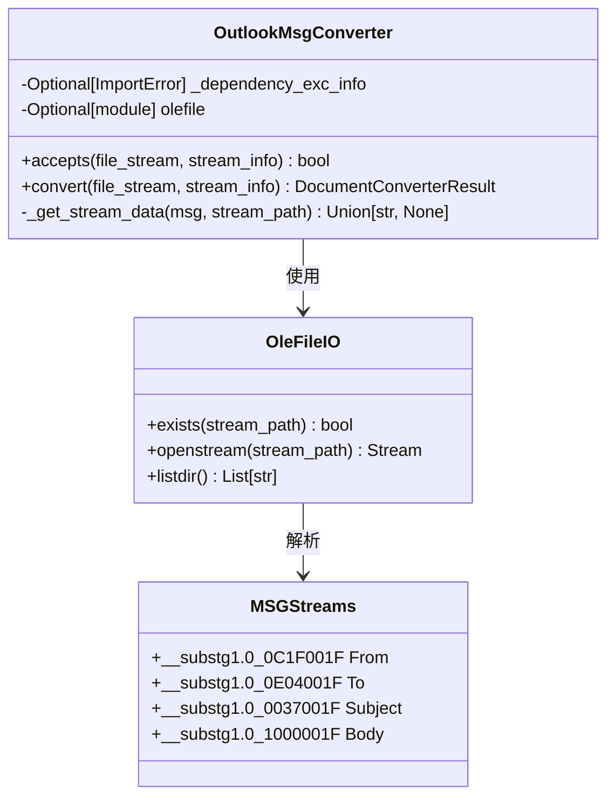

**图表来源**
- [_outlook_msg_converter.py](file://packages/markitdown/src/markitdown/converters/_outlook_msg_converter.py#L20-L150)

### 核心功能实现

#### MSG文件识别机制

MSG转换器实现了多层文件识别策略：

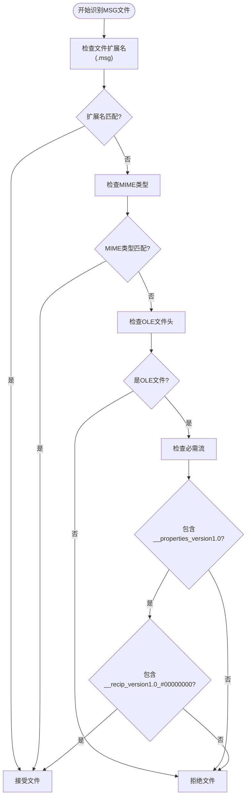

**图表来源**
- [_outlook_msg_converter.py](file://packages/markitdown/src/markitdown/converters/_outlook_msg_converter.py#L25-L70)

#### 邮件内容提取

MSG转换器从特定的OLE流中提取邮件内容：

| 流名称 | 字段 | 描述 |
|--------|------|------|
| `__substg1.0_0C1F001F` | From | 发件人地址 |
| `__substg1.0_0E04001F` | To | 收件人地址 |
| `__substg1.0_0037001F` | Subject | 邮件主题 |
| `__substg1.0_1000001F` | Body | 邮件正文内容 |

#### 编码处理策略

MSG文件通常使用UTF-16 LE编码，转换器实现了智能编码检测：

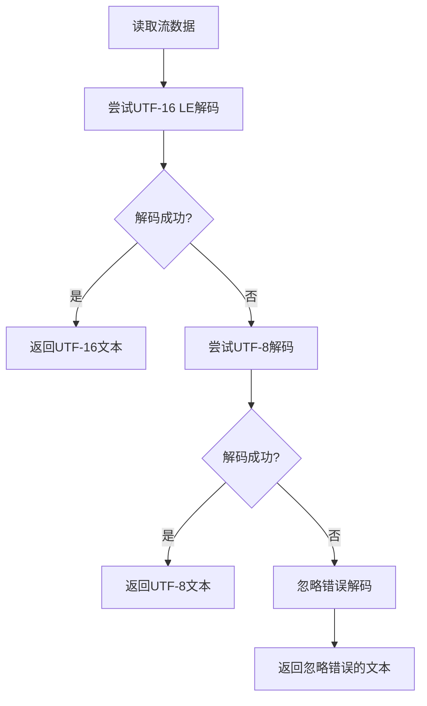

**图表来源**
- [_outlook_msg_converter.py](file://packages/markitdown/src/markitdown/converters/_outlook_msg_converter.py#L120-L149)

**节来源**
- [_outlook_msg_converter.py](file://packages/markitdown/src/markitdown/converters/_outlook_msg_converter.py#L1-L150)

## Jupyter Notebook转换器

### 架构设计

Jupyter Notebook转换器处理JSON格式的.ipynb文件，该格式包含笔记本的元数据和单元格内容。转换器直接解析JSON结构，将不同类型的单元格转换为相应的Markdown格式。

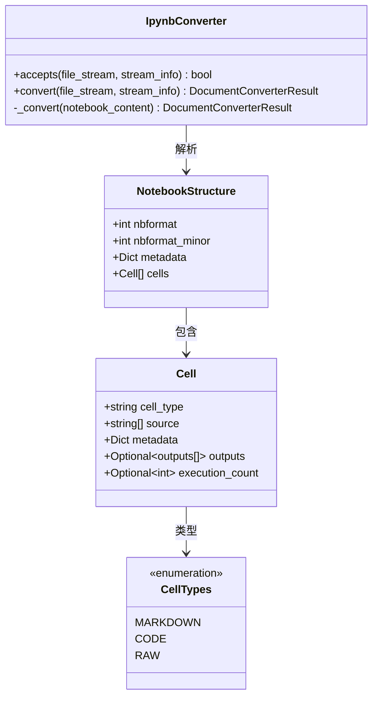

**图表来源**
- [_ipynb_converter.py](file://packages/markitdown/src/markitdown/converters/_ipynb_converter.py#L15-L97)

### 核心功能实现

#### Notebook文件识别

IPYNB转换器通过多种方式识别Jupyter Notebook文件：

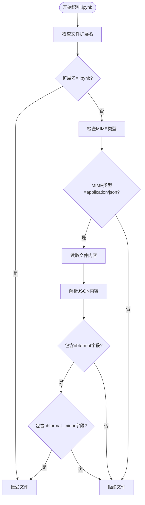

**图表来源**
- [_ipynb_converter.py](file://packages/markitdown/src/markitdown/converters/_ipynb_converter.py#L20-L45)

#### 单元格转换策略

IPYNB转换器根据单元格类型采用不同的转换策略：

| 单元格类型 | 转换规则 | 示例 |
|------------|----------|------|
| `markdown` | 直接输出源代码 | `# 标题` → `# 标题` |
| `code` | 包装为Python代码块 | ```python<br/>print("hello")<br/>``` |
| `raw` | 包装为纯文本块 | ```<br/>原始内容<br/>``` |

#### 标题提取机制

转换器实现了智能的标题提取策略：

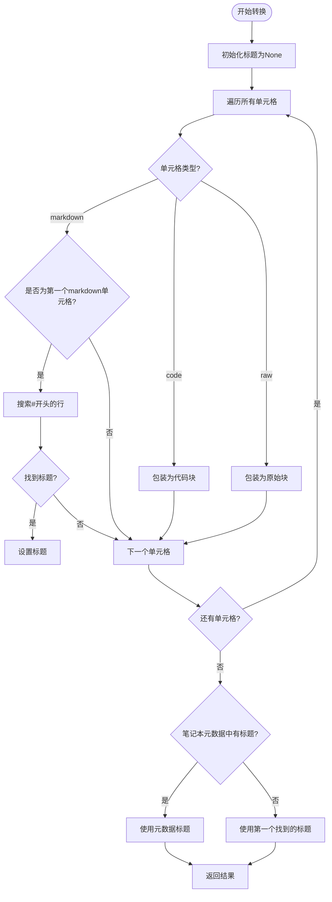

**图表来源**
- [_ipynb_converter.py](file://packages/markitdown/src/markitdown/converters/_ipynb_converter.py#L55-L96)

**节来源**
- [_ipynb_converter.py](file://packages/markitdown/src/markitdown/converters/_ipynb_converter.py#L1-L97)

## 转换器通用架构

### 基础转换器接口

所有转换器都遵循统一的接口设计，确保系统的可扩展性和一致性：

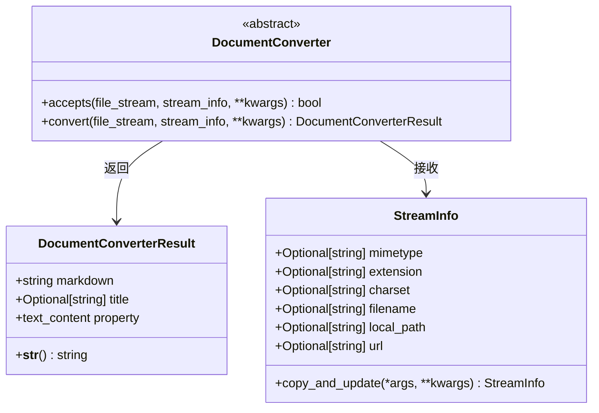

**图表来源**
- [_base_converter.py](file://packages/markitdown/src/markitdown/_base_converter.py#L35-L105)
- [_stream_info.py](file://packages/markitdown/src/markitdown/_stream_info.py#L6-L31)

### 错误处理机制

转换器实现了完善的错误处理机制：

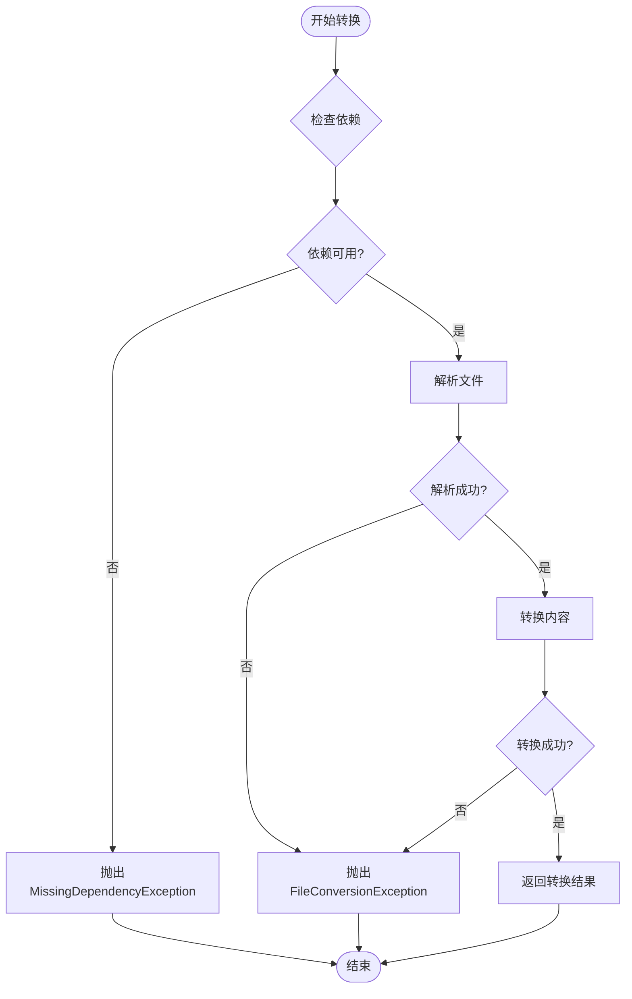

### 性能优化策略

转换器采用了多种性能优化策略：

1. **流式处理**：支持大文件的流式读取和处理
2. **增量转换**：只处理必要的部分，避免全量解析
3. **缓存机制**：对重复使用的组件进行缓存
4. **内存管理**：及时释放不需要的资源

**节来源**
- [_base_converter.py](file://packages/markitdown/src/markitdown/_base_converter.py#L1-L106)
- [_stream_info.py](file://packages/markitdown/src/markitdown/_stream_info.py#L1-L31)

## 格式特性与约束

### EPUB格式特性

#### 结构特点
- **ZIP容器**：EPUB文件本质上是ZIP压缩包
- **XML元数据**：使用OPF（Open Packaging Format）描述元数据
- **HTML内容**：章节内容以HTML格式存储
- **OEBPS目录**：内容文件的标准存放位置

#### 处理约束
- **字体嵌入**：EPUB可能包含嵌入字体，需要特殊处理
- **CSS样式**：样式信息需要转换为Markdown兼容格式
- **图片资源**：内嵌图片需要提取并转换为Markdown格式
- **目录结构**：复杂的目录层次需要正确解析

#### 元数据保留程度
| 元数据字段 | 保留程度 | 处理方式 |
|------------|----------|----------|
| 标题 | 完全保留 | 直接作为Markdown标题 |
| 作者 | 完全保留 | 列表形式显示 |
| 语言 | 完全保留 | 格式化为标记 |
| 出版社 | 完全保留 | 格式化为标记 |
| 描述 | 完全保留 | 直接输出 |
| 发布日期 | 完全保留 | 格式化为标记 |

### Outlook MSG格式特性

#### 结构特点
- **OLE结构**：基于Microsoft OLE Compound Document格式
- **二进制编码**：使用UTF-16 LE或UTF-8编码
- **流式存储**：内容以流的形式存储
- **属性系统**：使用COM属性系统存储元数据

#### 处理约束
- **编码问题**：需要智能检测和处理多种编码
- **流结构**：复杂的流层次结构需要正确解析
- **附件处理**：嵌入附件需要特殊处理
- **安全性**：需要防范恶意构造的MSG文件

#### 元数据保留程度
| 元数据字段 | 保留程度 | 处理方式 |
|------------|----------|----------|
| 发件人 | 完全保留 | 直接输出 |
| 收件人 | 完全保留 | 直接输出 |
| 主题 | 完全保留 | 作为文档标题 |
| 正文 | 完全保留 | 直接输出 |
| 发送时间 | 部分保留 | 格式化为标记 |
| 重要性 | 部分保留 | 格式化为标记 |

### Jupyter Notebook格式特性

#### 结构特点
- **JSON格式**：使用标准JSON格式存储
- **单元格结构**：内容分为不同类型单元格
- **执行历史**：包含代码执行结果
- **元数据丰富**：包含详细的笔记本元数据

#### 处理约束
- **JSON解析**：需要正确解析复杂的JSON结构
- **编码处理**：源代码可能包含多种编码
- **输出处理**：代码单元格的输出需要特殊处理
- **版本兼容**：支持不同nbformat版本

#### 元数据保留程度
| 元数据字段 | 保留程度 | 处理方式 |
|------------|----------|----------|
| 笔记本标题 | 完全保留 | 优先使用 |
| 创建时间 | 部分保留 | 格式化为标记 |
| 内核信息 | 部分保留 | 格式化为标记 |
| 单元格元数据 | 部分保留 | 根据类型处理 |

## 性能考虑

### 内存使用优化

各转换器都采用了内存友好的处理策略：

- **流式处理**：避免将整个文件加载到内存
- **延迟加载**：只在需要时才解析部分内容
- **资源管理**：及时关闭文件句柄和连接
- **垃圾回收**：主动触发垃圾回收清理临时对象

### 处理速度优化

- **并行处理**：对于大型文件，可以考虑并行处理章节
- **缓存机制**：缓存常用的转换配置和中间结果
- **预编译正则**：预编译常用的正则表达式模式
- **批量操作**：减少I/O操作次数

### 可扩展性设计

- **插件架构**：支持新的格式转换器插件
- **配置驱动**：通过配置文件控制转换行为
- **接口标准化**：统一的转换器接口便于扩展
- **错误隔离**：单个转换器失败不影响整体系统

## 故障排除指南

### 常见问题及解决方案

#### EPUB转换问题

**问题**：EPUB文件无法识别
- **原因**：文件损坏或格式不标准
- **解决方案**：验证EPUB文件完整性，检查ZIP结构

**问题**：章节内容缺失
- **原因**：spine顺序或清单项有问题
- **解决方案**：检查content.opf中的spine和manifest配置

**问题**：元数据提取失败
- **原因**：XML命名空间或编码问题
- **解决方案**：检查XML命名空间声明和字符编码

#### MSG转换问题

**问题**：依赖缺失
- **原因**：olefile库未安装
- **解决方案**：安装olefile库或相关依赖

**问题**：编码错误
- **原因**：MSG文件使用非标准编码
- **解决方案**：检查文件编码，尝试不同解码方式

**问题**：流不存在
- **原因**：MSG文件结构异常
- **解决方案**：验证MSG文件结构，检查必需流是否存在

#### IPYNB转换问题

**问题**：JSON解析失败
- **原因**：文件格式损坏或编码问题
- **解决方案**：验证JSON格式，检查文件编码

**问题**：单元格类型未知
- **原因**：新版本nbformat引入了新类型
- **解决方案**：更新转换器支持新类型

**问题**：标题提取失败
- **原因**：没有markdown单元格或格式不规范
- **解决方案**：检查笔记本结构，提供默认标题

### 调试技巧

1. **启用详细日志**：设置适当的日志级别查看详细信息
2. **分步调试**：逐步检查每个处理阶段的结果
3. **文件验证**：验证输入文件的格式和完整性
4. **边界测试**：测试极端情况和边界条件

**节来源**
- [_epub_converter.py](file://packages/markitdown/src/markitdown/converters/_epub_converter.py#L1-L147)
- [_outlook_msg_converter.py](file://packages/markitdown/src/markitdown/converters/_outlook_msg_converter.py#L1-L150)
- [_ipynb_converter.py](file://packages/markitdown/src/markitdown/converters/_ipynb_converter.py#L1-L97)

## 总结

markitdown项目的三个专用转换器——EPUB、Outlook MSG和Jupyter Notebook转换器，展示了如何通过模块化设计和统一接口来处理复杂的文档格式。这些转换器不仅满足了专业场景的需求，还体现了以下设计原则：

### 设计优势

1. **统一接口**：所有转换器都遵循相同的`DocumentConverter`接口，确保了一致性和可扩展性
2. **模块化架构**：每个转换器专注于特定格式，便于维护和扩展
3. **错误处理**：完善的异常处理机制确保系统的稳定性
4. **性能优化**：流式处理和内存管理策略提高了处理效率
5. **格式兼容**：支持多种变体和版本，具有良好的兼容性

### 应用价值

- **专业文档处理**：满足学术、商业和技术文档的专业需求
- **内容迁移**：支持不同格式之间的内容迁移和转换
- **数据分析**：为文档内容分析和处理提供统一格式
- **知识管理**：支持复杂文档的知识抽取和结构化处理

### 未来发展方向

1. **格式扩展**：支持更多专业文档格式
2. **性能提升**：进一步优化处理速度和内存使用
3. **功能增强**：增加更多的格式特性和元数据处理
4. **集成优化**：与其他文档处理工具的更好集成

这些转换器的成功实现证明了markitdown项目在处理复杂文档格式方面的技术实力，为专业文档处理领域提供了可靠的解决方案。