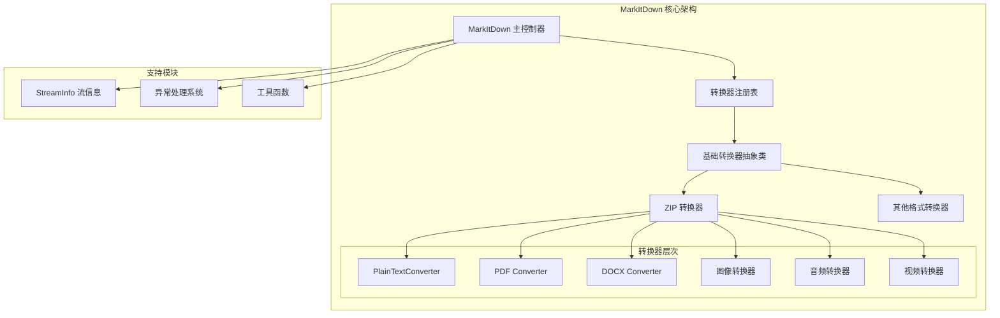
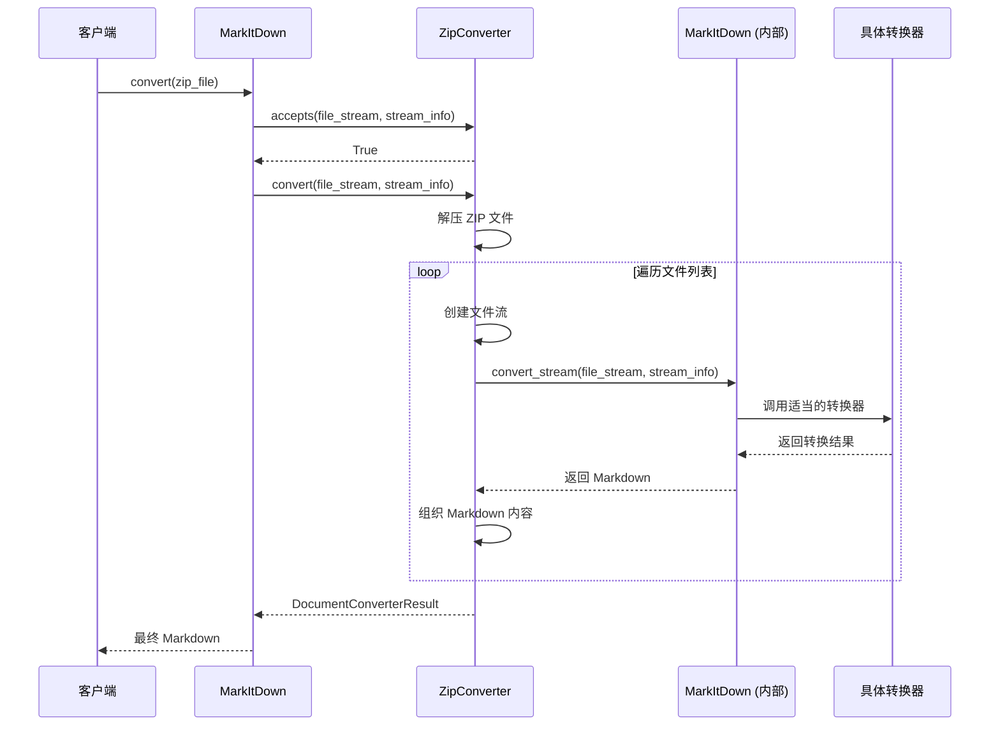
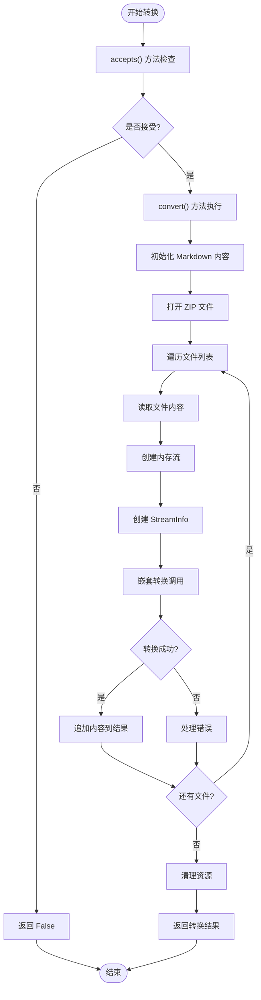
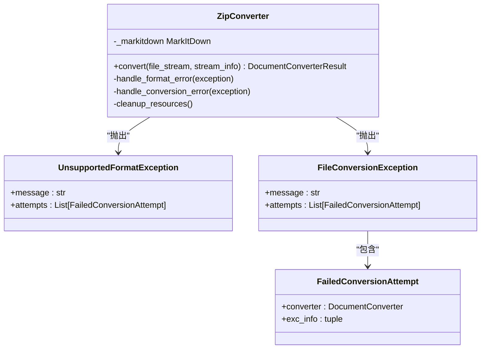
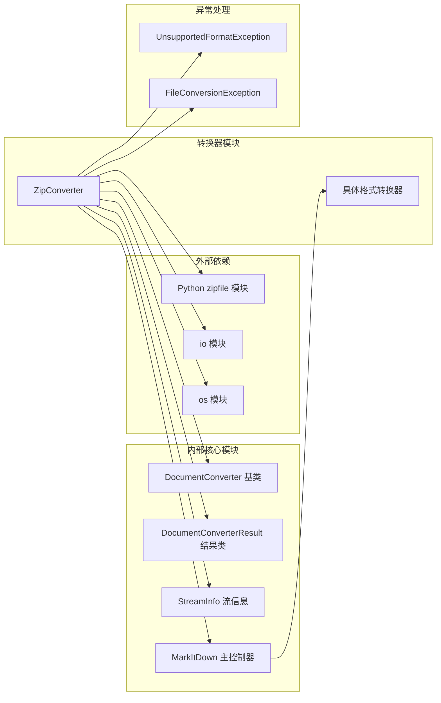

# 压缩文件格式支持文档

<cite>
**本文档中引用的文件**
- [_zip_converter.py](file://packages/markitdown/src/markitdown/converters/_zip_converter.py)
- [_base_converter.py](file://packages/markitdown/src/markitdown/_base_converter.py)
- [_markitdown.py](file://packages/markitdown/src/markitdown/_markitdown.py)
- [_exceptions.py](file://packages/markitdown/src/markitdown/_exceptions.py)
- [_stream_info.py](file://packages/markitdown/src/markitdown/_stream_info.py)
- [__init__.py](file://packages/markitdown/src/markitdown/converters/__init__.py)
- [_test_vectors.py](file://packages/markitdown/tests/_test_vectors.py)
</cite>

## 目录
1. [简介](#简介)
2. [项目结构概览](#项目结构概览)
3. [核心组件分析](#核心组件分析)
4. [架构概述](#架构概述)
5. [详细组件分析](#详细组件分析)
6. [依赖关系分析](#依赖关系分析)
7. [性能考虑](#性能考虑)
8. [故障排除指南](#故障排除指南)
9. [结论](#结论)

## 简介

MarkItDown 的 `_zip_converter.py` 模块是一个专门设计用于处理 ZIP 文件格式的转换器，它体现了系统模块化设计的核心理念。该转换器作为"容器解析器"，负责解压缩 ZIP 归档文件，遍历内部文件结构，并对每个成员文件递归应用 MarkItDown 的转换流程。通过与其他格式转换器的协作，它能够处理包含多种文档类型的复杂 ZIP 包，最终生成结构化的 Markdown 输出。

该转换器的设计充分考虑了现代文档处理的需求，包括对嵌套压缩、加密 ZIP 或大文件包的资源消耗和超时控制机制。它不仅维护了原始文件结构在标题中的映射，还确保了转换过程中格式的完整性和临时文件的安全清理。

## 项目结构概览

MarkItDown 项目采用分层架构设计，其中压缩文件处理功能位于转换器层次结构的中心位置。整个项目结构体现了清晰的职责分离和模块化设计原则。

**图表来源**
- [_markitdown.py](file://packages/markitdown/src/markitdown/_markitdown.py#L100-L150)
- [_base_converter.py](file://packages/markitdown/src/markitdown/_base_converter.py#L41-L105)

**章节来源**
- [_markitdown.py](file://packages/markitdown/src/markitdown/_markitdown.py#L100-L200)
- [__init__.py](file://packages/markitdown/src/markitdown/converters/__init__.py#L1-L48)

## 核心组件分析

### ZipConverter 类设计

ZipConverter 类是压缩文件处理的核心实现，它继承自 DocumentConverter 抽象基类，遵循统一的转换器接口规范。该类的设计体现了以下关键特性：

#### 接收格式识别
- **MIME 类型检测**: 支持 `application/zip` 前缀的所有 MIME 类型
- **文件扩展名验证**: 识别 `.zip` 扩展名的文件
- **流信息匹配**: 基于 StreamInfo 对象的元数据进行格式判断

#### 转换流程控制
- **ZIP 文件解压**: 使用 Python 标准库 zipfile 模块进行安全解压
- **文件列表遍历**: 递归处理 ZIP 内部的所有文件成员
- **流式处理**: 将解压内容转换为内存流以供后续处理

#### 错误处理机制
- **格式不支持**: 忽略无法识别的文件类型
- **转换失败**: 捕获并记录转换过程中的异常
- **资源清理**: 确保临时资源的正确释放

**章节来源**
- [_zip_converter.py](file://packages/markitdown/src/markitdown/converters/_zip_converter.py#L18-L117)

## 架构概述

MarkItDown 的压缩文件处理架构采用了典型的管道模式，其中 ZipConverter 充当数据流的入口点，协调多个转换器完成复杂的文档处理任务。

**图表来源**
- [_zip_converter.py](file://packages/markitdown/src/markitdown/converters/_zip_converter.py#L75-L115)
- [_markitdown.py](file://packages/markitdown/src/markitdown/_markitdown.py#L300-L400)

## 详细组件分析

### 转换器生命周期管理

ZipConverter 的工作流程严格遵循转换器的生命周期模式，确保资源的有效管理和错误的优雅处理。

**图表来源**
- [_zip_converter.py](file://packages/markitdown/src/markitdown/converters/_zip_converter.py#L75-L115)

### 文件处理策略

ZipConverter 实现了智能的文件处理策略，能够应对各种复杂的文件场景：

#### 文件类型识别
- **扩展名提取**: 从文件路径中提取文件扩展名
- **MIME 类型推断**: 基于扩展名推断可能的 MIME 类型
- **转换器选择**: 根据文件类型自动选择合适的转换器

#### 内容组织结构
- **层次化标题**: 使用文件路径作为 Markdown 标题
- **内容分隔**: 在不同文件内容之间添加适当的分隔符
- **格式保持**: 确保转换后的格式与原始内容一致

**章节来源**
- [_zip_converter.py](file://packages/markitdown/src/markitdown/converters/_zip_converter.py#L95-L115)

### 异常处理机制

系统实现了多层次的异常处理机制，确保在遇到问题时能够优雅地降级处理：

**图表来源**
- [_exceptions.py](file://packages/markitdown/src/markitdown/_exceptions.py#L30-L76)
- [_zip_converter.py](file://packages/markitdown/src/markitdown/converters/_zip_converter.py#L105-L115)

**章节来源**
- [_exceptions.py](file://packages/markitdown/src/markitdown/_exceptions.py#L30-L76)
- [_zip_converter.py](file://packages/markitdown/src/markitdown/converters/_zip_converter.py#L105-L115)

## 依赖关系分析

MarkItDown 的压缩文件处理功能依赖于多个核心模块，形成了一个完整的生态系统。

**图表来源**
- [_zip_converter.py](file://packages/markitdown/src/markitdown/converters/_zip_converter.py#L1-L10)
- [_markitdown.py](file://packages/markitdown/src/markitdown/_markitdown.py#L1-L50)

**章节来源**
- [_zip_converter.py](file://packages/markitdown/src/markitdown/converters/_zip_converter.py#L1-L10)
- [_base_converter.py](file://packages/markitdown/src/markitdown/_base_converter.py#L1-L20)

## 性能考虑

### 资源消耗优化

ZipConverter 在处理大型 ZIP 文件时采用了多项优化策略：

#### 内存管理
- **流式处理**: 使用 BytesIO 进行内存流处理，避免一次性加载整个文件
- **及时清理**: 在处理完每个文件后立即释放相关资源
- **异常安全**: 确保在异常情况下也能正确清理资源

#### 处理效率
- **早期过滤**: 在转换前通过 accepts() 方法进行快速格式检查
- **错误隔离**: 单个文件的转换失败不会影响其他文件的处理
- **并发友好**: 设计上支持并发处理多个独立的 ZIP 文件

### 大文件处理策略

对于包含大量文件或超大文件的 ZIP 包，系统采用了以下策略：

#### 分批处理
- **文件大小检查**: 在处理前评估文件大小
- **内存使用监控**: 监控内存使用情况，避免内存溢出
- **进度报告**: 提供处理进度反馈

#### 超时控制
- **操作超时**: 为每个文件的转换设置合理的时间限制
- **资源超时**: 监控资源使用时间，防止长时间占用
- **优雅降级**: 在超时时提供部分处理结果

## 故障排除指南

### 常见问题及解决方案

#### ZIP 文件解压失败
**症状**: 转换过程中出现解压错误
**原因**: ZIP 文件损坏或格式不标准
**解决方案**: 
- 验证 ZIP 文件的完整性
- 检查文件是否被加密
- 尝试使用其他解压工具验证

#### 内存不足错误
**症状**: 处理大型 ZIP 文件时出现内存错误
**原因**: ZIP 文件过大或系统内存不足
**解决方案**:
- 分批处理大型 ZIP 文件
- 增加系统可用内存
- 启用流式处理模式

#### 文件类型不支持
**症状**: 某些文件类型无法转换
**原因**: 缺少相应的转换器或依赖项
**解决方案**:
- 检查所需的转换器是否已启用
- 安装必要的依赖项
- 更新 MarkItDown 版本

**章节来源**
- [_exceptions.py](file://packages/markitdown/src/markitdown/_exceptions.py#L1-L76)
- [_zip_converter.py](file://packages/markitdown/src/markitdown/converters/_zip_converter.py#L105-L115)

## 结论

MarkItDown 的 `_zip_converter.py` 模块代表了现代文档处理系统的设计精髓。它不仅提供了强大的 ZIP 文件处理能力，更重要的是展示了系统模块化设计的优势。

作为"容器解析器"，ZipConverter 展现了以下核心价值：
- **统一接口**: 通过 DocumentConverter 抽象类提供一致的处理接口
- **协作处理**: 与其他转换器协同工作，实现复杂文档的统一处理
- **错误恢复**: 在遇到问题时能够优雅地降级处理
- **资源管理**: 确保临时资源的正确清理和内存的有效利用

该设计使得 MarkItDown 能够处理包含多种文档类型的复杂 ZIP 包，为用户提供了一个强大而可靠的文档转换平台。通过模块化的设计，系统具备了良好的可扩展性和维护性，能够适应不断变化的文档处理需求。