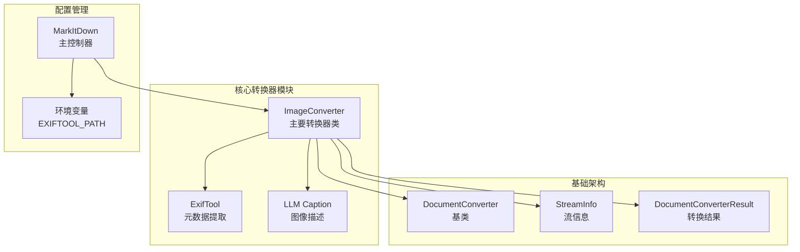
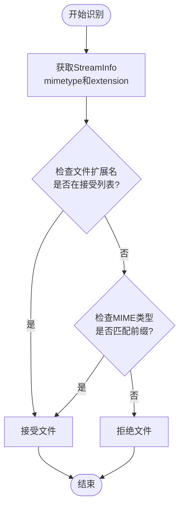
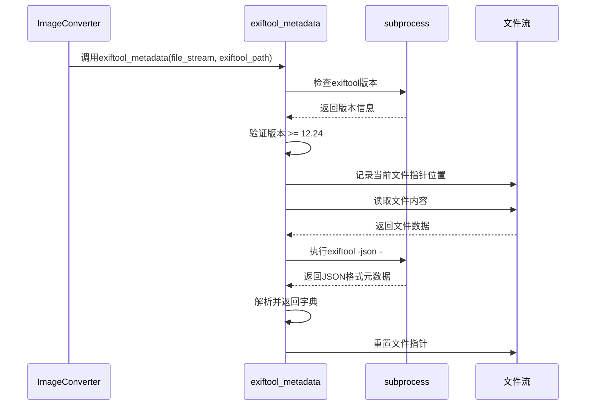
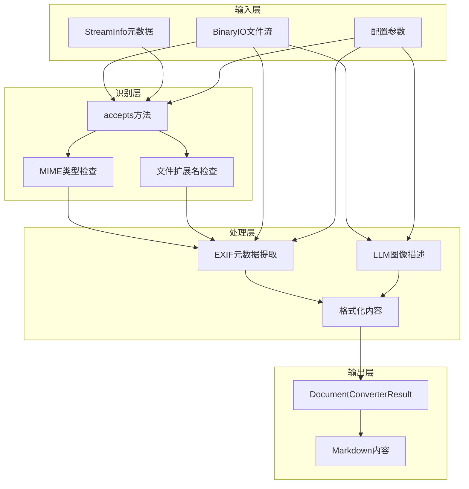
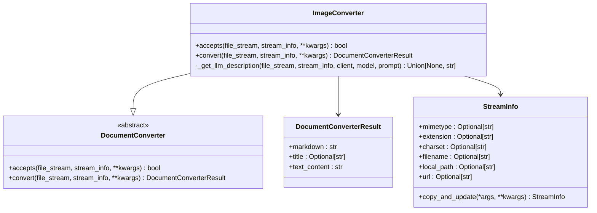
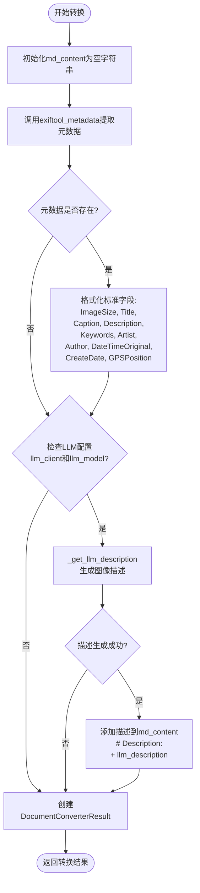
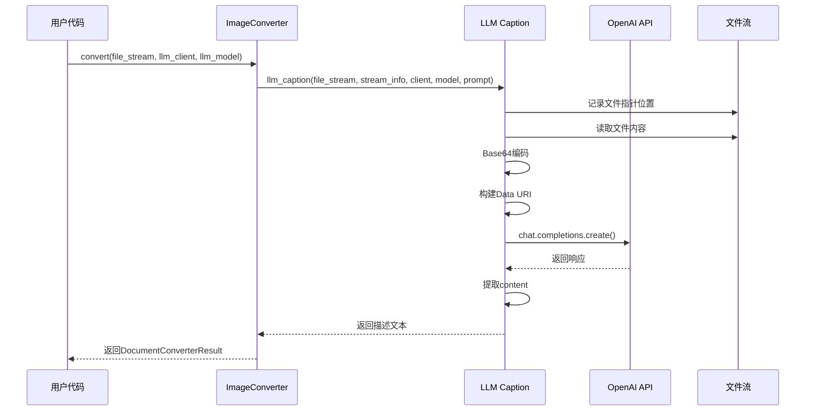
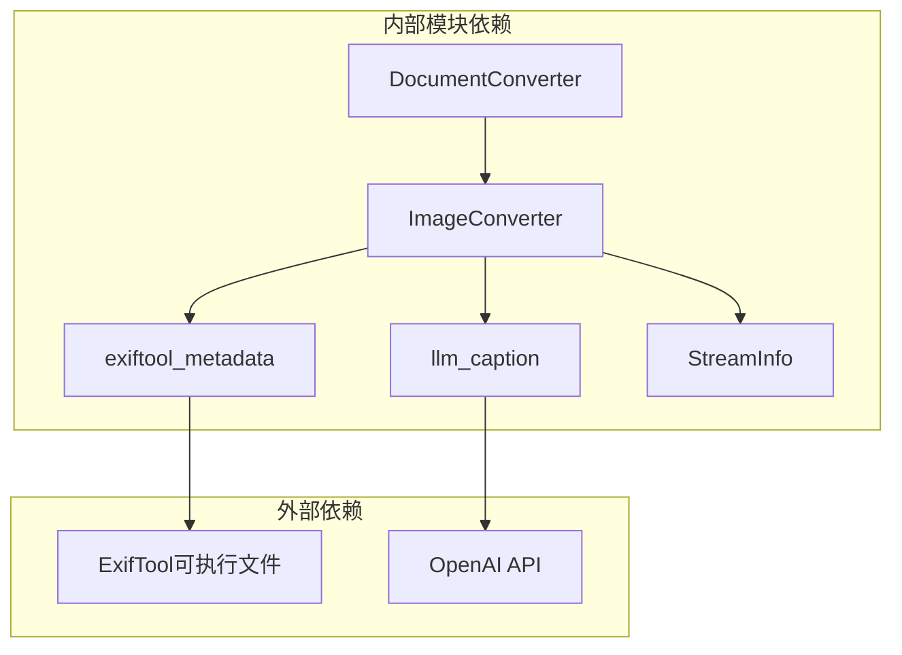

# 图像格式转换器详细说明

<cite>
**本文档中引用的文件**
- [_image_converter.py](file://packages/markitdown/src/markitdown/converters/_image_converter.py)
- [_exiftool.py](file://packages/markitdown/src/markitdown/converters/_exiftool.py)
- [_llm_caption.py](file://packages/markitdown/src/markitdown/converters/_llm_caption.py)
- [_base_converter.py](file://packages/markitdown/src/markitdown/_base_converter.py)
- [_stream_info.py](file://packages/markitdown/src/markitdown/_stream_info.py)
- [_markitdown.py](file://packages/markitdown/src/markitdown/_markitdown.py)
- [test_module_misc.py](file://packages/markitdown/tests/test_module_misc.py)
</cite>

## 目录
1. [简介](#简介)
2. [项目结构概览](#项目结构概览)
3. [核心组件分析](#核心组件分析)
4. [架构概览](#架构概览)
5. [详细组件分析](#详细组件分析)
6. [依赖关系分析](#依赖关系分析)
7. [性能考量与优化](#性能考量与优化)
8. [故障排除指南](#故障排除指南)
9. [结论](#结论)

## 简介

ImageConverter是markitdown项目中的核心图像处理组件，专门负责将JPG、PNG等图像文件转换为Markdown格式。该转换器集成了EXIF元数据提取和多模态语言模型(LLM)图像描述生成功能，提供了全面的图像内容理解和转换能力。

## 项目结构概览

ImageConverter相关的文件组织结构如下：



**图表来源**
- [_image_converter.py](file://packages/markitdown/src/markitdown/converters/_image_converter.py#L1-L139)
- [_base_converter.py](file://packages/markitdown/src/markitdown/_base_converter.py#L1-L106)
- [_markitdown.py](file://packages/markitdown/src/markitdown/_markitdown.py#L140-L200)

**章节来源**
- [_image_converter.py](file://packages/markitdown/src/markitdown/converters/_image_converter.py#L1-L139)
- [_exiftool.py](file://packages/markitdown/src/markitdown/converters/_exiftool.py#L1-L53)
- [_llm_caption.py](file://packages/markitdown/src/markitdown/converters/_llm_caption.py#L1-L51)

## 核心组件分析

### 接受机制 (Accepts Method)

ImageConverter采用双重识别机制来确定是否接受特定的图像文件：

#### MIME类型识别
系统维护了两个关键的接受列表：
- **MIME类型前缀列表**: 包含`image/jpeg`和`image/png`前缀
- **文件扩展名列表**: 支持`.jpg`、`.jpeg`和`.png`扩展名

#### 识别逻辑流程


**图表来源**
- [_image_converter.py](file://packages/markitdown/src/markitdown/converters/_image_converter.py#L20-L35)

### EXIF元数据提取机制

#### exiftool_metadata函数详解

EXIF元数据提取通过专门的`exiftool_metadata`函数实现，该函数具有以下特性：

##### 版本验证机制
- **最低版本要求**: 12.24
- **CVE防护**: 防止CVE-2021-22204漏洞
- **自动检测**: 使用子进程调用exiftool -ver命令

##### 数据提取流程


**图表来源**
- [_exiftool.py](file://packages/markitdown/src/markitdown/converters/_exiftool.py#L10-L52)

**章节来源**
- [_image_converter.py](file://packages/markitdown/src/markitdown/converters/_image_converter.py#L46-L60)
- [_exiftool.py](file://packages/markitdown/src/markitdown/converters/_exiftool.py#L10-L52)

## 架构概览

ImageConverter的整体架构体现了模块化设计原则，各组件职责明确：



**图表来源**
- [_image_converter.py](file://packages/markitdown/src/markitdown/converters/_image_converter.py#L15-L139)
- [_base_converter.py](file://packages/markitdown/src/markitdown/_base_converter.py#L15-L106)

## 详细组件分析

### ImageConverter类分析

#### 类结构图


**图表来源**
- [_image_converter.py](file://packages/markitdown/src/markitdown/converters/_image_converter.py#L15-L139)
- [_base_converter.py](file://packages/markitdown/src/markitdown/_base_converter.py#L8-L106)
- [_stream_info.py](file://packages/markitdown/src/markitdown/_stream_info.py#L6-L33)

#### convert方法详细流程

convert方法执行完整的图像转换流程：



**图表来源**
- [_image_converter.py](file://packages/markitdown/src/markitdown/converters/_image_converter.py#L40-L82)

### LLM图像描述功能分析

#### _get_llm_description方法详解

当配置了llm_client和llm_model参数时，系统会调用多模态LLM生成图像描述：

##### Base64编码流程
```mermaid
sequenceDiagram
participant IC as ImageConverter
participant FS as 文件流
participant BE as Base64编码器
participant URI as Data URI构建器
participant API as OpenAI API
IC->>FS : 记录当前文件指针位置
IC->>FS : 读取文件内容
FS-->>IC : 返回二进制数据
IC->>BE : base64.b64encode(data)
BE-->>IC : 返回Base64字符串
IC->>FS : 重置文件指针到原始位置
IC->>URI : 构建data URI格式
URI-->>IC : data : image/jpeg;base64,...
IC->>API : 发送ChatCompletion请求
API-->>IC : 返回描述文本
```

**图表来源**
- [_image_converter.py](file://packages/markitdown/src/markitdown/converters/_image_converter.py#L84-L137)

##### 完整的LLM调用序列


**图表来源**
- [_image_converter.py](file://packages/markitdown/src/markitdown/converters/_image_converter.py#L62-L82)
- [_llm_caption.py](file://packages/markitdown/src/markitdown/converters/_llm_caption.py#L8-L50)

**章节来源**
- [_image_converter.py](file://packages/markitdown/src/markitdown/converters/_image_converter.py#L84-L137)
- [_llm_caption.py](file://packages/markitdown/src/markitdown/converters/_llm_caption.py#L8-L50)

## 依赖关系分析

### 组件间依赖关系



**图表来源**
- [_image_converter.py](file://packages/markitdown/src/markitdown/converters/_image_converter.py#L1-L10)
- [_exiftool.py](file://packages/markitdown/src/markitdown/converters/_exiftool.py#L1-L5)
- [_llm_caption.py](file://packages/markitdown/src/markitdown/converters/_llm_caption.py#L1-L5)

### 配置参数传递机制

MarkItDown主控制器负责配置参数的传递：

| 参数名称 | 类型 | 描述 | 默认值 |
|---------|------|------|--------|
| `exiftool_path` | Union[str, None] | ExifTool可执行文件路径 | None |
| `llm_client` | Any | LLM客户端实例 | None |
| `llm_model` | Union[str, None] | LLM模型名称 | None |
| `llm_prompt` | Union[str, None] | 自定义提示词 | None |

**章节来源**
- [_markitdown.py](file://packages/markitdown/src/markitdown/_markitdown.py#L140-L160)
- [_image_converter.py](file://packages/markitdown/src/markitdown/converters/_image_converter.py#L46-L82)

## 性能考量与优化

### 文件指针管理

ImageConverter实现了智能的文件指针管理机制：

#### 原始位置保存与恢复
- **保存位置**: 使用`file_stream.tell()`记录当前位置
- **异常安全**: 通过try-finally块确保文件指针恢复
- **原子操作**: 在整个操作过程中保持文件状态一致性

#### 内存使用优化
- **流式处理**: 直接从BinaryIO读取，避免完整加载到内存
- **及时释放**: 处理完成后立即释放资源
- **错误处理**: 异常情况下也能正确恢复文件状态

### 错误处理策略

#### ExifTool相关错误
- **版本不兼容**: 检测到低于12.24的版本时抛出RuntimeError
- **执行失败**: 子进程调用失败时捕获CalledProcessError
- **解析错误**: JSON解析失败时捕获ValueError

#### LLM调用错误
- **网络超时**: OpenAI API调用可能的网络问题
- **认证失败**: API密钥无效或权限不足
- **内容限制**: 图像大小超过API限制

**章节来源**
- [_exiftool.py](file://packages/markitdown/src/markitdown/converters/_exiftool.py#L15-L52)
- [_image_converter.py](file://packages/markitdown/src/markitdown/converters/_image_converter.py#L105-L137)

## 故障排除指南

### 常见问题与解决方案

#### ExifTool相关问题

| 问题类型 | 症状 | 解决方案 |
|---------|------|----------|
| 可执行文件未找到 | RuntimeError: Failed to verify ExifTool version | 设置正确的exiftool_path或安装ExifTool |
| 版本过低 | CVE警告信息 | 升级到ExifTool 12.24或更高版本 |
| 权限不足 | subprocess.CalledProcessError | 确保ExifTool有执行权限 |

#### LLM相关问题

| 问题类型 | 症状 | 解决方案 |
|---------|------|----------|
| API密钥无效 | OpenAI认证错误 | 检查llm_client配置和API密钥 |
| 模型不可用 | Model not found错误 | 确认llm_model名称正确 |
| 请求超时 | 网络连接超时 | 检查网络连接和API配额 |

#### 配置示例

##### 基础配置
```python
# 最小配置 - 仅支持基本格式识别
converter = ImageConverter()
```

##### 完整配置
```python
# 启用EXIF元数据提取
import os
os.environ["EXIFTOOL_PATH"] = "/usr/local/bin/exiftool"

# 配置LLM支持
import openai
client = openai.OpenAI(api_key="your-api-key")

# 创建转换器实例
converter = ImageConverter(
    exiftool_path="/usr/local/bin/exiftool",
    llm_client=client,
    llm_model="gpt-4o",
    llm_prompt="请为这张图片写一个详细的描述"
)
```

**章节来源**
- [_exiftool.py](file://packages/markitdown/src/markitdown/converters/_exiftool.py#L15-L35)
- [test_module_misc.py](file://packages/markitdown/tests/test_module_misc.py#L351-L384)

## 结论

ImageConverter展现了现代文档转换器的设计精髓，通过模块化架构实现了功能的灵活组合：

### 主要优势
1. **双重识别机制**: 同时支持MIME类型和文件扩展名识别
2. **可选功能集成**: EXIF元数据提取和LLM图像描述可独立启用
3. **健壮的错误处理**: 完善的异常处理和资源管理
4. **灵活的配置方式**: 支持多种配置途径和环境变量

### 设计亮点
- **文件指针安全**: 智能的位置保存和恢复机制
- **版本兼容性**: ExifTool版本验证防止安全漏洞
- **流式处理**: 支持大文件的高效处理
- **插件化架构**: 易于扩展和定制

### 应用场景
- **文档自动化**: 将图像转换为结构化文档
- **内容管理**: 自动生成图像描述和元数据
- **AI辅助**: 结合多模态LLM提升内容质量
- **批量处理**: 支持大规模图像文件处理

ImageConverter的设计充分体现了现代软件工程的最佳实践，为图像内容的数字化和智能化处理提供了强大而灵活的解决方案。