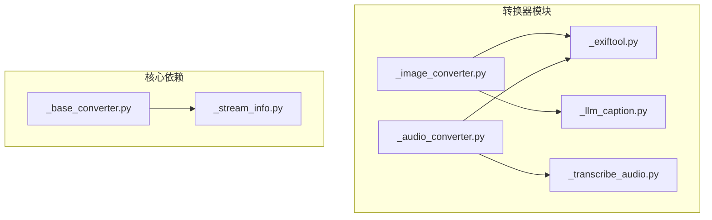
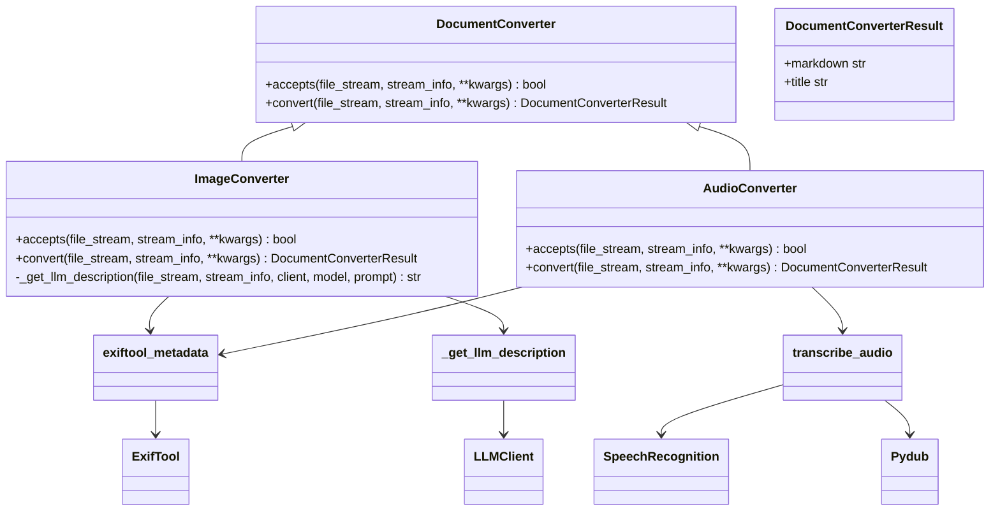
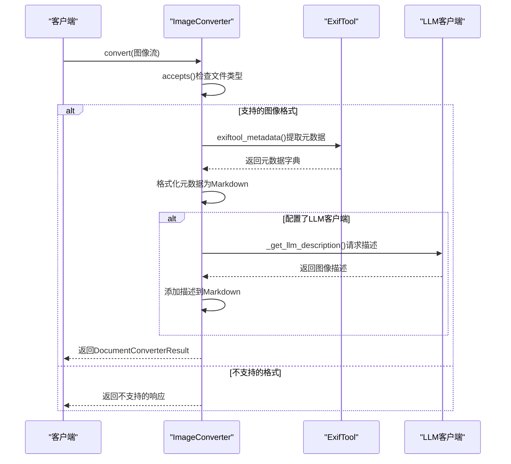
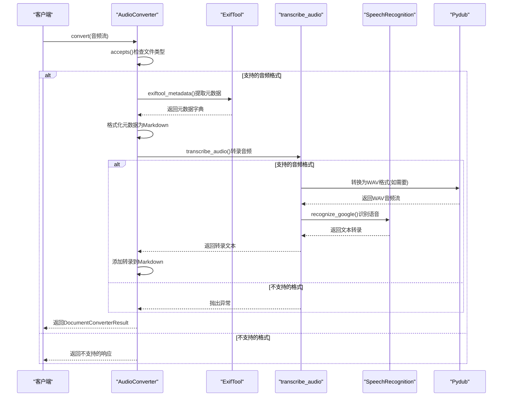
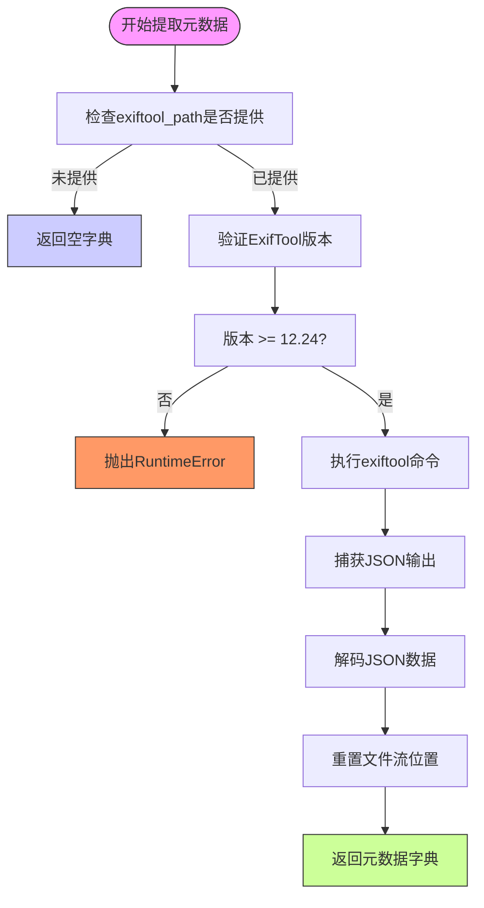
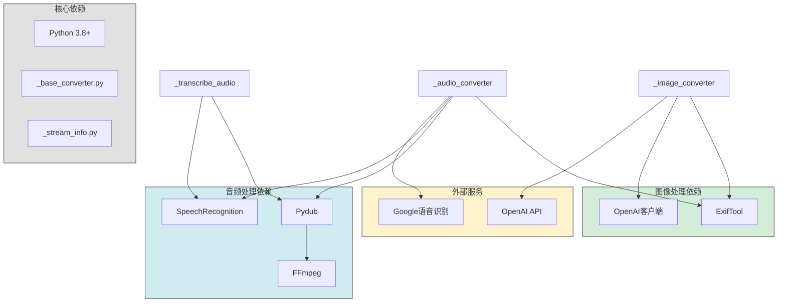

# 多媒体格式

<cite>
**本文档引用的文件**
- [\_image_converter.py](file://packages/markitdown/src/markitdown/converters/_image_converter.py)
- [\_audio_converter.py](file://packages/markitdown/src/markitdown/converters/_audio_converter.py)
- [\_exiftool.py](file://packages/markitdown/src/markitdown/converters/_exiftool.py)
- [\_llm_caption.py](file://packages/markitdown/src/markitdown/converters/_llm_caption.py)
- [\_transcribe_audio.py](file://packages/markitdown/src/markitdown/converters/_transcribe_audio.py)
- [\_base_converter.py](file://packages/markitdown/src/markitdown/_base_converter.py)
- [\_stream_info.py](file://packages/markitdown/src/markitdown/_stream_info.py)
- [test_module_misc.py](file://packages/markitdown/tests/test_module_misc.py)
- [\_test_vectors.py](file://packages/markitdown/tests/_test_vectors.py)
</cite>

## 目录
1. [简介](#简介)
2. [项目结构](#项目结构)
3. [核心组件](#核心组件)
4. [架构概述](#架构概述)
5. [详细组件分析](#详细组件分析)
6. [依赖分析](#依赖分析)
7. [性能考虑](#性能考虑)
8. [故障排除指南](#故障排除指南)
9. [结论](#结论)

## 简介
本文档全面介绍了多媒体格式转换系统，重点阐述了图像和音频文件的处理能力。系统能够处理JPG、PNG、WAV、MP3等多种媒体格式，通过提取元数据和调用辅助服务来增强内容可读性。与直接生成丰富文本的转换器不同，这些多媒体转换器专注于提取和增强元数据，为用户提供更丰富的上下文信息。

## 项目结构
多媒体格式转换功能位于`packages/markitdown/src/markitdown/converters/`目录下，主要由专门的转换器模块组成。这些转换器遵循统一的基类接口，但针对不同媒体类型实现了特定的处理逻辑。

**图示来源**
- [_image_converter.py](file://packages/markitdown/src/markitdown/converters/_image_converter.py)
- [_audio_converter.py](file://packages/markitdown/src/markitdown/converters/_audio_converter.py)
- [_exiftool.py](file://packages/markitdown/src/markitdown/converters/_exiftool.py)
- [_llm_caption.py](file://packages/markitdown/src/markitdown/converters/_llm_caption.py)
- [_transcribe_audio.py](file://packages/markitdown/src/markitdown/converters/_transcribe_audio.py)

**本节来源**
- [packages/markitdown/src/markitdown/converters/](file://packages/markitdown/src/markitdown/converters/)

## 核心组件
多媒体格式转换系统的核心组件包括图像转换器、音频转换器以及支持元数据提取和内容生成的辅助模块。这些组件协同工作，将原始媒体文件转换为包含丰富元数据的Markdown格式内容。

**本节来源**
- [\_image_converter.py](file://packages/markitdown/src/markitdown/converters/_image_converter.py#L1-L138)
- [\_audio_converter.py](file://packages/markitdown/src/markitdown/converters/_audio_converter.py#L1-L101)

## 架构概述
多媒体转换系统的架构采用模块化设计，核心是基于`DocumentConverter`基类的转换器模式。每个转换器负责特定媒体类型的处理，通过`accepts`方法判断是否支持特定文件，然后在`convert`方法中执行实际的转换逻辑。

**图示来源**
- [\_base_converter.py](file://packages/markitdown/src/markitdown/_base_converter.py#L1-L105)
- [\_image_converter.py](file://packages/markitdown/src/markitdown/converters/_image_converter.py#L1-L138)
- [\_audio_converter.py](file://packages/markitdown/src/markitdown/converters/_audio_converter.py#L1-L101)

## 详细组件分析

### 图像转换器分析
图像转换器负责处理JPG和PNG格式的图像文件，通过提取元数据和可选的LLM描述生成Markdown内容。该组件首先验证文件类型，然后提取EXIF元数据，最后可选择性地调用多模态LLM生成图像描述。

**图示来源**
- [\_image_converter.py](file://packages/markitdown/src/markitdown/converters/_image_converter.py#L1-L138)
- [\_exiftool.py](file://packages/markitdown/src/markitdown/converters/_exiftool.py#L1-L52)
- [\_llm_caption.py](file://packages/markitdown/src/markitdown/converters/_llm_caption.py#L1-L50)

**本节来源**
- [\_image_converter.py](file://packages/markitdown/src/markitdown/converters/_image_converter.py#L1-L138)

### 音频转换器分析
音频转换器处理WAV、MP3等音频文件，通过提取元数据和语音转文字功能生成Markdown内容。该组件支持多种音频格式，并集成语音识别服务将音频内容转换为文本。

**图示来源**
- [\_audio_converter.py](file://packages/markitdown/src/markitdown/converters/_audio_converter.py#L1-L101)
- [\_transcribe_audio.py](file://packages/markitdown/src/markitdown/converters/_transcribe_audio.py#L1-L49)
- [\_exiftool.py](file://packages/markitdown/src/markitdown/converters/_exiftool.py#L1-L52)

**本节来源**
- [\_audio_converter.py](file://packages/markitdown/src/markitdown/converters/_audio_converter.py#L1-L101)

### 元数据提取分析
元数据提取功能通过ExifTool实现，为图像和音频文件提供详细的属性信息。该组件确保元数据提取的安全性，验证ExifTool版本以防止已知漏洞。

**图示来源**
- [\_exiftool.py](file://packages/markitdown/src/markitdown/converters/_exiftool.py#L1-L52)

**本节来源**
- [\_exiftool.py](file://packages/markitdown/src/markitdown/converters/_exiftool.py#L1-L52)

## 依赖分析
多媒体转换器依赖多个外部工具和库来实现完整功能。这些依赖分为核心依赖、可选依赖和外部服务三类。

**图示来源**
- [\_image_converter.py](file://packages/markitdown/src/markitdown/converters/_image_converter.py)
- [\_audio_converter.py](file://packages/markitdown/src/markitdown/converters/_audio_converter.py)
- [\_transcribe_audio.py](file://packages/markitdown/src/markitdown/converters/_transcribe_audio.py)
- [\_exiftool.py](file://packages/markitdown/src/markitdown/converters/_exiftool.py)

**本节来源**
- [\_transcribe_audio.py](file://packages/markitdown/src/markitdown/converters/_transcribe_audio.py#L1-L49)
- [test_module_misc.py](file://packages/markitdown/tests/test_module_misc.py#L315-L349)

## 性能考虑
多媒体文件转换涉及I/O操作、外部进程调用和网络请求，这些因素都会影响整体性能。大文件处理时，内存使用和处理时间需要特别关注。

**本节来源**
- [\_image_converter.py](file://packages/markitdown/src/markitdown/converters/_image_converter.py)
- [\_audio_converter.py](file://packages/markitdown/src/markitdown/converters/_audio_converter.py)

## 故障排除指南
当多媒体转换出现问题时，可以从以下几个方面进行排查：

1. **依赖项检查**：确保所有必需的外部工具已正确安装和配置
2. **文件格式验证**：确认文件格式在支持的列表中
3. **权限问题**：检查对ExifTool等外部工具的执行权限
4. **网络连接**：对于需要网络服务的功能，确保网络连接正常

**本节来源**
- [\_exiftool.py](file://packages/markitdown/src/markitdown/converters/_exiftool.py#L1-L52)
- [\_transcribe_audio.py](file://packages/markitdown/src/markitdown/converters/_transcribe_audio.py#L1-L49)
- [test_module_misc.py](file://packages/markitdown/tests/test_module_misc.py#L353-L367)

## 结论
多媒体格式转换系统通过模块化设计实现了图像和音频文件的高效处理。系统利用ExifTool提取元数据，结合LLM和语音识别服务增强内容可读性。与直接生成丰富文本的转换器不同，这些多媒体转换器专注于提供上下文信息，为后续的内容处理奠定基础。正确的依赖配置和参数设置是确保系统正常运行的关键。