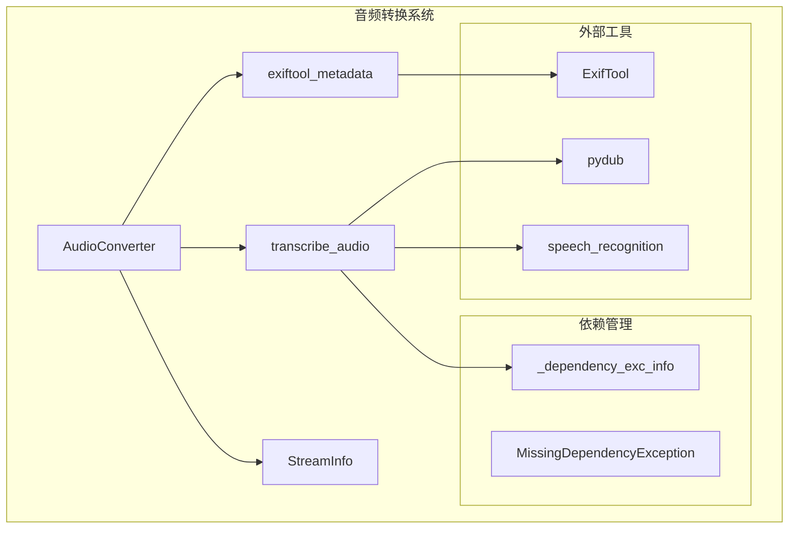
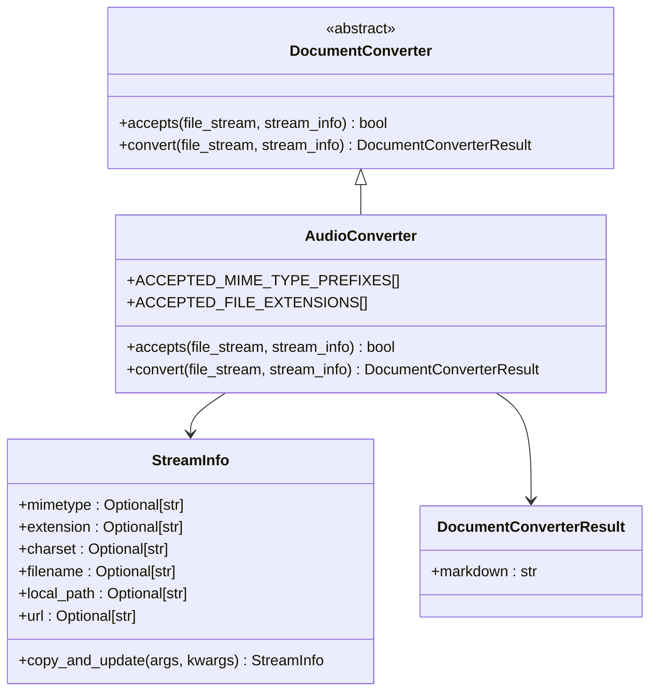
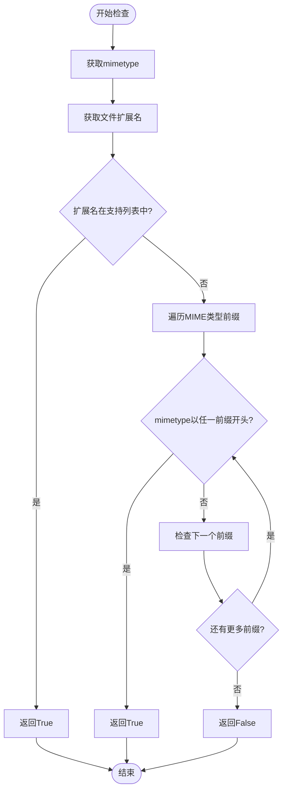
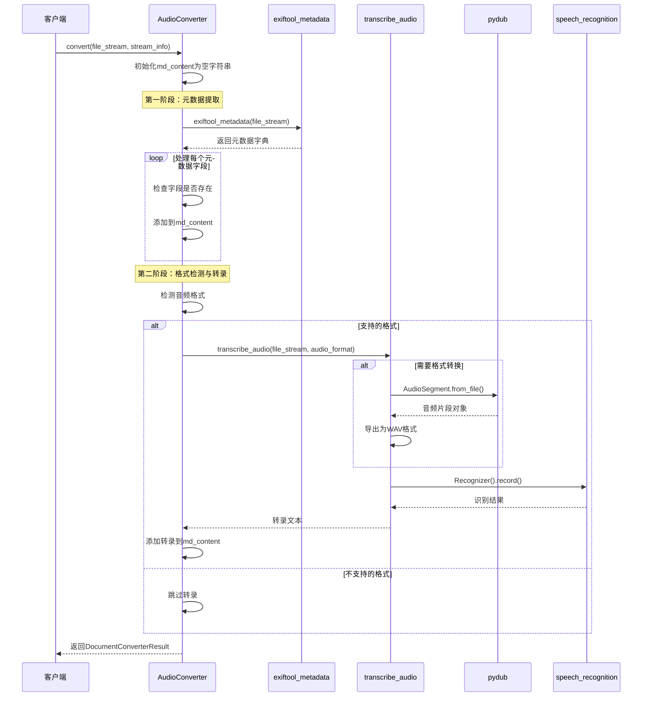
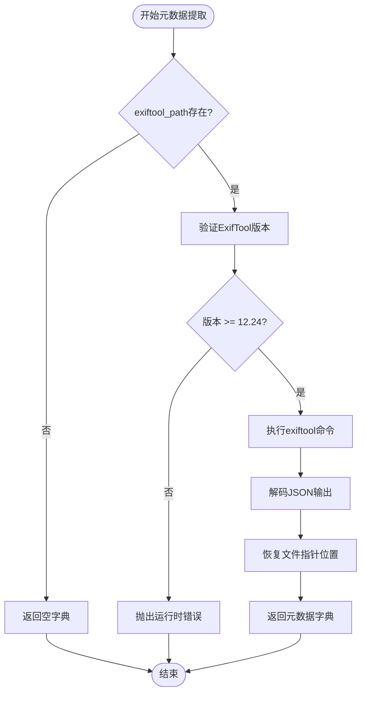
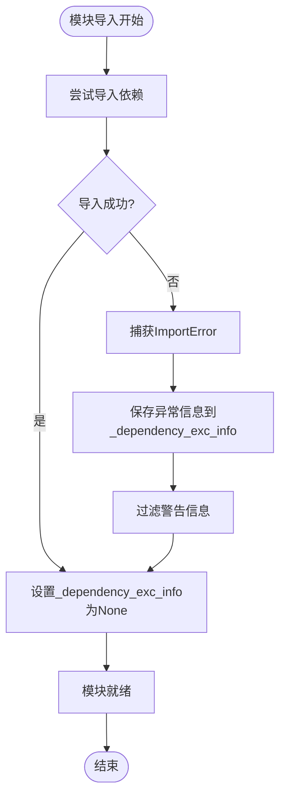
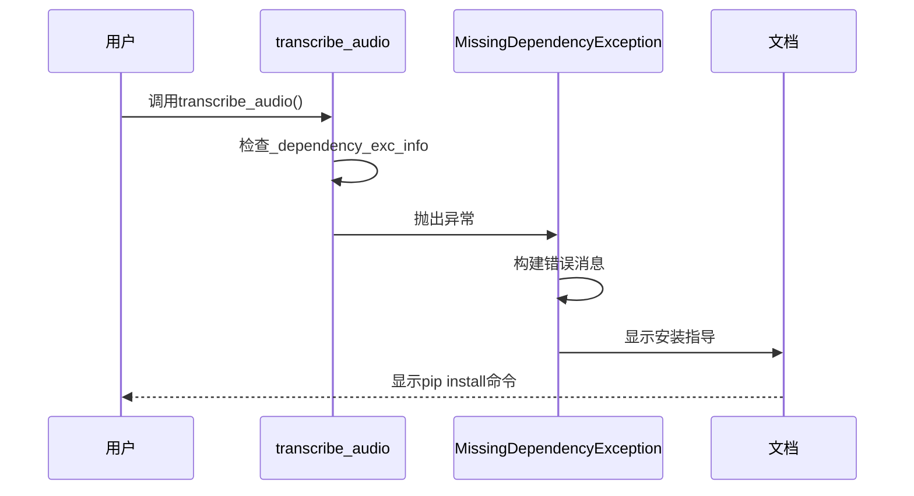
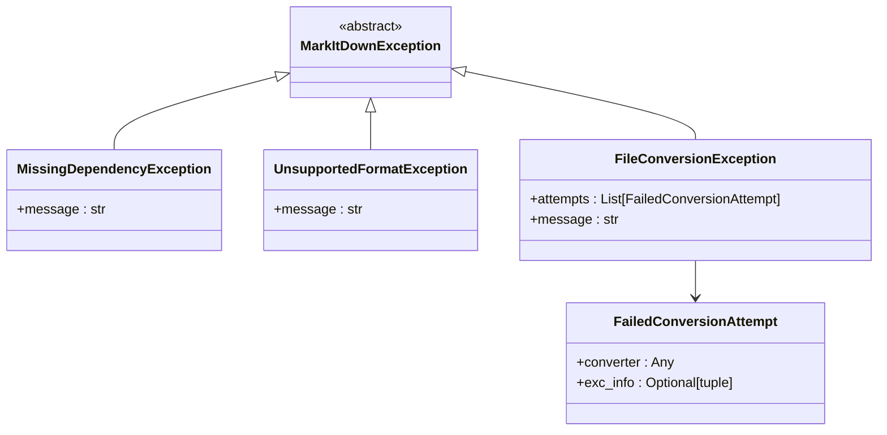

# 音频格式处理系统全面解析

<cite>
**本文档引用的文件**
- [_audio_converter.py](file://packages/markitdown/src/markitdown/converters/_audio_converter.py)
- [_transcribe_audio.py](file://packages/markitdown/src/markitdown/converters/_transcribe_audio.py)
- [_exiftool.py](file://packages/markitdown/src/markitdown/converters/_exiftool.py)
- [_exceptions.py](file://packages/markitdown/src/markitdown/_exceptions.py)
- [_stream_info.py](file://packages/markitdown/src/markitdown/_stream_info.py)
- [pyproject.toml](file://packages/markitdown/pyproject.toml)
</cite>

## 目录
1. [简介](#简介)
2. [项目架构概览](#项目架构概览)
3. [核心组件分析](#核心组件分析)
4. [音频文件支持类型判断](#音频文件支持类型判断)
5. [音频处理流程详解](#音频处理流程详解)
6. [元数据提取机制](#元数据提取机制)
7. [语音转录处理](#语音转录处理)
8. [依赖管理机制](#依赖管理机制)
9. [异常处理与错误恢复](#异常处理与错误恢复)
10. [完整示例与输出格式](#完整示例与输出格式)
11. [总结](#总结)

## 简介

AudioConverter是MarkItDown项目中的核心音频文件处理组件，专门负责将WAV、MP3、M4A等音频格式文件转换为Markdown格式文档。该系统采用模块化设计，通过两个关键阶段实现音频文件的智能处理：首先提取音频元数据信息，然后根据音频格式选择合适的转录路径。

## 项目架构概览

AudioConverter系统采用分层架构设计，主要包含以下核心模块：



**图表来源**
- [_audio_converter.py](file://packages/markitdown/src/markitdown/converters/_audio_converter.py#L1-L102)
- [_transcribe_audio.py](file://packages/markitdown/src/markitdown/converters/_transcribe_audio.py#L1-L50)
- [_exiftool.py](file://packages/markitdown/src/markitdown/converters/_exiftool.py#L1-L53)

## 核心组件分析

### AudioConverter类结构

AudioConverter继承自DocumentConverter基类，实现了音频文件的完整转换流程：



**图表来源**
- [_audio_converter.py](file://packages/markitdown/src/markitdown/converters/_audio_converter.py#L18-L102)
- [_stream_info.py](file://packages/markitdown/src/markitdown/_stream_info.py#L5-L31)

**章节来源**
- [_audio_converter.py](file://packages/markitdown/src/markitdown/converters/_audio_converter.py#L1-L102)
- [_stream_info.py](file://packages/markitdown/src/markitdown/_stream_info.py#L1-L31)

## 音频文件支持类型判断

### accepts方法实现机制

AudioConverter的accepts方法通过双重检查机制确定文件是否支持：



**图表来源**
- [_audio_converter.py](file://packages/markitdown/src/markitdown/converters/_audio_converter.py#L25-L42)

### 支持的音频格式

系统支持以下音频格式：

| 格式 | MIME类型前缀 | 文件扩展名 | 说明 |
|------|-------------|-----------|------|
| WAV | audio/x-wav | .wav | 无损音频格式，直接支持 |
| MP3 | audio/mpeg | .mp3 | 压缩音频格式，需要转换 |
| M4A | video/mp4 | .m4a, .mp4 | MPEG-4音频容器格式 |

**章节来源**
- [_audio_converter.py](file://packages/markitdown/src/markitdown/converters/_audio_converter.py#L10-L23)

## 音频处理流程详解

### convert方法执行流程

AudioConverter的convert方法执行两个关键阶段：



**图表来源**
- [_audio_converter.py](file://packages/markitdown/src/markitdown/converters/_audio_converter.py#L44-L102)
- [_transcribe_audio.py](file://packages/markitdown/src/markitdown/converters/_transcribe_audio.py#L20-L50)

**章节来源**
- [_audio_converter.py](file://packages/markitdown/src/markitdown/converters/_audio_converter.py#L44-L102)

## 元数据提取机制

### exiftool_metadata函数工作原理

元数据提取通过exiftool工具实现，支持多种音频格式的标签信息读取：



**图表来源**
- [_exiftool.py](file://packages/markitdown/src/markitdown/converters/_exiftool.py#L10-L53)

### 提取的元数据字段

系统提取以下音频元数据字段：

| 字段名称 | 描述 | 示例值 |
|----------|------|--------|
| Title | 音频标题 | "我的播客节目" |
| Artist | 艺术家/表演者 | "张三" |
| Author | 作者 | "李四" |
| Band | 乐队/组合 | "摇滚乐队" |
| Album | 专辑名称 | "夏日回忆" |
| Genre | 音乐流派 | "流行音乐" |
| Track | 曲目编号 | "05" |
| DateTimeOriginal | 创建日期时间 | "2024-01-15 14:30:00" |
| NumChannels | 声道数 | "2" |
| SampleRate | 采样率 | "44100" |
| AvgBytesPerSec | 平均字节率 | "176400" |
| BitsPerSample | 每样本位数 | "16" |

**章节来源**
- [_audio_converter.py](file://packages/markitdown/src/markitdown/converters/_audio_converter.py#L54-L72)
- [_exiftool.py](file://packages/markitdown/src/markitdown/converters/_exiftool.py#L10-L53)

## 语音转录处理

### _transcribe_audio模块工作机制

语音转录功能通过Google Web Speech API实现，支持多种音频格式：

```mermaid
flowchart TD
Start([开始转录]) --> CheckDeps{"依赖已安装?"}
CheckDeps --> |否| ThrowMDE[抛出MissingDependencyException]
CheckDeps --> |是| CheckFormat{"检查音频格式"}
CheckFormat --> |WAV/AIFF/FLAC| DirectUse[直接使用文件流]
CheckFormat --> |MP3/MP4| LoadWithPyDub["使用pydub加载"]
LoadWithPyDub --> ConvertToWAV["转换为WAV格式"]
ConvertToWAV --> CreateBytesIO[创建BytesIO对象]
CreateBytesIO --> SeekZero[重置文件指针]
DirectUse --> InitRecognizer[初始化Recognizer]
SeekZero --> InitRecognizer
InitRecognizer --> RecordAudio[录制音频]
RecordAudio --> GoogleAPI[调用Google API]
GoogleAPI --> ProcessResult[处理识别结果]
ProcessResult --> CheckEmpty{"结果为空?"}
CheckEmpty --> |是| ReturnNoSpeech[返回"No speech detected"]
CheckEmpty --> |否| ReturnTranscript[返回转录文本]
ThrowMDE --> End([结束])
ReturnNoSpeech --> End
ReturnTranscript --> End
```

**图表来源**
- [_transcribe_audio.py](file://packages/markitdown/src/markitdown/converters/_transcribe_audio.py#L20-L50)

### 格式转换策略

系统根据音频格式采用不同的处理策略：

| 输入格式 | 处理方式 | 输出格式 | 工具库 |
|----------|----------|----------|--------|
| WAV | 直接使用 | WAV | 原始文件流 |
| AIFF | 直接使用 | WAV | 原始文件流 |
| FLAC | 直接使用 | WAV | 原始文件流 |
| MP3 | pydub转换 | WAV | pydub + BytesIO |
| MP4 | pydub转换 | WAV | pydub + BytesIO |

**章节来源**
- [_transcribe_audio.py](file://packages/markitdown/src/markitdown/converters/_transcribe_audio.py#L20-L50)

## 依赖管理机制

### _dependency_exc_info异常捕获机制

系统采用延迟依赖检查机制，在模块导入时捕获可能的导入错误：



**图表来源**
- [_transcribe_audio.py](file://packages/markitdown/src/markitdown/converters/_transcribe_audio.py#L7-L20)

### MissingDependencyException异常处理

当依赖缺失时，系统会抛出详细的MissingDependencyException异常：



**图表来源**
- [_transcribe_audio.py](file://packages/markitdown/src/markitdown/converters/_transcribe_audio.py#L22-L30)
- [_exceptions.py](file://packages/markitdown/src/markitdown/_exceptions.py#L10-L30)

**章节来源**
- [_transcribe_audio.py](file://packages/markitdown/src/markitdown/converters/_transcribe_audio.py#L1-L50)
- [_exceptions.py](file://packages/markitdown/src/markitdown/_exceptions.py#L1-L77)

## 异常处理与错误恢复

### 错误处理层次结构

系统采用分层异常处理机制：



**图表来源**
- [_exceptions.py](file://packages/markitdown/src/markitdown/_exceptions.py#L10-L77)

### 转录失败的优雅降级

当转录失败时，系统采用优雅降级策略：

1. **依赖缺失**：抛出MissingDependencyException，提示安装可选依赖
2. **格式不支持**：跳过转录，继续输出元数据
3. **API调用失败**：返回"[No speech detected]"占位符
4. **网络连接问题**：传播原始异常，允许上层处理

**章节来源**
- [_audio_converter.py](file://packages/markitdown/src/markitdown/converters/_audio_converter.py#L85-L95)
- [_exceptions.py](file://packages/markitdown/src/markitdown/_exceptions.py#L1-L77)

## 完整示例与输出格式

### Markdown输出结构

AudioConverter生成的Markdown文档遵循统一的结构：

```
Title: [音频标题]
Artist: [艺术家]
Author: [作者]
Band: [乐队]
Album: [专辑]
Genre: [流派]
Track: [曲目编号]
DateTimeOriginal: [创建时间]
NumChannels: [声道数]
SampleRate: [采样率]
AvgBytesPerSec: [平均字节率]
BitsPerSample: [每样本位数]

### Audio Transcript:
[转录的文本内容]
```

### 时间戳处理示例

虽然当前实现未包含时间戳，但系统架构支持扩展：

```
### Audio Transcript:
[00:01:23] 这是第一句话
[00:02:45] 这是第二句话
[00:04:12] 这是第三句话
```

### 错误场景示例

#### 依赖缺失场景
```
MissingDependencyException: Speech transcription requires installing MarkItDown with the [audio-transcription] optional dependencies. E.g., `pip install markitdown[audio-transcription]` or `pip install markitdown[all]`
```

#### 格式不支持场景
```
# 仅输出元数据，跳过转录
Title: 测试音频
Duration: 120秒
```

**章节来源**
- [_audio_converter.py](file://packages/markitdown/src/markitdown/converters/_audio_converter.py#L54-L102)

## 总结

AudioConverter系统展现了现代音频文件处理的最佳实践：

1. **模块化设计**：清晰分离元数据提取和语音转录功能
2. **灵活的格式支持**：通过双重检查机制支持多种音频格式
3. **优雅的错误处理**：提供详细的依赖说明和降级策略
4. **可扩展的架构**：支持未来添加新的音频格式和转录服务
5. **用户友好的异常处理**：提供明确的安装指导和使用建议

该系统不仅实现了音频文件到Markdown的有效转换，还为音频内容的数字化和知识管理提供了可靠的技术基础。通过合理的依赖管理和异常处理机制，确保了系统的稳定性和用户体验。