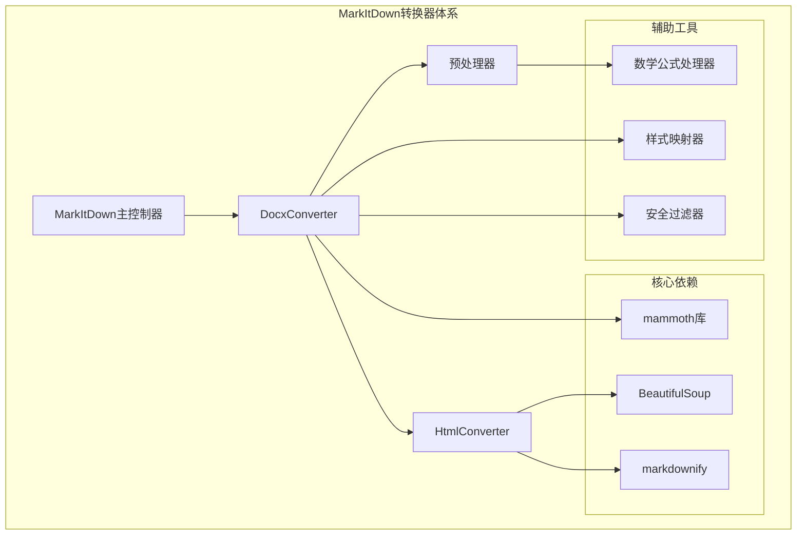
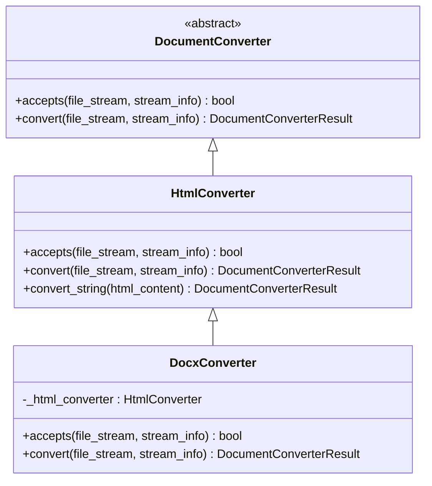
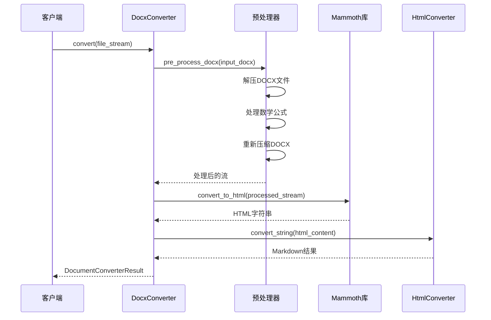
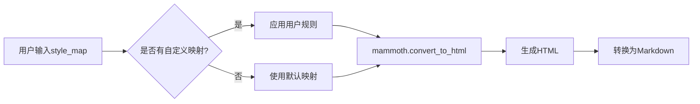
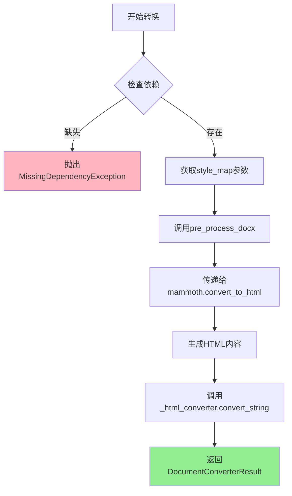
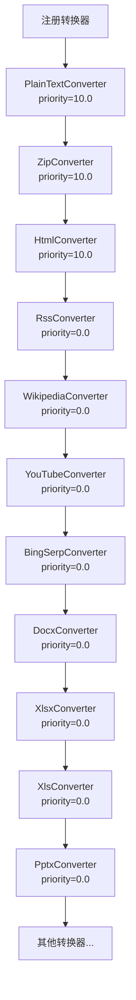

# DOCX格式转换技术实现深度分析

<cite>
**本文档引用的文件**
- [_markitdown.py](file://packages/markitdown/src/markitdown/_markitdown.py)
- [_base_converter.py](file://packages/markitdown/src/markitdown/_base_converter.py)
- [_docx_converter.py](file://packages/markitdown/src/markitdown/converters/_docx_converter.py)
- [_html_converter.py](file://packages/markitdown/src/markitdown/converters/_html_converter.py)
- [pre_process.py](file://packages/markitdown/src/markitdown/converter_utils/docx/pre_process.py)
- [_markdownify.py](file://packages/markitdown/src/markitdown/converters/_markdownify.py)
</cite>

## 目录
1. [引言](#引言)
2. [项目架构概览](#项目架构概览)
3. [DocxConverter核心设计](#docxconverter核心设计)
4. [MIME类型识别机制](#mime类型识别机制)
5. [预处理与安全机制](#预处理与安全机制)
6. [样式映射系统](#样式映射系统)
7. [转换流程详解](#转换流程详解)
8. [优先级注册机制](#优先级注册机制)
9. [性能优化与限制](#性能优化与限制)
10. [总结](#总结)

## 引言

DOCX文件转换是MarkItDown项目中的重要功能模块，负责将Microsoft Office Word文档转换为Markdown格式。该模块采用分层架构设计，通过继承`HtmlConverter`类，利用mammoth库作为核心转换引擎，实现了从Office Open XML格式到HTML中间格式，再到Markdown最终输出的完整转换链路。

## 项目架构概览

MarkItDown采用了多层转换器架构，其中DOCX转换器位于整个转换体系的核心位置：



**图表来源**
- [_markitdown.py](file://packages/markitdown/src/markitdown/_markitdown.py#L170-L196)
- [_docx_converter.py](file://packages/markitdown/src/markitdown/converters/_docx_converter.py#L36-L44)

## DocxConverter核心设计

### 继承关系与设计意图

DocxConverter继承自HtmlConverter的设计体现了以下关键考虑：

1. **架构复用性**：通过继承现有HtmlConverter，避免重复实现HTML解析功能
2. **渐进式转换**：DOCX → HTML → Markdown的三阶段转换策略
3. **功能扩展性**：在基础HTML转换能力上添加DOCX特定处理逻辑



**图表来源**
- [_base_converter.py](file://packages/markitdown/src/markitdown/_base_converter.py#L47-L105)
- [_html_converter.py](file://packages/markitdown/src/markitdown/converters/_html_converter.py#L18-L90)
- [_docx_converter.py](file://packages/markitdown/src/markitdown/converters/_docx_converter.py#L36-L44)

**章节来源**
- [_docx_converter.py](file://packages/markitdown/src/markitdown/converters/_docx_converter.py#L36-L44)
- [_html_converter.py](file://packages/markitdown/src/markitdown/converters/_html_converter.py#L18-L90)

### 核心属性配置

DocxConverter定义了两个关键的接受条件常量：

| 属性 | 值 | 用途 |
|------|-----|------|
| ACCEPTED_MIME_TYPE_PREFIXES | "application/vnd.openxmlformats-officedocument.wordprocessingml.document" | 识别标准Office Open XML MIME类型 |
| ACCEPTED_FILE_EXTENSIONS | [".docx"] | 支持的文件扩展名列表 |

## MIME类型识别机制

### accepts方法实现逻辑

DocxConverter的accepts方法实现了双重识别机制：

```mermaid
flowchart TD
A[开始accepts检查] --> B{检查文件扩展名}
B --> |匹配|.docx| C[返回True]
B --> |不匹配| D{检查MIME类型前缀}
D --> |匹配前缀| E[返回True]
D --> |不匹配| F[返回False]
style C fill:#90EE90
style E fill:#90EE90
style F fill:#FFB6C1
```

**图表来源**
- [_docx_converter.py](file://packages/markitdown/src/markitdown/converters/_docx_converter.py#L46-L60)

该机制确保了：
- **精确匹配**：直接匹配`.docx`扩展名的文件
- **兼容性**：支持Office Open XML标准的MIME类型
- **安全性**：防止非DOCX格式文件误入转换流程

**章节来源**
- [_docx_converter.py](file://packages/markitdown/src/markitdown/converters/_docx_converter.py#L46-L60)

## 预处理与安全机制

### pre_process_docx函数作用

预处理函数`pre_process_docx`负责DOCX文件的内部XML结构转换，主要功能包括：

1. **数学公式转换**：将OMML（Office Math Markup Language）元素转换为LaTeX格式
2. **ZIP文件操作**：内存中解压缩和重新压缩DOCX文件
3. **内容替换**：在XML级别替换特定的数学表达式



**图表来源**
- [_docx_converter.py](file://packages/markitdown/src/markitdown/converters/_docx_converter.py#L75-L89)
- [pre_process.py](file://packages/markitdown/src/markitdown/converter_utils/docx/pre_process.py#L132-L156)

### 外部资源安全控制

mammoth库的`Files.open`方法被重写以禁用外部资源加载：

```python
def mammoth_files_open(self, uri):
    warn("DOCX: processing of r:link resources (e.g., linked images) is disabled.")
    return io.BytesIO(b"")
```

这种安全措施确保：
- **隔离性**：阻止DOCX文件访问外部网络资源
- **安全性**：防止恶意代码执行和数据泄露
- **稳定性**：避免因外部资源不可用导致的转换失败

**章节来源**
- [_docx_converter.py](file://packages/markitdown/src/markitdown/converters/_docx_converter.py#L15-L25)
- [pre_process.py](file://packages/markitdown/src/markitdown/converter_utils/docx/pre_process.py#L132-L156)

## 样式映射系统

### style_map参数机制

style_map参数允许用户自定义DOCX样式到Markdown的映射规则：

| 参数类型 | 默认值 | 功能描述 |
|----------|--------|----------|
| style_map | None | 自定义样式映射规则 |
| 内置映射 | 标准Office样式 | 自动映射标题、段落等样式 |
| 用户定义 | 字符串规则 | 支持自定义转换行为 |

### 样式映射的应用时机



**图表来源**
- [_docx_converter.py](file://packages/markitdown/src/markitdown/converters/_docx_converter.py#L75-L89)

**章节来源**
- [_docx_converter.py](file://packages/markitdown/src/markitdown/converters/_docx_converter.py#L75-L89)

## 转换流程详解

### convert方法执行流程

DocxConverter的convert方法实现了完整的转换管道：



**图表来源**
- [_docx_converter.py](file://packages/markitdown/src/markitdown/converters/_docx_converter.py#L62-L89)

### 关键转换步骤

1. **依赖检查**：验证mammoth库是否可用
2. **参数获取**：提取style_map配置
3. **预处理**：转换数学公式和XML结构
4. **核心转换**：使用mammoth库生成HTML
5. **后处理**：通过HtmlConverter生成Markdown

**章节来源**
- [_docx_converter.py](file://packages/markitdown/src/markitdown/converters/_docx_converter.py#L62-L89)

## 优先级注册机制

### 注册顺序与优先级

在MarkItDown的注册系统中，DocxConverter具有高优先级：



**图表来源**
- [_markitdown.py](file://packages/markitdown/src/markitdown/_markitdown.py#L170-L196)

### 优先级设计原理

- **PRIORITY_SPECIFIC_FILE_FORMAT (0.0)**：专门针对特定文件格式的转换器
- **PRIORITY_GENERIC_FILE_FORMAT (10.0)**：通用格式转换器
- **DocxConverter优先级**：作为专门的DOCX转换器，获得最高优先级

这种设计确保了：
- **语义保留**：DOCX特有的格式信息得到更好的保留
- **性能优化**：避免不必要的格式检测开销
- **用户体验**：提供更准确的转换结果

**章节来源**
- [_markitdown.py](file://packages/markitdown/src/markitdown/_markitdown.py#L170-L196)
- [_markitdown.py](file://packages/markitdown/src/markitdown/_markitdown.py#L620-L651)

## 性能优化与限制

### 当前实现特点

1. **保留标题层级**：通过mammoth库的样式映射保持文档结构
2. **表格结构保留**：支持复杂表格的转换
3. **数学公式处理**：内置OMML到LaTeX的转换支持

### 已知限制

| 限制项 | 描述 | 影响范围 |
|--------|------|----------|
| 图像嵌入 | 内容中的图像将被忽略 | 所有包含图像的DOCX文档 |
| 复杂格式 | 极复杂的排版可能丢失细节 | 特殊格式化文档 |
| 数学公式 | 仅支持OMML格式的数学表达式 | 使用其他数学格式的文档 |

### 性能优化策略

1. **内存处理**：所有DOCX处理都在内存中完成，避免磁盘I/O
2. **增量处理**：只处理必要的XML文件（document.xml、footnotes.xml、endnotes.xml）
3. **缓存机制**：mammoth库内部的智能缓存

**章节来源**
- [pre_process.py](file://packages/markitdown/src/markitdown/converter_utils/docx/pre_process.py#L132-L156)
- [_docx_converter.py](file://packages/markitdown/src/markitdown/converters/_docx_converter.py#L15-L25)

## 总结

DOCX文件转换模块展现了MarkItDown项目在文档格式转换领域的深度技术积累。通过精心设计的分层架构、安全的预处理机制、灵活的样式映射系统，以及高效的转换流程，该模块成功地将复杂的Office Open XML格式转换为简洁的Markdown格式。

### 技术亮点

1. **架构设计**：继承HtmlConverter的设计体现了良好的软件工程实践
2. **安全考虑**：通过重写mammoth.files.Files.open确保转换过程的安全性
3. **功能完整性**：支持标题、表格、数学公式的转换
4. **性能优化**：内存处理和增量转换策略
5. **优先级管理**：合理的注册顺序确保最佳的转换效果

### 应用价值

该模块不仅满足了日常文档转换需求，更为MarkItDown项目提供了处理复杂文档格式的基础能力，为后续的功能扩展奠定了坚实的技术基础。