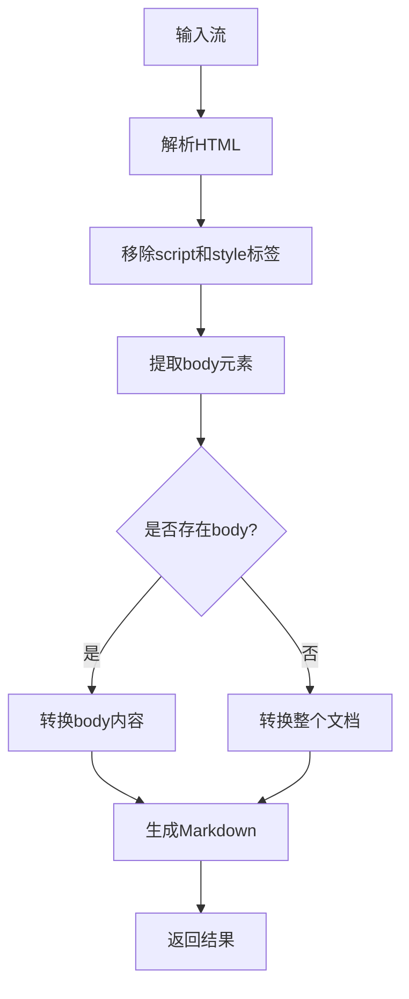
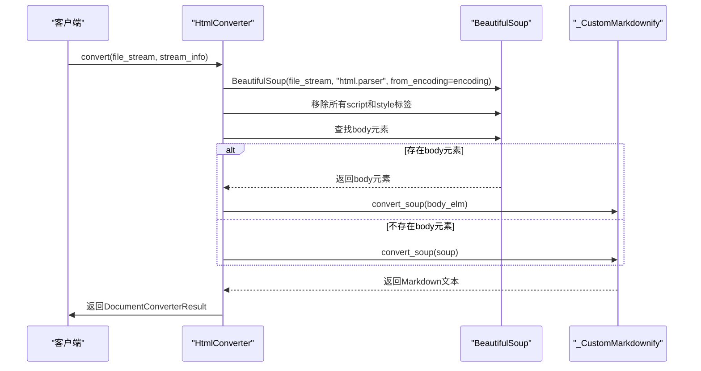
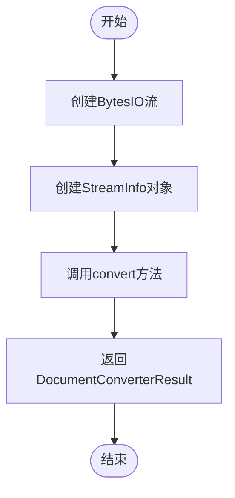
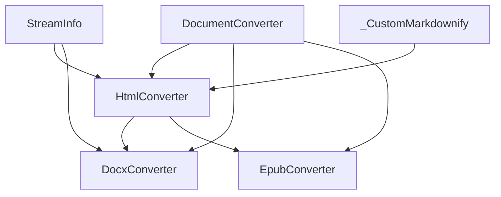

# HTML格式转换

<cite>
**本文档引用的文件**
- [_html_converter.py](file://packages/markitdown/src/markitdown/converters/_html_converter.py)
- [_markdownify.py](file://packages/markitdown/src/markitdown/converters/_markdownify.py)
- [_docx_converter.py](file://packages/markitdown/src/markitdown/converters/_docx_converter.py)
- [_base_converter.py](file://packages/markitdown/src/markitdown/_base_converter.py)
- [_markitdown.py](file://packages/markitdown/src/markitdown/_markitdown.py)
- [_stream_info.py](file://packages/markitdown/src/markitdown/_stream_info.py)
</cite>

## 目录
1. [介绍](#介绍)
2. [核心组件](#核心组件)
3. [架构概述](#架构概述)
4. [详细组件分析](#详细组件分析)
5. [依赖分析](#依赖分析)
6. [性能考虑](#性能考虑)
7. [故障排除指南](#故障排除指南)
8. [结论](#结论)

## 介绍
HtmlConverter是markitdown库中的核心组件，负责将HTML文档转换为Markdown格式。该转换器利用BeautifulSoup解析HTML文档结构，通过移除script和style标签来净化内容。转换器根据stream_info.charset确定编码并构建soup对象，提取_body元素内容，并在缺失时回退到根节点。_CustomMarkdownify类将HTML元素映射为Markdown语法（如h1→#，ul→*），convert_string便利方法在内部转换流程中发挥重要作用，并被DocxConverter等其他转换器调用。该转换器支持多种HTML标签和嵌套列表处理，但无法捕获JavaScript动态内容。

## 核心组件
HtmlConverter是处理HTML到Markdown转换的核心类，实现了accepts和convert方法。该转换器能够识别text/html和application/xhtml类型的MIME类型以及.html和.htm文件扩展名。转换过程中，使用BeautifulSoup解析HTML文档，移除脚本和样式标签，然后通过_CustomMarkdownify将HTML元素转换为相应的Markdown语法。

**核心组件**
- [_html_converter.py](file://packages/markitdown/src/markitdown/converters/_html_converter.py#L1-L90)
- [_markdownify.py](file://packages/markitdown/src/markitdown/converters/_markdownify.py#L1-L126)

## 架构概述
HtmlConverter的架构基于DocumentConverter抽象基类，通过accepts方法判断是否能够处理特定的文件流，然后在convert方法中执行实际的转换操作。转换器首先解析输入流，使用指定的字符集编码创建BeautifulSoup对象，然后移除所有script和style标签。接着，转换器尝试提取body元素的内容进行转换，如果不存在body元素，则使用整个文档的根节点。最后，通过_CustomMarkdownify实例将HTML结构转换为Markdown格式。



**图表来源**
- [_html_converter.py](file://packages/markitdown/src/markitdown/converters/_html_converter.py#L1-L90)

## 详细组件分析

### HtmlConverter分析
HtmlConverter类实现了HTML到Markdown的转换逻辑。accepts方法根据MIME类型前缀和文件扩展名判断是否能够处理输入流。convert方法执行实际的转换过程，包括解析HTML、移除不需要的标签、提取主要内容和生成Markdown。

#### 转换流程


**图表来源**
- [_html_converter.py](file://packages/markitdown/src/markitdown/converters/_html_converter.py#L1-L90)

### _CustomMarkdownify分析
_CustomMarkdownify类继承自markdownify.MarkdownConverter，对默认的转换行为进行了定制。该类修改了标题样式，移除了JavaScript链接，截断了大型data:uri图像源，并确保URI正确转义。

#### 元素映射规则
```mermaid
classDiagram
class _CustomMarkdownify {
+__init__(**options)
+convert_hn(n, el, text)
+convert_a(el, text)
+convert_img(el, text)
+convert_input(el, text)
+convert_soup(soup)
}
_CustomMarkdownify --> markdownify.MarkdownConverter : "继承"
note right of _CustomMarkdownify
自定义Markdown转换器
- 标题样式 : ATX (#, ##)
- 移除JavaScript链接
- 处理data : uri图像
- 转义URI
end
```

**图表来源**
- [_markdownify.py](file://packages/markitdown/src/markitdown/converters/_markdownify.py#L1-L126)

### convert_string方法分析
convert_string是HtmlConverter的便利方法，允许直接将HTML字符串转换为Markdown。该方法在内部创建BytesIO流和StreamInfo对象，然后调用标准的convert方法。



**图表来源**
- [_html_converter.py](file://packages/markitdown/src/markitdown/converters/_html_converter.py#L70-L90)

## 依赖分析
HtmlConverter与其他转换器存在依赖关系，特别是DocxConverter继承了HtmlConverter的功能。多个转换器都依赖于基础的DocumentConverter类和StreamInfo类。



**图表来源**
- [_html_converter.py](file://packages/markitdown/src/markitdown/converters/_html_converter.py#L1-L90)
- [_docx_converter.py](file://packages/markitdown/src/markitdown/converters/_docx_converter.py#L1-L90)
- [_base_converter.py](file://packages/markitdown/src/markitdown/_base_converter.py#L1-L105)

## 性能考虑
HtmlConverter的性能主要受HTML文档大小和复杂度的影响。对于大型文档，解析和转换过程可能消耗较多内存和CPU资源。转换器通过移除script和style标签来减少处理的数据量，提高转换效率。使用适当的字符编码可以避免编码转换的开销。对于包含大量内联图像数据的文档，可以通过keep_data_uris选项控制是否保留这些数据。

## 故障排除指南
当HtmlConverter无法正确转换HTML文档时，可以检查以下方面：确保输入流可读且未损坏，验证字符编码是否正确，检查HTML文档结构是否完整。对于包含JavaScript动态生成内容的页面，需要先在浏览器中渲染完整内容再进行转换。如果转换结果不理想，可以尝试调整_CustomMarkdownify的选项。

**故障排除指南**
- [_html_converter.py](file://packages/markitdown/src/markitdown/converters/_html_converter.py#L1-L90)
- [_markdownify.py](file://packages/markitdown/src/markitdown/converters/_markdownify.py#L1-L126)

## 结论
HtmlConverter作为markitdown库中的核心转换器，提供了可靠的HTML到Markdown转换功能。通过BeautifulSoup解析HTML结构，结合_CustomMarkdownify的定制转换规则，能够有效处理各种HTML文档。该转换器具有中等优先级，作为通用格式转换器，在处理特定文件格式的转换器无法处理时作为后备选择。尽管无法捕获JavaScript动态内容，但对于静态HTML文档的转换效果良好，且被DocxConverter等其他转换器作为基础组件使用。