# PDF格式转换

<cite>
**本文档中引用的文件**
- [_markitdown.py](file://packages/markitdown/src/markitdown/_markitdown.py)
- [_base_converter.py](file://packages/markitdown/src/markitdown/_base_converter.py)
- [_pdf_converter.py](file://packages/markitdown/src/markitdown/converters/_pdf_converter.py)
- [_exceptions.py](file://packages/markitdown/src/markitdown/_exceptions.py)
- [_stream_info.py](file://packages/markitdown/src/markitdown/_stream_info.py)
- [__init__.py](file://packages/markitdown/src/markitdown/__init__.py)
- [test_module_misc.py](file://packages/markitdown/tests/test_module_misc.py)
- [README.md](file://packages/markitdown/README.md)
</cite>

## 目录
1. [简介](#简介)
2. [项目结构](#项目结构)
3. [核心组件](#核心组件)
4. [架构概览](#架构概览)
5. [详细组件分析](#详细组件分析)
6. [依赖关系分析](#依赖关系分析)
7. [性能考虑](#性能考虑)
8. [故障排除指南](#故障排除指南)
9. [结论](#结论)

## 简介

MarkItDown是一个强大的Python包和命令行工具，用于将各种文件格式转换为Markdown格式。其中，PDF格式转换是其核心功能之一，通过PdfConverter类实现，该类利用pdfminer库解析PDF文件内容并将其转换为Markdown格式。

PDF格式转换功能具有以下特点：
- 基于MIME类型和文件扩展名的智能文件兼容性检测
- 对缺失依赖的优雅异常处理
- 高效的文本提取机制
- 与MarkItDown系统的无缝集成

## 项目结构

MarkItDown项目采用模块化架构，PDF转换功能分布在多个关键文件中：

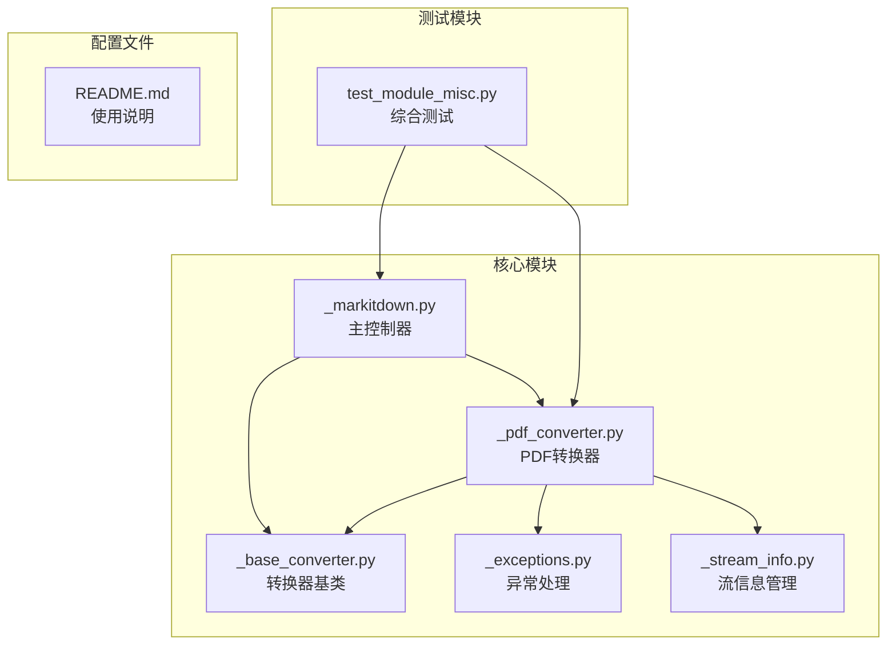

**图表来源**
- [_markitdown.py](file://packages/markitdown/src/markitdown/_markitdown.py#L1-L50)
- [_base_converter.py](file://packages/markitdown/src/markitdown/_base_converter.py#L1-L30)
- [_pdf_converter.py](file://packages/markitdown/src/markitdown/converters/_pdf_converter.py#L1-L30)

**章节来源**
- [_markitdown.py](file://packages/markitdown/src/markitdown/_markitdown.py#L1-L100)
- [_pdf_converter.py](file://packages/markitdown/src/markitdown/converters/_pdf_converter.py#L1-L78)

## 核心组件

### PdfConverter类

PdfConverter是专门负责PDF文件转换的核心类，继承自DocumentConverter基类。它实现了两个关键方法：accepts()和convert()。

#### 接受性检测机制

accepts方法通过检查MIME类型和文件扩展名来确定是否接受特定的PDF文件：

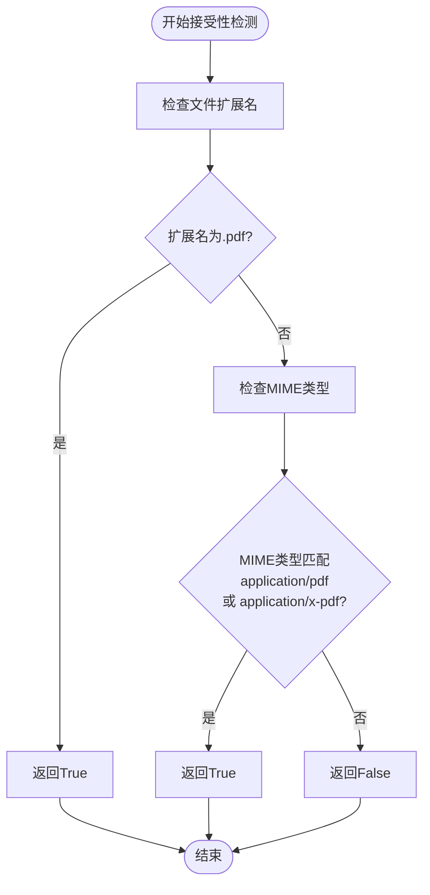

**图表来源**
- [_pdf_converter.py](file://packages/markitdown/src/markitdown/converters/_pdf_converter.py#L32-L51)

#### 转换执行机制

convert方法负责实际的PDF到Markdown转换过程：

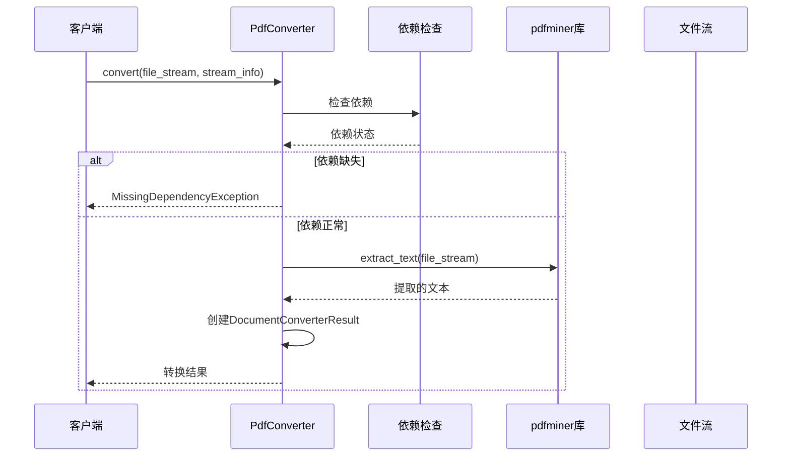

**图表来源**
- [_pdf_converter.py](file://packages/markitdown/src/markitdown/converters/_pdf_converter.py#L53-L76)

**章节来源**
- [_pdf_converter.py](file://packages/markitdown/src/markitdown/converters/_pdf_converter.py#L30-L78)

## 架构概览

MarkItDown采用插件化的转换器架构，PDF转换器作为其中一个插件被注册到系统中：

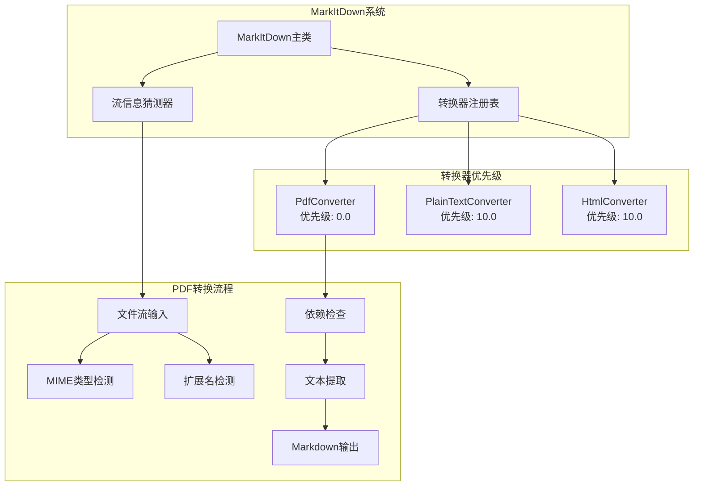

**图表来源**
- [_markitdown.py](file://packages/markitdown/src/markitdown/_markitdown.py#L190-L200)
- [_pdf_converter.py](file://packages/markitdown/src/markitdown/converters/_pdf_converter.py#L25-L30)

## 详细组件分析

### PdfConverter类详细分析

#### 类定义和常量

PdfConverter类定义了PDF转换的核心逻辑，包含以下关键元素：

| 元素 | 类型 | 描述 | 默认值 |
|------|------|------|--------|
| ACCEPTED_MIME_TYPE_PREFIXES | List[str] | 支持的MIME类型前缀 | ["application/pdf", "application/x-pdf"] |
| ACCEPTED_FILE_EXTENSIONS | List[str] | 支持的文件扩展名 | [".pdf"] |
| _dependency_exc_info | Optional[Tuple] | 依赖错误信息 | None |

#### accepts方法实现

accepts方法实现了智能的文件兼容性检测：

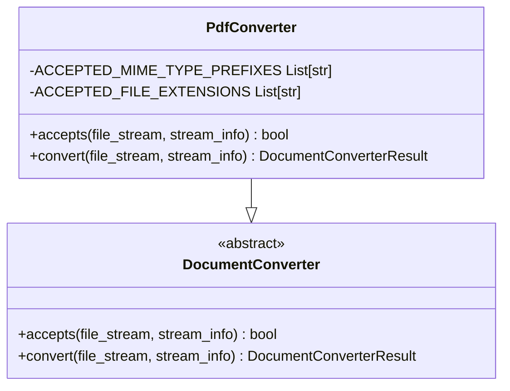

**图表来源**
- [_pdf_converter.py](file://packages/markitdown/src/markitdown/converters/_pdf_converter.py#L32-L51)
- [_base_converter.py](file://packages/markitdown/src/markitdown/_base_converter.py#L30-L50)

#### convert方法实现

convert方法展示了PDF转换的核心逻辑：

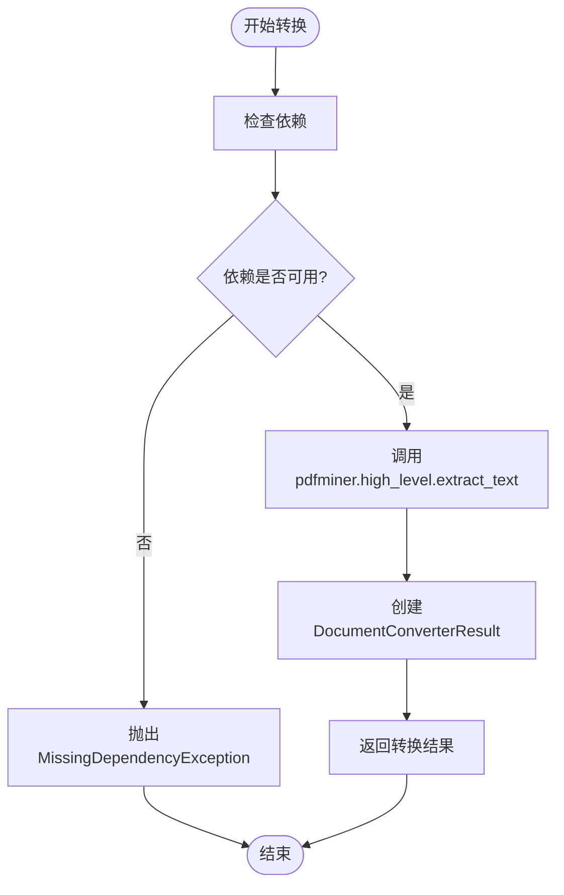

**图表来源**
- [_pdf_converter.py](file://packages/markitdown/src/markitdown/converters/_pdf_converter.py#L53-L76)

**章节来源**
- [_pdf_converter.py](file://packages/markitdown/src/markitdown/converters/_pdf_converter.py#L30-L78)

### 异常处理机制

MarkItDown提供了完善的异常处理机制来应对PDF转换过程中的各种问题：

#### MissingDependencyException异常

当pdfminer库未安装时，系统会抛出MissingDependencyException异常：

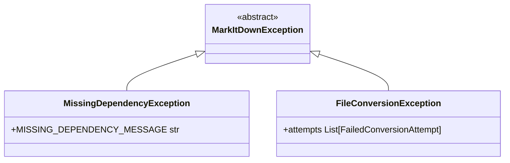

**图表来源**
- [_exceptions.py](file://packages/markitdown/src/markitdown/_exceptions.py#L10-L30)

#### 错误消息格式化

异常消息采用统一的格式化模板，提供清晰的解决方案指导：

| 参数 | 描述 | 示例值 |
|------|------|--------|
| converter | 转换器名称 | PdfConverter |
| extension | 文件扩展名 | .pdf |
| feature | 功能名称 | pdf |

**章节来源**
- [_exceptions.py](file://packages/markitdown/src/markitdown/_exceptions.py#L1-L77)

### 流信息管理系统

StreamInfo类提供了统一的文件元数据管理：

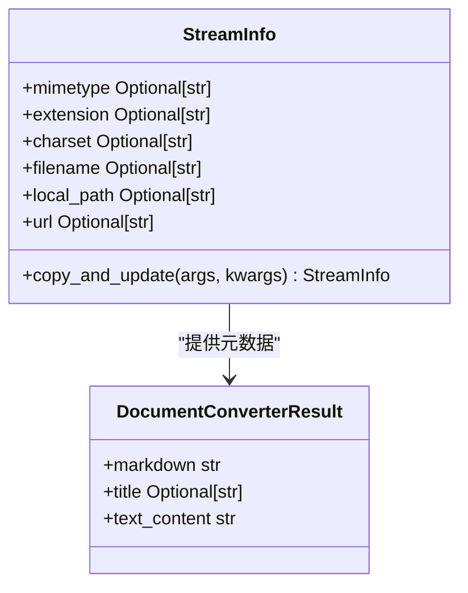

**图表来源**
- [_stream_info.py](file://packages/markitdown/src/markitdown/_stream_info.py#L5-L25)

**章节来源**
- [_stream_info.py](file://packages/markitdown/src/markitdown/_stream_info.py#L1-L33)

## 依赖关系分析

### 核心依赖关系

MarkItDown的PDF转换功能依赖于以下关键组件：

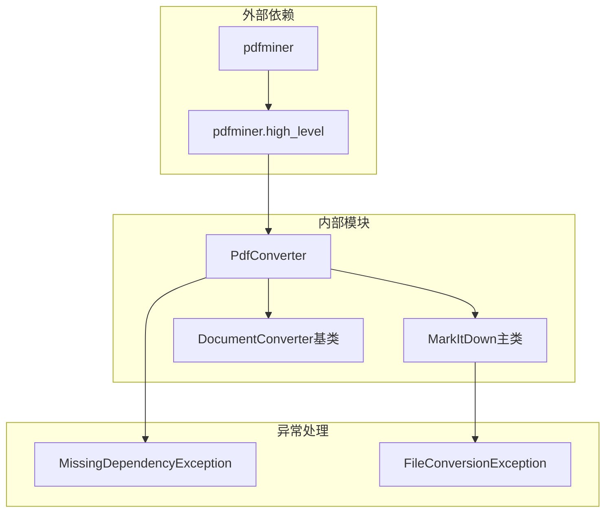

**图表来源**
- [_pdf_converter.py](file://packages/markitdown/src/markitdown/converters/_pdf_converter.py#L10-L20)
- [_markitdown.py](file://packages/markitdown/src/markitdown/_markitdown.py#L190-L200)

### 依赖加载机制

系统采用延迟加载策略，在首次使用时检查依赖：

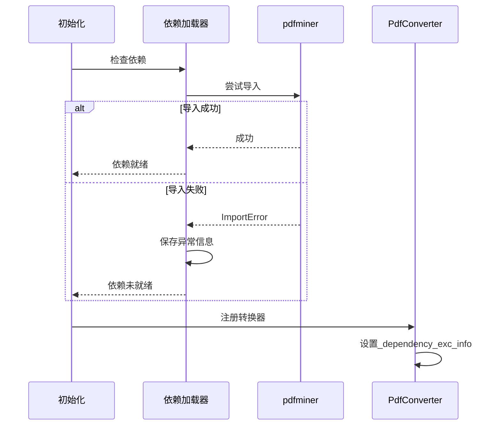

**图表来源**
- [_pdf_converter.py](file://packages/markitdown/src/markitdown/converters/_pdf_converter.py#L10-L20)

**章节来源**
- [_pdf_converter.py](file://packages/markitdown/src/markitdown/converters/_pdf_converter.py#L10-L20)

## 性能考虑

### 文本提取的局限性

pdfminer库的extract_text函数虽然高效，但存在以下局限性：

| 属性 | 限制 | 影响 |
|------|------|------|
| 样式信息 | 忽略字体、颜色、大小写等样式 | 结果为纯文本格式 |
| 布局结构 | 无法保留复杂的页面布局 | 可能丢失表格、图表位置信息 |
| 数学公式 | 不支持LaTeX或OMML格式 | 数学表达式可能显示不正确 |
| 图形元素 | 仅提取可读文本 | 图像、图表信息丢失 |

### 性能优化策略

1. **流式处理**: 支持二进制流直接处理，避免临时文件创建
2. **内存管理**: 使用seekable流确保正确的文件指针位置
3. **错误恢复**: 提供优雅的降级机制，当PDF转换失败时自动尝试其他转换器

### 扩展建议

对于需要高精度PDF转换的场景，建议结合Azure Document Intelligence：

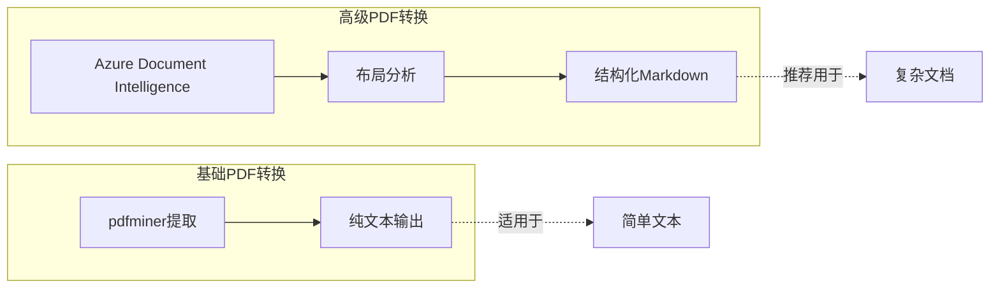

## 故障排除指南

### 常见问题及解决方案

#### 依赖缺失问题

**问题**: MissingDependencyException异常
**原因**: pdfminer库未安装
**解决方案**: 
```bash
pip install markitdown[pdf]
# 或
pip install pdfminer.six
```

#### 转换质量问题

**问题**: 提取的文本格式混乱
**原因**: PDF文档包含复杂布局或非标准字体
**解决方案**:
1. 检查PDF文档的可访问性设置
2. 考虑使用Azure Document Intelligence
3. 对于数学公式，手动添加LaTeX标记

#### 性能问题

**问题**: 大PDF文件转换缓慢
**解决方案**:
1. 分页处理大型文档
2. 使用内存映射文件
3. 考虑分布式处理

**章节来源**
- [_exceptions.py](file://packages/markitdown/src/markitdown/_exceptions.py#L10-L30)

### 实际使用示例

#### CLI命令行使用

```bash
# 基本PDF转换
markitdown document.pdf > output.md

# 指定URL
markitdown https://example.com/document.pdf > output.md

# 处理本地文件
markitdown ./documents/report.pdf > report.md
```

#### Python API使用

```python
from markitdown import MarkItDown

# 基本使用
md = MarkItDown()
result = md.convert("document.pdf")
print(result.text_content)

# 处理URL
result = md.convert("https://example.com/document.pdf")

# 自定义配置
md = MarkItDown(enable_builtins=True)
result = md.convert("document.pdf")
```

**章节来源**
- [test_module_misc.py](file://packages/markitdown/tests/test_module_misc.py#L50-L60)
- [README.md](file://packages/markitdown/README.md#L15-L35)

## 结论

MarkItDown的PDF格式转换功能通过PdfConverter类提供了强大而灵活的PDF到Markdown转换能力。该实现具有以下优势：

1. **智能兼容性检测**: 基于MIME类型和文件扩展名的双重验证机制
2. **优雅的异常处理**: 完善的依赖检查和错误恢复机制
3. **高效的文本提取**: 利用pdfminer库实现快速的文本内容提取
4. **系统集成**: 与MarkItDown的整体架构无缝集成

然而，用户也需要注意其局限性，特别是在处理复杂布局、数学公式和图形元素方面。对于这些场景，建议结合Azure Document Intelligence等高级服务来获得更高质量的转换结果。

通过合理的配置和使用策略，MarkItDown的PDF转换功能能够满足大多数日常文档处理需求，为开发者提供了可靠、易用的文档转换解决方案。