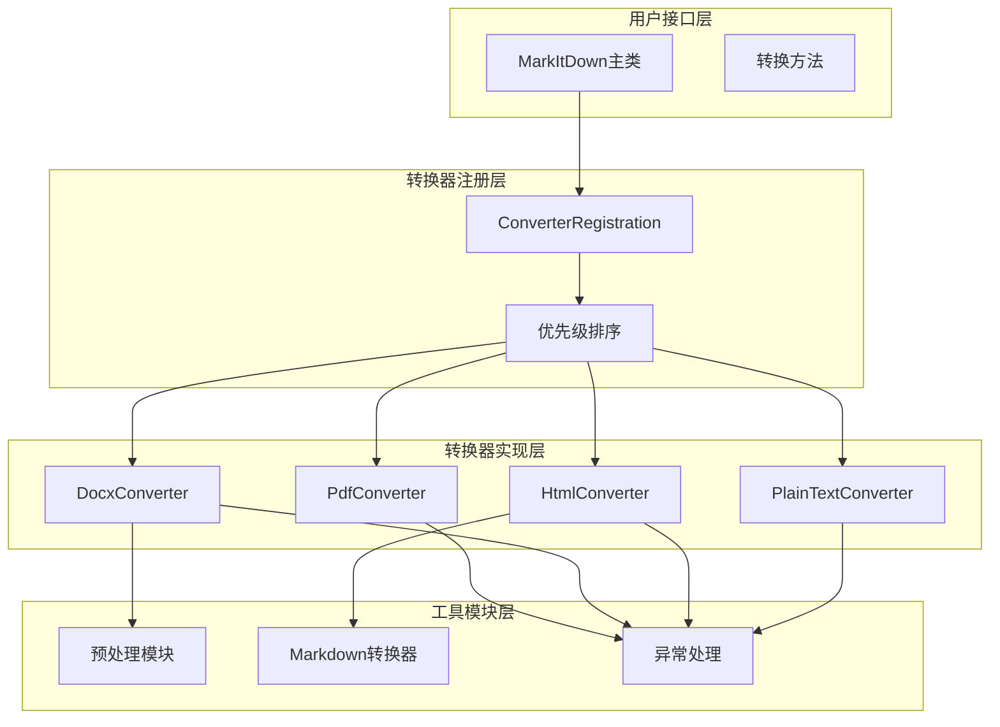
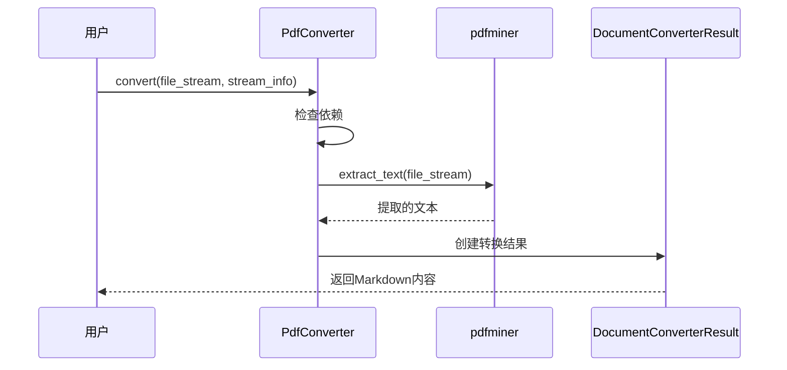
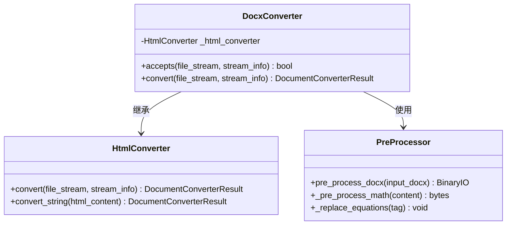
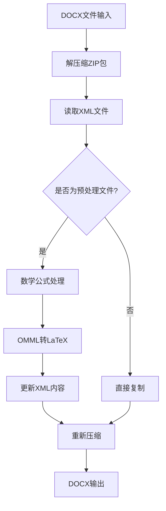
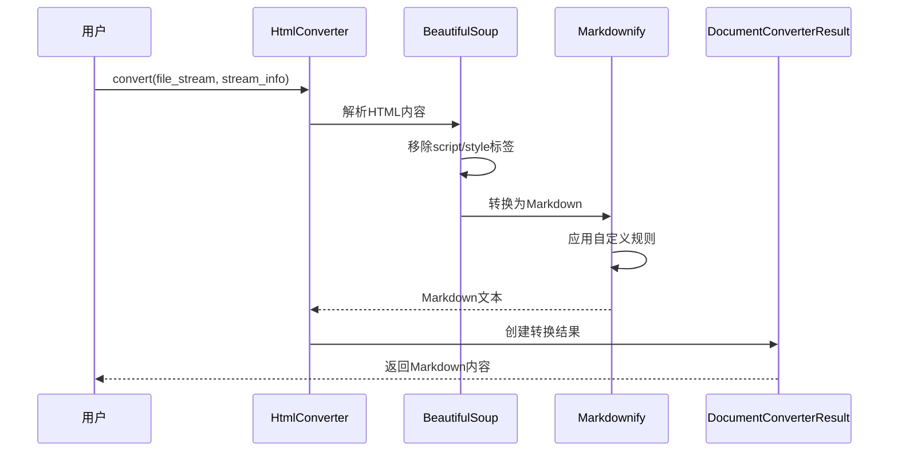
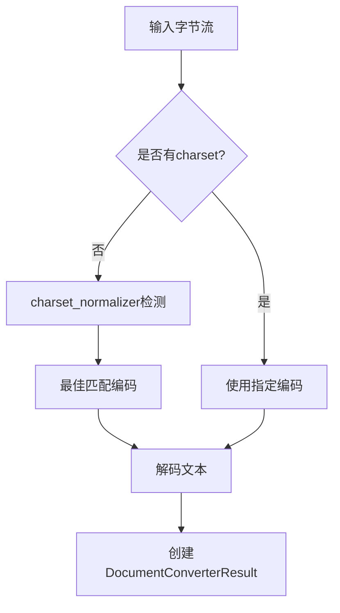
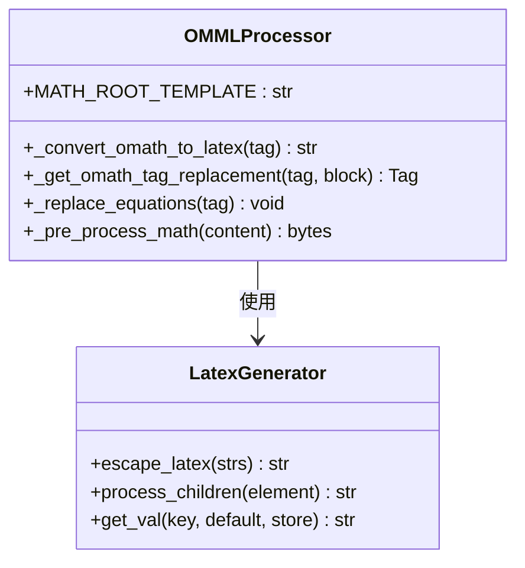
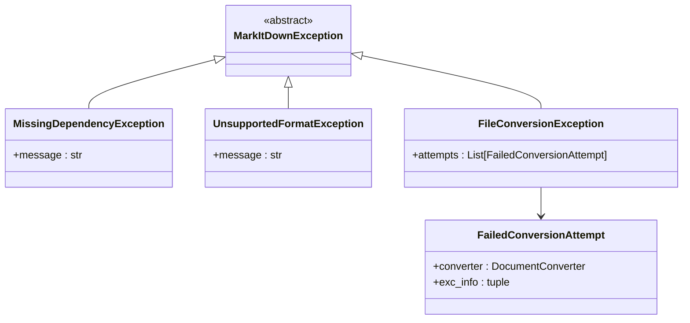

# 文档格式转换详细文档

<cite>
**本文档中引用的文件**
- [_markitdown.py](file://packages/markitdown/src/markitdown/_markitdown.py)
- [_base_converter.py](file://packages/markitdown/src/markitdown/_base_converter.py)
- [_pdf_converter.py](file://packages/markitdown/src/markitdown/converters/_pdf_converter.py)
- [_docx_converter.py](file://packages/markitdown/src/markitdown/converters/_docx_converter.py)
- [_html_converter.py](file://packages/markitdown/src/markitdown/converters/_html_converter.py)
- [_plain_text_converter.py](file://packages/markitdown/src/markitdown/converters/_plain_text_converter.py)
- [pre_process.py](file://packages/markitdown/src/markitdown/converter_utils/docx/pre_process.py)
- [_markdownify.py](file://packages/markitdown/src/markitdown/converters/_markdownify.py)
- [_exceptions.py](file://packages/markitdown/src/markitdown/_exceptions.py)
</cite>

## 目录
1. [简介](#简介)
2. [系统架构概览](#系统架构概览)
3. [转换器优先级机制](#转换器优先级机制)
4. [PDF格式转换](#pdf格式转换)
5. [DOCX格式转换](#docx格式转换)
6. [HTML格式转换](#html格式转换)
7. [纯文本格式转换](#纯文本格式转换)
8. [数学公式处理](#数学公式处理)
9. [错误处理与异常管理](#错误处理与异常管理)
10. [性能优化建议](#性能优化建议)
11. [故障排除指南](#故障排除指南)
12. [总结](#总结)

## 简介

markitdown是一个强大的文档格式转换系统，专门设计用于将各种文档格式转换为Markdown格式。该系统支持PDF、DOCX、HTML和纯文本等多种格式，通过模块化的转换器架构实现了灵活且可扩展的转换能力。

核心设计理念是通过统一的接口处理不同格式的文档，同时保持各格式特有的结构信息。系统采用优先级机制来选择最适合的转换器，并提供了完善的错误处理和异常管理机制。

## 系统架构概览

markitdown的文档转换系统采用分层架构设计，主要包含以下几个层次：



**图表来源**
- [_markitdown.py](file://packages/markitdown/src/markitdown/_markitdown.py#L1-L100)
- [_base_converter.py](file://packages/markitdown/src/markitdown/_base_converter.py#L1-L50)

**章节来源**
- [_markitdown.py](file://packages/markitdown/src/markitdown/_markitdown.py#L1-L777)
- [_base_converter.py](file://packages/markitdown/src/markitdown/_base_converter.py#L1-L106)

## 转换器优先级机制

markitdown使用基于优先级的转换器选择机制，确保最合适的转换器被优先尝试。系统定义了两个主要的优先级级别：

### 优先级常量

| 优先级类型 | 数值 | 描述 |
|-----------|------|------|
| PRIORITY_SPECIFIC_FILE_FORMAT | 0.0 | 特定文件格式转换器（如.pdf、.docx、.xlsx） |
| PRIORITY_GENERIC_FILE_FORMAT | 10.0 | 通用文件格式转换器（如.text、.html、.json） |

### 转换器选择流程

```mermaid
flowchart TD
A[开始转换] --> B[生成流信息猜测]
B --> C[按优先级排序转换器]
C --> D{遍历转换器}
D --> E{检查accepts()}
E --> |接受| F[尝试转换]
E --> |拒绝| G[下一个转换器]
F --> H{转换成功?}
H --> |成功| I[返回结果]
H --> |失败| J[记录失败尝试]
J --> G
G --> K{还有转换器?}
K --> |是| D
K --> |否| L[抛出UnsupportedFormatException]
```

**图表来源**
- [_markitdown.py](file://packages/markitdown/src/markitdown/_markitdown.py#L500-L600)

**章节来源**
- [_markitdown.py](file://packages/markitdown/src/markitdown/_markitdown.py#L450-L550)

## PDF格式转换

PDF转换器专门处理PDF文档到Markdown的转换，使用pdfminer库进行文本提取。

### 核心特性

- **文本提取**：使用pdfminer.high_level.extract_text函数提取PDF中的纯文本内容
- **格式保留**：主要保留文本内容，忽略复杂的排版样式
- **依赖管理**：需要安装pdfminer库作为可选依赖

### 支持的格式

| MIME类型 | 文件扩展名 | 描述 |
|---------|-----------|------|
| application/pdf | .pdf | 标准PDF格式 |
| application/x-pdf | .pdf | 兼容性PDF格式 |

### 转换流程



**图表来源**
- [_pdf_converter.py](file://packages/markitdown/src/markitdown/converters/_pdf_converter.py#L50-L78)

### 编码问题处理

PDF转换器在处理编码问题时采用以下策略：
- 使用pdfminer内置的编码检测机制
- 忽略复杂的排版样式以保持Markdown的简洁性
- 处理多语言PDF文档的字符编码

**章节来源**
- [_pdf_converter.py](file://packages/markitdown/src/markitdown/converters/_pdf_converter.py#L1-L78)

## DOCX格式转换

DOCX转换器是最复杂的转换器之一，负责将Word文档转换为Markdown格式，同时尽可能保留文档的结构和样式信息。

### 架构设计



**图表来源**
- [_docx_converter.py](file://packages/markitdown/src/markitdown/converters/_docx_converter.py#L30-L91)
- [_html_converter.py](file://packages/markitdown/src/markitdown/converters/_html_converter.py#L15-L91)

### 支持的格式

| MIME类型 | 文件扩展名 | 描述 |
|---------|-----------|------|
| application/vnd.openxmlformats-officedocument.wordprocessingml.document | .docx | Word 2007+文档格式 |

### 预处理流程

DOCX转换器包含一个复杂的预处理阶段，专门处理数学公式和特殊内容：



**图表来源**
- [pre_process.py](file://packages/markitdown/src/markitdown/converter_utils/docx/pre_process.py#L125-L157)

### 数学公式处理

系统支持将Office Math Markup Language (OMML) 转换为LaTeX格式：

| OMML标签 | LaTeX表示 | 类型 |
|----------|-----------|------|
| oMath | `$公式$` | 内联公式 |
| oMathPara | `$$公式$$` | 块级公式 |

### 样式映射

DOCX转换器支持自定义样式映射，允许用户控制Word样式到Markdown的转换行为：

```python
# 示例样式映射配置
style_map = """
h1 => #
h2 => ##
h3 => ###
comment-reference => 
"""
```

**章节来源**
- [_docx_converter.py](file://packages/markitdown/src/markitdown/converters/_docx_converter.py#L1-L91)
- [pre_process.py](file://packages/markitdown/src/markitdown/converter_utils/docx/pre_process.py#L1-L157)

## HTML格式转换

HTML转换器负责将网页和HTML文档转换为Markdown格式，使用BeautifulSoup进行HTML解析。

### 核心功能

- **HTML解析**：使用BeautifulSoup解析HTML文档
- **内容过滤**：移除JavaScript和CSS块
- **结构保留**：尽可能保留HTML结构到Markdown
- **编码处理**：自动检测和处理字符编码

### 支持的格式

| MIME类型 | 文件扩展名 | 描述 |
|---------|-----------|------|
| text/html | .html, .htm | HTML文档 |
| application/xhtml | - | XHTML文档 |

### 转换流程



**图表来源**
- [_html_converter.py](file://packages/markitdown/src/markitdown/converters/_html_converter.py#L30-L70)

### 自定义Markdown转换器

系统使用自定义的Markdownify转换器，提供以下增强功能：

| 功能 | 描述 | 实现方式 |
|------|------|----------|
| 标题样式 | ATX风格标题 (#, ##, ###) | heading_style参数 |
| 链接处理 | 移除JavaScript链接，转义URI | convert_a方法 |
| 图片处理 | 移除大尺寸data URI | convert_img方法 |
| 输入框处理 | 转换复选框为Markdown语法 | convert_input方法 |

**章节来源**
- [_html_converter.py](file://packages/markitdown/src/markitdown/converters/_html_converter.py#L1-L91)
- [_markdownify.py](file://packages/markitdown/src/markitdown/converters/_markdownify.py#L1-L127)

## 纯文本格式转换

纯文本转换器处理各种文本格式到Markdown的转换，具有广泛的格式兼容性。

### 支持的格式

| MIME类型前缀 | 文件扩展名 | 描述 |
|-------------|-----------|------|
| text/ | .txt, .text, .md, .markdown | 文本文件 |
| application/json | .json, .jsonl | JSON文件 |
| application/markdown | .md, .markdown | Markdown文件 |

### 编码检测

纯文本转换器采用智能编码检测机制：



**图表来源**
- [_plain_text_converter.py](file://packages/markitdown/src/markitdown/converters/_plain_text_converter.py#L50-L72)

### 转换策略

纯文本转换器采用以下策略：
- **直接转换**：对于已知文本格式，直接进行编码转换
- **智能检测**：对于未知格式，使用charset_normalizer进行编码检测
- **格式验证**：通过MIME类型和文件扩展名进行格式验证

**章节来源**
- [_plain_text_converter.py](file://packages/markitdown/src/markitdown/converters/_plain_text_converter.py#L1-L72)

## 数学公式处理

markitdown对数学公式的处理是一个重要的特色功能，特别是在DOCX文档中。

### OMML到LaTeX转换

系统使用专门的OMML处理器将Office Math Markup Language转换为LaTeX：



**图表来源**
- [pre_process.py](file://packages/markitdown/src/markitdown/converter_utils/docx/pre_process.py#L30-L100)

### 支持的数学结构

| OMML元素 | LaTeX表示 | 示例 |
|----------|-----------|------|
| acc | `\accent{}` | 带重音符号的字符 |
| bar | `\bar{}` | 上划线 |
| f | `\frac{}{}` | 分数 |
| lim | `\lim_{}` | 极限 |
| sub | `_` | 下标 |
| sup | `^` | 上标 |
| rad | `\sqrt{}` | 根号 |

### 转换示例

```python
# 内联公式转换
# OMML: m=1
# LaTeX: $m=1$

# 块级公式转换
# OMML: ∫(a,b)f(x)dx
# LaTeX: $$∫(a,b)f(x)dx$$
```

**章节来源**
- [pre_process.py](file://packages/markitdown/src/markitdown/converter_utils/docx/pre_process.py#L1-L157)

## 错误处理与异常管理

markitdown实现了完善的异常处理机制，确保系统在遇到问题时能够优雅地处理错误。

### 异常层次结构



**图表来源**
- [_exceptions.py](file://packages/markitdown/src/markitdown/_exceptions.py#L1-L44)

### 异常处理策略

| 异常类型 | 触发条件 | 处理策略 |
|---------|----------|----------|
| MissingDependencyException | 缺少必需的依赖库 | 显示友好的安装提示 |
| UnsupportedFormatException | 无合适转换器 | 抛出明确的格式不支持错误 |
| FileConversionException | 转换失败但有备选方案 | 记录所有失败尝试 |
| 转换器特定异常 | 转换过程中的具体错误 | 传递给上层处理 |

### 依赖检查机制

每个转换器都包含依赖检查逻辑：

```python
# 依赖检查示例
if _dependency_exc_info is not None:
    raise MissingDependencyException(
        MISSING_DEPENDENCY_MESSAGE.format(
            converter=type(self).__name__,
            extension=".pdf",
            feature="pdf",
        )
    )
```

**章节来源**
- [_exceptions.py](file://packages/markitdown/src/markitdown/_exceptions.py#L1-L44)

## 性能优化建议

为了获得最佳的转换性能，建议遵循以下优化策略：

### 1. 依赖库优化

- **安装完整依赖**：使用`pip install markitdown[all]`安装所有可选依赖
- **按需安装**：根据实际需求安装特定格式的依赖
- **版本管理**：确保依赖库版本兼容

### 2. 内存管理

- **流式处理**：对于大文件，使用流式处理避免内存溢出
- **及时释放**：转换完成后及时释放资源
- **缓存策略**：合理使用缓存减少重复处理

### 3. 并发处理

- **异步转换**：对于大量文件，考虑使用异步处理
- **批量转换**：将多个小文件合并为批量处理
- **资源池化**：使用连接池管理外部资源

### 4. 配置优化

- **样式映射**：针对特定文档类型优化样式映射
- **编码设置**：明确指定字符编码避免检测开销
- **超时设置**：为长时间运行的转换设置合理的超时

## 故障排除指南

### 常见问题及解决方案

#### 1. 依赖缺失问题

**症状**：出现`MissingDependencyException`异常
**解决方案**：
```bash
# 安装特定格式依赖
pip install markitdown[docx]
pip install markitdown[pdf]
pip install markitdown[all]
```

#### 2. 编码问题

**症状**：转换后出现乱码
**解决方案**：
- 检查文件的实际编码
- 使用`stream_info.charset`参数指定编码
- 对于二进制文件，考虑使用原始字节流

#### 3. 数学公式显示问题

**症状**：数学公式显示为原始OMML代码
**解决方案**：
- 确保安装了完整的DOCX依赖
- 检查OMML到LaTeX转换是否正常工作
- 验证LaTeX渲染环境

#### 4. 性能问题

**症状**：转换速度过慢
**解决方案**：
- 减少不必要的预处理步骤
- 优化样式映射配置
- 使用更高效的依赖库版本

### 调试技巧

1. **启用详细日志**：通过环境变量或配置启用详细日志
2. **分步调试**：将转换过程分解为多个步骤单独测试
3. **最小化测试**：使用最小化的测试文件定位问题
4. **依赖检查**：确认所有必要的依赖都已正确安装

## 总结

markitdown的文档格式转换系统通过模块化的设计和完善的错误处理机制，提供了强大而可靠的文档转换能力。系统支持PDF、DOCX、HTML和纯文本等多种格式，每种格式都有其专门的处理策略和优化方案。

关键特性包括：
- **统一接口**：所有转换器都遵循相同的接口规范
- **优先级机制**：智能选择最适合的转换器
- **错误恢复**：完善的异常处理和错误恢复机制
- **扩展性**：支持插件和自定义转换器
- **性能优化**：针对不同格式的专门优化

通过合理使用这些功能和遵循最佳实践，开发者可以构建高效、可靠的文档处理应用。