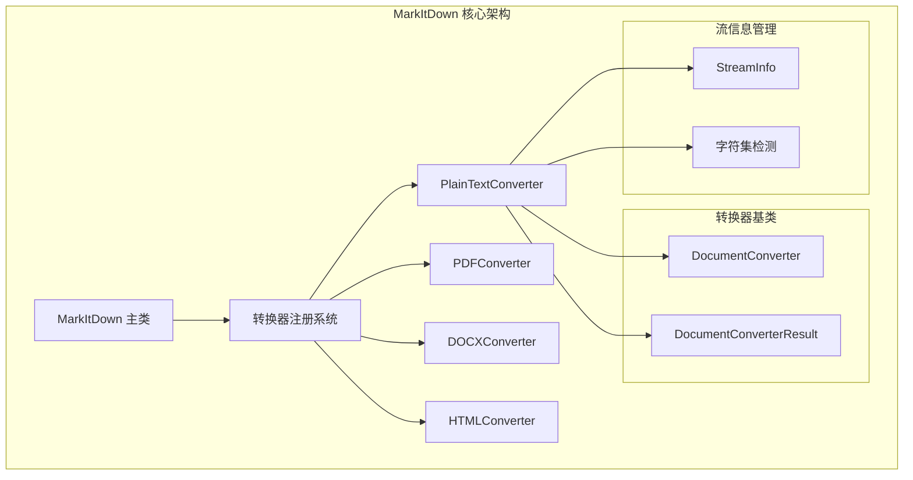
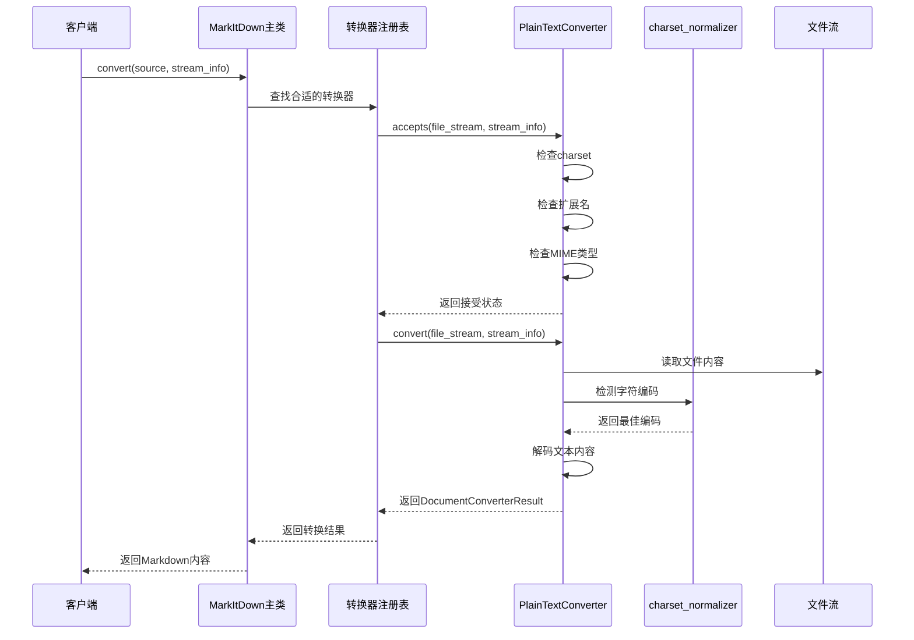
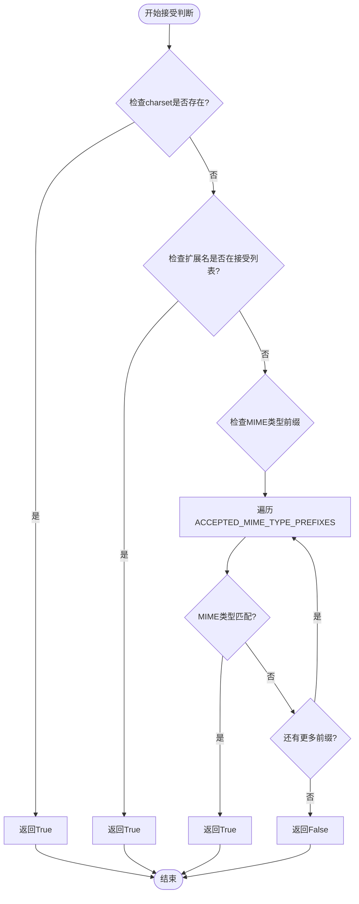
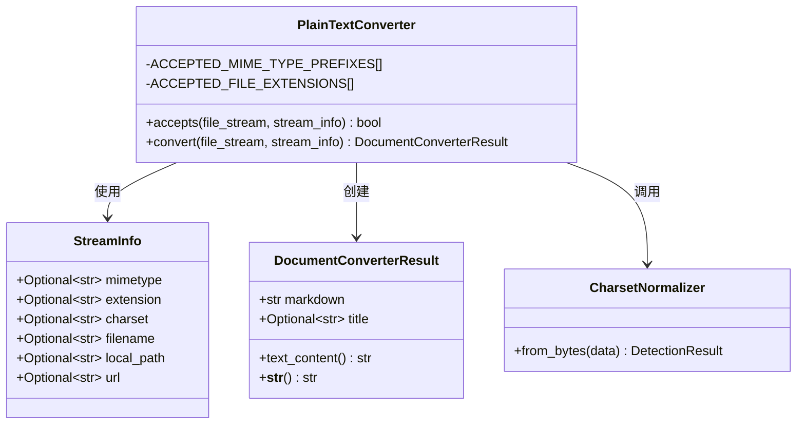
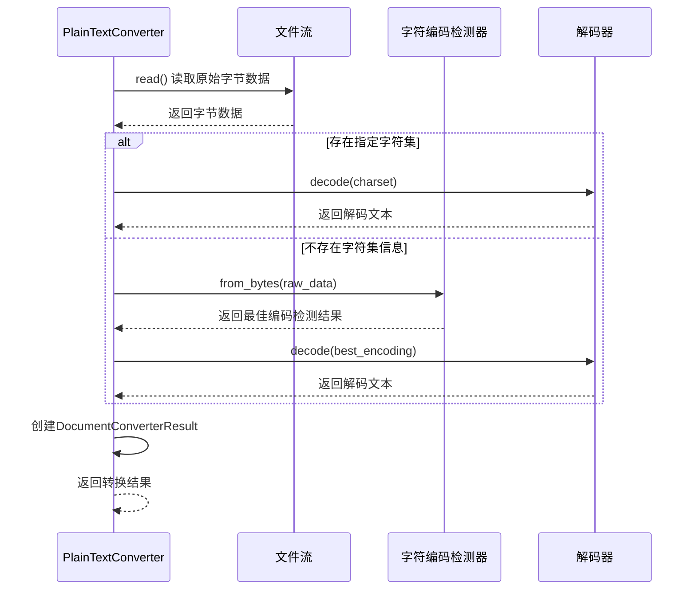
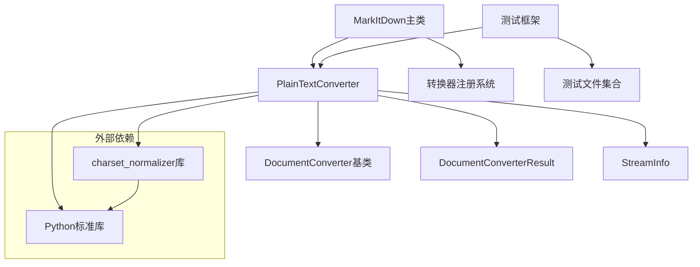

# 纯文本格式转换

<cite>
**本文档中引用的文件**
- [_plain_text_converter.py](file://packages/markitdown/src/markitdown/converters/_plain_text_converter.py)
- [_base_converter.py](file://packages/markitdown/src/markitdown/_base_converter.py)
- [_stream_info.py](file://packages/markitdown/src/markitdown/_stream_info.py)
- [_markitdown.py](file://packages/markitdown/src/markitdown/_markitdown.py)
- [test.json](file://packages/markitdown/tests/test_files/test.json)
</cite>

## 目录
1. [简介](#简介)
2. [项目结构概览](#项目结构概览)
3. [核心组件分析](#核心组件分析)
4. [架构概览](#架构概览)
5. [详细组件分析](#详细组件分析)
6. [依赖关系分析](#依赖关系分析)
7. [性能考虑](#性能考虑)
8. [故障排除指南](#故障排除指南)
9. [结论](#结论)

## 简介

PlainTextConverter是MarkItDown项目中的一个关键组件，作为兜底转换器在文档转换流程中扮演重要角色。该转换器专门处理纯文本格式的文件，包括各种文本文件、JSON数据、Markdown文档等。它通过智能的兼容性检测机制和强大的字符编码识别能力，确保能够处理各种未知或特殊格式的文本文件。

该转换器采用低优先级设计（PRIORITY_GENERIC_FILE_FORMAT），作为最后的保障机制，避免覆盖更具体、更专业的转换器。同时，它提供了灵活的文本兼容性判断逻辑，支持基于MIME类型、文件扩展名和字符集信息的综合评估。

## 项目结构概览

MarkItDown项目采用模块化的架构设计，其中纯文本转换功能位于核心转换器模块中：

**图表来源**
- [_markitdown.py](file://packages/markitdown/src/markitdown/_markitdown.py#L170-L180)
- [_base_converter.py](file://packages/markitdown/src/markitdown/_base_converter.py#L40-L106)

**章节来源**
- [_markitdown.py](file://packages/markitdown/src/markitdown/_markitdown.py#L50-L60)
- [_plain_text_converter.py](file://packages/markitdown/src/markitdown/converters/_plain_text_converter.py#L1-L72)

## 核心组件分析

### PlainTextConverter 类

PlainTextConverter继承自DocumentConverter基类，实现了纯文本格式的智能转换功能。该类包含两个核心方法：accepts()用于判断是否接受处理特定文件，convert()执行实际的文本转换操作。

### 接受条件判断机制

accepts方法采用多层次的兼容性检测策略：

1. **字符集优先检测**：如果stream_info.charset存在，则直接返回True
2. **扩展名匹配**：检查文件扩展名是否在预定义的接受列表中
3. **MIME类型前缀匹配**：验证MIME类型是否以预定义前缀开头

### 字符编码处理机制

convert方法实现了智能的字符编码处理：

1. **优先使用指定字符集**：当stream_info.charset存在时，直接使用指定编码
2. **自动检测机制**：使用charset_normalizer库自动检测字符编码
3. **备选解码策略**：在无charset信息时采用智能检测策略

**章节来源**
- [_plain_text_converter.py](file://packages/markitdown/src/markitdown/converters/_plain_text_converter.py#L25-L72)

## 架构概览

**图表来源**
- [_base_converter.py](file://packages/markitdown/src/markitdown/_base_converter.py#L40-L106)
- [_plain_text_converter.py](file://packages/markitdown/src/markitdown/converters/_plain_text_converter.py#L25-L72)

## 详细组件分析

### 接受条件判断算法

**图表来源**
- [_plain_text_converter.py](file://packages/markitdown/src/markitdown/converters/_plain_text_converter.py#L25-L51)

### 字符编码检测实现

**图表来源**
- [_plain_text_converter.py](file://packages/markitdown/src/markitdown/converters/_plain_text_converter.py#L1-L72)
- [_stream_info.py](file://packages/markitdown/src/markitdown/_stream_info.py#L1-L33)
- [_base_converter.py](file://packages/markitdown/src/markitdown/_base_converter.py#L10-L40)

### 支持的文件格式

| 文件类型 | 扩展名 | MIME类型前缀 | 处理特点 |
|---------|--------|-------------|----------|
| 文本文件 | .txt, .text | text/* | 基础纯文本处理 |
| Markdown文件 | .md, .markdown | application/markdown | 结构化文本保留 |
| JSON文件 | .json, .jsonl | application/json | 数据结构保持 |
| 日志文件 | .log | text/* | 时间序列数据处理 |

**章节来源**
- [_plain_text_converter.py](file://packages/markitdown/src/markitdown/converters/_plain_text_converter.py#L18-L30)

### 转换流程详解

**图表来源**
- [_plain_text_converter.py](file://packages/markitdown/src/markitdown/converters/_plain_text_converter.py#L53-L72)

**章节来源**
- [_plain_text_converter.py](file://packages/markitdown/src/markitdown/converters/_plain_text_converter.py#L53-L72)

## 依赖关系分析

**图表来源**
- [_plain_text_converter.py](file://packages/markitdown/src/markitdown/converters/_plain_text_converter.py#L1-L10)
- [_markitdown.py](file://packages/markitdown/src/markitdown/_markitdown.py#L170-L180)

**章节来源**
- [_plain_text_converter.py](file://packages/markitdown/src/markitdown/converters/_plain_text_converter.py#L1-L10)
- [_markitdown.py](file://packages/markitdown/src/markitdown/_markitdown.py#L170-L180)

## 性能考虑

### 低优先级设计优势

PlainTextConverter采用PRIORITY_GENERIC_FILE_FORMAT（值为10.0）的设计策略，具有以下优势：

1. **避免冲突**：不会覆盖更专业的转换器
2. **兜底保障**：确保所有文本都能被处理
3. **资源优化**：只有在其他转换器无法处理时才启动

### 字符编码检测性能

charset_normalizer库提供了高效的字符编码检测算法：

- **多编码支持**：支持超过100种字符编码
- **快速检测**：基于统计分析的快速识别
- **准确性高**：经过大量数据训练的准确率

### 内存使用优化

- **流式处理**：采用流式读取，避免大文件内存溢出
- **按需解码**：只在需要时进行字符解码
- **结果缓存**：合理利用Python的字符串缓存机制

## 故障排除指南

### 常见问题及解决方案

#### 1. 字符编码识别失败

**问题现象**：转换后的文本出现乱码或特殊字符

**解决方案**：
- 检查文件的实际字符编码
- 提供正确的charset参数
- 使用charset_normalizer手动检测编码

#### 2. 扩展名识别错误

**问题现象**：某些文本文件未被正确识别

**解决方案**：
- 验证文件扩展名是否在ACCEPTED_FILE_EXTENSIONS列表中
- 检查MIME类型设置
- 手动指定文件类型

#### 3. 性能问题

**问题现象**：大文件转换速度慢

**解决方案**：
- 分块处理大文件
- 使用流式处理
- 考虑使用更专业的转换器

**章节来源**
- [_plain_text_converter.py](file://packages/markitdown/src/markitdown/converters/_plain_text_converter.py#L53-L72)

## 结论

PlainTextConverter作为MarkItDown项目中的重要组件，展现了优秀的工程设计和实用性。其智能的兼容性检测机制、强大的字符编码识别能力和合理的优先级设计，使其成为处理各种文本格式文件的理想选择。

该转换器的主要优势包括：

1. **广泛的兼容性**：支持多种文本格式和字符编码
2. **智能检测**：基于多层次的兼容性判断
3. **高效处理**：采用流式处理和智能解码策略
4. **可靠兜底**：作为最后的保障机制

在实际应用中，PlainTextConverter特别适用于简单文本提取场景，如日志文件分析、配置文件处理、API响应解析等。对于结构化文档，建议优先使用专用的转换器以获得更好的处理效果。