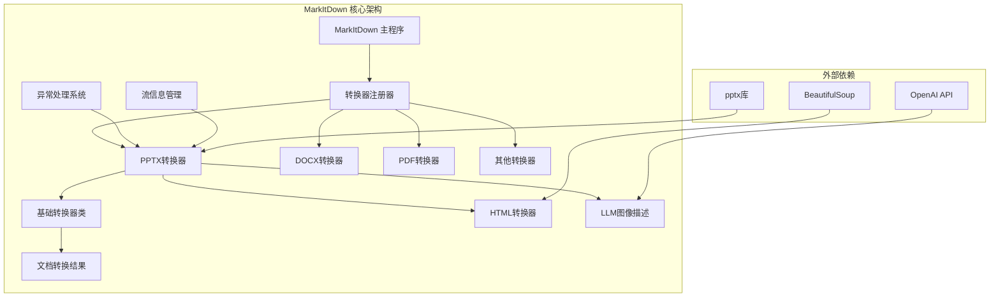
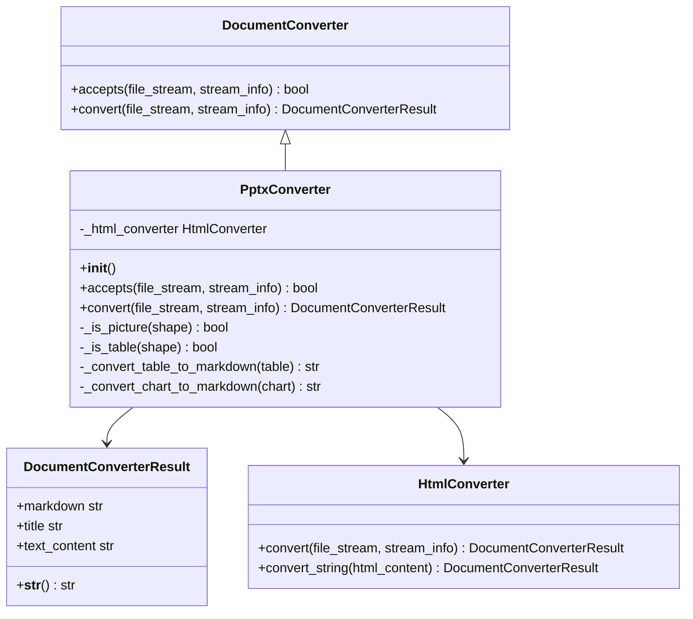
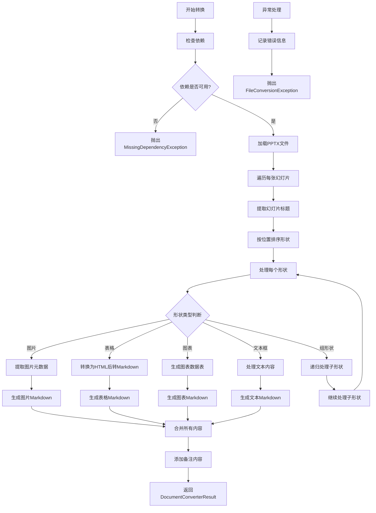
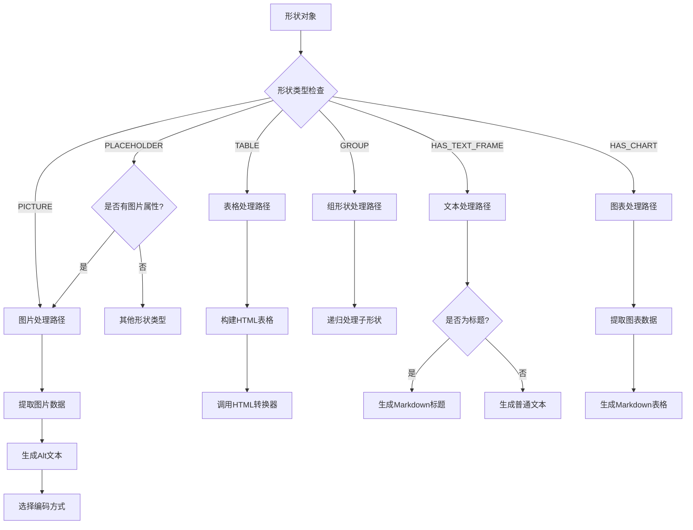
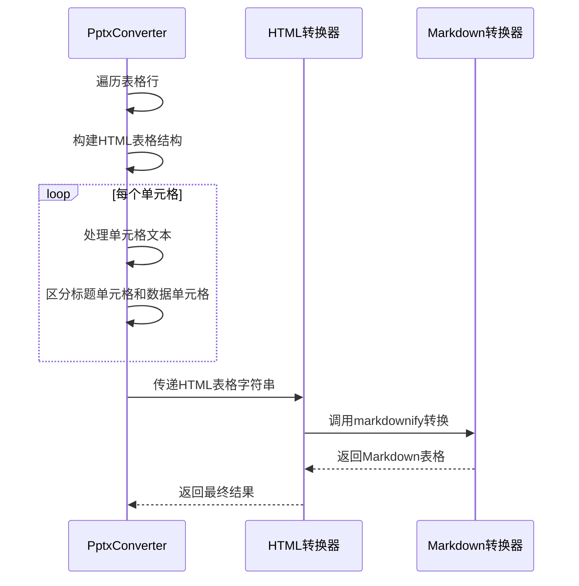
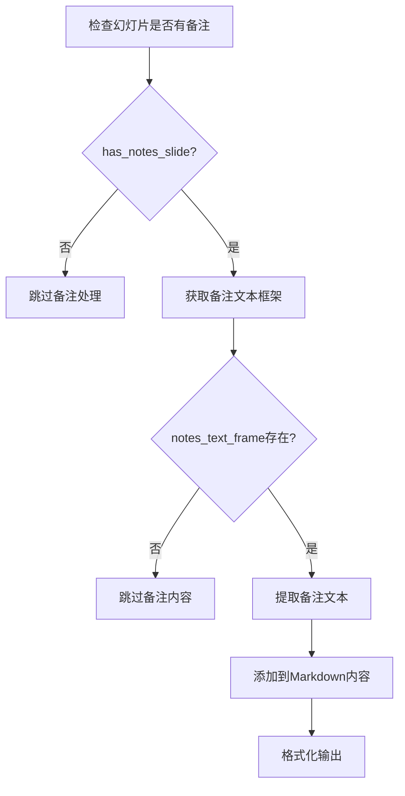
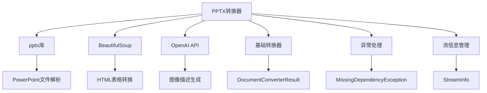
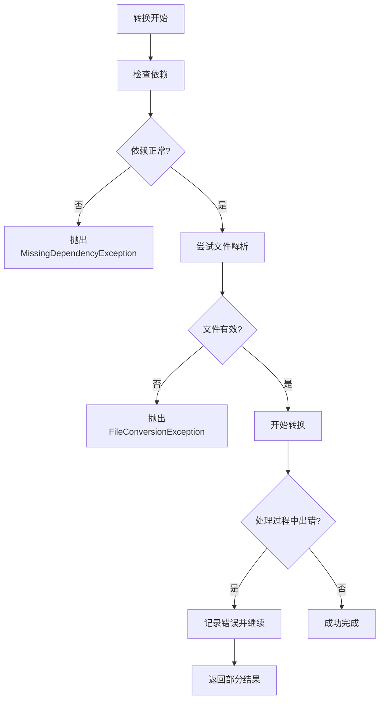

# 演示文稿格式支持详细文档

<cite>
**本文档中引用的文件**
- [_pptx_converter.py](file://packages/markitdown/src/markitdown/converters/_pptx_converter.py)
- [_base_converter.py](file://packages/markitdown/src/markitdown/_base_converter.py)
- [_exceptions.py](file://packages/markitdown/src/markitdown/_exceptions.py)
- [_html_converter.py](file://packages/markitdown/src/markitdown/converters/_html_converter.py)
- [_llm_caption.py](file://packages/markitdown/src/markitdown/converters/_llm_caption.py)
- [pyproject.toml](file://packages/markitdown/pyproject.toml)
- [_test_vectors.py](file://packages/markitdown/tests/_test_vectors.py)
- [test_module_misc.py](file://packages/markitdown/tests/test_module_misc.py)
</cite>

## 目录
1. [简介](#简介)
2. [项目结构概览](#项目结构概览)
3. [核心组件分析](#核心组件分析)
4. [架构概览](#架构概览)
5. [详细组件分析](#详细组件分析)
6. [依赖关系分析](#依赖关系分析)
7. [性能考虑](#性能考虑)
8. [故障排除指南](#故障排除指南)
9. [结论](#结论)

## 简介

MarkItDown是一个强大的文档转换工具，专门设计用于将各种格式的文件转换为Markdown格式。其中，PPTX转换器是其核心功能之一，专门负责将PowerPoint演示文稿文件（.pptx）转换为结构化的Markdown文档。

该转换器具有以下关键特性：
- 支持提取幻灯片中的文本内容，包括标题、副标题和普通文本
- 能够处理表格数据并将其转换为Markdown格式
- 支持图片和图表的识别与描述生成
- 提供详细的备注内容提取功能
- 具备异常处理和恢复机制

## 项目结构概览

MarkItDown项目采用模块化架构设计，PPTX转换器作为独立的转换器模块集成在整个系统中：



**图表来源**
- [_base_converter.py](file://packages/markitdown/src/markitdown/_base_converter.py#L1-L106)
- [_pptx_converter.py](file://packages/markitdown/src/markitdown/converters/_pptx_converter.py#L1-L265)

**章节来源**
- [pyproject.toml](file://packages/markitdown/pyproject.toml#L1-L113)
- [_base_converter.py](file://packages/markitdown/src/markitdown/_base_converter.py#L1-L106)

## 核心组件分析

### PPTX转换器类结构

PPTX转换器继承自基础转换器类，实现了特定于PowerPoint文件的转换逻辑：



**图表来源**
- [_base_converter.py](file://packages/markitdown/src/markitdown/_base_converter.py#L15-L40)
- [_pptx_converter.py](file://packages/markitdown/src/markitdown/converters/_pptx_converter.py#L35-L265)

### 接受格式定义

PPTX转换器通过严格的格式检查来确定是否能够处理输入文件：

| 文件类型 | MIME类型前缀 | 扩展名 | 识别方式 |
|---------|-------------|--------|----------|
| PPTX文件 | `application/vnd.openxmlformats-officedocument.presentationml` | `.pptx` | 同时检查MIME类型和文件扩展名 |

**章节来源**
- [_pptx_converter.py](file://packages/markitdown/src/markitdown/converters/_pptx_converter.py#L25-L35)

## 架构概览

PPTX转换器的整体工作流程遵循从文件读取到Markdown输出的标准化管道：



**图表来源**
- [_pptx_converter.py](file://packages/markitdown/src/markitdown/converters/_pptx_converter.py#L63-L200)

## 详细组件分析

### 形状类型识别系统

PPTX转换器通过形状类型识别来决定如何处理不同的内容元素：



**图表来源**
- [_pptx_converter.py](file://packages/markitdown/src/markitdown/converters/_pptx_converter.py#L199-L232)

### 图片处理机制

图片处理是PPTX转换器的重要功能，支持多种图片格式和描述生成：

#### 图片类型检测
- **MSO_SHAPE_TYPE.PICTURE**: 直接图片对象
- **MSO_SHAPE_TYPE.PLACEHOLDER**: 占位符图片（需要检查image属性）

#### 图片描述生成策略
1. **LLM描述生成**: 使用OpenAI等大语言模型生成详细描述
2. **嵌入式Alt文本**: 从PPTX文件中提取已有的描述
3. **组合描述**: 将LLM生成的描述与嵌入式描述结合
4. **默认名称**: 使用形状名称作为最后的备选方案

#### 编码选项
- **Base64编码**: 当`keep_data_uris=True`时，直接将图片数据嵌入Markdown
- **文件引用**: 默认情况下生成指向外部文件的链接

**章节来源**
- [_pptx_converter.py](file://packages/markitdown/src/markitdown/converters/_pptx_converter.py#L115-L166)
- [_llm_caption.py](file://packages/markitdown/src/markitdown/converters/_llm_caption.py#L1-L51)

### 表格转换流程

表格转换采用HTML中间格式策略，确保兼容性和准确性：



**图表来源**
- [_pptx_converter.py](file://packages/markitdown/src/markitdown/converters/_pptx_converter.py#L205-L232)
- [_html_converter.py](file://packages/markitdown/src/markitdown/converters/_html_converter.py#L1-L91)

### 图表处理机制

图表处理相对简单，主要提取数据并以Markdown表格形式呈现：

#### 支持的图表类型
- 折线图
- 柱状图  
- 饼图
- 散点图

#### 数据提取过程
1. 获取类别标签
2. 获取系列名称
3. 提取数值数据
4. 构建Markdown表格

#### 异常处理
- 不支持的图表类型会返回"[unsupported chart]"占位符
- 其他异常也会捕获并返回相同占位符

**章节来源**
- [_pptx_converter.py](file://packages/markitdown/src/markitdown/converters/_pptx_converter.py#L234-L265)

### 备注内容提取

每张幻灯片的备注内容都会被完整提取并添加到Markdown输出中：



**图表来源**
- [_pptx_converter.py](file://packages/markitdown/src/markitdown/converters/_pptx_converter.py#L185-L199)

**章节来源**
- [_pptx_converter.py](file://packages/markitdown/src/markitdown/converters/_pptx_converter.py#L180-L200)

## 依赖关系分析

### 核心依赖

PPTX转换器依赖于多个外部库来完成其功能：



**图表来源**
- [_pptx_converter.py](file://packages/markitdown/src/markitdown/converters/_pptx_converter.py#L1-L20)
- [_base_converter.py](file://packages/markitdown/src/markitdown/_base_converter.py#L1-L10)

### 可选依赖

根据项目的可选依赖配置，PPTX功能需要安装特定的包：

| 依赖包 | 功能 | 必需性 |
|--------|------|--------|
| `python-pptx` | PowerPoint文件解析 | 必需 |
| `openai` | 图像描述生成 | 可选 |
| `beautifulsoup4` | HTML处理 | 内置依赖 |

**章节来源**
- [pyproject.toml](file://packages/markitdown/pyproject.toml#L30-L45)

## 性能考虑

### 内存使用优化

1. **流式处理**: 使用二进制流而非完全加载到内存
2. **延迟加载**: 仅在需要时加载复杂的依赖项
3. **资源清理**: 及时释放不再需要的对象引用

### 处理大型文件

对于包含大量幻灯片或复杂内容的PPTX文件：
- 分块处理：逐张幻灯片处理，避免内存溢出
- 延迟转换：表格和图表转换采用延迟执行策略
- 缓存机制：重复使用的转换器实例

### 并发处理

虽然当前实现是单线程的，但架构设计支持未来的并发优化：
- 独立的形状处理函数
- 无状态的设计模式
- 明确的职责分离

## 故障排除指南

### 常见异常类型

#### 依赖缺失异常
当缺少必要的依赖包时，会抛出`MissingDependencyException`：

```python
# 错误示例
pip install markitdown[pptx]
# 或
pip install python-pptx
```

#### 文件格式异常
不支持的文件格式会触发`UnsupportedFormatException`。

#### 文件损坏异常
损坏的PPTX文件可能导致`FileConversionException`，包含详细的失败尝试信息。

### 异常处理策略



**图表来源**
- [_exceptions.py](file://packages/markitdown/src/markitdown/_exceptions.py#L1-L77)
- [_pptx_converter.py](file://packages/markitdown/src/markitdown/converters/_pptx_converter.py#L63-L85)

### 恢复机制

1. **形状级别恢复**: 单个形状处理失败不影响整体转换
2. **类型降级**: 不支持的图表类型返回占位符而非中断
3. **空值处理**: 缺失的备注或图片描述使用默认值

### 调试技巧

1. **启用详细日志**: 通过异常信息了解具体失败原因
2. **检查文件完整性**: 验证PPTX文件是否损坏
3. **验证依赖安装**: 确保所有必需的包都已正确安装

**章节来源**
- [_exceptions.py](file://packages/markitdown/src/markitdown/_exceptions.py#L40-L77)
- [test_module_misc.py](file://packages/markitdown/tests/test_module_misc.py#L330-L350)

## 结论

MarkItDown的PPTX转换器提供了一个强大而灵活的解决方案，用于将PowerPoint演示文稿转换为结构化的Markdown格式。其主要优势包括：

### 技术优势
- **全面的内容支持**: 文本、表格、图片、图表和备注都能被有效处理
- **智能的格式识别**: 基于形状类型的精确内容分类
- **可扩展的架构**: 模块化设计便于功能扩展和维护
- **健壮的异常处理**: 完善的错误恢复和用户反馈机制

### 应用场景
- **文档归档**: 将演示文稿转换为易于存储和检索的格式
- **内容迁移**: 在不同平台间转移演示文稿内容
- **辅助功能**: 为视觉障碍用户提供文本替代方案
- **AI集成**: 与大语言模型结合生成内容描述

### 发展方向
- **性能优化**: 支持更大规模的文件处理
- **格式扩展**: 支持更多PowerPoint特性和版本
- **质量提升**: 改进图片描述和表格转换的准确性
- **用户体验**: 提供更丰富的配置选项和调试信息

该转换器展现了现代文档处理工具的设计理念，即在保持功能完整性的同时，提供简洁易用的接口和可靠的处理能力。