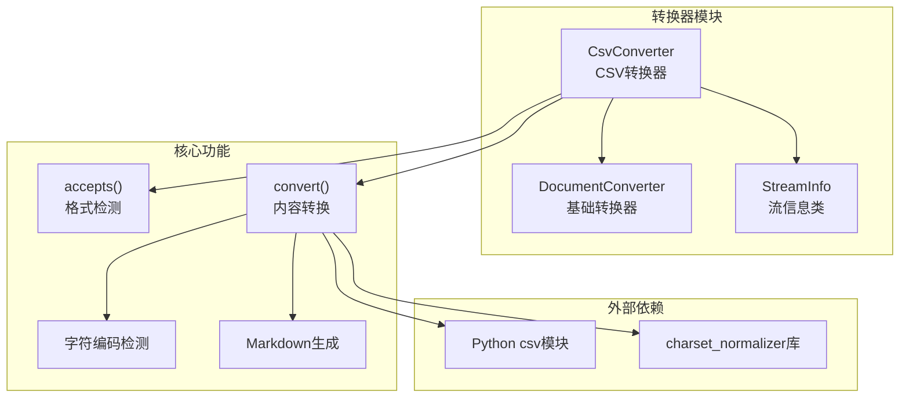
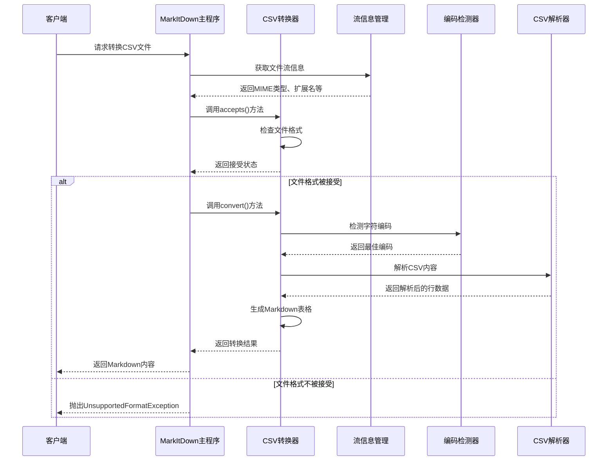
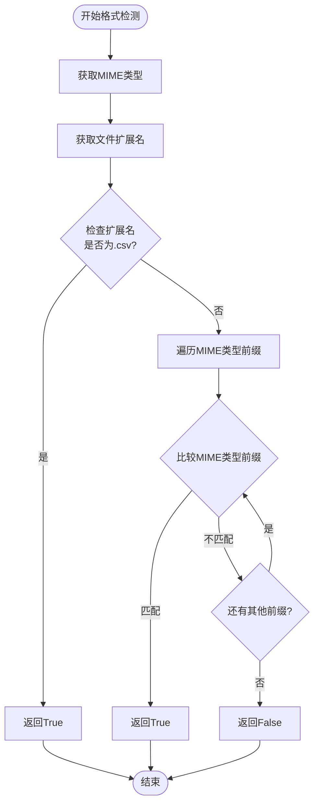
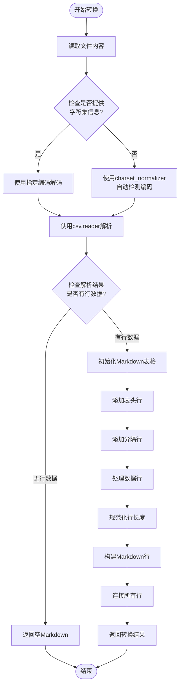
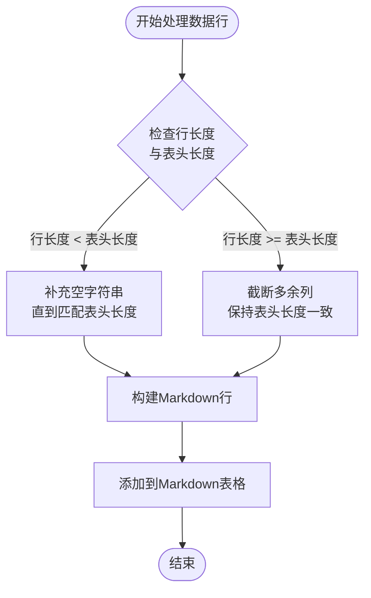
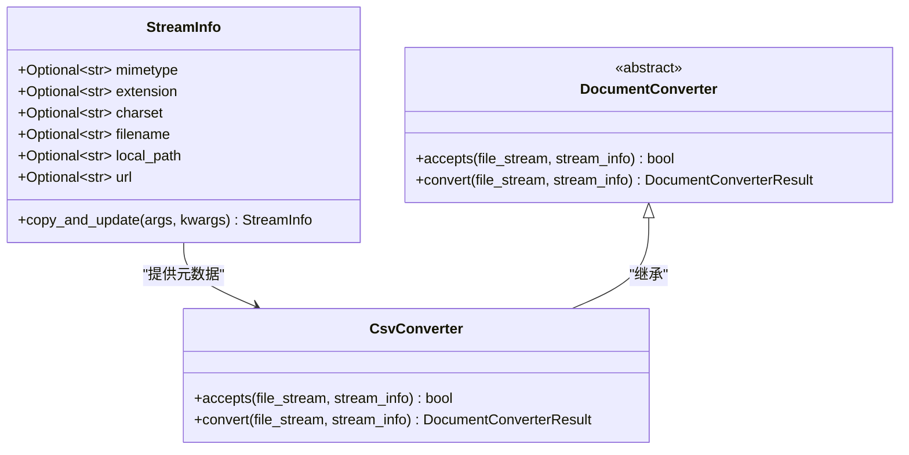
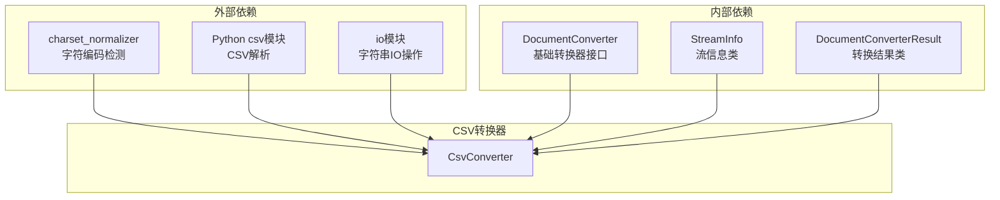

# CSV格式转换详细文档

<cite>
**本文档中引用的文件**
- [_csv_converter.py](file://packages/markitdown/src/markitdown/converters/_csv_converter.py)
- [_base_converter.py](file://packages/markitdown/src/markitdown/_base_converter.py)
- [_stream_info.py](file://packages/markitdown/src/markitdown/_stream_info.py)
- [_markitdown.py](file://packages/markitdown/src/markitdown/_markitdown.py)
- [_test_vectors.py](file://packages/markitdown/tests/_test_vectors.py)
- [test_mskanji.csv](file://packages/markitdown/tests/test_files/test_mskanji.csv)
- [__init__.py](file://packages/markitdown/src/markitdown/converters/__init__.py)
</cite>

## 目录
1. [简介](#简介)
2. [项目结构概述](#项目结构概述)
3. [核心组件分析](#核心组件分析)
4. [架构概览](#架构概览)
5. [详细组件分析](#详细组件分析)
6. [依赖关系分析](#依赖关系分析)
7. [性能考虑](#性能考虑)
8. [故障排除指南](#故障排除指南)
9. [结论](#结论)

## 简介

本文档深入分析了MarkItDown项目中的CSV格式转换功能，重点关注`CsvConverter`类的工作原理。该转换器负责将CSV文件转换为Markdown表格格式，支持多种字符编码检测和智能的表格规范化处理。

CSV转换器是MarkItDown文档转换系统的重要组成部分，它能够处理各种格式的CSV文件，包括不同的字符编码、特殊字符和不规则的行结构。通过深入理解其实现机制，我们可以更好地掌握其在实际应用中的表现和优化方向。

## 项目结构概述

MarkItDown项目采用模块化架构设计，CSV转换功能位于专门的转换器模块中：

**图表来源**
- [_csv_converter.py](file://packages/markitdown/src/markitdown/converters/_csv_converter.py#L1-L78)
- [_base_converter.py](file://packages/markitdown/src/markitdown/_base_converter.py#L1-L106)
- [_stream_info.py](file://packages/markitdown/src/markitdown/_stream_info.py#L1-L33)

**章节来源**
- [_csv_converter.py](file://packages/markitdown/src/markitdown/converters/_csv_converter.py#L1-L78)
- [_base_converter.py](file://packages/markitdown/src/markitdown/_base_converter.py#L1-L106)

## 核心组件分析

### CsvConverter类的核心特性

`CsvConverter`类继承自`DocumentConverter`基类，实现了CSV到Markdown的转换功能。该类具有以下核心特性：

#### 接受格式配置
- **MIME类型支持**: 支持`text/csv`和`application/csv`两种标准MIME类型
- **文件扩展名**: 识别`.csv`扩展名的文件
- **灵活的格式检测**: 基于文件元数据进行智能判断

#### 字符编码处理
- **优先使用指定编码**: 当`StreamInfo`提供字符集信息时直接使用
- **自动编码检测**: 使用`charset_normalizer`库自动检测未知编码
- **兼容性保证**: 支持多种常见的字符编码格式

#### 表格生成算法
- **智能规范化**: 处理不规则行（列数不足或超出）
- **Markdown格式**: 生成标准的Markdown表格结构
- **样式保持**: 保留原始数据的视觉布局

**章节来源**
- [_csv_converter.py](file://packages/markitdown/src/markitdown/converters/_csv_converter.py#L8-L18)

## 架构概览

CSV转换器在整个MarkItDown系统中的位置和作用：

**图表来源**
- [_markitdown.py](file://packages/markitdown/src/markitdown/_markitdown.py#L620-L651)
- [_csv_converter.py](file://packages/markitdown/src/markitdown/converters/_csv_converter.py#L20-L77)

## 详细组件分析

### accepts方法的格式检测机制

`accepts`方法是CSV转换器的第一道关卡，负责快速判断文件是否应该由该转换器处理：

**图表来源**
- [_csv_converter.py](file://packages/markitdown/src/markitdown/converters/_csv_converter.py#L20-L32)

#### 检测逻辑详解

1. **扩展名检测**: 首先检查文件扩展名是否为`.csv`，这是最直接的判断方式
2. **MIME类型检测**: 如果扩展名不是`.csv`，则遍历预定义的MIME类型前缀列表
3. **大小写不敏感**: 对MIME类型和扩展名都进行小写转换，确保检测的鲁棒性
4. **性能优化**: 采用短路逻辑，一旦找到匹配项立即返回

**章节来源**
- [_csv_converter.py](file://packages/markitdown/src/markitdown/converters/_csv_converter.py#L20-L32)

### convert方法的完整转换流程

`convert`方法是CSV转换的核心实现，包含以下关键步骤：

**图表来源**
- [_csv_converter.py](file://packages/markitdown/src/markitdown/converters/_csv_converter.py#L34-L77)

#### 字符编码处理策略

转换器采用了双重编码检测机制：

1. **优先级策略**: 首先检查`StreamInfo`中是否提供了字符集信息
2. **自动检测**: 如果未提供字符集信息，则使用`charset_normalizer.from_bytes()`进行自动检测
3. **编码标准化**: 将检测结果标准化为最佳匹配的编码名称

**章节来源**
- [_csv_converter.py](file://packages/markitdown/src/markitdown/converters/_csv_converter.py#L34-L48)

### Markdown表格生成算法

Markdown表格的生成遵循严格的结构规范：

#### 表头行构建
- **格式**: `| 列1 | 列2 | 列3 | ... |`
- **内容**: 直接使用CSV文件的第一行作为表头
- **对齐**: 默认左对齐（Markdown表格的默认行为）

#### 分隔行生成
- **格式**: `| --- | --- | --- | ... |`
- **数量**: 与表头列数相同
- **用途**: 定义表头与数据行之间的分隔线

#### 数据行规范化处理

对于每一行数据，转换器执行以下规范化操作：

**图表来源**
- [_csv_converter.py](file://packages/markitdown/src/markitdown/converters/_csv_converter.py#L58-L70)

#### 特殊字符处理策略

转换器在处理特殊字符时采用了以下策略：

1. **引号处理**: Python的csv模块会自动处理引号转义
2. **换行符处理**: 换行符会被视为普通字符，不会破坏表格结构
3. **制表符处理**: 制表符会被正确解析为字段分隔符
4. **Unicode字符**: 通过字符编码检测确保正确显示

**章节来源**
- [_csv_converter.py](file://packages/markitdown/src/markitdown/converters/_csv_converter.py#L58-L77)

### StreamInfo集成机制

`StreamInfo`类提供了丰富的文件元数据信息，支持更精确的格式检测：

**图表来源**
- [_stream_info.py](file://packages/markitdown/src/markitdown/_stream_info.py#L6-L32)
- [_csv_converter.py](file://packages/markitdown/src/markitdown/converters/_csv_converter.py#L20-L32)

**章节来源**
- [_stream_info.py](file://packages/markitdown/src/markitdown/_stream_info.py#L6-L32)
- [_csv_converter.py](file://packages/markitdown/src/markitdown/converters/_csv_converter.py#L20-L77)

## 依赖关系分析

CSV转换器的依赖关系图展示了其与其他组件的交互：

**图表来源**
- [_csv_converter.py](file://packages/markitdown/src/markitdown/converters/_csv_converter.py#L1-L10)
- [_base_converter.py](file://packages/markitdown/src/markitdown/_base_converter.py#L1-L5)

### 关键依赖说明

1. **charset_normalizer**: 提供强大的字符编码自动检测功能
2. **Python csv模块**: 标准库中的CSV解析器，提供可靠的解析能力
3. **io.StringIO**: 内存中的字符串IO操作，避免临时文件创建
4. **typing**: 类型注解，提高代码可读性和类型安全性

**章节来源**
- [_csv_converter.py](file://packages/markitdown/src/markitdown/converters/_csv_converter.py#L1-L10)

## 性能考虑

### 内存使用情况分析

CSV转换器在处理不同规模的CSV文件时表现出不同的内存特征：

#### 小文件处理（< 1MB）
- **内存占用**: 主要消耗在完整的文件读取和解析阶段
- **性能特点**: 快速完成，内存使用稳定
- **优化空间**: 可以考虑流式处理减少峰值内存使用

#### 中等文件处理（1MB - 10MB）
- **内存占用**: 解析后的行数据存储在内存中
- **性能特点**: 处理时间与文件大小成正比
- **优化建议**: 实现分块处理机制

#### 大文件处理（> 10MB）
- **内存风险**: 完整的行列表可能占用大量内存
- **性能瓶颈**: 内存分配和垃圾回收成为主要开销
- **解决方案**: 考虑流式处理或分页读取

### 流式处理优化方向

为了处理超大CSV文件，可以考虑以下优化方案：

1. **逐行处理**: 使用生成器模式逐行读取和转换
2. **分块处理**: 将大文件分割为较小的块进行处理
3. **内存映射**: 对于非常大的文件，考虑使用内存映射文件
4. **异步处理**: 实现异步I/O操作提高并发性能

### 编码检测性能

字符编码检测是一个相对耗时的操作，特别是在自动检测模式下：

- **缓存机制**: 对于已知编码的文件，可以缓存检测结果
- **启发式检测**: 对于常见编码提供快速路径
- **并行检测**: 对于多编码候选，可以并行尝试

## 故障排除指南

### 常见问题及解决方案

#### 编码相关问题

**问题**: 文件显示乱码或字符丢失
**原因**: 字符编码检测失败或指定编码不正确
**解决方案**: 
- 检查文件的实际编码格式
- 明确指定正确的字符集参数
- 使用`charset_normalizer`的调试功能

#### 表格格式问题

**问题**: 生成的Markdown表格格式不正确
**原因**: CSV文件包含不规则的行结构
**解决方案**:
- 检查CSV文件的完整性
- 确保所有行具有相同的列数
- 使用规范化处理确保表格一致性

#### 性能问题

**问题**: 处理大文件时内存使用过高
**原因**: 完整的行列表存储在内存中
**解决方案**:
- 实现流式处理机制
- 考虑使用生成器模式
- 对于超大文件，考虑分块处理

**章节来源**
- [_csv_converter.py](file://packages/markitdown/src/markitdown/converters/_csv_converter.py#L34-L48)

### 调试技巧

1. **启用详细日志**: 在转换过程中记录关键步骤
2. **验证输入数据**: 检查CSV文件的格式和编码
3. **测试边界条件**: 验证空文件、单行文件等特殊情况
4. **监控内存使用**: 使用内存分析工具跟踪内存消耗

## 结论

MarkItDown的CSV转换器展现了优秀的工程实践，通过以下特性实现了高质量的CSV到Markdown转换：

### 核心优势

1. **智能格式检测**: 基于MIME类型和文件扩展名的双重检测机制
2. **健壮的编码处理**: 支持手动指定和自动检测两种编码方式
3. **优雅的表格生成**: 智能处理不规则行，保持表格结构一致性
4. **模块化设计**: 清晰的接口设计便于维护和扩展

### 技术亮点

- **双重编码检测**: 结合用户指定和自动检测，提供最佳兼容性
- **规范化算法**: 智能处理列数不一致的情况，确保表格完整性
- **标准兼容**: 严格遵循Markdown表格规范，保证渲染一致性

### 改进建议

1. **流式处理**: 对于大文件实现流式处理以降低内存使用
2. **并发优化**: 考虑多线程或异步处理提高大文件处理效率
3. **缓存机制**: 对频繁访问的文件实现缓存以提高性能
4. **错误恢复**: 增强对损坏CSV文件的容错能力

该CSV转换器为MarkItDown项目提供了可靠的文档转换能力，是整个系统中不可或缺的重要组件。通过深入理解其工作原理，开发者可以更好地利用其功能，并在需要时进行适当的优化和扩展。