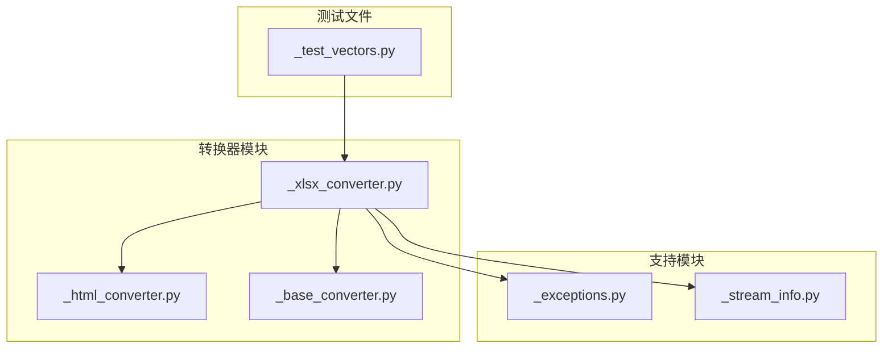
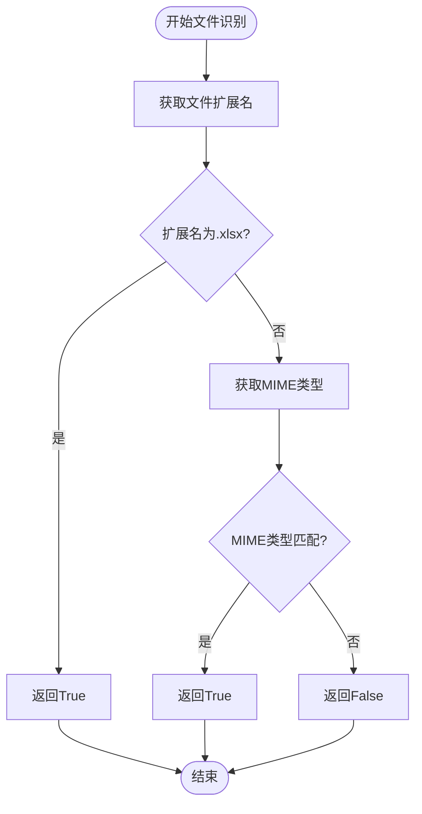
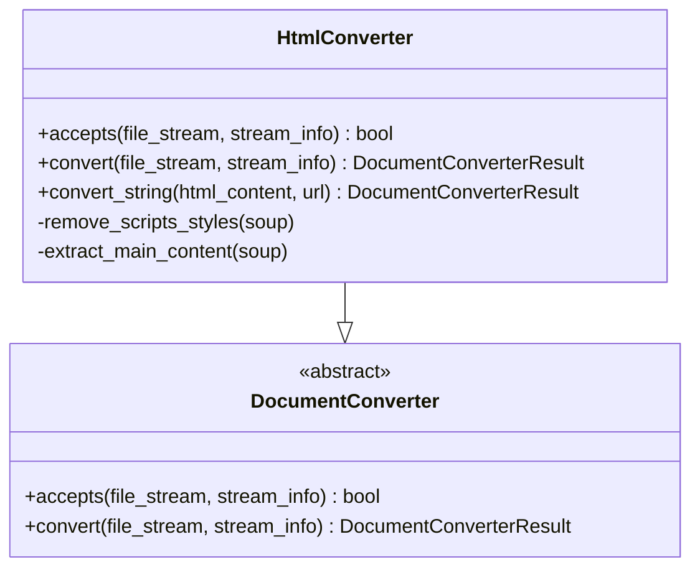
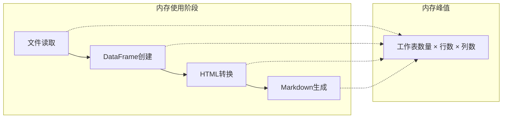
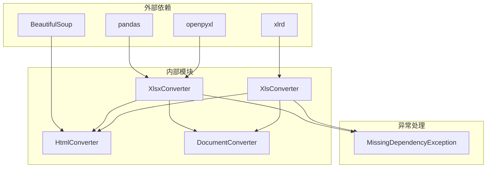

# XLSX格式转换

<cite>
**本文档中引用的文件**
- [_xlsx_converter.py](file://packages/markitdown/src/markitdown/converters/_xlsx_converter.py)
- [_html_converter.py](file://packages/markitdown/src/markitdown/converters/_html_converter.py)
- [_base_converter.py](file://packages/markitdown/src/markitdown/_base_converter.py)
- [_exceptions.py](file://packages/markitdown/src/markitdown/_exceptions.py)
- [_stream_info.py](file://packages/markitdown/src/markitdown/_stream_info.py)
- [_test_vectors.py](file://packages/markitdown/tests/_test_vectors.py)
</cite>

## 目录
1. [简介](#简介)
2. [项目结构](#项目结构)
3. [核心组件](#核心组件)
4. [架构概览](#架构概览)
5. [详细组件分析](#详细组件分析)
6. [依赖关系分析](#依赖关系分析)
7. [性能考虑](#性能考虑)
8. [故障排除指南](#故障排除指南)
9. [结论](#结论)

## 简介

XLSX格式转换器是MarkItDown项目中的一个重要组件，负责将Microsoft Excel电子表格文件（XLSX和XLS格式）转换为Markdown格式。该转换器通过结合pandas库的数据处理能力和openpyxl引擎的强大功能，能够高效地读取Excel文件的多个工作表，并将其转换为结构化的Markdown表格。

本文档详细说明了XlsxConverter类的实现机制，包括文件识别、数据转换流程、以及处理Excel文件中各种复杂功能的限制。

## 项目结构

XLSX格式转换功能主要分布在以下文件中：



**图表来源**
- [_xlsx_converter.py](file://packages/markitdown/src/markitdown/converters/_xlsx_converter.py#L1-L42)
- [_html_converter.py](file://packages/markitdown/src/markitdown/converters/_html_converter.py#L1-L30)

**章节来源**
- [_xlsx_converter.py](file://packages/markitdown/src/markitdown/converters/_xlsx_converter.py#L1-L156)
- [_html_converter.py](file://packages/markitdown/src/markitdown/converters/_html_converter.py#L1-L91)

## 核心组件

XLSX格式转换系统的核心组件包括：

### XlsxConverter类
负责处理XLSX文件格式的转换，继承自DocumentConverter基类，提供专门的文件识别和转换功能。

### XlsConverter类  
处理传统的XLS文件格式，使用不同的引擎（xlrd）进行文件读取。

### HtmlConverter类
作为中间转换器，负责将HTML格式的表格内容转换为Markdown格式。

**章节来源**
- [_xlsx_converter.py](file://packages/markitdown/src/markitdown/converters/_xlsx_converter.py#L34-L156)

## 架构概览

XLSX格式转换的整体架构采用分层设计，确保了功能的模块化和可维护性：

```mermaid
sequenceDiagram
participant Client as 客户端
participant XLSX as XlsxConverter
participant Pandas as pandas/openpyxl
participant HTML as HtmlConverter
participant Markdown as Markdown输出
Client->>XLSX : convert(file_stream, stream_info)
XLSX->>XLSX : 检查依赖项
XLSX->>Pandas : pd.read_excel(sheet_name=None)
Pandas-->>XLSX : 返回DataFrame字典
XLSX->>XLSX : 遍历每个工作表
loop 每个工作表
XLSX->>Pandas : df.to_html(index=False)
Pandas-->>XLSX : HTML表格字符串
XLSX->>HTML : convert_string(html_content)
HTML->>HTML : BeautifulSoup解析
HTML->>HTML : 转换为Markdown
HTML-->>XLSX : Markdown表格
end
XLSX-->>Client : DocumentConverterResult
```



**图表来源**
- [_xlsx_converter.py](file://packages/markitdown/src/markitdown/converters/_xlsx_converter.py#L60-L90)
- [_html_converter.py](file://packages/markitdown/src/markitdown/converters/_html_converter.py#L40-L70)

## 详细组件分析

### XlsxConverter类实现

XlsxConverter类是XLSX格式转换的核心实现，具有以下关键特性：

#### 文件识别机制



**图表来源**
- [_xlsx_converter.py](file://packages/markitdown/src/markitdown/converters/_xlsx_converter.py#L42-L58)

#### 转换流程详解

XlsxConverter的convert方法实现了完整的转换流程：

1. **依赖检查**：验证pandas和openpyxl库是否可用
2. **文件读取**：使用pandas的read_excel函数读取所有工作表
3. **逐表转换**：遍历每个工作表，生成对应的Markdown表格
4. **HTML到Markdown转换**：利用HtmlConverter进行格式转换

#### 支持的文件格式

| 文件格式 | 扩展名 | MIME类型前缀 | 引擎 |
|---------|--------|-------------|------|
| XLSX | .xlsx | application/vnd.openxmlformats-officedocument.spreadsheetml.sheet | openpyxl |
| XLS | .xls | application/vnd.ms-excel, application/excel | xlrd |

**章节来源**
- [_xlsx_converter.py](file://packages/markitdown/src/markitdown/converters/_xlsx_converter.py#L26-L38)
- [_xlsx_converter.py](file://packages/markitdown/src/markitdown/converters/_xlsx_converter.py#L60-L90)

### HtmlConverter类的作用

HtmlConverter在转换流程中扮演着关键的中间转换角色：



**图表来源**
- [_html_converter.py](file://packages/markitdown/src/markitdown/converters/_html_converter.py#L20-L91)

**章节来源**
- [_html_converter.py](file://packages/markitdown/src/markitdown/converters/_html_converter.py#L20-L91)

### 处理限制和约束

#### 不支持的功能

由于技术限制，XLSX转换器无法处理以下Excel功能：

- **公式计算**：仅转换公式的显示值而非计算结果
- **图表数据**：图表本身不被转换，但图表数据会以表格形式呈现
- **合并单元格**：合并单元格会被展开为重复的值
- **条件格式**：格式化规则不会被保留
- **宏和VBA代码**：脚本和宏代码会被忽略

#### 数据类型处理

| Excel数据类型 | 转换行为 | 示例 |
|--------------|----------|------|
| 文本 | 直接转换 | "Hello World" → "Hello World" |
| 数值 | 格式化转换 | 123.45 → "123.45" |
| 日期 | ISO格式 | 2024-01-15 |
| 布尔值 | 真/假文本 | TRUE → "true" |
| 空值 | 空字符串 | NULL → "" |

**章节来源**
- [_xlsx_converter.py](file://packages/markitdown/src/markitdown/converters/_xlsx_converter.py#L82-L90)

### 大型文件处理策略

#### 内存消耗特征

XLSX转换器的内存使用模式如下：



**图表来源**
- [_xlsx_converter.py](file://packages/markitdown/src/markitdown/converters/_xlsx_converter.py#L60-L90)

#### 性能优化建议

1. **分批处理**：对于超大文件，考虑分批读取工作表
2. **内存监控**：监控转换过程中的内存使用情况
3. **数据清理**：在转换前清理不必要的列或行
4. **并发处理**：对多个独立的工作表使用并发处理

**章节来源**
- [_xlsx_converter.py](file://packages/markitdown/src/markitdown/converters/_xlsx_converter.py#L60-L70)

## 依赖关系分析

XLSX转换器的依赖关系图展示了其与其他组件的交互：



**图表来源**
- [_xlsx_converter.py](file://packages/markitdown/src/markitdown/converters/_xlsx_converter.py#L1-L20)
- [_html_converter.py](file://packages/markitdown/src/markitdown/converters/_html_converter.py#L1-L15)

**章节来源**
- [_xlsx_converter.py](file://packages/markitdown/src/markitdown/converters/_xlsx_converter.py#L1-L20)

## 性能考虑

### 转换时间复杂度

XLSX转换的时间复杂度主要取决于：
- 工作表数量：O(n)，其中n为工作表数量
- 数据行数：O(m)，其中m为总行数
- 数据列数：O(k)，其中k为平均列数

### 内存使用优化

为了优化内存使用，建议：
1. 使用生成器模式处理大型文件
2. 及时释放不再需要的DataFrame对象
3. 对于只读操作，使用适当的参数避免不必要的数据复制

## 故障排除指南

### 常见问题及解决方案

#### 依赖缺失错误
**问题**：缺少pandas或openpyxl库
**解决方案**：安装必要的依赖包
```bash
pip install pandas openpyxl
```

#### 文件格式不支持
**问题**：文件格式不在支持列表中
**解决方案**：确认文件扩展名或MIME类型正确

#### 大文件处理失败
**问题**：内存不足导致转换失败
**解决方案**：分批处理或增加系统内存

**章节来源**
- [_xlsx_converter.py](file://packages/markitdown/src/markitdown/converters/_xlsx_converter.py#L65-L75)

## 结论

XLSX格式转换器提供了强大而灵活的Excel文件转换功能，通过精心设计的架构实现了高效的文件处理能力。其模块化的设计使得功能易于扩展和维护，同时通过合理的错误处理机制确保了系统的稳定性。

该转换器特别适用于需要将Excel数据转换为Markdown格式的场景，如文档自动化、数据分析报告生成等应用。通过理解其工作原理和限制，开发者可以更好地利用这一工具来满足特定的业务需求。