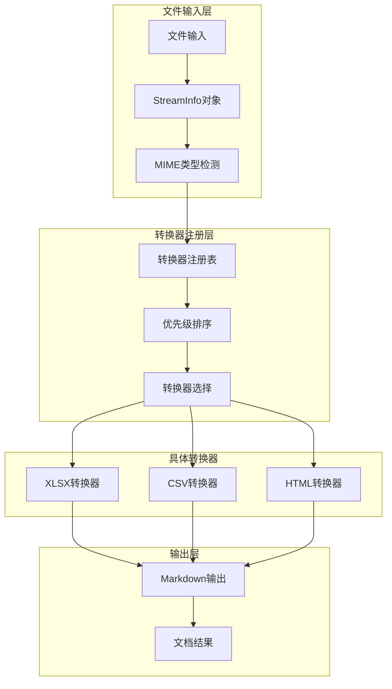
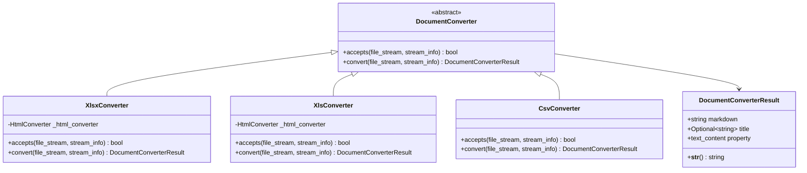
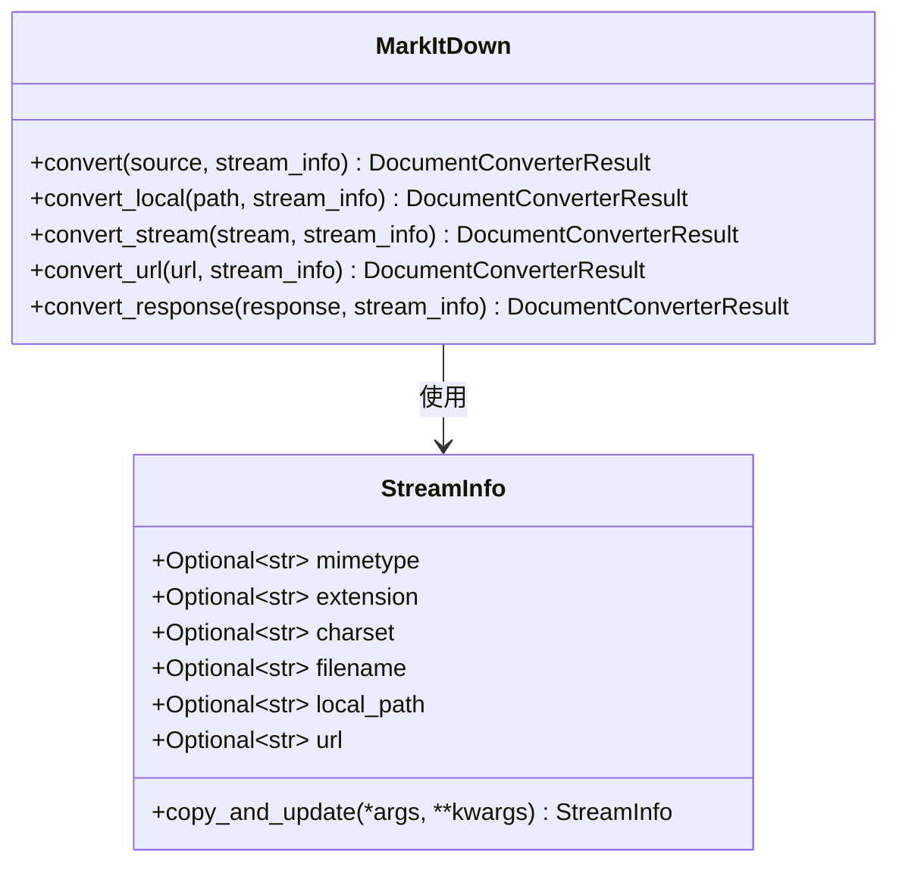
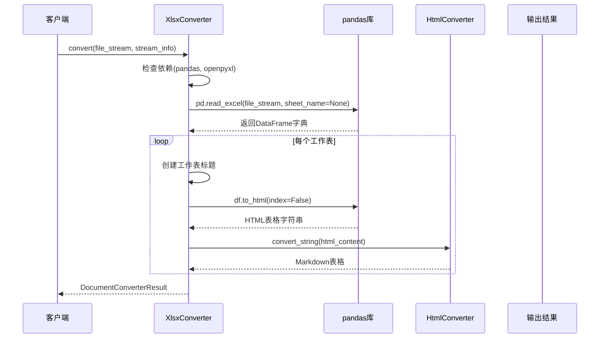
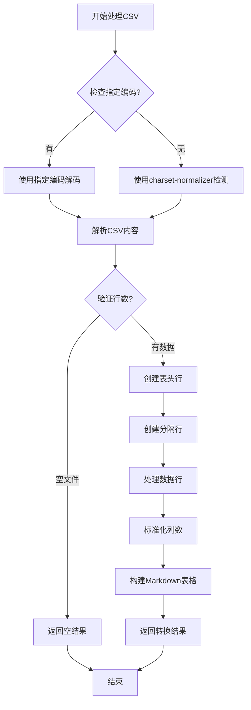
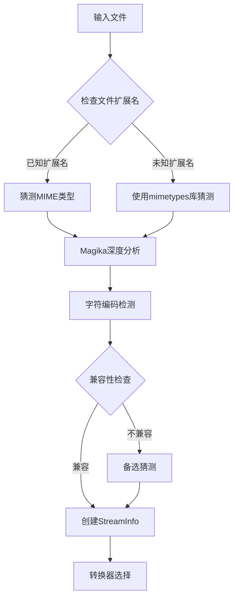
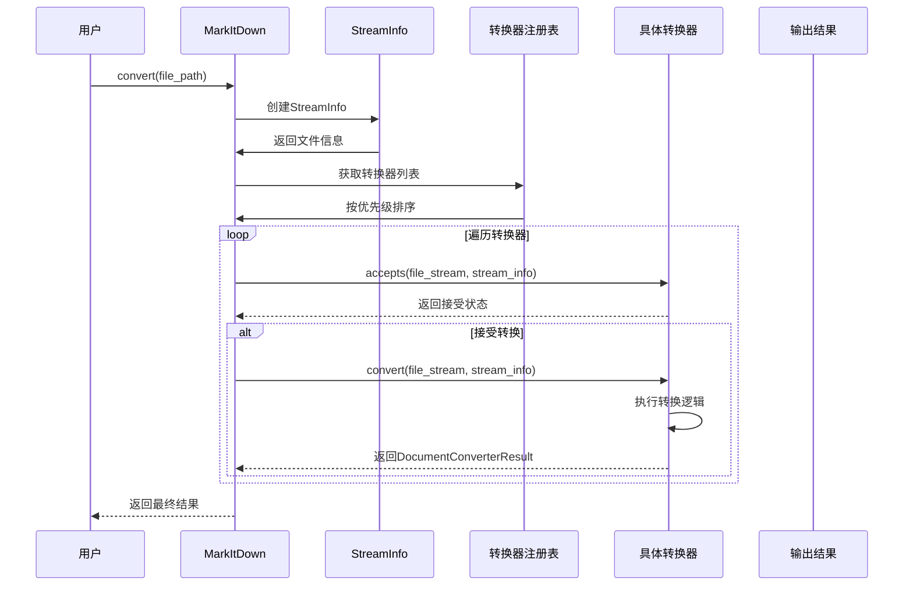
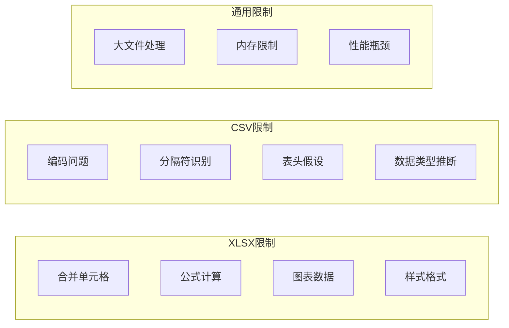

# 电子表格格式转换详细文档

<cite>
**本文档中引用的文件**
- [_stream_info.py](file://packages/markitdown/src/markitdown/_stream_info.py)
- [_base_converter.py](file://packages/markitdown/src/markitdown/_base_converter.py)
- [_xlsx_converter.py](file://packages/markitdown/src/markitdown/converters/_xlsx_converter.py)
- [_csv_converter.py](file://packages/markitdown/src/markitdown/converters/_csv_converter.py)
- [_html_converter.py](file://packages/markitdown/src/markitdown/converters/_html_converter.py)
- [_markitdown.py](file://packages/markitdown/src/markitdown/_markitdown.py)
- [_test_vectors.py](file://packages/markitdown/tests/_test_vectors.py)
</cite>

## 目录
1. [简介](#简介)
2. [项目架构概览](#项目架构概览)
3. [核心组件分析](#核心组件分析)
4. [XLSX格式转换器](#xlsx格式转换器)
5. [CSV格式转换器](#csv格式转换器)
6. [StreamInfo机制](#streaminfo机制)
7. [转换流程与性能优化](#转换流程与性能优化)
8. [转换示例与对比](#转换示例与对比)
9. [限制与挑战](#限制与挑战)
10. [故障排除指南](#故障排除指南)
11. [总结](#总结)

## 简介

本文档详细介绍了MarkItDown项目中的电子表格格式转换功能，重点分析了XLSX和CSV两种格式的转换实现。该系统通过模块化的转换器架构，支持多种电子表格格式到Markdown的转换，同时提供了智能的文件类型识别和流式处理能力。

电子表格转换是文档处理中的重要组成部分，它能够将复杂的表格数据结构转换为易于阅读和处理的Markdown格式。本文档涵盖了从底层实现原理到实际应用的全方位内容。

## 项目架构概览

MarkItDown采用基于StreamInfo的智能文件类型识别和转换架构，支持多种文档格式的统一处理。



**图表来源**
- [_markitdown.py](file://packages/markitdown/src/markitdown/_markitdown.py#L100-L200)
- [_stream_info.py](file://packages/markitdown/src/markitdown/_stream_info.py#L1-L33)

**章节来源**
- [_markitdown.py](file://packages/markitdown/src/markitdown/_markitdown.py#L1-L100)
- [_base_converter.py](file://packages/markitdown/src/markitdown/_base_converter.py#L1-L50)

## 核心组件分析

### 基础转换器架构

所有转换器都继承自`DocumentConverter`基类，该类定义了统一的接口规范：



**图表来源**
- [_base_converter.py](file://packages/markitdown/src/markitdown/_base_converter.py#L30-L106)
- [_xlsx_converter.py](file://packages/markitdown/src/markitdown/converters/_xlsx_converter.py#L30-L158)
- [_csv_converter.py](file://packages/markitdown/src/markitdown/converters/_csv_converter.py#L15-L78)

### StreamInfo数据结构

`StreamInfo`类提供了统一的文件元数据管理机制：



**图表来源**
- [_stream_info.py](file://packages/markitdown/src/markitdown/_stream_info.py#L5-L33)
- [_markitdown.py](file://packages/markitdown/src/markitdown/_markitdown.py#L300-L400)

**章节来源**
- [_base_converter.py](file://packages/markitdown/src/markitdown/_base_converter.py#L1-L106)
- [_stream_info.py](file://packages/markitdown/src/markitdown/_stream_info.py#L1-L33)

## XLSX格式转换器

### 实现原理

XLSX转换器支持现代Office Open XML格式的Excel文件，通过pandas库进行数据读取，并利用HTML转换器生成Markdown表格。

#### 支持的格式和MIME类型

| 格式类型 | 文件扩展名 | MIME类型前缀 | 引擎支持 |
|---------|-----------|-------------|----------|
| XLSX | `.xlsx` | `application/vnd.openxmlformats-officedocument.spreadsheetml.sheet` | openpyxl |
| XLS | `.xls` | `application/vnd.ms-excel`, `application/excel` | xlrd |

#### 转换流程



**图表来源**
- [_xlsx_converter.py](file://packages/markitdown/src/markitdown/converters/_xlsx_converter.py#L60-L90)
- [_html_converter.py](file://packages/markitdown/src/markitdown/converters/_html_converter.py#L60-L90)

#### 内存管理策略

XLSX转换器采用了以下内存优化策略：

1. **流式处理**: 直接从二进制流读取数据，避免临时文件存储
2. **分页加载**: 使用pandas的`sheet_name=None`参数按需加载工作表
3. **及时释放**: 每个工作表处理完成后立即释放内存

**章节来源**
- [_xlsx_converter.py](file://packages/markitdown/src/markitdown/converters/_xlsx_converter.py#L1-L158)

## CSV格式转换器

### 实现原理

CSV转换器专门处理逗号分隔值文件，提供了灵活的字符编码检测和表格结构化功能。

#### 字符编码处理



**图表来源**
- [_csv_converter.py](file://packages/markitdown/src/markitdown/converters/_csv_converter.py#L40-L78)

#### 表格结构化算法

CSV转换器实现了智能的表格结构化算法：

1. **表头处理**: 自动识别第一行为表头
2. **列对齐**: 动态调整列数以匹配表头
3. **数据填充**: 不足列数自动填充空字符串
4. **截断处理**: 超出列数的数据被截断

**章节来源**
- [_csv_converter.py](file://packages/markitdown/src/markitdown/converters/_csv_converter.py#L1-L78)

## StreamInfo机制

### 文件类型识别

StreamInfo机制通过多层次的文件类型识别确保准确的转换器选择：



**图表来源**
- [_markitdown.py](file://packages/markitdown/src/markitdown/_markitdown.py#L700-L776)

### 转换器优先级系统

系统采用优先级机制确保最合适的转换器被选择：

| 优先级 | 转换器类型 | 示例 |
|--------|-----------|------|
| 0.0 | 特定格式转换器 | `.docx`, `.pdf`, `.xlsx` |
| 10.0 | 通用格式转换器 | `.txt`, `.html`, `.zip` |

**章节来源**
- [_markitdown.py](file://packages/markitdown/src/markitdown/_markitdown.py#L50-L60)
- [_markitdown.py](file://packages/markitdown/src/markitdown/_markitdown.py#L650-L700)

## 转换流程与性能优化

### 整体转换流程



**图表来源**
- [_markitdown.py](file://packages/markitdown/src/markitdown/_markitdown.py#L350-L450)

### 性能优化策略

1. **懒加载**: 插件和转换器按需加载
2. **流式处理**: 支持非可寻址流的缓冲处理
3. **内存管理**: 及时释放中间结果
4. **错误恢复**: 多重转换器尝试机制

**章节来源**
- [_markitdown.py](file://packages/markitdown/src/markitdown/_markitdown.py#L300-L400)

## 转换示例与对比

### XLSX转换示例

**输入**: Excel文件包含多个工作表

**转换后Markdown格式**:
```
## 工作表1名称
| 列1 | 列2 | 列3 |
| --- | --- | --- |
| 数据1 | 数据2 | 数据3 |
| 数据4 | 数据5 | 数据6 |

## 工作表2名称
| 数值列 | 文本列 | 日期列 |
| --- | --- | --- |
| 100 | 示例文本 | 2024-01-01 |
| 200 | 另一个示例 | 2024-01-02 |
```

### CSV转换示例

**输入**: 日文CSV文件（Shift-JIS编码）

**转换后Markdown格式**:
```
| 名前 | 年齢 | 住所 |
| --- | --- | --- |
| 佐藤太郎 | 30 | 東京 |
| 三木英子 | 25 | 大阪 |
| 髙橋淳 | 35 | 名古屋 |
```

### 转换效果对比

| 特性 | XLSX转换器 | CSV转换器 |
|------|-----------|----------|
| 多工作表支持 | ✓ | ✗ |
| 表头保留 | ✓ | ✓ |
| 格式保持 | ✓ | ✗ |
| 编码检测 | 内置 | 内置 |
| 性能开销 | 中等 | 低 |
| 内存使用 | 中等 | 低 |

**章节来源**
- [_test_vectors.py](file://packages/markitdown/tests/_test_vectors.py#L30-L50)
- [_test_vectors.py](file://packages/markitdown/tests/_test_vectors.py#L140-L150)

## 限制与挑战

### 技术限制

1. **复杂格式处理**: 合并单元格、公式计算、条件格式无法完全保留
2. **大数据集**: 超大文件可能导致内存压力
3. **字符编码**: 某些特殊编码可能识别失败
4. **依赖要求**: 需要安装额外的Python包

### 处理限制



### 解决方案建议

1. **渐进式处理**: 对超大文件采用分块处理
2. **错误处理**: 提供详细的错误信息和恢复选项
3. **配置优化**: 允许用户调整处理参数
4. **扩展支持**: 支持插件扩展特定格式处理

## 故障排除指南

### 常见问题及解决方案

#### 依赖缺失问题

**问题**: 导入错误或功能不可用
**解决方案**: 
- 安装必要的依赖包
- 检查Python版本兼容性
- 验证包安装完整性

#### 编码识别问题

**问题**: 中文或其他非ASCII字符显示异常
**解决方案**:
- 明确指定字符编码
- 使用charset-normalizer自动检测
- 检查文件实际编码格式

#### 内存不足问题

**问题**: 处理大文件时内存溢出
**解决方案**:
- 分批处理大型文件
- 减少同时处理的文件数量
- 增加系统可用内存

**章节来源**
- [_xlsx_converter.py](file://packages/markitdown/src/markitdown/converters/_xlsx_converter.py#L60-L80)
- [_csv_converter.py](file://packages/markitdown/src/markitdown/converters/_csv_converter.py#L30-L50)

## 总结

MarkItDown的电子表格格式转换系统提供了强大而灵活的文档处理能力。通过模块化的架构设计，系统能够：

1. **智能识别**: 基于StreamInfo机制的多维度文件类型识别
2. **高效转换**: 针对不同格式优化的转换算法
3. **灵活扩展**: 支持新格式的插件式扩展
4. **稳定可靠**: 完善的错误处理和恢复机制

该系统特别适用于需要批量处理电子表格数据的场景，如文档归档、知识库构建、数据分析等应用领域。通过合理的配置和使用，可以显著提高文档处理的效率和质量。

对于开发者而言，理解这些转换器的工作原理有助于更好地利用系统功能，并在需要时进行定制化开发。系统的开放架构也为进一步的功能扩展提供了良好的基础。