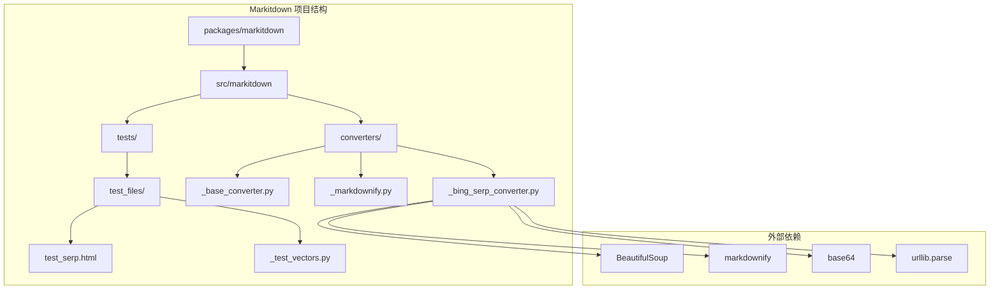
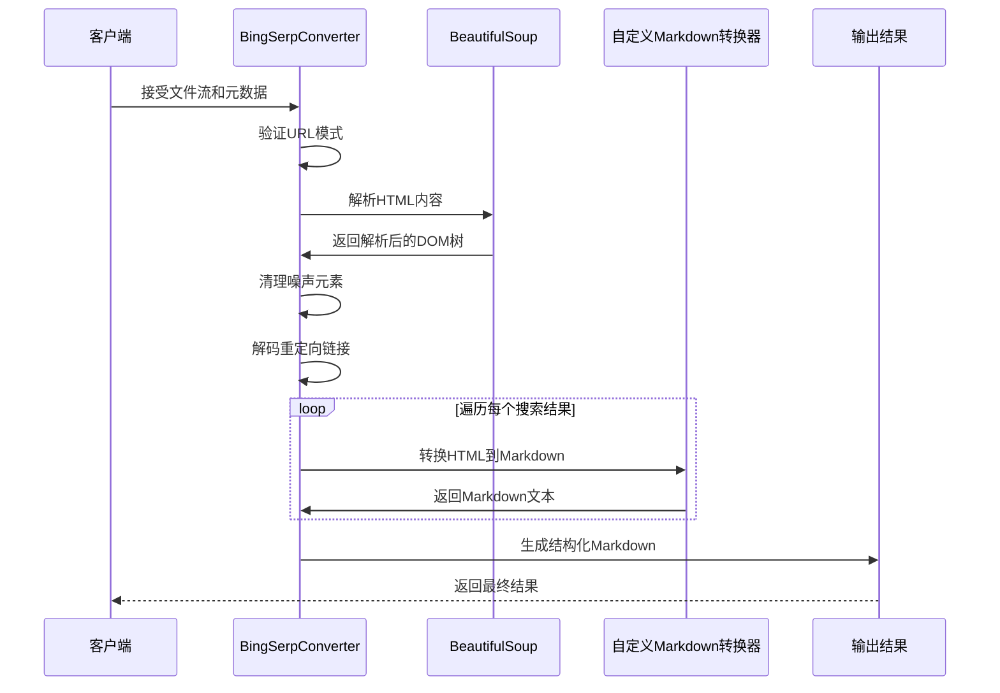
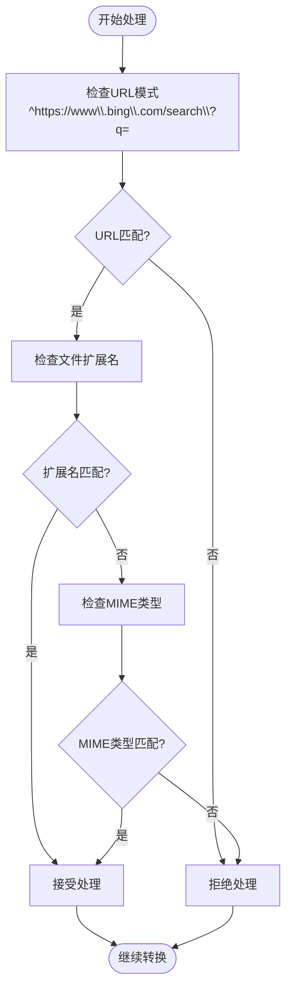
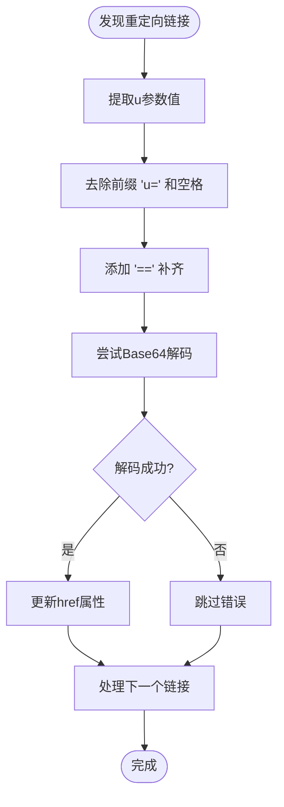
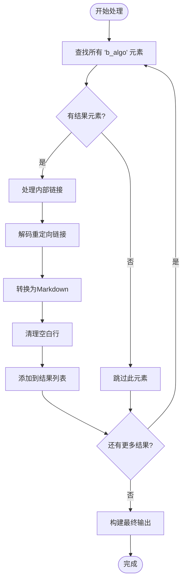
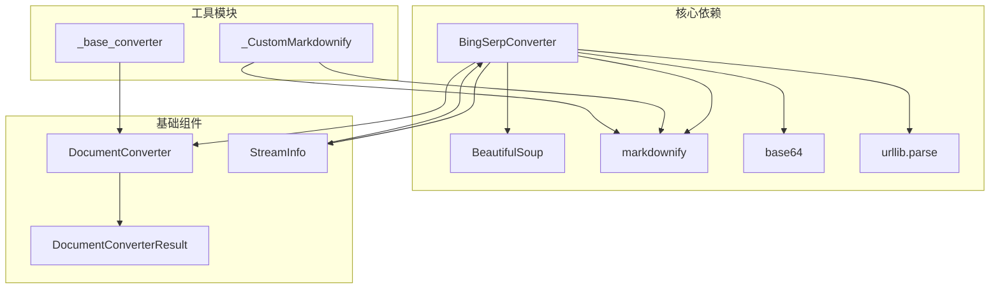

# Bing 搜索结果页转换器

<cite>
**本文档中引用的文件**
- [_bing_serp_converter.py](file://packages/markitdown/src/markitdown/converters/_bing_serp_converter.py)
- [_base_converter.py](file://packages/markitdown/src/markitdown/_base_converter.py)
- [_markdownify.py](file://packages/markitdown/src/markitdown/converters/_markdownify.py)
- [test_serp.html](file://packages/markitdown/tests/test_files/test_serp.html)
- [_test_vectors.py](file://packages/markitdown/tests/_test_vectors.py)
</cite>

## 目录
1. [简介](#简介)
2. [项目结构](#项目结构)
3. [核心组件](#核心组件)
4. [架构概览](#架构概览)
5. [详细组件分析](#详细组件分析)
6. [依赖关系分析](#依赖关系分析)
7. [性能考虑](#性能考虑)
8. [故障排除指南](#故障排除指南)
9. [结论](#结论)

## 简介

BingSerpConverter 是 Markitdown 项目中的一个专门组件，用于从 Bing 搜索结果页面（SERP）中提取有机搜索结果并将其转换为 Markdown 格式。该转换器通过识别特定的 URL 查询参数 'q' 来判断是否为 Bing 搜索结果页面，并采用复杂的 HTML 解析和数据提取技术。

### 主要特性

- **智能 URL 识别**：通过正则表达式匹配 Bing SERP 的特定 URL 模式
- **重定向链接解码**：处理 Bing 特有的 base64 编码重定向链接
- **结果块过滤**：精确识别和提取 'b_algo' 类别的有机搜索结果
- **噪声清理**：移除 'tptt' 和 'algoSlug_icon' 等干扰元素
- **Markdown 转换**：将 HTML 内容转换为结构化的 Markdown 文本
- **广告位过滤**：自动排除广告内容以确保结果质量

## 项目结构

**图表来源**
- [_bing_serp_converter.py](file://packages/markitdown/src/markitdown/converters/_bing_serp_converter.py#L1-L10)
- [_base_converter.py](file://packages/markitdown/src/markitdown/_base_converter.py#L1-L10)

**章节来源**
- [_bing_serp_converter.py](file://packages/markitdown/src/markitdown/converters/_bing_serp_converter.py#L1-L121)

## 核心组件

### BingSerpConverter 类

这是主要的转换器类，继承自 `DocumentConverter` 基类，负责处理 Bing 搜索结果页面的转换逻辑。

#### 关键属性和常量

- **ACCEPTED_MIME_TYPE_PREFIXES**：接受的 MIME 类型前缀列表
- **ACCEPTED_FILE_EXTENSIONS**：接受的文件扩展名列表
- **URL 模式匹配**：使用正则表达式验证 Bing SERP URL

#### 核心方法

1. **accepts()**：确定是否应该处理给定的输入流
2. **convert()**：执行实际的转换操作

**章节来源**
- [_bing_serp_converter.py](file://packages/markitdown/src/markitdown/converters/_bing_serp_converter.py#L25-L54)

## 架构概览

**图表来源**
- [_bing_serp_converter.py](file://packages/markitdown/src/markitdown/converters/_bing_serp_converter.py#L56-L121)
- [_markdownify.py](file://packages/markitdown/src/markitdown/converters/_markdownify.py#L1-L127)

## 详细组件分析

### URL 识别机制

转换器使用严格的 URL 模式匹配来确保只处理真正的 Bing 搜索结果页面：

**图表来源**
- [_bing_serp_converter.py](file://packages/markitdown/src/markitdown/converters/_bing_serp_converter.py#L35-L54)

### Base64 解码机制

Bing 使用复杂的重定向系统，其中目标 URL 包含在 'u' 参数中，并经过 base64 编码：

**图表来源**
- [_bing_serp_converter.py](file://packages/markitdown/src/markitdown/converters/_bing_serp_converter.py#L88-L100)

### 结果块处理流程

**图表来源**
- [_bing_serp_converter.py](file://packages/markitdown/src/markitdown/converters/_bing_serp_converter.py#L78-L119)

### 噪声清理机制

转换器实现了多层噪声清理策略：

#### tptt 元素处理
- **目标**：处理时间戳显示格式
- **方法**：为包含字符串的时间戳元素添加尾随空格

#### algoSlug_icon 元素处理  
- **目标**：移除分类标识图标
- **方法**：直接从 DOM 中提取这些元素

**章节来源**
- [_bing_serp_converter.py](file://packages/markitdown/src/markitdown/converters/_bing_serp_converter.py#L73-L77)

### Markdown 转换优化

使用自定义的 `_CustomMarkdownify` 类进行 HTML 到 Markdown 的转换：

#### 特殊处理特性
- **标题样式**：使用 ATX 样式 (#, ##, ###)
- **JavaScript 链接过滤**：移除危险的 JavaScript 链接
- **大型数据 URI 图片**：截断过大的图片数据 URI
- **URI 转义**：确保 URI 正确转义且不与 Markdown 语法冲突

**章节来源**
- [_markdownify.py](file://packages/markitdown/src/markitdown/converters/_markdownify.py#L1-L127)

## 依赖关系分析

**图表来源**
- [_bing_serp_converter.py](file://packages/markitdown/src/markitdown/converters/_bing_serp_converter.py#L1-L10)
- [_base_converter.py](file://packages/markitdown/src/markitdown/_base_converter.py#L1-L10)

### 外部依赖分析

| 依赖项 | 版本要求 | 用途 | 可选性 |
|--------|----------|------|--------|
| BeautifulSoup | 最新稳定版 | HTML 解析和 DOM 操作 | 必需 |
| markdownify | 最新稳定版 | HTML 到 Markdown 转换 | 必需 |
| base64 | Python 标准库 | Base64 编码解码 | 必需 |
| urllib.parse | Python 标准库 | URL 解析和查询参数处理 | 必需 |

**章节来源**
- [_bing_serp_converter.py](file://packages/markitdown/src/markitdown/converters/_bing_serp_converter.py#L1-L10)

## 性能考虑

### 内存使用优化

- **流式处理**：使用二进制流而非完整加载整个 HTML 文件
- **DOM 遍历**：仅遍历必要的元素类别 ('b_algo', 'tptt', 'algoSlug_icon')
- **及时释放**：处理完成后立即清理临时对象

### 处理效率

- **早期退出**：在 URL 模式不匹配时立即返回
- **批量操作**：使用 BeautifulSoup 的批量查找功能
- **异常处理**：优雅处理解码失败的情况而不中断整个流程

### 扩展性设计

- **插件架构**：基于 DocumentConverter 基类的可扩展设计
- **配置选项**：支持通过 kwargs 传递自定义配置
- **错误恢复**：部分处理失败不影响整体流程

## 故障排除指南

### 常见问题及解决方案

#### 1. URL 模式匹配失败
**症状**：转换器拒绝处理 Bing SERP URL
**原因**：URL 格式不符合预期模式
**解决方案**：检查 URL 是否以 `https://www.bing.com/search?q=` 开头

#### 2. Base64 解码错误
**症状**：重定向链接未正确解码
**原因**：编码格式变化或数据损坏
**解决方案**：检查 'u' 参数格式，确保符合预期编码规则

#### 3. HTML 结构变化
**症状**：搜索结果提取失败
**原因**：Bing 页面结构调整
**解决方案**：更新 CSS 选择器和元素识别逻辑

#### 4. 性能问题
**症状**：大文件处理缓慢
**解决方案**：
- 减少不必要的 DOM 遍历
- 优化正则表达式模式
- 考虑使用更高效的 HTML 解析库

### 调试技巧

1. **启用详细日志**：在转换过程中记录关键步骤
2. **中间结果检查**：保存解析后的 DOM 树用于调试
3. **单元测试**：针对不同场景编写测试用例

**章节来源**
- [_bing_serp_converter.py](file://packages/markitdown/src/markitdown/converters/_bing_serp_converter.py#L88-L100)

## 结论

BingSerpConverter 是一个精心设计的组件，展示了如何处理复杂的网页内容提取任务。其主要优势包括：

### 技术亮点

1. **智能 URL 识别**：通过精确的正则表达式确保只处理正确的页面
2. **robust 解码机制**：优雅处理 Bing 特有的重定向编码
3. **噪声过滤**：有效移除干扰元素保持结果纯净
4. **Markdown 转换**：高质量的 HTML 到 Markdown 转换

### 局限性和改进建议

#### 当前局限性
- **页面结构依赖**：高度依赖特定的 HTML 结构
- **编码格式限制**：仅支持特定的 Base64 变体
- **实时性挑战**：需要定期更新以适应页面变化

#### 改进建议
1. **API 优先策略**：建议优先使用 Bing Search API
2. **缓存机制**：实现结果缓存减少重复请求
3. **错误处理增强**：增加更详细的错误报告和恢复机制
4. **并发处理**：支持多个搜索结果页面的并发处理

### 最佳实践

1. **频率控制**：避免过于频繁的请求以免触发 IP 封禁
2. **用户代理设置**：正确设置请求头模拟真实浏览器行为
3. **异常处理**：实现完善的异常处理和重试机制
4. **监控告警**：建立监控系统及时发现处理异常

这个转换器为处理 Bing 搜索结果提供了一个可靠的解决方案，同时提醒开发者注意使用官方 API 的重要性和潜在的法律风险。