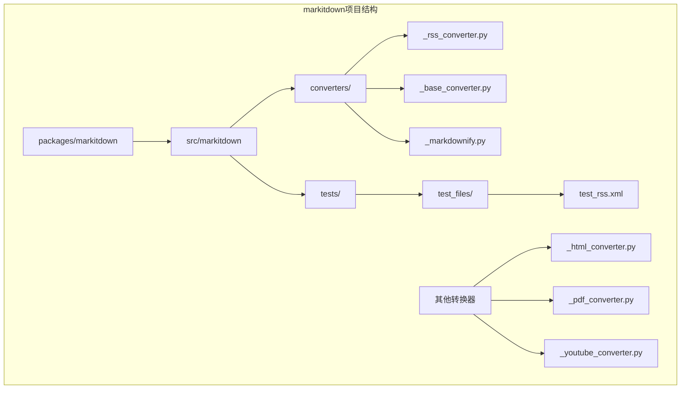
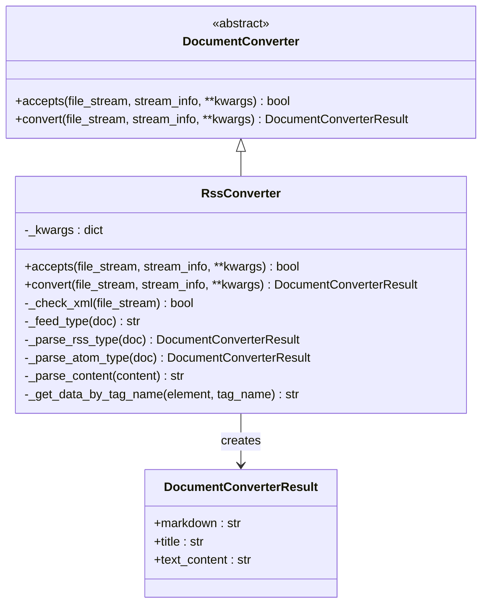
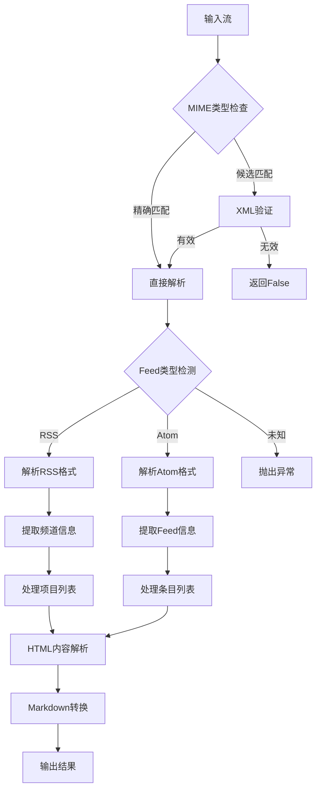
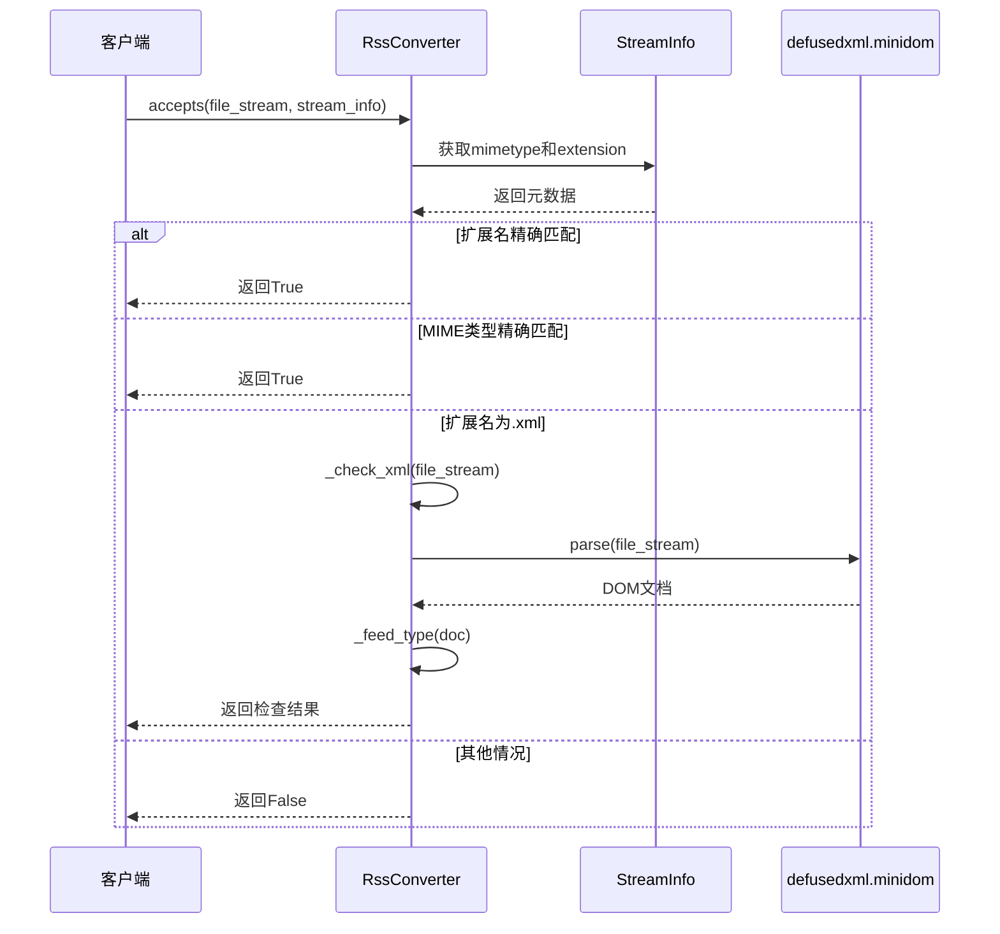
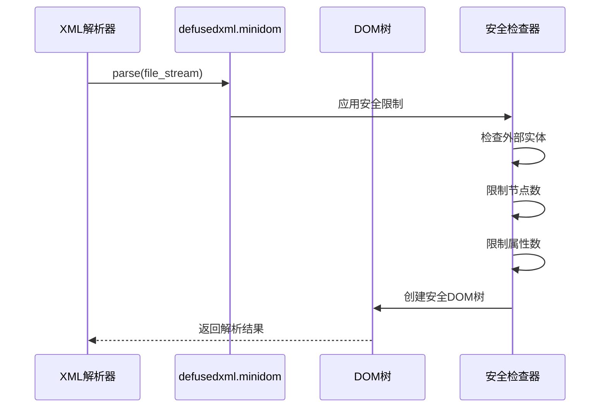
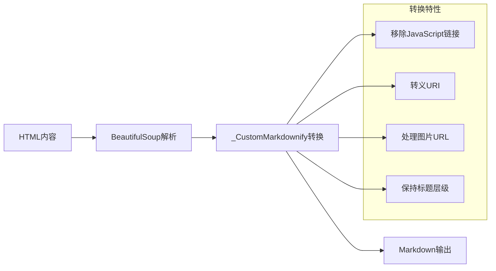
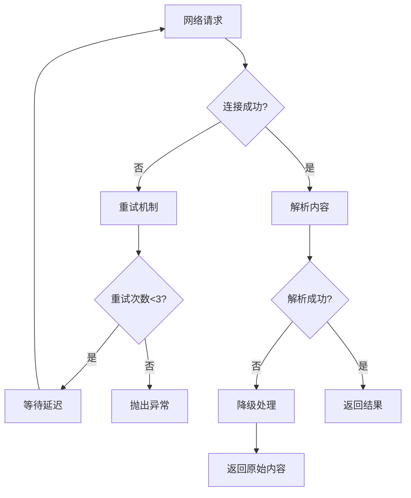

# RSS 转换器实现机制深度分析

<cite>
**本文档中引用的文件**
- [_rss_converter.py](file://packages/markitdown/src/markitdown/converters/_rss_converter.py)
- [_base_converter.py](file://packages/markitdown/src/markitdown/_base_converter.py)
- [_markdownify.py](file://packages/markitdown/src/markitdown/converters/_markdownify.py)
- [test_rss.xml](file://packages/markitdown/tests/test_files/test_rss.xml)
</cite>

## 目录
1. [简介](#简介)
2. [项目结构概览](#项目结构概览)
3. [核心组件分析](#核心组件分析)
4. [架构设计](#架构设计)
5. [详细组件分析](#详细组件分析)
6. [XML安全解析机制](#xml安全解析机制)
7. [内容转换流程](#内容转换流程)
8. [兼容性处理方案](#兼容性处理方案)
9. [错误处理与重试机制](#错误处理与重试机制)
10. [性能优化考虑](#性能优化考虑)
11. [故障排除指南](#故障排除指南)
12. [总结](#总结)

## 简介

RSS转换器是markitdown项目中的一个专门组件，负责将RSS和Atom格式的XML feed转换为结构化的Markdown文档。该转换器采用安全的XML解析技术，支持多种RSS规范变体，能够处理复杂的HTML内容，并提供灵活的配置选项以适应不同的使用场景。

## 项目结构概览

RSS转换器位于markitdown项目的转换器模块中，与其他文档转换器共享统一的架构模式：



**图表来源**
- [_rss_converter.py](file://packages/markitdown/src/markitdown/converters/_rss_converter.py#L1-L20)
- [_base_converter.py](file://packages/markitdown/src/markitdown/_base_converter.py#L1-L15)

**章节来源**
- [_rss_converter.py](file://packages/markitdown/src/markitdown/converters/_rss_converter.py#L1-L50)
- [_base_converter.py](file://packages/markitdown/src/markitdown/_base_converter.py#L1-L30)

## 核心组件分析

### RssConverter类设计

RSS转换器继承自DocumentConverter基类，实现了专门的RSS/Atom feed解析功能：



**图表来源**
- [_base_converter.py](file://packages/markitdown/src/markitdown/_base_converter.py#L10-L30)
- [_rss_converter.py](file://packages/markitdown/src/markitdown/converters/_rss_converter.py#L30-L50)

### MIME类型识别机制

转换器通过精确匹配和候选检测两种方式识别RSS/Atom feed：

| 检测类型 | 支持的MIME类型 | 文件扩展名 | 优先级 |
|---------|---------------|-----------|--------|
| 精确匹配 | application/rss, application/rss+xml | .rss | 高 |
| 精确匹配 | application/atom, application/atom+xml | .atom | 高 |
| 候选检测 | text/xml, application/xml | .xml | 中 |

**章节来源**
- [_rss_converter.py](file://packages/markitdown/src/markitdown/converters/_rss_converter.py#L10-L30)

## 架构设计

### 整体架构图



**图表来源**
- [_rss_converter.py](file://packages/markitdown/src/markitdown/converters/_rss_converter.py#L50-L98)

## 详细组件分析

### accepts方法实现

accepts方法负责快速判断是否应该处理给定的输入流：



**图表来源**
- [_rss_converter.py](file://packages/markitdown/src/markitdown/converters/_rss_converter.py#L32-L60)

### Feed类型检测机制

_feed_type方法通过DOM元素的存在性来判断feed类型：

```mermaid
flowchart TD
A[DOM文档] --> B{检查rss标签}
B --> |存在| C[返回"rss"]
B --> |不存在| D{检查feed标签}
D --> |不存在| E[返回None]
D --> |存在| F[获取feed根元素]
F --> G{检查entry标签}
G --> |存在| H[返回"atom"]
G --> |不存在| I[返回None]
```

**图表来源**
- [_rss_converter.py](file://packages/markitdown/src/markitdown/converters/_rss_converter.py#L70-L85)

**章节来源**
- [_rss_converter.py](file://packages/markitdown/src/markitdown/converters/_rss_converter.py#L32-L98)

## XML安全解析机制

### defusedxml的安全防护

RSS转换器使用defusedxml库提供的minidom模块进行XML解析，该模块提供了多层安全防护：

1. **禁用外部实体解析**：防止XXE（XML External Entity）攻击
2. **限制节点数量**：防止内存耗尽攻击
3. **限制属性数量**：防止属性爆炸攻击
4. **限制字符串长度**：防止大字符串攻击

### 安全解析流程



**图表来源**
- [_rss_converter.py](file://packages/markitdown/src/markitdown/converters/_rss_converter.py#L1-L5)

**章节来源**
- [_rss_converter.py](file://packages/markitdown/src/markitdown/converters/_rss_converter.py#L56-L85)

## 内容转换流程

### RSS格式解析

RSS转换器支持标准RSS 2.0格式，主要提取以下字段：

| 字段名称 | XML标签 | Markdown格式 | 示例 |
|---------|---------|-------------|------|
| 频道标题 | `<title>` | `# 标题` | `# 微软官方博客` |
| 频道描述 | `<description>` | 直接文本 | `微软技术动态` |
| 文章标题 | `<title>` | `## 标题` | `## AI技术突破` |
| 发布日期 | `<pubDate>` | `Published on: 日期` | `Published on: 2024-11-19` |
| 文章摘要 | `<description>` | Markdown格式 | 自动转换HTML |
| 编码内容 | `<content:encoded>` | Markdown格式 | 自动转换HTML |

### Atom格式解析

Atom格式解析遵循RFC 4287标准：

| 字段名称 | XML标签 | Markdown格式 | 处理方式 |
|---------|---------|-------------|----------|
| Feed标题 | `<title>` | `# 标题` | 直接使用 |
| Feed副标题 | `<subtitle>` | 直接文本 | 可选字段 |
| 条目标题 | `<title>` | `## 标题` | 必需字段 |
| 更新时间 | `<updated>` | `Updated on: 时间` | ISO 8601格式 |
| 条目摘要 | `<summary>` | Markdown格式 | HTML转换 |
| 条目内容 | `<content>` | Markdown格式 | HTML转换 |

**章节来源**
- [_rss_converter.py](file://packages/markitdown/src/markitdown/converters/_rss_converter.py#L100-L193)

### HTML内容处理

转换器使用BeautifulSoup库处理HTML内容，并通过_customMarkdownify类进行Markdown转换：



**图表来源**
- [_rss_converter.py](file://packages/markitdown/src/markitdown/converters/_rss_converter.py#L164-L175)
- [_markdownify.py](file://packages/markitdown/src/markitdown/converters/_markdownify.py#L10-L25)

**章节来源**
- [_rss_converter.py](file://packages/markitdown/src/markitdown/converters/_rss_converter.py#L164-L193)
- [_markdownify.py](file://packages/markitdown/src/markitdown/converters/_markdownify.py#L1-L127)

## 兼容性处理方案

### 命名空间处理

RSS转换器能够处理包含命名空间的XML文档，如测试文件所示：

```xml
<rss xmlns:dc="http://purl.org/dc/elements/1.1/"
     xmlns:content="http://purl.org/rss/1.0/modules/content/"
     version="2.0">
```

转换器通过标准的getElementsByTagName方法自动处理命名空间前缀。

### CDATA内容处理

对于包含CDATA节的内容，转换器会正确提取其中的文本内容，无需特殊处理。

### 非标准扩展

转换器设计时考虑了对非标准RSS扩展的支持：

1. **自定义命名空间**：自动忽略未知命名空间
2. **可选字段**：优雅处理缺失字段
3. **编码兼容**：支持多种字符编码

**章节来源**
- [test_rss.xml](file://packages/markitdown/tests/test_files/test_rss.xml#L1-L5)

## 错误处理与重试机制

### 当前实现状态

目前RSS转换器实现了基础的错误处理机制：

1. **XML解析错误**：捕获BaseException并返回False
2. **DOM操作错误**：在_get_data_by_tag_name方法中处理
3. **内容转换错误**：在_parse_content方法中捕获异常

### 推荐改进方案

基于其他转换器的经验，建议添加以下改进：



### 最佳实践配置

| 参数 | 推荐值 | 说明 |
|------|-------|------|
| 最大重试次数 | 3 | 避免无限重试 |
| 初始延迟时间 | 1秒 | 给服务器恢复时间 |
| 最大延迟时间 | 30秒 | 防止过长等待 |
| 超时设置 | 30秒 | 避免长时间阻塞 |

**章节来源**
- [_rss_converter.py](file://packages/markitdown/src/markitdown/converters/_rss_converter.py#L56-L85)

## 性能优化考虑

### 内存管理

1. **流式处理**：使用BinaryIO接口支持大文件
2. **位置保存**：在_check_xml方法中保存并恢复文件位置
3. **DOM限制**：defusedxml自动限制DOM大小

### 解析效率

1. **早期退出**：accepts方法快速判断
2. **懒加载**：只在需要时解析完整DOM
3. **缓存策略**：可以考虑缓存解析结果

### 并发处理

虽然当前实现是同步的，但可以考虑异步版本用于高并发场景。

## 故障排除指南

### 常见问题及解决方案

| 问题类型 | 症状 | 可能原因 | 解决方案 |
|---------|------|---------|----------|
| 解析失败 | 抛出ValueError | 非法XML格式 | 检查XML语法 |
| 编码问题 | 出现乱码 | 字符编码不匹配 | 设置正确的charset |
| 内容为空 | 输出空Markdown | 没有匹配的标签 | 检查RSS结构 |
| 性能问题 | 处理缓慢 | 大型feed文件 | 分页处理或流式解析 |

### 调试技巧

1. **启用详细日志**：记录解析过程
2. **验证输入**：确保输入是有效的XML
3. **测试边界条件**：空feed、缺少必需字段等

**章节来源**
- [_rss_converter.py](file://packages/markitdown/src/markitdown/converters/_rss_converter.py#L56-L98)

## 总结

RSS转换器是一个设计精良的组件，具有以下特点：

1. **安全性**：使用defusedxml防止XXE攻击
2. **兼容性**：支持RSS 2.0和Atom 1.0标准
3. **健壮性**：完善的错误处理机制
4. **可扩展性**：基于DocumentConverter基类的设计模式
5. **性能**：合理的内存管理和解析策略

该转换器为markitdown项目提供了强大的RSS feed处理能力，能够满足大多数实际应用场景的需求。通过进一步的优化和增强，可以更好地应对复杂的生产环境挑战。