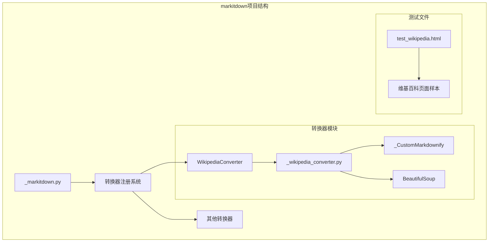
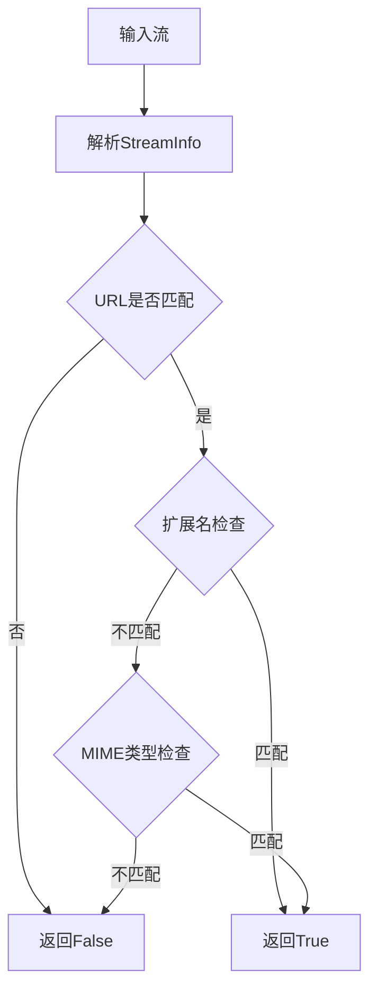
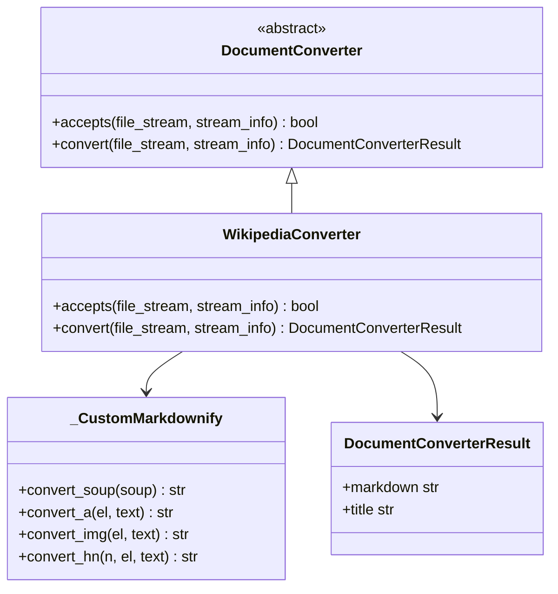
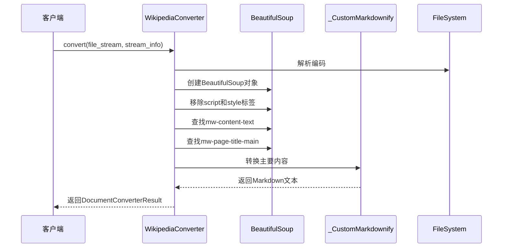
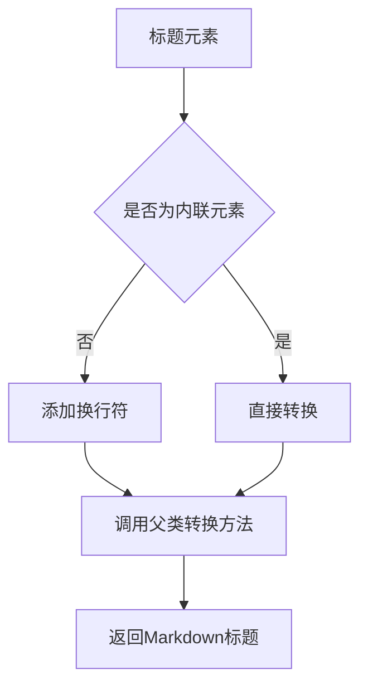
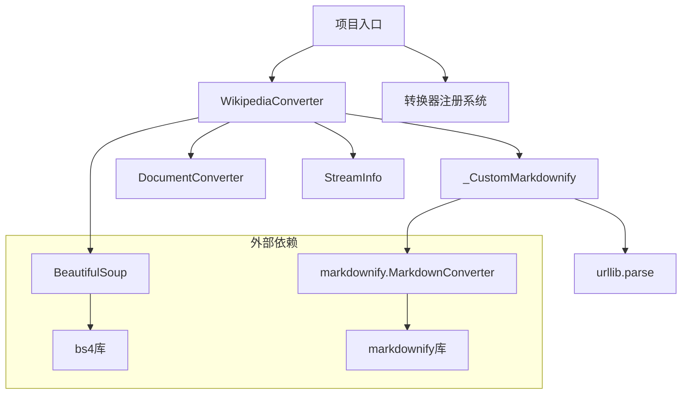

# 维基百科转换器详细文档

<cite>
**本文档中引用的文件**
- [_wikipedia_converter.py](file://packages/markitdown/src/markitdown/converters/_wikipedia_converter.py)
- [_markdownify.py](file://packages/markitdown/src/markitdown/converters/_markdownify.py)
- [test_wikipedia.html](file://packages/markitdown/tests/test_files/test_wikipedia.html)
- [_markitdown.py](file://packages/markitdown/src/markitdown/_markitdown.py)
</cite>

## 目录
1. [简介](#简介)
2. [项目结构概览](#项目结构概览)
3. [核心组件分析](#核心组件分析)
4. [架构概览](#架构概览)
5. [详细组件分析](#详细组件分析)
6. [依赖关系分析](#依赖关系分析)
7. [性能考虑](#性能考虑)
8. [故障排除指南](#故障排除指南)
9. [结论](#结论)

## 简介

WikipediaConverter类是markitdown项目中的一个专门化转换器，负责处理维基百科页面的HTML内容并将其转换为Markdown格式。该转换器通过精确的URL模式识别确保只处理来自维基百科的合法内容，并利用BeautifulSoup库精准提取页面的主要内容区域，同时采用_CustomMarkdownify类来保持内部链接和数学公式等特殊元素的完整性。

## 项目结构概览

markitdown项目采用模块化的架构设计，其中WikipediaConverter作为专门的转换器之一，位于转换器模块层次结构中：

**图表来源**
- [_markitdown.py](file://packages/markitdown/src/markitdown/_markitdown.py#L170-L196)
- [_wikipedia_converter.py](file://packages/markitdown/src/markitdown/converters/_wikipedia_converter.py#L1-L88)

**节来源**
- [_markitdown.py](file://packages/markitdown/src/markitdown/_markitdown.py#L170-L196)
- [_wikipedia_converter.py](file://packages/markitdown/src/markitdown/converters/_wikipedia_converter.py#L1-L88)

## 核心组件分析

WikipediaConverter类的核心功能围绕两个主要方法展开：`accepts()`用于URL和内容类型的验证，`convert()`用于实际的HTML到Markdown转换过程。

### URL模式识别机制

转换器通过正则表达式模式严格验证维基百科URL，确保只处理来自特定域名的请求：

**图表来源**
- [_wikipedia_converter.py](file://packages/markitdown/src/markitdown/converters/_wikipedia_converter.py#L25-L47)

### 内容提取策略

转换器采用双重内容提取策略：
1. **主内容区域提取**：通过CSS选择器定位`div#mw-content-text`获取主要文章内容
2. **标题提取**：优先使用`span.mw-page-title-main`获取准确标题，避免HTML title标签的站点前缀问题

**节来源**
- [_wikipedia_converter.py](file://packages/markitdown/src/markitdown/converters/_wikipedia_converter.py#L55-L86)

## 架构概览

WikipediaConverter在markitdown的整体架构中扮演着专门化转换器的角色，与通用转换器形成层次化的处理结构：

**图表来源**
- [_wikipedia_converter.py](file://packages/markitdown/src/markitdown/converters/_wikipedia_converter.py#L18-L88)
- [_markdownify.py](file://packages/markitdown/src/markitdown/converters/_markdownify.py#L7-L125)

## 详细组件分析

### WikipediaConverter类实现

#### 接受性验证机制

WikipediaConverter的`accepts()`方法实现了多层验证机制：

| 验证层级 | 检查内容 | 实现方式 |
|---------|---------|---------|
| URL验证 | 是否为维基百科域名 | 正则表达式`^https?:\/\/[a-zA-Z]{2,3}\.wikipedia.org\/` |
| 扩展名验证 | 文件扩展名是否接受 | 检查`.html`和`.htm` |
| MIME类型验证 | 内容类型是否为HTML | 检查`text/html`和`application/xhtml` |

#### 转换流程详解

**图表来源**
- [_wikipedia_converter.py](file://packages/markitdown/src/markitdown/converters/_wikipedia_converter.py#L50-L86)

#### 清理过程实现

转换器在处理过程中执行关键的清理操作：

1. **JavaScript和样式标签移除**：通过`soup(["script", "style"])`选择器定位并移除所有脚本和样式元素
2. **编码处理**：根据StreamInfo中的字符集信息确定正确的解码方式
3. **内容区域定位**：使用CSS选择器精确找到包含主要文章内容的div元素

**节来源**
- [_wikipedia_converter.py](file://packages/markitdown/src/markitdown/converters/_wikipedia_converter.py#L55-L86)

### _CustomMarkdownify类增强功能

_CustomMarkdownify类继承自markdownify.MarkdownConverter，提供了针对维基百科内容的专门化转换功能：

#### 标题处理增强

**图表来源**
- [_markdownify.py](file://packages/markitdown/src/markitdown/converters/_markdownify.py#L25-L40)

#### 链接处理优化

_CustomMarkdownify实现了智能的链接处理逻辑：

| 处理场景 | 实现策略 | 特殊处理 |
|---------|---------|---------|
| JavaScript链接 | 自动过滤 | 检测javascript协议 |
| 图片数据URI | 截断处理 | 移除大型数据URI |
| 内嵌图片 | 条件保留 | 基于配置参数 |
| 自动链接 | 简化语法 | 使用尖括号表示法 |

**节来源**
- [_markdownify.py](file://packages/markitdown/src/markitdown/converters/_markdownify.py#L42-L107)

#### 数学公式和内部链接保留

_CustomMarkdownify通过以下机制确保特殊元素的完整性：

1. **预格式化代码块保护**：跳过`<pre>`标签内的链接转换
2. **自动链接检测**：智能识别和简化URL链接
3. **标题部分保护**：确保章节标题的正确格式化

**节来源**
- [_markdownify.py](file://packages/markitdown/src/markitdown/converters/_markdownify.py#L42-L107)

## 依赖关系分析

WikipediaConverter的依赖关系体现了清晰的分层架构：

**图表来源**
- [_wikipedia_converter.py](file://packages/markitdown/src/markitdown/converters/_wikipedia_converter.py#L1-L10)
- [_markdownify.py](file://packages/markitdown/src/markitdown/converters/_markdownify.py#L1-L6)

**节来源**
- [_wikipedia_converter.py](file://packages/markitdown/src/markitdown/converters/_wikipedia_converter.py#L1-L10)
- [_markdownify.py](file://packages/markitdown/src/markitdown/converters/_markdownify.py#L1-L6)

## 性能考虑

### 内存使用优化

1. **流式处理**：转换器直接从二进制流读取数据，避免完全加载到内存
2. **选择器优化**：使用高效的CSS选择器减少DOM遍历开销
3. **即时清理**：在BeautifulSoup解析后立即移除不需要的元素

### 处理效率提升

1. **早期退出**：在URL验证失败时立即返回，避免不必要的处理
2. **条件转换**：根据内容结构选择最优的转换路径
3. **缓存友好**：避免重复的DOM查询操作

## 故障排除指南

### 常见问题及解决方案

#### 页面结构变更处理

当维基百科页面结构发生变化时，转换器通过以下机制保持健壮性：

1. **备用内容提取**：如果没有找到`mw-content-text`，回退到整个文档转换
2. **弹性标题提取**：如果`mw-page-title-main`不存在，使用HTML title标签
3. **错误处理**：优雅处理解析异常和编码问题

#### 反爬虫机制应对

虽然当前实现没有显式的反爬虫措施，但以下策略有助于提高稳定性：

1. **合理的用户代理**：建议在HTTP请求中设置适当的User-Agent头
2. **请求频率控制**：避免过于频繁的请求
3. **错误重试机制**：在网络不稳定时实现自动重试

**节来源**
- [_wikipedia_converter.py](file://packages/markitdown/src/markitdown/converters/_wikipedia_converter.py#L75-L86)

### 替代方案建议

对于需要更高稳定性的应用场景，建议使用维基百科官方API：

| 方面 | 当前方法 | API方案 |
|------|---------|---------|
| 数据准确性 | HTML解析 | 结构化JSON数据 |
| 更新频率 | 实时抓取 | API同步机制 |
| 错误处理 | 基础异常处理 | 完整的错误码系统 |
| 限制管理 | 无明确限制 | API配额和速率限制 |
| 功能丰富度 | 基础内容提取 | 全面的元数据访问 |

## 结论

WikipediaConverter类展现了优秀的软件设计原则：单一职责、可扩展性和健壮性。通过精确的URL识别、智能的内容提取和专门化的Markdown转换，它成功地解决了维基百科内容转换的复杂需求。

该实现的关键优势包括：

1. **精确的目标定位**：通过URL模式识别确保只处理合法的维基百科内容
2. **内容完整性保护**：使用_CustomMarkdownify确保特殊元素如数学公式和内部链接的完整保留
3. **结构化处理流程**：清晰的转换步骤和错误处理机制
4. **可维护性设计**：模块化的代码结构便于后续扩展和维护

对于未来的改进，可以考虑集成官方API作为主要数据源，同时保留当前实现作为备用方案，以获得最佳的稳定性和功能性平衡。