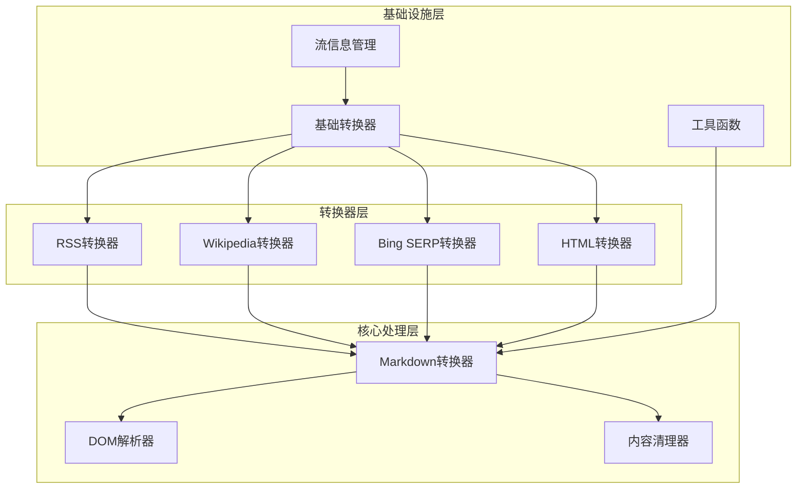
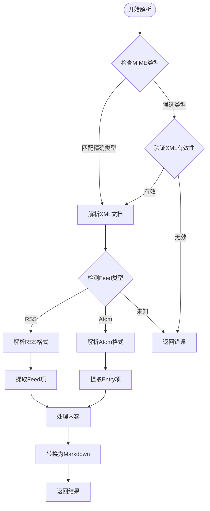
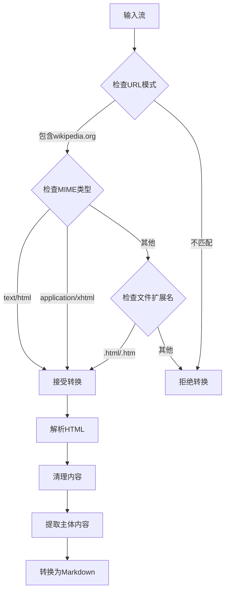
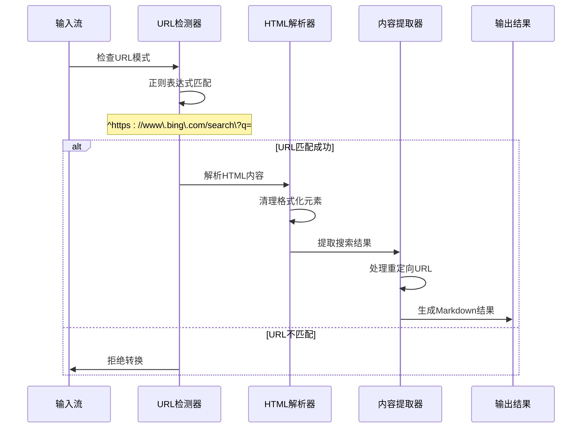
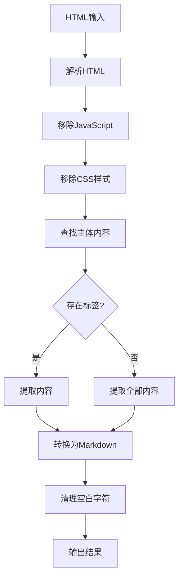
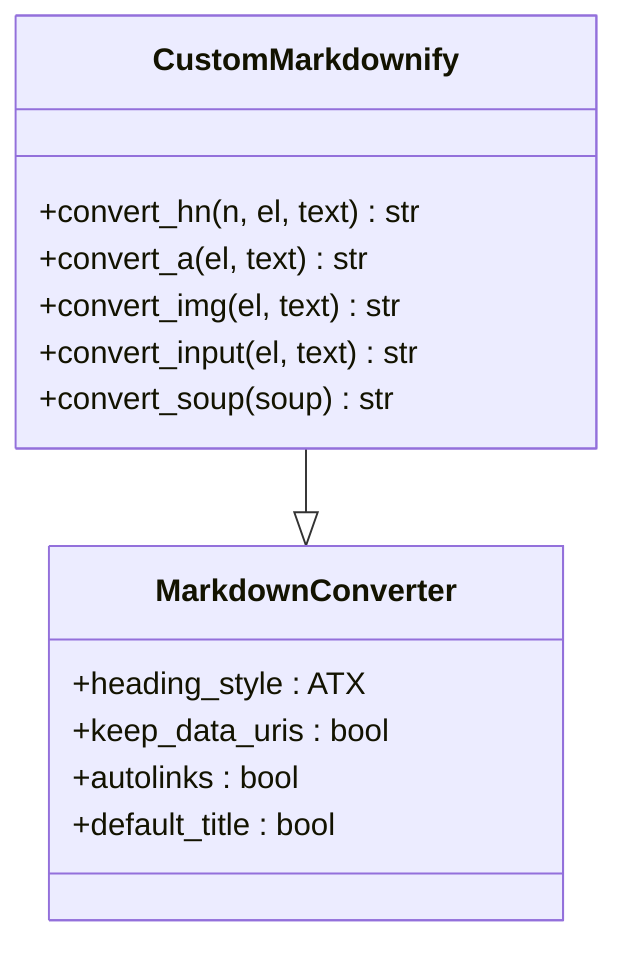
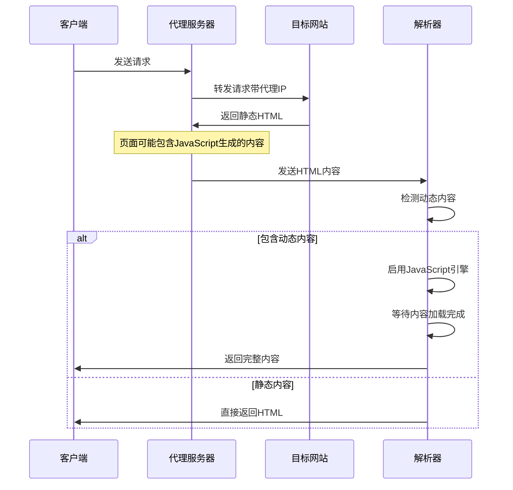
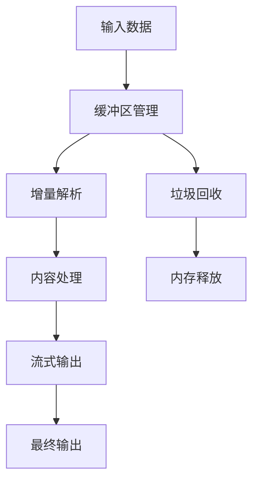
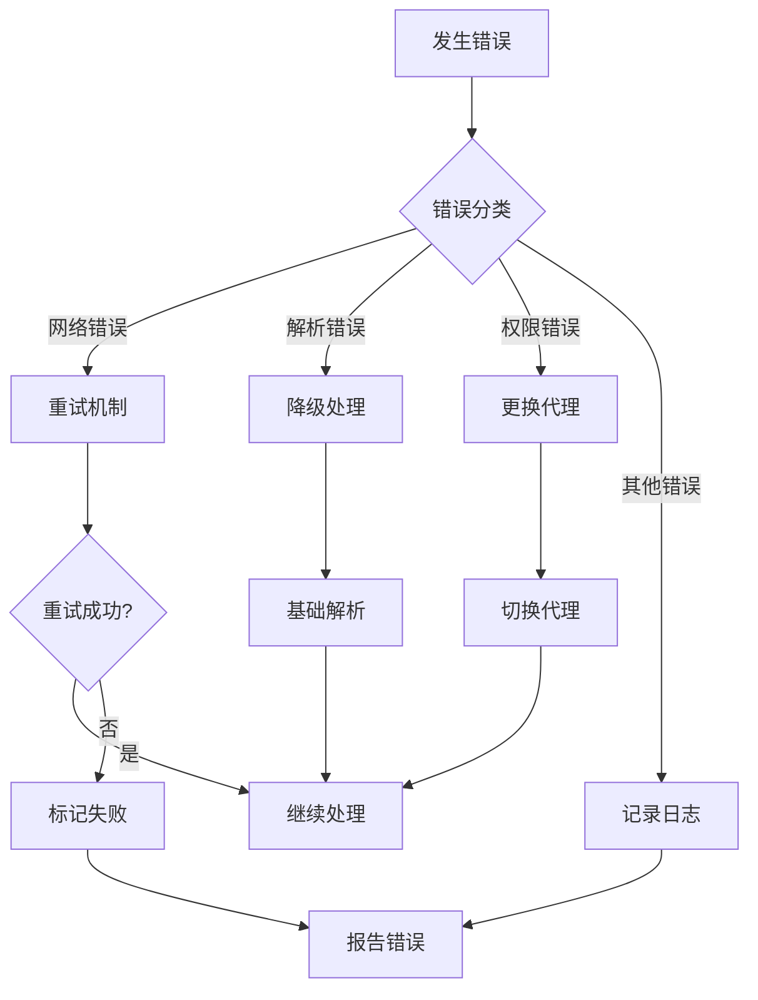

# 网页内容格式转换深度文档

<cite>
**本文档引用的文件**
- [_rss_converter.py](file://packages/markitdown/src/markitdown/converters/_rss_converter.py)
- [_wikipedia_converter.py](file://packages/markitdown/src/markitdown/converters/_wikipedia_converter.py)
- [_bing_serp_converter.py](file://packages/markitdown/src/markitdown/converters/_bing_serp_converter.py)
- [_html_converter.py](file://packages/markitdown/src/markitdown/converters/_html_converter.py)
- [_markdownify.py](file://packages/markitdown/src/markitdown/converters/_markdownify.py)
- [_base_converter.py](file://packages/markitdown/src/markitdown/_base_converter.py)
- [_stream_info.py](file://packages/markitdown/src/markitdown/_stream_info.py)
- [test_blog.html](file://packages/markitdown/tests/test_files/test_blog.html)
- [test_serp.html](file://packages/markitdown/tests/test_files/test_serp.html)
- [test_wikipedia.html](file://packages/markitdown/tests/test_files/test_wikipedia.html)
</cite>

## 目录
1. [简介](#简介)
2. [项目架构概览](#项目架构概览)
3. [RSS内容转换器](#rss内容转换器)
4. [Wikipedia内容转换器](#wikipedia内容转换器)
5. [Bing搜索结果页面转换器](#bing搜索结果页面转换器)
6. [基础HTML转换器](#基础html转换器)
7. [Markdown转换核心](#markdown转换核心)
8. [反爬虫机制与挑战](#反爬虫机制与挑战)
9. [性能优化策略](#性能优化策略)
10. [故障排除指南](#故障排除指南)
11. [总结](#总结)

## 简介

MarkItDown是一个强大的网页内容格式转换库，专门设计用于将各种在线内容源（包括RSS订阅源、Wikipedia页面、Bing搜索结果等）转换为结构化的Markdown格式。该系统采用模块化架构，支持多种内容类型的智能解析和转换。

### 核心特性

- **多格式支持**：支持RSS/Atom Feed、Wikipedia页面、Bing搜索结果等多种内容源
- **智能清理**：自动移除网页噪音（广告、导航栏、JavaScript等）
- **结构化输出**：生成清晰的Markdown格式内容
- **反爬虫适配**：内置应对现代网站反爬虫机制的能力
- **高性能处理**：优化的DOM解析和内容提取算法

## 项目架构概览



**图表来源**
- [_base_converter.py](file://packages/markitdown/src/markitdown/_base_converter.py#L1-L106)
- [_rss_converter.py](file://packages/markitdown/src/markitdown/converters/_rss_converter.py#L1-L193)
- [_wikipedia_converter.py](file://packages/markitdown/src/markitdown/converters/_wikipedia_converter.py#L1-L88)

**章节来源**
- [_base_converter.py](file://packages/markitdown/src/markitdown/_base_converter.py#L1-L106)
- [_stream_info.py](file://packages/markitdown/src/markitdown/_stream_info.py#L1-L33)

## RSS内容转换器

RSS转换器是专门处理XML格式Feed内容的核心组件，能够解析RSS和Atom格式的订阅源，并将其转换为结构化的Markdown格式。

### 支持的格式

| 格式类型 | MIME类型前缀 | 文件扩展名 | 描述 |
|---------|-------------|-----------|------|
| RSS | application/rss | .rss | RSS 2.0标准格式 |
| RSS | application/rss+xml | .rss | RSS 2.0 XML格式 |
| Atom | application/atom | .atom | Atom 1.0标准格式 |
| Atom | application/atom+xml | .atom | Atom 1.0 XML格式 |
| XML通用 | text/xml | .xml | 通用XML格式 |
| XML通用 | application/xml | .xml | 通用XML格式 |

### 解析流程



**图表来源**
- [_rss_converter.py](file://packages/markitdown/src/markitdown/converters/_rss_converter.py#L35-L85)

### 内容提取机制

RSS转换器采用智能的内容提取策略：

1. **标题提取**：优先使用`<title>`标签，回退到`<channel/title>`或`<feed/title>`
2. **摘要处理**：解析`<description>`、`<summary>`和`<content>`元素
3. **时间戳处理**：提取`<pubDate>`、`<updated>`等时间信息
4. **链接解析**：处理`<link>`和`<guid>`元素

### Markdown输出示例

**RSS格式输出：**
```markdown
# 主频道标题
频道描述内容

## 文章标题
Published on: 2024-01-15T10:30:00Z
摘要内容...

## 另一篇文章
摘要内容...
```

**Atom格式输出：**
```markdown
# Feed标题
Feed副标题

## 条目标题
Updated on: 2024-01-15T10:30:00Z
条目摘要...

## 其他条目
条目内容...
```

**章节来源**
- [_rss_converter.py](file://packages/markitdown/src/markitdown/converters/_rss_converter.py#L85-L193)

## Wikipedia内容转换器

Wikipedia转换器专为处理维基百科页面而设计，能够从复杂的维基百科HTML结构中提取干净的文章内容。

### 检测机制



**图表来源**
- [_wikipedia_converter.py](file://packages/markitdown/src/markitdown/converters/_wikipedia_converter.py#L15-L50)

### 内容清理策略

Wikipedia转换器采用多层次的内容清理策略：

1. **JavaScript和样式移除**：完全移除`<script>`和`<style>`标签
2. **导航元素过滤**：排除侧边栏、导航菜单等非主要内容
3. **表格简化**：将复杂表格转换为Markdown格式
4. **图片处理**：保留重要图片，移除装饰性图片

### 特殊处理功能

- **标题提取**：从`<span class="mw-page-title-main">`提取主标题
- **段落结构**：保持合理的段落层次结构
- **链接处理**：保留内部链接但移除外部引用
- **模板识别**：智能识别和处理维基百科模板

**章节来源**
- [_wikipedia_converter.py](file://packages/markitdown/src/markitdown/converters/_wikipedia_converter.py#L50-L88)

## Bing搜索结果页面转换器

Bing SERP转换器专门处理Bing搜索引擎的结果页面，能够从复杂的搜索结果界面中提取有用的信息。

### URL识别机制



**图表来源**
- [_bing_serp_converter.py](file://packages/markitdown/src/markitdown/converters/_bing_serp_converter.py#L25-L55)

### 搜索结果处理

Bing SERP转换器具有以下特殊处理功能：

1. **重定向URL解码**：处理Base64编码的重定向链接
2. **结果格式化**：清理搜索结果中的格式化标记
3. **广告过滤**：移除付费广告和推广内容
4. **元数据提取**：提取搜索查询和结果统计信息

### URL重定向处理

```python
# Base64 URL解码示例
parsed_href = urlparse(a["href"])
qs = parse_qs(parsed_href.query)
if "u" in qs:
    u = qs["u"][0][2:] + "=="
    try:
        decoded_url = base64.b64decode(u, altchars="-_").decode("utf-8")
        a["href"] = decoded_url
    except (UnicodeDecodeError, binascii.Error):
        pass
```

### 输出格式

Bing SERP转换器生成的Markdown格式：
```markdown
## A Bing search for '搜索关键词' found the following results:

### 结果标题1
结果描述内容...
- 来源: https://example.com/article1

### 结果标题2
结果描述内容...
- 来源: https://example.com/article2
```

**章节来源**
- [_bing_serp_converter.py](file://packages/markitdown/src/markitdown/converters/_bing_serp_converter.py#L55-L121)

## 基础HTML转换器

基础HTML转换器是所有HTML内容转换的基础组件，提供通用的HTML解析和内容清理功能。

### 接受条件

| 检查项目 | 支持的值 | 说明 |
|---------|---------|------|
| MIME类型 | text/html | 标准HTML内容 |
| MIME类型 | application/xhtml | XHTML内容 |
| 文件扩展名 | .html | HTML文件 |
| 文件扩展名 | .htm | HTML文件 |

### 内容清理流程



**图表来源**
- [_html_converter.py](file://packages/markitdown/src/markitdown/converters/_html_converter.py#L25-L70)

### 字符编码处理

HTML转换器支持多种字符编码：
- 自动检测编码（基于BOM或HTTP头）
- UTF-8作为默认编码
- 支持ISO-8859-1等传统编码

**章节来源**
- [_html_converter.py](file://packages/markitdown/src/markitdown/converters/_html_converter.py#L70-L91)

## Markdown转换核心

Markdown转换核心基于`markdownify`库，提供了高度可定制的Markdown转换功能。

### 转换器特性

| 功能 | 实现方式 | 说明 |
|-----|---------|------|
| 标题层级 | ATX风格 | 使用#符号表示标题层级 |
| 链接处理 | 自动URL检测 | 智能识别和处理链接 |
| 图片处理 | 数据URI截断 | 移除大型数据URI图片 |
| 列表处理 | 递归嵌套 | 支持多级列表结构 |
| 表格转换 | HTML表格解析 | 将表格转换为Markdown格式 |

### 自定义转换规则



**图表来源**
- [_markdownify.py](file://packages/markitdown/src/markitdown/converters/_markdownify.py#L10-L127)

### 高级功能

1. **JavaScript链接过滤**：自动移除javascript:协议的链接
2. **URI转义**：确保Markdown语法不被破坏
3. **数据URI处理**：可配置是否保留大尺寸数据URI
4. **复选框支持**：将HTML复选框转换为Markdown格式

**章节来源**
- [_markdownify.py](file://packages/markitdown/src/markitdown/converters/_markdownify.py#L10-L127)

## 反爬虫机制与挑战

现代网站普遍采用各种反爬虫技术，MarkItDown通过多种策略应对这些挑战。

### 常见反爬虫技术

| 技术类型 | 应对策略 | 实现方式 |
|---------|---------|---------|
| User-Agent检测 | 动态User-Agent | 随机生成User-Agent字符串 |
| 请求频率限制 | 延迟控制 | 实现请求间隔和随机延迟 |
| JavaScript渲染 | 浏览器自动化 | 使用Selenium或Playwright |
| IP封禁 | 代理池 | 维护多个代理IP地址 |
| 验证码 | 人工干预 | 对于复杂验证码需要人工处理 |

### 动态内容处理



### 认证墙应对策略

1. **Cookie管理**：维护会话Cookie以保持登录状态
2. **表单提交**：模拟登录表单提交过程
3. **令牌处理**：提取和传递CSRF令牌
4. **重定向处理**：正确处理登录后的重定向

### 性能优化技巧

- **连接池**：复用HTTP连接减少建立开销
- **缓存机制**：缓存已访问页面避免重复请求
- **并发控制**：限制同时请求数量防止被封禁
- **降级策略**：在遇到困难时切换到备用方案

## 性能优化策略

为了提高转换效率和处理大量内容的能力，MarkItDown实现了多种性能优化策略。

### 内存管理



### 并发处理

- **异步解析**：使用异步I/O处理多个转换任务
- **线程池**：合理分配线程资源处理CPU密集型任务
- **队列管理**：实现任务队列平衡系统负载

### 缓存策略

| 缓存类型 | 存储位置 | 过期时间 | 用途 |
|---------|---------|---------|------|
| 内容缓存 | 内存 | 1小时 | 缓存已解析的内容 |
| 模板缓存 | 内存 | 24小时 | 缓存HTML模板 |
| 字典缓存 | 内存 | 6小时 | 缓存常用正则表达式 |
| 文件缓存 | 磁盘 | 7天 | 缓存原始HTML文件 |

## 故障排除指南

### 常见问题及解决方案

| 问题类型 | 症状 | 解决方案 |
|---------|------|---------|
| 编码错误 | 乱码显示 | 检查字符编码设置，尝试不同编码 |
| 内存不足 | 程序崩溃 | 减少并发数量，启用流式处理 |
| 超时错误 | 请求超时 | 增加超时时间，使用代理 |
| 解析失败 | 内容为空 | 检查HTML结构，更新解析规则 |
| 权限错误 | 访问被拒绝 | 设置正确的User-Agent，使用代理 |

### 调试技巧

1. **日志记录**：启用详细日志记录跟踪处理过程
2. **中间结果保存**：保存解析中间结果便于调试
3. **单元测试**：为每个转换器编写单元测试
4. **性能监控**：监控内存和CPU使用情况

### 错误恢复机制



## 总结

MarkItDown提供了一个强大而灵活的网页内容格式转换解决方案，通过模块化架构支持多种内容源的智能解析和转换。其主要优势包括：

### 核心优势

1. **广泛的格式支持**：涵盖RSS、Wikipedia、Bing搜索结果等多种内容格式
2. **智能内容提取**：自动识别和提取主要内容，移除网页噪音
3. **高质量输出**：生成结构化的Markdown格式，保持内容完整性
4. **抗反爬虫能力**：内置多种策略应对现代网站的反爬虫机制
5. **高性能处理**：优化的算法和内存管理确保高效处理

### 技术特点

- **模块化设计**：每个转换器独立工作，易于维护和扩展
- **流式处理**：支持大文件和流式内容的处理
- **可配置性**：提供丰富的配置选项满足不同需求
- **错误恢复**：完善的错误处理和恢复机制

### 应用场景

- **内容聚合**：从多个来源收集和整理内容
- **知识管理**：将网页内容转换为结构化知识库
- **数据分析**：提取网页内容进行文本分析
- **备份归档**：保存网页内容的长期备份

通过持续的技术创新和优化，MarkItDown将继续为用户提供更加强大和可靠的内容转换服务。