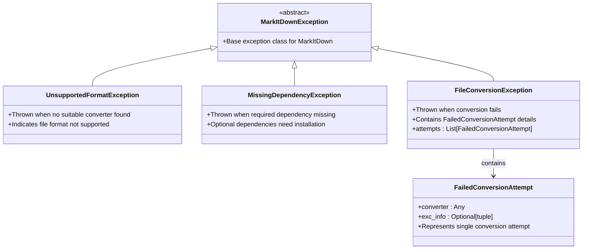
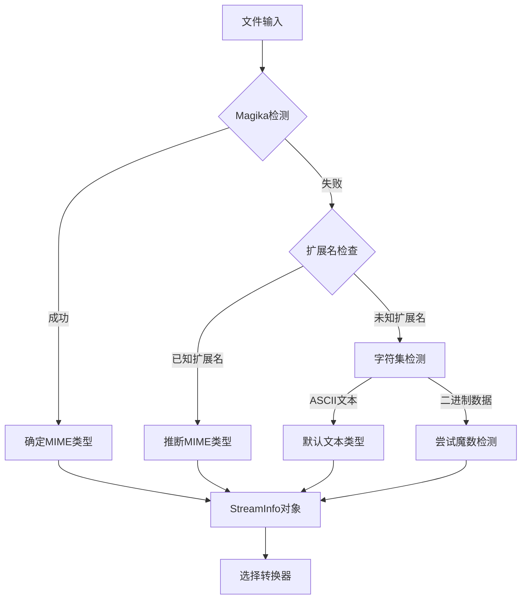
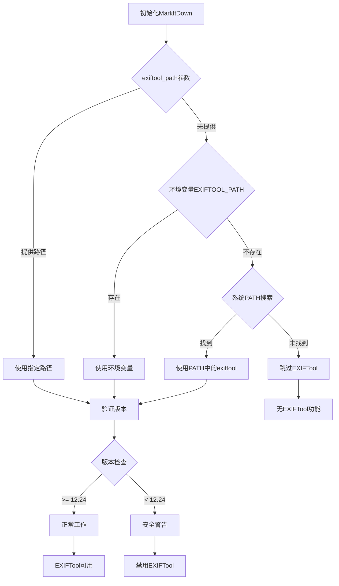
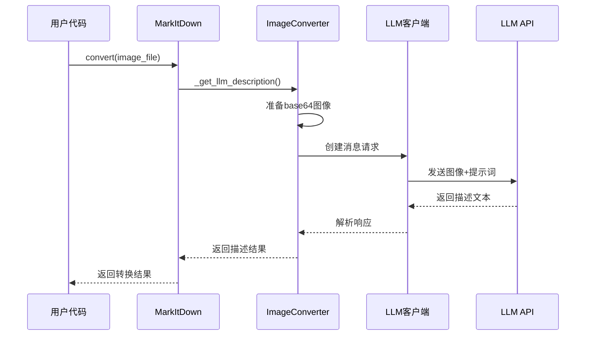
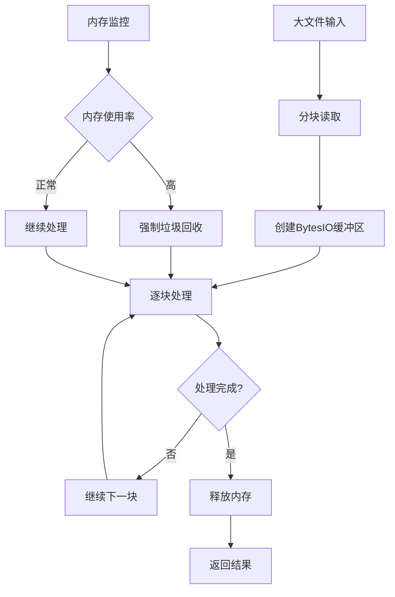
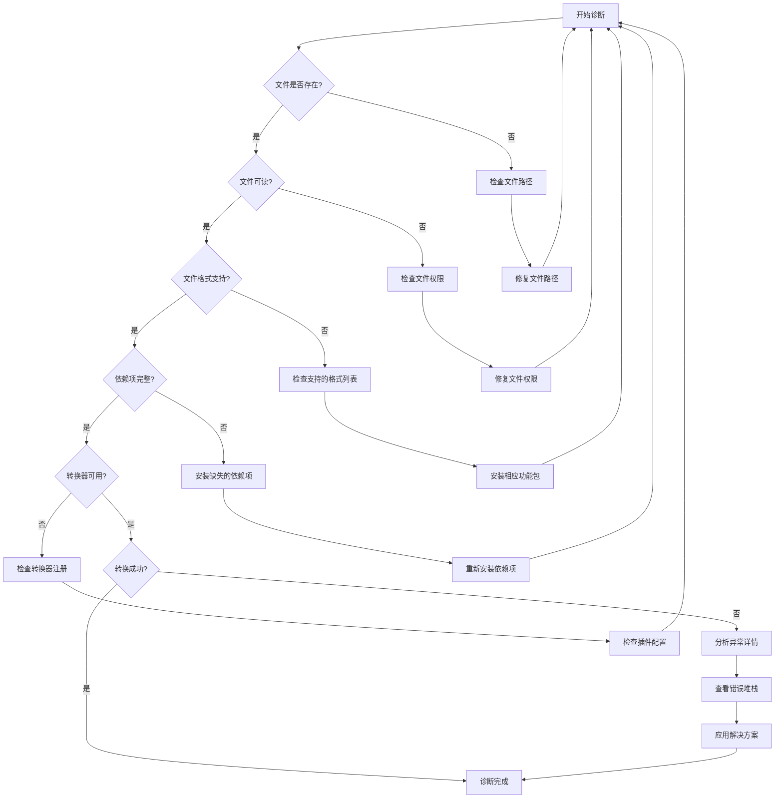

# 故障排除

<cite>
**本文档中引用的文件**
- [_exceptions.py](file://packages/markitdown/src/markitdown/_exceptions.py)
- [_base_converter.py](file://packages/markitdown/src/markitdown/_base_converter.py)
- [_markitdown.py](file://packages/markitdown/src/markitdown/_markitdown.py)
- [_exiftool.py](file://packages/markitdown/src/markitdown/converters/_exiftool.py)
- [_image_converter.py](file://packages/markitdown/src/markitdown/converters/_image_converter.py)
- [_llm_caption.py](file://packages/markitdown/src/markitdown/converters/_llm_caption.py)
- [test_module_misc.py](file://packages/markitdown/tests/test_module_misc.py)
- [README.md](file://packages/markitdown/README.md)
</cite>

## 目录
1. [简介](#简介)
2. [常见异常类型](#常见异常类型)
3. [文件类型识别问题](#文件类型识别问题)
4. [依赖项缺失问题](#依赖项缺失问题)
5. [EXIFTool路径问题](#exiftool路径问题)
6. [LLM集成问题](#llm集成问题)
7. [性能优化建议](#性能优化建议)
8. [边界情况处理](#边界情况处理)
9. [调试技巧](#调试技巧)
10. [诊断步骤](#诊断步骤)
11. [故障排除流程图](#故障排除流程图)

## 简介

MarkItDown是一个强大的文档转换工具，支持将多种文件格式转换为Markdown。本指南提供了系统性的故障排除方法，帮助用户快速识别和解决常见的转换问题。

## 常见异常类型

MarkItDown定义了几个核心异常类，每种异常都指示特定的问题类型：

### 异常层次结构



**图表来源**
- [_exceptions.py](file://packages/markitdown/src/markitdown/_exceptions.py#L10-L77)

### 异常详解

#### 1. UnsupportedFormatException
当MarkItDown无法找到适合处理给定文件格式的转换器时抛出此异常。

**症状：**
- 文件扩展名不受支持
- 不支持的MIME类型
- 缺少必要的转换器

**解决方案：**
- 检查文件扩展名是否在支持列表中
- 安装相应的可选依赖项
- 使用`markitdown --list-plugins`查看可用插件

#### 2. MissingDependencyException
当转换器需要但未安装的可选依赖项时抛出此异常。

**症状：**
- 特定文件格式转换失败
- 错误消息包含缺失依赖项信息

**解决方案：**
根据错误消息中的提示安装相应依赖：
```bash
pip install markitdown[pdf]      # PDF相关功能
pip install markitdown[docx]     # Word文档转换
pip install markitdown[pptx]     # PowerPoint转换
pip install markitdown[audio]    # 音频转录
pip install markitdown[all]      # 所有功能
```

#### 3. FileConversionException
当找到合适的转换器但转换过程失败时抛出此异常。

**症状：**
- 转换器被调用但转换失败
- 多个转换器尝试失败

**解决方案：**
检查转换器的错误详情，可能需要：
- 检查文件完整性
- 更新转换器版本
- 调整转换参数

**节来源**
- [_exceptions.py](file://packages/markitdown/src/markitdown/_exceptions.py#L10-L77)

## 文件类型识别问题

### MIME类型检测失败

MarkItDown使用多种技术来识别文件类型：



**图表来源**
- [_markitdown.py](file://packages/markitdown/src/markitdown/_markitdown.py#L499-L536)

### 常见识别问题

#### 1. 扩展名缺失或错误
**症状：**
- 文件没有扩展名
- 扩展名与实际内容不匹配

**解决方案：**
使用`stream_info`参数显式指定文件信息：
```python
from markitdown import MarkItDown, StreamInfo

markitdown = MarkItDown()
result = markitdown.convert(
    "file_without_extension",
    stream_info=StreamInfo(extension=".pdf", mimetype="application/pdf")
)
```

#### 2. 字符编码问题
**症状：**
- 中文、日文等非ASCII字符显示为乱码
- 特殊字符无法正确显示

**解决方案：**
MarkItDown会自动检测字符编码，但可以手动指定：
```python
result = markitdown.convert(
    "chinese_document.txt",
    stream_info=StreamInfo(charset="utf-8")
)
```

**节来源**
- [_stream_info.py](file://packages/markitdown/src/markitdown/_stream_info.py#L1-L31)
- [_markitdown.py](file://packages/markitdown/src/markitdown/_markitdown.py#L499-L536)

## 依赖项缺失问题

### 可选依赖项概览

MarkItDown支持按需安装的可选依赖项：

| 功能类别 | 依赖项 | 描述 |
|---------|--------|------|
| PDF处理 | `[pdf]` | PDF文件转换功能 |
| Word文档 | `[docx]` | DOCX文件处理 |
| Excel表格 | `[xlsx]` | XLSX文件处理 |
| PowerPoint | `[pptx]` | PPTX文件处理 |
| 音频转录 | `[audio]` | WAV/MP3音频转录 |
| YouTube | `[youtube]` | YouTube视频字幕获取 |
| Outlook | `[outlook]` | MSG邮件文件处理 |
| 文档智能 | `[az-doc-intel]` | Azure文档智能服务 |

### 诊断依赖项问题

#### 1. 检查当前安装的功能
```bash
# 查看所有可用功能
pip show markitdown | grep -A 10 "Requires:"
```

#### 2. 测试特定功能
```python
from markitdown import MarkItDown

# 创建实例时不启用内置转换器
markitdown = MarkItDown(enable_builtins=False)

# 尝试转换特定格式
try:
    result = markitdown.convert("document.pdf")
except Exception as e:
    print(f"转换失败: {e}")
```

#### 3. 逐步安装依赖项
```bash
# 先安装基础功能
pip install markitdown

# 根据需要添加特定功能
pip install markitdown[pdf]
pip install markitdown[docx]
```

**节来源**
- [README.md](file://packages/markitdown/README.md#L90-L125)

## EXIFTool路径问题

### EXIFTool配置流程



**图表来源**
- [_markitdown.py](file://packages/markitdown/src/markitdown/_markitdown.py#L146-L168)
- [_exiftool.py](file://packages/markitdown/src/markitdown/converters/_exiftool.py#L10-L52)

### 常见EXIFTool问题

#### 1. EXIFTool未安装
**症状：**
- 图像文件元数据提取失败
- EXIF信息缺失

**解决方案：**
```bash
# Linux/macOS
sudo apt-get install exiftool  # Ubuntu/Debian
brew install exiftool          # macOS

# Windows
# 下载并安装EXIFTool from https://exiftool.org/
```

#### 2. EXIFTool版本过旧
**症状：**
- 运行时出现CVE-2021-22204警告
- 安全漏洞提示

**解决方案：**
升级到最新版本（至少12.24）：
```bash
# 检查当前版本
exiftool -ver

# 升级到最新版本
# Linux/macOS: 使用包管理器更新
# Windows: 从官方网站下载新版本
```

#### 3. EXIFTool路径配置

**方法1：通过参数指定**
```python
from markitdown import MarkItDown

# 指定EXIFTool路径
markitdown = MarkItDown(exiftool_path="/usr/local/bin/exiftool")
result = markitdown.convert("image.jpg")
```

**方法2：通过环境变量设置**
```bash
export EXIFTOOL_PATH="/usr/local/bin/exiftool"
python -c "from markitdown import MarkItDown; print(MarkItDown().convert('image.jpg'))"
```

**方法3：系统PATH配置**
确保EXIFTool在系统PATH中：
```bash
# 添加到PATH
export PATH="$PATH:/usr/local/bin"

# 或者创建符号链接
sudo ln -s /path/to/exiftool /usr/local/bin/exiftool
```

**节来源**
- [_exiftool.py](file://packages/markitdown/src/markitdown/converters/_exiftool.py#L10-L52)
- [_markitdown.py](file://packages/markitdown/src/markitdown/_markitdown.py#L146-L168)

## LLM集成问题

### LLM客户端配置

MarkItDown支持多种LLM服务进行图像描述和内容分析：



**图表来源**
- [_image_converter.py](file://packages/markitdown/src/markitdown/converters/_image_converter.py#L82-L137)
- [_llm_caption.py](file://packages/markitdown/src/markitdown/converters/_llm_caption.py#L0-L49)

### 常见LLM问题

#### 1. API密钥配置
**症状：**
- OpenAI API调用失败
- 认证错误

**解决方案：**
```python
import openai
from markitdown import MarkItDown

# 方法1：直接传递客户端
client = openai.OpenAI(api_key="your-api-key")
markitdown = MarkItDown(llm_client=client)

# 方法2：使用环境变量
import os
os.environ["OPENAI_API_KEY"] = "your-api-key"
markitdown = MarkItDown(llm_model="gpt-4o")
```

#### 2. 提示词配置
**症状：**
- 图像描述不够详细
- 内容不符合预期

**解决方案：**
```python
from markitdown import MarkItDown

# 自定义提示词
custom_prompt = "请提供详细的图像描述，包括颜色、形状、场景等信息"
markitdown = MarkItDown(
    llm_model="gpt-4o",
    llm_prompt=custom_prompt
)
```

#### 3. 网络连接问题
**症状：**
- LLM API调用超时
- 网络连接失败

**解决方案：**
```python
import openai
from markitdown import MarkItDown

# 设置超时和重试
client = openai.OpenAI(
    api_key="your-api-key",
    timeout=30.0,
    max_retries=3
)

markitdown = MarkItDown(llm_client=client)
```

**节来源**
- [_image_converter.py](file://packages/markitdown/src/markitdown/converters/_image_converter.py#L82-L137)
- [_llm_caption.py](file://packages/markitdown/src/markitdown/converters/_llm_caption.py#L0-L49)

## 性能优化建议

### 大文件处理策略

#### 1. 内存管理
对于大型文件，MarkItDown采用流式处理：



**图表来源**
- [_markitdown.py](file://packages/markitdown/src/markitdown/_markitdown.py#L499-L536)

#### 2. 性能优化技巧

**a. 限制并发转换**
```python
from markitdown import MarkItDown
import concurrent.futures

# 限制同时处理的文件数量
def process_files(file_list, max_workers=4):
    markitdown = MarkItDown()
    
    with concurrent.futures.ThreadPoolExecutor(max_workers=max_workers) as executor:
        futures = [
            executor.submit(markitdown.convert, file_path)
            for file_path in file_list
        ]
        
        results = []
        for future in concurrent.futures.as_completed(futures):
            try:
                results.append(future.result())
            except Exception as e:
                print(f"转换失败: {e}")
                
        return results
```

**b. 使用流式处理**
```python
from markitdown import MarkItDown
import io

# 对于大文件，使用流式处理
def process_large_file(file_path):
    markitdown = MarkItDown()
    
    # 分块读取文件
    chunk_size = 1024 * 1024  # 1MB chunks
    with open(file_path, 'rb') as f:
        buffer = io.BytesIO()
        while chunk := f.read(chunk_size):
            buffer.write(chunk)
        
        buffer.seek(0)
        result = markitdown.convert_stream(buffer)
    
    return result
```

**c. 预加载转换器**
```python
from markitdown import MarkItDown

# 预加载常用转换器
markitdown = MarkItDown(
    enable_builtins=True,
    # 预先配置常用参数
    llm_model="gpt-4o",
    exiftool_path="/usr/bin/exiftool"
)
```

### 缓存策略

#### 1. 结果缓存
```python
import hashlib
import pickle
from pathlib import Path

class CachedMarkItDown:
    def __init__(self, cache_dir="./cache"):
        self.markitdown = MarkItDown()
        self.cache_dir = Path(cache_dir)
        self.cache_dir.mkdir(exist_ok=True)
    
    def convert_with_cache(self, file_path):
        # 生成缓存键
        file_hash = self._generate_hash(file_path)
        cache_file = self.cache_dir / f"{file_hash}.pkl"
        
        # 检查缓存
        if cache_file.exists():
            with open(cache_file, 'rb') as f:
                return pickle.load(f)
        
        # 执行转换
        result = self.markitdown.convert(file_path)
        
        # 存储到缓存
        with open(cache_file, 'wb') as f:
            pickle.dump(result, f)
        
        return result
    
    def _generate_hash(self, file_path):
        hash_obj = hashlib.sha256()
        hash_obj.update(str(file_path).encode())
        return hash_obj.hexdigest()
```

**节来源**
- [_markitdown.py](file://packages/markitdown/src/markitdown/_markitdown.py#L499-L536)

## 边界情况处理

### 基于测试用例的边界情况

根据[`test_module_misc.py`](file://packages/markitdown/tests/test_module_misc.py)中的测试用例，以下是常见的边界情况：

#### 1. 空文件和损坏文件
```python
def test_empty_files():
    """测试空文件和损坏文件的处理"""
    markitdown = MarkItDown()
    
    # 空文件
    empty_buffer = io.BytesIO(b"")
    try:
        result = markitdown.convert_stream(empty_buffer)
        print("空文件处理:", result)
    except Exception as e:
        print("空文件错误:", e)
    
    # 损坏的文件
    broken_buffer = io.BytesIO(b"corrupted data")
    try:
        result = markitdown.convert_stream(broken_buffer, file_extension=".pdf")
        print("损坏文件处理:", result)
    except FileConversionException as e:
        print("损坏文件转换失败:", e)
        # 检查失败尝试
        for attempt in e.attempts:
            print(f"转换器: {type(attempt.converter).__name__}")
            if attempt.exc_info:
                exc_type, exc_val, exc_tb = attempt.exc_info
                print(f"异常类型: {exc_type.__name__}")
                print(f"错误消息: {exc_val}")
```

#### 2. 特殊字符和编码
```python
def test_special_characters():
    """测试特殊字符和编码问题"""
    # 包含特殊字符的文件
    test_data = b"测试文件 \xe4\xb8\xad\xe6\x96\x87 \xff\xff\xff"
    buffer = io.BytesIO(test_data)
    
    result = markitdown.convert_stream(buffer)
    print("特殊字符处理结果:", result.text_content)
```

#### 3. 大小写敏感性
```python
def test_case_sensitivity():
    """测试文件扩展名大小写敏感性"""
    # 不同大小写的扩展名
    extensions = [".PDF", ".Pdf", ".pdf"]
    
    for ext in extensions:
        try:
            result = markitdown.convert("document" + ext)
            print(f"扩展名 {ext}: 成功")
        except UnsupportedFormatException:
            print(f"扩展名 {ext}: 不支持")
        except Exception as e:
            print(f"扩展名 {ext}: 错误 - {e}")
```

### 错误恢复策略

#### 1. 多重转换器回退
```python
def robust_conversion(file_path):
    """具有多重回退的健壮转换"""
    markitdown = MarkItDown()
    
    # 尝试不同的转换策略
    strategies = [
        lambda: markitdown.convert(file_path),
        lambda: markitdown.convert(file_path, file_extension=".pdf"),
        lambda: markitdown.convert(file_path, file_extension=".docx"),
    ]
    
    for i, strategy in enumerate(strategies):
        try:
            return strategy()
        except FileConversionException as e:
            print(f"策略 {i+1} 失败: {e}")
            continue
        except UnsupportedFormatException:
            print(f"策略 {i+1} 不适用")
            continue
    
    raise Exception("所有转换策略均失败")
```

#### 2. 渐进式处理
```python
def progressive_processing(file_path):
    """渐进式处理，优先使用简单转换器"""
    markitdown = MarkItDown()
    
    # 获取转换器列表
    converters = markitdown._converters.copy()
    
    # 按优先级排序
    converters.sort(key=lambda x: x.priority)
    
    # 逐个尝试
    for converter_reg in converters:
        converter = converter_reg.converter
        
        try:
            # 检查是否接受文件
            with open(file_path, 'rb') as f:
                stream_info = StreamInfo(filename=file_path)
                if converter.accepts(f, stream_info):
                    f.seek(0)
                    return converter.convert(f, stream_info)
        except Exception as e:
            print(f"转换器 {type(converter).__name__} 失败: {e}")
            continue
    
    raise UnsupportedFormatException(f"无法处理文件: {file_path}")
```

**节来源**
- [test_module_misc.py](file://packages/markitdown/tests/test_module_misc.py#L315-L349)

## 调试技巧

### 1. 启用详细日志

```python
import logging
import sys

# 配置日志记录
logging.basicConfig(
    level=logging.DEBUG,
    format='%(asctime)s - %(name)s - %(levelname)s - %(message)s',
    stream=sys.stdout
)

logger = logging.getLogger('markitdown')

# 在代码中添加调试信息
def debug_conversion(file_path):
    logger.info(f"开始处理文件: {file_path}")
    
    markitdown = MarkItDown()
    
    try:
        result = markitdown.convert(file_path)
        logger.info(f"转换成功: {len(result.text_content)} 字符")
        return result
    except Exception as e:
        logger.error(f"转换失败: {e}")
        # 打印完整的异常堆栈
        import traceback
        logger.error(traceback.format_exc())
        raise
```

### 2. 转换器状态检查

```python
def inspect_converters(markitdown, file_path):
    """检查可用转换器的状态"""
    print("可用转换器列表:")
    
    for converter_reg in markitdown._converters:
        converter = converter_reg.converter
        converter_class = type(converter).__name__
        
        try:
            with open(file_path, 'rb') as f:
                stream_info = StreamInfo(filename=file_path)
                accepts = converter.accepts(f, stream_info)
                print(f"  {converter_class}: {'✓ 接受' if accepts else '✗ 不接受'}")
                
                if accepts:
                    # 尝试转换以检查是否有其他错误
                    try:
                        f.seek(0)
                        result = converter.convert(f, stream_info)
                        print(f"    转换成功: {len(result.text_content)} 字符")
                    except Exception as e:
                        print(f"    转换失败: {e}")
        except Exception as e:
            print(f"    检查失败: {e}")
```

### 3. 文件流状态跟踪

```python
class TrackedFileStream:
    """跟踪文件流位置的包装器"""
    
    def __init__(self, file_stream):
        self.file_stream = file_stream
        self.position_history = []
    
    def tell(self):
        pos = self.file_stream.tell()
        self.position_history.append(("tell", pos))
        return pos
    
    def seek(self, offset, whence=0):
        pos = self.file_stream.seek(offset, whence)
        self.position_history.append(("seek", pos, offset, whence))
        return pos
    
    def read(self, size=-1):
        data = self.file_stream.read(size)
        self.position_history.append(("read", len(data) if data else 0))
        return data
    
    def get_history(self):
        return self.position_history

# 使用示例
def debug_stream_position(file_path):
    with open(file_path, 'rb') as f:
        tracked_stream = TrackedFileStream(f)
        
        markitdown = MarkItDown()
        result = markitdown.convert(tracked_stream)
        
        print("流操作历史:")
        for op in tracked_stream.get_history():
            print(f"  {op}")
```

### 4. 转换器链调试

```python
def debug_conversion_chain(file_path):
    """调试整个转换链"""
    markitdown = MarkItDown()
    
    print(f"开始调试文件: {file_path}")
    
    # 获取所有转换器
    converters = markitdown._converters.copy()
    converters.sort(key=lambda x: x.priority)
    
    for i, converter_reg in enumerate(converters):
        converter = converter_reg.converter
        converter_class = type(converter).__name__
        
        print(f"\n=== 尝试转换器 {i+1}/{len(converters)}: {converter_class} ===")
        
        try:
            with open(file_path, 'rb') as f:
                stream_info = StreamInfo(filename=file_path)
                
                # 检查accepts
                accepts_start = f.tell()
                accepts_result = converter.accepts(f, stream_info)
                accepts_end = f.tell()
                
                print(f"accepts() 返回: {accepts_result}")
                print(f"流位置变化: {accepts_start} -> {accepts_end}")
                
                if accepts_result:
                    # 尝试转换
                    f.seek(0)
                    convert_start = f.tell()
                    
                    try:
                        result = converter.convert(f, stream_info)
                        convert_end = f.tell()
                        
                        print(f"转换成功: {len(result.text_content)} 字符")
                        print(f"流位置变化: {convert_start} -> {convert_end}")
                        
                        return result
                    except Exception as e:
                        print(f"转换失败: {e}")
                        import traceback
                        traceback.print_exc()
                
        except Exception as e:
            print(f"转换器 {converter_class} 处理失败: {e}")
            import traceback
            traceback.print_exc()
    
    raise Exception("所有转换器均失败")
```

## 诊断步骤

### 1. 基础诊断流程



### 2. 详细诊断脚本

```python
def comprehensive_diagnostic(file_path):
    """全面的诊断脚本"""
    print("=" * 60)
    print(f"开始诊断文件: {file_path}")
    print("=" * 60)
    
    # 1. 基础文件检查
    print("\n1. 基础文件检查:")
    try:
        import os
        if not os.path.exists(file_path):
            print(f"❌ 文件不存在: {file_path}")
            return False
        
        if not os.access(file_path, os.R_OK):
            print(f"❌ 文件不可读: {file_path}")
            return False
            
        file_size = os.path.getsize(file_path)
        print(f"✅ 文件存在，大小: {file_size} 字节")
    except Exception as e:
        print(f"❌ 文件检查失败: {e}")
        return False
    
    # 2. MarkItDown基本功能测试
    print("\n2. MarkItDown基本功能测试:")
    try:
        from markitdown import MarkItDown, StreamInfo
        
        markitdown = MarkItDown()
        print("✅ MarkItDown导入成功")
        
        # 测试简单的字符串转换
        test_buffer = io.BytesIO(b"test content")
        result = markitdown.convert_stream(test_buffer)
        print("✅ 基础转换功能正常")
        
    except Exception as e:
        print(f"❌ MarkItDown功能异常: {e}")
        import traceback
        traceback.print_exc()
        return False
    
    # 3. 文件格式检测
    print("\n3. 文件格式检测:")
    try:
        with open(file_path, 'rb') as f:
            stream_info = StreamInfo(filename=file_path)
            
        print(f"✅ 文件名: {stream_info.filename}")
        print(f"✅ MIME类型: {stream_info.mimetype}")
        print(f"✅ 扩展名: {stream_info.extension}")
        print(f"✅ 字符集: {stream_info.charset}")
        
    except Exception as e:
        print(f"❌ 格式检测失败: {e}")
        return False
    
    # 4. 转换器可用性检查
    print("\n4. 转换器可用性检查:")
    try:
        markitdown = MarkItDown()
        converters = markitdown._converters.copy()
        
        print(f"可用转换器数量: {len(converters)}")
        
        # 按优先级排序
        converters.sort(key=lambda x: x.priority)
        
        for converter_reg in converters:
            converter = converter_reg.converter
            converter_class = type(converter).__name__
            
            try:
                with open(file_path, 'rb') as f:
                    accepts = converter.accepts(f, stream_info)
                    print(f"  {converter_class}: {'✓' if accepts else '✗'}")
            except Exception as e:
                print(f"  {converter_class}: ❌ 检查失败 - {e}")
                
    except Exception as e:
        print(f"❌ 转换器检查失败: {e}")
        return False
    
    # 5. 依赖项检查
    print("\n5. 依赖项检查:")
    try:
        # 检查可选依赖项
        optional_deps = ['pdf', 'docx', 'pptx', 'audio', 'youtube']
        for dep in optional_deps:
            try:
                # 尝试导入相关模块
                if dep == 'pdf':
                    import pypdf
                    print(f"✅ PDF依赖项可用")
                elif dep == 'docx':
                    import docx
                    print(f"✅ DOCX依赖项可用")
                elif dep == 'pptx':
                    import pptx
                    print(f"✅ PPTX依赖项可用")
                elif dep == 'audio':
                    import speech_recognition
                    print(f"✅ 音频依赖项可用")
                elif dep == 'youtube':
                    import yt_dlp
                    print(f"✅ YouTube依赖项可用")
            except ImportError:
                print(f"⚠️  {dep.upper()} 依赖项缺失")
            except Exception as e:
                print(f"❌ {dep.upper()} 检查失败: {e}")
                
    except Exception as e:
        print(f"❌ 依赖项检查失败: {e}")
        return False
    
    print("\n" + "=" * 60)
    print("诊断完成!")
    print("=" * 60)
    return True
```

### 3. 错误堆栈分析

```python
def analyze_error_stack(exception):
    """分析错误堆栈信息"""
    print("错误分析报告:")
    print("=" * 50)
    
    if hasattr(exception, 'attempts') and exception.attempts:
        print("失败的转换尝试:")
        for i, attempt in enumerate(exception.attempts):
            converter_name = type(attempt.converter).__name__
            print(f"  {i+1}. {converter_name}")
            
            if attempt.exc_info:
                exc_type, exc_val, exc_tb = attempt.exc_info
                print(f"     异常类型: {exc_type.__name__}")
                print(f"     错误消息: {exc_val}")
                
                # 显示调用栈
                print("     调用栈:")
                import traceback
                tb_lines = traceback.format_tb(exc_tb)
                for line in tb_lines[-3:]:  # 最后3行
                    print(f"       {line.strip()}")
    
    print("\n建议的解决方案:")
    if "UnsupportedFormatException" in str(type(exception)):
        print("1. 检查文件格式是否受支持")
        print("2. 安装相应的可选依赖项")
        print("3. 使用 --list-plugins 查看可用插件")
    elif "MissingDependencyException" in str(type(exception)):
        print("1. 根据错误消息安装缺失的依赖项")
        print("2. 使用 pip install 'markitdown[功能名称]'")
    elif "FileConversionException" in str(type(exception)):
        print("1. 检查文件是否损坏")
        print("2. 尝试使用不同的转换器")
        print("3. 查看具体的异常类型和错误消息")
    
    print("=" * 50)
```

## 故障排除流程图

### 综合故障排除决策树

```mermaid
flowchart TD
A[遇到转换问题] --> B{问题类型}
B --> |文件识别问题| C[文件类型识别故障]
B --> |依赖项问题| D[依赖项缺失或配置错误]
B --> |转换失败| E[转换过程异常]
B --> |性能问题| F[处理速度慢或内存不足]
%% 文件识别问题分支
C --> C1{文件扩展名为空?}
C1 --> |是| C2[使用stream_info参数指定扩展名]
C1 --> |否| C3{MIME类型检测失败?}
C3 --> |是| C4[检查文件头部魔数]
C3 --> |否| C5[检查字符编码]
%% 依赖项问题分支
D --> D1{缺少特定格式支持?}
D1 --> |是| D2[安装对应功能包<br/>pip install 'markitdown[format]'<br/>如: pdf, docx, pptx]
D1 --> |否| D3{缺少外部工具?}
D3 --> |是| D4[安装外部依赖<br/>如: exiftool, ffmpeg]
D3 --> |否| D5[检查Python包版本]
%% 转换失败分支
E --> E1{转换器被调用但失败?}
E1 --> |是| E2[FileConversionException]
E1 --> |否| E3{找不到合适的转换器?}
E3 --> |是| E4[UnsupportedFormatException]
E3 --> |否| E5{转换器依赖缺失?}
E5 --> |是| E6[MissingDependencyException]
E5 --> |否| E7[其他异常]
%% 性能问题分支
F --> F1{大文件处理?}
F1 --> |是| F2[使用流式处理<br/>分块读取文件<br/>限制并发数量]
F1 --> |否| F3{内存使用过高?}
F3 --> |是| F4[增加虚拟内存<br/>减少同时处理文件数<br/>使用缓存策略]
F3 --> |否| F5[检查CPU使用率]
%% 异常处理分支
E2 --> E2A[检查文件完整性<br/>更新转换器版本<br/>调整转换参数]
E4 --> E4A[安装相应依赖项<br/>检查文件格式<br/>查看支持的格式列表]
E6 --> E6A[安装缺失的Python包<br/>检查包版本兼容性<br/>重新安装markitdown]
E7 --> E7A[查看完整错误堆栈<br/>检查系统环境<br/>联系技术支持]
%% 输出最终解决方案
C2 --> G[解决方案实施]
C4 --> G
C5 --> G
D2 --> G
D4 --> G
D5 --> G
E2A --> G
E4A --> G
E6A --> G
E7A --> G
F2 --> G
F4 --> G
F5 --> G
G --> H[验证解决方案]
H --> I{问题解决?}
I --> |是| J[完成]
I --> |否| K[深入诊断]
K --> A
```

**图表来源**
- [_exceptions.py](file://packages/markitdown/src/markitdown/_exceptions.py#L10-L77)
- [_markitdown.py](file://packages/markitdown/src/markitdown/_markitdown.py#L535-L618)

### 快速故障排除检查清单

#### 基础检查
- [ ] 文件存在且可读
- [ ] Python版本 >= 3.10
- [ ] MarkItDown已正确安装
- [ ] 支持的文件格式

#### 依赖项检查
- [ ] 相应功能包已安装
- [ ] 外部工具（如exiftool）已安装
- [ ] API密钥配置正确

#### 配置检查
- [ ] 转换器路径正确
- [ ] 环境变量设置
- [ ] 权限配置

#### 调试检查
- [ ] 启用详细日志
- [ ] 检查错误堆栈
- [ ] 验证文件完整性

## 结论

本故障排除指南涵盖了MarkItDown使用过程中可能遇到的各种问题及其解决方案。通过系统性的诊断方法和实用的调试技巧，用户可以快速定位和解决大多数转换问题。

记住：
1. **逐步诊断**：从基础检查开始，逐步深入
2. **详细日志**：启用日志记录以获取更多信息
3. **错误分析**：仔细分析异常类型和错误消息
4. **社区支持**：在GitHub上查找类似问题或提交新问题

如果遇到本指南未涵盖的问题，请参考项目的GitHub仓库获取更多帮助和支持。