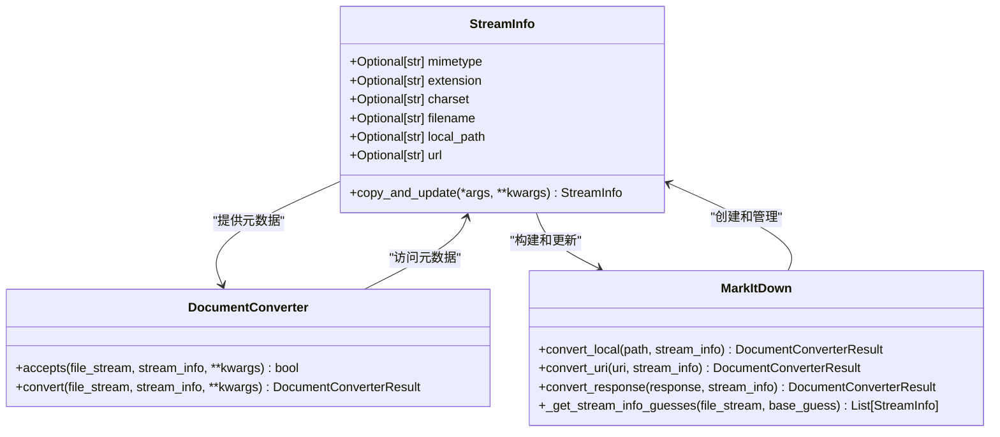
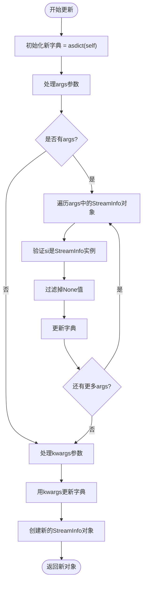
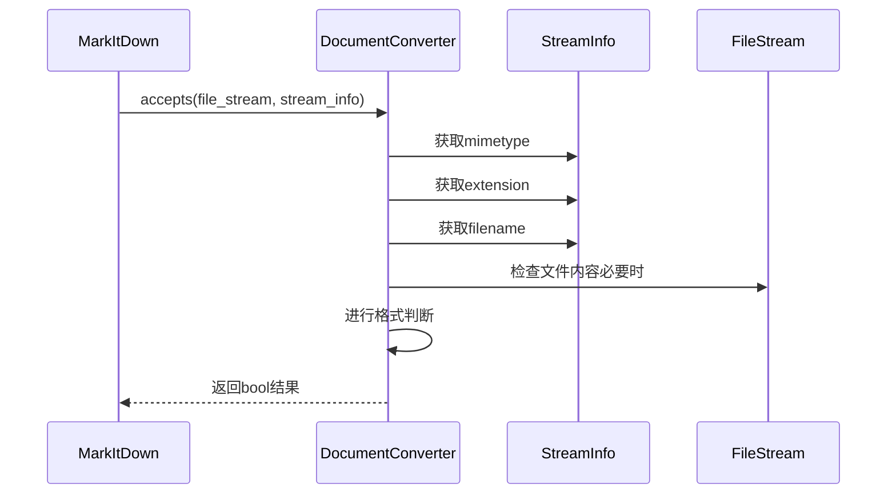
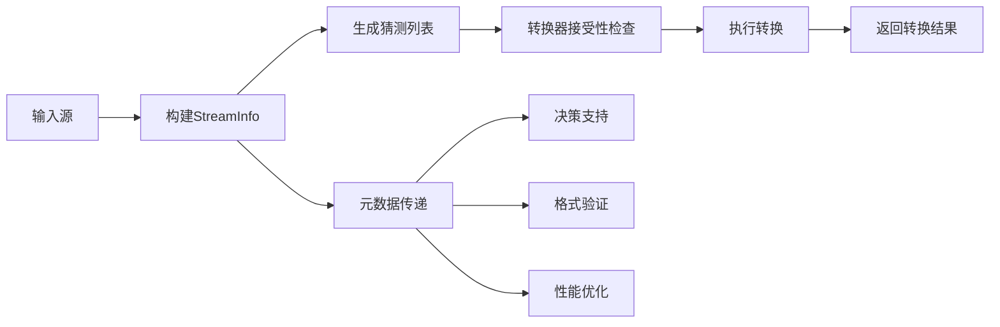
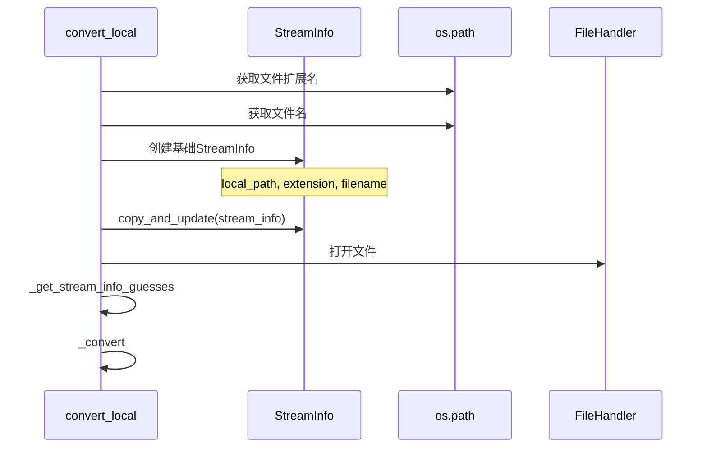
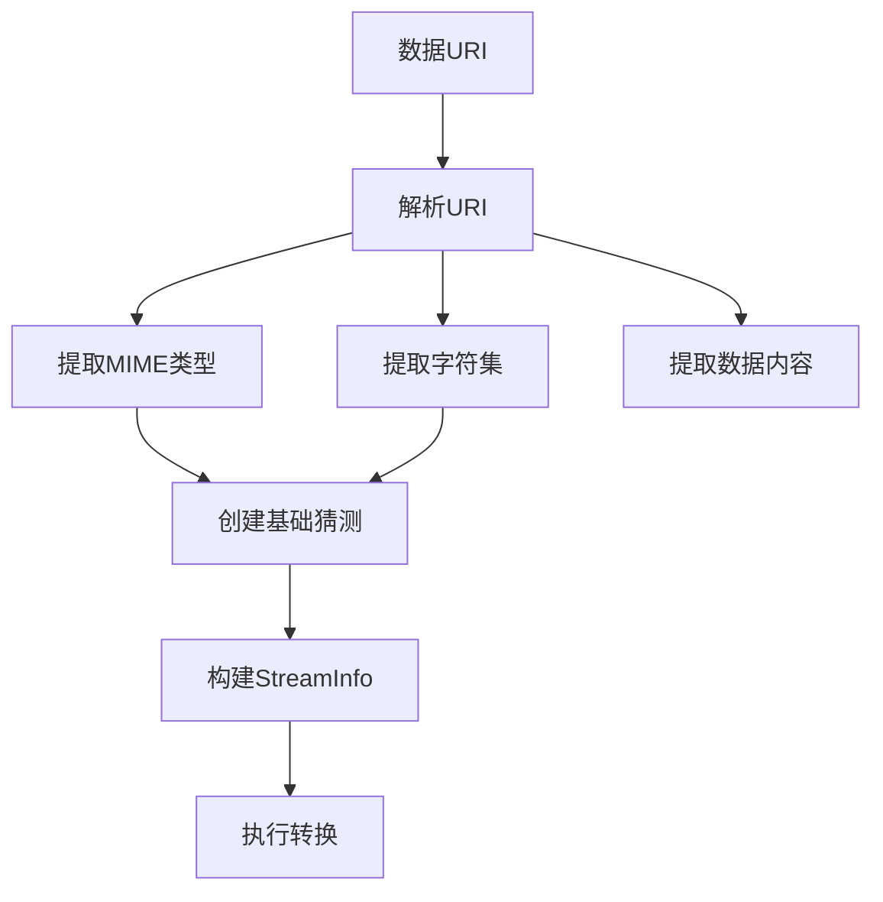

# StreamInfo类详细文档

<cite>
**本文档中引用的文件**
- [_stream_info.py](file://packages/markitdown/src/markitdown/_stream_info.py)
- [_base_converter.py](file://packages/markitdown/src/markitdown/_base_converter.py)
- [_markitdown.py](file://packages/markitdown/src/markitdown/_markitdown.py)
- [_pdf_converter.py](file://packages/markitdown/src/markitdown/converters/_pdf_converter.py)
- [_html_converter.py](file://packages/markitdown/src/markitdown/converters/_html_converter.py)
- [test_module_misc.py](file://packages/markitdown/tests/test_module_misc.py)
</cite>

## 目录
1. [简介](#简介)
2. [类设计概述](#类设计概述)
3. [核心字段详解](#核心字段详解)
4. [copy_and_update方法详解](#copy_and_update方法详解)
5. [StreamInfo在转换器系统中的作用](#streaminfo在转换器系统中的作用)
6. [实际使用场景分析](#实际使用场景分析)
7. [自定义转换器中的应用](#自定义转换器中的应用)
8. [最佳实践指南](#最佳实践指南)
9. [总结](#总结)

## 简介

StreamInfo类是markitdown项目中的核心数据结构，专门用于存储和管理文件流的元数据信息。作为一个不可变的数据类，它为整个文档转换系统提供了统一的元数据容器，支持多种输入源（本地文件、网络资源、二进制流等）的标准化处理。

该类的设计体现了函数式编程的思想，通过不可变性确保了元数据的一致性和可预测性，同时提供了灵活的更新机制来支持复杂的元数据合并场景。

## 类设计概述

StreamInfo类采用Python的dataclass装饰器实现，具有以下关键特性：



**图表来源**
- [_stream_info.py](file://packages/markitdown/src/markitdown/_stream_info.py#L5-L31)
- [_base_converter.py](file://packages/markitdown/src/markitdown/_base_converter.py#L41-L105)
- [_markitdown.py](file://packages/markitdown/src/markitdown/_markitdown.py#L294-L329)

**节来源**
- [_stream_info.py](file://packages/markitdown/src/markitdown/_stream_info.py#L1-L33)

## 核心字段详解

### 媒体类型字段（mimetype）

媒体类型字段标识文件的MIME类型，是文件识别和格式判断的关键依据。

| 字段属性 | 类型 | 默认值 | 描述 |
|---------|------|--------|------|
| mimetype | Optional[str] | None | 文件的MIME类型，如"text/plain"、"application/pdf"等 |

**应用场景：**
- PDF转换器通过检查`application/pdf`前缀来确定是否接受PDF文件
- HTML转换器验证`text/html`或`application/xhtml`类型
- Magika库根据MIME类型进行智能识别

### 扩展名字段（extension）

扩展名字段存储文件的后缀名，用于文件格式的快速识别。

| 字段属性 | 类型 | 默认值 | 描述 |
|---------|------|--------|------|
| extension | Optional[str] | None | 文件扩展名，如".pdf"、".html"等 |

**应用场景：**
- 直接基于文件扩展名进行格式匹配
- 与MIME类型配合进行双重验证
- 在无法获取MIME类型时作为备选方案

### 字符集字段（charset）

字符集字段指定文件的编码方式，对文本文件的正确解析至关重要。

| 字段属性 | 类型 | 默认值 | 描述 |
|---------|------|--------|------|
| charset | Optional[str] | None | 文件编码，如"utf-8"、"iso-8859-1"等 |

**应用场景：**
- HTML解析器根据字符集读取正确的文本内容
- 文本文件转换器确保字符编码的准确性
- Magika库自动检测并规范化字符集

### 文件名字段（filename）

文件名字段包含文件的完整名称，可以从多个来源获取。

| 字段属性 | 类型 | 默认值 | 来源 |
|---------|------|--------|------|
| filename | Optional[str] | None | 本地路径、URL、Content-Disposition头 |

**应用场景：**
- 从HTTP响应的Content-Disposition头提取文件名
- 从本地文件路径解析出文件名
- 作为用户界面显示的友好名称

### 本地路径字段（local_path）

本地路径字段记录文件在本地文件系统中的位置。

| 字段属性 | 类型 | 默认值 | 描述 |
|---------|------|--------|------|
| local_path | Optional[str] | None | 本地文件的完整路径 |

**应用场景：**
- 本地文件转换的路径信息保留
- 文件操作和权限检查
- 路径相关的元数据处理

### URL字段（url）

URL字段存储文件在网络上的位置信息。

| 字段属性 | 类型 | 默认值 | 描述 |
|---------|------|--------|------|
| url | Optional[str] | None | 文件的网络地址 |

**应用场景：**
- 网络资源的原始URL信息保留
- 特殊网站（如Wikipedia、YouTube）的识别
- 下载链接和重定向处理

**节来源**
- [_stream_info.py](file://packages/markitdown/src/markitdown/_stream_info.py#L8-L16)

## copy_and_update方法详解

copy_and_update方法是StreamInfo类的核心功能之一，实现了不可变对象的更新模式，支持灵活的元数据合并。

### 方法签名和参数

```python
def copy_and_update(self, *args, **kwargs):
    """复制StreamInfo对象并用给定的StreamInfo实例和其他关键字参数进行更新"""
```

### 更新策略

方法采用优先级策略来处理多个更新源：

1. **StreamInfo对象优先**：当传入多个StreamInfo对象时，按顺序合并
2. **非None值覆盖**：只有非None值才会覆盖现有值
3. **关键字参数补充**：最后处理关键字参数作为补充更新

### 更新流程图



**图表来源**
- [_stream_info.py](file://packages/markitdown/src/markitdown/_stream_info.py#L23-L31)

### 使用示例场景

#### 单字段更新
```python
# 更新单个字段
updated_info = original_info.copy_and_update(mimetype="text/plain")
```

#### 多字段组合更新
```python
# 合并多个StreamInfo对象
base_info = StreamInfo(filename="document.pdf")
extra_info = StreamInfo(mimetype="application/pdf", charset="utf-8")
final_info = base_info.copy_and_update(extra_info)
```

#### 混合更新策略
```python
# 混合使用StreamInfo对象和关键字参数
result = info.copy_and_update(
    StreamInfo(extension=".md", charset="utf-8"),
    mimetype="text/markdown"
)
```

**节来源**
- [_stream_info.py](file://packages/markitdown/src/markitdown/_stream_info.py#L23-L31)
- [test_module_misc.py](file://packages/markitdown/tests/test_module_misc.py#L109-L200)

## StreamInfo在转换器系统中的作用

### 接受性判断（accepts方法）

StreamInfo在转换器的accepts方法中发挥关键作用，帮助转换器快速判断是否能够处理特定类型的文件。



**图表来源**
- [_base_converter.py](file://packages/markitdown/src/markitdown/_base_converter.py#L41-L105)

### 元数据驱动的转换决策

不同的转换器基于StreamInfo的不同字段做出决策：

| 转换器类型 | 主要判断字段 | 判断逻辑 |
|-----------|-------------|----------|
| PDF转换器 | mimetype, extension | 检查"application/pdf"前缀和".pdf"扩展名 |
| HTML转换器 | mimetype, extension | 验证"text/html"和".html"、".htm"扩展名 |
| 特殊网站转换器 | url | 识别Wikipedia、YouTube等特定域名 |
| 通用文本转换器 | charset, mimetype | 基于字符集和MIME类型进行推断 |

### 转换过程中的元数据传递



**图表来源**
- [_markitdown.py](file://packages/markitdown/src/markitdown/_markitdown.py#L665-L776)

**节来源**
- [_base_converter.py](file://packages/markitdown/src/markitdown/_base_converter.py#L41-L105)
- [_pdf_converter.py](file://packages/markitdown/src/markitdown/converters/_pdf_converter.py#L25-L40)
- [_html_converter.py](file://packages/markitdown/src/markitdown/converters/_html_converter.py#L20-L35)

## 实际使用场景分析

### 本地文件转换场景

在convert_local方法中，StreamInfo的构建展示了完整的元数据收集过程：



**图表来源**
- [_markitdown.py](file://packages/markitdown/src/markitdown/_markitdown.py#L294-L329)

### 网络资源转换场景

对于HTTP响应，StreamInfo包含了丰富的网络元数据：

| 元数据字段 | 来源 | 用途 |
|-----------|------|------|
| mimetype | Content-Type头 | 内容类型识别 |
| charset | Content-Type头的charset参数 | 字符编码设置 |
| filename | Content-Disposition头 | 文件名提取 |
| url | 请求URL | 原始地址保留 |
| extension | URL路径解析 | 扩展名推断 |

### 数据URI处理场景

数据URI的特殊处理展示了StreamInfo的灵活性：



**图表来源**
- [_markitdown.py](file://packages/markitdown/src/markitdown/_markitdown.py#L435-L469)

**节来源**
- [_markitdown.py](file://packages/markitdown/src/markitdown/_markitdown.py#L294-L329)
- [_markitdown.py](file://packages/markitdown/src/markitdown/_markitdown.py#L397-L433)
- [_markitdown.py](file://packages/markitdown/src/markitdown/_markitdown.py#L469-L536)

## 自定义转换器中的应用

### 基础转换器模板

```python
class CustomConverter(DocumentConverter):
    def accepts(self, file_stream, stream_info, **kwargs):
        # 基于mimetype和extension进行判断
        mimetype = (stream_info.mimetype or "").lower()
        extension = (stream_info.extension or "").lower()
        
        # 自定义判断逻辑
        if extension in ['.custom', '.ext']:
            return True
        
        if mimetype.startswith('application/custom'):
            return True
            
        return False
    
    def convert(self, file_stream, stream_info, **kwargs):
        # 使用StreamInfo提供的元数据
        encoding = stream_info.charset or 'utf-8'
        filename = stream_info.filename or 'unknown'
        
        # 执行转换逻辑...
        return DocumentConverterResult(markdown="转换结果")
```

### 高级元数据利用

```python
class AdvancedConverter(DocumentConverter):
    def accepts(self, file_stream, stream_info, **kwargs):
        # 利用多个元数据字段进行复杂判断
        if stream_info.url and 'special-site.com' in stream_info.url:
            return True
            
        if stream_info.filename and stream_info.filename.lower().endswith('.special'):
            return True
            
        return self._advanced_content_check(file_stream, stream_info)
    
    def _advanced_content_check(self, file_stream, stream_info):
        # 保存文件位置，读取部分内容进行判断
        current_pos = file_stream.tell()
        try:
            # 读取文件头部进行内容分析
            header = file_stream.read(1024)
            # 分析逻辑...
            return True
        finally:
            file_stream.seek(current_pos)  # 必须恢复位置
```

### 元数据增强模式

```python
class EnrichingConverter(DocumentConverter):
    def convert(self, file_stream, stream_info, **kwargs):
        # 基于现有元数据创建更丰富的信息
        enriched_info = stream_info.copy_and_update(
            mimetype='application/enriched',
            charset='utf-8',
            filename=f"enriched_{stream_info.filename}"
        )
        
        # 使用增强后的信息进行转换
        return self._perform_conversion(file_stream, enriched_info)
```

**节来源**
- [_base_converter.py](file://packages/markitdown/src/markitdown/_base_converter.py#L41-L105)
- [_pdf_converter.py](file://packages/markitdown/src/markitdown/converters/_pdf_converter.py#L25-L40)
- [_html_converter.py](file://packages/markitdown/src/markitdown/converters/_html_converter.py#L20-L35)

## 最佳实践指南

### StreamInfo构建的最佳实践

1. **渐进式构建**：从基础信息开始，逐步添加更精确的元数据
2. **空值安全**：始终检查字段是否为None，避免空指针异常
3. **不可变性维护**：使用copy_and_update而不是直接修改字段

### 元数据合并策略

```python
# 推荐的合并策略
def build_stream_info(base_path, additional_info=None):
    # 基础信息
    base_info = StreamInfo(
        local_path=base_path,
        extension=os.path.splitext(base_path)[1],
        filename=os.path.basename(base_path)
    )
    
    # 合并额外信息
    if additional_info:
        base_info = base_info.copy_and_update(additional_info)
    
    return base_info
```

### 错误处理和边界情况

1. **位置重置**：在accepts方法中读取文件内容后必须重置位置
2. **字符集规范化**：使用_normalize_charset方法确保字符集一致性
3. **兼容性检查**：在_get_stream_info_guesses中验证Magika的猜测结果

### 性能优化建议

1. **延迟加载**：只在需要时才计算复杂的元数据
2. **缓存策略**：对重复使用的元数据进行缓存
3. **流式处理**：对于大文件，使用流式处理避免内存占用过高

**节来源**
- [_markitdown.py](file://packages/markitdown/src/markitdown/_markitdown.py#L665-L776)
- [_base_converter.py](file://packages/markitdown/src/markitdown/_base_converter.py#L41-L105)

## 总结

StreamInfo类作为markitdown项目的核心元数据容器，展现了现代软件架构中几个重要的设计原则：

### 设计优势

1. **不可变性**：确保元数据的一致性和线程安全性
2. **灵活性**：通过copy_and_update方法支持复杂的更新场景
3. **完整性**：涵盖文件处理的各种元数据需求
4. **扩展性**：为未来的新功能预留了扩展空间

### 应用价值

- **统一接口**：为不同输入源提供一致的元数据访问方式
- **智能决策**：支持基于元数据的自动化转换选择
- **错误预防**：通过类型安全减少运行时错误
- **性能优化**：支持基于元数据的早期过滤和优化

### 技术特色

StreamInfo的设计体现了函数式编程和面向对象编程的完美结合，既保持了数据的纯净性，又提供了必要的操作能力。它的成功应用证明了良好的抽象设计对于复杂系统的重要价值。

通过深入理解StreamInfo的设计理念和使用模式，开发者可以更好地利用markitdown的强大功能，并在此基础上构建更加健壮和高效的文档转换解决方案。