# 核心概念

<cite>
**本文档中引用的文件**
- [_markitdown.py](file://packages/markitdown/src/markitdown/_markitdown.py)
- [_stream_info.py](file://packages/markitdown/src/markitdown/_stream_info.py)
- [_base_converter.py](file://packages/markitdown/src/markitdown/_base_converter.py)
- [_exceptions.py](file://packages/markitdown/src/markitdown/_exceptions.py)
- [_pdf_converter.py](file://packages/markitdown/src/markitdown/converters/_pdf_converter.py)
- [_docx_converter.py](file://packages/markitdown/src/markitdown/converters/_docx_converter.py)
- [__init__.py](file://packages/markitdown/src/markitdown/__init__.py)
</cite>

## 目录
1. [简介](#简介)
2. [转换流程概览](#转换流程概览)
3. [StreamInfo类设计](#streaminfo类设计)
4. [Magika文件类型识别](#magika文件类型识别)
5. [转换器优先级系统](#转换器优先级系统)
6. [责任链模式实现](#责任链模式实现)
7. [错误处理机制](#错误处理机制)
8. [实际数据流处理](#实际数据流处理)
9. [总结](#总结)

## 简介

MarkItDown是一个强大的文档转换库，专门设计用于将各种格式的文档转换为Markdown格式。其核心设计理念围绕着一个高度模块化的转换架构，该架构通过责任链模式、优先级系统和智能文件类型识别来实现高效的文档转换。

本文档深入探讨了MarkItDown的核心概念，包括转换流程的完整生命周期、StreamInfo作为元数据容器的设计理念、Magika文件类型识别技术的应用，以及转换器优先级系统的工作机制。

## 转换流程概览

MarkItDown的转换流程是一个精心设计的多阶段过程，确保从输入源到最终Markdown输出的每个步骤都得到精确控制。

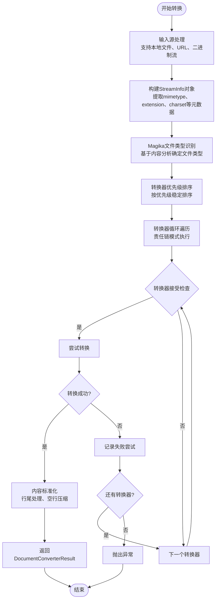
```mermaid
flowchart TD
Start([开始转换]) --> InputSource["输入源处理<br/>支持本地文件、URL、二进制流"]
InputSource --> StreamInfoBuild["构建StreamInfo对象<br/>提取mimetype、extension、charset等元数据"]
StreamInfoBuild --> MagikaIdentify["Magika文件类型识别<br/>基于内容分析确定文件类型"]
MagikaIdentify --> PrioritySort["转换器优先级排序<br/>按优先级稳定排序"]
PrioritySort --> ConverterLoop["转换器循环遍历<br/>责任链模式执行"]
ConverterLoop --> AcceptCheck{"转换器接受检查"}
AcceptCheck --> |是| ConvertAttempt["尝试转换"]
AcceptCheck --> |否| NextConverter["下一个转换器"]
ConvertAttempt --> Success{"转换成功?"}
Success --> |是| NormalizeContent["内容标准化<br/>行尾处理、空行压缩"]
Success --> |否| RecordFailure["记录失败尝试"]
RecordFailure --> MoreConverters{"还有转换器?"}
MoreConverters --> |是| NextConverter
MoreConverters --> |否| ThrowException["抛出异常"]
NextConverter --> AcceptCheck
NormalizeContent --> ReturnResult["返回DocumentConverterResult"]
ThrowException --> End([结束])
ReturnResult --> End
```

**图表来源**
- [_markitdown.py](file://packages/markitdown/src/markitdown/_markitdown.py#L499-L620)

这个流程展示了MarkItDown如何通过多个智能阶段来处理不同类型的输入源，并确保最合适的转换器能够被选中和执行。

**章节来源**
- [_markitdown.py](file://packages/markitdown/src/markitdown/_markitdown.py#L499-L620)

## StreamInfo类设计

StreamInfo类是MarkItDown架构中的核心元数据容器，采用不可变数据类设计，提供了类型安全且功能完整的文件信息存储机制。

### 类结构与字段设计

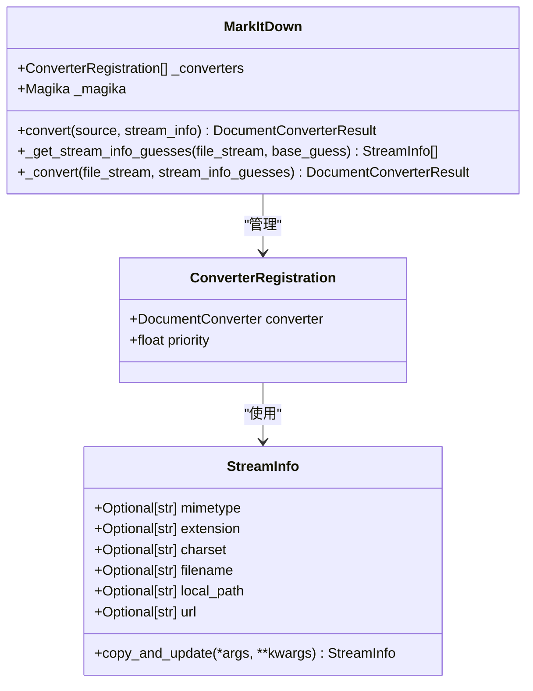
```mermaid
classDiagram
class StreamInfo {
+Optional[str] mimetype
+Optional[str] extension
+Optional[str] charset
+Optional[str] filename
+Optional[str] local_path
+Optional[str] url
+copy_and_update(*args, **kwargs) StreamInfo
}
class MarkItDown {
+ConverterRegistration[] _converters
+Magika _magika
+convert(source, stream_info) DocumentConverterResult
+_get_stream_info_guesses(file_stream, base_guess) StreamInfo[]
+_convert(file_stream, stream_info_guesses) DocumentConverterResult
}
class ConverterRegistration {
+DocumentConverter converter
+float priority
}
MarkItDown --> ConverterRegistration : "管理"
ConverterRegistration --> StreamInfo : "使用"
```

**图表来源**
- [_stream_info.py](file://packages/markitdown/src/markitdown/_stream_info.py#L5-L32)
- [_markitdown.py](file://packages/markitdown/src/markitdown/_markitdown.py#L54-L58)

### 字段用途详解

StreamInfo类的每个字段都有特定的用途和应用场景：

| 字段名 | 类型 | 描述 | 使用场景 |
|--------|------|------|----------|
| mimetype | Optional[str] | MIME类型标识符 | 文件类型识别、转换器选择决策 |
| extension | Optional[str] | 文件扩展名 | 基于扩展名的快速匹配、默认值提供 |
| charset | Optional[str] | 字符编码格式 | 文本文件正确解码、字符集规范化 |
| filename | Optional[str] | 完整文件名 | 用户界面显示、文件名相关逻辑 |
| local_path | Optional[str] | 本地文件路径 | 本地文件访问、相对路径解析 |
| url | Optional[str] | 来源URL | 网络资源处理、重定向追踪 |

### copy_and_update方法机制

copy_and_update方法实现了StreamInfo的不可变性原则，同时提供了灵活的对象更新能力：

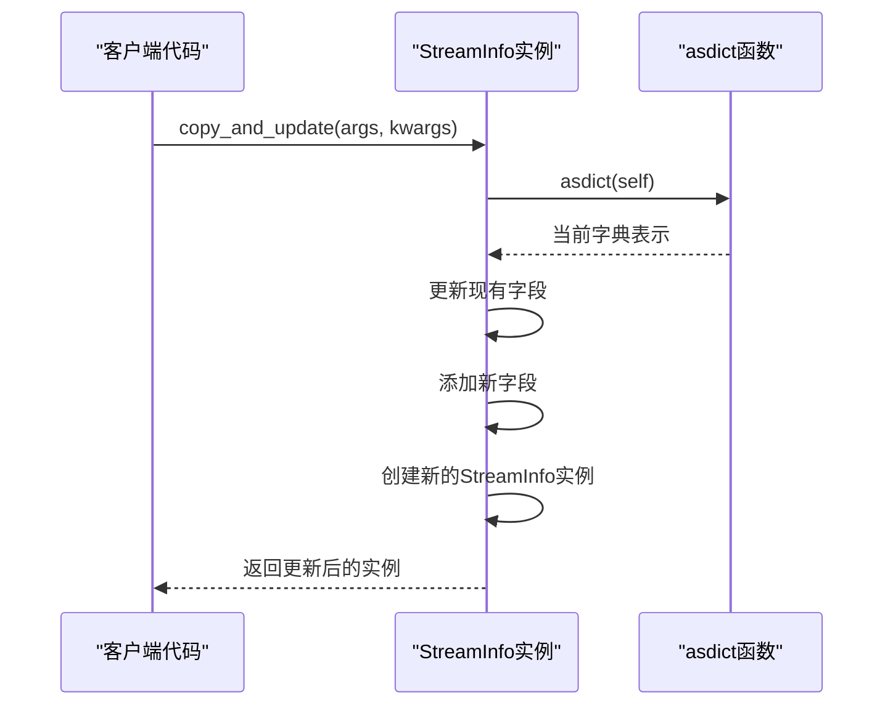
```mermaid
sequenceDiagram
participant Client as "客户端代码"
participant StreamInfo as "StreamInfo实例"
participant AsDict as "asdict函数"
Client->>StreamInfo : copy_and_update(args, kwargs)
StreamInfo->>AsDict : asdict(self)
AsDict-->>StreamInfo : 当前字典表示
StreamInfo->>StreamInfo : 更新现有字段
StreamInfo->>StreamInfo : 添加新字段
StreamInfo->>StreamInfo : 创建新的StreamInfo实例
StreamInfo-->>Client : 返回更新后的实例
```

**图表来源**
- [_stream_info.py](file://packages/markitdown/src/markitdown/_stream_info.py#L23-L32)

**章节来源**
- [_stream_info.py](file://packages/markitdown/src/markitdown/_stream_info.py#L1-L33)

## Magika文件类型识别

Magika是MarkItDown中用于智能文件类型识别的核心组件，它通过深度学习算法分析文件内容来确定准确的文件类型。

### Magika集成架构

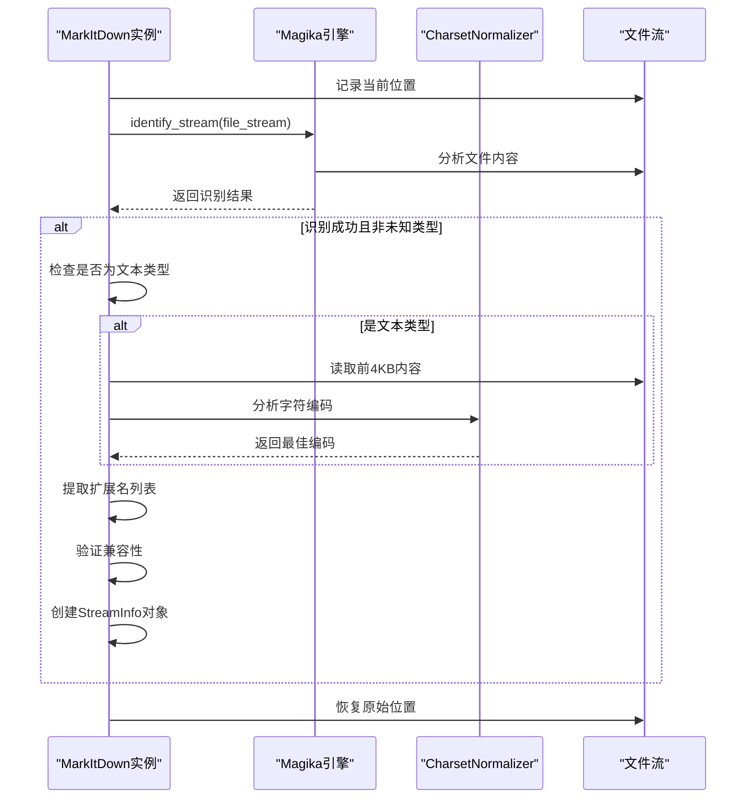
```mermaid
sequenceDiagram
participant MarkItDown as "MarkItDown实例"
participant Magika as "Magika引擎"
participant CharsetNormalizer as "CharsetNormalizer"
participant Stream as "文件流"
MarkItDown->>Stream : 记录当前位置
MarkItDown->>Magika : identify_stream(file_stream)
Magika->>Stream : 分析文件内容
Magika-->>MarkItDown : 返回识别结果
alt 识别成功且非未知类型
MarkItDown->>MarkItDown : 检查是否为文本类型
alt 是文本类型
MarkItDown->>Stream : 读取前4KB内容
MarkItDown->>CharsetNormalizer : 分析字符编码
CharsetNormalizer-->>MarkItDown : 返回最佳编码
end
MarkItDown->>MarkItDown : 提取扩展名列表
MarkItDown->>MarkItDown : 验证兼容性
MarkItDown->>MarkItDown : 创建StreamInfo对象
end
MarkItDown->>Stream : 恢复原始位置
```

**图表来源**
- [_markitdown.py](file://packages/markitdown/src/markitdown/_markitdown.py#L684-L764)

### 内容分析流程

Magika的内容分析遵循以下步骤：

1. **流位置保存**：在开始分析前保存当前文件流位置，确保分析后可以恢复原位置
2. **深度学习识别**：使用Magika的神经网络模型分析文件内容特征
3. **类型验证**：检查识别结果的状态和预测标签
4. **文本特性检测**：判断是否为文本文件以进行额外的字符编码分析
5. **扩展名提取**：从预测结果中提取可用的文件扩展名
6. **兼容性验证**：确保Magika的猜测与已知的StreamInfo信息兼容
7. **位置恢复**：无论成功与否，都恢复文件流到初始位置

### 字符编码处理

对于文本文件，MarkItDown实现了智能的字符编码检测：

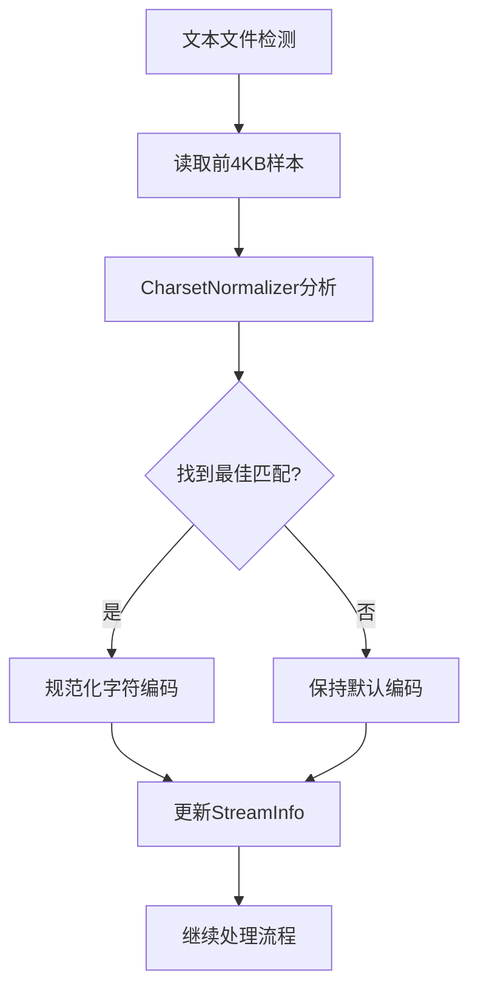
```mermaid
flowchart TD
TextFile["文本文件检测"] --> ReadSample["读取前4KB样本"]
ReadSample --> CharsetDetect["CharsetNormalizer分析"]
CharsetDetect --> BestMatch{"找到最佳匹配?"}
BestMatch --> |是| NormalizeCharset["规范化字符编码"]
BestMatch --> |否| KeepDefault["保持默认编码"]
NormalizeCharset --> UpdateStreamInfo["更新StreamInfo"]
KeepDefault --> UpdateStreamInfo
UpdateStreamInfo --> ContinueProcess["继续处理流程"]
```

**图表来源**
- [_markitdown.py](file://packages/markitdown/src/markitdown/_markitdown.py#L695-L705)

**章节来源**
- [_markitdown.py](file://packages/markitdown/src/markitdown/_markitdown.py#L684-L764)

## 转换器优先级系统

MarkItDown的转换器优先级系统是其架构的核心组件之一，通过数值优先级和稳定排序确保转换器按照预期顺序执行。

### 优先级定义与分类

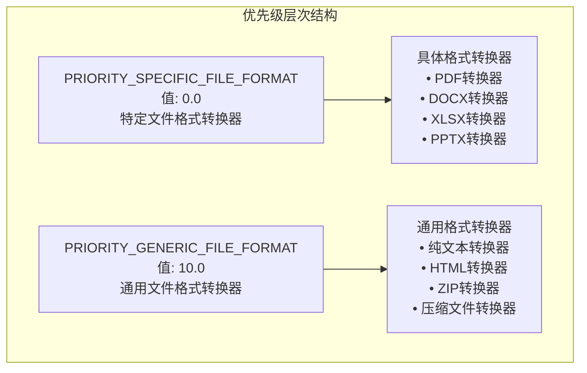
```mermaid
graph TD
subgraph "优先级层次结构"
P0["PRIORITY_SPECIFIC_FILE_FORMAT<br/>值: 0.0<br/>特定文件格式转换器"]
P10["PRIORITY_GENERIC_FILE_FORMAT<br/>值: 10.0<br/>通用文件格式转换器"]
P0 --> SpecificConverters["具体格式转换器<br/>• PDF转换器<br/>• DOCX转换器<br/>• XLSX转换器<br/>• PPTX转换器"]
P10 --> GenericConverters["通用格式转换器<br/>• 纯文本转换器<br/>• HTML转换器<br/>• ZIP转换器<br/>• 压缩文件转换器"]
end
```

**图表来源**
- [_markitdown.py](file://packages/markitdown/src/markitdown/_markitdown.py#L44-L49)

### 转换器注册机制

转换器注册通过register_converter方法实现，支持自定义优先级：

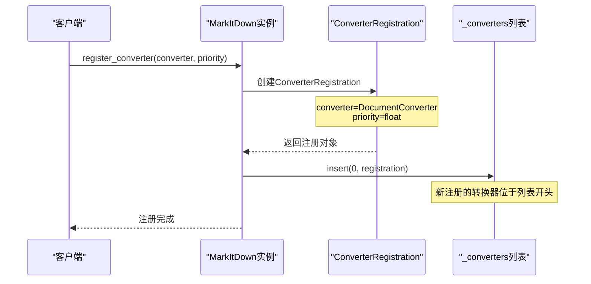
```mermaid
sequenceDiagram
participant Client as "客户端"
participant MarkItDown as "MarkItDown实例"
participant ConverterReg as "ConverterRegistration"
participant ConvertersList as "_converters列表"
Client->>MarkItDown : register_converter(converter, priority)
MarkItDown->>ConverterReg : 创建ConverterRegistration
Note over ConverterReg : converter=DocumentConverter<br/>priority=float
ConverterReg-->>MarkItDown : 返回注册对象
MarkItDown->>ConvertersList : insert(0, registration)
Note over ConvertersList : 新注册的转换器位于列表开头
MarkItDown-->>Client : 注册完成
```

**图表来源**
- [_markitdown.py](file://packages/markitdown/src/markitdown/_markitdown.py#L643-L652)

### 优先级排序算法

转换器排序使用Python的稳定排序算法，确保相同优先级的转换器保持注册顺序：

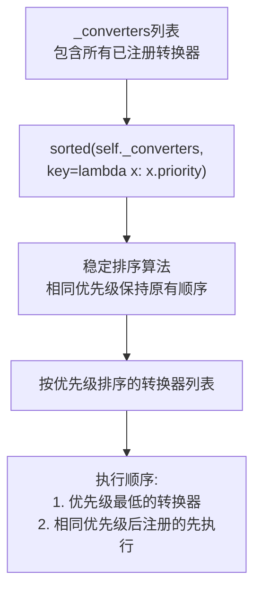
```mermaid
flowchart TD
CurrentConverters["_converters列表<br/>包含所有已注册转换器"] --> SortOperation["sorted(self._converters,<br/>key=lambda x: x.priority)"]
SortOperation --> StableSort["稳定排序算法<br/>相同优先级保持原有顺序"]
StableSort --> SortedRegistrations["按优先级排序的转换器列表"]
SortedRegistrations --> ExecutionOrder["执行顺序:<br/>1. 优先级最低的转换器<br/>2. 相同优先级后注册的先执行"]
```

**图表来源**
- [_markitdown.py](file://packages/markitdown/src/markitdown/_markitdown.py#L539-L541)

### 优先级策略详解

| 优先级范围 | 转换器类型 | 优先级值 | 设计目的 |
|------------|------------|----------|----------|
| 0.0 | 特定文件格式 | PRIORITY_SPECIFIC_FILE_FORMAT | 确保专业格式转换器优先处理 |
| 10.0 | 通用文件格式 | PRIORITY_GENERIC_FILE_FORMAT | 作为后备方案处理未明确格式 |
| 自定义 | 插件转换器 | 任意浮点数 | 允许插件控制执行顺序 |

**章节来源**
- [_markitdown.py](file://packages/markitdown/src/markitdown/_markitdown.py#L44-L49)
- [_markitdown.py](file://packages/markitdown/src/markitdown/_markitdown.py#L643-L682)

## 责任链模式实现

MarkItDown采用责任链模式来实现转换器的选择和执行，这种模式确保每个转换器只有在适合时才会被调用。

### 责任链执行流程

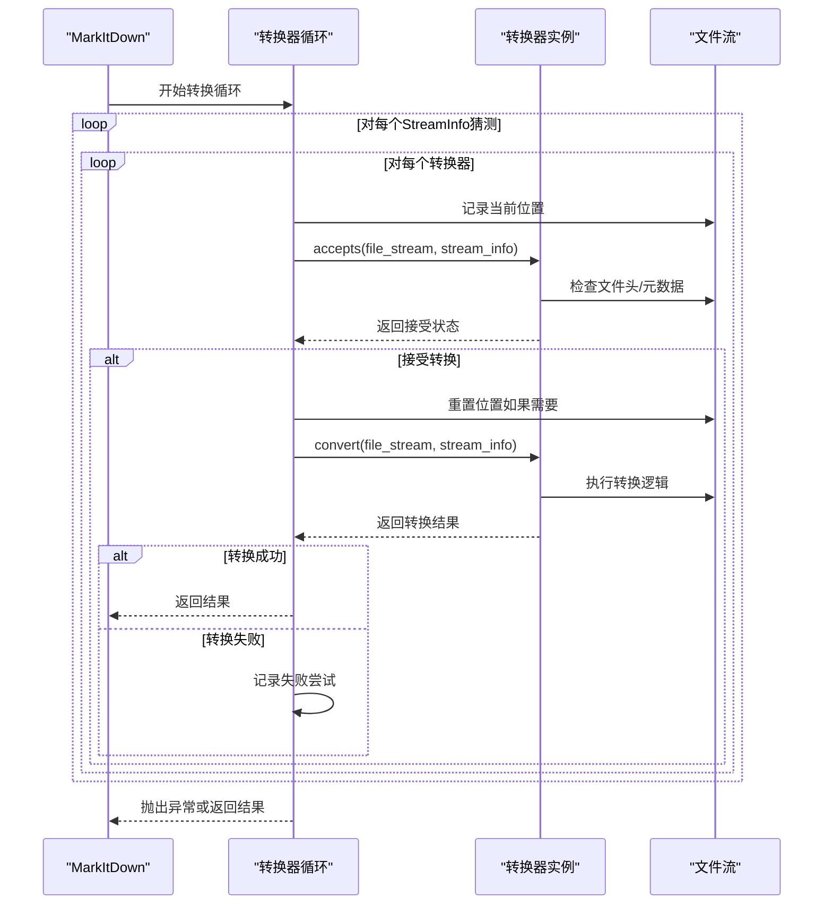
```mermaid
sequenceDiagram
participant MarkItDown as "MarkItDown"
participant ConverterLoop as "转换器循环"
participant Converter as "转换器实例"
participant FileStream as "文件流"
MarkItDown->>ConverterLoop : 开始转换循环
loop 对每个StreamInfo猜测
loop 对每个转换器
ConverterLoop->>FileStream : 记录当前位置
ConverterLoop->>Converter : accepts(file_stream, stream_info)
Converter->>FileStream : 检查文件头/元数据
Converter-->>ConverterLoop : 返回接受状态
alt 接受转换
ConverterLoop->>FileStream : 重置位置如果需要
ConverterLoop->>Converter : convert(file_stream, stream_info)
Converter->>FileStream : 执行转换逻辑
Converter-->>ConverterLoop : 返回转换结果
alt 转换成功
ConverterLoop-->>MarkItDown : 返回结果
else 转换失败
ConverterLoop->>ConverterLoop : 记录失败尝试
end
end
end
end
ConverterLoop-->>MarkItDown : 抛出异常或返回结果
```

**图表来源**
- [_markitdown.py](file://packages/markitdown/src/markitdown/_markitdown.py#L539-L620)

### 流位置管理

责任链模式中的流位置管理至关重要，确保每个转换器都能从正确的起始位置开始处理：

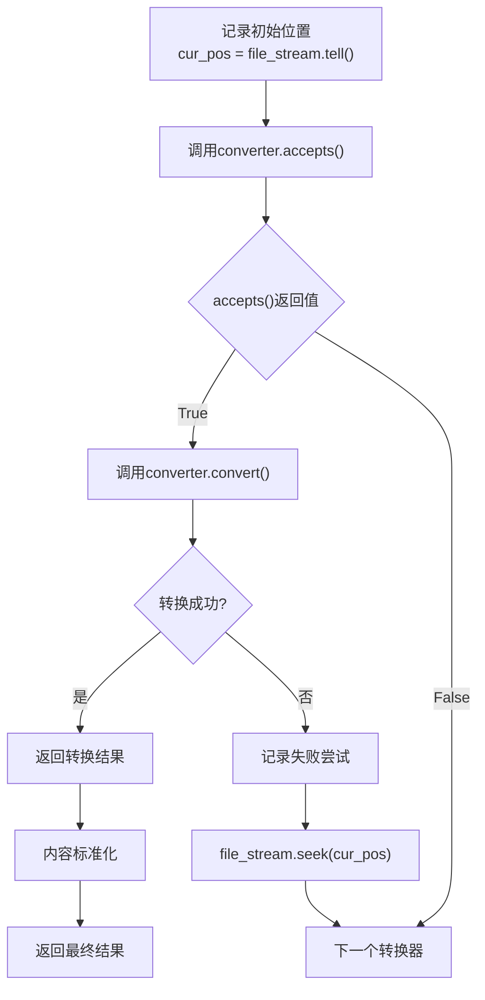
```mermaid
flowchart TD
StartPos["记录初始位置<br/>cur_pos = file_stream.tell()"] --> AcceptCall["调用converter.accepts()"]
AcceptCall --> AcceptResult{"accepts()返回值"}
AcceptResult --> |True| ConvertCall["调用converter.convert()"]
AcceptResult --> |False| NextConverter["下一个转换器"]
ConvertCall --> ConvertSuccess{"转换成功?"}
ConvertSuccess --> |是| ReturnResult["返回转换结果"]
ConvertSuccess --> |否| RecordFailure["记录失败尝试"]
RecordFailure --> RestorePos["file_stream.seek(cur_pos)"]
RestorePos --> NextConverter
ReturnResult --> NormalizeContent["内容标准化"]
NormalizeContent --> End["返回最终结果"]
```

**图表来源**
- [_markitdown.py](file://packages/markitdown/src/markitdown/_markitdown.py#L585-L618)

### 多猜测策略

MarkItDown实现了智能的多猜测策略，为每个输入源生成多个StreamInfo猜测：

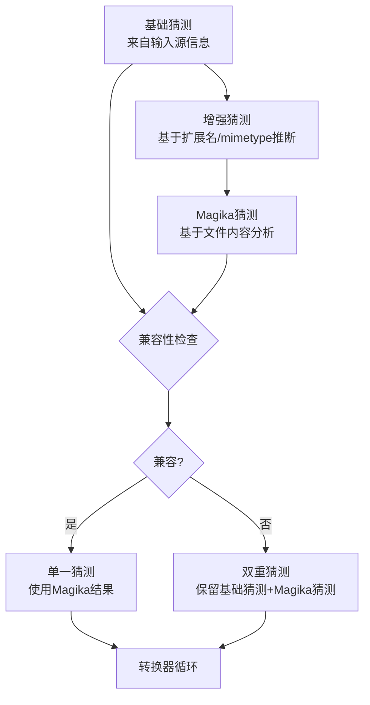
```mermaid
graph TD
BaseGuess["基础猜测<br/>来自输入源信息"] --> EnhancedGuess["增强猜测<br/>基于扩展名/mimetype推断"]
EnhancedGuess --> MagikaGuess["Magika猜测<br/>基于文件内容分析"]
BaseGuess --> CompatibleCheck{"兼容性检查"}
MagikaGuess --> CompatibleCheck
CompatibleCheck --> Compatible{"兼容?"}
Compatible --> |是| SingleGuess["单一猜测<br/>使用Magika结果"]
Compatible --> |否| DualGuess["双重猜测<br/>保留基础猜测+Magika猜测"]
SingleGuess --> ConverterLoop["转换器循环"]
DualGuess --> ConverterLoop
```

**图表来源**
- [_markitdown.py](file://packages/markitdown/src/markitdown/_markitdown.py#L684-L764)

**章节来源**
- [_markitdown.py](file://packages/markitdown/src/markitdown/_markitdown.py#L539-L620)

## 错误处理机制

MarkItDown实现了分层的错误处理机制，从转换器级别的异常到全局异常处理，确保系统在遇到问题时能够优雅地降级或报告错误。

### 异常层次结构

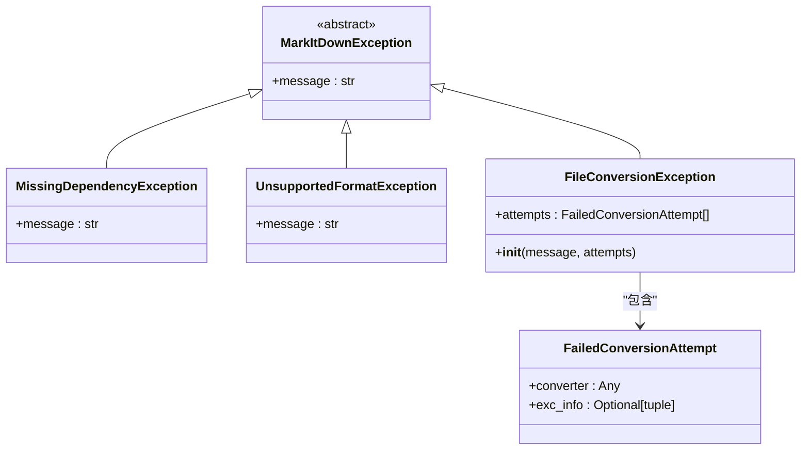
```mermaid
classDiagram
class MarkItDownException {
<<abstract>>
+message : str
}
class MissingDependencyException {
+message : str
}
class UnsupportedFormatException {
+message : str
}
class FileConversionException {
+attempts : FailedConversionAttempt[]
+__init__(message, attempts)
}
class FailedConversionAttempt {
+converter : Any
+exc_info : Optional[tuple]
}
MarkItDownException <|-- MissingDependencyException
MarkItDownException <|-- UnsupportedFormatException
MarkItDownException <|-- FileConversionException
FileConversionException --> FailedConversionAttempt : "包含"
```

**图表来源**
- [_exceptions.py](file://packages/markitdown/src/markitdown/_exceptions.py#L10-L76)

### 异常触发条件

| 异常类型 | 触发条件 | 处理策略 | 示例场景 |
|----------|----------|----------|----------|
| MissingDependencyException | 转换器依赖缺失 | 跳过该转换器 | PDF转换器缺少pdfminer库 |
| UnsupportedFormatException | 无合适转换器 | 抛出异常，报告不支持的格式 | 二进制文件.png |
| FileConversionException | 有转换器但转换失败 | 收集所有失败尝试，抛出聚合异常 | PDF文件损坏 |

### 错误收集与报告

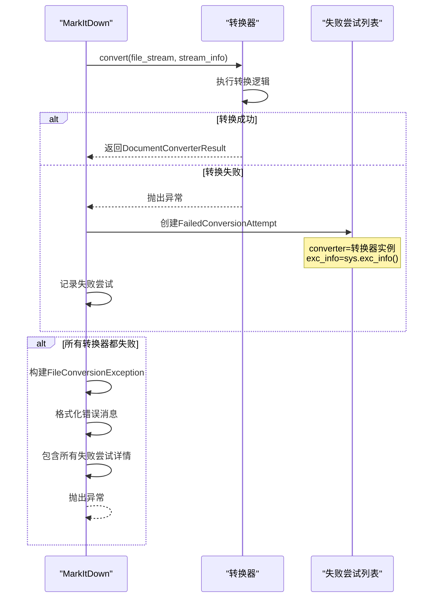
```mermaid
sequenceDiagram
participant MarkItDown as "MarkItDown"
participant Converter as "转换器"
participant FailedAttempts as "失败尝试列表"
MarkItDown->>Converter : convert(file_stream, stream_info)
Converter->>Converter : 执行转换逻辑
alt 转换成功
Converter-->>MarkItDown : 返回DocumentConverterResult
else 转换失败
Converter-->>MarkItDown : 抛出异常
MarkItDown->>FailedAttempts : 创建FailedConversionAttempt
Note over FailedAttempts : converter=转换器实例<br/>exc_info=sys.exc_info()
MarkItDown->>MarkItDown : 记录失败尝试
end
alt 所有转换器都失败
MarkItDown->>MarkItDown : 构建FileConversionException
MarkItDown->>MarkItDown : 格式化错误消息
MarkItDown->>MarkItDown : 包含所有失败尝试详情
MarkItDown-->>MarkItDown : 抛出异常
end
```

**图表来源**
- [_markitdown.py](file://packages/markitdown/src/markitdown/_markitdown.py#L595-L605)
- [_exceptions.py](file://packages/markitdown/src/markitdown/_exceptions.py#L50-L76)

### 内容标准化处理

在转换成功后，MarkItDown会执行内容标准化处理：

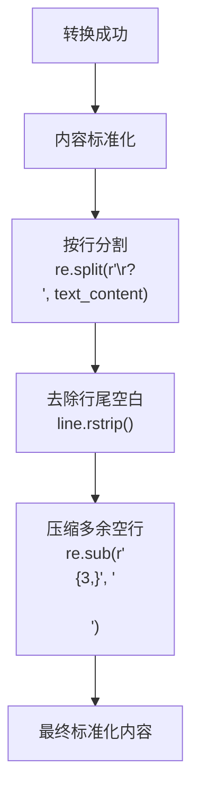
```mermaid
flowchart TD
ConvertSuccess["转换成功"] --> NormalizeContent["内容标准化"]
NormalizeContent --> SplitLines["按行分割<br/>re.split(r'\r?\n', text_content)"]
SplitLines --> StripWhitespace["去除行尾空白<br/>line.rstrip()"]
StripWhitespace --> CompressEmptyLines["压缩多余空行<br/>re.sub(r'\n{3,}', '\n\n')"]
CompressEmptyLines --> FinalResult["最终标准化内容"]
```

**图表来源**
- [_markitdown.py](file://packages/markitdown/src/markitdown/_markitdown.py#L610-L618)

**章节来源**
- [_exceptions.py](file://packages/markitdown/src/markitdown/_exceptions.py#L1-L77)
- [_markitdown.py](file://packages/markitdown/src/markitdown/_markitdown.py#L595-L620)

## 实际数据流处理

MarkItDown对不同类型的数据流提供了专门的处理策略，确保每种输入源都能得到最优的处理方式。

### 输入源类型处理

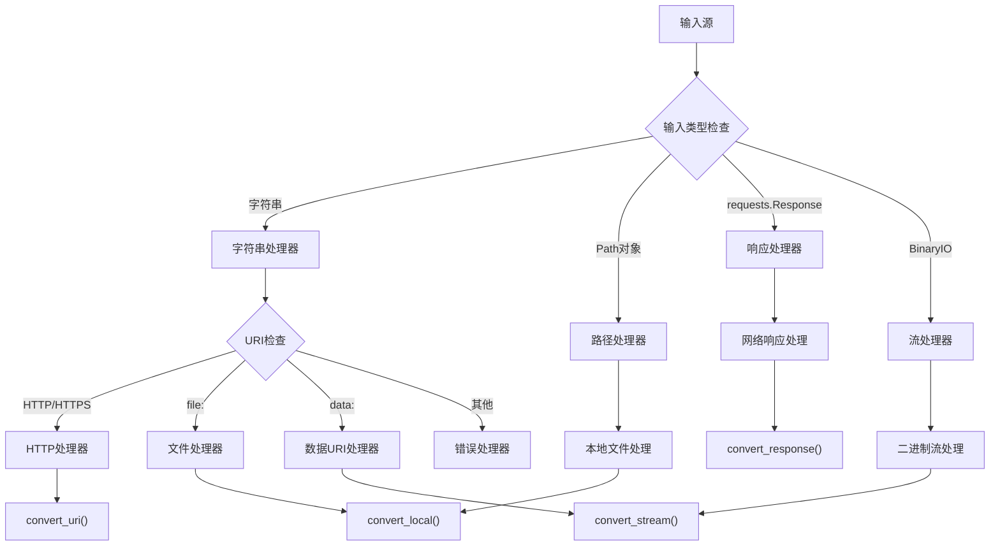
```mermaid
graph TD
InputSource["输入源"] --> TypeCheck{"输入类型检查"}
TypeCheck --> |字符串| StringHandler["字符串处理器"]
TypeCheck --> |Path对象| PathHandler["路径处理器"]
TypeCheck --> |requests.Response| ResponseHandler["响应处理器"]
TypeCheck --> |BinaryIO| StreamHandler["流处理器"]
StringHandler --> UriCheck{"URI检查"}
UriCheck --> |HTTP/HTTPS| HttpHandler["HTTP处理器"]
UriCheck --> |file:| FileHandler["文件处理器"]
UriCheck --> |data:| DataHandler["数据URI处理器"]
UriCheck --> |其他| ErrorHandler["错误处理器"]
PathHandler --> LocalFile["本地文件处理"]
ResponseHandler --> NetworkResponse["网络响应处理"]
StreamHandler --> BinaryStream["二进制流处理"]
HttpHandler --> ConvertUri["convert_uri()"]
FileHandler --> ConvertLocal["convert_local()"]
DataHandler --> ConvertStream["convert_stream()"]
LocalFile --> ConvertLocal
NetworkResponse --> ConvertResponse["convert_response()"]
BinaryStream --> ConvertStream
```

**图表来源**
- [_markitdown.py](file://packages/markitdown/src/markitdown/_markitdown.py#L258-L280)

### 数据流预处理

对于二进制流，MarkItDown实现了智能的预处理机制：

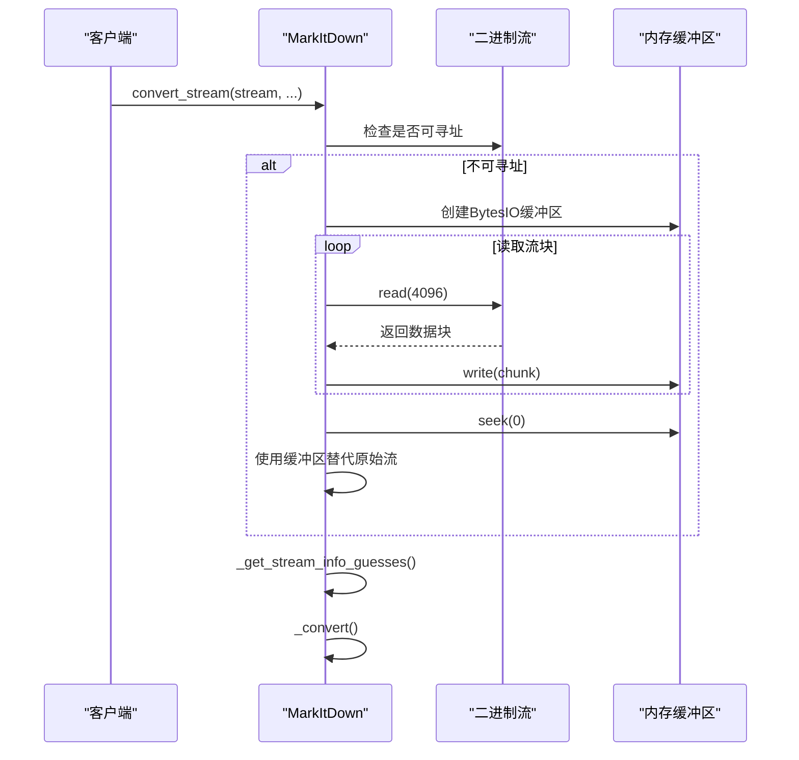
```mermaid
sequenceDiagram
participant Client as "客户端"
participant MarkItDown as "MarkItDown"
participant Stream as "二进制流"
participant Buffer as "内存缓冲区"
Client->>MarkItDown : convert_stream(stream, ...)
MarkItDown->>Stream : 检查是否可寻址
alt 不可寻址
MarkItDown->>Buffer : 创建BytesIO缓冲区
loop 读取流块
MarkItDown->>Stream : read(4096)
Stream-->>MarkItDown : 返回数据块
MarkItDown->>Buffer : write(chunk)
end
MarkItDown->>Buffer : seek(0)
MarkItDown->>MarkItDown : 使用缓冲区替代原始流
end
MarkItDown->>MarkItDown : _get_stream_info_guesses()
MarkItDown->>MarkItDown : _convert()
```

**图表来源**
- [_markitdown.py](file://packages/markitdown/src/markitdown/_markitdown.py#L320-L340)

### 网络响应处理

网络响应的处理包含了丰富的元数据提取：

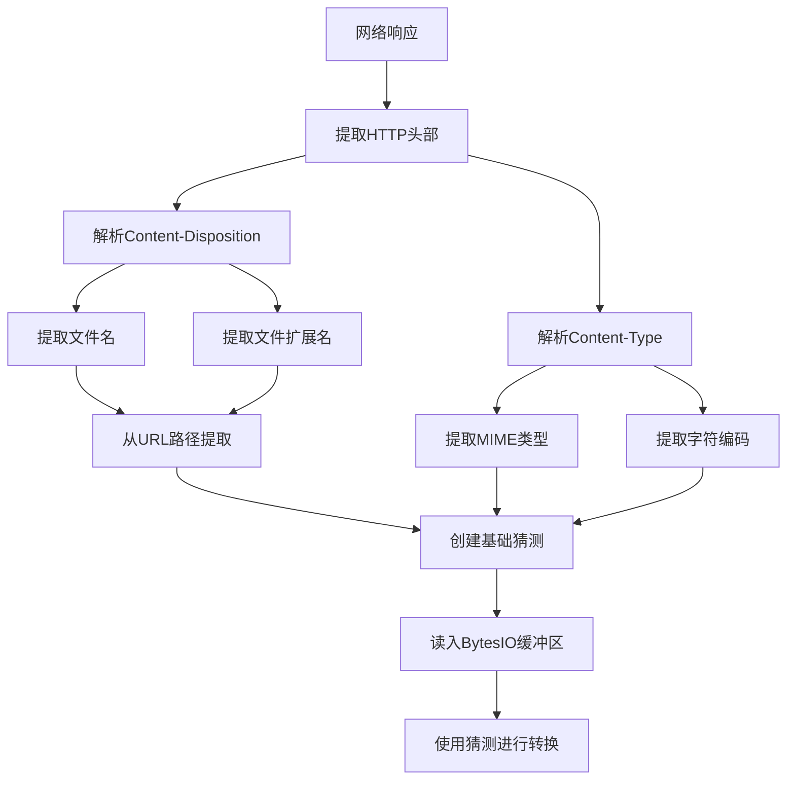
```mermaid
flowchart TD
NetworkResponse["网络响应"] --> ExtractHeaders["提取HTTP头部"]
ExtractHeaders --> ContentType["解析Content-Type"]
ExtractHeaders --> ContentDisp["解析Content-Disposition"]
ContentType --> MimeType["提取MIME类型"]
ContentType --> Charset["提取字符编码"]
ContentDisp --> FileName["提取文件名"]
ContentDisp --> FileExt["提取文件扩展名"]
FileName --> UrlPath["从URL路径提取"]
FileExt --> UrlPath
UrlPath --> CreateBaseGuess["创建基础猜测"]
MimeType --> CreateBaseGuess
Charset --> CreateBaseGuess
CreateBaseGuess --> ReadIntoBuffer["读入BytesIO缓冲区"]
ReadIntoBuffer --> ConvertWithGuesses["使用猜测进行转换"]
```

**图表来源**
- [_markitdown.py](file://packages/markitdown/src/markitdown/_markitdown.py#L499-L536)

### 转换器接口实现

以PDF转换器为例，展示转换器的标准实现模式：

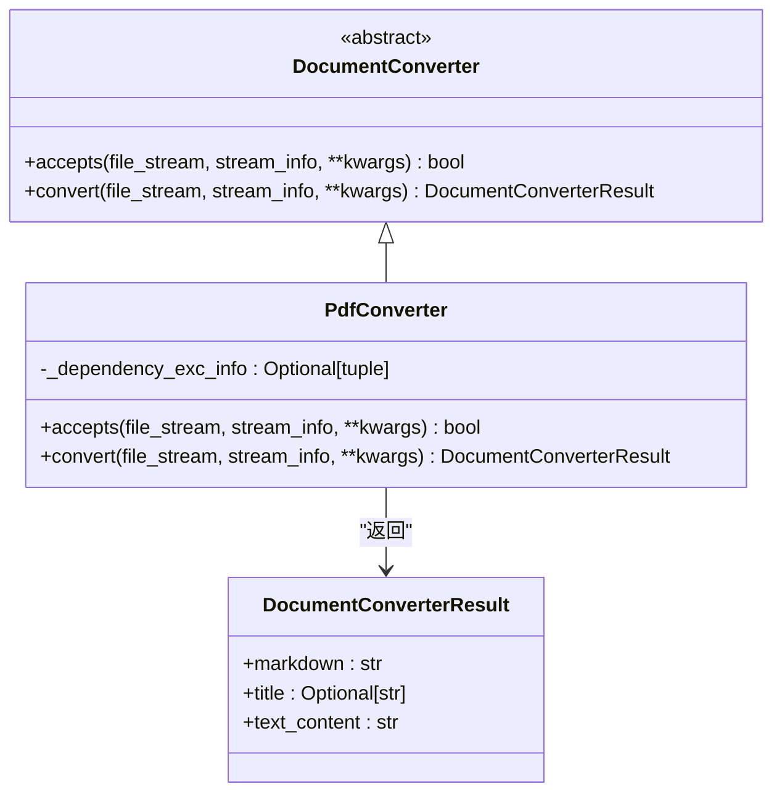
```mermaid
classDiagram
class DocumentConverter {
<<abstract>>
+accepts(file_stream, stream_info, **kwargs) bool
+convert(file_stream, stream_info, **kwargs) DocumentConverterResult
}
class PdfConverter {
+accepts(file_stream, stream_info, **kwargs) bool
+convert(file_stream, stream_info, **kwargs) DocumentConverterResult
-_dependency_exc_info : Optional[tuple]
}
class DocumentConverterResult {
+markdown : str
+title : Optional[str]
+text_content : str
}
DocumentConverter <|-- PdfConverter
PdfConverter --> DocumentConverterResult : "返回"
```

**图表来源**
- [_pdf_converter.py](file://packages/markitdown/src/markitdown/converters/_pdf_converter.py#L20-L77)
- [_base_converter.py](file://packages/markitdown/src/markitdown/_base_converter.py#L6-L35)

**章节来源**
- [_markitdown.py](file://packages/markitdown/src/markitdown/_markitdown.py#L258-L536)
- [_pdf_converter.py](file://packages/markitdown/src/markitdown/converters/_pdf_converter.py#L1-L78)

## 总结

MarkItDown的核心概念体现了现代软件架构的最佳实践，通过以下关键设计实现了高效、可靠的文档转换：

### 架构优势

1. **模块化设计**：每个转换器都是独立的模块，易于维护和扩展
2. **智能识别**：结合Magika和传统MIME类型检测，提供高精度的文件类型识别
3. **优先级控制**：通过数值优先级和稳定排序，确保转换器按预期顺序执行
4. **责任链模式**：避免不必要的转换操作，提高系统效率
5. **完善的错误处理**：分层异常处理机制，提供清晰的错误诊断信息

### 技术创新

- **多猜测策略**：通过多种方式生成StreamInfo猜测，提高转换成功率
- **流位置管理**：确保转换器不会影响文件流的后续处理
- **内容标准化**：统一转换结果的格式，提供一致的用户体验
- **插件支持**：通过入口点机制支持第三方转换器扩展

### 应用价值

MarkItDown的设计不仅解决了文档转换的技术挑战，更为构建类似的转换系统提供了可参考的架构模式。其核心概念——从StreamInfo到转换器优先级，再到责任链模式的实现——都是现代软件架构中的重要组成部分。

通过深入理解这些核心概念，开发者可以更好地利用MarkItDown的功能，同时也能够借鉴其设计思想来构建自己的文档处理解决方案。